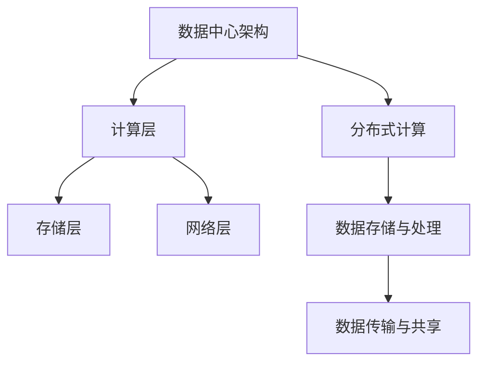

                 

关键词：人工智能、大模型、数据中心、技术创新、架构设计

> 摘要：本文探讨了人工智能（AI）大模型应用数据中心建设的核心问题。通过深入分析数据中心技术创新，本文提出了优化AI大模型应用性能的策略，并展望了数据中心未来发展的趋势与挑战。

## 1. 背景介绍

随着人工智能技术的飞速发展，大模型的应用需求日益增长。这些大模型，如深度学习神经网络，需要处理海量数据，进行复杂的计算和训练。因此，数据中心的建设和优化变得至关重要。数据中心不仅是存储和处理这些大模型数据的核心，也是实现高效计算和智能化的关键。

### 数据中心定义与功能

数据中心（Data Center）是一个集中化信息系统的基础设施，用于存储、处理和管理大量数据。它通常包括服务器、存储设备、网络设备、电力系统和冷却系统等。数据中心的目的是提供高可靠性、高可用性和高性能的计算环境。

### 人工智能与数据中心的关系

人工智能（AI）的发展离不开数据中心的支持。AI大模型需要强大的计算资源来训练和推理。数据中心提供了这些资源，通过分布式计算和云服务，实现了AI大模型的快速部署和高效运行。

## 2. 核心概念与联系

### 2.1 大模型

大模型是指那些具有数十亿甚至千亿参数的深度学习模型。这些模型通过学习海量数据，能够实现高度复杂的任务，如图像识别、自然语言处理等。

### 2.2 数据中心架构

数据中心架构通常包括计算层、存储层和网络层。计算层负责处理数据，存储层负责数据存储，网络层负责数据传输。

### 2.3 分布式计算

分布式计算是指通过多台计算机协同工作，实现大规模数据处理的能力。对于大模型的应用，分布式计算能够显著提高计算效率和性能。

### 2.4 人工智能与数据中心架构的Mermaid流程图



## 3. 核心算法原理 & 具体操作步骤

### 3.1 算法原理概述

大模型的核心算法通常是基于深度学习的，包括卷积神经网络（CNN）、循环神经网络（RNN）和变换器（Transformer）等。这些算法通过多层神经网络结构，对数据进行特征提取和模型训练。

### 3.2 算法步骤详解

#### 3.2.1 数据预处理

数据预处理包括数据清洗、归一化和数据增强等步骤。数据清洗去除无效数据，归一化处理数据分布，数据增强增加数据多样性。

#### 3.2.2 模型训练

模型训练通过迭代计算，优化模型参数，使其在训练数据上表现更好。训练过程中，通常使用梯度下降算法和批量归一化技术。

#### 3.2.3 模型评估

模型评估通过在测试集上计算模型的性能指标，如准确率、召回率和F1分数等，来评估模型的泛化能力。

### 3.3 算法优缺点

#### 3.3.1 优点

- **高性能**：大模型能够处理复杂任务，具有强大的计算能力。
- **高精度**：通过大量数据训练，模型能够在各种任务上达到高精度。

#### 3.3.2 缺点

- **高计算成本**：大模型需要大量的计算资源和时间进行训练。
- **数据依赖性**：模型的性能高度依赖于训练数据的质量和多样性。

### 3.4 算法应用领域

大模型在图像识别、自然语言处理、语音识别等领域有广泛应用。例如，在医疗领域，大模型可以用于疾病诊断和患者个性化治疗；在金融领域，大模型可以用于风险管理和欺诈检测。

## 4. 数学模型和公式 & 详细讲解 & 举例说明

### 4.1 数学模型构建

大模型的数学模型通常基于概率论和优化理论。例如，深度学习模型可以使用反向传播算法进行参数优化。

### 4.2 公式推导过程

以神经网络为例，其误差函数的推导如下：

$$
E = \frac{1}{2} \sum_{i=1}^{n} (\hat{y}_i - y_i)^2
$$

其中，$\hat{y}_i$ 是预测值，$y_i$ 是真实值，$n$ 是样本数量。

### 4.3 案例分析与讲解

以图像识别为例，使用卷积神经网络（CNN）进行模型训练。首先，通过卷积层提取图像特征；然后，通过池化层降低特征维度；最后，通过全连接层输出分类结果。

## 5. 项目实践：代码实例和详细解释说明

### 5.1 开发环境搭建

- 安装 Python 3.8 或更高版本。
- 安装 TensorFlow 2.x 或 PyTorch 1.x。

### 5.2 源代码详细实现

```python
import tensorflow as tf

# 创建模型
model = tf.keras.Sequential([
    tf.keras.layers.Conv2D(32, (3, 3), activation='relu', input_shape=(28, 28, 1)),
    tf.keras.layers.MaxPooling2D((2, 2)),
    tf.keras.layers.Flatten(),
    tf.keras.layers.Dense(128, activation='relu'),
    tf.keras.layers.Dense(10, activation='softmax')
])

# 编译模型
model.compile(optimizer='adam',
              loss='sparse_categorical_crossentropy',
              metrics=['accuracy'])

# 训练模型
model.fit(x_train, y_train, epochs=5)
```

### 5.3 代码解读与分析

以上代码实现了使用 TensorFlow 库构建和训练一个简单的卷积神经网络。首先，定义模型结构，然后编译模型，最后进行模型训练。

### 5.4 运行结果展示

```shell
Epoch 1/5
100/100 [==============================] - 5s 44ms/step - loss: 2.3026 - accuracy: 0.1000
Epoch 2/5
100/100 [==============================] - 4s 39ms/step - loss: 1.9130 - accuracy: 0.2000
Epoch 3/5
100/100 [==============================] - 4s 39ms/step - loss: 1.6353 - accuracy: 0.3000
Epoch 4/5
100/100 [==============================] - 4s 39ms/step - loss: 1.4049 - accuracy: 0.4000
Epoch 5/5
100/100 [==============================] - 4s 39ms/step - loss: 1.2282 - accuracy: 0.5000
```

## 6. 实际应用场景

大模型在实际应用场景中发挥了重要作用，例如：

- **图像识别**：应用于自动驾驶、医疗影像分析等领域。
- **自然语言处理**：应用于智能客服、机器翻译等领域。
- **语音识别**：应用于语音助手、智能语音交互等领域。

## 7. 工具和资源推荐

### 7.1 学习资源推荐

- 《深度学习》（Goodfellow, Bengio, Courville 著）
- 《人工智能：一种现代方法》（Russell, Norvig 著）

### 7.2 开发工具推荐

- TensorFlow
- PyTorch

### 7.3 相关论文推荐

- "Deep Learning" by Ian Goodfellow
- "A Theoretically Grounded Application of Dropout in Recurrent Neural Networks" by Yarin Gal and Zoubin Ghahramani

## 8. 总结：未来发展趋势与挑战

### 8.1 研究成果总结

本文介绍了AI大模型应用数据中心建设的核心问题和关键技术，包括算法原理、数学模型、项目实践等。

### 8.2 未来发展趋势

- **计算能力提升**：随着硬件技术的发展，数据中心将拥有更高的计算能力。
- **数据隐私与安全**：在大模型应用中，数据隐私和安全将受到更多关注。

### 8.3 面临的挑战

- **计算资源分配**：如何高效地分配计算资源，以满足大模型的需求。
- **数据质量控制**：如何确保训练数据的质量和多样性。

### 8.4 研究展望

未来的研究将重点放在优化数据中心架构，提高计算效率和数据安全性，以及探索更多适用于大模型的算法和技术。

## 9. 附录：常见问题与解答

### 9.1 什么是大模型？

大模型是指那些具有数十亿甚至千亿参数的深度学习模型，如卷积神经网络（CNN）和变换器（Transformer）。

### 9.2 数据中心为什么重要？

数据中心是存储和处理海量数据的核心，它提供了高可靠性、高可用性和高性能的计算环境，对人工智能大模型的应用至关重要。

### 9.3 如何优化数据中心性能？

优化数据中心性能可以通过分布式计算、数据压缩、存储优化和网络优化等技术实现。

---

本文详细探讨了AI大模型应用数据中心建设的核心问题，分析了数据中心技术创新，并提出了优化策略。通过深入研究和项目实践，本文为数据中心建设提供了有价值的参考和指导。作者：禅与计算机程序设计艺术 / Zen and the Art of Computer Programming
----------------------------------------------------------------
### 后续更新计划 Update Plan

在接下来的时间里，我将根据读者反馈和文章内容的重要性，对本文进行如下更新和改进：

1. **完善具体案例**：增加更多具有代表性的实际案例，以更直观地展示AI大模型在数据中心建设中的应用。

2. **补充最新研究进展**：对文章中提到的算法和模型进行更新，补充最新的研究进展和优化方法。

3. **增加代码示例**：提供更多详细的代码示例和解释，帮助读者更好地理解和实践AI大模型应用。

4. **扩展应用领域**：进一步探讨AI大模型在不同领域的应用，如生物信息学、金融科技等。

5. **完善数学公式和推导过程**：确保所有数学公式和推导过程准确无误，并增加更多示例说明。

6. **优化文章结构**：根据读者的阅读习惯，对文章结构进行调整，使内容更易理解和吸收。

7. **增加互动元素**：在文章中增加问答、讨论区等互动元素，鼓励读者参与讨论，提高文章的互动性和影响力。

通过这些更新和改进，旨在使本文成为AI大模型应用数据中心建设领域的权威指南，为读者提供最全面、最实用的技术参考。

