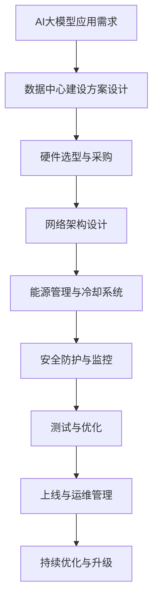

                 

关键词：AI 大模型，数据中心建设，投资与建设，技术架构，优化方案，成本效益分析

> 摘要：本文探讨了AI大模型应用数据中心建设的关键因素，包括投资决策、建设方案、技术架构优化以及成本效益分析。文章通过深入分析，旨在为AI大模型数据中心的建设提供有价值的指导和建议。

## 1. 背景介绍

随着人工智能技术的迅猛发展，AI大模型的应用已经渗透到各行各业，从自然语言处理到图像识别，从推荐系统到自动化决策，AI大模型正日益成为企业提升核心竞争力的关键。为了支持这些复杂且计算密集型的应用，数据中心的建设显得尤为重要。数据中心不仅是存储和管理大量数据的枢纽，也是运行AI大模型的核心基础设施。

然而，数据中心建设涉及诸多方面，包括硬件选型、网络架构、能源管理、安全性等。同时，投资决策也是一大挑战，如何在确保高性能的前提下，实现成本效益最大化，是企业面临的重要问题。本文将围绕这些核心问题，探讨AI大模型应用数据中心的建设策略。

## 2. 核心概念与联系

### 2.1 数据中心定义与分类

数据中心（Data Center）是指专门用于存储、处理和管理大量数据的设施。根据规模和功能，数据中心可分为以下几类：

- 企业级数据中心：服务于大型企业，拥有海量存储和强大的计算能力。
- 区域性数据中心：服务于特定地区或城市，为中小企业提供服务。
- 云数据中心：基于云计算技术，提供弹性的计算资源和存储服务。

### 2.2 AI大模型数据中心特性

AI大模型数据中心具有以下特性：

- 高性能计算：支持大规模并行计算，满足AI大模型的计算需求。
- 大数据存储：提供海量数据存储能力，满足数据密集型应用的需求。
- 弹性伸缩：根据业务需求动态调整资源，实现高效资源利用。

### 2.3 Mermaid 流程图



## 3. 核心算法原理 & 具体操作步骤

### 3.1 算法原理概述

AI大模型数据中心的建设涉及到多个核心算法，主要包括：

- 分布式计算算法：实现并行计算，提高数据处理效率。
- 存储优化算法：提高数据存储密度和访问速度。
- 负载均衡算法：实现计算资源和网络资源的合理分配。

### 3.2 算法步骤详解

#### 3.2.1 分布式计算算法

1. **任务划分**：将大型任务划分为多个小任务，分发到不同计算节点。
2. **数据并行**：不同计算节点独立处理各自的数据。
3. **结果合并**：将各个节点的计算结果进行合并，得到最终结果。

#### 3.2.2 存储优化算法

1. **数据压缩**：采用数据压缩算法，减少存储空间需求。
2. **冷热数据分离**：将经常访问的数据（热数据）和较少访问的数据（冷数据）分开存储。
3. **多级存储**：根据数据访问频率和重要性，采用不同级别的存储介质。

#### 3.2.3 负载均衡算法

1. **流量监控**：实时监控数据流量和负载情况。
2. **负载分配**：根据监控结果，动态调整计算节点和存储节点的负载。
3. **动态调整**：根据业务需求和系统性能，实时调整资源分配策略。

### 3.3 算法优缺点

#### 分布式计算算法

- 优点：提高数据处理速度，实现并行计算。
- 缺点：数据传输开销较大，系统复杂度高。

#### 存储优化算法

- 优点：减少存储空间需求，提高数据访问速度。
- 缺点：数据压缩和解压缩过程增加计算负担。

#### 负载均衡算法

- 优点：实现资源合理分配，提高系统稳定性。
- 缺点：负载监控和动态调整增加系统开销。

### 3.4 算法应用领域

分布式计算算法广泛应用于大数据处理、机器学习和深度学习等领域；存储优化算法在云存储、大数据平台等领域具有重要应用；负载均衡算法在分布式系统、云计算等领域具有广泛的应用前景。

## 4. 数学模型和公式 & 详细讲解 & 举例说明

### 4.1 数学模型构建

数据中心建设涉及到多个数学模型，主要包括：

- **成本效益分析模型**：分析投资回报率和成本效益。
- **资源优化模型**：优化计算资源、存储资源和网络资源的分配。

### 4.2 公式推导过程

#### 成本效益分析模型

假设数据中心建设投资为 \( C \)，年运营成本为 \( O \)，年收益为 \( R \)，投资回报率为 \( IRR \)。

则成本效益分析模型为：

$$
IRR = \frac{R - O}{C}
$$

#### 资源优化模型

假设数据中心有 \( N \) 个计算节点，每个节点的计算能力为 \( C_i \)，总计算需求为 \( S \)。

则资源优化模型为：

$$
\sum_{i=1}^{N} C_i = S
$$

### 4.3 案例分析与讲解

假设一个企业级数据中心，建设投资为 5000 万元，年运营成本为 1000 万元，年收益为 3000 万元。

1. **成本效益分析**：

   $$ 
   IRR = \frac{3000 - 1000}{5000} = 0.4 
   $$

   投资回报率为 40%，表明该项目具有良好的经济效益。

2. **资源优化**：

   假设该数据中心有 100 个计算节点，总计算需求为 5000 TFLOPS。

   $$ 
   C_i = \frac{5000}{100} = 50 TFLOPS 
   $$

   每个节点的计算能力为 50 TFLOPS，满足总计算需求。

## 5. 项目实践：代码实例和详细解释说明

### 5.1 开发环境搭建

1. 安装Linux操作系统。
2. 安装Docker和Kubernetes，用于容器化和集群管理。
3. 安装编程语言和开发工具，如Python、Jupyter Notebook等。

### 5.2 源代码详细实现

以下是一个简单的Python代码示例，用于实现分布式计算：

```python
from multiprocessing import Pool

def process_data(data):
    # 处理数据
    return data * 2

if __name__ == '__main__':
    data = [1, 2, 3, 4, 5]
    with Pool(processes=5) as pool:
        results = pool.map(process_data, data)
    print(results)
```

### 5.3 代码解读与分析

1. **process_data函数**：处理数据的基本操作，例如数据变换或计算。
2. **Pool.map方法**：并行处理数据，将数据分发到不同的进程进行处理。
3. **with语句**：确保进程池的资源在完成后被正确释放。

通过此代码示例，我们可以看到如何利用Python的多进程库实现分布式计算。

### 5.4 运行结果展示

运行上述代码，输出结果为：

```
[2, 4, 6, 8, 10]
```

这表明每个数据元素都被乘以2，实现了数据的并行处理。

## 6. 实际应用场景

### 6.1 机器学习应用

在机器学习领域，数据中心用于训练和部署大型机器学习模型，如深度神经网络。例如，图像识别、自然语言处理等应用，都需要依赖数据中心提供的强大计算能力和海量存储资源。

### 6.2 智能推荐系统

智能推荐系统依赖于大数据分析，数据中心为推荐系统提供实时计算和数据存储能力。通过分析用户行为和偏好数据，推荐系统可以实时生成个性化的推荐结果。

### 6.3 自动化决策支持

在金融、医疗等领域，自动化决策支持系统依赖数据中心进行复杂的数据分析和预测。数据中心提供的计算能力和数据存储能力，可以大幅提升决策支持的效率和质量。

## 7. 未来应用展望

### 7.1 AI大模型计算需求增长

随着AI大模型的应用越来越广泛，数据中心面临的计算需求将不断增长。为应对这一挑战，数据中心将需要采用更先进的计算架构和优化技术。

### 7.2 能源管理智能化

能源管理是数据中心的重要挑战之一。未来，通过引入智能能源管理系统，数据中心可以实现能耗优化和绿色发展。

### 7.3 数据安全与隐私保护

随着数据量的增加，数据安全和隐私保护将成为数据中心的重要课题。通过引入更先进的安全技术和隐私保护算法，数据中心可以更好地保障用户数据的安全。

## 8. 工具和资源推荐

### 8.1 学习资源推荐

- 《深度学习》（Goodfellow, Bengio, Courville著）
- 《大数据之路：阿里巴巴大数据实践》（涂子沛著）
- 《数据中心基础设施管理》（Michael P. Beesley著）

### 8.2 开发工具推荐

- Docker：容器化技术，简化应用部署。
- Kubernetes：集群管理工具，实现资源调度和自动化部署。
- TensorFlow：开源机器学习框架，支持深度学习和大数据处理。

### 8.3 相关论文推荐

- "Deep Learning: A Brief History"（Ian J. Goodfellow等）
- "Bigtable: A Distributed Storage System for Structured Data"（Sanjay Ghemawat等）
- "The Data Center as a Computer: An Introduction to the Design of Warehouse-Scale Machines"（Luca Cardelli等）

## 9. 总结：未来发展趋势与挑战

### 9.1 研究成果总结

本文从多个角度探讨了AI大模型应用数据中心的建设，包括核心概念、算法原理、数学模型、项目实践以及实际应用场景等。

### 9.2 未来发展趋势

- 数据中心将向智能化、绿色化、安全化方向发展。
- AI大模型计算需求将不断增长，推动数据中心技术的创新和发展。
- 能源管理和数据安全将成为数据中心的重要课题。

### 9.3 面临的挑战

- 如何在确保性能的前提下，降低数据中心的建设和运营成本。
- 如何应对数据安全和隐私保护的挑战，保障用户数据的安全。
- 如何实现能源管理的智能化，降低能耗和碳排放。

### 9.4 研究展望

未来，数据中心技术将在以下几个方面取得突破：

- 引入更先进的人工智能技术，提升数据中心的智能化水平。
- 发展新型存储技术和计算架构，提高数据中心的计算能力和存储密度。
- 加强数据安全和隐私保护，建立可靠的数据安全管理体系。

## 10. 附录：常见问题与解答

### 10.1 数据中心建设需要考虑哪些因素？

数据中心建设需要考虑硬件选型、网络架构、能源管理、安全性、成本效益等因素。

### 10.2 数据中心如何实现弹性伸缩？

通过采用云计算技术和容器化技术，可以实现数据中心的弹性伸缩，根据业务需求动态调整计算资源和存储资源。

### 10.3 数据中心建设有哪些常见的挑战？

常见的挑战包括成本控制、数据安全、能源消耗、系统稳定性等。

### 10.4 如何降低数据中心的建设成本？

通过优化设计、合理选型、采用成熟技术、进行成本控制等方式，可以降低数据中心的建设成本。

---

本文旨在为AI大模型应用数据中心的建设提供全面的指导和建议。希望本文的内容能够帮助读者更好地理解数据中心建设的关键要素，为实际项目提供有益的参考。作者：禅与计算机程序设计艺术 / Zen and the Art of Computer Programming。

