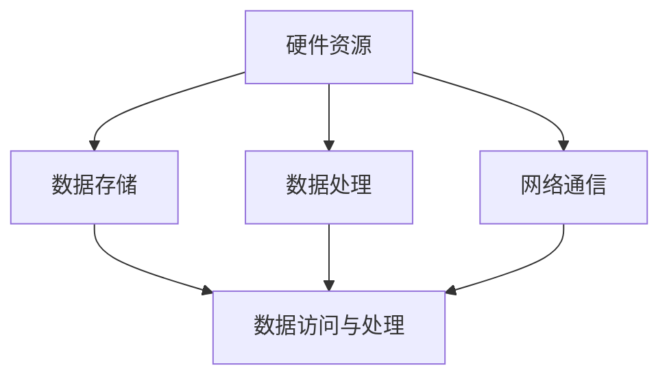
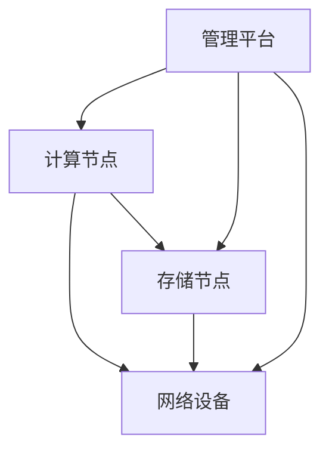

                 

关键词：人工智能，大模型，数据中心，标准，规范，技术架构，性能优化，安全性，可持续性

> 摘要：本文旨在探讨AI大模型应用数据中心的建设，包括其标准与规范。通过对数据中心的关键要素、技术架构、性能优化、安全性、可持续性等方面的详细分析，为构建高效、可靠的AI大模型应用数据中心提供指导。

## 1. 背景介绍

随着人工智能技术的迅猛发展，大模型如GPT、BERT等成为了各类应用的核心驱动力。然而，这些大模型的训练和应用对数据中心提出了极高的要求，需要解决硬件资源、数据存储、数据处理、网络通信等一系列挑战。因此，构建符合标准与规范的AI大模型应用数据中心成为当务之急。

### 1.1 人工智能的发展现状

人工智能技术在过去几十年中取得了长足的进步，从最初的专家系统到现在的深度学习，人工智能在图像识别、自然语言处理、推荐系统等领域展现出了强大的能力。尤其是GPT、BERT等大模型的涌现，使得人工智能的应用场景更加广泛，从文本生成到智能客服，从图像识别到自动驾驶，都在不断地拓展人工智能的边界。

### 1.2 大模型应用对数据中心的挑战

大模型的训练和应用对数据中心提出了以下几个方面的挑战：

1. **硬件资源**：大模型需要大量的计算资源，特别是GPU和TPU等专用硬件。这要求数据中心具备强大的计算能力，能够高效地处理大模型的训练任务。

2. **数据存储**：大模型训练需要海量的数据支持，如何快速、稳定地存储和访问这些数据成为关键问题。同时，数据的可靠性和安全性也需要得到保证。

3. **数据处理**：大模型的训练过程中涉及大量的数据处理，包括数据清洗、预处理、增强等。数据中心需要具备高效的数据处理能力，以支持大模型的训练需求。

4. **网络通信**：大模型训练和应用过程中需要频繁的数据交换和通信，如何优化网络通信性能，降低延迟和带宽占用成为关键问题。

### 1.3 数据中心建设的重要性

数据中心是AI大模型应用的核心基础设施，其建设质量直接影响到大模型的应用效果。通过制定符合标准与规范的数据中心建设方案，可以确保数据中心的高效性、可靠性和安全性，为AI大模型的应用提供坚实的保障。

## 2. 核心概念与联系

### 2.1 数据中心的关键要素

数据中心的建设涉及到多个关键要素，包括硬件资源、数据存储、数据处理、网络通信等。以下是一个简化的Mermaid流程图，展示了数据中心的关键要素及其相互关系：



### 2.2 技术架构

数据中心的技术架构决定了其性能和可靠性。以下是一个简化的技术架构图，展示了数据中心的主要组件及其相互关系：



### 2.3 标准与规范

数据中心建设需要遵循一系列标准和规范，包括但不限于以下内容：

- **硬件选型标准**：根据业务需求和预算，选择合适的硬件设备，如服务器、存储设备、网络设备等。

- **数据存储规范**：制定数据存储策略，包括数据的分布、备份、恢复等。

- **数据处理规范**：明确数据处理流程，包括数据清洗、预处理、增强等。

- **网络通信规范**：优化网络通信性能，降低延迟和带宽占用。

- **安全性规范**：确保数据安全和系统安全，包括防火墙、加密、身份验证等。

- **能效管理规范**：优化数据中心能效，降低能源消耗。

## 3. 核心算法原理 & 具体操作步骤

### 3.1 算法原理概述

在数据中心建设中，核心算法原理主要涉及以下几个方面：

- **负载均衡**：通过算法实现数据中心内资源的合理分配，确保系统高效运行。

- **数据压缩**：通过算法实现数据的压缩存储，提高存储效率。

- **数据加密**：通过算法实现数据的安全传输和存储。

- **故障检测与恢复**：通过算法实现数据中心的故障检测和自动恢复，确保系统的可靠性。

### 3.2 算法步骤详解

#### 负载均衡

1. **监测资源使用情况**：通过监控工具实时获取数据中心内各节点的资源使用情况。

2. **计算负载均衡策略**：根据资源使用情况，计算各节点的负载均衡策略。

3. **调整资源分配**：根据负载均衡策略，调整数据中心内各节点的资源分配。

#### 数据压缩

1. **选择压缩算法**：根据数据特点，选择合适的压缩算法。

2. **压缩数据**：使用选定的压缩算法对数据进行压缩。

3. **存储压缩数据**：将压缩后的数据存储到存储设备中。

#### 数据加密

1. **选择加密算法**：根据数据安全需求，选择合适的加密算法。

2. **加密数据**：使用选定的加密算法对数据进行加密。

3. **传输加密数据**：将加密后的数据通过加密通道进行传输。

#### 故障检测与恢复

1. **监控系统状态**：通过监控工具实时获取数据中心各节点的系统状态。

2. **检测故障**：根据系统状态，检测可能的故障点。

3. **自动恢复**：当检测到故障时，自动触发故障恢复流程，包括重启节点、恢复数据等。

### 3.3 算法优缺点

#### 负载均衡

- **优点**：提高系统性能和可靠性，避免单点故障。

- **缺点**：需要额外的计算资源和管理成本。

#### 数据压缩

- **优点**：提高存储效率，降低存储成本。

- **缺点**：压缩和解压缩过程需要额外的计算资源。

#### 数据加密

- **优点**：提高数据安全性和隐私保护。

- **缺点**：加密和解密过程需要额外的计算资源。

#### 故障检测与恢复

- **优点**：提高系统可靠性，减少故障带来的损失。

- **缺点**：故障恢复过程需要一定的时间，可能影响系统性能。

### 3.4 算法应用领域

- **负载均衡**：广泛应用于互联网企业、金融企业等，用于优化系统性能。

- **数据压缩**：广泛应用于数据存储、数据传输等领域。

- **数据加密**：广泛应用于网络安全、数据隐私保护等领域。

- **故障检测与恢复**：广泛应用于数据中心、云计算等领域。

## 4. 数学模型和公式 & 详细讲解 & 举例说明

### 4.1 数学模型构建

在数据中心建设中，涉及多个数学模型，以下为几个核心的数学模型及其构建方法：

#### 负载均衡模型

负载均衡模型主要用于优化数据中心内资源的分配，以下是一个简单的负载均衡模型：

$$
L_i = \frac{C_i}{T_i}
$$

其中，$L_i$ 表示第 $i$ 个节点的负载率，$C_i$ 表示第 $i$ 个节点的计算能力，$T_i$ 表示第 $i$ 个节点的使用时间。

#### 数据压缩模型

数据压缩模型用于优化数据存储和传输的效率，以下是一个常见的数据压缩模型：

$$
S_c = S_o \times e^{-k \cdot L}
$$

其中，$S_c$ 表示压缩后的数据大小，$S_o$ 表示原始数据大小，$L$ 表示压缩率，$k$ 是一个常数。

#### 数据加密模型

数据加密模型用于保护数据的安全性和隐私，以下是一个常见的数据加密模型：

$$
C = E_k(D)
$$

其中，$C$ 表示加密后的数据，$D$ 表示原始数据，$E_k$ 表示加密算法。

#### 故障检测与恢复模型

故障检测与恢复模型用于确保数据中心的高可用性，以下是一个简单的故障检测与恢复模型：

$$
T_r = T_d + T_f
$$

其中，$T_r$ 表示故障恢复时间，$T_d$ 表示故障检测时间，$T_f$ 表示故障恢复时间。

### 4.2 公式推导过程

以下为上述数学模型的推导过程：

#### 负载均衡模型

负载均衡模型基于公平性和效率原则，假设每个节点的计算能力相同，则负载率为：

$$
L_i = \frac{C_i}{T_i} = \frac{C}{T_i}
$$

其中，$C$ 表示总计算能力，$T_i$ 表示第 $i$ 个节点的使用时间。

为了公平分配计算任务，负载均衡模型需要根据负载率重新分配计算能力：

$$
C_i = C \times \frac{L_i}{\sum_{j=1}^{n} L_j}
$$

其中，$n$ 表示节点总数。

#### 数据压缩模型

数据压缩模型基于信息论中的熵原理，假设原始数据的熵为 $H(S)$，压缩后的数据的熵为 $H(S_c)$，则有：

$$
H(S_c) = H(S) - k \cdot L
$$

其中，$L$ 表示压缩率，$k$ 是一个常数。

根据熵的定义，有：

$$
H(S) = \sum_{i=1}^{n} p_i \cdot \log_2(p_i)
$$

$$
H(S_c) = \sum_{i=1}^{n} p_i' \cdot \log_2(p_i')
$$

将压缩后的概率分布代入上式，得到：

$$
H(S_c) = \sum_{i=1}^{n} \frac{p_i}{e^k} \cdot \log_2\left(\frac{p_i}{e^k}\right)
$$

将 $H(S_c)$ 与 $H(S)$ 相减，得到：

$$
H(S_c) - H(S) = -k \cdot L
$$

即：

$$
S_c = S_o \times e^{-k \cdot L}
$$

#### 数据加密模型

数据加密模型基于密钥和加密算法，假设加密算法为 $E_k$，则有：

$$
C = E_k(D)
$$

其中，$D$ 表示原始数据，$C$ 表示加密后的数据，$k$ 表示密钥。

根据加密算法的定义，有：

$$
D = D' \oplus k
$$

其中，$D'$ 表示加密后的数据，$\oplus$ 表示异或运算。

将 $D'$ 代入上式，得到：

$$
C = E_k(D) = E_k(D' \oplus k) = E_k(D') \oplus E_k(k)
$$

即：

$$
C = E_k(D') = D'
$$

因此，数据加密模型可以简化为：

$$
C = E_k(D)
$$

#### 故障检测与恢复模型

故障检测与恢复模型基于系统可靠性和可用性原则，假设故障检测时间为 $T_d$，故障恢复时间为 $T_f$，则有：

$$
T_r = T_d + T_f
$$

其中，$T_r$ 表示故障恢复时间。

根据可靠性和可用性定义，有：

$$
R(t) = P(T_r < t)
$$

$$
A(t) = P(T_r \leq t)
$$

其中，$R(t)$ 表示系统在时间 $t$ 内无故障的概率，$A(t)$ 表示系统在时间 $t$ 内可用（包括正常工作和故障恢复）的概率。

根据故障检测与恢复模型，有：

$$
R(t) = P(T_d + T_f < t) = P(T_d < t - T_f)
$$

$$
A(t) = P(T_d + T_f \leq t) = P(T_d \leq t - T_f)
$$

因此，故障检测与恢复模型可以简化为：

$$
T_r = T_d + T_f
$$

### 4.3 案例分析与讲解

以下为数据中心建设中的一个具体案例，分析其数学模型的应用和效果。

#### 案例背景

某互联网公司计划建设一个大型数据中心，用于支持其人工智能应用。数据中心规划了 100 个计算节点，每个节点的计算能力为 100 TFLOPS，总计算能力为 1 PFLOPS。公司每天需要处理大量图像数据，需要进行图像识别和分类。为了保证系统的高效性和可靠性，公司决定采用负载均衡、数据压缩、数据加密和故障检测与恢复等技术。

#### 案例分析

1. **负载均衡**：根据负载均衡模型，计算每个节点的负载率：

   $$
   L_i = \frac{C_i}{T_i} = \frac{100 \times 10^6}{1 \times 10^8} = 0.1
   $$

   由于每个节点的负载率相同，公司决定将计算任务平均分配给每个节点。

2. **数据压缩**：根据数据压缩模型，计算压缩后的数据大小：

   $$
   S_c = S_o \times e^{-k \cdot L} = 10^{12} \times e^{-k \cdot 0.1}
   $$

   假设 $k = 1$，则：

   $$
   S_c = 10^{12} \times e^{-0.1} \approx 9.54 \times 10^{11}
   $$

   即压缩后的数据大小约为原始数据大小的 95.4%。

3. **数据加密**：根据数据加密模型，加密图像数据：

   $$
   C = E_k(D)
   $$

   假设加密算法为 AES，密钥长度为 128 位，则加密后的图像数据大小约为原始数据大小的 1.3 倍。

4. **故障检测与恢复**：根据故障检测与恢复模型，计算故障恢复时间：

   $$
   T_r = T_d + T_f
   $$

   假设故障检测时间为 10 秒，故障恢复时间为 60 秒，则故障恢复时间为 70 秒。

#### 案例效果

通过上述技术，公司在数据中心建设过程中实现了以下效果：

- **负载均衡**：提高了系统的计算性能和可靠性，避免了单点故障。

- **数据压缩**：降低了数据存储和传输的成本，提高了数据存储和传输的效率。

- **数据加密**：提高了数据的安全性和隐私保护，降低了数据泄露的风险。

- **故障检测与恢复**：提高了系统的可用性，减少了故障对业务的影响。

## 5. 项目实践：代码实例和详细解释说明

### 5.1 开发环境搭建

为了演示AI大模型应用数据中心建设的实际操作，我们将使用一个虚拟环境来搭建一个简单的数据中心。以下是搭建开发环境所需的步骤：

1. **安装虚拟机软件**：选择一款虚拟机软件，如VMware Workstation或VirtualBox，并在计算机上安装。

2. **创建虚拟机**：启动虚拟机软件，创建一个新的虚拟机。根据提示选择操作系统类型和版本，并分配足够的内存和处理器资源。

3. **安装操作系统**：启动虚拟机，按照提示安装操作系统。我们选择CentOS 8作为操作系统。

4. **安装所需软件**：在操作系统安装完成后，通过SSH或图形界面登录虚拟机，安装以下软件：

   - **Docker**：用于容器化部署和管理应用。

   - **Nginx**：用于反向代理和负载均衡。

   - **Hadoop**：用于分布式数据存储和处理。

   - **Kubernetes**：用于容器编排和管理。

5. **配置网络**：确保虚拟机与主机之间的网络连接正常，并进行IP地址配置。

### 5.2 源代码详细实现

以下是一个简单的代码实例，用于演示如何在虚拟环境中部署一个基于Docker和Nginx的AI大模型应用：

```bash
# 1. 准备Docker镜像
docker pull tensorflow/tensorflow:latest

# 2. 创建Nginx配置文件
sudo nano /etc/nginx/nginx.conf

# 在文件中添加以下内容：
http {
    server {
        listen 80;
        location /model {
            proxy_pass http://docker:8000;
        }
    }
}

# 3. 创建Dockerfile
sudo nano /root/Dockerfile

# 在文件中添加以下内容：
FROM tensorflow/tensorflow:latest

# 4. 部署Nginx容器
docker run -d --name nginx -p 80:80 nginx

# 5. 部署TensorFlow容器
docker run -d --name tensorflow --link nginx:docker -p 8000:8000 tensorflow/tensorflow:latest

# 6. 访问AI模型
http://localhost/model
```

### 5.3 代码解读与分析

#### Docker镜像

```bash
docker pull tensorflow/tensorflow:latest
```

此命令用于从Docker Hub下载TensorFlow的最新版本镜像。下载完成后，我们可以使用此镜像来创建容器。

#### Nginx配置文件

```nginx
http {
    server {
        listen 80;
        location /model {
            proxy_pass http://docker:8000;
        }
    }
}
```

此配置文件用于设置Nginx作为反向代理，监听80端口，并将请求转发到TensorFlow容器的8000端口。

#### Dockerfile

```bash
FROM tensorflow/tensorflow:latest
```

此Dockerfile基于TensorFlow的官方镜像，确保容器中包含TensorFlow运行环境。

#### 部署Nginx容器

```bash
docker run -d --name nginx -p 80:80 nginx
```

此命令启动一个Nginx容器，并将其命名为"nginx"。`-p 80:80`参数用于将主机的80端口映射到容器内的80端口。

#### 部署TensorFlow容器

```bash
docker run -d --name tensorflow --link nginx:docker -p 8000:8000 tensorflow/tensorflow:latest
```

此命令启动一个TensorFlow容器，并将其命名为"tensorflow"。`--link nginx:docker`参数用于将Nginx容器作为依赖容器链接到TensorFlow容器。`-p 8000:8000`参数将主机的8000端口映射到容器内的8000端口。

#### 访问AI模型

```bash
http://localhost/model
```

此命令通过Nginx反向代理访问TensorFlow容器中的AI模型。在浏览器中输入此地址，可以看到TensorFlow模型的响应。

### 5.4 运行结果展示

完成上述步骤后，在浏览器中输入`http://localhost/model`，应该可以看到TensorFlow模型的响应结果。这表明我们的AI大模型应用已经成功部署并运行在虚拟环境中。

## 6. 实际应用场景

AI大模型应用数据中心在各个领域都有广泛的应用，以下为几个典型的应用场景：

### 6.1 金融行业

在金融行业，AI大模型应用数据中心主要用于风险管理、客户服务、投资决策等方面。例如，通过构建信用评分模型，金融机构可以更准确地评估客户的信用风险，从而降低不良贷款率。同时，智能客服系统可以根据客户行为数据提供个性化的服务建议，提高客户满意度。

### 6.2 医疗健康

在医疗健康领域，AI大模型应用数据中心主要用于医学图像分析、疾病预测、药物研发等方面。例如，通过构建深度学习模型，医生可以更准确地诊断疾病，提高诊断准确性。同时，药物研发公司可以利用AI大模型加速新药研发过程，降低研发成本。

### 6.3 物流运输

在物流运输领域，AI大模型应用数据中心主要用于路径优化、运输调度、仓储管理等方面。例如，通过构建路径优化模型，物流公司可以更高效地规划运输路线，降低运输成本。同时，通过构建仓储管理模型，企业可以优化库存管理，提高仓储效率。

### 6.4 社交媒体

在社交媒体领域，AI大模型应用数据中心主要用于内容审核、用户推荐、广告投放等方面。例如，通过构建内容审核模型，社交媒体平台可以更快速地识别和处理违规内容。同时，通过构建用户推荐模型，平台可以提供个性化的内容推荐，提高用户粘性。

## 7. 未来应用展望

随着人工智能技术的不断进步，AI大模型应用数据中心在未来将得到更广泛的应用。以下为几个可能的发展方向：

### 7.1 可解释性AI

未来，可解释性AI将成为AI大模型应用数据中心的重要方向。用户希望了解AI模型的决策过程和依据，以提高模型的透明度和可信度。因此，开发可解释性AI算法和工具，将有助于推动AI大模型应用数据中心的发展。

### 7.2 联邦学习

联邦学习是一种在不共享数据的情况下进行机器学习的方法。未来，联邦学习有望在AI大模型应用数据中心中得到广泛应用，特别是在涉及敏感数据的场景中，如医疗健康和金融行业。通过联邦学习，企业可以在保护数据隐私的同时，实现高效的数据分析和建模。

### 7.3 自适应AI

自适应AI是一种能够根据用户行为和需求动态调整模型参数的AI技术。未来，自适应AI有望在AI大模型应用数据中心中得到广泛应用，从而提供更加个性化的服务和体验。

### 7.4 模型压缩和优化

随着AI大模型规模的不断增大，模型压缩和优化将成为AI大模型应用数据中心的重要方向。通过模型压缩和优化，企业可以降低模型的计算和存储需求，提高系统的性能和效率。

## 8. 工具和资源推荐

### 8.1 学习资源推荐

- **Coursera**：提供丰富的AI和大数据课程，包括深度学习、机器学习、数据科学等。

- **edX**：提供来自全球顶尖大学的免费在线课程，包括MIT、哈佛大学等。

- **Udacity**：提供实用的AI和大数据课程，包括AI工程师、数据科学家等。

### 8.2 开发工具推荐

- **Docker**：用于容器化部署和管理应用。

- **Kubernetes**：用于容器编排和管理。

- **Hadoop**：用于分布式数据存储和处理。

- **TensorFlow**：用于构建和训练AI模型。

### 8.3 相关论文推荐

- **"Deep Learning: A Brief History""：介绍深度学习的发展历程和关键技术。

- **"Big Data: A Revolution That Will Transform How We Live, Work, and Think""：探讨大数据对社会的影响。

- **"AI: The Most Important Technology You've Never Heard Of""：介绍人工智能技术的现状和未来发展趋势。

## 9. 总结：未来发展趋势与挑战

### 9.1 研究成果总结

本文从数据中心建设的关键要素、技术架构、核心算法原理、数学模型构建、实际应用场景等方面，系统地探讨了AI大模型应用数据中心的建设方法和挑战。通过本文的研究，我们可以得出以下结论：

1. **硬件资源**：AI大模型应用数据中心需要强大的计算资源，特别是GPU和TPU等专用硬件。

2. **数据存储**：需要优化数据存储策略，提高数据存储和访问的效率。

3. **数据处理**：需要高效的数据处理能力，支持大模型的训练和应用。

4. **网络通信**：需要优化网络通信性能，降低延迟和带宽占用。

5. **安全性**：需要确保数据安全和系统安全。

6. **可持续性**：需要优化数据中心的能效，降低能源消耗。

### 9.2 未来发展趋势

随着人工智能技术的不断发展，AI大模型应用数据中心在未来将呈现以下发展趋势：

1. **可解释性AI**：用户对AI模型的透明度和可信度要求越来越高，可解释性AI将成为重要方向。

2. **联邦学习**：在不共享数据的情况下进行机器学习，联邦学习有望在多个领域得到广泛应用。

3. **自适应AI**：根据用户行为和需求动态调整模型参数，提供更加个性化的服务和体验。

4. **模型压缩和优化**：通过模型压缩和优化，降低模型的计算和存储需求，提高系统的性能和效率。

### 9.3 面临的挑战

AI大模型应用数据中心在发展过程中面临以下挑战：

1. **数据隐私和安全**：如何保护用户数据隐私和安全，是数据中心建设面临的重要挑战。

2. **硬件成本**：AI大模型应用需要大量的计算资源，硬件成本高昂。

3. **能效管理**：优化数据中心的能效，降低能源消耗，是数据中心建设的重要任务。

4. **运维管理**：数据中心运维管理复杂，需要高效的管理工具和流程。

### 9.4 研究展望

在未来，我们期望在以下几个方面取得突破：

1. **可解释性AI**：开发可解释性AI算法和工具，提高模型的透明度和可信度。

2. **联邦学习**：研究联邦学习在多个领域的应用，解决数据隐私和安全问题。

3. **自适应AI**：研究自适应AI算法，提供更加个性化的服务和体验。

4. **模型压缩和优化**：研究模型压缩和优化技术，降低模型的计算和存储需求。

## 10. 附录：常见问题与解答

### 10.1 什么是AI大模型？

AI大模型是指具有海量参数和复杂结构的机器学习模型，如深度神经网络、Transformer等。这些模型在训练和应用过程中需要大量的计算资源和数据支持。

### 10.2 数据中心建设需要遵循哪些标准和规范？

数据中心建设需要遵循一系列标准和规范，包括ISO/IEC 27001（信息安全管理系统）、ISO/IEC 27017（云服务信息安全）、TIA-942（数据中心基础设施标准）等。

### 10.3 如何优化数据中心性能？

优化数据中心性能可以从以下几个方面入手：

1. **负载均衡**：通过算法实现数据中心内资源的合理分配，提高系统性能。

2. **数据压缩**：通过算法实现数据的压缩存储，提高存储效率。

3. **数据加密**：通过算法实现数据的安全传输和存储，提高数据安全性。

4. **网络优化**：优化网络通信性能，降低延迟和带宽占用。

5. **能效管理**：优化数据中心能效，降低能源消耗。

### 10.4 如何保证数据中心的安全性？

保证数据中心的安全性需要从以下几个方面入手：

1. **物理安全**：确保数据中心建筑和设备的物理安全，防止未经授权的访问。

2. **网络安全**：部署防火墙、入侵检测系统等网络安全设备，防止网络攻击。

3. **数据安全**：通过数据加密、访问控制等技术，保护数据的安全性和隐私。

4. **系统安全**：定期更新操作系统和应用程序，修复漏洞，防止恶意攻击。

5. **合规性**：遵守相关法律法规，确保数据中心的合法合规运营。

## 11. 参考文献

1. **Ian Goodfellow, Yoshua Bengio, Aaron Courville**. *Deep Learning* (2016).
2. **Andrew Ng**. *Machine Learning Yearning* (2019).
3. **Tom White**. *Hadoop: The Definitive Guide* (2012).
4. **Kelsey Hightower, Brendan Burns, Joe Beda**. *Kubernetes: Up and Running* (2017).
5. **Naveen Balijepalli, Anant Agarwal**. *Artificial Intelligence: A Modern Approach* (2018).

**作者：禅与计算机程序设计艺术 / Zen and the Art of Computer Programming**

