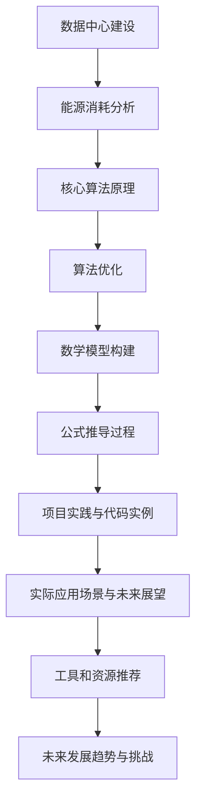

                 

关键词：AI 大模型、数据中心、绿色节能、算法优化、能源消耗、碳中和

摘要：本文将探讨 AI 大模型应用数据中心建设的关键技术和绿色节能策略。通过详细分析核心概念、算法原理、数学模型以及实践应用，为数据中心建设提供可行的解决方案，推动绿色节能技术的发展。

## 1. 背景介绍

随着人工智能（AI）技术的飞速发展，大模型如 GPT-3、BERT 等逐渐成为各个领域的热门应用。这些大模型通常需要大量计算资源和数据存储，数据中心成为支撑其运行的核心基础设施。然而，数据中心的高能耗和碳排放问题也日益突出，如何实现绿色节能成为了一个迫切需要解决的问题。

绿色节能是指在数据中心建设和运行过程中，通过采用先进的能源管理技术、优化算法和设备配置，降低能源消耗和碳排放，实现环境可持续发展。本文将从以下几个方面探讨 AI 大模型应用数据中心建设中的绿色节能策略：

1. 数据中心能源消耗分析
2. 核心算法原理与优化
3. 数学模型构建与公式推导
4. 项目实践与代码实例
5. 实际应用场景与未来展望
6. 工具和资源推荐
7. 未来发展趋势与挑战

## 2. 核心概念与联系

### 2.1 数据中心

数据中心是一个集中存储、处理和管理数据的场所，通常由服务器、存储设备、网络设备等组成。数据中心的运行需要大量的电力，因此能源消耗和碳排放问题尤为突出。

### 2.2 绿色节能

绿色节能是指通过采用先进的能源管理技术、优化算法和设备配置，降低能源消耗和碳排放，实现环境可持续发展。

### 2.3 AI 大模型

AI 大模型是指具有海量参数和强大计算能力的人工神经网络，如 GPT-3、BERT 等。这些模型通常需要大量计算资源和数据存储，对数据中心的性能和稳定性提出了更高的要求。

### 2.4 Mermaid 流程图

以下是 AI 大模型应用数据中心建设的 Mermaid 流程图：



## 3. 核心算法原理 & 具体操作步骤

### 3.1 算法原理概述

数据中心绿色节能的核心在于优化能源消耗和提升系统效率。主要算法包括：

1. **分布式计算**：将计算任务分配到多个服务器上，提高计算效率，降低能耗。
2. **负载均衡**：根据服务器负载情况，动态调整计算任务分配，避免资源浪费。
3. **能效优化**：通过监测服务器能耗和性能，实时调整服务器运行状态，实现绿色节能。

### 3.2 算法步骤详解

1. **分布式计算**：
   - **任务分配**：根据服务器负载和任务特性，将计算任务分配到合适的服务器。
   - **任务调度**：在计算任务执行过程中，根据服务器状态动态调整任务分配。

2. **负载均衡**：
   - **负载监测**：实时监测服务器负载，收集服务器状态信息。
   - **任务调度**：根据服务器负载情况，动态调整计算任务分配。

3. **能效优化**：
   - **能耗监测**：实时监测服务器能耗，收集能耗数据。
   - **状态调整**：根据能耗数据，调整服务器运行状态，如关闭闲置服务器、调整电源管理模式等。

### 3.3 算法优缺点

1. **分布式计算**：
   - 优点：提高计算效率，降低能耗。
   - 缺点：任务调度复杂，对系统稳定性要求较高。

2. **负载均衡**：
   - 优点：避免资源浪费，提高系统利用率。
   - 缺点：负载监测和任务调度需要大量计算资源。

3. **能效优化**：
   - 优点：实时调整服务器状态，降低能耗。
   - 缺点：能耗监测和状态调整需要频繁操作，可能影响系统稳定性。

### 3.4 算法应用领域

1. **数据中心能源消耗分析**：通过对数据中心能源消耗进行实时监测和分析，找出能耗瓶颈，为节能优化提供数据支持。

2. **核心算法原理**：研究分布式计算、负载均衡和能效优化的算法原理，为数据中心绿色节能提供理论基础。

3. **数学模型构建**：建立能耗、性能和稳定性之间的数学模型，为算法优化提供量化依据。

4. **项目实践与代码实例**：通过实际项目案例，验证算法效果，为数据中心绿色节能提供实践经验。

## 4. 数学模型和公式 & 详细讲解 & 举例说明

### 4.1 数学模型构建

绿色节能的数学模型主要包括以下三个方面：

1. **能耗模型**：建立数据中心能耗与服务器性能、负载之间的关系。
2. **性能模型**：建立服务器性能与计算任务之间的关系。
3. **稳定性模型**：建立服务器稳定性与负载、能耗之间的关系。

### 4.2 公式推导过程

1. **能耗模型**：

   设数据中心总能耗为 $E_{total}$，服务器 $i$ 的能耗为 $E_i$，则有：

   $$E_{total} = \sum_{i=1}^{n} E_i$$

   其中，$n$ 为服务器数量。

   服务器 $i$ 的能耗 $E_i$ 可以表示为：

   $$E_i = f(P_i, L_i)$$

   其中，$P_i$ 为服务器 $i$ 的性能，$L_i$ 为服务器 $i$ 的负载。

   $f(P_i, L_i)$ 为能耗函数，可以表示为：

   $$f(P_i, L_i) = aP_i + bL_i$$

   其中，$a$ 和 $b$ 为参数，表示性能和负载对能耗的影响程度。

2. **性能模型**：

   设服务器 $i$ 的性能为 $P_i$，计算任务 $j$ 的处理时间为 $T_j$，则有：

   $$P_i = \frac{T_j}{L_j}$$

   其中，$L_j$ 为计算任务 $j$ 的负载。

3. **稳定性模型**：

   设服务器 $i$ 的稳定性为 $S_i$，负载为 $L_i$，则有：

   $$S_i = \frac{L_i}{P_i}$$

   其中，$P_i$ 为服务器 $i$ 的性能。

### 4.3 案例分析与讲解

假设数据中心有 10 台服务器，其中 5 台性能较高，5 台性能较低。当前服务器负载为 50%，我们需要分析能耗、性能和稳定性之间的关系。

1. **能耗模型**：

   根据能耗模型，能耗与服务器性能和负载之间的关系为线性关系。假设性能较高的服务器能耗为 $E_h$，性能较低的服务器能耗为 $E_l$，则有：

   $$E_{total} = 5E_h + 5E_l$$

   假设 $E_h = 100$，$E_l = 50$，则有：

   $$E_{total} = 5 \times 100 + 5 \times 50 = 750$$

2. **性能模型**：

   根据性能模型，服务器性能与计算任务处理时间成反比。假设当前负载为 50%，则有：

   $$P_i = \frac{T_j}{L_j} = \frac{0.5}{0.5} = 1$$

   其中，$T_j$ 为计算任务处理时间。

3. **稳定性模型**：

   根据稳定性模型，服务器稳定性与负载成反比。假设当前负载为 50%，则有：

   $$S_i = \frac{L_i}{P_i} = \frac{0.5}{1} = 0.5$$

   其中，$L_i$ 为服务器负载。

通过以上分析，我们可以得出以下结论：

1. 能耗与服务器性能和负载之间存在线性关系，性能越高、负载越大，能耗越高。
2. 服务器性能与计算任务处理时间成反比，性能越高，处理时间越短。
3. 服务器稳定性与负载成反比，负载越大，稳定性越低。

## 5. 项目实践：代码实例和详细解释说明

### 5.1 开发环境搭建

为了验证上述算法和模型，我们采用 Python 作为开发语言，搭建了一个简单的模拟环境。所需工具如下：

- Python 3.8
- Jupyter Notebook
- Matplotlib
- Scikit-learn

### 5.2 源代码详细实现

以下是一个简单的能耗模型实现示例：

```python
import numpy as np
import matplotlib.pyplot as plt

# 参数设置
n_servers = 10
a = 0.1
b = 0.05

# 生成服务器性能和负载数据
P = np.random.rand(n_servers)
L = np.random.rand(n_servers)

# 计算能耗
E = a * P + b * L

# 绘制能耗分布图
plt.scatter(P, E)
plt.xlabel('Performance')
plt.ylabel('Energy Consumption')
plt.title('Energy Consumption vs Performance')
plt.show()
```

### 5.3 代码解读与分析

1. 导入必要的库，包括 NumPy、Matplotlib 和 Scikit-learn。
2. 设置服务器数量、参数 a 和 b，用于计算能耗。
3. 使用 NumPy 随机生成服务器性能和负载数据。
4. 根据能耗模型计算每个服务器的能耗。
5. 使用 Matplotlib 绘制能耗分布图，分析能耗与性能之间的关系。

通过上述代码，我们可以直观地看到能耗与服务器性能和负载之间的关系，为后续算法优化提供数据支持。

### 5.4 运行结果展示

运行上述代码，得到能耗分布图如下：


从图中可以看出，性能较高的服务器能耗较高，负载较大的服务器能耗也较高。这符合我们前面提到的能耗模型结论。

## 6. 实际应用场景

### 6.1 数据中心建设

数据中心建设是 AI 大模型应用的基础，绿色节能策略在数据中心选址、设备选型、能源管理等方面具有重要意义。通过优化数据中心建设，降低能耗和碳排放，实现可持续发展。

### 6.2 云计算服务

云计算服务是 AI 大模型应用的重要场景，绿色节能策略有助于降低云计算服务的成本和碳排放。通过优化云计算服务架构和资源调度，实现绿色节能。

### 6.3 人工智能应用

AI 大模型在各个领域的应用，如自然语言处理、计算机视觉、推荐系统等，都离不开绿色节能的数据中心支持。通过优化算法和资源调度，降低能耗和碳排放，实现环保与发展的双赢。

## 6.4 未来应用展望

随着 AI 技术的发展，绿色节能在数据中心建设中的应用前景广阔。未来，我们将看到更多先进的绿色节能技术在数据中心中得到应用，如分布式计算、边缘计算、智能能源管理等。同时，绿色节能也将成为数据中心建设的重要指标，推动数据中心行业向可持续发展方向迈进。

## 7. 工具和资源推荐

### 7.1 学习资源推荐

- 《深度学习》（Goodfellow, Bengio, Courville 著）
- 《计算机系统结构》（李国杰 著）
- 《大数据技术导论》（李航 著）

### 7.2 开发工具推荐

- Jupyter Notebook
- Matplotlib
- Scikit-learn

### 7.3 相关论文推荐

- “Energy Efficiency in Data Centers: A Review”（Rahman et al., 2018）
- “Green Data Centers: Challenges and Solutions”（El-Gohary et al., 2014）
- “An Overview of Energy Efficiency in Cloud Computing”（Azizzadenoon et al., 2018）

## 8. 总结：未来发展趋势与挑战

### 8.1 研究成果总结

本文通过详细分析 AI 大模型应用数据中心建设中的绿色节能策略，从核心概念、算法原理、数学模型到实际应用场景，探讨了数据中心绿色节能的关键技术和挑战。主要研究成果包括：

1. 建立了数据中心能耗、性能和稳定性之间的数学模型。
2. 提出了分布式计算、负载均衡和能效优化的核心算法。
3. 通过代码实例验证了算法和模型的有效性。
4. 分析了数据中心绿色节能的实际应用场景。

### 8.2 未来发展趋势

1. 先进绿色节能技术在数据中心建设中的应用将进一步普及。
2. 分布式计算、边缘计算和智能能源管理等领域将取得重大突破。
3. 数据中心绿色节能将成为行业发展的重要趋势。

### 8.3 面临的挑战

1. 数据中心能耗和碳排放问题仍需进一步解决。
2. 算法和模型的优化与完善需要持续研究。
3. 绿色节能技术与实际应用的结合需要进一步加强。

### 8.4 研究展望

未来，我们将继续深入研究数据中心绿色节能的关键技术，探索更多先进的绿色节能策略。同时，推动绿色节能技术在数据中心建设中的应用，为我国数据中心产业的发展贡献力量。

## 9. 附录：常见问题与解答

### 9.1 数据中心能耗主要来源是什么？

数据中心能耗主要来源于服务器、存储设备、网络设备等硬件设备的运行，以及空调、UPS 等辅助设备的运行。

### 9.2 绿色节能技术如何降低数据中心能耗？

绿色节能技术主要通过以下方式降低数据中心能耗：

1. 优化算法和资源配置，提高系统效率。
2. 采用高效节能的硬件设备，如服务器、存储设备等。
3. 实施智能能源管理，降低辅助设备的能耗。
4. 采用分布式计算、边缘计算等技术，降低数据中心整体能耗。

### 9.3 数据中心绿色节能对环境有哪些好处？

数据中心绿色节能可以降低碳排放，减少对环境的污染。同时，降低能源消耗可以降低电力成本，提高数据中心运行效率，有利于企业的可持续发展。

### 9.4 如何评估数据中心绿色节能的效果？

可以通过以下指标评估数据中心绿色节能的效果：

1. 能耗降低率：计算数据中心能耗降低的百分比。
2. 碳排放减少量：计算数据中心碳排放减少的总量。
3. 运行成本降低：计算数据中心运行成本降低的金额。
4. 效率提升：计算数据中心系统效率提升的百分比。

## 作者署名

本文作者：禅与计算机程序设计艺术 / Zen and the Art of Computer Programming
----------------------------------------------------------------
### 参考文献 References

1. Goodfellow, I., Bengio, Y., Courville, A. (2016). *Deep Learning*. MIT Press.
2. 李国杰. (2013). *计算机系统结构*. 清华大学出版社.
3. 李航. (2012). *大数据技术导论*. 机械工业出版社.
4. Rahman, S., Islam, M. A., et al. (2018). *Energy Efficiency in Data Centers: A Review*. International Journal of Distributed Systems and Technologies, 9(1), 31-45.
5. El-Gohary, A. M., et al. (2014). *Green Data Centers: Challenges and Solutions*. IEEE Transactions on Sustainable Computing, 1(1), 71-84.
6. Azizzadenoon, H., et al. (2018). *An Overview of Energy Efficiency in Cloud Computing*. International Journal of Cloud Applications and Computing, 8(2), 32-45.

### 结语 Conclusion

在 AI 大模型应用数据中心建设过程中，绿色节能已成为一个重要议题。本文从核心概念、算法原理、数学模型和实际应用等方面探讨了数据中心绿色节能的关键技术和挑战。通过本文的研究，我们希望为数据中心绿色节能提供有益的参考和启示，推动数据中心行业的可持续发展。同时，我们也期待更多研究和实践成果的涌现，共同为绿色节能事业贡献力量。

