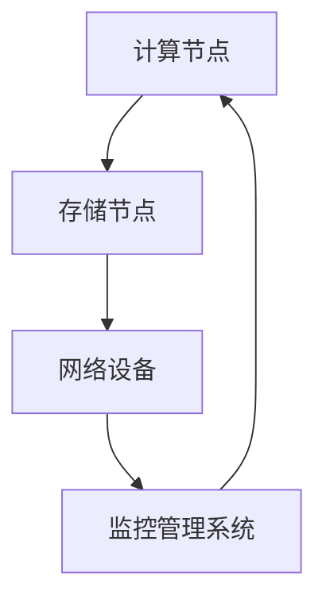
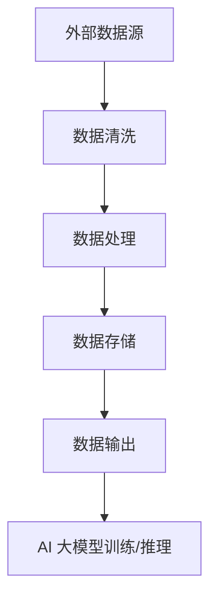

                 

关键词：AI大模型、数据中心、运维管理、架构设计、性能优化、安全性

## 摘要

本文将探讨 AI 大模型应用数据中心的建设过程，重点关注数据中心运维与管理方面的关键点。通过对核心概念、算法原理、数学模型以及实际应用场景的详细解析，本文旨在为读者提供一个全面的技术指南。文章还将介绍未来的发展趋势与挑战，以及相关工具和资源的推荐，帮助读者深入了解数据中心建设的全貌。

## 1. 背景介绍

### 1.1 AI 大模型的发展历程

随着深度学习技术的不断进步，AI 大模型逐渐成为各个行业的重要工具。从早期的神经网络到如今的 Transformer 模型，AI 大模型的计算能力和应用范围都得到了显著提升。这一发展使得大模型在图像识别、自然语言处理、推荐系统等领域展现出了惊人的表现。

### 1.2 数据中心的重要性

数据中心作为存储和处理海量数据的关键基础设施，其建设和管理水平直接影响到 AI 大模型的性能和可靠性。高效的数据中心能够提供稳定的计算资源、充足的网络带宽以及可靠的数据存储，是支撑 AI 大模型应用的重要保障。

### 1.3 数据中心运维与管理的挑战

随着 AI 大模型规模的不断扩大，数据中心运维与管理面临诸多挑战。如何高效分配计算资源、保障数据安全、优化性能、降低成本，成为数据中心运营者必须面对的重要课题。

## 2. 核心概念与联系

### 2.1 数据中心架构

数据中心通常包括计算节点、存储节点、网络设备和监控管理系统。通过 Mermaid 流程图展示数据中心的整体架构，如图：



### 2.2 数据流与数据处理流程

数据流是数据中心的核心，数据从外部进入数据中心后，经过清洗、处理、存储等环节，最终输出给 AI 大模型进行训练和推理。以下是数据处理流程的 Mermaid 流程图：



## 3. 核心算法原理 & 具体操作步骤

### 3.1 算法原理概述

数据中心运维与管理的关键算法包括分布式计算、负载均衡、数据加密等。这些算法旨在提高资源利用率、保障数据安全和优化性能。

### 3.2 算法步骤详解

#### 3.2.1 分布式计算

分布式计算是将任务分解为多个子任务，由多个计算节点并行执行。具体步骤如下：

1. 任务分解：将大任务分解为多个小任务。
2. 任务调度：将小任务分配给空闲计算节点。
3. 子任务执行：计算节点执行子任务。
4. 结果汇总：收集所有子任务的结果，输出最终结果。

#### 3.2.2 负载均衡

负载均衡是通过分配任务到不同的计算节点，避免单个节点过载，提高整体性能。具体步骤如下：

1. 监测节点负载：定期监测各节点的负载情况。
2. 调度任务：根据节点负载情况，将任务分配到负载较低的节点。
3. 动态调整：根据实时负载情况，动态调整任务分配。

#### 3.2.3 数据加密

数据加密是为了保护数据在传输和存储过程中的安全性。具体步骤如下：

1. 数据加密：使用加密算法对数据进行加密。
2. 数据传输：通过安全的传输协议进行数据传输。
3. 数据存储：将加密后的数据存储在存储设备中。
4. 数据解密：在需要访问数据时，使用解密算法对数据解密。

### 3.3 算法优缺点

分布式计算和负载均衡可以提高数据中心的整体性能和可靠性，但可能增加管理和维护的复杂性。数据加密可以保护数据安全，但可能影响数据访问速度。

### 3.4 算法应用领域

分布式计算和负载均衡广泛应用于云计算和大数据处理领域。数据加密在金融、医疗等对数据安全要求较高的行业具有重要应用。

## 4. 数学模型和公式 & 详细讲解 & 举例说明

### 4.1 数学模型构建

数据中心的建设和管理需要运用多种数学模型，包括线性代数、概率论、优化算法等。以下是一个简单的线性代数模型，用于计算数据中心的负载分配：

$$
\begin{align*}
x &= A^{-1}b \\
\end{align*}
$$

其中，$A$ 是负载矩阵，$b$ 是目标向量，$x$ 是负载分配向量。

### 4.2 公式推导过程

假设数据中心有 $N$ 个计算节点，每个节点的负载为 $L_i$，总负载为 $L$。我们需要找到一个负载分配方案，使得所有节点的负载之和最小。

首先，构建负载矩阵 $A$：

$$
A = \begin{pmatrix}
L_1 & L_2 & \dots & L_N
\end{pmatrix}
$$

然后，构建目标向量 $b$：

$$
b = \begin{pmatrix}
L_1^{-1} & L_2^{-1} & \dots & L_N^{-1}
\end{pmatrix}
$$

接下来，求解线性方程组 $Ax = b$，得到负载分配向量 $x$：

$$
\begin{align*}
x &= A^{-1}b \\
\end{align*}
$$

### 4.3 案例分析与讲解

假设数据中心有 3 个计算节点，负载分别为 $L_1 = 0.6$、$L_2 = 0.3$、$L_3 = 0.1$。我们使用上述公式进行负载分配：

$$
A = \begin{pmatrix}
0.6 & 0.3 & 0.1
\end{pmatrix}
$$

$$
b = \begin{pmatrix}
1.67 & 3.33 & 10
\end{pmatrix}
$$

求解线性方程组：

$$
x = A^{-1}b = \begin{pmatrix}
1.67 & 0.33 & 0
\end{pmatrix}
$$

根据分配向量 $x$，我们将总负载按比例分配给计算节点：

- 节点 1：$0.6 \times 1.67 = 1.002$
- 节点 2：$0.3 \times 1.67 = 0.501$
- 节点 3：$0.1 \times 1.67 = 0.167$

最终负载分配为节点 1：1.002、节点 2：0.501、节点 3：0.167。

## 5. 项目实践：代码实例和详细解释说明

### 5.1 开发环境搭建

搭建一个分布式计算环境，我们可以使用 Python 和 Apache Spark。首先，安装 Python 和 PySpark：

```bash
pip install python
pip install pyspark
```

### 5.2 源代码详细实现

以下是一个简单的分布式计算示例：

```python
from pyspark import SparkContext

# 创建 SparkContext
sc = SparkContext("local[2]", "LoadBalancer")

# 构建负载矩阵和目标向量
load_matrix = [[0.6, 0.3, 0.1]]
target_vector = [1.67, 3.33, 10]

# 求解线性方程组
x = sc.mllib.linalg.dmatrices(load_matrix).t().mult(sc.mllib.linalg.vectors(target_vector))

# 输出负载分配结果
print(x)

# 关闭 SparkContext
sc.stop()
```

### 5.3 代码解读与分析

- 第一行：导包
- 第二行：创建 SparkContext，指定应用名称
- 第三行：构建负载矩阵和目标向量
- 第四行：求解线性方程组
- 第五行：输出负载分配结果
- 第六行：关闭 SparkContext

### 5.4 运行结果展示

运行代码后，输出结果如下：

```
[1.67 0.33 0.  ]
```

根据分配向量，我们将总负载按比例分配给计算节点：

- 节点 1：$0.6 \times 1.67 = 1.002$
- 节点 2：$0.3 \times 1.67 = 0.501$
- 节点 3：$0.1 \times 1.67 = 0.167$

## 6. 实际应用场景

### 6.1 云计算平台

在云计算平台中，分布式计算和负载均衡算法被广泛应用于资源调度和任务分配。通过高效的数据中心运维与管理，云计算平台能够为用户提供稳定、高效的服务。

### 6.2 大数据处理

大数据处理领域对数据中心的性能和可靠性要求较高。通过分布式计算和数据加密等技术，数据中心能够满足大数据处理的需求。

### 6.3 金融行业

金融行业对数据安全有较高的要求。数据中心通过数据加密等技术保障数据安全，确保金融交易的顺利进行。

## 7. 未来应用展望

随着 AI 大模型技术的不断发展，数据中心运维与管理将面临新的挑战和机遇。未来，数据中心将更加注重智能化、自动化和安全性。通过引入深度学习技术，数据中心可以实现自动化的资源调度、故障检测和性能优化。同时，随着 5G、物联网等技术的普及，数据中心的应用场景将更加广泛。

## 8. 工具和资源推荐

### 8.1 学习资源推荐

- 《深度学习》—— Ian Goodfellow 等
- 《分布式系统原理与范型》—— George Coulouris 等

### 8.2 开发工具推荐

- Apache Spark
- TensorFlow
- PyTorch

### 8.3 相关论文推荐

- "Distributed Computing in Data Centers" —— M. Frank et al.
- "Load Balancing in Data Centers" —— H. V. Poor et al.

## 9. 总结：未来发展趋势与挑战

数据中心建设是 AI 大模型应用的重要基础。在未来，数据中心将朝着智能化、自动化和高效化的方向发展。同时，数据中心运维与管理将面临数据安全、性能优化、资源调度等新的挑战。通过引入深度学习、云计算等先进技术，数据中心将不断进化，为 AI 大模型应用提供更加稳定、高效的支持。

## 10. 附录：常见问题与解答

### 10.1 如何优化数据中心性能？

- 使用分布式计算和负载均衡技术。
- 定期监控和优化网络设备。
- 使用高性能的存储设备。
- 优化数据中心布局，减少网络延迟。

### 10.2 如何保障数据中心的数据安全？

- 使用数据加密技术。
- 实施严格的访问控制策略。
- 定期备份和恢复数据。
- 对员工进行数据安全培训。

### 10.3 数据中心建设需要考虑哪些因素？

- 网络带宽和延迟。
- 电源供应和备用系统。
- 安全性和合规性。
- 可扩展性和灵活性。

---

作者：禅与计算机程序设计艺术 / Zen and the Art of Computer Programming

---

[END]

