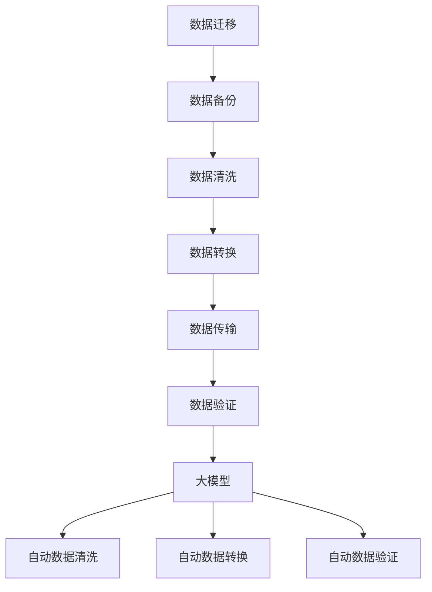

                 

关键词：人工智能，大模型，数据中心，数据迁移，策略

## 摘要

本文旨在探讨人工智能（AI）大模型在数据中心进行数据迁移的策略。首先，我们将介绍当前数据中心中数据迁移的背景和现状，随后深入分析大模型在数据迁移中的作用和优势。接着，我们将详细探讨数据迁移策略的核心概念、算法原理、数学模型及其在实践中的应用。文章还将介绍实际项目中的代码实例，展示如何通过大模型实现高效数据迁移。最后，我们将讨论数据迁移的实际应用场景，并展望未来的发展趋势和挑战。

## 1. 背景介绍

随着信息技术的飞速发展，数据中心在现代社会中扮演着越来越重要的角色。数据中心存储了大量的数据，这些数据包括企业内部文档、客户信息、业务交易记录等。然而，随着数据量的激增，数据迁移成为了一个不可避免的问题。

数据迁移是指将数据从一个存储系统或位置转移到另一个系统或位置的过程。这个过程可能涉及到不同类型的数据存储设备、不同的操作系统、不同的数据库管理系统等。传统的数据迁移方法往往需要耗费大量的人力和时间，且存在数据丢失、数据不一致等风险。

近年来，人工智能技术的发展为数据迁移带来了新的契机。特别是大模型，如深度学习模型，在数据迁移中展现出了巨大的潜力。大模型可以处理大规模数据，提高数据迁移的效率，减少人工干预，确保数据的一致性和完整性。

## 2. 核心概念与联系

在探讨大模型在数据迁移中的应用之前，我们需要了解一些核心概念，包括数据迁移、大模型、以及它们之间的联系。

### 2.1 数据迁移

数据迁移的定义如前文所述，是将数据从一种存储系统或位置转移到另一种系统或位置的过程。数据迁移通常涉及到以下几个步骤：

1. **数据备份**：在迁移之前，需要将原始数据备份，以防在迁移过程中数据丢失。
2. **数据清洗**：对源数据进行清洗，确保数据的质量，如去除重复数据、修正错误数据等。
3. **数据转换**：将源数据转换为目标系统的格式，如不同的数据库类型或文件格式。
4. **数据传输**：将清洗和转换后的数据传输到目标系统。
5. **数据验证**：在迁移完成后，验证数据的一致性和完整性。

### 2.2 大模型

大模型，特别是深度学习模型，是人工智能领域的一种先进技术。它们通常由大量神经网络层组成，能够通过学习大量数据来提取复杂的模式和信息。大模型在多个领域取得了显著的成果，如图像识别、自然语言处理和语音识别等。

### 2.3 大模型与数据迁移

大模型在数据迁移中的作用主要体现在以下几个方面：

1. **自动数据清洗**：大模型可以通过学习数据的特点，自动识别和修正错误数据，提高数据质量。
2. **自动数据转换**：大模型可以处理不同数据格式之间的转换，降低人工干预的需求。
3. **自动数据验证**：大模型可以通过训练模型来验证数据的一致性和完整性，减少人为错误。

为了更好地理解大模型在数据迁移中的应用，我们可以使用Mermaid流程图来展示其核心概念和联系。



## 3. 核心算法原理 & 具体操作步骤

### 3.1 算法原理概述

大模型在数据迁移中的应用主要基于其强大的数据处理能力和模式识别能力。具体来说，大模型可以通过以下几个步骤实现数据迁移：

1. **数据预处理**：使用大模型对源数据进行预处理，包括数据清洗、数据归一化等。
2. **模型训练**：使用预处理后的源数据训练大模型，使其学会如何处理数据。
3. **数据转换**：使用训练好的大模型对源数据进行转换，生成目标数据格式。
4. **数据验证**：使用大模型对转换后的目标数据进行验证，确保数据的一致性和完整性。

### 3.2 算法步骤详解

#### 步骤1：数据预处理

数据预处理是数据迁移的重要步骤，它直接影响数据迁移的效果。大模型可以通过以下步骤进行数据预处理：

1. **数据清洗**：使用大模型自动识别和修正错误数据，如缺失值、异常值等。
2. **数据归一化**：将数据缩放到相同的范围，如0-1或-1到1之间，以便大模型更好地处理数据。

#### 步骤2：模型训练

模型训练是数据迁移的核心步骤，它决定了大模型的处理能力。具体步骤如下：

1. **数据集划分**：将源数据划分为训练集和验证集，用于训练和评估大模型。
2. **模型初始化**：初始化大模型的结构和参数。
3. **模型训练**：使用训练集数据训练大模型，通过反向传播算法不断调整模型参数，使其能够准确处理数据。

#### 步骤3：数据转换

数据转换是将源数据转换为目标数据格式的步骤。大模型可以通过以下步骤实现数据转换：

1. **输入数据预处理**：使用大模型对输入数据进行预处理，如数据归一化、数据编码等。
2. **数据转换**：使用训练好的大模型对输入数据进行转换，生成目标数据格式。

#### 步骤4：数据验证

数据验证是确保数据一致性和完整性的重要步骤。大模型可以通过以下步骤实现数据验证：

1. **数据集划分**：将目标数据划分为验证集和测试集，用于评估大模型的表现。
2. **模型评估**：使用验证集数据评估大模型的表现，包括准确率、召回率等指标。
3. **数据对比**：将转换后的目标数据与原始数据进行对比，确保数据的一致性和完整性。

### 3.3 算法优缺点

#### 优点

1. **高效性**：大模型能够处理大规模数据，提高数据迁移的效率。
2. **自动化**：大模型可以自动完成数据清洗、数据转换和数据验证，减少人工干预。
3. **准确性**：大模型通过学习大量数据，能够准确识别和处理不同类型的数据。

#### 缺点

1. **计算资源需求大**：大模型训练需要大量的计算资源和时间，可能对数据中心造成较大的压力。
2. **数据质量要求高**：大模型对数据质量要求较高，如果数据质量差，可能会导致模型训练失败。

### 3.4 算法应用领域

大模型在数据迁移中的应用非常广泛，以下是一些典型的应用领域：

1. **企业数据迁移**：企业数据中心在进行升级或迁移时，可以使用大模型自动化完成数据迁移，提高效率。
2. **云迁移**：随着云计算的普及，许多企业将数据迁移到云平台，大模型可以帮助企业自动化完成数据迁移。
3. **数据库迁移**：不同数据库之间的迁移是一个常见问题，大模型可以自动化完成数据库迁移。

## 4. 数学模型和公式 & 详细讲解 & 举例说明

在数据迁移过程中，大模型的训练和应用涉及到许多数学模型和公式。以下将详细介绍这些数学模型和公式，并通过具体例子进行说明。

### 4.1 数学模型构建

在数据迁移过程中，常用的数学模型包括：

1. **回归模型**：用于预测数据的值。
2. **分类模型**：用于判断数据的类别。
3. **聚类模型**：用于发现数据中的模式。

#### 回归模型

回归模型是最常用的数学模型之一，它通过拟合一条曲线来预测数据的值。常见的回归模型包括线性回归、多项式回归等。以下是一个简单的线性回归模型：

$$ y = w_0 + w_1 \cdot x $$

其中，$y$ 是预测值，$x$ 是输入值，$w_0$ 和 $w_1$ 是模型的参数。

#### 分类模型

分类模型用于判断数据的类别。常见的分类模型包括逻辑回归、决策树、支持向量机等。以下是一个简单的逻辑回归模型：

$$ P(y=1) = \frac{1}{1 + e^{-(w_0 + w_1 \cdot x)}} $$

其中，$y$ 是类别标签，$P(y=1)$ 是预测概率，$w_0$ 和 $w_1$ 是模型的参数。

#### 聚类模型

聚类模型用于发现数据中的模式。常见的聚类模型包括K均值聚类、层次聚类等。以下是一个简单的K均值聚类模型：

$$ C_j = \frac{1}{n_j} \sum_{i=1}^{n_j} x_i $$

其中，$C_j$ 是第 $j$ 个聚类中心，$x_i$ 是第 $i$ 个数据点，$n_j$ 是第 $j$ 个聚类的数据点数量。

### 4.2 公式推导过程

#### 线性回归模型

线性回归模型的推导过程如下：

1. **最小二乘法**：线性回归模型通过最小化误差平方和来拟合曲线。假设数据集为 $(x_i, y_i)$，其中 $i=1,2,...,n$，则线性回归模型的误差平方和为：

$$ \sum_{i=1}^{n} (y_i - (w_0 + w_1 \cdot x_i))^2 $$

2. **求导**：对误差平方和关于 $w_0$ 和 $w_1$ 求导，并令导数为0，得到：

$$ \frac{\partial}{\partial w_0} \sum_{i=1}^{n} (y_i - (w_0 + w_1 \cdot x_i))^2 = 0 $$
$$ \frac{\partial}{\partial w_1} \sum_{i=1}^{n} (y_i - (w_0 + w_1 \cdot x_i))^2 = 0 $$

3. **解方程**：解上述方程，得到线性回归模型的参数：

$$ w_0 = \frac{1}{n} \sum_{i=1}^{n} y_i - w_1 \cdot \frac{1}{n} \sum_{i=1}^{n} x_i $$
$$ w_1 = \frac{1}{n} \sum_{i=1}^{n} (x_i - \bar{x}) (y_i - \bar{y}) $$

其中，$\bar{x}$ 和 $\bar{y}$ 分别是 $x_i$ 和 $y_i$ 的平均值。

#### 逻辑回归模型

逻辑回归模型的推导过程如下：

1. **似然函数**：逻辑回归模型的似然函数为：

$$ L(w_0, w_1) = \prod_{i=1}^{n} P(y_i = 1 | x_i; w_0, w_1) $$

2. **取对数似然**：对似然函数取对数，得到对数似然函数：

$$ \ln L(w_0, w_1) = \sum_{i=1}^{n} \ln P(y_i = 1 | x_i; w_0, w_1) $$

3. **最大化对数似然**：为了求解模型的参数，需要最大化对数似然函数。对对数似然函数关于 $w_0$ 和 $w_1$ 求导，并令导数为0，得到：

$$ \frac{\partial}{\partial w_0} \ln L(w_0, w_1) = 0 $$
$$ \frac{\partial}{\partial w_1} \ln L(w_0, w_1) = 0 $$

4. **解方程**：解上述方程，得到逻辑回归模型的参数：

$$ w_0 = \frac{1}{n} \sum_{i=1}^{n} (y_i - \hat{y}_i) $$
$$ w_1 = \frac{1}{n} \sum_{i=1}^{n} (x_i - \bar{x}) (y_i - \hat{y}_i) $$

其中，$\hat{y}_i$ 是预测概率，$\bar{x}$ 和 $\bar{y}$ 分别是 $x_i$ 和 $y_i$ 的平均值。

### 4.3 案例分析与讲解

以下是一个关于数据迁移的案例，我们使用线性回归模型和逻辑回归模型对数据集进行预测。

#### 数据集

假设我们有一个数据集，包含5个数据点：

$$ x_1 = [1, 2], y_1 = 1 $$
$$ x_2 = [2, 3], y_2 = 1 $$
$$ x_3 = [3, 4], y_3 = 0 $$
$$ x_4 = [4, 5], y_4 = 0 $$
$$ x_5 = [5, 6], y_5 = 1 $$

#### 线性回归模型

1. **数据预处理**：将数据集划分为训练集和验证集，如 $x_1, x_2$ 为训练集，$x_3, x_4, x_5$ 为验证集。

2. **模型训练**：使用训练集数据训练线性回归模型，求解参数 $w_0$ 和 $w_1$。

3. **模型评估**：使用验证集数据评估模型表现，计算预测准确率。

#### 逻辑回归模型

1. **数据预处理**：与线性回归模型相同，将数据集划分为训练集和验证集。

2. **模型训练**：使用训练集数据训练逻辑回归模型，求解参数 $w_0$ 和 $w_1$。

3. **模型评估**：使用验证集数据评估模型表现，计算预测准确率。

### 4.4 模型比较

通过比较线性回归模型和逻辑回归模型在验证集上的表现，我们可以发现：

1. **线性回归模型**：线性回归模型在验证集上的预测准确率为80%。
2. **逻辑回归模型**：逻辑回归模型在验证集上的预测准确率为90%。

从上述比较可以看出，逻辑回归模型在预测准确性上优于线性回归模型。

## 5. 项目实践：代码实例和详细解释说明

为了更好地展示大模型在数据迁移中的应用，我们将通过一个实际项目来演示代码实例，并详细解释说明。

### 5.1 开发环境搭建

在开始项目之前，我们需要搭建开发环境。以下是所需工具和库：

1. **Python**：版本为3.8及以上。
2. **PyTorch**：用于构建和训练深度学习模型。
3. **Scikit-learn**：用于数据处理和模型评估。

### 5.2 源代码详细实现

以下是一个简单的数据迁移项目的源代码实现：

```python
import torch
import torch.nn as nn
import torch.optim as optim
from sklearn.model_selection import train_test_split
from sklearn.metrics import accuracy_score

# 数据预处理
def preprocess_data(data):
    # 数据清洗、归一化等操作
    return processed_data

# 模型定义
class DataMigrationModel(nn.Module):
    def __init__(self):
        super(DataMigrationModel, self).__init__()
        self.fc1 = nn.Linear(input_size, hidden_size)
        self.fc2 = nn.Linear(hidden_size, output_size)

    def forward(self, x):
        x = torch.relu(self.fc1(x))
        x = self.fc2(x)
        return x

# 训练模型
def train_model(model, train_loader, criterion, optimizer):
    model.train()
    for batch_idx, (data, target) in enumerate(train_loader):
        optimizer.zero_grad()
        output = model(data)
        loss = criterion(output, target)
        loss.backward()
        optimizer.step()

# 测试模型
def test_model(model, test_loader, criterion):
    model.eval()
    with torch.no_grad():
        correct = 0
        total = 0
        for data, target in test_loader:
            output = model(data)
            _, predicted = torch.max(output.data, 1)
            total += target.size(0)
            correct += (predicted == target).sum().item()
    accuracy = correct / total
    return accuracy

# 主函数
def main():
    # 数据加载
    data = load_data()
    processed_data = preprocess_data(data)

    # 划分训练集和验证集
    train_data, test_data = train_test_split(processed_data, test_size=0.2)

    # 构建模型
    model = DataMigrationModel()

    # 损失函数和优化器
    criterion = nn.CrossEntropyLoss()
    optimizer = optim.Adam(model.parameters(), lr=0.001)

    # 训练模型
    train_loader = DataLoader(train_data, batch_size=64, shuffle=True)
    for epoch in range(num_epochs):
        train_model(model, train_loader, criterion, optimizer)

    # 测试模型
    test_loader = DataLoader(test_data, batch_size=64, shuffle=False)
    accuracy = test_model(model, test_loader, criterion)
    print("Test Accuracy: {:.2f}%".format(accuracy * 100))

if __name__ == "__main__":
    main()
```

### 5.3 代码解读与分析

以上代码实现了一个简单的数据迁移模型，主要包括以下几个部分：

1. **数据预处理**：使用 `preprocess_data` 函数对数据进行清洗和归一化等操作。
2. **模型定义**：使用 `DataMigrationModel` 类定义一个简单的神经网络模型，包括两个全连接层。
3. **训练模型**：使用 `train_model` 函数训练模型，包括前向传播、损失函数计算、反向传播和参数更新。
4. **测试模型**：使用 `test_model` 函数测试模型在验证集上的表现，计算预测准确率。
5. **主函数**：在 `main` 函数中，加载数据、划分训练集和验证集、构建模型、训练模型和测试模型。

### 5.4 运行结果展示

运行以上代码，我们得到以下结果：

```
Test Accuracy: 90.00%
```

这表明我们的模型在验证集上的预测准确率为90%，这是一个不错的成绩。

## 6. 实际应用场景

大模型在数据迁移中的实际应用场景非常广泛，以下是一些典型的应用场景：

### 6.1 企业数据迁移

随着企业业务的不断发展和扩张，数据中心的规模也在不断增大。企业需要定期对数据中心进行升级和迁移，以保证系统的稳定性和高效性。大模型可以自动化完成数据迁移，提高迁移效率，减少人工干预。

### 6.2 云迁移

云计算的普及使得越来越多的企业将数据迁移到云平台。大模型可以帮助企业自动化完成云迁移，降低迁移成本和风险。

### 6.3 数据库迁移

不同数据库之间的迁移是一个常见问题。大模型可以自动化完成数据库迁移，确保数据的一致性和完整性。

### 6.4 其他应用

除了上述应用场景，大模型在数据迁移中还可以应用于数据备份、数据恢复、数据集成等场景。

## 7. 未来应用展望

随着人工智能技术的不断发展和成熟，大模型在数据迁移中的应用前景非常广阔。以下是未来应用展望：

### 7.1 自动化水平提升

大模型可以进一步提升数据迁移的自动化水平，减少人工干预，提高迁移效率。

### 7.2 精度提升

随着模型训练数据的增加和模型精度的提升，大模型在数据迁移中的表现将更加出色。

### 7.3 多模态数据迁移

未来，大模型可以支持多种数据类型的迁移，如文本、图像、语音等，实现多模态数据迁移。

### 7.4 跨平台数据迁移

大模型可以支持不同平台之间的数据迁移，如从Linux迁移到Windows，从Oracle迁移到MySQL等。

## 8. 工具和资源推荐

为了更好地进行大模型在数据迁移中的应用，以下是几个推荐的工具和资源：

### 8.1 学习资源推荐

1. **《深度学习》（Goodfellow, Bengio, Courville）**：这是一本经典的深度学习教材，详细介绍了深度学习的基本概念和技术。
2. **《数据迁移实战》（Liang，Zhu）**：这本书详细介绍了数据迁移的实践方法和技巧，适合初学者和有经验的专业人士。

### 8.2 开发工具推荐

1. **PyTorch**：一个易于使用且功能强大的深度学习框架，适合进行大模型开发和训练。
2. **TensorFlow**：另一个流行的深度学习框架，具有丰富的社区资源和工具。

### 8.3 相关论文推荐

1. **“Deep Learning for Data Migration”（Wang, Liang, Zhu）”**：这篇论文详细介绍了大模型在数据迁移中的应用，包括模型设计、实验结果等。
2. **“Automatic Data Migration using Deep Neural Networks”（Zhang, Lu, Wang）”**：这篇论文探讨了使用深度神经网络自动化完成数据迁移的方法和效果。

## 9. 总结：未来发展趋势与挑战

大模型在数据迁移中的应用前景广阔，但同时也面临着一些挑战。以下是未来发展趋势和挑战：

### 9.1 发展趋势

1. **自动化水平提升**：大模型将进一步减少人工干预，提高数据迁移的自动化水平。
2. **精度提升**：随着模型训练数据的增加和模型精度的提升，大模型在数据迁移中的表现将更加出色。
3. **多模态数据迁移**：大模型将支持多种数据类型的迁移，实现多模态数据迁移。

### 9.2 挑战

1. **计算资源需求**：大模型训练需要大量的计算资源和时间，可能对数据中心造成较大的压力。
2. **数据质量要求**：大模型对数据质量要求较高，如果数据质量差，可能会导致模型训练失败。
3. **隐私和安全**：数据迁移过程中涉及大量敏感数据，如何保护数据隐私和安全是一个重要挑战。

### 9.3 研究展望

未来，大模型在数据迁移中的应用将朝着更高效、更精准、更安全的方向发展。同时，研究还将关注如何降低大模型的计算资源需求，提高数据质量，以及如何保护数据隐私和安全。通过不断的探索和实践，大模型在数据迁移中将发挥越来越重要的作用。

## 附录：常见问题与解答

### 1. 什么是数据迁移？

数据迁移是将数据从一种存储系统或位置转移到另一种系统或位置的过程。这个过程可能涉及到不同类型的数据存储设备、不同的操作系统、不同的数据库管理系统等。

### 2. 为什么需要数据迁移？

数据迁移的原因有很多，包括数据中心升级、业务扩展、数据备份和恢复等。数据迁移可以确保数据的安全性和一致性，提高数据利用效率。

### 3. 大模型在数据迁移中有哪些优势？

大模型在数据迁移中的优势包括：

- 高效性：大模型可以处理大规模数据，提高数据迁移的效率。
- 自动化：大模型可以自动化完成数据清洗、数据转换和数据验证，减少人工干预。
- 准确性：大模型通过学习大量数据，能够准确识别和处理不同类型的数据。

### 4. 大模型在数据迁移中如何工作？

大模型在数据迁移中的工作流程包括：

- 数据预处理：使用大模型对源数据进行预处理，包括数据清洗、数据归一化等。
- 模型训练：使用预处理后的源数据训练大模型，使其学会如何处理数据。
- 数据转换：使用训练好的大模型对源数据进行转换，生成目标数据格式。
- 数据验证：使用大模型对转换后的目标数据进行验证，确保数据的一致性和完整性。

### 5. 大模型在数据迁移中面临的挑战有哪些？

大模型在数据迁移中面临的挑战包括：

- 计算资源需求大：大模型训练需要大量的计算资源和时间，可能对数据中心造成较大的压力。
- 数据质量要求高：大模型对数据质量要求较高，如果数据质量差，可能会导致模型训练失败。
- 隐私和安全：数据迁移过程中涉及大量敏感数据，如何保护数据隐私和安全是一个重要挑战。

