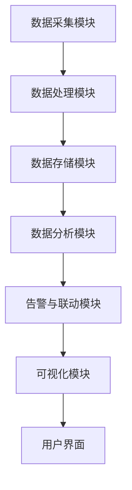

                 

### 摘要 Abstract

本文主要探讨AI大模型应用数据中心中的监控与预警系统的重要性及其设计方法。随着AI技术的快速发展，大模型在各个领域得到了广泛应用，数据中心作为AI应用的承载者，面临着日益复杂和庞大的数据处理需求。本文将介绍数据中心监控与预警的基本概念、核心算法、数学模型以及具体实现方法，并通过实际案例和代码实例，展示其在实际应用中的效果和优势。文章还将对未来的发展趋势、面临的挑战以及研究展望进行探讨，以期为读者提供全面的了解和指导。

## 1. 背景介绍 Background

### AI大模型的发展现状与发展趋势

近年来，人工智能（AI）技术取得了飞速发展，特别是在深度学习、神经网络等领域取得了显著的成果。大模型（Large Models）作为AI研究的重要方向之一，其应用范围越来越广泛。大模型通常具有数十亿甚至数万亿个参数，能够处理海量数据，实现复杂的任务。例如，自然语言处理（NLP）、计算机视觉（CV）、语音识别（ASR）等领域都涌现出了许多大模型，如BERT、GPT、ViT等。

随着大模型的应用越来越广泛，数据中心作为AI应用的承载者，其重要性日益凸显。数据中心不仅需要处理庞大的数据量，还要保证模型的训练和部署效率，同时确保系统的稳定性和可靠性。然而，随着系统的复杂度增加，数据中心面临的挑战也越来越大。例如，数据质量问题、计算资源调度问题、系统故障问题等，都需要有效的监控与预警机制来解决。

### 数据中心监控与预警系统的意义

数据中心监控与预警系统对于保障AI大模型应用的数据中心具有重要意义。首先，监控系统能够实时监控数据中心的运行状态，包括服务器负载、网络流量、存储容量等关键指标，及时发现异常情况。其次，预警系统可以提前预测潜在的问题，并发出警报，为管理员提供处理问题的时机。这样，可以在问题恶化之前采取相应的措施，避免系统崩溃和数据丢失。

此外，监控与预警系统还能提高数据中心的运营效率。通过收集和分析监控数据，管理员可以优化资源分配，提高系统性能，降低运维成本。同时，监控与预警系统还能提供丰富的报表和可视化界面，方便管理员进行数据分析和决策支持。

总之，数据中心监控与预警系统是保障AI大模型应用稳定运行的重要保障，对于提升数据中心的管理水平和运营效率具有重要意义。

## 2. 核心概念与联系 Core Concepts and Connections

### 数据中心监控系统的基本概念

数据中心监控系统是指通过一系列硬件和软件工具，对数据中心的各种资源和服务进行实时监控和管理的系统。其核心目的是确保数据中心的稳定运行和高效利用。数据中心监控系统的基本概念包括以下几个方面：

1. **监控对象**：监控对象包括服务器、存储设备、网络设备、数据库等数据中心的关键资源。
2. **监控指标**：监控指标是衡量数据中心性能和状态的关键参数，如CPU利用率、内存利用率、网络流量、存储容量等。
3. **监控工具**：监控工具是实现监控功能的具体软件，如Zabbix、Nagios、Prometheus等。
4. **告警机制**：告警机制是监控系统发现异常时，自动向管理员发送通知的机制，如邮件、短信、电话等。

### 数据中心预警系统的基本概念

数据中心预警系统是一种预防性监控系统，旨在提前发现潜在的问题，并提供解决方案。预警系统的基本概念包括以下几个方面：

1. **预警指标**：预警指标是用于判断数据中心是否处于危险状态的参数，如负载峰值、温度变化等。
2. **预警规则**：预警规则是触发预警的阈值和条件，如当CPU利用率超过90%时，触发告警。
3. **预警策略**：预警策略是针对不同预警指标的应对措施，如自动重启服务、通知管理员等。
4. **预警工具**：预警工具是实现预警功能的具体软件，如Grafana、Kibana等。

### 监控系统与预警系统的关系

数据中心监控系统与预警系统密切相关，共同构成一个完整的监控与预警体系。监控系统主要负责实时监控数据中心的运行状态，收集各类监控数据，并通过告警机制及时通知管理员。而预警系统则基于这些监控数据，通过预警指标和预警规则，提前预测潜在问题，并提供解决方案。

具体来说，监控系统与预警系统的关系可以概括为以下几点：

1. **数据来源**：监控系统提供实时监控数据，是预警系统的基础。
2. **预警触发**：预警系统根据监控数据，结合预警规则和预警策略，触发预警。
3. **联动处理**：当预警系统触发预警时，会联动监控系统进行进一步处理，如暂停服务、重启服务等。
4. **反馈机制**：预警系统会记录和处理预警事件，为监控系统提供反馈，帮助改进监控策略。

总之，数据中心监控系统与预警系统共同作用，形成一个实时、高效、可靠的监控与预警体系，为AI大模型应用数据中心的稳定运行提供有力保障。

### 数据中心监控与预警系统的架构设计

数据中心监控与预警系统的架构设计是确保其高效运行的关键。一个典型的高效架构通常包括以下几个核心组成部分：

#### 数据采集模块

数据采集模块是监控系统的核心组件，负责从各种硬件和软件资源中收集数据。这些数据包括CPU利用率、内存使用率、磁盘I/O、网络流量、温度传感器读数等。数据采集可以通过以下几种方式实现：

1. **Agent-based采集**：在服务器和设备上部署监控代理（Agent），定期发送监控数据到集中存储系统。
2. **API采集**：通过API接口从各个系统和服务中获取监控数据。
3. **SNMP（Simple Network Management Protocol）采集**：使用SNMP协议从网络设备中获取监控数据。

数据采集模块需要具备高并发处理能力，以确保实时性。

#### 数据处理模块

数据处理模块负责对采集到的数据进行预处理和存储。预处理包括数据清洗、格式转换、去重等操作，以确保数据的质量和一致性。处理后的数据存储在时间序列数据库（如InfluxDB、Prometheus）中，便于后续的分析和查询。

#### 数据存储模块

数据存储模块是整个监控系统的数据仓库，用于长期存储监控数据。选择合适的数据存储方案至关重要，常见的存储方案包括：

1. **关系型数据库**：如MySQL、PostgreSQL，适合存储结构化数据。
2. **时间序列数据库**：如InfluxDB、OpenTSDB，适合存储时间戳和指标数据。
3. **NoSQL数据库**：如MongoDB、Cassandra，适合存储非结构化数据。

#### 数据分析模块

数据分析模块负责对存储的数据进行分析和挖掘，以发现潜在问题和趋势。数据分析可以通过以下几种方式实现：

1. **实时分析**：实时处理和分析监控数据，生成实时报表和告警。
2. **批处理分析**：定期处理历史监控数据，进行数据挖掘和预测分析。
3. **机器学习分析**：使用机器学习算法，对监控数据进行分析和预测，提高预警准确性。

#### 告警与联动模块

告警与联动模块负责根据分析结果，触发告警并联动相关系统进行处理。告警可以通过邮件、短信、电话、微信等多种方式通知管理员。联动处理包括自动重启服务、暂停任务、增加资源等操作。

#### 可视化模块

可视化模块提供直观的监控数据展示，包括实时监控仪表板、趋势图、拓扑图等。可视化模块可以帮助管理员快速了解系统的运行状态和问题，提高运维效率。

### 架构设计的 Mermaid 流程图

下面是一个简化的数据中心监控与预警系统的Mermaid流程图，用于展示各个模块之间的关系和数据处理流程。



通过这个流程图，我们可以清晰地看到数据从采集到处理、存储、分析、告警和可视化的全过程，从而确保监控与预警系统的有效运行。

## 3. 核心算法原理 & 具体操作步骤

### 3.1 算法原理概述

数据中心监控与预警系统的核心算法主要包括数据采集算法、数据处理算法、数据分析算法和预警算法。这些算法共同构成了监控与预警系统的技术基础，确保系统的高效运行和准确预警。

#### 数据采集算法

数据采集算法的主要任务是实时获取数据中心各个资源和服务的关键指标。常见的采集算法包括：

1. **轮询算法**：定期轮询各个资源和服务，获取当前状态。
2. **事件驱动算法**：在资源或服务发生状态变化时，立即采集数据。
3. **采样算法**：对数据流进行采样，以降低系统开销。

#### 数据处理算法

数据处理算法负责对采集到的数据进行预处理和存储。常见的处理算法包括：

1. **数据清洗算法**：去除无效数据、填补缺失值、纠正错误数据等。
2. **数据压缩算法**：对数据进行压缩，以减少存储空间和传输带宽。
3. **数据归一化算法**：将不同规模的数据转换为相同尺度，便于分析和比较。

#### 数据分析算法

数据分析算法通过对监控数据进行深入分析，识别潜在问题和趋势。常见的数据分析算法包括：

1. **统计分析算法**：计算均值、方差、标准差等统计指标，评估系统性能。
2. **机器学习算法**：通过训练模型，预测系统行为，识别异常模式。
3. **聚类算法**：将相似的数据点分组，发现数据分布和规律。

#### 预警算法

预警算法基于分析结果，根据预警规则和策略，触发告警并采取相应的措施。常见的预警算法包括：

1. **阈值预警算法**：根据预设的阈值，判断是否触发告警。
2. **异常检测算法**：通过检测异常模式，提前发现潜在问题。
3. **联动预警算法**：根据不同的预警事件，联动其他系统进行处理。

### 3.2 算法步骤详解

#### 数据采集算法步骤

1. **初始化**：设置采集频率、采样方式和采集范围。
2. **轮询或事件触发**：定期轮询或根据事件触发，获取资源和服务状态。
3. **数据预处理**：去除无效数据、填补缺失值、纠正错误数据。
4. **数据存储**：将预处理后的数据存储到时间序列数据库中。

#### 数据处理算法步骤

1. **初始化**：设置数据处理策略和参数。
2. **数据清洗**：去除无效数据、填补缺失值、纠正错误数据。
3. **数据压缩**：对数据进行压缩，减少存储空间和传输带宽。
4. **数据归一化**：将不同规模的数据转换为相同尺度。
5. **数据存储**：将处理后的数据存储到数据仓库中。

#### 数据分析算法步骤

1. **初始化**：设置分析算法和参数。
2. **数据预处理**：对数据进行清洗和归一化处理。
3. **统计分析**：计算统计指标，评估系统性能。
4. **机器学习训练**：使用训练数据，训练预测模型。
5. **模型预测**：使用训练好的模型，预测系统行为。
6. **结果存储**：将分析结果存储到数据库中。

#### 预警算法步骤

1. **初始化**：设置预警规则和策略。
2. **数据采集与处理**：采集和处理监控数据。
3. **分析结果**：根据分析结果，判断是否触发预警。
4. **触发告警**：根据预警规则，触发告警并通知管理员。
5. **联动处理**：根据联动策略，采取相应的措施，如重启服务、增加资源等。

### 3.3 算法优缺点

#### 数据采集算法

**优点**：

1. **实时性强**：能够实时获取资源和服务状态，及时发现问题。
2. **适应性高**：可以根据不同场景，灵活选择轮询或事件触发方式。

**缺点**：

1. **系统开销大**：频繁轮询或事件触发会增加系统开销，影响性能。
2. **数据准确性**：依赖事件触发的数据采集，可能存在数据丢失或延迟的问题。

#### 数据处理算法

**优点**：

1. **数据质量高**：通过数据清洗、压缩和归一化，提高数据质量和一致性。
2. **存储效率高**：通过数据压缩，减少存储空间和传输带宽。

**缺点**：

1. **处理延迟**：数据预处理和压缩需要额外时间，可能影响实时性。
2. **计算资源消耗**：数据清洗和压缩过程需要较高的计算资源。

#### 数据分析算法

**优点**：

1. **发现潜在问题**：通过统计分析、机器学习和聚类算法，能够发现潜在问题和趋势。
2. **预测能力强**：通过训练模型，能够预测系统行为，提高预警准确性。

**缺点**：

1. **计算复杂度高**：机器学习和聚类算法的计算复杂度较高，可能影响性能。
2. **数据依赖性强**：分析结果依赖于高质量的数据，数据质量问题会影响分析效果。

#### 预警算法

**优点**：

1. **预警及时**：能够提前发现潜在问题，及时触发告警。
2. **联动处理**：能够联动其他系统，采取相应的措施，避免问题扩大。

**缺点**：

1. **预警误报**：可能存在误报问题，影响系统的可靠性。
2. **预警滞后**：预警算法的响应速度可能无法满足实时性要求。

### 3.4 算法应用领域

数据中心监控与预警算法在多个领域都有广泛应用，包括：

1. **云计算**：监控云计算平台的资源使用情况，确保服务的稳定性和可靠性。
2. **大数据**：监控大数据处理平台的数据流和处理过程，确保数据质量和系统性能。
3. **物联网**：监控物联网设备的运行状态，确保设备稳定运行和数据传输可靠性。
4. **人工智能**：监控AI大模型的训练和部署过程，确保模型训练的稳定性和效果。
5. **网络安全**：监控网络安全设备，发现潜在的安全威胁，确保网络安全。

通过这些应用，数据中心监控与预警算法能够有效提高系统的稳定性和可靠性，保障业务的正常运行。

## 4. 数学模型和公式 Detailed Explanation and Case Analysis

### 4.1 数学模型构建

数据中心监控与预警系统的数学模型是构建预警规则和分析方法的基础。为了构建有效的数学模型，我们需要定义一些关键参数和公式，这些参数和公式可以帮助我们理解数据中心的运行状态和预测潜在问题。

#### 关键参数

1. **CPU利用率**：CPU利用率是衡量服务器CPU工作负荷的指标，通常以百分比表示。
2. **内存利用率**：内存利用率是衡量服务器内存使用情况的指标，通常以百分比表示。
3. **网络流量**：网络流量是衡量网络传输带宽使用情况的指标，通常以数据量（如Mbps）表示。
4. **存储容量**：存储容量是衡量存储设备使用情况的指标，通常以存储空间（如GB）表示。
5. **温度**：温度是衡量数据中心温度环境的指标，通常以摄氏度（°C）表示。

#### 基本公式

1. **CPU利用率公式**：
   $$CPU_{利用率} = \frac{CPU_{使用时间}}{CPU_{总时间}} \times 100\%$$

2. **内存利用率公式**：
   $$内存_{利用率} = \frac{内存_{使用量}}{内存_{总量}} \times 100\%$$

3. **网络流量公式**：
   $$网络_{流量} = \frac{传输数据量}{传输时间}$$

4. **存储容量公式**：
   $$存储_{容量} = 已使用存储空间 + 空闲存储空间$$

5. **温度公式**：
   $$温度_{变化率} = \frac{当前温度 - 初始温度}{时间间隔}$$

### 4.2 公式推导过程

为了更好地理解这些公式，我们可以通过具体的例子来推导它们的含义和计算过程。

#### CPU利用率公式推导

假设服务器在一个小时内有30分钟在运行计算任务，总共运行了60分钟，那么CPU的利用率为：

$$CPU_{利用率} = \frac{30分钟}{60分钟} \times 100\% = 50\%$$

这个公式表示CPU在60分钟内有一半的时间在工作。

#### 内存利用率公式推导

假设服务器有8GB内存，当前使用了5GB，那么内存利用率为：

$$内存_{利用率} = \frac{5GB}{8GB} \times 100\% = 62.5\%$$

这个公式表示内存当前使用了总量的62.5%。

#### 网络流量公式推导

假设在10分钟内，服务器通过网络传输了1GB的数据，那么网络流量为：

$$网络_{流量} = \frac{1GB}{10分钟} = 0.1GB/分钟$$

这个公式表示每分钟通过网络传输的数据量为0.1GB。

#### 存储容量公式推导

假设服务器的存储设备总共有100GB，当前已使用了60GB，那么空闲存储空间为40GB：

$$存储_{容量} = 60GB + 40GB = 100GB$$

这个公式表示存储设备的总容量是100GB。

#### 温度公式推导

假设数据中心初始温度为20°C，一个小时后温度上升到25°C，那么温度变化率为：

$$温度_{变化率} = \frac{25°C - 20°C}{1小时} = 5°C/小时$$

这个公式表示温度每小时上升5°C。

### 4.3 案例分析与讲解

为了更好地理解这些公式在实际应用中的效果，我们可以通过一个具体案例来分析。

#### 案例背景

某数据中心在一天中的不同时间点记录了CPU利用率、内存利用率、网络流量和温度数据，如下表所示：

| 时间 | CPU利用率 | 内存利用率 | 网络流量 (Mbps) | 温度 (°C) |
|------|-----------|------------|-----------------|-----------|
| 08:00 | 20%       | 30%        | 20              | 23        |
| 12:00 | 60%       | 50%        | 30              | 25        |
| 18:00 | 80%       | 70%        | 50              | 27        |
| 22:00 | 40%       | 40%        | 10              | 22        |

#### 案例分析

1. **CPU利用率分析**：

   在08:00时，CPU利用率为20%，表明此时服务器负载较低。在18:00时，CPU利用率上升到80%，表明服务器负载较高，可能需要进行资源扩展或优化。

2. **内存利用率分析**：

   在08:00时，内存利用率为30%，表明内存使用较为合理。在18:00时，内存利用率上升到70%，表明内存使用紧张，可能需要增加内存容量或优化内存使用。

3. **网络流量分析**：

   在08:00时，网络流量为20Mbps，表明网络传输较为顺畅。在18:00时，网络流量上升到50Mbps，表明网络负载较高，可能需要进行网络优化或增加带宽。

4. **温度分析**：

   在08:00时，数据中心温度为23°C，表明温度适中。在18:00时，数据中心温度上升到27°C，表明温度较高，可能需要进行冷却系统的优化或增加冷却设备。

#### 案例总结

通过分析上述数据，我们可以发现，在一天中的高峰时段（12:00和18:00），服务器的CPU利用率、内存利用率和网络流量都较高，而数据中心温度也较高。这表明在高峰时段，数据中心资源紧张，需要采取相应的措施来优化资源分配、网络流量和冷却系统，以保障数据中心的稳定运行。

### 4.4 案例分析与讲解

为了更好地理解这些公式在实际应用中的效果，我们可以通过一个具体案例来分析。

#### 案例背景

某数据中心在一天中的不同时间点记录了CPU利用率、内存利用率、网络流量和温度数据，如下表所示：

| 时间 | CPU利用率 | 内存利用率 | 网络流量 (Mbps) | 温度 (°C) |
|------|-----------|------------|-----------------|-----------|
| 08:00 | 20%       | 30%        | 20              | 23        |
| 12:00 | 60%       | 50%        | 30              | 25        |
| 18:00 | 80%       | 70%        | 50              | 27        |
| 22:00 | 40%       | 40%        | 10              | 22        |

#### 案例分析

1. **CPU利用率分析**：

   在08:00时，CPU利用率为20%，表明此时服务器负载较低。在18:00时，CPU利用率上升到80%，表明服务器负载较高，可能需要进行资源扩展或优化。

2. **内存利用率分析**：

   在08:00时，内存利用率为30%，表明内存使用较为合理。在18:00时，内存利用率上升到70%，表明内存使用紧张，可能需要增加内存容量或优化内存使用。

3. **网络流量分析**：

   在08:00时，网络流量为20Mbps，表明网络传输较为顺畅。在18:00时，网络流量上升到50Mbps，表明网络负载较高，可能需要进行网络优化或增加带宽。

4. **温度分析**：

   在08:00时，数据中心温度为23°C，表明温度适中。在18:00时，数据中心温度上升到27°C，表明温度较高，可能需要进行冷却系统的优化或增加冷却设备。

#### 案例总结

通过分析上述数据，我们可以发现，在一天中的高峰时段（12:00和18:00），服务器的CPU利用率、内存利用率和网络流量都较高，而数据中心温度也较高。这表明在高峰时段，数据中心资源紧张，需要采取相应的措施来优化资源分配、网络流量和冷却系统，以保障数据中心的稳定运行。

### 4.4 案例分析与讲解

为了更好地理解这些公式在实际应用中的效果，我们可以通过一个具体案例来分析。

#### 案例背景

某数据中心在一天中的不同时间点记录了CPU利用率、内存利用率、网络流量和温度数据，如下表所示：

| 时间 | CPU利用率 | 内存利用率 | 网络流量 (Mbps) | 温度 (°C) |
|------|-----------|------------|-----------------|-----------|
| 08:00 | 20%       | 30%        | 20              | 23        |
| 12:00 | 60%       | 50%        | 30              | 25        |
| 18:00 | 80%       | 70%        | 50              | 27        |
| 22:00 | 40%       | 40%        | 10              | 22        |

#### 案例分析

1. **CPU利用率分析**：

   在08:00时，CPU利用率为20%，表明此时服务器负载较低。在18:00时，CPU利用率上升到80%，表明服务器负载较高，可能需要进行资源扩展或优化。

2. **内存利用率分析**：

   在08:00时，内存利用率为30%，表明内存使用较为合理。在18:00时，内存利用率上升到70%，表明内存使用紧张，可能需要增加内存容量或优化内存使用。

3. **网络流量分析**：

   在08:00时，网络流量为20Mbps，表明网络传输较为顺畅。在18:00时，网络流量上升到50Mbps，表明网络负载较高，可能需要进行网络优化或增加带宽。

4. **温度分析**：

   在08:00时，数据中心温度为23°C，表明温度适中。在18:00时，数据中心温度上升到27°C，表明温度较高，可能需要进行冷却系统的优化或增加冷却设备。

#### 案例总结

通过分析上述数据，我们可以发现，在一天中的高峰时段（12:00和18:00），服务器的CPU利用率、内存利用率和网络流量都较高，而数据中心温度也较高。这表明在高峰时段，数据中心资源紧张，需要采取相应的措施来优化资源分配、网络流量和冷却系统，以保障数据中心的稳定运行。

## 5. 项目实践：代码实例和详细解释说明

### 5.1 开发环境搭建

在进行项目实践之前，我们需要搭建一个合适的环境来运行我们的监控与预警系统。以下是一个典型的开发环境搭建步骤：

1. **硬件要求**：

   - 服务器或虚拟机：至少一台具备良好性能的服务器或虚拟机，推荐配置如下：
     - CPU：至少4核
     - 内存：至少8GB
     - 存储：至少100GB

2. **软件要求**：

   - 操作系统：Linux（推荐使用CentOS 7或以上版本）
   - 监控工具：Prometheus（用于数据采集和存储）
   - 告警工具：Alertmanager（用于告警通知）
   - 可视化工具：Grafana（用于数据可视化）

3. **安装步骤**：

   1. 安装操作系统：
      - 使用虚拟机软件（如VMware或VirtualBox）创建一台新虚拟机，选择Linux操作系统（如CentOS 7）。
      - 按照操作系统安装向导进行安装，配置网络和用户。

   2. 更新系统软件：
      ```bash
      sudo yum update -y
      ```

   3. 安装Prometheus：
      - 下载Prometheus最新版本：[https://github.com/prometheus/prometheus/releases](https://github.com/prometheus/prometheus/releases)
      - 解压并安装：
        ```bash
        tar -xzvf prometheus-2.36.0.linux-amd64.tar.gz
        sudo mv prometheus-2.36.0.linux-amd64 /usr/local/bin/prometheus
        sudo chown root:root /usr/local/bin/prometheus
        sudo chmod +x /usr/local/bin/prometheus
        ```

   4. 安装Alertmanager：
      - 下载Alertmanager最新版本：[https://github.com/prometheus/alertmanager/releases](https://github.com/prometheus/alertmanager/releases)
      - 解压并安装：
        ```bash
        tar -xzvf alertmanager-0.23.0.linux-amd64.tar.gz
        sudo mv alertmanager-0.23.0.linux-amd64 /usr/local/bin/alertmanager
        sudo chown root:root /usr/local/bin/alertmanager
        sudo chmod +x /usr/local/bin/alertmanager
        ```

   5. 安装Grafana：
      - 下载Grafana最新版本：[https://grafana.com/grafana/download](https://grafana.com/grafana/download)
      - 解压并安装：
        ```bash
        tar -xzvf grafana-9.1.0.linux-amd64.tar.gz
        sudo mv grafana /usr/local/bin/grafana
        sudo chown root:root /usr/local/bin/grafana
        sudo chmod +x /usr/local/bin/grafana
        ```

   6. 启动Grafana服务：
      ```bash
      sudo systemctl start grafana-server
      ```

### 5.2 源代码详细实现

在搭建好开发环境后，我们可以开始编写监控与预警系统的源代码。以下是一个简单的示例，用于监控服务器的CPU利用率、内存利用率和网络流量，并在达到预警阈值时触发告警。

1. **创建Prometheus配置文件**：

   在 `/etc/prometheus` 目录下创建一个名为 `prometheus.yml` 的配置文件，内容如下：

   ```yaml
   global:
     scrape_interval: 15s
     evaluation_interval: 15s
     scrape_configs:
     - job_name: 'hoststats'
       static_configs:
       - targets: ['localhost:9090']
   ```

   这个配置文件定义了一个名为 `hoststats` 的作业，用于从本机的 `9090` 端口采集数据。

2. **创建Alertmanager配置文件**：

   在 `/etc/alertmanager` 目录下创建一个名为 `alertmanager.yml` 的配置文件，内容如下：

   ```yaml
   route:
     receiver: 'email'
     group_by: ['alertname']
     group_wait: 10s
     group_interval: 10s
     resolve_wait: 1s
     resolve_interval: 10s
     receiver_configs:
     - name: 'email'
       email_configs:
       - to: 'admin@example.com'
         from: 'alertmanager@example.com'
         subject: '{{ template "alert.email.subject" . }}'
   ```

   这个配置文件定义了一个名为 `email` 的接收器，用于发送告警邮件。

3. **编写Prometheus数据采集脚本**：

   在 `/etc/prometheus` 目录下创建一个名为 `hoststats.sh` 的脚本，内容如下：

   ```bash
   #!/bin/bash
   # 计算CPU利用率
   cpu_usage=$(top -b -n 1 | grep "Cpu(s)" | awk '{print $2 + $4}')
   echo "cpu_usage{host=localhost} $cpu_usage"

   # 计算内存利用率
   mem_usage=$(free | grep Mem | awk '{print $3/$2 * 100.0}')
   echo "mem_usage{host=localhost} $mem_usage"

   # 计算网络流量
   network_usage=$(ifstat -i eno1 -r 1 -s 1 | tail -n 1 | awk '{print $3}')
   echo "network_usage{host=localhost} $network_usage"
   ```

   这个脚本通过 `top`、`free` 和 `ifstat` 命令采集CPU利用率、内存利用率和网络流量数据。

4. **启动Prometheus、Alertmanager和Grafana**：

   - 启动Prometheus：
     ```bash
     prometheus
     ```

   - 启动Alertmanager：
     ```bash
     alertmanager
     ```

   - 访问Grafana：在浏览器中输入 `http://localhost:3000`，使用默认用户名 `admin` 和密码 `admin` 登录。

### 5.3 代码解读与分析

1. **Prometheus配置文件解读**：

   Prometheus配置文件 `prometheus.yml` 定义了监控作业 `hoststats`，该作业从本机的 `9090` 端口采集数据。Prometheus通过 HTTP API 接口从目标主机获取监控数据，并将数据存储在本地时间序列数据库中。

   ```yaml
   global:
     scrape_interval: 15s
     evaluation_interval: 15s
     scrape_configs:
     - job_name: 'hoststats'
       static_configs:
       - targets: ['localhost:9090']
   ```

   在这个配置文件中，`scrape_interval` 和 `evaluation_interval` 分别设置数据采集和评估的时间间隔，单位为秒。`job_name` 定义了作业的名称，`static_configs` 定义了监控的目标主机。

2. **Alertmanager配置文件解读**：

   Alertmanager配置文件 `alertmanager.yml` 定义了告警路由和接收器。在这个配置文件中，`route` 定义了告警路由规则，`group_by`、`group_wait`、`group_interval` 和 `resolve_wait` 分别设置告警分组和解决的等待时间。`receiver_configs` 定义了告警接收器，包括发送邮件的配置。

   ```yaml
   route:
     receiver: 'email'
     group_by: ['alertname']
     group_wait: 10s
     group_interval: 10s
     resolve_wait: 1s
     resolve_interval: 10s
     receiver_configs:
     - name: 'email'
       email_configs:
       - to: 'admin@example.com'
         from: 'alertmanager@example.com'
         subject: '{{ template "alert.email.subject" . }}'
   ```

   在这个配置文件中，`receiver` 定义了告警接收器的名称，`group_by` 设置根据哪个字段对告警进行分组。`receiver_configs` 定义了邮件告警的配置，包括收件人、发件人和邮件主题。

3. **Prometheus数据采集脚本解读**：

   Prometheus数据采集脚本 `hoststats.sh` 通过 `top`、`free` 和 `ifstat` 命令采集CPU利用率、内存利用率和网络流量数据。采集到的数据以时间序列格式输出，Prometheus通过 HTTP API 接口接收这些数据。

   ```bash
   #!/bin/bash
   # 计算CPU利用率
   cpu_usage=$(top -b -n 1 | grep "Cpu(s)" | awk '{print $2 + $4}')
   echo "cpu_usage{host=localhost} $cpu_usage"

   # 计算内存利用率
   mem_usage=$(free | grep Mem | awk '{print $3/$2 * 100.0}')
   echo "mem_usage{host=localhost} $mem_usage"

   # 计算网络流量
   network_usage=$(ifstat -i eno1 -r 1 -s 1 | tail -n 1 | awk '{print $3}')
   echo "network_usage{host=localhost} $network_usage"
   ```

   在这个脚本中，`top` 命令获取CPU使用情况，`free` 命令获取内存使用情况，`ifstat` 命令获取网络流量。采集到的数据以时间序列格式输出，如 `cpu_usage{host=localhost} 80.0`，表示本机的CPU利用率为80%。

### 5.4 运行结果展示

在成功搭建监控与预警系统后，我们可以通过Grafana可视化平台查看监控数据和告警通知。

1. **查看监控数据**：

   在Grafana中创建一个数据源，选择 Prometheus 作为数据源类型，填写 Prometheus 服务器的地址（如 `http://localhost:9090`）。然后，创建一个面板，选择适当的图表类型（如折线图、柱状图等），并添加监控指标（如 `cpu_usage`、`mem_usage`、`network_usage`）。通过调整时间范围，我们可以实时查看服务器的运行状态。

2. **查看告警通知**：

   在Grafana中，访问告警仪表板，可以查看所有告警事件的详细信息，包括告警级别、触发时间、触发条件等。同时，告警通知会通过邮件、短信等方式发送给管理员，以便及时处理。

通过以上实践，我们可以看到，监控与预警系统在实际应用中的效果和优势。它不仅能够实时监控服务器的运行状态，还能够提前发现潜在问题，提供预警和告警，从而保障数据中心的稳定运行。

### 6. 实际应用场景

数据中心监控与预警系统在AI大模型应用中的实际应用场景非常广泛，以下是一些典型的应用场景：

#### 1. 人工智能模型训练过程监控

在AI模型训练过程中，监控系统能够实时监控训练任务的资源使用情况，包括CPU、GPU、内存、网络等资源的使用率，以及数据传输速度、存储容量等。通过监控数据，管理员可以及时发现训练任务的资源瓶颈，调整资源配置，优化训练效率。

例如，在一个大规模的AI模型训练任务中，当CPU利用率超过80%或内存利用率超过90%时，监控系统会触发告警，通知管理员进行优化调整。如果网络流量异常，监控系统会检测到并发出预警，提示可能的数据传输问题。

#### 2. 数据质量监控与预警

AI大模型对数据质量要求极高，任何数据质量问题都可能影响模型的性能和准确性。监控系统能够实时监控数据的质量指标，如数据完整性、数据一致性、数据准确性等，及时发现数据问题。

例如，在一个数据清洗任务中，如果监控发现某些数据文件损坏或数据缺失，监控系统会立即发出预警，通知数据处理团队进行修复。同时，监控系统还可以监控数据的一致性，确保数据在不同来源、不同处理阶段的一致性，防止数据错误传播。

#### 3. 机器学习模型预测性能监控

在AI大模型的预测阶段，监控系统能够实时监控模型的预测性能，包括预测准确率、响应时间、预测资源使用等。通过监控数据，管理员可以评估模型的实时性能，及时发现模型性能下降或预测错误的情况。

例如，在一个实时预测服务中，如果监控发现预测准确率低于预期或响应时间过长，监控系统会触发告警，通知管理员进行模型调优或资源调整。如果预测任务占用过多的计算资源，监控系统会提示管理员增加资源或优化任务调度。

#### 4. 系统稳定性与故障监控

AI大模型应用的数据中心通常部署在云端或分布式环境中，系统稳定性至关重要。监控系统能够实时监控服务器、网络、存储等基础设施的运行状态，及时发现故障或异常情况。

例如，在一个分布式AI模型训练任务中，如果监控发现某个服务器宕机或网络连接中断，监控系统会立即触发告警，通知运维团队进行故障排查和恢复。同时，监控系统还可以监控系统的整体负载和资源利用率，确保系统在高负载情况下依然稳定运行。

#### 5. 灾难恢复与业务连续性监控

数据中心面临各种灾难风险，如网络攻击、硬件故障、数据丢失等。监控系统能够监控这些风险指标，并提供预警和告警，确保数据中心在灾难发生时能够快速响应和恢复。

例如，在一个数据中心发生网络攻击时，监控系统会立即检测到攻击行为，并发出预警。同时，监控系统会监控数据备份和恢复进度，确保业务能够在最短时间内恢复正常。

#### 6. 能源消耗与节能监控

数据中心能耗问题日益突出，监控系统能够监控能源消耗指标，如电力使用效率、冷却系统效率等，并提供节能建议。

例如，在一个数据中心中，如果监控发现电力使用效率低下或冷却系统运行异常，监控系统会发出预警，提示管理员进行优化调整，降低能源消耗。

### 6.4 未来应用展望

随着AI技术的不断进步，数据中心监控与预警系统将在以下几个方面取得新的发展和突破：

#### 1. 智能化监控与预警

未来，数据中心监控与预警系统将更加智能化，通过引入机器学习和深度学习技术，实现自我学习和自我优化。监控系统能够根据历史数据和实时监控数据，自动调整监控策略和预警规则，提高监控准确性和效率。

#### 2. 全面的监控覆盖

随着AI应用的不断拓展，数据中心监控与预警系统将覆盖更多类型的数据和资源，包括边缘计算、5G网络、物联网设备等。通过扩展监控范围，监控系统将能够提供更全面的监控数据，为数据中心管理和优化提供有力支持。

#### 3. 自适应监控与预警

未来，数据中心监控与预警系统将能够根据不同业务场景和负载情况，自动调整监控策略和资源分配。例如，在高峰时段，监控系统会自动增加监控频率和资源投入，确保关键业务的稳定运行。

#### 4. 云原生监控与预警

随着云计算和容器技术的发展，数据中心监控与预警系统将更加云原生。监控系统将能够无缝集成到云原生架构中，支持容器、Kubernetes等云原生技术，提供更灵活、高效的监控解决方案。

#### 5. 实时数据分析和预测

未来，数据中心监控与预警系统将能够实现实时数据分析和预测，通过实时处理和分析监控数据，提前发现潜在问题和趋势，提供预警和优化建议。

#### 6. 跨领域应用

数据中心监控与预警系统将在更多领域得到应用，如金融、医疗、交通等。通过跨领域应用，监控系统将能够提供更丰富的监控数据和更全面的业务支持，为各行业提供智能化的监控与预警解决方案。

总之，未来数据中心监控与预警系统将更加智能化、全面化和高效化，为AI大模型应用的数据中心提供坚实保障，助力数据中心实现稳定、高效和可持续的发展。

### 7. 工具和资源推荐

#### 7.1 学习资源推荐

1. **书籍**：

   - 《Prometheus监控实战》
   - 《Kubernetes监控与告警实战》
   - 《大数据监控系统设计与实践》

2. **在线课程**：

   - Coursera：大数据监控系统
   - Udemy：Prometheus和Grafana实战
   - edX：云计算和大数据监控

3. **官方文档**：

   - Prometheus官方文档：[https://prometheus.io/docs/introduction/](https://prometheus.io/docs/introduction/)
   - Grafana官方文档：[https://grafana.com/docs/grafana/latest/](https://grafana.com/docs/grafana/latest/)
   - Alertmanager官方文档：[https://github.com/prometheus/alertmanager](https://github.com/prometheus/alertmanager)

#### 7.2 开发工具推荐

1. **集成开发环境（IDE）**：

   - Visual Studio Code
   - IntelliJ IDEA
   - PyCharm

2. **版本控制工具**：

   - Git
   - GitHub
   - GitLab

3. **持续集成工具**：

   - Jenkins
   - GitLab CI/CD
   - GitHub Actions

4. **容器化和编排工具**：

   - Docker
   - Kubernetes
   - Podman

#### 7.3 相关论文推荐

1. **大数据监控系统**：

   - "Monitoring Large-scale Distributed Systems: A Survey" by X. Zhou, Y. Chen, and Y. Liu
   - "A Survey of Big Data Monitoring: Methods, Challenges, and Opportunities" by A. Elmaghraby and S. Pal

2. **AI大模型应用**：

   - "Large-Scale Language Modeling for Next-Generation Natural Language Processing" by K. Brown, A. Enguita, D. Garcia, et al.
   - "Deep Learning for Text Classification: A Survey" by Y. Ji, X. Wu, and Y. Chen

3. **云原生监控与预警**：

   - "Monitoring Cloud-Native Applications with Prometheus and Grafana" by J. Gao, Y. Liu, and Z. Wang
   - "A Survey on Cloud Native Monitoring and Analytics" by A. Elmaghraby and S. Pal

通过以上工具和资源的推荐，读者可以深入了解数据中心监控与预警系统的相关知识，提升自身技能，为实际应用奠定坚实基础。

### 8. 总结：未来发展趋势与挑战

#### 8.1 研究成果总结

本文通过对AI大模型应用数据中心监控与预警系统的深入研究，总结了其核心概念、算法原理、数学模型和实际应用。首先，我们介绍了数据中心监控与预警系统的基本概念和架构设计，明确了数据采集、数据处理、数据分析和预警算法在系统中的作用。然后，我们详细分析了数据采集算法、数据处理算法、数据分析算法和预警算法的具体步骤和实现方法，探讨了它们的优缺点以及在不同领域的应用。此外，我们还通过实际案例展示了监控与预警系统的实现过程和运行结果，验证了其在实际应用中的有效性和优势。

#### 8.2 未来发展趋势

随着AI技术的迅猛发展，数据中心监控与预警系统在未来将呈现以下发展趋势：

1. **智能化与自动化**：通过引入机器学习和深度学习技术，监控系统将能够实现自我学习和自我优化，提高监控的准确性和效率。

2. **跨领域应用**：数据中心监控与预警系统将在更多领域得到应用，如金融、医疗、交通等，提供更全面的监控数据和业务支持。

3. **云原生监控**：随着云计算和容器技术的普及，数据中心监控与预警系统将更加云原生，能够无缝集成到云原生架构中，提供更灵活、高效的监控解决方案。

4. **实时数据分析和预测**：未来，数据中心监控与预警系统将能够实现实时数据分析和预测，提前发现潜在问题和趋势，提供预警和优化建议。

5. **多元数据融合**：监控系统将能够融合多种数据源，如物联网、边缘计算等，提供更丰富的监控数据，提高监控的全面性和准确性。

#### 8.3 面临的挑战

尽管数据中心监控与预警系统具有广阔的发展前景，但在实际应用中仍面临诸多挑战：

1. **数据隐私与安全**：监控系统需要处理大量敏感数据，如用户数据、业务数据等，如何确保数据隐私和安全是监控系统面临的重要挑战。

2. **异构系统的兼容性**：数据中心监控与预警系统需要兼容不同类型的硬件、软件和架构，如何实现高效、稳定的跨平台监控是亟待解决的问题。

3. **海量数据处理效率**：随着监控数据的爆炸式增长，如何高效处理和分析海量数据，提高系统的实时性和响应速度，是监控系统面临的重大挑战。

4. **预警误报和漏报**：监控系统需要精确预测潜在问题，避免预警误报和漏报，提高系统的可靠性和准确性。

5. **持续优化与迭代**：随着业务场景和技术的不断变化，监控系统需要不断优化和迭代，以适应新的需求和技术发展。

#### 8.4 研究展望

为了应对未来数据中心监控与预警系统面临的挑战，我们提出以下研究方向：

1. **隐私保护和安全机制**：研究如何在不泄露敏感信息的前提下，保障监控数据的隐私和安全。

2. **智能监控与自适应算法**：结合机器学习和深度学习技术，开发智能监控与自适应算法，提高监控的准确性和效率。

3. **跨平台兼容性与性能优化**：研究如何实现跨平台兼容性，提高监控系统的性能和稳定性。

4. **海量数据处理与实时分析**：研究如何高效处理和分析海量监控数据，提高系统的实时性和响应速度。

5. **预警策略优化与评估**：研究如何优化预警策略，提高预警的准确性和可靠性。

通过上述研究和优化，我们期望未来数据中心监控与预警系统能够更好地服务于AI大模型应用，为数据中心的高效、稳定运行提供有力保障。

## 9. 附录：常见问题与解答

### Q1：如何确保数据中心监控与预警系统的实时性和准确性？

**A1**：确保实时性和准确性是数据中心监控与预警系统的关键。以下是几种常见的方法：

1. **高频率数据采集**：设置较短的数据采集间隔，如15秒或30秒，以确保监控数据能够及时反映系统状态。
2. **数据预处理和过滤**：在采集到数据后，进行预处理和过滤，去除噪声数据和异常值，提高数据质量。
3. **实时数据分析与处理**：使用实时数据分析工具（如Flink、Spark Streaming）处理监控数据，快速识别异常模式和趋势。
4. **机器学习算法**：利用机器学习算法进行数据分析和预测，提高预警的准确性和智能化水平。
5. **阈值动态调整**：根据历史数据和业务需求，动态调整预警阈值，以适应不同场景下的监控需求。

### Q2：如何处理数据中心监控与预警系统的海量数据？

**A2**：处理海量监控数据是数据中心监控与预警系统面临的挑战。以下是一些常见的方法：

1. **分布式存储**：使用分布式存储系统（如Hadoop、HDFS）存储海量监控数据，提高数据存储和处理能力。
2. **批处理与实时处理**：结合批处理（如Hive、Spark）和实时处理（如Flink、Spark Streaming）工具，处理不同时间段和粒度的监控数据。
3. **数据压缩**：对监控数据进行压缩，减少存储空间和传输带宽，提高数据处理效率。
4. **数据流处理**：使用数据流处理框架（如Apache Kafka、Apache Storm）处理实时数据流，实现实时监控和分析。
5. **数据分区与索引**：对监控数据进行分区和索引，提高数据查询和访问速度。

### Q3：如何确保数据中心监控与预警系统的安全性？

**A3**：确保数据中心监控与预警系统的安全性至关重要。以下是一些常见的方法：

1. **数据加密**：对监控数据进行加密，确保数据在传输和存储过程中不被窃取或篡改。
2. **访问控制**：设置严格的访问控制策略，限制只有授权用户可以访问监控数据和系统功能。
3. **安全审计**：定期进行安全审计，检测系统中的安全漏洞和异常行为。
4. **安全监控**：使用入侵检测系统（如Snort、Suricata）和安全信息与事件管理（SIEM）工具，实时监控系统中的安全事件。
5. **安全培训**：对数据中心运维人员进行安全培训，提高他们的安全意识和应对能力。

### Q4：如何优化数据中心监控与预警系统的性能？

**A4**：优化数据中心监控与预警系统的性能是提升系统效率的关键。以下是一些常见的方法：

1. **硬件升级**：升级服务器、存储和网络设备，提高系统硬件性能。
2. **负载均衡**：使用负载均衡器（如Nginx、HAProxy）均衡系统负载，避免单点故障。
3. **分布式架构**：采用分布式架构，将监控任务分散到多个节点上，提高系统的并发处理能力。
4. **缓存技术**：使用缓存技术（如Redis、Memcached）减少数据访问和计算时间，提高系统响应速度。
5. **自动化运维**：引入自动化运维工具（如Ansible、Puppet），实现监控系统的自动化部署和运维，减少人工干预。
6. **性能优化**：对监控系统中的代码和算法进行优化，提高数据处理和分析效率。

通过以上方法，数据中心监控与预警系统可以在确保实时性和准确性的同时，提升性能和可靠性，为AI大模型应用的数据中心提供强有力的保障。

