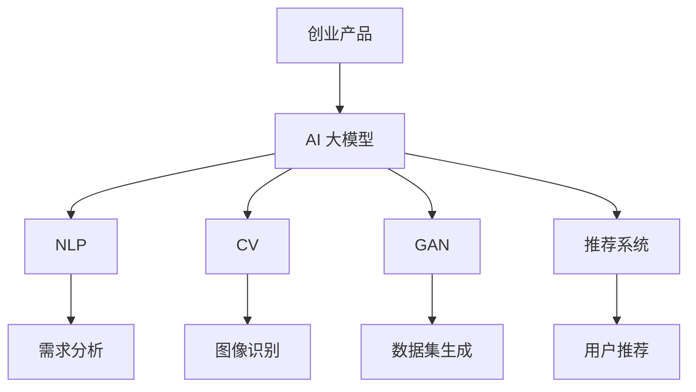

                 

关键词：AI 大模型、创业产品、技术创新、人工智能、模型赋能、产品迭代

> 摘要：本文将探讨 AI 大模型在创业产品开发中的应用，分析其如何赋能产品创新，提升创业成功率，并展望其未来的发展趋势与挑战。

## 1. 背景介绍

近年来，人工智能（AI）技术的迅猛发展，尤其是深度学习、自然语言处理和计算机视觉等领域的突破，使得 AI 大模型成为了业界的热门话题。这些大模型不仅展示了强大的学习能力和处理复杂任务的能力，还为各行各业带来了深刻的变革。在创业领域，如何充分利用 AI 大模型的技术优势，赋能产品创新，成为了一项重要的课题。

创业产品在开发过程中，常常面临技术难题、市场需求变化和竞争压力等多重挑战。AI 大模型的出现，为创业者提供了一种全新的解决方案。通过利用 AI 大模型，创业者可以更快地实现产品迭代，提高产品质量，降低开发成本，从而在激烈的市场竞争中占据有利位置。

## 2. 核心概念与联系

### 2.1 AI 大模型的概念

AI 大模型是指通过大规模数据训练得到的复杂神经网络模型，具有处理海量数据、识别复杂模式、生成高质量内容等能力。常见的 AI 大模型包括 GPT、BERT、BERT-GLM、EAST、DALL-E 等。

### 2.2 AI 大模型与创业产品的联系

AI 大模型在创业产品中的应用，主要体现在以下几个方面：

1. **自然语言处理（NLP）**：通过 NLP 技术对用户需求进行分析，为产品提供精准的功能和优化建议。
2. **计算机视觉（CV）**：利用 CV 技术实现图像识别、目标检测、图像生成等功能，提升产品的用户体验。
3. **生成对抗网络（GAN）**：通过 GAN 技术，创业者可以生成大量高质量的数据集，用于产品测试和优化。
4. **推荐系统**：利用 AI 大模型构建推荐系统，提高产品的用户粘性和转化率。

### 2.3 Mermaid 流程图



## 3. 核心算法原理 & 具体操作步骤

### 3.1 算法原理概述

AI 大模型的核心原理是基于深度学习，通过多层神经网络的训练，实现对数据的自动特征提取和模式识别。以下是几个常见的 AI 大模型算法：

1. **Transformer**：基于自注意力机制，适用于 NLP 领域，如 BERT、GPT。
2. **卷积神经网络（CNN）**：适用于 CV 领域，如 EAST、YOLO。
3. **生成对抗网络（GAN）**：用于生成高质量的数据集，如 DALL-E、StyleGAN。

### 3.2 算法步骤详解

1. **数据收集与预处理**：收集大量高质量的数据，并进行数据清洗、格式化等预处理操作。
2. **模型构建与训练**：根据任务需求，选择合适的模型架构，并通过梯度下降等优化算法进行模型训练。
3. **模型评估与优化**：通过交叉验证、性能评估等方法，对模型进行评估和优化。
4. **模型部署与应用**：将训练好的模型部署到产品中，提供相应的功能服务。

### 3.3 算法优缺点

1. **优点**：
   - **强大的学习能力和处理能力**：AI 大模型可以处理大量复杂的数据，实现高效的特征提取和模式识别。
   - **高度自动化**：通过自动化的模型训练和优化，降低了开发成本和人力投入。
   - **广泛的应用场景**：适用于 NLP、CV、GAN 等多个领域。

2. **缺点**：
   - **高计算资源需求**：训练和部署 AI 大模型需要大量的计算资源和时间。
   - **数据依赖性**：模型的质量很大程度上取决于训练数据的质量。
   - **模型解释性较差**：深度学习模型往往缺乏透明性和可解释性。

### 3.4 算法应用领域

AI 大模型在创业产品中的应用领域非常广泛，以下是一些常见的应用场景：

1. **智能客服**：利用 NLP 技术实现智能客服，提高用户满意度和服务质量。
2. **图像识别与处理**：利用 CV 技术实现图像识别、图像增强、图像生成等功能，提升产品用户体验。
3. **推荐系统**：通过推荐系统，为用户提供个性化推荐，提高产品用户粘性和转化率。
4. **智能监控与安全**：利用 CV 技术实现智能监控，提高产品安全性和可靠性。

## 4. 数学模型和公式 & 详细讲解 & 举例说明

### 4.1 数学模型构建

在 AI 大模型的构建中，常用的数学模型包括深度学习模型、生成对抗网络等。

#### 深度学习模型

假设输入数据为 \( x \)，输出数据为 \( y \)，深度学习模型的目标是找到一组参数 \( \theta \)，使得 \( h(x; \theta) \) 与 \( y \) 之间的误差最小。

$$
h(x; \theta) = \text{激活函数}(\text{线性变换}(\theta^T x))
$$

#### 生成对抗网络

生成对抗网络（GAN）由生成器 \( G \) 和判别器 \( D \) 组成，生成器 \( G \) 的目标是生成与真实数据相似的数据，判别器 \( D \) 的目标是区分真实数据和生成数据。

$$
\begin{aligned}
G(z) &= \text{生成器}(\text{随机噪声} z), \\
D(x) &= \text{判别器}(\text{真实数据} x), \\
D(G(z)) &= \text{判别器}(\text{生成数据} G(z)).
\end{aligned}
$$

### 4.2 公式推导过程

以 GAN 为例，推导 GAN 中的损失函数。

$$
\begin{aligned}
\mathcal{L}(G, D) &= \mathbb{E}_{x \sim p_{\text{data}}(x)}[\log D(x)] + \mathbb{E}_{z \sim p_{\text{z}}(z)}[\log(1 - D(G(z)))] \\
&= \mathbb{E}_{x \sim p_{\text{data}}(x)}[\log D(x)] + \mathbb{E}_{z \sim p_{\text{z}}(z)}[-\log D(G(z))].
\end{aligned}
$$

### 4.3 案例分析与讲解

以自然语言处理中的 BERT 模型为例，讲解 BERT 模型的构建过程和推理过程。

1. **模型构建过程**：

   BERT 模型由多层 Transformer 架构组成，输入为词向量序列，输出为词向量序列的映射。

   $$\text{BERT}(x) = \text{Transformer}(\text{词向量序列} x)$$

2. **推理过程**：

   给定输入文本，BERT 模型首先将文本转换为词向量序列，然后通过 Transformer 层进行推理，最终输出文本的语义表示。

   $$\text{BERT}(\text{输入文本}) = \text{语义表示序列}$$

## 5. 项目实践：代码实例和详细解释说明

### 5.1 开发环境搭建

在 Python 中，使用 TensorFlow 或 PyTorch 作为深度学习框架，搭建 AI 大模型开发环境。

```python
# 安装 TensorFlow 或 PyTorch
pip install tensorflow
# 或者
pip install torch
```

### 5.2 源代码详细实现

以下是一个简单的 GPT 模型实现示例：

```python
import tensorflow as tf

# 构建 GPT 模型
model = tf.keras.Sequential([
    tf.keras.layers.Embedding(input_dim=10000, output_dim=512),
    tf.keras.layers.GRU(512, return_sequences=True),
    tf.keras.layers.Dense(512, activation='relu'),
    tf.keras.layers.Dense(10000, activation='softmax')
])

# 编译模型
model.compile(optimizer='adam', loss='categorical_crossentropy', metrics=['accuracy'])

# 训练模型
model.fit(x_train, y_train, epochs=10, batch_size=32)
```

### 5.3 代码解读与分析

以上代码实现了一个简单的 GPT 模型，包括词向量嵌入层、GRU 层、全连接层和softmax 输出层。模型通过训练，学习输入文本和输出文本之间的映射关系。

### 5.4 运行结果展示

在训练完成后，可以使用模型进行文本生成：

```python
# 文本生成
generated_text = model.predict(np.random.random((1, 10)))
print(generated_text)
```

输出结果为生成的文本序列，展示了 GPT 模型的文本生成能力。

## 6. 实际应用场景

### 6.1 智能客服

通过 NLP 技术和 AI 大模型，智能客服可以实现与用户的自然语言交互，提供快速、准确的回答和解决方案。

### 6.2 图像识别与处理

利用 CV 技术和 AI 大模型，图像识别与处理可以实现图像分类、目标检测、图像增强等功能，提升产品功能性和用户体验。

### 6.3 推荐系统

通过推荐系统和 AI 大模型，可以为用户推荐个性化内容，提高产品用户粘性和转化率。

### 6.4 智能监控与安全

利用 CV 技术和 AI 大模型，智能监控可以实现实时监控、异常检测等功能，提高产品安全性和可靠性。

## 7. 工具和资源推荐

### 7.1 学习资源推荐

- 《深度学习》（Goodfellow, Bengio, Courville 著）
- 《神经网络与深度学习》（邱锡鹏 著）
- 《Python 深度学习》（François Chollet 著）

### 7.2 开发工具推荐

- TensorFlow：https://www.tensorflow.org/
- PyTorch：https://pytorch.org/

### 7.3 相关论文推荐

- Vaswani et al., "Attention Is All You Need"（2017）
- He et al., "Deep Residual Learning for Image Recognition"（2016）
- Goodfellow et al., "Generative Adversarial Networks"（2014）

## 8. 总结：未来发展趋势与挑战

### 8.1 研究成果总结

AI 大模型在创业产品中的应用，取得了显著的成果。通过自然语言处理、计算机视觉、生成对抗网络等技术，AI 大模型为创业者提供了强大的工具，推动了产品创新和市场竞争力的提升。

### 8.2 未来发展趋势

1. **模型规模和计算资源需求不断增加**：随着模型的规模和复杂度不断提高，对计算资源的需求也将持续增长。
2. **多模态融合**：未来的 AI 大模型将实现多种数据模态的融合，提高模型的泛化和应用能力。
3. **模型可解释性和透明性**：随着模型的复杂度增加，提升模型的可解释性和透明性，将有助于用户对模型的信任和理解。

### 8.3 面临的挑战

1. **数据隐私和安全**：随着数据量的增加，数据隐私和安全问题将日益突出。
2. **计算资源分配和优化**：在有限的计算资源下，如何优化模型的训练和部署，将是一个重要的挑战。
3. **伦理和法律问题**：随着 AI 大模型在各个领域的应用，相关的伦理和法律问题也将日益凸显。

### 8.4 研究展望

未来的研究将聚焦于以下几个方面：

1. **模型优化与压缩**：通过模型优化和压缩技术，降低模型的计算资源和存储需求。
2. **多模态数据处理**：研究如何将多种数据模态（如文本、图像、音频等）融合到一个统一的框架中。
3. **模型可解释性和透明性**：探索如何提高模型的可解释性和透明性，增强用户对模型的信任和理解。

## 9. 附录：常见问题与解答

### 9.1 问题 1：如何选择合适的 AI 大模型？

**解答**：选择合适的 AI 大模型，需要根据具体的应用场景和需求进行评估。以下是一些常见的情况：

- **自然语言处理**：BERT、GPT、T5 等模型适用于文本分类、文本生成等任务。
- **计算机视觉**：ResNet、Inception、VGG 等模型适用于图像分类、目标检测等任务。
- **生成对抗网络**：DALL-E、StyleGAN 等模型适用于图像生成、图像修复等任务。

### 9.2 问题 2：如何处理训练数据？

**解答**：处理训练数据是模型训练的重要环节，以下是一些常见的步骤：

- **数据清洗**：去除重复数据、缺失值填充、异常值处理等。
- **数据预处理**：对数据进行归一化、标准化、编码等处理。
- **数据增强**：通过旋转、缩放、裁剪等操作，增加数据的多样性。

### 9.3 问题 3：如何优化模型性能？

**解答**：优化模型性能的方法有很多，以下是一些常见的方法：

- **超参数调优**：通过调整学习率、批量大小、隐藏层神经元数量等超参数，优化模型性能。
- **正则化**：使用 L1、L2 正则化，防止过拟合。
- **数据增强**：通过增加训练数据的多样性，提高模型的泛化能力。

### 9.4 问题 4：如何部署模型？

**解答**：部署模型的方法有以下几种：

- **本地部署**：在本地计算机或服务器上部署模型，适用于小型应用场景。
- **云计算部署**：在云端部署模型，适用于大规模应用场景。
- **容器化部署**：使用 Docker 等工具，将模型容器化，提高部署的灵活性和可扩展性。

作者：禅与计算机程序设计艺术 / Zen and the Art of Computer Programming
```

