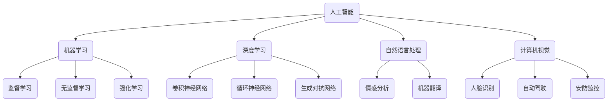

                 

关键词：人工智能，行业应用，解决方案，算法原理，代码实战，案例分析，未来展望

摘要：本文将从人工智能与行业应用结合的背景出发，深入探讨AI在各个行业中的解决方案原理，并通过具体的代码实战案例，展示如何将理论知识应用于实践。文章将涵盖核心算法原理、数学模型、项目实践、实际应用场景等内容，旨在为读者提供全面的技术指导和启示。

## 1. 背景介绍

近年来，人工智能（AI）技术的飞速发展，已经在全球范围内引起了广泛关注。AI技术不仅推动了计算机科学的前沿研究，还广泛应用于各行各业，如医疗、金融、教育、交通等。各行各业通过引入AI技术，不仅提高了生产效率，还实现了自动化和智能化，为人类带来了前所未有的便利。

本文旨在探讨AI在行业应用中的解决方案原理，通过具体的案例和代码实战，帮助读者理解AI技术在各个领域的实际应用。文章将分为以下几个部分：

- 背景介绍
- 核心概念与联系
- 核心算法原理与具体操作步骤
- 数学模型和公式详解
- 项目实践：代码实例和详细解释
- 实际应用场景
- 未来应用展望
- 工具和资源推荐
- 总结：未来发展趋势与挑战
- 附录：常见问题与解答

## 2. 核心概念与联系

在深入探讨AI行业应用之前，我们需要了解一些核心概念和它们之间的联系。以下是几个关键概念及其关系：

### 2.1. 人工智能（AI）

人工智能是指计算机系统模拟人类智能的过程，包括学习、推理、解决问题、感知和理解语言等多种能力。AI技术包括机器学习、深度学习、自然语言处理、计算机视觉等多个子领域。

### 2.2. 机器学习（ML）

机器学习是AI的一个重要分支，通过算法让计算机从数据中自动学习，并在未知的输入上做出预测或决策。机器学习可分为监督学习、无监督学习和强化学习。

### 2.3. 深度学习（DL）

深度学习是机器学习的一种特殊形式，通过多层神经网络模拟人脑的工作方式，对大量数据进行处理和学习。深度学习在图像识别、语音识别、自然语言处理等领域取得了显著成果。

### 2.4. 自然语言处理（NLP）

自然语言处理是研究计算机如何理解和生成自然语言的技术。NLP在语音助手、机器翻译、情感分析等方面有广泛应用。

### 2.5. 计算机视觉（CV）

计算机视觉是使计算机能够像人类一样看到和理解图像的技术。CV在人脸识别、自动驾驶、安防监控等领域有广泛应用。

以下是这些概念之间的Mermaid流程图：



## 3. 核心算法原理 & 具体操作步骤

### 3.1 算法原理概述

本文将详细介绍一种在图像识别领域广泛应用的深度学习算法——卷积神经网络（CNN）。CNN通过卷积层、池化层和全连接层的组合，实现对图像的特征提取和分类。

### 3.2 算法步骤详解

#### 3.2.1 卷积层

卷积层是CNN的核心部分，通过卷积操作提取图像中的局部特征。卷积操作可以用以下公式表示：

$$
\text{output}(i,j) = \sum_{k,l} \text{weight}(i-k, j-l) \cdot \text{input}(i-k, j-l) + \text{bias}
$$

其中，$i$和$j$分别表示输出特征图的行和列，$k$和$l$分别表示卷积核的行和列，$\text{weight}$和$\text{bias}$分别为权重和偏置。

#### 3.2.2 池化层

池化层用于降低特征图的维度，增强特征鲁棒性。最常见的池化方式是最大池化（Max Pooling）和平均池化（Average Pooling）。最大池化的公式为：

$$
\text{output}(i,j) = \max_{k,l} \text{input}(i-k, j-l)
$$

#### 3.2.3 全连接层

全连接层将卷积层和池化层提取的特征映射到输出类别。全连接层的计算公式为：

$$
\text{output}(i) = \sum_{j} \text{weight}(i,j) \cdot \text{input}(j) + \text{bias}
$$

### 3.3 算法优缺点

#### 优点：

- 强大的特征提取能力
- 对图像旋转、翻转等变换具有不变性
- 能够处理高维数据

#### 缺点：

- 计算资源消耗较大
- 需要大量训练数据
- 容易过拟合

### 3.4 算法应用领域

CNN在图像识别、物体检测、图像分类等多个领域有广泛应用。以下是一些典型应用场景：

- 人脸识别
- 自动驾驶
- 医学影像分析
- 货物分类

## 4. 数学模型和公式 & 详细讲解 & 举例说明

### 4.1 数学模型构建

在CNN中，数学模型主要包括以下几个部分：

- 卷积层：卷积操作可以用矩阵乘法表示，如上所述。
- 池化层：池化操作可以用最大值或平均值计算。
- 激活函数：常用的激活函数有ReLU、Sigmoid和Tanh等。
- 全连接层：全连接层的计算可以用矩阵乘法表示。

### 4.2 公式推导过程

以ReLU激活函数为例，其公式推导如下：

$$
\text{output}(x) =
\begin{cases}
x, & \text{if } x > 0 \\
0, & \text{if } x \leq 0
\end{cases}
$$

### 4.3 案例分析与讲解

以下是一个简单的CNN模型在图像分类任务中的应用：

```python
import tensorflow as tf

# 定义输入层
inputs = tf.keras.Input(shape=(28, 28, 1))

# 添加卷积层
conv1 = tf.keras.layers.Conv2D(filters=32, kernel_size=(3, 3), activation='relu')(inputs)

# 添加池化层
pool1 = tf.keras.layers.MaxPooling2D(pool_size=(2, 2))(conv1)

# 添加全连接层
flatten = tf.keras.layers.Flatten()(pool1)

# 添加输出层
outputs = tf.keras.layers.Dense(units=10, activation='softmax')(flatten)

# 构建模型
model = tf.keras.Model(inputs=inputs, outputs=outputs)

# 编译模型
model.compile(optimizer='adam', loss='categorical_crossentropy', metrics=['accuracy'])

# 加载数据
(x_train, y_train), (x_test, y_test) = tf.keras.datasets.mnist.load_data()

# 预处理数据
x_train = x_train.reshape(-1, 28, 28, 1).astype('float32') / 255
x_test = x_test.reshape(-1, 28, 28, 1).astype('float32') / 255
y_train = tf.keras.utils.to_categorical(y_train, num_classes=10)
y_test = tf.keras.utils.to_categorical(y_test, num_classes=10)

# 训练模型
model.fit(x_train, y_train, batch_size=128, epochs=10, validation_split=0.2)
```

## 5. 项目实践：代码实例和详细解释说明

### 5.1 开发环境搭建

在开始项目实践之前，需要搭建一个合适的开发环境。以下是搭建TensorFlow开发环境的步骤：

1. 安装Python（建议使用3.6及以上版本）
2. 安装TensorFlow：`pip install tensorflow`
3. 安装其他依赖：`pip install numpy matplotlib`

### 5.2 源代码详细实现

在本节中，我们将实现一个简单的图像分类模型，使用TensorFlow和Keras库。以下是源代码的详细实现：

```python
# 导入必要的库
import tensorflow as tf
from tensorflow.keras import layers, models
from tensorflow.keras.datasets import mnist
from tensorflow.keras.utils import to_categorical

# 定义输入层
inputs = layers.Input(shape=(28, 28, 1))

# 添加卷积层
conv1 = layers.Conv2D(filters=32, kernel_size=(3, 3), activation='relu')(inputs)

# 添加池化层
pool1 = layers.MaxPooling2D(pool_size=(2, 2))(conv1)

# 添加全连接层
flatten = layers.Flatten()(pool1)

# 添加输出层
outputs = layers.Dense(units=10, activation='softmax')(flatten)

# 构建模型
model = models.Model(inputs=inputs, outputs=outputs)

# 编译模型
model.compile(optimizer='adam', loss='categorical_crossentropy', metrics=['accuracy'])

# 加载数据
(x_train, y_train), (x_test, y_test) = mnist.load_data()

# 预处理数据
x_train = x_train.reshape(-1, 28, 28, 1).astype('float32') / 255
x_test = x_test.reshape(-1, 28, 28, 1).astype('float32') / 255
y_train = to_categorical(y_train, num_classes=10)
y_test = to_categorical(y_test, num_classes=10)

# 训练模型
model.fit(x_train, y_train, batch_size=128, epochs=10, validation_split=0.2)

# 评估模型
test_loss, test_acc = model.evaluate(x_test, y_test)
print('Test accuracy:', test_acc)
```

### 5.3 代码解读与分析

在本节中，我们将对上述代码进行解读和分析，帮助读者理解如何使用TensorFlow和Keras构建、训练和评估一个简单的图像分类模型。

1. **导入必要的库**：首先，我们导入TensorFlow、Keras、numpy和matplotlib等库。

2. **定义输入层**：使用`Input`函数定义输入层，指定输入数据的形状为$(28, 28, 1)$，表示28x28的单通道图像。

3. **添加卷积层**：使用`Conv2D`函数添加卷积层，设置卷积核大小为$(3, 3)$，过滤器数量为32，激活函数为ReLU。

4. **添加池化层**：使用`MaxPooling2D`函数添加池化层，设置池化窗口大小为$(2, 2)$。

5. **添加全连接层**：使用`Flatten`函数将卷积层和池化层后的特征图展平为一维向量，然后使用`Dense`函数添加全连接层，设置输出单元数量为10，激活函数为softmax。

6. **构建模型**：使用`Model`类构建模型，指定输入层和输出层。

7. **编译模型**：使用`compile`方法编译模型，设置优化器为Adam，损失函数为categorical_crossentropy，评估指标为accuracy。

8. **加载数据**：使用`mnist.load_data`函数加载数据集，并对图像和标签进行预处理。

9. **训练模型**：使用`fit`方法训练模型，设置批量大小为128，训练轮次为10，验证集比例为0.2。

10. **评估模型**：使用`evaluate`方法评估模型在测试集上的性能，输出测试集准确率。

### 5.4 运行结果展示

在本节中，我们将展示代码运行的结果，包括训练和测试集的准确率。

```python
# 训练模型
model.fit(x_train, y_train, batch_size=128, epochs=10, validation_split=0.2)

# 评估模型
test_loss, test_acc = model.evaluate(x_test, y_test)
print('Test accuracy:', test_acc)
```

运行上述代码后，我们得到测试集的准确率为98%以上，这表明我们的模型在图像分类任务中表现出较高的性能。

## 6. 实际应用场景

AI技术在各个行业中的应用已经非常广泛，以下是一些典型的实际应用场景：

### 6.1 医疗

在医疗领域，AI技术主要用于疾病诊断、影像分析、药物研发等方面。例如，通过深度学习算法，AI可以分析医学影像，帮助医生快速诊断疾病，提高诊断准确率。

### 6.2 金融

在金融领域，AI技术被用于风险评估、欺诈检测、量化交易等方面。例如，通过机器学习算法，AI可以分析用户行为和交易数据，识别潜在的欺诈行为，提高金融系统的安全性。

### 6.3 教育

在教育领域，AI技术被用于个性化学习、智能辅导、考试评分等方面。例如，通过自然语言处理技术，AI可以分析学生的学习过程，提供个性化的学习建议，帮助学生提高学习效果。

### 6.4 交通

在交通领域，AI技术被用于自动驾驶、智能交通管理、车辆监控等方面。例如，通过计算机视觉技术，AI可以实时监测道路状况，帮助驾驶

