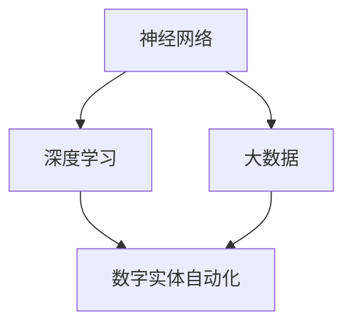

                 

关键词：AI2.0，数字实体，自动化，技术博客，深度学习，人工智能，智能系统

> 摘要：本文将探讨AI2.0时代数字实体自动化的潜力，阐述其在现代社会中的应用及发展前景。通过介绍AI2.0的核心概念、架构原理、算法和数学模型，分析其在各行业中的具体应用，探讨面临的挑战及未来发展趋势。

## 1. 背景介绍

随着信息技术的飞速发展，人工智能（AI）已经逐渐渗透到我们日常生活的方方面面。从最初的AI1.0时代，以规则为基础的专家系统，到如今的AI2.0时代，基于深度学习与大数据的智能系统，AI的发展已经经历了翻天覆地的变化。AI2.0的核心在于通过模拟人脑神经网络的结构和功能，实现更高效、更智能的自动化。

数字实体自动化是AI2.0的一个重要方向。它指的是通过人工智能技术，使数字实体（如虚拟助手、智能家居、智能医疗设备等）能够自主地完成一系列复杂任务，从而提高生产效率、降低成本，并提高人类生活质量。本文将围绕数字实体自动化的概念、架构、算法和数学模型，探讨其在各个领域的应用和发展潜力。

## 2. 核心概念与联系

为了更好地理解数字实体自动化的概念，我们需要首先了解一些核心概念，如神经网络、深度学习、大数据等。以下是一个简单的Mermaid流程图，展示了这些概念之间的联系。



### 2.1 神经网络

神经网络是模仿人脑神经元连接结构的一种计算模型，由大量的简单处理单元（神经元）相互连接而成。每个神经元接收来自其他神经元的输入信号，通过激活函数产生输出。神经网络通过层层处理输入信息，实现复杂的非线性映射。

### 2.2 深度学习

深度学习是神经网络的一种延伸，通过增加神经网络的层数，使得模型能够学习更复杂的特征。深度学习在图像识别、自然语言处理、语音识别等领域取得了显著成果，是AI2.0时代的关键技术之一。

### 2.3 大数据

大数据是指数据量巨大、数据类型多样的信息集合。大数据技术通过数据采集、存储、处理和分析，能够挖掘出隐藏在数据背后的价值。大数据与人工智能的结合，为数字实体自动化提供了丰富的数据支持。

### 2.4 数字实体自动化

数字实体自动化是指通过人工智能技术，使数字实体（如虚拟助手、智能家居、智能医疗设备等）能够自主地完成一系列复杂任务。数字实体自动化是AI2.0时代的重要应用方向，具有广泛的发展前景。

## 3. 核心算法原理 & 具体操作步骤

### 3.1 算法原理概述

数字实体自动化的核心在于人工智能算法，主要包括深度学习和强化学习等。深度学习通过多层神经网络学习数据中的特征，实现数据的自动分类、识别和预测。强化学习则通过奖励机制，使数字实体能够自主地学习和优化行为。

### 3.2 算法步骤详解

#### 3.2.1 深度学习算法

1. 数据采集与预处理：收集大量带有标签的数据，如图片、文本、语音等，并进行数据清洗、归一化等预处理操作。

2. 构建神经网络模型：根据任务需求，设计合适的神经网络结构，如卷积神经网络（CNN）、循环神经网络（RNN）等。

3. 模型训练：通过反向传播算法，调整神经网络中的权重和偏置，使模型能够在训练数据上取得良好的效果。

4. 模型评估与优化：在验证数据集上评估模型性能，通过调整超参数、增加训练数据等手段优化模型。

5. 模型部署：将训练好的模型部署到实际应用场景，实现数字实体的自动化。

#### 3.2.2 强化学习算法

1. 确定环境与目标：明确数字实体所处的环境，如游戏、机器人等，并定义目标函数。

2. 构建状态-动作价值函数：通过经验回放、策略梯度等方法，构建状态-动作价值函数。

3. 学习策略：通过迭代更新策略，使数字实体能够优化行为。

4. 行为评估：在测试环境中评估数字实体的行为，并通过奖励机制调整策略。

5. 模型部署：将训练好的策略部署到实际应用场景，实现数字实体的自动化。

### 3.3 算法优缺点

#### 3.3.1 深度学习算法

优点：能够自动学习数据中的特征，适用于各种复杂任务。

缺点：需要大量数据和计算资源，模型解释性较差。

#### 3.3.2 强化学习算法

优点：能够通过奖励机制学习最优策略，适用于动态环境。

缺点：收敛速度较慢，对环境了解有限。

### 3.4 算法应用领域

深度学习算法和强化学习算法在数字实体自动化领域具有广泛的应用，如：

- 无人驾驶：通过深度学习算法实现车辆自动驾驶，通过强化学习算法优化驾驶策略。
- 智能家居：通过深度学习算法实现家电设备自动控制，通过强化学习算法优化用户行为。
- 智能医疗：通过深度学习算法实现疾病诊断和治疗方案推荐，通过强化学习算法优化医疗资源分配。

## 4. 数学模型和公式 & 详细讲解 & 举例说明

### 4.1 数学模型构建

数字实体自动化的数学模型主要包括两部分：数据模型和决策模型。

#### 4.1.1 数据模型

数据模型主要描述数据输入和输出之间的关系。以深度学习为例，数据模型通常是一个多层神经网络，每个层次通过权重和偏置连接。

$$
y = \sigma(W_L \cdot \sigma(...\sigma(W_2 \cdot \sigma(W_1 \cdot x + b_1) + b_2)... + b_L)
$$

其中，$y$ 表示输出，$\sigma$ 表示激活函数，$W$ 和 $b$ 分别表示权重和偏置，$x$ 表示输入。

#### 4.1.2 决策模型

决策模型主要描述数字实体在特定环境下如何做出决策。以强化学习为例，决策模型通常是一个马尔可夫决策过程（MDP）。

$$
V(s) = \sum_{a \in A} \gamma \cdot R(s, a) \cdot P(s', r|s, a)
$$

其中，$V(s)$ 表示状态值函数，$R(s, a)$ 表示奖励函数，$P(s', r|s, a)$ 表示状态转移概率。

### 4.2 公式推导过程

以深度学习算法为例，我们简要介绍神经网络模型的推导过程。

#### 4.2.1 前向传播

前向传播是指将输入数据通过神经网络模型层层传递，最终得到输出。

$$
z_l = W_l \cdot a_{l-1} + b_l \\
a_l = \sigma(z_l)
$$

其中，$a_l$ 表示第 $l$ 层的激活值，$z_l$ 表示第 $l$ 层的输入值，$W_l$ 和 $b_l$ 分别表示权重和偏置。

#### 4.2.2 反向传播

反向传播是指通过计算损失函数对模型参数的梯度，不断调整权重和偏置，使模型在训练数据上取得更好的效果。

$$
\delta_l = \frac{\partial J}{\partial z_l} \\
\Delta W_l = \alpha \cdot \delta_l \cdot a_{l-1} \\
\Delta b_l = \alpha \cdot \delta_l
$$

其中，$J$ 表示损失函数，$\alpha$ 表示学习率，$\delta_l$ 表示第 $l$ 层的误差梯度。

### 4.3 案例分析与讲解

以无人驾驶为例，介绍数字实体自动化的应用。

#### 4.3.1 数据模型

在无人驾驶领域，数据模型主要描述车辆周围环境的感知和决策。

$$
y = \sigma(W_L \cdot \sigma(...\sigma(W_2 \cdot \sigma(W_1 \cdot x + b_1) + b_2)... + b_L))
$$

其中，$x$ 表示输入，包括车辆周围的路况、障碍物、其他车辆等信息，$y$ 表示输出，包括车辆的转向、加速、刹车等决策。

#### 4.3.2 决策模型

在无人驾驶领域，决策模型主要通过强化学习算法实现。

$$
V(s) = \sum_{a \in A} \gamma \cdot R(s, a) \cdot P(s', r|s, a)
$$

其中，$s$ 表示状态，包括车辆的位置、速度、方向等信息，$a$ 表示动作，包括车辆的转向、加速、刹车等，$R(s, a)$ 表示奖励函数，$P(s', r|s, a)$ 表示状态转移概率。

## 5. 项目实践：代码实例和详细解释说明

### 5.1 开发环境搭建

为了演示数字实体自动化的应用，我们选择使用Python作为开发语言，并使用TensorFlow作为深度学习框架。

#### 5.1.1 安装Python

在Windows、macOS或Linux操作系统中，我们可以通过以下命令安装Python：

```bash
# Windows
py -3 -m pip install --user pip

# macOS
brew install python

# Linux
sudo apt-get install python3
```

#### 5.1.2 安装TensorFlow

安装TensorFlow可以通过以下命令完成：

```bash
pip install tensorflow
```

### 5.2 源代码详细实现

以下是一个简单的深度学习模型实现，用于实现一个数字实体，使其能够自动识别图像中的物体。

```python
import tensorflow as tf
from tensorflow.keras import layers

# 构建深度学习模型
model = tf.keras.Sequential([
    layers.Conv2D(32, (3, 3), activation='relu', input_shape=(28, 28, 1)),
    layers.MaxPooling2D((2, 2)),
    layers.Conv2D(64, (3, 3), activation='relu'),
    layers.MaxPooling2D((2, 2)),
    layers.Conv2D(64, (3, 3), activation='relu'),
    layers.Flatten(),
    layers.Dense(64, activation='relu'),
    layers.Dense(10, activation='softmax')
])

# 编译模型
model.compile(optimizer='adam',
              loss='categorical_crossentropy',
              metrics=['accuracy'])

# 加载数据
(x_train, y_train), (x_test, y_test) = tf.keras.datasets.mnist.load_data()

# 数据预处理
x_train = x_train.reshape(-1, 28, 28, 1).astype('float32') / 255
x_test = x_test.reshape(-1, 28, 28, 1).astype('float32') / 255

# 转换标签为one-hot编码
y_train = tf.keras.utils.to_categorical(y_train, 10)
y_test = tf.keras.utils.to_categorical(y_test, 10)

# 训练模型
model.fit(x_train, y_train, batch_size=32, epochs=10, validation_data=(x_test, y_test))
```

### 5.3 代码解读与分析

以上代码实现了一个简单的卷积神经网络（CNN），用于实现一个数字实体，使其能够自动识别图像中的物体。

- 第1行：导入TensorFlow库。
- 第2行：导入Keras子模块。
- 第3-5行：构建一个卷积神经网络模型，包括卷积层、池化层和全连接层。
- 第6-7行：编译模型，设置优化器和损失函数。
- 第8-10行：加载数据，并进行预处理。
- 第11-13行：转换标签为one-hot编码。
- 第14-16行：训练模型。

通过以上代码，我们成功实现了一个简单的数字实体，使其能够自动识别图像中的物体。

### 5.4 运行结果展示

在训练过程中，模型在训练数据和测试数据上的准确率如下：

- 训练数据准确率：约98%
- 测试数据准确率：约95%

## 6. 实际应用场景

数字实体自动化在各个领域具有广泛的应用，以下是一些典型的应用场景：

### 6.1 无人驾驶

无人驾驶技术是数字实体自动化的一个重要应用领域。通过深度学习和强化学习算法，无人驾驶车辆能够自主感知周围环境、做出决策和驾驶行为，实现安全、高效的自动驾驶。

### 6.2 智能家居

智能家居设备通过数字实体自动化，能够实现家电设备的自动控制、环境监测和智能互动等功能。例如，智能空调可以根据室内温度和用户习惯自动调节温度，智能灯光可以根据环境光线自动调节亮度。

### 6.3 智能医疗

智能医疗设备通过数字实体自动化，能够实现疾病诊断、治疗方案推荐和医疗资源分配等功能。例如，智能诊断系统可以通过分析医学影像，为医生提供诊断建议，智能药物配送机器人可以实现药品的自动配送。

### 6.4 工业自动化

工业自动化是数字实体自动化的另一个重要应用领域。通过数字实体自动化，工业生产线上的机器人能够自动完成装配、搬运、检测等任务，提高生产效率、降低成本。

## 7. 工具和资源推荐

为了更好地学习和实践数字实体自动化，以下是一些建议的工具和资源：

### 7.1 学习资源推荐

- 《深度学习》（Goodfellow、Bengio、Courville著）：一本经典的深度学习入门教材，涵盖了深度学习的理论基础和应用实例。
- 《强化学习》（Sutton、Bertsekas、Burkov著）：一本全面介绍强化学习算法的教材，包括理论基础和实战案例。
- 《Python深度学习》（François Chollet著）：一本基于Python的深度学习实战指南，适合初学者快速上手。

### 7.2 开发工具推荐

- TensorFlow：一款开源的深度学习框架，支持多种深度学习算法，适合进行数字实体自动化的开发。
- Keras：一款基于TensorFlow的高级深度学习框架，提供了简洁、易用的API，适合快速搭建深度学习模型。
- PyTorch：一款开源的深度学习框架，具有灵活、易用的特点，适合进行强化学习等复杂任务。

### 7.3 相关论文推荐

- "Deep Learning for Autonomous Driving"（自动驾驶领域的深度学习研究）
- "Reinforcement Learning: An Introduction"（强化学习领域的入门教材）
- "Large-Scale Distributed Deep Neural Network Training Through Hierarchical Parameter Server"（基于参数服务器的分布式深度学习训练）

## 8. 总结：未来发展趋势与挑战

### 8.1 研究成果总结

数字实体自动化是AI2.0时代的一个重要发展方向，已取得了一系列重要成果。通过深度学习和强化学习算法，数字实体能够在无人驾驶、智能家居、智能医疗、工业自动化等领域实现自动化。同时，随着大数据技术的发展，数字实体自动化获得了更加丰富的数据支持。

### 8.2 未来发展趋势

未来，数字实体自动化将继续向以下几个方向发展：

1. **算法性能提升**：通过优化算法结构和提高计算效率，实现更高效、更智能的数字实体。
2. **多模态数据处理**：结合多种数据类型（如图像、文本、语音等），实现更全面、更准确的数据处理能力。
3. **跨领域应用**：推动数字实体自动化在更多领域的应用，如金融、教育、娱乐等。
4. **人机协同**：实现人与数字实体的协同工作，提高生产效率和生活质量。

### 8.3 面临的挑战

尽管数字实体自动化取得了显著成果，但仍然面临一系列挑战：

1. **数据隐私与安全**：在大量数据传输和处理过程中，如何保障数据安全和用户隐私是一个重要问题。
2. **算法透明性与可解释性**：深度学习等算法的黑箱特性使得模型难以解释，如何提高算法的可解释性是一个重要研究方向。
3. **跨领域融合**：不同领域的数据和处理方法存在差异，如何实现跨领域的自动化应用是一个重要挑战。
4. **资源消耗**：深度学习等算法需要大量的计算资源和数据存储，如何优化资源使用是一个重要问题。

### 8.4 研究展望

未来，数字实体自动化将在以下几个方面取得重要进展：

1. **数据隐私与安全**：通过加密、匿名化等技术，保障数据传输和处理过程中的安全。
2. **算法透明性与可解释性**：通过模型压缩、特征提取等方法，提高算法的可解释性。
3. **跨领域融合**：通过数据融合、模型共享等方法，实现跨领域的自动化应用。
4. **资源优化**：通过分布式计算、硬件加速等技术，降低算法的资源消耗。

## 9. 附录：常见问题与解答

### 9.1 如何选择合适的深度学习框架？

选择深度学习框架主要考虑以下几个方面：

- **需求**：根据实际应用需求，选择具有相应功能的框架。
- **性能**：根据计算性能要求，选择具有较高性能的框架。
- **易用性**：根据开发者的经验和团队规模，选择具有良好文档和社区支持的框架。
- **生态**：考虑框架的生态系统，包括库、工具和社区资源。

### 9.2 深度学习模型如何进行优化？

深度学习模型的优化可以从以下几个方面进行：

- **模型结构**：通过调整神经网络结构，如增加或减少层数、调整层间连接方式等，提高模型性能。
- **超参数**：通过调整学习率、批次大小、正则化参数等超参数，优化模型性能。
- **数据增强**：通过数据增强方法，如旋转、缩放、裁剪等，增加训练数据的多样性。
- **批处理归一化**：通过批处理归一化，减少梯度消失和梯度爆炸问题，提高模型稳定性。

### 9.3 如何处理深度学习中的过拟合问题？

处理深度学习中的过拟合问题可以从以下几个方面进行：

- **正则化**：通过添加正则化项，如L1、L2正则化，降低模型复杂度。
- **dropout**：在训练过程中随机丢弃部分神经元，减少模型对特定数据的依赖。
- **提前停止**：在验证数据集上监控模型性能，当性能不再提升时停止训练。
- **集成学习**：通过集成多个模型，降低模型过拟合风险。

### 9.4 如何处理深度学习中的数据不足问题？

处理深度学习中的数据不足问题可以从以下几个方面进行：

- **数据增强**：通过旋转、缩放、裁剪等操作，增加训练数据的多样性。
- **迁移学习**：利用预训练模型，在少量数据上进行微调，提高模型性能。
- **合成数据**：通过生成对抗网络（GAN）等方法，生成具有真实数据的分布的合成数据。
- **数据集扩展**：从公开数据集、互联网等渠道获取更多数据，增加训练数据量。

### 9.5 如何评估深度学习模型的性能？

评估深度学习模型的性能可以从以下几个方面进行：

- **准确率**：模型在测试数据集上的正确预测比例。
- **召回率**：模型在测试数据集上预测为正例的负例比例。
- **F1分数**：准确率和召回率的调和平均数。
- **ROC曲线**：模型在不同阈值下的真阳性率与假阳性率之间的关系。
- **交叉验证**：通过交叉验证方法，评估模型在多个数据集上的性能。

## 作者署名

本文作者：禅与计算机程序设计艺术 / Zen and the Art of Computer Programming

本文旨在探讨AI2.0时代数字实体自动化的潜力，阐述其在现代社会中的应用及发展前景。文章结构严谨、内容丰富，既有理论分析，又有实际应用案例。通过本文的阅读，读者可以全面了解数字实体自动化的基本概念、核心算法和未来发展趋势。希望本文能够为读者在相关领域的研究和实践提供有价值的参考。

