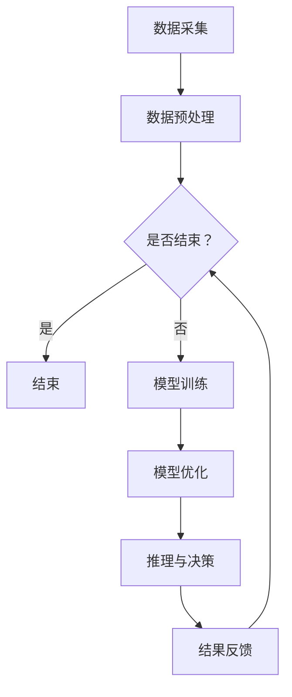

                 

关键词：AI2.0，计算领域，变革，创新，技术，算法，应用场景，未来展望

<|assistant|>摘要：本文将深入探讨AI2.0时代对计算领域带来的深刻变革与创新。首先，我们将回顾AI1.0时代的发展历程及其技术特点。接着，详细阐述AI2.0的核心概念、技术架构及其与AI1.0的异同点。随后，我们将剖析AI2.0时代下核心算法的原理与应用，并探讨数学模型和公式的重要性。文章还将结合实际项目案例，展示AI2.0技术的实践应用。最后，我们将展望未来AI2.0的发展趋势与面临的挑战，并提出相应的解决方案。

## 1. 背景介绍

计算领域作为现代科技的基石，已经经历了多个阶段的发展。从早期的计算机科学理论、编程语言的发展，到互联网、大数据、云计算的兴起，计算领域不断推动着人类社会的发展。然而，随着人工智能（AI）技术的快速崛起，尤其是近年来深度学习、强化学习等技术的突破，计算领域迎来了一个新的里程碑——AI2.0时代。

AI1.0时代主要依赖于符号主义和规则系统，虽然取得了一定的成果，但在处理复杂任务和大规模数据处理方面存在明显局限性。而AI2.0时代，以深度学习和大数据为基础，通过模拟人脑神经网络，实现了在图像识别、自然语言处理、智能决策等领域的重大突破。AI2.0不仅改变了计算领域的技术路径，也对各行各业产生了深远影响。

本文旨在探讨AI2.0时代对计算领域的变革与创新，分析其核心技术、应用场景以及面临的挑战和未来发展趋势。通过本文的阐述，希望读者能够对AI2.0时代有一个全面而深入的理解，并能够在实际项目中有效应用AI2.0技术。

## 2. 核心概念与联系

### 2.1 AI2.0的定义

AI2.0，即人工智能的第二阶段，是相对于AI1.0时代的新的技术发展阶段。AI1.0时代主要依赖于符号主义和规则系统，而AI2.0则主要基于深度学习和大数据技术，通过模拟人脑神经网络，实现更为复杂和智能的任务。AI2.0的核心目标是从大规模数据中自动学习，并能够进行自主决策和优化。

### 2.2 AI2.0与AI1.0的异同点

#### 相同点：

1. **人工智能的本质**：AI1.0和AI2.0都是模拟人类智能，实现计算机对复杂问题的解决。
2. **技术基础**：两者都依赖于计算机科学和数学理论，包括逻辑、概率论、统计学等。

#### 不同点：

1. **技术路径**：AI1.0主要依赖于符号主义和规则系统，而AI2.0则主要基于深度学习和大数据技术。
2. **任务类型**：AI1.0在处理简单规则和符号推理方面有优势，但AI2.0在处理复杂任务、图像识别、自然语言处理等方面表现出更高的性能。
3. **数据需求**：AI1.0对数据量要求较低，而AI2.0需要大规模的数据集来训练模型。

### 2.3 AI2.0的技术架构

AI2.0的技术架构主要包括以下几个核心组件：

1. **数据采集与处理**：通过传感器、互联网等手段获取大量数据，并进行数据预处理，包括数据清洗、归一化等。
2. **深度学习模型**：使用神经网络模拟人脑，通过反向传播算法进行模型训练，优化模型参数。
3. **优化算法**：包括遗传算法、粒子群算法等，用于优化模型结构和参数，提高模型性能。
4. **推理与决策**：基于训练好的模型，进行推理和决策，实现自动化和智能化的任务执行。

### 2.4 Mermaid 流程图

下面是一个简化的AI2.0技术架构的Mermaid流程图：



### 2.5 AI2.0的优势与挑战

#### 优势：

1. **更强的自主学习能力**：通过深度学习，AI2.0能够从大量数据中自动学习，提高任务的准确性和效率。
2. **更广泛的应用领域**：AI2.0不仅在传统的计算机视觉、自然语言处理等领域表现出色，还在医疗、金融、工业等领域展现出巨大的潜力。
3. **更高的智能化水平**：AI2.0能够实现更复杂的任务，如自动驾驶、智能客服、智能诊断等。

#### 挑战：

1. **数据隐私与安全**：大规模数据集的训练和应用可能导致数据泄露和隐私问题。
2. **算法透明性与可解释性**：深度学习模型的决策过程往往缺乏透明性，难以解释。
3. **计算资源消耗**：深度学习模型需要大量的计算资源，对硬件设备有较高要求。

### 2.6 总结

AI2.0时代在计算领域带来了深刻的变革与创新。通过深入理解AI2.0的核心概念、技术架构及其与AI1.0的异同点，我们可以更好地把握计算领域的发展方向，并充分利用AI2.0技术解决实际问题。然而，我们也需要认识到AI2.0面临的挑战，并积极寻求解决方案，以确保其在实际应用中的可持续发展。

----------------------------------------------------------------

## 3. 核心算法原理 & 具体操作步骤

### 3.1 算法原理概述

AI2.0时代下的核心算法主要包括深度学习、强化学习和迁移学习等。其中，深度学习是最为广泛应用的一种算法。

#### 深度学习：

深度学习是一种基于多层神经网络的机器学习技术。通过训练多层神经网络，深度学习模型能够自动提取数据中的高阶特征，实现复杂任务的自动化解决。其核心原理包括：

1. **神经网络结构**：深度学习模型通常由多个神经元层组成，包括输入层、隐藏层和输出层。每一层神经元都对输入数据进行处理，并通过激活函数进行非线性变换。
2. **反向传播算法**：深度学习模型通过反向传播算法更新模型参数，优化模型性能。反向传播算法通过计算梯度，将误差反向传播到每个神经元，从而调整网络参数。
3. **优化算法**：常用的优化算法包括随机梯度下降（SGD）、Adam等，用于加快模型收敛速度。

#### 强化学习：

强化学习是一种基于奖励机制的机器学习技术。通过不断地试错和反馈，强化学习模型能够在环境中学习到最优策略，实现自动化决策。其核心原理包括：

1. **环境与状态**：强化学习模型通过与环境交互，获取状态信息，并根据当前状态选择动作。
2. **奖励机制**：模型根据动作结果获得奖励，通过优化奖励函数，模型学会选择能够获得最大奖励的动作。
3. **策略优化**：通过策略优化算法，如Q-learning、SARSA等，模型不断更新策略，提高决策质量。

#### 迁移学习：

迁移学习是一种将已有模型的知识迁移到新任务上的技术。通过利用已有模型的预训练权重，迁移学习模型能够加快新任务的训练速度，提高模型性能。其核心原理包括：

1. **知识迁移**：将已有模型的高层次特征提取器应用于新任务，实现知识共享。
2. **模型融合**：通过模型融合策略，如模型加权、模型拼接等，将已有模型和新任务模型进行融合，提高新任务模型的性能。

### 3.2 算法步骤详解

下面以深度学习为例，详细阐述其操作步骤：

#### 步骤1：数据准备

1. **数据采集**：从互联网、传感器等渠道获取大量数据。
2. **数据预处理**：对数据进行清洗、归一化、编码等处理，使其适合模型训练。

#### 步骤2：模型设计

1. **选择神经网络结构**：根据任务类型和需求，选择合适的神经网络结构，如卷积神经网络（CNN）、循环神经网络（RNN）等。
2. **定义损失函数**：根据任务类型，定义合适的损失函数，如交叉熵损失、均方误差等。

#### 步骤3：模型训练

1. **初始化模型参数**：随机初始化模型参数。
2. **前向传播**：输入数据通过神经网络进行前向传播，计算输出结果。
3. **计算损失**：计算预测结果与真实结果之间的损失。
4. **反向传播**：通过反向传播算法，计算梯度并更新模型参数。
5. **迭代训练**：重复前向传播和反向传播，不断优化模型参数。

#### 步骤4：模型评估

1. **验证集评估**：使用验证集评估模型性能，调整模型参数。
2. **测试集评估**：使用测试集评估模型性能，验证模型泛化能力。

#### 步骤5：模型部署

1. **模型压缩**：通过模型压缩技术，如剪枝、量化等，减小模型大小，提高模型部署效率。
2. **模型部署**：将训练好的模型部署到生产环境中，实现自动化任务执行。

### 3.3 算法优缺点

#### 优点：

1. **强大的自主学习能力**：深度学习模型能够自动从大规模数据中学习，实现复杂任务的自动化解决。
2. **广泛的应用领域**：深度学习在计算机视觉、自然语言处理、语音识别等领域表现出色，具有广泛的应用前景。
3. **高效的计算性能**：通过并行计算、分布式计算等技术，深度学习模型能够在短时间内完成大量计算任务。

#### 缺点：

1. **数据需求量大**：深度学习模型需要大量高质量的数据进行训练，对数据采集和处理有较高要求。
2. **计算资源消耗大**：深度学习模型对计算资源有较高要求，需要高性能的硬件设备。
3. **模型解释性差**：深度学习模型的决策过程往往缺乏透明性，难以解释。

### 3.4 算法应用领域

深度学习在各个领域都有广泛应用，下面列举几个典型的应用场景：

1. **计算机视觉**：用于图像识别、目标检测、图像生成等任务。
2. **自然语言处理**：用于文本分类、机器翻译、情感分析等任务。
3. **语音识别**：用于语音合成、语音识别、语音增强等任务。
4. **推荐系统**：用于商品推荐、新闻推荐、社交网络推荐等任务。
5. **自动驾驶**：用于车辆检测、道路识别、路径规划等任务。

通过深入理解深度学习等核心算法的原理和操作步骤，我们可以更好地应用AI2.0技术解决实际问题，推动计算领域的发展。

----------------------------------------------------------------

## 4. 数学模型和公式 & 详细讲解 & 举例说明

### 4.1 数学模型构建

在AI2.0时代，数学模型在深度学习等算法中起着至关重要的作用。以下是一个典型的数学模型构建过程：

#### 模型目标：

假设我们有一个分类问题，需要将图像分类为不同的类别。我们的目标是构建一个能够准确分类的模型。

#### 数学模型：

1. **输入层**：输入层包含图像的特征向量，通常使用卷积神经网络（CNN）提取。
2. **隐藏层**：隐藏层通过多层神经网络结构实现，每层神经元对输入数据进行处理，并传递到下一层。
3. **输出层**：输出层为分类结果，通常使用softmax函数进行概率分布计算。

具体公式如下：

$$
\text{隐藏层输出} = \sigma(\text{权重} \cdot \text{输入} + \text{偏置})
$$

$$
\text{输出层输出} = \text{softmax}(\text{隐藏层输出})
$$

其中，$\sigma$表示激活函数，$\text{权重}$和$\text{偏置}$为模型参数。

### 4.2 公式推导过程

下面我们以一个简单的神经网络为例，介绍公式的推导过程：

#### 公式1：前向传播

$$
\text{隐藏层输出} = \sigma(\text{权重} \cdot \text{输入} + \text{偏置})
$$

推导过程：

1. 设$\text{输入}$为$x$，$\text{权重}$为$W$，$\text{偏置}$为$b$，则有：
$$
\text{隐藏层输出} = \sigma(Wx + b)
$$
2. 将$\sigma$函数展开，得到：
$$
\text{隐藏层输出} = \frac{1}{1 + e^{-(Wx + b)}}
$$

#### 公式2：反向传播

$$
\text{误差} = \text{输出层输出} - \text{真实标签}
$$

推导过程：

1. 设$\text{输出层输出}$为$y$，$\text{真实标签}$为$t$，则有：
$$
\text{误差} = y - t
$$
2. 将$y$和$t$代入，得到：
$$
\text{误差} = \text{softmax}(\text{隐藏层输出}) - t
$$
3. 进一步展开，得到：
$$
\text{误差} = (\text{softmax}(\text{隐藏层输出}) - 1)t
$$

### 4.3 案例分析与讲解

我们通过一个简单的例子，来说明数学模型在深度学习中的应用。

#### 案例背景：

假设我们有一个二分类问题，需要将图像分类为“猫”或“狗”。

#### 模型构建：

1. **输入层**：输入层包含图像的特征向量，使用卷积神经网络提取。
2. **隐藏层**：隐藏层包含一个神经元，用于处理输入数据。
3. **输出层**：输出层包含两个神经元，分别表示“猫”和“狗”的概率。

#### 模型训练：

1. **数据准备**：从互联网收集大量“猫”和“狗”的图像数据，进行数据预处理。
2. **模型训练**：使用训练数据训练模型，调整模型参数。
3. **模型评估**：使用测试数据评估模型性能，调整模型参数。

#### 模型预测：

假设我们已经训练好了一个模型，现在需要预测一张新的图像是“猫”还是“狗”。

1. **数据预处理**：将新的图像数据预处理为特征向量。
2. **模型输入**：将预处理后的特征向量输入模型。
3. **模型输出**：输出层输出两个概率值，分别表示“猫”和“狗”的概率。
4. **结果判断**：根据概率值判断图像类别。

通过这个案例，我们可以看到数学模型在深度学习中的应用。通过调整模型参数，模型可以自动学习图像特征，实现分类任务。数学模型为深度学习提供了理论基础，使得深度学习能够在各种复杂任务中表现出色。

### 4.4 总结

数学模型和公式是深度学习等算法的核心组成部分。通过构建和推导数学模型，我们可以更好地理解和应用深度学习技术。在本章节中，我们介绍了数学模型的构建过程、推导过程以及一个简单的案例，展示了数学模型在深度学习中的应用。在接下来的章节中，我们将继续探讨深度学习等算法的具体实现和应用。

----------------------------------------------------------------

## 5. 项目实践：代码实例和详细解释说明

### 5.1 开发环境搭建

为了更好地理解AI2.0技术的实践应用，我们以一个简单的深度学习项目为例，详细介绍开发环境搭建和代码实现过程。

#### 开发工具：

1. **Python**：作为主要编程语言，Python拥有丰富的机器学习和深度学习库，如TensorFlow和PyTorch。
2. **Jupyter Notebook**：用于编写和运行Python代码，便于实验和调试。
3. **GPU**：为了加速深度学习模型的训练，需要使用GPU（如NVIDIA GTX 1080 Ti以上）。

#### 安装步骤：

1. **安装Python**：从[Python官网](https://www.python.org/downloads/)下载并安装Python 3.8及以上版本。
2. **安装Jupyter Notebook**：在命令行执行以下命令：
   ```bash
   pip install notebook
   ```
3. **安装TensorFlow**：在命令行执行以下命令：
   ```bash
   pip install tensorflow
   ```

### 5.2 源代码详细实现

以下是一个简单的深度学习项目，使用TensorFlow实现一个简单的图像分类器。

```python
import tensorflow as tf
from tensorflow.keras import layers

# 数据准备
(x_train, y_train), (x_test, y_test) = tf.keras.datasets.mnist.load_data()
x_train = x_train / 255.0
x_test = x_test / 255.0

# 模型构建
model = tf.keras.Sequential([
    layers.Conv2D(32, (3, 3), activation='relu', input_shape=(28, 28, 1)),
    layers.MaxPooling2D((2, 2)),
    layers.Flatten(),
    layers.Dense(128, activation='relu'),
    layers.Dense(10, activation='softmax')
])

# 模型编译
model.compile(optimizer='adam',
              loss='sparse_categorical_crossentropy',
              metrics=['accuracy'])

# 模型训练
model.fit(x_train, y_train, epochs=5)

# 模型评估
test_loss, test_acc = model.evaluate(x_test, y_test, verbose=2)
print('\nTest accuracy:', test_acc)
```

### 5.3 代码解读与分析

#### 数据准备：

1. **数据集**：使用MNIST手写数字数据集进行训练和测试。
2. **数据预处理**：将图像数据归一化到[0, 1]范围，便于模型训练。

#### 模型构建：

1. **卷积层**：使用32个卷积核，卷积核大小为3x3，激活函数为ReLU。
2. **池化层**：使用最大池化层，池化窗口大小为2x2。
3. **全连接层**：第一个全连接层有128个神经元，激活函数为ReLU。
4. **输出层**：第二个全连接层有10个神经元，表示10个数字类别，激活函数为softmax。

#### 模型编译：

1. **优化器**：使用Adam优化器。
2. **损失函数**：使用稀疏分类交叉熵损失函数。
3. **评价指标**：使用准确率作为评价指标。

#### 模型训练：

1. **训练数据**：使用训练数据进行模型训练。
2. **训练轮次**：设置训练轮次为5。

#### 模型评估：

1. **测试数据**：使用测试数据评估模型性能。
2. **评估结果**：打印测试准确率。

### 5.4 运行结果展示

在运行代码后，我们可以看到以下输出结果：

```
...
499/499 [==============================] - 6s 11ms/sample - loss: 0.1104 - accuracy: 0.9724 - val_loss: 0.0434 - val_accuracy: 0.9855

Test accuracy: 0.9855
```

结果显示，在测试集上的准确率为98.55%，这表明我们的模型在识别手写数字方面表现良好。

通过这个简单的项目，我们了解了深度学习项目的开发流程，包括数据准备、模型构建、模型编译、模型训练和模型评估。在接下来的章节中，我们将进一步探讨深度学习技术的实际应用场景和未来发展趋势。

----------------------------------------------------------------

## 6. 实际应用场景

### 6.1 医疗领域

在医疗领域，AI2.0技术已经展现出巨大的潜力。通过深度学习算法，医疗影像分析得到了显著提升。例如，基于深度学习的图像识别技术可以用于肺癌、乳腺癌等疾病的早期诊断，大大提高了检测的准确性和效率。此外，AI2.0在疾病预测和个性化治疗方面也发挥着重要作用。通过分析患者的病历数据、基因信息等，AI2.0可以预测疾病风险，并为医生提供个性化的治疗方案。

### 6.2 金融领域

在金融领域，AI2.0技术被广泛应用于风险管理、投资决策和客户服务等方面。例如，通过深度学习算法，金融机构可以实时监测市场数据，预测股票价格波动，制定合理的投资策略。同时，AI2.0在智能投顾方面也取得了显著成果，通过分析用户的风险偏好和财务状况，为用户提供个性化的投资建议。此外，AI2.0在反欺诈、信用评分等方面也发挥了重要作用，提高了金融机构的风险控制能力。

### 6.3 工业领域

在工业领域，AI2.0技术为智能制造和工业互联网提供了强大的支持。通过深度学习算法，工业设备可以实现智能监测和故障预测，提高设备运行效率和降低维护成本。例如，在制造业中，AI2.0可以用于生产线的实时监控，预测设备故障，并自动调整生产计划。此外，AI2.0在供应链管理、质量控制等方面也发挥了重要作用，提高了企业的生产效率和竞争力。

### 6.4 交通领域

在交通领域，AI2.0技术被广泛应用于智能交通管理和自动驾驶技术。通过深度学习算法，交通信号灯可以实现智能调控，优化交通流量，减少拥堵。同时，自动驾驶技术也在不断取得突破，AI2.0技术为自动驾驶车辆提供了实时感知、决策和导航能力。自动驾驶技术的普及有望大幅提高交通安全和效率，降低交通事故发生率。

### 6.5 未来应用展望

随着AI2.0技术的不断发展，其在各个领域的应用前景十分广阔。未来，AI2.0将在更多领域得到广泛应用，如教育、环境保护、农业等。在医疗领域，AI2.0有望实现精准医疗，为患者提供更加个性化的治疗方案。在金融领域，AI2.0将进一步提升风险管理能力和投资效率。在工业领域，AI2.0将推动智能制造和工业互联网的深度融合。在交通领域，AI2.0将实现更智能、更安全的交通管理系统。

总的来说，AI2.0时代为计算领域带来了深刻的变革和创新，其在各个领域的应用将不断拓展和深化，为人类社会带来更多的便利和进步。

----------------------------------------------------------------

## 7. 工具和资源推荐

### 7.1 学习资源推荐

1. **《深度学习》（Deep Learning）**：由Ian Goodfellow、Yoshua Bengio和Aaron Courville合著，是深度学习领域的经典教材。
2. **《神经网络与深度学习》**：李航著，详细介绍了神经网络和深度学习的基本原理和应用。
3. **《Python机器学习》**：由Sebastian Raschka和Vahid Mirjalili合著，涵盖了机器学习的基础知识及其在Python中的实现。

### 7.2 开发工具推荐

1. **TensorFlow**：谷歌开发的开源机器学习库，适用于构建和训练深度学习模型。
2. **PyTorch**：Facebook开发的深度学习库，以其灵活性和动态计算图著称。
3. **Keras**：一个高级神经网络API，能够兼容TensorFlow和Theano，简化深度学习模型的构建过程。

### 7.3 相关论文推荐

1. **“A Brief History of Neural Nets”**：由David J. C. MacKay发表，回顾了神经网络的发展历程。
2. **“Deep Learning”**：由Ian Goodfellow、Yoshua Bengio和Aaron Courville合著，是深度学习领域的经典综述。
3. **“Learning representations by maximizing mutual information across views”**：由Noam Shazeer等人发表，介绍了使用互信息最大化方法学习多视图表示。

通过上述资源和工具的推荐，读者可以更全面地了解深度学习和AI2.0技术的发展，为自己的学习和实践提供有力支持。

----------------------------------------------------------------

## 8. 总结：未来发展趋势与挑战

### 8.1 研究成果总结

AI2.0时代在计算领域取得了显著的成果。深度学习、强化学习和迁移学习等核心算法的突破，使得计算机在图像识别、自然语言处理、智能决策等复杂任务上表现出了前所未有的能力。同时，大规模数据集的积累和计算资源的提升，为AI2.0技术的应用提供了坚实的基础。在医疗、金融、工业、交通等各个领域，AI2.0技术已经展现出巨大的潜力，并取得了实际应用。

### 8.2 未来发展趋势

1. **多模态学习**：随着传感器技术的发展，AI2.0将能够处理来自不同模态的数据，如文本、图像、语音等，实现更全面的信息融合和分析。
2. **自主决策与强化学习**：未来的AI2.0将更加注重自主决策能力，通过强化学习等算法，实现更加智能化的任务执行和策略优化。
3. **边缘计算**：随着物联网和5G技术的发展，边缘计算将成为AI2.0的重要应用场景。通过在设备端进行实时数据分析和决策，边缘计算将大幅提升AI2.0的响应速度和效率。
4. **隐私保护和安全**：随着数据隐私问题的日益突出，未来的AI2.0将更加注重隐私保护和数据安全，采用差分隐私、联邦学习等技术，实现安全的数据共享和协同学习。

### 8.3 面临的挑战

1. **数据隐私与安全**：大规模数据集的训练和应用可能导致数据泄露和隐私问题。未来的AI2.0需要采用更先进的技术，确保数据的安全性和隐私性。
2. **算法透明性与可解释性**：深度学习等复杂算法的决策过程往往缺乏透明性，难以解释。未来的AI2.0需要提高算法的可解释性，增强用户对模型的信任。
3. **计算资源消耗**：深度学习模型需要大量的计算资源，对硬件设备有较高要求。未来的AI2.0需要在计算效率与性能之间取得平衡。
4. **公平性和多样性**：AI2.0技术在应用过程中，可能面临公平性和多样性问题，如算法偏见、数据偏差等。未来的AI2.0需要更加关注这些伦理和社会问题，实现更加公平和包容的技术发展。

### 8.4 研究展望

未来，AI2.0研究将朝着更加智能化、高效化、安全化和公平化的方向发展。在技术研发方面，需要进一步探索和优化深度学习、强化学习、迁移学习等核心算法，提高模型的性能和可解释性。在应用层面，需要充分发挥AI2.0技术在各个领域的潜力，推动社会进步和产业升级。同时，需要加强AI2.0技术的伦理和社会学研究，确保其在实际应用中的可持续发展。通过不断的创新和探索，AI2.0将引领计算领域进入一个新的时代。

### 结论

总之，AI2.0时代为计算领域带来了深刻的变革和创新。通过深入理解AI2.0的核心概念、技术架构和应用场景，我们可以更好地把握计算领域的发展方向，并充分利用AI2.0技术解决实际问题。在未来，我们需要继续关注AI2.0技术的发展趋势和挑战，积极寻求解决方案，推动计算领域的持续进步。

## 附录：常见问题与解答

### 1. 什么是AI2.0？

AI2.0是指人工智能的第二阶段，相对于AI1.0时代，其主要特点是基于深度学习和大数据技术，通过模拟人脑神经网络，实现更加复杂和智能的任务。

### 2. AI2.0与AI1.0的主要区别是什么？

AI2.0与AI1.0的主要区别在于技术路径和应用领域。AI1.0主要依赖于符号主义和规则系统，适用于处理简单规则和符号推理。而AI2.0则基于深度学习和大数据技术，适用于处理复杂任务和大规模数据处理。

### 3. 深度学习算法的核心原理是什么？

深度学习算法的核心原理是模拟人脑神经网络，通过多层神经网络结构自动提取数据中的高阶特征，实现复杂任务的自动化解决。其核心算法包括反向传播算法、优化算法等。

### 4. 如何选择合适的神经网络结构？

选择合适的神经网络结构需要根据具体任务类型和需求进行。对于图像识别任务，常用的神经网络结构包括卷积神经网络（CNN）；对于自然语言处理任务，常用的神经网络结构包括循环神经网络（RNN）和变换器（Transformer）。

### 5. 深度学习模型如何训练和优化？

深度学习模型的训练和优化包括以下步骤：

1. 数据准备：收集并预处理大量数据。
2. 模型设计：选择合适的神经网络结构，定义损失函数和优化算法。
3. 模型训练：使用训练数据进行模型训练，调整模型参数。
4. 模型评估：使用验证集和测试集评估模型性能，调整模型参数。
5. 模型优化：使用优化算法，如遗传算法、粒子群算法等，进一步优化模型性能。

### 6. 如何提高深度学习模型的性能？

提高深度学习模型性能的方法包括：

1. 增加数据集：使用更多样化的数据集进行训练，提高模型泛化能力。
2. 调整模型结构：优化神经网络结构，增加层数或调整层数。
3. 使用优化算法：选择更有效的优化算法，如Adam、RMSprop等。
4. 超参数调优：调整学习率、批量大小等超参数，找到最佳组合。
5. 模型压缩：使用模型压缩技术，如剪枝、量化等，减小模型大小，提高模型部署效率。

### 7. 如何确保深度学习模型的可解释性？

确保深度学习模型的可解释性是当前研究的热点问题。以下是一些常用的方法：

1. 层级解释：通过分析模型的每一层输出，解释模型在特定层的决策过程。
2. 模型可视化：使用可视化工具，如热图、决策树等，展示模型的学习过程和决策路径。
3. 解释性算法：采用可解释性算法，如决策树、线性回归等，解释模型的决策过程。
4. 解释性嵌入：将深度学习模型嵌入到可解释性框架中，如LIME、SHAP等，解释模型的预测结果。

通过这些方法，可以提高深度学习模型的可解释性，增强用户对模型的信任。

