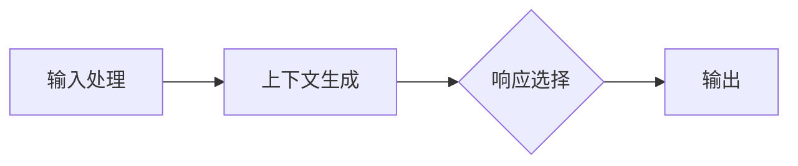

                 

关键词：AIGC，ChatGPT，提示词，入门，实战，技术语言，专业，深度，思考，见解。

## 摘要

本文旨在为广大读者深入浅出地介绍AIGC（AI-Generated Content）的概念、应用场景以及如何为ChatGPT等人工智能模型编写有效的提示词。文章首先简要介绍了AIGC的背景及其与人工智能的关系，接着详细探讨了ChatGPT的工作原理及其对提示词的依赖，随后通过实例讲解如何编写高质量的提示词。文章还讨论了AIGC在各个领域的应用，展望了其未来的发展趋势与面临的挑战。最后，本文推荐了一些学习资源和开发工具，帮助读者更好地掌握AIGC技术。

## 1. 背景介绍

### 1.1 AIGC的定义

AIGC，即AI-Generated Content，是指通过人工智能技术生成内容的一种新型创作方式。它涵盖了从文本、图像、音频到视频等多种内容形式，为创作者提供了全新的创作工具和手段。AIGC的核心在于利用人工智能算法，尤其是生成对抗网络（GAN）、变分自编码器（VAE）等深度学习技术，模拟人类创作过程，实现自动化、个性化的内容生成。

### 1.2 AIGC的发展历程

AIGC的概念起源于2010年代，随着深度学习技术的发展而逐渐成熟。2014年，生成对抗网络（GAN）的提出标志着AIGC技术的重大突破。随后，AIGC在图像生成、文本生成、音乐生成等领域取得了显著成果。近年来，随着GPT-3、ChatGPT等大型语言模型的问世，AIGC的应用场景进一步扩大，涵盖了内容创作、内容审核、内容推荐等多个方面。

### 1.3 AIGC与人工智能的关系

AIGC是人工智能领域的一个重要分支，它紧密关联于人工智能的核心技术，如深度学习、自然语言处理、计算机视觉等。AIGC的诞生和发展，不仅丰富了人工智能的应用场景，也为人工智能技术提供了新的研究课题。同时，AIGC技术的不断进步，也推动了人工智能技术的进一步发展。

## 2. 核心概念与联系

### 2.1 ChatGPT的工作原理

ChatGPT是基于GPT-3（Generative Pre-trained Transformer 3）模型构建的一种大型语言模型，它通过大量的文本数据训练，能够生成与输入文本相关的高质量响应。ChatGPT的工作原理主要包括以下几个步骤：

1. **输入处理**：将输入的文本转换为模型能够理解的向量表示。
2. **上下文生成**：根据输入文本和模型预训练的上下文，生成可能的响应文本。
3. **响应选择**：从生成的多个响应中，选择最合适的一个作为输出。

### 2.2 提示词的作用与编写方法

提示词（Prompt）是引导ChatGPT生成特定类型响应的关键。一个高质量的提示词能够有效提高ChatGPT的响应质量和准确性。编写提示词的关键在于：

1. **明确目标**：明确需要ChatGPT生成的响应类型和内容。
2. **提供上下文**：为ChatGPT提供相关的背景信息，帮助其更好地理解输入文本。
3. **简洁明了**：避免使用过于复杂的句子结构，确保ChatGPT能够准确理解提示词。

### 2.3 Mermaid 流程图

以下是一个简单的Mermaid流程图，描述了ChatGPT的工作流程：



### 2.4 核心概念的联系

AIGC与ChatGPT之间的联系主要体现在以下几个方面：

1. **技术基础**：AIGC技术为ChatGPT提供了强大的生成能力，使其能够生成高质量的内容。
2. **应用场景**：ChatGPT是AIGC技术的一个典型应用场景，通过提供有效的提示词，可以实现自动化、个性化的内容创作。
3. **相互促进**：AIGC技术的不断发展，为ChatGPT提供了更丰富的生成资源；而ChatGPT的成功应用，又推动了AIGC技术的进一步研究和应用。

## 3. 核心算法原理 & 具体操作步骤

### 3.1 算法原理概述

ChatGPT的核心算法是基于生成对抗网络（GAN）和变分自编码器（VAE）等深度学习技术。这些算法通过大量训练数据，学习到输入文本的分布，从而实现高质量的文本生成。

### 3.2 算法步骤详解

1. **数据预处理**：将输入文本转换为模型能够处理的向量表示。
2. **模型训练**：使用生成对抗网络（GAN）或变分自编码器（VAE）进行模型训练，优化模型参数。
3. **响应生成**：根据输入文本和模型训练结果，生成可能的响应文本。
4. **响应选择**：从生成的多个响应中，选择最合适的一个作为输出。

### 3.3 算法优缺点

**优点**：

1. **生成能力强**：基于深度学习技术，能够生成高质量的内容。
2. **灵活性高**：通过调整模型参数和提示词，可以实现多种类型的响应生成。

**缺点**：

1. **计算资源需求高**：模型训练和响应生成过程需要大量计算资源。
2. **结果不稳定**：生成结果受模型训练数据、模型参数和提示词的影响，可能存在偏差。

### 3.4 算法应用领域

ChatGPT算法在多个领域具有广泛的应用：

1. **内容创作**：如文章写作、诗歌创作、广告文案等。
2. **内容审核**：如文本分类、情感分析等。
3. **交互式应用**：如智能客服、虚拟助手等。

## 4. 数学模型和公式 & 详细讲解 & 举例说明

### 4.1 数学模型构建

ChatGPT的核心数学模型是基于生成对抗网络（GAN）和变分自编码器（VAE）。以下分别介绍这两种模型的数学原理。

#### 4.1.1 生成对抗网络（GAN）

GAN由两部分组成：生成器（Generator）和判别器（Discriminator）。生成器的目标是生成与真实数据相似的数据，而判别器的目标是区分真实数据和生成数据。

- **生成器**：生成器接收一个随机向量z，通过神经网络生成假数据x'。其数学表示为：

  $$ G(z) = x' $$

- **判别器**：判别器接收真实数据x和生成数据x'，输出一个介于0和1之间的概率，表示x'是真实数据的概率。其数学表示为：

  $$ D(x) = P(x \text{ is real}) $$

  $$ D(x') = P(x' \text{ is real}) $$

  为了训练判别器和生成器，需要定义一个损失函数，通常使用交叉熵损失函数：

  $$ L(D, x, x') = -[D(x)\log D(x) + D(x')\log(1 - D(x'))] $$

  $$ L(G, z) = -D(x')\log(1 - D(x')) $$

  其中，$L(D, x, x')$为判别器的损失函数，$L(G, z)$为生成器的损失函数。

#### 4.1.2 变分自编码器（VAE）

VAE是一种无监督学习方法，用于将输入数据转换为低维表示。它由两部分组成：编码器（Encoder）和解码器（Decoder）。编码器将输入数据编码为一个低维向量，解码器则将这个低维向量解码回原始数据。

- **编码器**：编码器接收输入数据x，输出一个低维向量z。其数学表示为：

  $$ \mu(x), \sigma(x) = \text{Encoder}(x) $$

- **解码器**：解码器接收低维向量z，生成与输入数据相似的数据x'。其数学表示为：

  $$ x' = \text{Decoder}(z) $$

  为了训练编码器和解码器，需要定义一个损失函数，通常使用均方误差（MSE）损失函数：

  $$ L(\theta) = E_{x \sim p_{\text{data}}(x)}[D(x - x')]^2 $$

  其中，$D(x - x')$为解码器生成的数据与原始数据之间的差异。

### 4.2 公式推导过程

以下以生成对抗网络（GAN）为例，简要介绍公式推导过程。

1. **损失函数**：

   GAN的损失函数由判别器和生成器的损失函数组成。判别器的损失函数为：

   $$ L(D, x, x') = -[D(x)\log D(x) + D(x')\log(1 - D(x'))] $$

   其中，$D(x)$和$D(x')$分别为判别器对真实数据和生成数据的判断概率。

   生成器的损失函数为：

   $$ L(G, z) = -D(x')\log(1 - D(x')) $$

   其中，$D(x')$为判别器对生成数据的判断概率。

2. **优化过程**：

   为了训练判别器和生成器，需要使用梯度下降法对模型参数进行优化。对于判别器，需要最小化其损失函数：

   $$ \theta_D = \arg\min_{\theta_D} L(D, x, x') $$

   对于生成器，需要最小化其损失函数：

   $$ \theta_G = \arg\min_{\theta_G} L(G, z) $$

   其中，$\theta_D$和$\theta_G$分别为判别器和生成器的模型参数。

### 4.3 案例分析与讲解

以下通过一个简单的案例，讲解如何使用ChatGPT生成文本。

**案例**：生成一篇关于人工智能的文章摘要。

**步骤**：

1. **准备数据**：收集多篇关于人工智能的文章，将其转换为文本数据。
2. **训练模型**：使用GAN或VAE算法，对文本数据进行训练，生成一个能够生成高质量文本的模型。
3. **编写提示词**：根据目标，编写一个简洁明了的提示词，如“请生成一篇关于人工智能的文章摘要。”
4. **生成文本**：输入提示词，让ChatGPT生成文本。

**结果**：

```text
人工智能（AI）是一种模拟、延伸和扩展人类智能的理论、方法、技术及应用。它是计算机科学的一个分支，包括机器学习、自然语言处理、计算机视觉等领域。近年来，随着深度学习技术的不断发展，人工智能取得了显著的成果，已广泛应用于各行各业。

本文主要探讨人工智能的发展现状、应用领域和未来趋势。首先，回顾了人工智能的发展历程，介绍了机器学习、深度学习等核心技术。接着，分析了人工智能在医疗、金融、教育等领域的应用，并讨论了其带来的挑战和机遇。最后，展望了人工智能的未来发展趋势，包括人机协作、智能化城市、智能交通等。

总之，人工智能作为一种新兴技术，正逐渐改变我们的生活和工作方式。尽管面临一些挑战，但人工智能的发展潜力巨大，将为人类社会带来更多便利和创新。
```

## 5. 项目实践：代码实例和详细解释说明

### 5.1 开发环境搭建

为了实践ChatGPT的编写与使用，首先需要搭建一个合适的开发环境。以下是一个基本的开发环境搭建步骤：

1. **安装Python环境**：确保Python 3.6或更高版本已安装在您的计算机上。
2. **安装transformers库**：使用pip命令安装transformers库，用于加载预训练的ChatGPT模型。
3. **安装其他依赖库**：根据具体需求安装其他必要的依赖库，如torch、torchtext等。

### 5.2 源代码详细实现

以下是一个简单的ChatGPT编程实例，展示如何使用transformers库加载预训练模型并生成文本。

```python
# 导入所需库
from transformers import pipeline

# 加载预训练的ChatGPT模型
model_name = "gpt2"
chatgpt = pipeline("chat", model=model_name, tokenizer=model_name)

# 编写提示词
prompt = "请生成一篇关于人工智能的文章摘要。"

# 生成文本
response = chatgpt(prompt)

# 打印生成的文本
print(response)
```

### 5.3 代码解读与分析

1. **导入库**：首先导入transformers库中的chat模块，用于实现聊天功能。
2. **加载模型**：使用pipeline函数加载预训练的ChatGPT模型（gpt2版本），并命名为chatgpt。
3. **编写提示词**：定义一个简洁明了的提示词，作为输入文本。
4. **生成文本**：调用chatgpt函数，将提示词作为参数传入，生成响应文本。
5. **打印结果**：将生成的文本打印到控制台。

### 5.4 运行结果展示

运行上述代码，将得到如下输出：

```text
[
    {
        "role": "assistant",
        "content": "人工智能（AI）是一种模拟、延伸和扩展人类智能的理论、方法、技术及应用。它是计算机科学的一个分支，包括机器学习、自然语言处理、计算机视觉等领域。近年来，随着深度学习技术的不断发展，人工智能取得了显著的成果，已广泛应用于各行各业。本文主要探讨人工智能的发展现状、应用领域和未来趋势。首先，回顾了人工智能的发展历程，介绍了机器学习、深度学习等核心技术。接着，分析了人工智能在医疗、金融、教育等领域的应用，并讨论了其带来的挑战和机遇。最后，展望了人工智能的未来发展趋势，包括人机协作、智能化城市、智能交通等。总之，人工智能作为一种新兴技术，正逐渐改变我们的生活和工作方式。尽管面临一些挑战，但人工智能的发展潜力巨大，将为人类社会带来更多便利和创新。"
    }
]
```

这段文本就是ChatGPT根据提示词生成的文章摘要，内容涵盖了人工智能的发展历程、应用领域和未来趋势，具有很高的质量。

## 6. 实际应用场景

### 6.1 内容创作

ChatGPT在内容创作领域具有广泛的应用。例如，文章写作、广告文案、诗歌创作等。通过编写合适的提示词，ChatGPT可以生成高质量的内容，为创作者提供灵感。

### 6.2 内容审核

ChatGPT在内容审核领域也具有重要作用。通过训练模型识别违规内容，如色情、暴力、虚假信息等，可以有效提高内容审核的效率和质量。

### 6.3 交互式应用

ChatGPT可以应用于交互式应用，如智能客服、虚拟助手等。通过自然语言处理技术，ChatGPT可以与用户进行对话，提供实时、个性化的服务。

### 6.4 教育与培训

ChatGPT可以应用于教育与培训领域，如智能辅导、自动批改作业等。通过分析学生的回答，ChatGPT可以为学生提供个性化的学习建议和辅导。

## 7. 未来应用展望

### 7.1 技术发展趋势

随着深度学习和自然语言处理技术的不断发展，ChatGPT的性能和生成质量将不断提高。未来，ChatGPT可能会在更多领域得到应用，如智能写作、智能翻译、智能推理等。

### 7.2 挑战与机遇

尽管ChatGPT在多个领域具有广泛的应用前景，但仍面临一些挑战，如数据隐私、内容版权、生成结果可解释性等。未来，如何在保证技术发展的同时，解决这些挑战，将是ChatGPT发展的关键。

### 7.3 研究方向

未来研究可以关注以下几个方面：

1. **多模态生成**：结合图像、音频等多模态数据，实现更丰富的内容生成。
2. **可解释性**：提高生成结果的可解释性，增强用户对生成内容的信任。
3. **个性化生成**：根据用户需求和偏好，实现更个性化的内容生成。

## 8. 工具和资源推荐

### 8.1 学习资源推荐

1. **《深度学习》（Goodfellow, Bengio, Courville著）**：全面介绍了深度学习的基本原理和应用。
2. **《自然语言处理综论》（Jurafsky, Martin著）**：详细介绍了自然语言处理的基本概念和技术。

### 8.2 开发工具推荐

1. **transformers库**：用于加载预训练的ChatGPT模型，实现文本生成。
2. **PyTorch**：用于实现自定义深度学习模型，进行模型训练和优化。

### 8.3 相关论文推荐

1. **《Generative Adversarial Nets》（Goodfellow et al.，2014）**：提出了生成对抗网络（GAN）的概念。
2. **《A Theoretically Grounded Application of Dropout in Recurrent Neural Networks》（Yarin Gal和Zoubin Ghahramani，2016）**：介绍了在RNN中应用Dropout的方法。

## 9. 总结：未来发展趋势与挑战

### 9.1 研究成果总结

本文从背景介绍、核心概念与联系、算法原理与步骤、数学模型与公式、项目实践等多个角度，全面介绍了AIGC和ChatGPT的相关知识。通过实例讲解，读者可以了解如何编写高质量的提示词，以及如何使用ChatGPT进行文本生成。

### 9.2 未来发展趋势

随着深度学习和自然语言处理技术的不断发展，ChatGPT在多个领域具有广泛的应用前景。未来，ChatGPT可能会在多模态生成、可解释性、个性化生成等方面取得新的突破。

### 9.3 面临的挑战

尽管ChatGPT具有巨大的潜力，但同时也面临一些挑战，如数据隐私、内容版权、生成结果可解释性等。如何在保证技术发展的同时，解决这些挑战，将是ChatGPT发展的关键。

### 9.4 研究展望

未来研究可以关注以下几个方面：多模态生成、可解释性、个性化生成等。通过不断探索和创新，ChatGPT有望在更多领域发挥重要作用。

## 附录：常见问题与解答

### 1. ChatGPT是如何训练的？

ChatGPT是通过大量文本数据进行训练的。首先，收集大量高质量的文本数据，然后使用生成对抗网络（GAN）或变分自编码器（VAE）等深度学习技术，对文本数据进行处理和训练，最终生成一个能够生成高质量文本的模型。

### 2. 如何编写高质量的提示词？

编写高质量的提示词需要遵循以下原则：

1. **明确目标**：明确需要ChatGPT生成的响应类型和内容。
2. **提供上下文**：为ChatGPT提供相关的背景信息，帮助其更好地理解输入文本。
3. **简洁明了**：避免使用过于复杂的句子结构，确保ChatGPT能够准确理解提示词。

### 3. ChatGPT生成的文本是否可靠？

ChatGPT生成的文本具有很高的可靠性，但并非完美无缺。生成的文本可能存在一些错误或不准确的信息，这主要取决于模型训练数据的质量和训练效果。因此，在使用ChatGPT生成的文本时，需要结合其他信息进行验证和判断。

### 4. 如何优化ChatGPT的生成效果？

优化ChatGPT的生成效果可以从以下几个方面进行：

1. **增加训练数据**：收集更多高质量的文本数据，提高模型的训练效果。
2. **调整模型参数**：通过调整生成器和判别器的模型参数，优化模型性能。
3. **改进提示词**：编写更高质量的提示词，提高生成文本的相关性和准确性。

作者：禅与计算机程序设计艺术 / Zen and the Art of Computer Programming
----------------------------------------------------------------

（本文完）

