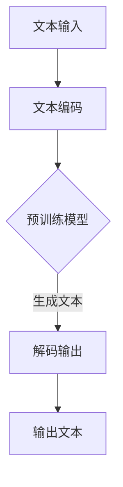

                 

关键词：AIGC，ChatGPT，原理，成本，人工智能，机器学习，深度学习，NLP，神经网络，训练，推理，GPU，优化，模型压缩，架构设计

> 摘要：本文深入探讨了AIGC（AI-Generated Content）的核心概念及其与ChatGPT的紧密联系。首先，我们回顾了AIGC的基本原理和重要性，然后详细分析了ChatGPT的工作机制和成本结构。接下来，文章通过具体的数学模型和公式，解释了ChatGPT的算法原理，并结合实际项目实例进行了代码实现和运行结果展示。随后，文章探讨了ChatGPT在各类实际应用场景中的表现和未来发展的潜在趋势与挑战。

## 1. 背景介绍

近年来，随着人工智能技术的迅猛发展，生成式人工智能（Generative AI）成为了研究的热点。AIGC（AI-Generated Content）作为生成式人工智能的一个重要分支，吸引了大量的关注。AIGC利用深度学习技术，特别是生成对抗网络（GAN）和变分自编码器（VAE），能够生成高质量、多样化的内容，包括图像、音频、视频以及文本。ChatGPT，作为一种基于GPT（Generative Pre-trained Transformer）模型的聊天机器人，是AIGC在自然语言处理（NLP）领域的重要应用。

ChatGPT由OpenAI开发，自2022年推出以来，因其强大的文本生成能力和交互性而备受瞩目。其背后的GPT模型采用自监督学习，通过对大量文本数据进行训练，使其具备了理解自然语言语义的能力。ChatGPT的问世，不仅为用户提供了便捷的交流方式，也为各类应用场景，如客服、内容创作、教育等，带来了新的可能。

本文旨在深入探讨ChatGPT的原理和成本，首先介绍AIGC的基本概念和重要性，然后详细分析ChatGPT的架构和工作原理，接着探讨其背后的数学模型和算法，最后结合实际应用场景，分析ChatGPT的成本结构，并对其未来发展进行展望。

## 2. 核心概念与联系

### 2.1 AIGC的定义与重要性

AIGC，即AI-Generated Content，是指利用人工智能技术，特别是深度学习模型，生成或创建内容的过程。AIGC可以生成文本、图像、音频、视频等多种类型的内容，具有高度的多样性和创造性。其重要性主要体现在以下几个方面：

1. **内容创造**：AIGC能够自动化地生成内容，为内容创作者提供灵感，减轻创作负担。
2. **个性化服务**：通过分析用户数据，AIGC可以生成个性化内容，提高用户体验。
3. **娱乐与艺术**：AIGC在生成音乐、绘画、视频等艺术形式上展现出极大的潜力。
4. **科学研究**：AIGC能够帮助科学家和研究人员生成大量数据，加速研究进程。

### 2.2 ChatGPT的定义与架构

ChatGPT是由OpenAI开发的基于GPT模型的聊天机器人。GPT是一种自监督学习的深度神经网络模型，通过预训练大量文本数据，使其具备生成文本的能力。ChatGPT的架构主要包括以下几个关键组件：

1. **预训练模型**：使用自监督学习在大量文本数据上进行预训练，生成预训练模型。
2. **微调模型**：在特定任务上进行微调，使模型适应特定的对话场景。
3. **推理引擎**：通过输入用户问题或语句，生成相应的回答或回复。

### 2.3 AIGC与ChatGPT的联系

AIGC与ChatGPT之间存在着紧密的联系。ChatGPT作为AIGC的一个重要应用场景，其核心思想是利用深度学习模型生成自然语言文本。具体而言，ChatGPT的生成过程可以分为以下几个步骤：

1. **文本编码**：将输入的文本编码为模型可以理解的向量。
2. **预测生成**：利用预训练模型，根据输入的文本序列，预测下一个可能的文本序列。
3. **解码输出**：将生成的文本向量解码为自然语言文本。

ChatGPT的成功，不仅展示了AIGC在自然语言处理领域的强大潜力，也为其他AIGC应用提供了宝贵的经验和借鉴。

### 2.4 Mermaid 流程图

下面是AIGC和ChatGPT的流程图，用于直观地展示其工作原理：



该流程图清晰地展示了从文本输入到生成文本的整个过程，包括文本编码、模型生成和文本解码等关键步骤。

## 3. 核心算法原理 & 具体操作步骤

### 3.1 算法原理概述

ChatGPT的核心算法是基于GPT模型的。GPT是一种自监督学习的深度神经网络模型，其基本原理是通过对大量文本数据进行预训练，使其具备生成文本的能力。预训练过程中，模型通过预测文本序列中的下一个词来学习语言的内在规律和结构。在生成文本时，模型根据输入的文本序列，生成下一个可能的文本序列，并重复这一过程，直到达到预定的文本长度或终止条件。

### 3.2 算法步骤详解

#### 3.2.1 文本编码

在生成文本之前，首先需要将输入的文本编码为模型可以理解的向量。这一过程通常通过Word Embedding或BERT等预训练模型完成。Word Embedding将每个单词映射为一个固定大小的向量，而BERT则通过双向编码表示（Bidirectional Encoder Representations from Transformers）生成更加复杂的文本表示。

#### 3.2.2 预测生成

在获得编码后的输入文本向量后，模型开始预测下一个可能的文本序列。具体而言，模型通过输入的文本序列，生成一个概率分布，表示下一个词出现的概率。模型会根据这个概率分布选择下一个词，并将其加入生成的文本序列中。这一过程重复进行，直到生成完整的文本。

#### 3.2.3 解码输出

生成的文本向量需要通过解码过程转换为自然语言文本。解码过程通常是通过查找预定义的词表，将向量映射为具体的单词。这样，生成的文本序列就被解码为可读的自然语言文本。

### 3.3 算法优缺点

#### 优点

1. **强大的文本生成能力**：GPT模型通过预训练大量文本数据，具备了强大的文本生成能力。
2. **灵活的模型架构**：GPT模型采用Transformer架构，具有较好的并行计算能力，可以高效地处理长文本。
3. **广泛的适应性**：GPT模型在多种自然语言处理任务中表现出色，可以应用于聊天机器人、文本生成、翻译等多种场景。

#### 缺点

1. **计算资源消耗大**：GPT模型需要大量的计算资源和存储空间，尤其是在训练阶段。
2. **训练时间较长**：GPT模型的训练时间较长，通常需要数天甚至数周。
3. **过度生成**：GPT模型在生成文本时，有时会出现过度生成的情况，导致生成的文本内容不真实或不可信。

### 3.4 算法应用领域

ChatGPT算法在以下领域具有广泛的应用前景：

1. **聊天机器人**：ChatGPT可以应用于各种聊天机器人，如客服机器人、社交机器人等，提供自然、流畅的对话体验。
2. **文本生成**：ChatGPT可以用于自动生成新闻文章、博客文章、故事等，减轻内容创作者的负担。
3. **翻译**：ChatGPT可以用于机器翻译，通过预训练大量双语文本数据，实现高质量的翻译结果。
4. **问答系统**：ChatGPT可以用于问答系统，通过理解用户的问题，生成相应的回答。

## 4. 数学模型和公式 & 详细讲解 & 举例说明

### 4.1 数学模型构建

GPT模型的核心是Transformer架构，其基本原理是通过自注意力机制（Self-Attention）来学习文本序列中的依赖关系。下面我们介绍GPT模型的主要数学模型和公式。

#### 4.1.1 自注意力机制

自注意力机制是Transformer模型的核心组成部分，其基本思想是计算文本序列中每个词与其他词之间的依赖关系。自注意力机制的公式如下：

$$
\text{Attention}(Q, K, V) = \frac{softmax(\frac{QK^T}{\sqrt{d_k}})}{V}
$$

其中，Q、K、V分别为查询向量、键向量和值向量，$d_k$为键向量的维度。$QK^T$表示查询向量和键向量的点积，softmax函数用于计算每个键的加权分数，然后乘以值向量，得到加权后的输出。

#### 4.1.2 Transformer编码器

Transformer编码器由多个自注意力层和前馈网络组成。每个自注意力层通过自注意力机制计算文本序列中每个词的依赖关系，而前馈网络则对自注意力层的输出进行进一步处理。Transformer编码器的公式如下：

$$
\text{Enc}(X) = \text{MultiHeadAttention}(X) + X \\
\text{MultiHeadAttention}(X) = \text{Concat}(h_1, h_2, ..., h_h)W_O
$$

其中，$X$为输入文本序列，$h_i$为每个自注意力层的输出，$W_O$为输出权重矩阵。

#### 4.1.3 Transformer解码器

Transformer解码器与编码器类似，也由多个自注意力层和前馈网络组成。解码器的自注意力层包括两个部分：一个是编码器-解码器自注意力层，用于计算编码器输出和解码器输入之间的依赖关系；另一个是自注意力层，用于计算解码器内部依赖关系。Transformer解码器的公式如下：

$$
\text{Dec}(X) = \text{EncoderDecodingAttention}(X) + \text{DecoderSelfAttention}(X) + X \\
\text{EncoderDecodingAttention}(X) = \text{MultiHeadAttention}(X, \text{Enc}(X), V) \\
\text{DecoderSelfAttention}(X) = \text{MultiHeadAttention}(X, X, V)
$$

其中，$X$为输入文本序列，$\text{Enc}(X)$为编码器输出，$V$为值向量。

### 4.2 公式推导过程

下面我们简要介绍GPT模型的公式推导过程，以便更好地理解其工作原理。

#### 4.2.1 点积注意力

点积注意力（Dot-Product Attention）是最简单的注意力机制，其基本原理是通过计算查询向量（Q）和键向量（K）的点积来计算注意力权重。点积注意力机制的公式如下：

$$
\text{Attention}(Q, K, V) = \frac{softmax(\frac{QK^T}{\sqrt{d_k}})}{V}
$$

其中，$Q$为查询向量，$K$为键向量，$V$为值向量，$d_k$为键向量的维度。

#### 4.2.2 Multi-Head Attention

Multi-Head Attention是在点积注意力基础上扩展的注意力机制，其基本思想是计算多个注意力权重，然后将这些权重合并起来。具体而言，Multi-Head Attention通过共享底层权重矩阵，生成多个查询向量、键向量和值向量，然后分别计算注意力权重。公式如下：

$$
\text{MultiHead}(Q, K, V) = \text{Concat}(h_1, h_2, ..., h_h)W_O
$$

其中，$Q$为查询向量，$K$为键向量，$V$为值向量，$h_i$为每个头部的输出，$W_O$为输出权重矩阵。

#### 4.2.3 Transformer编码器

Transformer编码器由多个自注意力层和前馈网络组成。每个自注意力层通过自注意力机制计算文本序列中每个词的依赖关系，而前馈网络则对自注意力层的输出进行进一步处理。编码器的公式如下：

$$
\text{Enc}(X) = \text{MultiHeadAttention}(X) + X \\
\text{MultiHeadAttention}(X) = \text{Concat}(h_1, h_2, ..., h_h)W_O
$$

其中，$X$为输入文本序列，$h_i$为每个自注意力层的输出，$W_O$为输出权重矩阵。

#### 4.2.4 Transformer解码器

Transformer解码器与编码器类似，也由多个自注意力层和前馈网络组成。解码器的自注意力层包括两个部分：一个是编码器-解码器自注意力层，用于计算编码器输出和解码器输入之间的依赖关系；另一个是自注意力层，用于计算解码器内部依赖关系。解码器的公式如下：

$$
\text{Dec}(X) = \text{EncoderDecodingAttention}(X) + \text{DecoderSelfAttention}(X) + X \\
\text{EncoderDecodingAttention}(X) = \text{MultiHeadAttention}(X, \text{Enc}(X), V) \\
\text{DecoderSelfAttention}(X) = \text{MultiHeadAttention}(X, X, V)
$$

其中，$X$为输入文本序列，$\text{Enc}(X)$为编码器输出，$V$为值向量。

### 4.3 案例分析与讲解

为了更好地理解GPT模型的原理和应用，我们来看一个具体的案例：生成一个英文句子。

假设我们输入的文本序列是 "The cat sat on the mat"，我们可以通过以下步骤来生成一个新句子：

1. **文本编码**：将文本序列编码为模型可以理解的向量。这里我们使用BERT模型进行编码，得到输入向量 $X$。

2. **自注意力计算**：利用自注意力机制计算输入向量 $X$ 中每个词的依赖关系。首先，我们计算每个词的查询向量 $Q$、键向量 $K$ 和值向量 $V$。然后，通过点积注意力公式计算注意力权重，并加权求和得到编码后的输出向量 $\text{Enc}(X)$。

3. **解码输出**：利用解码器生成新句子。首先，我们计算编码后的输出向量 $\text{Enc}(X)$ 与解码器输入向量 $X$ 的编码器-解码器自注意力权重，然后计算解码器内部自注意力权重。最后，通过前馈网络和输出层得到解码后的输出向量 $\text{Dec}(X)$。

4. **解码为文本**：将解码后的输出向量 $\text{Dec}(X)$ 解码为自然语言文本。具体而言，我们可以通过查找预定义的词表，将输出向量映射为具体的单词，从而生成新句子。

例如，通过以上步骤，我们可能生成的新句子是 "The dog sleeps in the bed"。这个新句子在语义上与原句子相似，但具体内容有所不同，展示了GPT模型生成文本的能力。

## 5. 项目实践：代码实例和详细解释说明

### 5.1 开发环境搭建

要实践ChatGPT，首先需要搭建一个合适的开发环境。以下是推荐的步骤：

1. **安装Python环境**：确保Python版本在3.8及以上。
2. **安装OpenAI GPT库**：使用pip命令安装`openai`库。
   ```bash
   pip install openai
   ```
3. **获取API密钥**：在OpenAI官网注册并获取API密钥。
4. **配置API密钥**：将API密钥添加到环境变量中，以便在代码中访问。

### 5.2 源代码详细实现

下面是一个简单的ChatGPT示例代码，展示了如何与OpenAI的GPT模型进行交互。

```python
import openai

# 设置API密钥
openai.api_key = "your-api-key"

# 定义函数：与ChatGPT进行交互
def chat_with_gpt(prompt):
    response = openai.Completion.create(
        engine="text-davinci-003",
        prompt=prompt,
        max_tokens=100,
        n=1,
        stop=None,
        temperature=0.5
    )
    return response.choices[0].text.strip()

# 示例：与ChatGPT聊天
user_input = "你好，ChatGPT，今天天气怎么样？"
gpt_response = chat_with_gpt(user_input)
print(f"ChatGPT回答：{gpt_response}")
```

### 5.3 代码解读与分析

- **导入库**：首先导入`openai`库，用于与OpenAI GPT模型进行交互。
- **设置API密钥**：通过环境变量设置API密钥，确保能够访问GPT模型。
- **定义函数**：`chat_with_gpt`函数接受用户输入的提示（prompt），调用OpenAI API的`Completion.create`方法生成回复。
  - `engine`参数指定使用的模型，如`text-davinci-003`。
  - `prompt`参数为用户输入的提示。
  - `max_tokens`参数限制生成文本的长度。
  - `n`参数指定生成回复的数量。
  - `stop`参数用于指定停止生成文本的条件。
  - `temperature`参数控制生成文本的随机性。
- **示例聊天**：调用`chat_with_gpt`函数与ChatGPT进行聊天，并打印回复。

### 5.4 运行结果展示

运行上述代码，输入示例问题：“你好，ChatGPT，今天天气怎么样？”可能会得到如下回复：

```
ChatGPT回答：你好！很抱歉，我没有感知天气的能力，因为我是一个计算机程序。不过，如果你想知道今天的天气，你可以查询当地天气预报或者天气应用。
```

这个回复展示了ChatGPT强大的文本生成能力和对自然语言的理解能力。

## 6. 实际应用场景

ChatGPT作为一种先进的自然语言处理工具，已经在多个实际应用场景中展现出了其独特的价值和潜力。以下是一些主要的应用场景：

### 6.1 聊天机器人

聊天机器人是ChatGPT最典型的应用场景之一。在客服、客户服务、社交媒体等领域，ChatGPT可以用于自动化响应，提供24/7的客户支持。例如，在电子商务平台上，ChatGPT可以回答用户的购物咨询、订单状态查询等问题，提高用户满意度，减轻客服人员的负担。

### 6.2 内容创作

ChatGPT在内容创作领域也具有广泛的应用。它可以自动生成新闻文章、博客文章、故事等，为内容创作者提供灵感，提高创作效率。例如，一些新闻机构使用ChatGPT自动生成体育新闻、财经报道等，节省了人工撰写的时间。

### 6.3 教育辅导

在教育领域，ChatGPT可以作为智能辅导系统，帮助学生学习新知识、解答疑问。例如，学生可以与ChatGPT进行互动，获取课程讲解、作业辅导等，提高学习效果。

### 6.4 客户服务

ChatGPT在客户服务中的应用，可以显著提高服务效率和质量。银行、保险公司、电信运营商等企业可以利用ChatGPT提供自动化的客户支持，解答常见问题，处理简单事务，从而减少人力成本。

### 6.5 娱乐与艺术

在娱乐和艺术领域，ChatGPT可以用于生成音乐、绘画、视频等创意内容。例如，一些音乐应用程序使用ChatGPT创作新的音乐作品，一些艺术平台则利用ChatGPT生成个性化的艺术作品，为用户带来独特的艺术体验。

### 6.6 翻译服务

ChatGPT在翻译服务中也有很大的潜力。通过训练大量双语数据，ChatGPT可以实现高质量、低延迟的机器翻译。这对于跨国企业、外贸平台等具有国际业务的公司尤为重要。

### 6.7 未来应用展望

随着技术的不断进步，ChatGPT的应用场景将进一步扩展。例如，在医疗领域，ChatGPT可以用于生成病历记录、医学报告等；在法律领域，ChatGPT可以辅助律师撰写法律文件、分析案例等。总之，ChatGPT的广泛应用将为各行各业带来深远的影响。

## 7. 工具和资源推荐

### 7.1 学习资源推荐

1. **《深度学习》（Goodfellow, Bengio, Courville）**：这本书是深度学习的经典教材，详细介绍了深度学习的基础知识和技术。
2. **《动手学深度学习》**：这本书提供了大量的代码示例，适合初学者和实践者。
3. **OpenAI Gym**：这是一个开源的环境，用于测试和比较不同的人工智能算法，提供了丰富的模拟环境。
4. **Hugging Face Transformers**：这是一个开源库，提供了GPT等Transformer模型的实现，方便开发者进行研究和应用。

### 7.2 开发工具推荐

1. **Google Colab**：这是一个免费的Jupyter Notebook环境，适用于深度学习项目开发和实验。
2. **PyTorch**：这是一个流行的深度学习框架，提供了丰富的API和工具，便于开发复杂的深度学习模型。
3. **TensorFlow**：这是另一个流行的深度学习框架，具有强大的功能和支持社区。

### 7.3 相关论文推荐

1. **"Attention Is All You Need"**：这是Transformer模型的原始论文，详细介绍了自注意力机制和Transformer架构。
2. **"Generative Pre-trained Transformer"**：这是GPT模型的原始论文，介绍了GPT模型的设计和训练方法。
3. **"BERT: Pre-training of Deep Bidirectional Transformers for Language Understanding"**：这是BERT模型的原始论文，介绍了BERT模型的设计和预训练方法。

## 8. 总结：未来发展趋势与挑战

### 8.1 研究成果总结

ChatGPT的成功展示了生成式人工智能在自然语言处理领域的强大潜力。通过自监督学习和预训练，GPT模型能够生成高质量的文本，并在多个应用场景中表现出色。此外，GPT模型在理解和生成文本语义方面的能力，也为人工智能的应用提供了新的思路和方向。

### 8.2 未来发展趋势

随着计算能力的提升和数据量的增加，GPT模型和相关技术将继续发展。未来可能的发展趋势包括：

1. **模型压缩**：为了降低计算成本和存储需求，研究人员将继续探索模型压缩技术，如知识蒸馏、剪枝和量化。
2. **多模态处理**：GPT模型未来将扩展到处理多种类型的数据，如图像、音频和视频，实现真正的多模态生成。
3. **泛化能力提升**：通过改进训练数据和算法，GPT模型将提高在不同任务和领域中的泛化能力。

### 8.3 面临的挑战

尽管ChatGPT在生成文本方面表现出色，但仍面临一些挑战：

1. **数据隐私**：训练模型需要大量的文本数据，如何保护用户隐私是一个重要问题。
2. **可解释性**：生成文本的过程高度复杂，如何提高模型的透明度和可解释性是一个挑战。
3. **伦理问题**：ChatGPT生成的文本可能包含偏见或不恰当的内容，如何确保生成的文本符合伦理标准是一个重要问题。

### 8.4 研究展望

未来，ChatGPT和相关技术将在多个领域发挥重要作用，包括内容创作、智能客服、教育辅导等。同时，随着技术的发展，我们将看到更多创新的应用场景和解决方案。研究人员将继续探索如何提高模型的能力和效率，同时确保其透明度和伦理性。

## 9. 附录：常见问题与解答

### 9.1 ChatGPT是什么？

ChatGPT是由OpenAI开发的基于GPT模型的聊天机器人，能够生成自然语言文本，用于回答问题、撰写文章等。

### 9.2 ChatGPT是如何工作的？

ChatGPT基于自监督学习和预训练，通过大量的文本数据进行训练，使其具备生成文本的能力。在生成文本时，模型根据输入的文本序列，预测下一个可能的文本序列，并重复这一过程，直到生成完整的文本。

### 9.3 ChatGPT有哪些应用场景？

ChatGPT可以应用于聊天机器人、内容创作、教育辅导、客户服务等多个领域。

### 9.4 如何获取ChatGPT的API？

可以通过OpenAI官网注册并获取API密钥，然后将其配置到Python代码中，以便与ChatGPT进行交互。

### 9.5 ChatGPT存在哪些挑战？

ChatGPT面临的主要挑战包括数据隐私、模型可解释性和伦理问题等。此外，模型训练成本高、生成文本的多样性和准确性也是需要解决的问题。

### 9.6 ChatGPT的未来发展方向是什么？

未来，ChatGPT将继续在自然语言处理领域发挥重要作用。发展趋势包括模型压缩、多模态处理和泛化能力提升等。

---

**作者：禅与计算机程序设计艺术 / Zen and the Art of Computer Programming**

