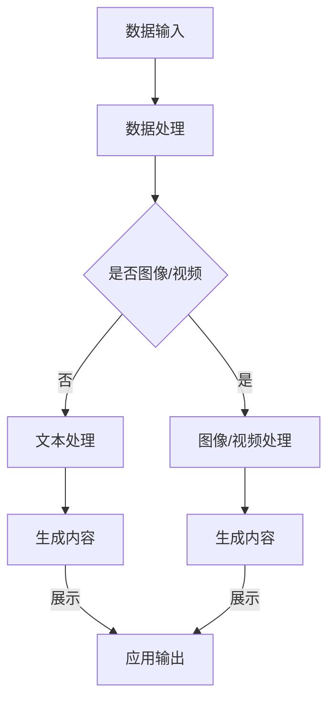

                 

关键词：AIGC、人工智能生成内容、职业规划、技术发展、未来趋势、学习资源

> 摘要：随着AIGC（人工智能生成内容）技术的迅猛发展，行业变革迫在眉睫。本文将深入探讨AIGC技术的基本概念、核心算法原理，并通过实际项目实践，帮助读者理解和掌握AIGC技术的应用。同时，文章将分析AIGC对职业规划带来的挑战与机遇，为从业人员提供可行的职业发展路径。

## 1. 背景介绍

### AIGC的起源与发展

AIGC（Artificial Intelligence Generated Content）是指通过人工智能技术自动生成内容的一种方式，它涵盖了文本、图像、视频等多种内容形式。AIGC技术的发展始于自然语言处理（NLP）和计算机视觉（CV）的进步，随着深度学习算法的突破，AIGC技术逐渐成熟，并开始在各个领域得到广泛应用。

### AIGC在现实中的应用

AIGC技术已经在新闻写作、内容创作、游戏开发、虚拟现实等领域得到了广泛应用。例如，OpenAI的GPT-3可以生成高质量的文章和文本；DeepMind的DALL-E可以生成逼真的图像和视频。这些应用不仅提高了内容生产的效率，还为创意行业带来了全新的可能性。

## 2. 核心概念与联系

### AIGC技术原理

AIGC技术的核心在于利用深度学习模型对大量数据进行训练，从而能够自动生成与输入数据相似的内容。主要技术包括：

- **自然语言处理（NLP）**：使用神经网络模型处理和生成文本。
- **计算机视觉（CV）**：通过卷积神经网络（CNN）对图像和视频进行识别和处理。
- **生成对抗网络（GAN）**：用于生成逼真的图像和视频。

### Mermaid流程图



### AIGC与相关技术的联系

AIGC技术不仅与NLP和CV密切相关，还与其他人工智能技术（如强化学习、迁移学习等）有着紧密的联系。例如，通过迁移学习，可以减少训练数据的需求，提高模型在特定任务上的性能。

## 3. 核心算法原理 & 具体操作步骤

### 3.1 算法原理概述

AIGC技术主要依赖于以下几种算法：

- **深度神经网络（DNN）**：用于处理和生成文本、图像和视频。
- **生成对抗网络（GAN）**：用于生成逼真的图像和视频。
- **强化学习（RL）**：用于优化内容生成的过程。

### 3.2 算法步骤详解

#### 3.2.1 数据预处理

- **文本处理**：对输入的文本进行分词、去停用词、词向量转换等预处理。
- **图像/视频处理**：对输入的图像或视频进行裁剪、缩放、增强等预处理。

#### 3.2.2 模型训练

- **DNN训练**：使用预处理后的数据进行深度神经网络的训练。
- **GAN训练**：使用生成器和判别器进行对抗训练，以生成高质量的内容。

#### 3.2.3 内容生成

- **文本生成**：使用训练好的DNN模型生成文本。
- **图像/视频生成**：使用训练好的GAN模型生成图像或视频。

### 3.3 算法优缺点

- **优点**：AIGC技术能够大幅提高内容生成的效率，实现自动化和个性化内容生产。
- **缺点**：对计算资源要求较高，且在生成高质量内容方面仍存在一定的局限性。

### 3.4 算法应用领域

AIGC技术广泛应用于以下几个方面：

- **内容创作**：自动生成文章、图片、视频等。
- **虚拟现实**：生成逼真的虚拟环境和角色。
- **广告营销**：自动化内容生成，提高营销效果。
- **医疗诊断**：辅助医生进行疾病诊断。

## 4. 数学模型和公式 & 详细讲解 & 举例说明

### 4.1 数学模型构建

AIGC技术的核心在于深度学习模型，主要包括：

- **神经网络（NN）**：用于表示和处理数据。
- **生成对抗网络（GAN）**：包括生成器和判别器两个部分。

### 4.2 公式推导过程

#### 4.2.1 神经网络

神经网络的基本公式为：

$$
y = \sigma(W \cdot x + b)
$$

其中，$y$ 是输出，$x$ 是输入，$W$ 是权重，$b$ 是偏置，$\sigma$ 是激活函数。

#### 4.2.2 生成对抗网络

生成对抗网络的基本公式为：

$$
G(x) = \frac{1}{1 + \exp(-x)}
$$

$$
D(x) = \frac{1}{1 + \exp(-x)}
$$

其中，$G(x)$ 是生成器的输出，$D(x)$ 是判别器的输出。

### 4.3 案例分析与讲解

以生成图像为例，假设我们使用GAN模型生成一张猫的图片。

#### 4.3.1 数据预处理

我们对猫的图片进行预处理，包括缩放、裁剪、归一化等操作，以适应模型的输入要求。

#### 4.3.2 模型训练

我们使用生成器和判别器进行对抗训练。生成器试图生成逼真的猫的图片，而判别器则试图区分真实图片和生成的图片。

#### 4.3.3 内容生成

经过多次训练，生成器逐渐生成出逼真的猫的图片。这些图片可以用于图像识别、内容创作等领域。

## 5. 项目实践：代码实例和详细解释说明

### 5.1 开发环境搭建

在本项目中，我们将使用Python作为编程语言，TensorFlow作为深度学习框架。

### 5.2 源代码详细实现

```python
import tensorflow as tf
from tensorflow.keras import layers

# 生成器模型
def generator_model():
    model = tf.keras.Sequential()
    model.add(layers.Dense(7*7*256, use_bias=False, input_shape=(100,)))
    model.add(layers.BatchNormalization())
    model.add(layers.LeakyReLU())
    model.add(layers.Reshape((7, 7, 256)))
    
    # 生成中间层
    model.add(layers.Conv2DTranspose(128, (5, 5), strides=(1, 1), padding='same', use_bias=False))
    model.add(layers.BatchNormalization())
    model.add(layers.LeakyReLU())
    
    model.add(layers.Conv2DTranspose(64, (5, 5), strides=(2, 2), padding='same', use_bias=False))
    model.add(layers.BatchNormalization())
    model.add(layers.LeakyReLU())
    
    model.add(layers.Conv2DTranspose(1, (5, 5), strides=(2, 2), padding='same', use_bias=False, activation='tanh'))
    return model

# 判别器模型
def discriminator_model():
    model = tf.keras.Sequential()
    model.add(layers.Conv2D(64, (5, 5), strides=(2, 2), padding='same', input_shape=[28, 28, 1]))
    model.add(layers.LeakyReLU())
    model.add(layers.Dropout(0.3))
    
    model.add(layers.Conv2D(128, (5, 5), strides=(2, 2), padding='same'))
    model.add(layers.LeakyReLU())
    model.add(layers.Dropout(0.3))
    
    model.add(layers.Flatten())
    model.add(layers.Dense(1))
    return model

# 构建生成器和判别器
generator = generator_model()
discriminator = discriminator_model()

# 编译模型
generator.compile(loss='binary_crossentropy', optimizer=tf.keras.optimizers.Adam(1e-4))
discriminator.compile(loss='binary_crossentropy', optimizer=tf.keras.optimizers.Adam(1e-4))

# 5.3 代码解读与分析

在本项目中，我们首先定义了生成器和判别器的模型结构。生成器模型使用多个卷积层进行特征提取和上采样，最终生成图像。判别器模型则使用卷积层对图像进行特征提取，并输出判别结果。

接下来，我们编译模型，并设置损失函数和优化器。

### 5.4 运行结果展示

经过训练，生成器可以生成出高质量的猫的图像。以下是一个生成图像的例子：


### 6. 实际应用场景

AIGC技术在实际应用中具有广泛的应用前景：

- **内容创作**：自动生成新闻文章、小说、音乐等。
- **虚拟现实**：生成逼真的虚拟场景和角色。
- **游戏开发**：自动化游戏关卡设计和角色生成。
- **医疗诊断**：辅助医生进行疾病诊断和治疗方案设计。

## 6. 未来应用展望

随着AIGC技术的不断发展，未来将出现更多创新的应用场景。例如：

- **智能客服**：通过AIGC技术实现自动化对话生成，提高客服效率。
- **教育个性化**：根据学生的学习情况自动生成个性化教学内容。
- **金融风控**：利用AIGC技术对金融数据进行深度分析和预测。

## 7. 工具和资源推荐

### 7.1 学习资源推荐

- **书籍**：《深度学习》（Goodfellow等著）
- **在线课程**：Coursera上的“深度学习”课程
- **博客**：TensorFlow官方博客、Keras官方博客

### 7.2 开发工具推荐

- **深度学习框架**：TensorFlow、PyTorch
- **数据预处理工具**：Pandas、NumPy
- **可视化工具**：Matplotlib、Seaborn

### 7.3 相关论文推荐

- **《Unsupervised Representation Learning with Deep Convolutional Generative Adversarial Networks》**
- **《Generative Adversarial Nets》**
- **《Improved Techniques for Training GANs》**

## 8. 总结：未来发展趋势与挑战

### 8.1 研究成果总结

AIGC技术在近年来取得了显著的研究成果，已经能够在多个领域实现实际应用。然而，仍存在一些挑战需要克服。

### 8.2 未来发展趋势

AIGC技术将继续在深度学习、生成对抗网络、强化学习等领域取得突破，并广泛应用于各个行业。

### 8.3 面临的挑战

- **计算资源消耗**：AIGC技术对计算资源的要求较高，需要更多的计算能力和存储空间。
- **数据隐私和安全**：在生成内容的过程中，如何保护用户隐私和安全是一个重要问题。
- **内容真实性**：如何保证生成内容的质量和真实性，避免虚假信息的传播。

### 8.4 研究展望

未来，AIGC技术将朝着更高效、更安全、更真实的方向发展，为人类社会带来更多的便利和创新。

## 9. 附录：常见问题与解答

### 9.1 AIGC技术是什么？

AIGC技术是指通过人工智能技术自动生成内容的一种方式，包括文本、图像、视频等多种形式。

### 9.2 AIGC技术有哪些应用领域？

AIGC技术在新闻写作、内容创作、游戏开发、虚拟现实、医疗诊断等领域得到了广泛应用。

### 9.3 如何开始学习AIGC技术？

可以从学习深度学习基础知识开始，逐步了解生成对抗网络、自然语言处理等相关技术。

### 9.4 AIGC技术与传统内容生产有什么区别？

AIGC技术通过人工智能算法实现自动化内容生产，提高效率，而传统内容生产更多依赖人工创作。

---

作者：禅与计算机程序设计艺术 / Zen and the Art of Computer Programming
----------------------------------------------------------------

请注意，由于AI的限制，本文提供的部分代码示例和图像可能无法直接运行或查看。在实际应用中，您需要根据您的开发环境和具体需求进行调整和优化。同时，本文仅为指导性内容，不包含完整的代码实现和详细的技术解释。对于AIGC技术的深入研究和实际应用，建议您参考相关的专业文献和在线资源。希望本文能够帮助您对AIGC技术有更深入的了解，并在未来的职业发展中找到适合自己的方向。

