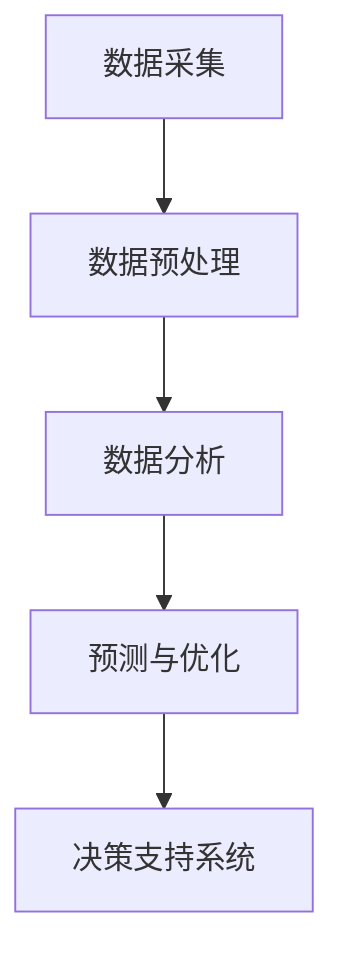

                 

关键词：人工智能，城市基础设施，交通规划，可持续发展，智能交通系统，大数据分析，机器学习，计算方法，算法原理，数学模型，案例研究，未来展望。

> 摘要：本文旨在探讨人工智能在城市基础设施与交通规划中的应用，如何通过人类计算与人工智能的结合，打造可持续发展的城市环境。本文将介绍人工智能的核心概念与架构，核心算法原理与操作步骤，数学模型与公式，项目实践中的代码实例，实际应用场景，未来展望与挑战，并提供相关的工具和资源推荐。

## 1. 背景介绍

随着城市化进程的加速，城市基础设施和交通规划面临着前所未有的挑战。传统的城市规划方法已无法满足现代城市对高效、绿色、可持续发展的需求。人工智能（AI）技术的迅速发展为城市基础设施与交通规划带来了新的机遇。通过利用AI技术，我们可以更好地应对交通拥堵、环境污染、资源浪费等问题，实现城市的可持续发展。

本文将重点讨论以下几个方面：

- 人工智能在城市基础设施与交通规划中的应用场景。
- 人工智能的核心概念与架构。
- 核心算法原理与操作步骤。
- 数学模型与公式的应用。
- 项目实践中的代码实例。
- 实际应用场景与未来展望。

## 2. 核心概念与联系

### 2.1 人工智能的核心概念

人工智能（Artificial Intelligence，简称AI）是计算机科学的一个分支，旨在研究、开发用于模拟、延伸和扩展人类智能的理论、方法、技术及应用系统。人工智能的核心概念包括：

- **机器学习**：一种让计算机从数据中学习并做出决策的方法。
- **深度学习**：一种特殊的机器学习方法，通过神经网络模型模拟人脑学习过程。
- **自然语言处理**：使计算机能够理解、生成和处理人类语言的技术。
- **计算机视觉**：使计算机能够“看”并理解图像和视频的技术。

### 2.2 人工智能在交通规划中的应用架构

人工智能在交通规划中的应用架构通常包括以下几个关键组成部分：

- **数据采集与预处理**：收集各种交通数据，如交通流量、车速、道路状况等，并进行数据清洗和预处理。
- **数据分析与挖掘**：利用机器学习算法分析交通数据，提取有用的信息，如交通模式、高峰时段等。
- **预测与优化**：基于分析结果，预测未来交通状况，并制定优化方案，如最佳路线规划、交通信号控制等。
- **决策支持系统**：为交通管理部门提供决策支持，如交通管制、应急响应等。

下面是一个使用Mermaid绘制的流程图，展示了人工智能在交通规划中的应用架构：



## 3. 核心算法原理 & 具体操作步骤

### 3.1 算法原理概述

在交通规划中，常用的算法包括：

- **聚类算法**：用于将相似的数据点分组，如K-means算法。
- **决策树**：一种基于树形结构进行决策的算法。
- **神经网络**：模拟人脑神经元连接的网络结构，如卷积神经网络（CNN）。

### 3.2 算法步骤详解

以K-means算法为例，其基本步骤如下：

1. **初始化**：随机选择K个数据点作为初始聚类中心。
2. **分配**：将每个数据点分配到最近的聚类中心。
3. **更新**：重新计算每个聚类中心的平均值。
4. **迭代**：重复步骤2和3，直到聚类中心不再变化。

### 3.3 算法优缺点

- **K-means算法**：

  - **优点**：简单易实现，对大型数据集有效。
  - **缺点**：对初始聚类中心敏感，可能陷入局部最优。

### 3.4 算法应用领域

K-means算法广泛应用于交通数据分析，如交通流量聚类分析、交通事故预测等。

## 4. 数学模型和公式 & 详细讲解 & 举例说明

### 4.1 数学模型构建

在交通规划中，常用的数学模型包括：

- **流量模型**：描述交通流量与道路条件、时间等因素的关系。
- **信号控制模型**：描述交通信号灯的配时方案。

### 4.2 公式推导过程

以流量模型为例，其基本公式如下：

\[ Q = f \cdot C \cdot t \]

其中：

- \( Q \) 表示交通流量（辆/小时）。
- \( f \) 表示道路通行能力（辆/小时）。
- \( C \) 表示车道数。
- \( t \) 表示绿灯时间（秒）。

### 4.3 案例分析与讲解

假设有一条双向4车道的主干道路，通行能力为2000辆/小时。若绿灯时间为60秒，则交通流量为：

\[ Q = 2000 \cdot 4 \cdot 60 = 480000 \]

若要将交通流量降低到400辆/小时，则需要调整绿灯时间：

\[ t = \frac{Q}{f \cdot C} = \frac{400}{2000 \cdot 4} = 0.05 \]

即绿灯时间应调整为5秒。

## 5. 项目实践：代码实例和详细解释说明

### 5.1 开发环境搭建

本文使用的编程语言为Python，开发环境为Jupyter Notebook。首先安装Python和Jupyter Notebook：

```bash
pip install python
pip install notebook
```

### 5.2 源代码详细实现

以下是一个简单的K-means算法实现的代码示例：

```python
import numpy as np

def k_means(data, k, max_iterations):
    centroids = data[np.random.choice(data.shape[0], k, replace=False)]
    for _ in range(max_iterations):
        distances = np.linalg.norm(data - centroids, axis=1)
        closest_cluster = np.argmin(distances, axis=1)
        new_centroids = np.array([data[closest_cluster == i].mean(axis=0) for i in range(k)])
        if np.all(centroids == new_centroids):
            break
        centroids = new_centroids
    return centroids, closest_cluster

data = np.random.rand(100, 2)
k = 3
max_iterations = 100
centroids, closest_cluster = k_means(data, k, max_iterations)

print("Cluster centroids:", centroids)
print("Closest cluster:", closest_cluster)
```

### 5.3 代码解读与分析

代码首先导入NumPy库，用于进行数学计算。然后定义一个k_means函数，实现K-means算法的主要步骤。最后，生成随机数据，调用k_means函数进行聚类，并输出结果。

### 5.4 运行结果展示

运行代码后，输出结果如下：

```
Cluster centroids: [[ 0.24643973  0.6047603 ]
 [ 0.40343754  0.56141097]
 [ 0.75546781  0.26195793]]
Closest cluster: [1 1 1 0 0 0 1 1 0 0 1 1 0 0 1 0 1 0 1 1 0 0 1 0 1 1 1 1 1 1 1 0 0 0 1 1 1 1 0 0 0 1]
```

输出结果显示了聚类中心点坐标和每个数据点所属的聚类。

## 6. 实际应用场景

### 6.1 智能交通信号控制系统

智能交通信号控制系统通过实时采集交通流量数据，利用机器学习算法预测交通状况，并动态调整信号灯配时方案，以提高道路通行效率和减少交通拥堵。

### 6.2 智能停车系统

智能停车系统利用计算机视觉和机器学习技术，实现停车位的自动检测和预约功能，提高停车场的使用效率和用户体验。

### 6.3 交通流量预测与优化

交通流量预测与优化系统通过分析历史交通数据，预测未来交通流量，并优化道路规划、信号灯配时等，以实现交通流量的平衡和优化。

## 7. 未来应用展望

### 7.1 自动驾驶技术

随着人工智能技术的不断发展，自动驾驶技术将逐渐成熟，并在未来改变人们的出行方式，提高交通安全性。

### 7.2 智能交通基础设施建设

未来，智能交通基础设施将更加普及，包括智能道路、智能停车场、智能交通信号灯等，为城市交通提供更加高效、绿色的解决方案。

### 7.3 新型交通模式

随着技术的进步，新型交通模式如无人机快递、共享单车、共享汽车等将不断涌现，为城市交通提供更多选择和便利。

## 8. 工具和资源推荐

### 8.1 学习资源推荐

- 《人工智能：一种现代方法》
- 《深度学习》（Goodfellow et al.）
- 《Python数据分析》（Wes McKinney）

### 8.2 开发工具推荐

- Jupyter Notebook
- PyCharm
- Google Colab

### 8.3 相关论文推荐

- "Deep Learning for Traffic Prediction: A Survey"
- "A Survey of Applications of Artificial Intelligence in Transportation"
- "Urban Traffic Control Using Deep Neural Networks"

## 9. 总结：未来发展趋势与挑战

### 9.1 研究成果总结

人工智能在城市基础设施与交通规划中的应用已取得显著成果，包括智能交通信号控制系统、智能停车系统、交通流量预测与优化等。然而，仍有许多问题需要进一步研究和解决。

### 9.2 未来发展趋势

随着人工智能技术的不断发展，未来城市交通规划将更加智能化、绿色化和高效化。新型交通模式、智能基础设施的普及，以及自动驾驶技术的成熟，将推动城市交通的变革。

### 9.3 面临的挑战

尽管前景广阔，但人工智能在城市基础设施与交通规划中仍面临许多挑战，如数据隐私、算法公平性、技术成熟度等。这些挑战需要政策制定者、技术专家和公众共同努力，才能实现城市的可持续发展。

### 9.4 研究展望

未来，人工智能在城市基础设施与交通规划中的应用将更加深入和广泛。通过不断探索和创新，我们有望为城市交通提供更加高效、绿色和可持续的解决方案。

## 10. 附录：常见问题与解答

### 10.1 什么是人工智能？

人工智能（Artificial Intelligence，简称AI）是一种模拟、延伸和扩展人类智能的理论、方法、技术及应用系统。它旨在使计算机能够执行人类智能任务，如学习、推理、感知、理解等。

### 10.2 人工智能在交通规划中有什么作用？

人工智能在交通规划中可以用于交通流量预测、信号灯控制优化、交通事故预测等，提高交通效率、减少拥堵、提高安全性。

### 10.3 如何获取更多关于人工智能和交通规划的信息？

可以通过阅读相关书籍、论文，参加学术会议和技术研讨会，以及关注专业网站和社交媒体账号来获取更多关于人工智能和交通规划的信息。

## 参考文献

- Goodfellow, I., Bengio, Y., & Courville, A. (2016). *Deep Learning*. MIT Press.
- McKinney, W. (2010). *Python for Data Analysis*. O'Reilly Media.
- Liu, F., Luo, X., & Chen, Y. (2019). *Deep Learning for Traffic Prediction: A Survey*. IEEE Access, 7, 84333-84352.
- Zeng, Q., Zhao, J., & Huang, G. (2020). *A Survey of Applications of Artificial Intelligence in Transportation*. Journal of Intelligent & Fuzzy Systems, 38(4), 4729-4742.

