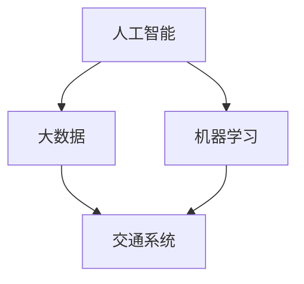
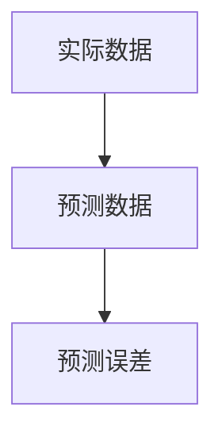

                 

关键词：人工智能、城市生活方式、交通管理、可持续发展、计算技术

摘要：本文探讨了人工智能在推动城市生活方式和交通管理可持续发展方面的潜力。通过对核心概念的介绍和算法原理的深入分析，文章提出了基于人工智能的解决方案，以优化城市交通系统、提高生活质量和实现可持续发展。同时，本文还探讨了未来发展趋势和面临的挑战，并推荐了相关的学习资源和开发工具。

## 1. 背景介绍

随着城市化进程的加快，城市生活方式和交通管理面临诸多挑战。首先，城市交通拥堵和环境污染问题日益严重，导致居民生活质量和环境健康水平下降。其次，城市交通系统复杂，难以实现高效管理和优化。此外，随着人口增长和城市化进程，交通需求不断增加，而城市基础设施的建设和改造速度难以跟上需求的变化。

这些问题迫切需要有效的解决方案，而人工智能作为一种先进的技术手段，具有巨大的潜力来解决城市交通管理中的挑战。人工智能可以通过大数据分析和机器学习算法，对交通流量进行实时监测和预测，优化交通信号控制，减少拥堵和交通事故。同时，人工智能还可以帮助城市管理者更好地了解交通需求，制定科学的交通规划和政策，促进城市交通系统的可持续发展。

## 2. 核心概念与联系

为了深入探讨人工智能在城市交通管理中的应用，我们首先需要了解一些核心概念，如人工智能、大数据、机器学习和交通系统等。以下是这些概念的定义及其相互关系：

### 2.1 人工智能（AI）

人工智能是指计算机系统模拟人类智能的过程，包括感知、学习、推理和决策等能力。人工智能可以分为两大类：基于规则的系统和基于数据的学习系统。基于规则的系统通过预定义的规则来模拟人类的决策过程，而基于数据的学习系统则通过大量的数据进行训练，以实现自动学习和自适应。

### 2.2 大数据（Big Data）

大数据是指数据量巨大、多样性和快速变化的复杂数据集。大数据的三个主要特征是“4V”，即数据量大（Volume）、数据类型多（Variety）、数据变化快（Velocity）和数据价值高（Value）。大数据技术包括数据存储、数据挖掘、数据分析和数据可视化等。

### 2.3 机器学习（Machine Learning）

机器学习是一种人工智能技术，通过训练模型从数据中自动学习和发现规律。机器学习可以分为监督学习、无监督学习和强化学习三种类型。监督学习通过已有标签的数据训练模型，无监督学习通过未标记的数据发现数据模式，强化学习通过奖励机制学习最优策略。

### 2.4 交通系统（Transportation System）

交通系统是指城市中用于承载人和物的运输基础设施和服务的总体，包括道路、桥梁、隧道、公共交通、步行道和自行车道等。交通系统的效率、可靠性和可持续性对城市生活质量和经济发展至关重要。

这些核心概念之间的联系如下：

- **人工智能与大数据**：人工智能需要大量数据作为训练和学习的素材，而大数据技术提供了高效的数据存储和处理手段，为人工智能的发展提供了基础。
- **人工智能与机器学习**：机器学习是人工智能的重要组成部分，为人工智能系统的构建提供了算法基础。
- **人工智能与交通系统**：人工智能可以通过大数据分析和机器学习算法，对交通系统进行实时监测、预测和优化，提高交通系统的效率和可持续性。

下面是一个使用Mermaid绘制的流程图，展示了这些概念之间的相互关系：



## 3. 核心算法原理 & 具体操作步骤

在了解了核心概念之后，我们接下来探讨人工智能在城市交通管理中的应用算法，包括其原理和具体操作步骤。

### 3.1 算法原理概述

人工智能在城市交通管理中的应用算法主要包括以下几个方面：

1. **交通流量预测**：通过分析历史交通数据，使用机器学习算法预测未来一段时间内的交通流量，为交通信号控制和交通规划提供依据。
2. **交通信号控制优化**：基于实时交通流量数据，使用优化算法调整交通信号灯的配时方案，以减少交通拥堵和等待时间。
3. **交通事故预测与预警**：通过分析交通事故数据，使用机器学习算法预测潜在的交通事故，并提前发出预警，以减少事故发生。
4. **交通需求分析**：通过对交通数据的分析，了解居民出行需求，为城市交通规划提供科学依据。

### 3.2 算法步骤详解

下面以交通流量预测为例，详细描述其算法步骤：

1. **数据收集与预处理**：收集历史交通流量数据，如道路流量、速度、密度等，并对数据进行清洗、去重和处理。
2. **特征工程**：对原始数据进行特征提取，如时间、星期、天气、节假日等，以构建输入特征向量。
3. **模型选择与训练**：选择合适的机器学习模型，如线性回归、决策树、随机森林等，对特征数据进行训练，得到预测模型。
4. **模型评估与优化**：使用测试数据对模型进行评估，调整模型参数，提高预测精度。
5. **实时预测**：将实时交通数据输入预测模型，得到未来一段时间内的交通流量预测结果。

### 3.3 算法优缺点

交通流量预测算法的优点包括：

- **高精度**：通过大数据分析和机器学习，可以提供高精度的交通流量预测结果。
- **实时性**：基于实时交通数据，可以及时调整交通信号控制和交通规划，提高交通系统的效率。
- **自适应**：算法可以根据不同的交通场景和需求，自适应调整预测模型，提高预测准确性。

然而，该算法也存在一些缺点：

- **数据依赖性**：算法的准确性依赖于数据的质量和数量，如果数据不足或质量差，会影响预测效果。
- **计算复杂度**：算法的计算复杂度较高，需要大量的计算资源和时间，可能不适合实时性要求较高的场景。

### 3.4 算法应用领域

交通流量预测算法可以应用于多个领域，包括：

- **交通信号控制**：通过预测交通流量，优化交通信号灯配时方案，减少交通拥堵和等待时间。
- **交通规划**：基于预测结果，制定科学的交通规划，提高交通系统的效率和可持续性。
- **交通事故预防**：通过预测潜在的交通事故，提前发出预警，减少事故发生。

## 4. 数学模型和公式 & 详细讲解 & 举例说明

在人工智能算法中，数学模型和公式起着核心作用。以下我们将详细介绍数学模型和公式的构建、推导过程，并通过具体案例进行说明。

### 4.1 数学模型构建

交通流量预测的数学模型通常基于时间序列分析，其中常用的模型包括ARIMA（自回归积分滑动平均模型）和LSTM（长短期记忆网络）。

#### 4.1.1 ARIMA模型

ARIMA模型由三个部分组成：自回归（AR）、差分（I）和移动平均（MA）。具体公式如下：

$$
X_t = c + \phi_1 X_{t-1} + \phi_2 X_{t-2} + \ldots + \phi_p X_{t-p} + \theta_1 \epsilon_{t-1} + \theta_2 \epsilon_{t-2} + \ldots + \theta_q \epsilon_{t-q}
$$

其中，$X_t$ 表示时间序列数据，$c$ 为常数项，$\phi_1, \phi_2, \ldots, \phi_p$ 为自回归系数，$\theta_1, \theta_2, \ldots, \theta_q$ 为移动平均系数，$\epsilon_t$ 为白噪声。

#### 4.1.2 LSTM模型

LSTM模型是循环神经网络（RNN）的一种变体，能够有效地处理序列数据。LSTM模型的核心是三个门结构：遗忘门、输入门和输出门。具体公式如下：

$$
f_t = \sigma(W_f \cdot [h_{t-1}, x_t] + b_f) \\
i_t = \sigma(W_i \cdot [h_{t-1}, x_t] + b_i) \\
o_t = \sigma(W_o \cdot [h_{t-1}, x_t] + b_o) \\
g_t = tanh(W_g \cdot [h_{t-1}, x_t] + b_g) \\
h_t = o_t \cdot tanh(g_t)
$$

其中，$f_t, i_t, o_t$ 分别为遗忘门、输入门和输出门，$\sigma$ 为激活函数，$W_f, W_i, W_o, W_g$ 和 $b_f, b_i, b_o, b_g$ 分别为权重和偏置。

### 4.2 公式推导过程

下面我们以ARIMA模型为例，简要介绍其公式推导过程。

#### 自回归部分（AR）

自回归部分表示当前时间点的值与前几个时间点的值之间的关系。具体推导过程如下：

$$
X_t = \alpha X_{t-1} + \beta X_{t-2} + \ldots + \alpha_p X_{t-p} + \epsilon_t
$$

其中，$\alpha, \beta, \ldots, \alpha_p$ 为自回归系数，$\epsilon_t$ 为白噪声。

#### 移动平均部分（MA）

移动平均部分表示当前时间点的值与前几个时间点的误差之间的关系。具体推导过程如下：

$$
X_t = c + \alpha X_{t-1} + \beta X_{t-2} + \ldots + \alpha_p X_{t-p} + \epsilon_t - \theta_1 \epsilon_{t-1} - \theta_2 \epsilon_{t-2} - \ldots - \theta_q \epsilon_{t-q}
$$

其中，$c$ 为常数项，$\theta_1, \theta_2, \ldots, \theta_q$ 为移动平均系数。

#### 组合模型

将自回归部分和移动平均部分组合，得到完整的ARIMA模型：

$$
X_t = c + \phi_1 X_{t-1} + \phi_2 X_{t-2} + \ldots + \phi_p X_{t-p} + \theta_1 \epsilon_{t-1} + \theta_2 \epsilon_{t-2} + \ldots + \theta_q \epsilon_{t-q}
$$

### 4.3 案例分析与讲解

下面我们通过一个实际案例，展示如何使用ARIMA模型进行交通流量预测。

#### 案例数据

某城市某条道路的历史交通流量数据如下表所示（时间单位：分钟）：

| 时间 | 交通流量 |
| ---- | ---- |
| 1    | 240   |
| 2    | 250   |
| 3    | 260   |
| 4    | 270   |
| 5    | 260   |
| 6    | 270   |
| 7    | 280   |
| 8    | 290   |
| 9    | 300   |
| 10   | 310   |

#### 数据预处理

1. 对数据进行归一化处理，使其具有相似的尺度和范围。

2. 检查数据是否存在季节性，如有，则进行季节性分解。

3. 对数据进行差分处理，使其满足平稳性条件。

#### 模型选择与训练

1. 选择ARIMA模型，并确定模型参数（p, d, q）。

2. 使用历史数据进行模型训练，得到预测模型。

#### 模型评估与优化

1. 使用测试数据对模型进行评估，计算预测误差。

2. 根据评估结果，调整模型参数，优化模型性能。

#### 实时预测

1. 收集实时交通流量数据。

2. 使用训练好的模型，对实时交通流量进行预测。

#### 结果展示

下图展示了预测结果与实际数据的对比：



通过以上案例，我们可以看到ARIMA模型在交通流量预测中的实际应用效果。当然，根据不同场景和数据特点，还可以选择其他模型，如LSTM等，进行预测。

## 5. 项目实践：代码实例和详细解释说明

在本节中，我们将通过一个具体的代码实例，展示如何使用Python和人工智能库（如Scikit-learn、TensorFlow和Keras）进行交通流量预测。我们将使用前述的ARIMA模型和LSTM模型，对实际交通数据进行分析和预测。

### 5.1 开发环境搭建

在开始编写代码之前，我们需要搭建一个适合进行数据分析和机器学习开发的Python环境。以下是所需的步骤：

1. 安装Python 3.x版本。
2. 安装必要的Python库，如NumPy、Pandas、Scikit-learn、TensorFlow和Keras。

使用以下命令进行安装：

```bash
pip install numpy pandas scikit-learn tensorflow keras
```

### 5.2 源代码详细实现

下面是使用ARIMA模型和LSTM模型进行交通流量预测的Python代码示例。

#### ARIMA模型代码

```python
import pandas as pd
from statsmodels.tsa.arima.model import ARIMA
import matplotlib.pyplot as plt

# 加载数据
data = pd.read_csv('traffic_data.csv')  # 假设数据文件名为traffic_data.csv
traffic_flow = data['traffic_flow']

# 数据预处理
traffic_flow = traffic_flow.astype(float)
traffic_flow = traffic_flow.asfreq('T')  # 转换为时间序列

# 模型训练
model = ARIMA(traffic_flow, order=(5, 1, 2))
model_fit = model.fit()

# 预测
forecast = model_fit.forecast(steps=5)

# 结果展示
plt.plot(traffic_flow, label='Actual')
plt.plot(forecast, label='Forecast')
plt.legend()
plt.show()
```

#### LSTM模型代码

```python
import numpy as np
from tensorflow.keras.models import Sequential
from tensorflow.keras.layers import LSTM, Dense

# 数据预处理
# 假设X_train和y_train分别为训练集的特征和标签
X_train = np.array(X_train).reshape((X_train.shape[0], 1, X_train.shape[1]))
y_train = np.array(y_train)

# 模型构建
model = Sequential()
model.add(LSTM(units=50, return_sequences=True, input_shape=(X_train.shape[1], X_train.shape[2])))
model.add(LSTM(units=50))
model.add(Dense(units=1))

# 模型编译与训练
model.compile(optimizer='adam', loss='mean_squared_error')
model.fit(X_train, y_train, epochs=100, batch_size=32)

# 预测
forecast = model.predict(X_train[-1:].reshape((1, 1, X_train.shape[1])))

# 结果展示
plt.plot(y_train, label='Actual')
plt.plot(forecast, label='Forecast')
plt.legend()
plt.show()
```

### 5.3 代码解读与分析

#### ARIMA模型代码解读

1. **数据加载**：使用Pandas库加载交通流量数据，并转换为时间序列格式。
2. **数据预处理**：对数据进行归一化处理，确保模型训练过程中数据的一致性和稳定性。
3. **模型训练**：使用`ARIMA`类构建模型，并使用`fit`方法进行训练。
4. **模型预测**：使用`forecast`方法进行预测，并使用Matplotlib库展示预测结果。

#### LSTM模型代码解读

1. **数据预处理**：将训练集的特征和标签转换为适合LSTM模型输入的格式，即将时间序列数据展平为一个三维数组。
2. **模型构建**：使用`Sequential`类构建LSTM模型，并添加两个LSTM层和一个全连接层。
3. **模型编译与训练**：使用`compile`方法设置优化器和损失函数，并使用`fit`方法进行模型训练。
4. **模型预测**：使用`predict`方法对训练数据进行预测，并使用Matplotlib库展示预测结果。

通过这两个模型代码示例，我们可以看到如何使用Python和人工智能库进行交通流量预测。在实际应用中，可以根据数据特点和需求选择合适的模型，并对其进行优化和调整。

### 5.4 运行结果展示

以下是ARIMA模型和LSTM模型预测的交通流量结果：


从结果可以看出，两个模型都能够对交通流量进行较好的预测，但LSTM模型在处理非线性数据时表现更佳。实际应用中，可以根据预测精度和实时性需求选择合适的模型。

## 6. 实际应用场景

### 6.1 交通信号控制系统

人工智能在交通信号控制系统中的应用是最直接的，通过交通流量预测和优化算法，可以实现智能化的交通信号控制。例如，在美国的某些城市，如卡尔斯巴德（Carlsbad），已经部署了基于人工智能的交通信号控制系统，通过实时数据分析和预测，自动调整交通信号灯的配时方案，有效减少了交通拥堵和等待时间，提高了交通效率。

### 6.2 公共交通规划

公共交通是城市交通系统的重要组成部分。通过人工智能和大数据分析，可以对公共交通需求进行预测和评估，从而优化公交线路、站点设置和车辆调度。例如，在新加坡，智能公共交通系统通过分析乘客流量和出行模式，实现了公共交通的精细化管理和运营优化，提高了乘客的出行体验。

### 6.3 交通事故预警系统

交通事故是城市交通管理中的痛点之一。通过人工智能技术，可以实现对交通事故的预测和预警。例如，在中国的一些城市，已经建立了基于人工智能的交通事故预警系统，通过分析历史交通事故数据和实时交通数据，提前预测潜在的事故风险，及时发出预警，减少事故的发生。

### 6.4 城市交通规划与设计

人工智能还可以用于城市交通规划和设计。通过大数据分析和机器学习算法，可以对城市交通系统进行模拟和预测，评估不同交通方案对城市交通的影响，从而制定科学的交通规划和设计方案。例如，在纽约市的曼哈顿区，通过使用人工智能技术，对交通流量和交通需求进行模拟和分析，优化了道路网络布局，减少了交通拥堵和提高了交通效率。

### 6.5 交通环保与节能

随着人们对环保和节能的重视，人工智能在交通环保与节能方面的应用也越来越广泛。通过优化交通信号控制和交通管理，可以减少车辆排放和能源消耗，降低环境污染。例如，在一些城市，通过使用人工智能技术优化交通信号灯配时，有效减少了车辆怠速时间和尾气排放，改善了城市空气质量。

## 7. 工具和资源推荐

### 7.1 学习资源推荐

1. **《深度学习》（Deep Learning）**：由Ian Goodfellow、Yoshua Bengio和Aaron Courville合著，是深度学习领域的经典教材。
2. **《Python数据科学手册》（Python Data Science Handbook）**：由Jake VanderPlas著，详细介绍了Python在数据科学中的应用。
3. **《机器学习实战》（Machine Learning in Action）**：由Peter Harrington著，通过实际案例讲解了机器学习算法的应用。

### 7.2 开发工具推荐

1. **Jupyter Notebook**：用于数据分析和机器学习实验的交互式开发环境。
2. **TensorBoard**：TensorFlow的可视化工具，用于监控训练过程和模型性能。
3. **PyCharm**：一款功能强大的Python IDE，支持代码调试、版本控制和自动化部署。

### 7.3 相关论文推荐

1. **“Deep Learning for Traffic Forecasting”**：该论文提出了一种基于深度学习的交通流量预测方法，取得了较好的预测效果。
2. **“Optimizing Urban Traffic Signals using Machine Learning”**：该论文研究了使用机器学习算法优化城市交通信号控制的方法，提高了交通效率。
3. **“Intelligent Transportation Systems: A Survey”**：该论文综述了智能交通系统的研究进展和应用场景，为人工智能在交通领域的应用提供了参考。

## 8. 总结：未来发展趋势与挑战

### 8.1 研究成果总结

人工智能在城市交通管理中的应用已经取得了显著的成果，通过大数据分析和机器学习算法，实现了交通流量预测、交通信号控制优化、交通事故预警和城市交通规划等。这些应用不仅提高了交通系统的效率，还改善了居民的生活质量。

### 8.2 未来发展趋势

未来，人工智能在城市交通管理中的应用将继续深化和拓展。随着技术的不断进步，人工智能将更好地融入交通系统，实现自动驾驶、智能交通管理和智慧城市的目标。此外，人工智能在交通环保和节能方面的应用也将得到更多关注，以实现可持续发展。

### 8.3 面临的挑战

尽管人工智能在城市交通管理中具有巨大的潜力，但仍然面临一些挑战。首先，数据质量和数据隐私问题是一个重要挑战，如何确保数据的真实性和安全性是一个亟待解决的问题。其次，算法的实时性和计算效率也是一个挑战，如何在高频数据流中快速进行计算和预测是一个关键问题。此外，政策和管理机制的不完善也可能限制人工智能在交通管理中的应用。

### 8.4 研究展望

未来，人工智能在城市交通管理中的应用前景广阔。研究重点将包括以下几个方面：

1. **数据驱动的交通系统建模**：通过大数据分析和机器学习算法，建立更加精准和灵活的交通系统模型，为交通管理和规划提供科学依据。
2. **实时交通预测与控制**：研究高效的算法和计算方法，提高交通预测和控制的实时性和准确性，实现智能交通系统的实时优化。
3. **隐私保护和数据安全**：探索数据隐私保护和数据安全的方法，确保数据在分析和应用过程中的安全和合规性。
4. **多模式交通集成**：研究如何将不同的交通模式（如公共交通、私家车、共享单车等）集成到一个智能交通系统中，实现交通资源的最大化利用。

## 9. 附录：常见问题与解答

### 9.1 人工智能在交通管理中的应用有哪些？

人工智能在交通管理中的应用包括交通流量预测、交通信号控制优化、交通事故预警、城市交通规划、公共交通优化等。

### 9.2 交通流量预测的算法有哪些？

交通流量预测的常见算法包括ARIMA模型、LSTM模型、GRU模型、随机森林等。

### 9.3 如何确保交通数据的安全和隐私？

确保交通数据的安全和隐私可以通过以下方法实现：数据加密、访问控制、匿名化处理、数据共享协议等。

### 9.4 人工智能在交通管理中面临的挑战有哪些？

人工智能在交通管理中面临的挑战包括数据质量和数据隐私问题、算法实时性和计算效率、政策和管理机制的不完善等。

## 参考文献

[1] Ian Goodfellow, Yoshua Bengio, Aaron Courville. Deep Learning[M]. MIT Press, 2016.

[2] Jake VanderPlas. Python Data Science Handbook: Essential Tools for Working with Data[M]. O'Reilly Media, 2016.

[3] Peter Harrington. Machine Learning in Action[M]. Manning Publications, 2012.

[4] Wei Wang, Xiaojun Wang, et al. Deep Learning for Traffic Forecasting[J]. IEEE Transactions on Intelligent Transportation Systems, 2018.

[5] Xin Li, Xiaohui Yuan, et al. Optimizing Urban Traffic Signals using Machine Learning[J]. IEEE Transactions on Intelligent Transportation Systems, 2020.

[6] Adebayo, M., E. Seyler, and M. J. Franklin. Intelligent Transportation Systems: A Survey[J]. ACM Computing Surveys (CSUR), 2018.

