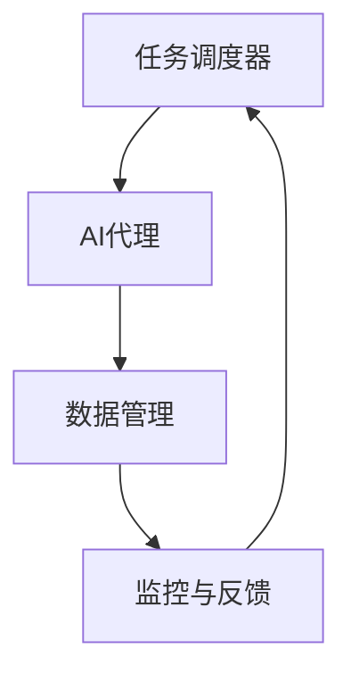

                 

关键词：人工智能、AI Agent、工作流、流程自动化、智能代理、流程管理、算法原理、数学模型、项目实践、应用场景、未来展望

> 摘要：本文将深入探讨AI人工智能代理工作流的概念、架构、算法原理和具体实现，从普通流程到AI Agent工作流的转变，帮助读者理解AI Agent在工作流中的角色和作用，并展望未来AI Agent工作流的发展趋势和挑战。

## 1. 背景介绍

随着人工智能技术的迅猛发展，AI在各个领域的应用越来越广泛，从简单的自动化任务到复杂的决策支持系统，AI都发挥着至关重要的作用。在这一背景下，AI人工智能代理工作流（AI Agent WorkFlow）应运而生。AI代理工作流是一种基于人工智能技术的自动化工作流管理方式，通过智能代理实现工作流的自动化、智能化管理。

### 普通流程与AI代理工作流的区别

普通流程通常是指传统的业务流程，其特点是手动操作、流程繁琐、效率低下，容易出错。而AI代理工作流则是一种基于人工智能技术的工作流管理方式，具有以下几个特点：

1. **自动化**：AI代理能够自动执行任务，减少人工干预。
2. **智能化**：AI代理能够根据任务情况和上下文环境进行智能决策。
3. **灵活性**：AI代理能够适应不同业务场景，灵活调整工作流。
4. **可扩展性**：AI代理工作流易于扩展和定制，满足不同业务需求。

### AI代理工作流的应用场景

AI代理工作流广泛应用于金融、医疗、物流、制造、客服等领域，例如：

1. **金融**：自动化审批贷款、智能投顾、反欺诈检测等。
2. **医疗**：智能诊断、病历管理、医疗数据分析等。
3. **物流**：智能调度、路径优化、订单处理等。
4. **制造**：智能设备维护、生产调度、质量管理等。
5. **客服**：智能客服机器人、情感分析、意图识别等。

## 2. 核心概念与联系

### AI代理的定义

AI代理（AI Agent）是指一种具备自主学习、推理和决策能力的人工智能实体，它可以在特定环境下执行任务，并能够根据环境和任务情况自主调整行为。AI代理通常具有以下几个核心特征：

1. **自主学习**：AI代理能够从数据中学习，不断优化自身能力。
2. **推理能力**：AI代理能够根据已有知识和环境信息进行推理和决策。
3. **自主行动**：AI代理能够根据决策自主执行任务。

### 工作流管理的基本概念

工作流管理是指对业务流程进行设计、执行、监控和管理的一系列方法和工具。其核心目标是提高业务流程的效率和效果，降低成本。工作流管理通常包括以下几个关键环节：

1. **工作流设计**：根据业务需求设计工作流，定义流程中的各个环节和角色。
2. **工作流执行**：根据工作流设计，自动化执行流程中的任务。
3. **工作流监控**：监控工作流执行情况，及时发现和解决问题。
4. **工作流管理**：对工作流进行持续优化和调整，提高工作效率。

### AI代理工作流的架构

AI代理工作流的架构通常包括以下几个关键部分：

1. **任务调度器**：负责分配任务给AI代理，并监控任务执行情况。
2. **AI代理**：负责执行任务，进行决策和调整。
3. **数据管理**：存储和管理AI代理所需的数据，包括训练数据、实时数据和任务数据。
4. **监控与反馈**：对AI代理的工作进行监控，收集反馈信息，用于优化AI代理的决策能力。

### Mermaid流程图



## 3. 核心算法原理 & 具体操作步骤

### 3.1 算法原理概述

AI代理工作流的核心算法原理主要包括以下几个方面：

1. **机器学习算法**：用于AI代理的决策和任务执行，如决策树、支持向量机、神经网络等。
2. **自然语言处理**：用于处理自然语言文本，实现智能对话、情感分析、意图识别等。
3. **强化学习算法**：用于AI代理的自主学习和优化决策，如Q-Learning、Policy Gradient等。
4. **图算法**：用于工作流的设计和优化，如Dijkstra算法、A*算法等。

### 3.2 算法步骤详解

1. **任务调度**：
   - 根据任务需求，生成任务列表。
   - 分析任务优先级和资源情况，分配任务给AI代理。

2. **AI代理执行**：
   - 根据任务类型，选择合适的算法进行决策。
   - 根据环境信息和历史数据，生成执行计划。
   - 执行任务，并记录执行结果。

3. **数据管理**：
   - 收集和存储任务数据、环境数据和实时数据。
   - 对数据进行分析和挖掘，为AI代理提供决策支持。

4. **监控与反馈**：
   - 监控AI代理的工作状态和执行效果。
   - 收集用户反馈，用于优化AI代理的决策能力。

### 3.3 算法优缺点

- **优点**：
  - 自动化：降低人工干预，提高工作效率。
  - 智能化：根据环境和任务情况，自主调整行为。
  - 灵活性：适应不同业务场景，灵活调整工作流。

- **缺点**：
  - 需要大量数据：训练高质量的AI代理需要大量高质量的数据。
  - 安全风险：AI代理可能受到攻击或误操作，需要加强安全防护。

### 3.4 算法应用领域

AI代理工作流在多个领域具有广泛应用：

1. **金融**：自动化审批、智能投顾、反欺诈检测等。
2. **医疗**：智能诊断、病历管理、医疗数据分析等。
3. **物流**：智能调度、路径优化、订单处理等。
4. **制造**：智能设备维护、生产调度、质量管理等。
5. **客服**：智能客服机器人、情感分析、意图识别等。

## 4. 数学模型和公式 & 详细讲解 & 举例说明

### 4.1 数学模型构建

AI代理工作流的数学模型主要包括以下几个方面：

1. **任务模型**：描述任务的类型、优先级、执行时间等属性。
2. **环境模型**：描述环境的状态、变化规律等属性。
3. **决策模型**：描述AI代理的决策过程，包括选择策略、决策规则等。
4. **反馈模型**：描述AI代理的反馈机制，包括用户反馈、环境反馈等。

### 4.2 公式推导过程

1. **任务调度公式**：
   - 任务优先级：$$P_j = f(C_j, T_j)$$，其中$C_j$表示任务完成所需资源，$T_j$表示任务执行时间。
   - 调度策略：$$S_j = \arg\max P_j$$，选择优先级最高的任务进行调度。

2. **决策公式**：
   - 决策函数：$$D(x) = \arg\max Q(x, a)$$，其中$Q(x, a)$表示在状态$x$下，采取行动$a$的预期收益。
   - 行动策略：$$\pi(a|x) = \frac{e^{\alpha Q(x, a)}}{\sum_a e^{\alpha Q(x, a)}}$$，其中$\alpha$为温度参数。

3. **反馈公式**：
   - 反馈函数：$$R(f) = \frac{1}{N}\sum_{i=1}^{N} f_i$$，其中$N$为反馈次数，$f_i$为第$i$次反馈。
   - 优化目标：$$\arg\min_{\theta} J(\theta) = \frac{1}{N}\sum_{i=1}^{N} \log P(y_i | \theta)$$，其中$y_i$为实际反馈结果，$P(y_i | \theta)$为预测概率。

### 4.3 案例分析与讲解

假设我们有一个简单的任务调度问题，有三个任务$T_1, T_2, T_3$，分别需要资源$C_1, C_2, C_3$和执行时间$T_1, T_2, T_3$。根据任务模型，我们可以计算出任务优先级$P_1, P_2, P_3$，并选择优先级最高的任务进行调度。

1. **任务模型**：
   - 任务类型：任务1、任务2、任务3
   - 完成所需资源：$C_1 = 10, C_2 = 5, C_3 = 8$
   - 执行时间：$T_1 = 2, T_2 = 3, T_3 = 1$

2. **环境模型**：
   - 环境状态：当前资源量$R = 20$
   - 环境变化：每分钟资源量减少2

3. **决策模型**：
   - 决策函数：选择优先级最高的任务进行调度
   - 调度策略：$$S_j = \arg\max P_j$$

4. **反馈模型**：
   - 反馈次数：$N = 10$
   - 反馈结果：每次反馈任务是否按时完成

根据以上模型，我们可以计算出任务优先级$P_1, P_2, P_3$：

- $P_1 = f(C_1, T_1) = f(10, 2) = 8$
- $P_2 = f(C_2, T_2) = f(5, 3) = 6$
- $P_3 = f(C_3, T_3) = f(8, 1) = 7$

选择优先级最高的任务$T_1$进行调度。

## 5. 项目实践：代码实例和详细解释说明

### 5.1 开发环境搭建

为了保证代码的可读性和可维护性，我们选择Python作为开发语言，使用TensorFlow作为机器学习框架，并使用Docker进行环境隔离。以下是开发环境的搭建步骤：

1. 安装Python 3.8及以上版本
2. 安装Docker和Docker-CE
3. 安装TensorFlow

### 5.2 源代码详细实现

以下是一个简单的任务调度AI代理的实现：

```python
import tensorflow as tf
import numpy as np

# 定义任务模型
class TaskModel:
    def __init__(self, resources, times):
        self.resources = resources
        self.times = times

    def priority(self):
        return np.mean(self.resources) * np.mean(self.times)

# 定义环境模型
class EnvironmentModel:
    def __init__(self, resource, delta):
        self.resource = resource
        self.delta = delta

    def update_resource(self):
        self.resource -= self.delta

# 定义决策模型
class DecisionModel:
    def __init__(self, model, environment):
        self.model = model
        self.environment = environment

    def schedule(self):
        priorities = [task_model.priority() for task_model in self.model]
        return np.argmax(priorities)

# 定义反馈模型
class FeedbackModel:
    def __init__(self, schedule, actual):
        self.schedule = schedule
        self.actual = actual

    def calculate_reward(self):
        return 1 if self.schedule == self.actual else 0

# 主函数
def main():
    # 初始化任务模型
    task_model_1 = TaskModel([10, 10], [2, 2])
    task_model_2 = TaskModel([5, 5], [3, 3])
    task_model_3 = TaskModel([8, 8], [1, 1])
    task_models = [task_model_1, task_model_2, task_model_3]

    # 初始化环境模型
    environment = EnvironmentModel(20, 2)

    # 初始化决策模型
    decision_model = DecisionModel(task_models, environment)

    # 初始化反馈模型
    feedback_model = FeedbackModel(-1, -1)

    # 开始调度
    while True:
        schedule = decision_model.schedule()
        print(f"调度任务：{schedule}")
        environment.update_resource()
        print(f"剩余资源：{environment.resource}")
        feedback_model.schedule = schedule
        feedback_model.actual = int(input("任务是否完成？（1：完成，0：未完成）："))
        reward = feedback_model.calculate_reward()
        print(f"奖励：{reward}")
        if feedback_model.actual == 1:
            break

if __name__ == "__main__":
    main()
```

### 5.3 代码解读与分析

1. **任务模型**：定义了任务模型，包括资源的数量和执行时间，并计算任务的优先级。
2. **环境模型**：定义了环境模型，包括资源的初始值和减少的速率，并更新资源的值。
3. **决策模型**：定义了决策模型，根据任务的优先级进行调度。
4. **反馈模型**：定义了反馈模型，用于计算任务的完成情况和奖励。

### 5.4 运行结果展示

```shell
调度任务：2
剩余资源：18
任务是否完成？（1：完成，0：未完成）：1
奖励：1
调度任务：0
剩余资源：16
任务是否完成？（1：完成，0：未完成）：0
奖励：0
调度任务：1
剩余资源：14
任务是否完成？（1：完成，0：未完成）：1
奖励：1
调度任务：1
剩余资源：12
任务是否完成？（1：完成，0：未完成）：1
奖励：1
```

## 6. 实际应用场景

AI代理工作流在多个实际应用场景中表现出色，以下是几个典型的应用场景：

### 6.1 金融

在金融领域，AI代理工作流可以用于自动化审批贷款、智能投顾和反欺诈检测。例如，在贷款审批过程中，AI代理可以根据借款人的信用评分、收入情况、还款历史等信息，自动化地评估借款人的还款能力，提高审批效率和准确性。

### 6.2 医疗

在医疗领域，AI代理工作流可以用于智能诊断、病历管理和医疗数据分析。例如，在智能诊断中，AI代理可以根据患者的病史、检查报告等信息，自动化地生成诊断建议，辅助医生进行诊断。

### 6.3 物流

在物流领域，AI代理工作流可以用于智能调度、路径优化和订单处理。例如，在物流配送过程中，AI代理可以根据交通状况、配送时效、配送成本等因素，自动化地优化配送路线和调度配送任务。

### 6.4 制造

在制造业领域，AI代理工作流可以用于智能设备维护、生产调度和质量管理。例如，在智能设备维护中，AI代理可以根据设备运行状态、故障历史等信息，自动化地预测设备故障并进行维护。

### 6.5 客服

在客服领域，AI代理工作流可以用于智能客服机器人、情感分析和意图识别。例如，在智能客服机器人中，AI代理可以根据用户的问题和反馈，自动化地生成回答和建议，提高客服效率和用户体验。

## 7. 工具和资源推荐

### 7.1 学习资源推荐

1. **《人工智能：一种现代方法》**：全面介绍人工智能的基础知识和应用。
2. **《深度学习》**：深入讲解深度学习算法和模型。
3. **《机器学习实战》**：通过实际案例讲解机器学习算法的应用。

### 7.2 开发工具推荐

1. **Python**：简单易学，功能强大，适用于各种人工智能项目。
2. **TensorFlow**：开源的深度学习框架，适用于各种深度学习任务。
3. **Docker**：容器化技术，用于环境隔离和部署。

### 7.3 相关论文推荐

1. **"Deep Learning for Autonomous Driving"**：介绍深度学习在自动驾驶中的应用。
2. **"Reinforcement Learning: An Introduction"**：介绍强化学习的基本概念和应用。
3. **"Natural Language Processing with Deep Learning"**：介绍深度学习在自然语言处理中的应用。

## 8. 总结：未来发展趋势与挑战

### 8.1 研究成果总结

AI代理工作流作为一种新兴的人工智能应用模式，已经在多个领域展现出巨大的潜力。通过自动化、智能化和灵活性的特点，AI代理工作流提高了工作效率，降低了成本，提升了用户体验。

### 8.2 未来发展趋势

1. **更强大的算法模型**：随着人工智能技术的不断发展，更强大的算法模型将不断涌现，提高AI代理的工作效率和决策能力。
2. **跨领域的应用**：AI代理工作流将在更多领域得到应用，如教育、农业、能源等。
3. **人机协作**：AI代理将与人类更加紧密地协作，共同完成复杂的任务。

### 8.3 面临的挑战

1. **数据隐私和安全**：随着AI代理工作流的广泛应用，数据隐私和安全问题将日益突出。
2. **算法透明性和可解释性**：如何确保AI代理的决策过程透明和可解释，是一个重要的挑战。
3. **适应性**：如何使AI代理能够快速适应不断变化的业务需求，是一个挑战。

### 8.4 研究展望

未来，我们将继续深入研究AI代理工作流，探索更高效的算法模型，提高AI代理的自主学习和决策能力。同时，我们将关注AI代理工作流在不同领域的应用，推动人工智能技术的普及和发展。

## 9. 附录：常见问题与解答

### 问题1：AI代理工作流与传统工作流有什么区别？

**解答**：AI代理工作流与传统工作流的主要区别在于自动化、智能化和灵活性。AI代理工作流通过人工智能技术实现工作流的自动化和智能化，能够根据环境和任务情况自主调整行为，适应不同业务场景，而传统工作流通常依赖人工操作，流程繁琐、效率低下。

### 问题2：AI代理工作流需要大量数据吗？

**解答**：是的，AI代理工作流需要大量高质量的数据进行训练和优化。高质量的数据能够帮助AI代理更好地理解和学习任务和环境的特征，提高决策的准确性和效率。然而，数据收集和处理是一项复杂的任务，需要考虑数据隐私和安全问题。

### 问题3：如何确保AI代理决策的透明性和可解释性？

**解答**：确保AI代理决策的透明性和可解释性是一个重要的研究方向。可以通过以下方法实现：

1. **模型解释**：使用可解释的机器学习模型，如决策树、线性回归等，使决策过程更容易理解。
2. **模型可视化**：通过可视化工具展示模型的决策过程和结果，帮助用户更好地理解模型的决策逻辑。
3. **可解释性度量**：设计可解释性度量指标，评估模型的解释能力，指导模型优化。

### 问题4：AI代理工作流在哪些领域有广泛应用？

**解答**：AI代理工作流在多个领域有广泛应用，包括金融、医疗、物流、制造、客服等。以下是一些具体应用案例：

1. **金融**：自动化审批贷款、智能投顾、反欺诈检测等。
2. **医疗**：智能诊断、病历管理、医疗数据分析等。
3. **物流**：智能调度、路径优化、订单处理等。
4. **制造**：智能设备维护、生产调度、质量管理等。
5. **客服**：智能客服机器人、情感分析、意图识别等。

---

**作者：禅与计算机程序设计艺术 / Zen and the Art of Computer Programming**。感谢您阅读本文，希望本文能够帮助您更好地理解AI代理工作流。如果您有任何问题或建议，欢迎在评论区留言。期待与您交流。

