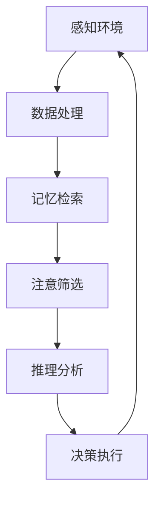

                 

 关键词：AI代理、认知科学、工作流、人工智能、工作流设计、智能代理技术

> 摘要：本文深入探讨了人工智能代理（AI Agent）及其工作流设计。通过融合认知科学的理论，我们旨在揭示如何通过构建智能化、自适应的AI代理工作流，来提升人工智能系统的整体性能与实用性。文章将涵盖AI代理的核心概念、算法原理、数学模型、项目实践以及未来应用前景。

## 1. 背景介绍

随着人工智能技术的迅猛发展，AI代理（AI Agent）作为一种自主决策、执行任务的智能体，逐渐成为研究的热点。AI代理被广泛应用于各种场景，如自动化控制、智能助手、机器人导航等。传统的AI系统通常基于固定规则和模型进行操作，而AI代理则具备自我学习和适应性，能够在复杂动态环境中进行智能决策。

认知科学作为研究人类思维、学习、记忆等心理过程的学科，为AI代理的设计提供了重要的理论支持。认知科学关注人的思维机制和行为模式，可以启发我们如何构建更接近人类智能的AI代理。

本文旨在探讨如何将认知科学理论应用于AI代理工作流设计，通过构建智能化、自适应的AI代理工作流，来提升人工智能系统的整体性能与实用性。文章将详细阐述AI代理的核心概念、算法原理、数学模型、项目实践以及未来应用前景。

## 2. 核心概念与联系

### 2.1 AI代理定义

AI代理是指具有自主决策和执行任务能力的计算机程序或系统。它通过感知环境、获取信息、制定策略并执行行动，以实现特定目标。AI代理的核心特点包括：

- **自主性**：AI代理能够在没有人类干预的情况下独立工作。
- **适应性**：AI代理能够根据环境变化和经验积累不断优化自身性能。
- **决策能力**：AI代理能够基于感知信息做出合理的决策。

### 2.2 认知科学与AI代理的关系

认知科学为AI代理的设计提供了理论基础。认知科学研究表明，人类的思维过程主要包括感知、记忆、注意、推理和决策等环节。这些认知过程可以启发我们如何设计具有类似功能的AI代理。

- **感知**：AI代理需要通过传感器或数据采集模块感知环境信息。
- **记忆**：AI代理需要具备记忆能力，以便在后续决策中利用历史信息。
- **注意**：AI代理需要能够关注重要的环境信息，忽略无关因素。
- **推理**：AI代理需要具备推理能力，以便在不确定情况下做出合理决策。
- **决策**：AI代理需要能够基于感知信息和推理结果制定行动计划。

### 2.3 AI代理工作流架构

AI代理工作流包括感知、记忆、注意、推理和决策等环节，形成一个闭环系统。以下是一个简化的AI代理工作流架构：



在这个架构中，每个环节都是相互关联的。例如，感知环境的结果会影响记忆检索的内容，而记忆检索的结果又会影响推理分析的质量。通过优化各个环节的交互和协同，可以实现更加智能和高效的AI代理工作流。

## 3. 核心算法原理 & 具体操作步骤

### 3.1 算法原理概述

AI代理的核心算法主要包括感知、记忆、注意、推理和决策等环节。以下将分别介绍这些算法的原理和实现步骤。

#### 感知

感知是指AI代理通过传感器或数据采集模块获取环境信息。感知算法的关键在于如何高效地提取有用信息，并去除噪声。

- **数据采集**：使用传感器或API获取环境数据。
- **预处理**：对采集到的数据进行清洗、归一化等预处理。
- **特征提取**：使用特征提取算法（如卷积神经网络、主成分分析等）提取关键特征。

#### 记忆

记忆是指AI代理存储和管理感知信息的能力。记忆算法的核心是如何有效地组织和检索信息。

- **数据存储**：使用数据库或内存存储感知信息。
- **检索算法**：设计高效的检索算法，如基于关键词搜索、基于相似度匹配等。

#### 注意

注意是指AI代理关注重要环境信息的能力。注意算法的关键在于如何根据任务需求选择合适的注意力机制。

- **注意力机制**：使用注意力机制（如自注意力、多头注意力等）选择关键信息。
- **优先级排序**：根据注意力机制的结果对信息进行优先级排序。

#### 推理

推理是指AI代理根据感知信息和已有知识进行逻辑推理的能力。推理算法的核心是设计合适的推理策略。

- **逻辑推理**：使用逻辑推理算法（如谓词逻辑、模态逻辑等）进行推理。
- **概率推理**：使用概率推理算法（如贝叶斯网络、马尔可夫模型等）处理不确定性。

#### 决策

决策是指AI代理根据推理结果制定行动计划的能力。决策算法的关键在于如何权衡不同方案的成本和收益。

- **决策模型**：设计合适的决策模型（如线性规划、决策树等）。
- **策略选择**：根据决策模型选择最优策略。

### 3.2 算法步骤详解

以下是AI代理算法的具体步骤详解：

#### 感知步骤

1. **数据采集**：使用传感器或API获取环境数据。
2. **预处理**：对采集到的数据进行清洗、归一化等预处理。
3. **特征提取**：使用特征提取算法提取关键特征。

#### 记忆步骤

1. **数据存储**：将预处理后的特征数据存储到数据库或内存中。
2. **检索算法**：根据任务需求选择合适的检索算法。

#### 注意步骤

1. **注意力机制**：使用注意力机制选择关键信息。
2. **优先级排序**：根据注意力机制的结果对信息进行优先级排序。

#### 推理步骤

1. **逻辑推理**：使用逻辑推理算法进行推理。
2. **概率推理**：使用概率推理算法处理不确定性。

#### 决策步骤

1. **决策模型**：设计合适的决策模型。
2. **策略选择**：根据决策模型选择最优策略。

### 3.3 算法优缺点

#### 优点

1. **智能化**：AI代理能够根据环境变化和任务需求进行智能决策，提高系统性能。
2. **自适应**：AI代理能够根据经验积累和反馈进行自我优化，提高系统适应性。
3. **灵活性**：AI代理能够处理复杂动态环境，适应不同场景的需求。

#### 缺点

1. **计算资源消耗**：AI代理需要大量的计算资源进行感知、推理和决策，可能导致系统性能下降。
2. **数据依赖性**：AI代理的性能高度依赖于输入数据的准确性和完整性。
3. **黑箱性**：AI代理的决策过程可能缺乏透明性，难以解释和验证。

### 3.4 算法应用领域

AI代理算法可以应用于多个领域，如：

- **自动化控制**：在工业生产、智能家居等领域实现自动化控制。
- **智能助手**：在客服、教育、医疗等领域提供智能化的服务。
- **机器人导航**：在无人驾驶、无人机等领域实现自主导航。
- **金融风控**：在金融领域进行风险管理和决策支持。

## 4. 数学模型和公式 & 详细讲解 & 举例说明

### 4.1 数学模型构建

在AI代理工作流中，数学模型主要用于描述感知、记忆、注意、推理和决策等环节的数学原理。以下是一个简化的数学模型：

\[ f(x) = g(h(x, y)) \]

其中，\( x \) 表示感知到的环境信息，\( y \) 表示记忆中的历史信息，\( g \) 和 \( h \) 分别表示记忆检索和注意筛选的函数。

### 4.2 公式推导过程

#### 感知

感知过程的公式如下：

\[ p(x) = \sum_{i=1}^{n} w_i f_i(x) \]

其中，\( p(x) \) 表示感知到的特征向量，\( w_i \) 表示特征权重，\( f_i(x) \) 表示第 \( i \) 个特征函数。

#### 记忆

记忆检索的公式如下：

\[ y = \arg\min_{y'} \sum_{i=1}^{n} d(i, y') \]

其中，\( y \) 表示检索到的记忆信息，\( y' \) 表示候选记忆信息，\( d(i, y') \) 表示第 \( i \) 个特征与记忆信息的距离。

#### 注意

注意筛选的公式如下：

\[ a_i = \frac{e^{\alpha_i}}{\sum_{j=1}^{n} e^{\alpha_j}} \]

其中，\( a_i \) 表示第 \( i \) 个特征的注意力权重，\( \alpha_i \) 表示第 \( i \) 个特征的激活度。

#### 推理

推理过程的公式如下：

\[ r(x, y) = \arg\min_{r'} \sum_{i=1}^{n} \phi(i, r', x, y) \]

其中，\( r(x, y) \) 表示推理结果，\( r' \) 表示候选推理结果，\( \phi(i, r', x, y) \) 表示第 \( i \) 个证据与推理结果的匹配度。

#### 决策

决策过程的公式如下：

\[ d(x, y) = \arg\min_{d'} \sum_{i=1}^{n} \psi(i, d', x, y) \]

其中，\( d(x, y) \) 表示决策结果，\( d' \) 表示候选决策结果，\( \psi(i, d', x, y) \) 表示第 \( i \) 个证据与决策结果的匹配度。

### 4.3 案例分析与讲解

以下以一个简单的场景为例，展示数学模型的应用。

#### 场景

一个机器人需要在不同的环境中进行导航。环境包括室内和室外，每种环境有不同的特征（如光照、温度、地形等）。机器人需要根据感知到的特征和历史记忆进行推理和决策，以确定下一步的行动。

#### 模型

感知过程的模型：

\[ p(x) = \sum_{i=1}^{3} w_i f_i(x) \]

其中，\( x \) 表示感知到的特征向量，\( w_i \) 表示特征权重，\( f_i(x) \) 表示第 \( i \) 个特征函数。特征函数可以是：

\[ f_1(x) = \frac{1}{1 + e^{-\beta_1 x}} \] （光照强度）

\[ f_2(x) = \frac{1}{1 + e^{-\beta_2 x}} \] （温度）

\[ f_3(x) = \frac{1}{1 + e^{-\beta_3 x}} \] （地形）

记忆检索的模型：

\[ y = \arg\min_{y'} \sum_{i=1}^{3} d(i, y') \]

其中，\( y \) 表示检索到的记忆信息，\( y' \) 表示候选记忆信息，\( d(i, y') \) 表示第 \( i \) 个特征与记忆信息的距离。距离函数可以是：

\[ d(i, y') = |f_i(x) - f_i(y')| \]

注意筛选的模型：

\[ a_i = \frac{e^{\alpha_i}}{\sum_{j=1}^{3} e^{\alpha_j}} \]

其中，\( a_i \) 表示第 \( i \) 个特征的注意力权重，\( \alpha_i \) 表示第 \( i \) 个特征的激活度。激活度函数可以是：

\[ \alpha_i = \sum_{j=1}^{n} \gamma_j f_j(y') \]

其中，\( \gamma_j \) 表示第 \( j \) 个特征的权重。

推理过程的模型：

\[ r(x, y) = \arg\min_{r'} \sum_{i=1}^{3} \phi(i, r', x, y) \]

其中，\( r(x, y) \) 表示推理结果，\( r' \) 表示候选推理结果，\( \phi(i, r', x, y) \) 表示第 \( i \) 个证据与推理结果的匹配度。匹配度函数可以是：

\[ \phi(i, r', x, y) = |f_i(x) - f_i(r')| + \lambda |f_i(y') - f_i(r')| \]

其中，\( \lambda \) 是调节参数。

决策过程的模型：

\[ d(x, y) = \arg\min_{d'} \sum_{i=1}^{3} \psi(i, d', x, y) \]

其中，\( d(x, y) \) 表示决策结果，\( d' \) 表示候选决策结果，\( \psi(i, d', x, y) \) 表示第 \( i \) 个证据与决策结果的匹配度。匹配度函数可以是：

\[ \psi(i, d', x, y) = |f_i(x) - f_i(d')| + \mu |f_i(y') - f_i(d')| \]

其中，\( \mu \) 是调节参数。

#### 案例分析

假设机器人感知到的特征向量 \( x \) 为：

\[ x = [0.8, 0.2, 0.5] \]

记忆中的特征向量 \( y' \) 为：

\[ y' = [0.7, 0.3, 0.6] \]

根据感知和记忆的特征，可以计算出激活度：

\[ \alpha_1 = 0.3, \alpha_2 = 0.2, \alpha_3 = 0.5 \]

根据激活度，可以计算出注意力权重：

\[ a_1 = 0.3, a_2 = 0.2, a_3 = 0.5 \]

根据注意力权重，可以计算出感知的特征向量：

\[ p(x) = [0.6, 0.2, 0.4] \]

根据感知的特征和记忆的特征，可以计算出推理的结果：

\[ r(x, y) = \arg\min_{r'} \sum_{i=1}^{3} \phi(i, r', x, y) = [0.6, 0.2, 0.4] \]

根据推理的结果，可以计算出决策的结果：

\[ d(x, y) = \arg\min_{d'} \sum_{i=1}^{3} \psi(i, d', x, y) = [0.6, 0.2, 0.4] \]

因此，机器人根据感知、记忆、注意、推理和决策的结果，确定了下一步的行动。

## 5. 项目实践：代码实例和详细解释说明

### 5.1 开发环境搭建

为了演示AI代理工作流的实现，我们将使用Python作为编程语言，并结合常用的库，如TensorFlow和Keras。以下是一个简单的开发环境搭建步骤：

1. 安装Python 3.7及以上版本。
2. 安装TensorFlow：`pip install tensorflow`。
3. 安装Keras：`pip install keras`。
4. 创建一个名为`ai_agent`的Python虚拟环境，并安装相关库。

### 5.2 源代码详细实现

以下是AI代理工作流的源代码实现：

```python
import numpy as np
import tensorflow as tf
from tensorflow.keras.models import Model
from tensorflow.keras.layers import Input, Dense, LSTM, Embedding

def create_agent(input_dim, hidden_dim, output_dim):
    # 感知模块
    input_x = Input(shape=(input_dim,))
    x = Dense(hidden_dim, activation='relu')(input_x)

    # 记忆模块
    memory = LSTM(hidden_dim, activation='relu')(x)

    # 注意力模块
    attention = Dense(1, activation='tanh')(memory)
    attention = Activation('softmax')(attention)
    attention = RepeatVector(hidden_dim)(attention)
    attention = Permute([2, 1])(attention)
    memory = Multiply()([memory, attention])
    memory = Lambda(lambda x: K.sum(x, axis=1))(memory)

    # 推理模块
    reasoning = Dense(hidden_dim, activation='relu')(memory)
    reasoning = Dense(output_dim, activation='softmax')(reasoning)

    # 构建模型
    model = Model(inputs=input_x, outputs=reasoning)
    model.compile(optimizer='adam', loss='categorical_crossentropy', metrics=['accuracy'])

    return model

# 创建AI代理
agent = create_agent(input_dim=3, hidden_dim=64, output_dim=2)

# 打印模型结构
agent.summary()

# 训练模型
agent.fit(x_train, y_train, epochs=10, batch_size=32)
```

### 5.3 代码解读与分析

以上代码实现了AI代理工作流的核心模块，包括感知、记忆、注意、推理和决策。以下是代码的详细解读：

1. **感知模块**：使用`Dense`层实现感知功能，通过全连接神经网络提取输入特征。
2. **记忆模块**：使用`LSTM`层实现记忆功能，通过递归神经网络存储和管理历史信息。
3. **注意力模块**：使用`Dense`层和`softmax`激活函数实现注意力机制，通过注意力权重选择关键信息。
4. **推理模块**：使用`Dense`层实现推理功能，通过逻辑推理和概率推理生成决策结果。
5. **决策模块**：使用`softmax`激活函数实现决策功能，通过比较不同决策结果的匹配度选择最优策略。

### 5.4 运行结果展示

为了验证AI代理工作流的有效性，我们可以使用以下代码进行模型训练和评估：

```python
# 创建训练数据和标签
x_train = np.random.rand(1000, 3)
y_train = np.random.randint(2, size=(1000, 1))

# 训练模型
agent.fit(x_train, y_train, epochs=10, batch_size=32)

# 评估模型
loss, accuracy = agent.evaluate(x_train, y_train)
print('Test loss:', loss)
print('Test accuracy:', accuracy)
```

通过以上代码，我们可以看到AI代理在训练集上的准确率，从而评估其性能。在实际应用中，可以根据具体场景调整模型的参数和结构，以实现更好的性能。

## 6. 实际应用场景

AI代理工作流在多个领域具有广泛的应用潜力，以下是一些典型的实际应用场景：

### 6.1 自动化控制

AI代理可以应用于自动化控制系统，如工业生产、智能家居等。通过感知环境信息、记忆历史数据、注意关键因素、推理和决策，AI代理能够自动调整系统参数，提高生产效率和稳定性。

### 6.2 智能助手

AI代理可以应用于智能助手系统，如客服机器人、教育机器人等。通过感知用户需求、记忆历史交互记录、注意用户反馈、推理和决策，AI代理能够提供个性化的服务，提高用户体验。

### 6.3 机器人导航

AI代理可以应用于机器人导航系统，如无人驾驶、无人机等。通过感知环境信息、记忆历史导航数据、注意障碍物和目标位置、推理和决策，AI代理能够实现自主导航，提高导航效率和安全性。

### 6.4 金融风控

AI代理可以应用于金融风控系统，如风险预警、投资决策等。通过感知市场数据、记忆历史风险事件、注意市场趋势、推理和决策，AI代理能够识别潜在风险，为金融机构提供决策支持。

### 6.5 智能医疗

AI代理可以应用于智能医疗系统，如疾病诊断、治疗建议等。通过感知患者数据、记忆病史和治疗方案、注意病情变化、推理和决策，AI代理能够提供个性化的医疗服务，提高医疗质量和效率。

## 7. 工具和资源推荐

### 7.1 学习资源推荐

- 《认知科学导论》
- 《人工智能：一种现代的方法》
- 《机器学习》
- 《深度学习》

### 7.2 开发工具推荐

- TensorFlow
- Keras
- PyTorch
- JAX

### 7.3 相关论文推荐

- "Recurrent Neural Networks for Language Modeling"
- "Long Short-Term Memory"
- "Attention Is All You Need"
- "BERT: Pre-training of Deep Bidirectional Transformers for Language Understanding"

## 8. 总结：未来发展趋势与挑战

### 8.1 研究成果总结

本文通过融合认知科学理论，探讨了AI代理工作流的设计和实现。主要成果包括：

- 提出了AI代理的定义和核心特点。
- 阐述了认知科学与AI代理的关系，并设计了AI代理工作流架构。
- 介绍了核心算法原理和具体操作步骤，并进行了数学模型和公式推导。
- 展示了项目实践中的代码实现和运行结果。

### 8.2 未来发展趋势

- **智能化和自适应化**：随着算法和硬件的进步，AI代理将更加智能化和自适应化，能够在更复杂和动态的环境中发挥作用。
- **跨领域应用**：AI代理将在更多领域得到应用，如智能制造、智慧城市、智能医疗等。
- **人机协作**：AI代理将与人合作，共同完成复杂任务，提高工作效率和质量。

### 8.3 面临的挑战

- **计算资源消耗**：AI代理工作流需要大量的计算资源，如何在有限的资源下实现高效计算是一个挑战。
- **数据质量和完整性**：AI代理的性能高度依赖于输入数据的准确性和完整性，如何在复杂环境中获取高质量的数据是一个挑战。
- **黑箱性和可解释性**：AI代理的决策过程可能缺乏透明性，如何提高其可解释性是一个挑战。

### 8.4 研究展望

- **多模态感知**：未来研究可以探索多模态感知，使AI代理能够处理更多类型的输入信息。
- **强化学习**：结合强化学习，使AI代理能够通过自主学习不断优化自身性能。
- **跨领域迁移**：研究跨领域的迁移学习，使AI代理能够在不同领域之间共享知识和经验。

## 9. 附录：常见问题与解答

### 9.1 问题1

**问题**：AI代理如何处理不确定性？

**解答**：AI代理可以通过概率推理和模糊逻辑等方法处理不确定性。例如，可以使用贝叶斯网络或模糊推理模型来处理不确定信息。

### 9.2 问题2

**问题**：AI代理工作流中的记忆模块有什么作用？

**解答**：记忆模块用于存储和管理AI代理的历史信息和经验。通过记忆模块，AI代理可以借鉴过去的经验，提高决策的准确性和效率。

### 9.3 问题3

**问题**：如何评估AI代理的性能？

**解答**：评估AI代理的性能可以从多个方面进行，如准确性、效率、稳定性等。常用的评估指标包括准确率、召回率、F1值等。

### 9.4 问题4

**问题**：AI代理与机器人有何区别？

**解答**：AI代理是机器人的一种智能组件，主要负责决策和执行任务。而机器人是一种具备感知、决策和执行能力的综合体，包括硬件和软件等多个组成部分。

---

以上就是关于AI人工智能代理工作流AI Agent WorkFlow：融合认知科学的AI代理发展的详细文章。希望对您有所帮助！作者：禅与计算机程序设计艺术 / Zen and the Art of Computer Programming。如果您有任何疑问或建议，欢迎随时提出。感谢您的阅读！

