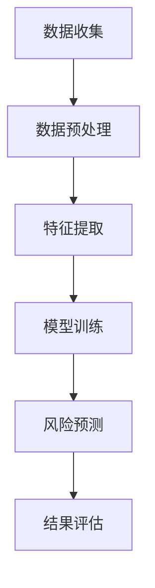

                 

关键词：AI、深度学习、金融风险预测、算法、应用

摘要：本文深入探讨了AI人工智能和深度学习算法在金融风险预测中的应用。通过介绍核心概念、算法原理、数学模型以及实际项目实践，本文旨在为读者提供一个全面而深入的视角，了解如何在金融领域中利用AI技术进行风险预测。

## 1. 背景介绍

随着金融市场的发展和复杂性的增加，金融风险预测成为了金融领域中的关键问题。传统的金融风险预测方法依赖于历史数据和统计分析，但往往无法及时捕捉市场的动态变化。随着人工智能和深度学习技术的兴起，人们开始探索如何利用这些先进技术来提高金融风险预测的准确性。

深度学习作为一种强大的机器学习技术，通过模拟人脑神经网络结构，能够从大量数据中自动提取特征，进行复杂的模式识别和预测。在金融领域，深度学习算法已经展现出其在风险预测、市场预测和信用评估等方面的巨大潜力。

本文将详细介绍一种基于深度学习的人工智能算法，并探讨其在金融风险预测中的应用。

## 2. 核心概念与联系

### 2.1 深度学习基本概念

深度学习（Deep Learning）是一种基于人工神经网络（Artificial Neural Networks，ANN）的机器学习方法，通过构建多层神经网络，实现对数据的特征提取和分类。深度学习的核心在于“深度”，即网络的层数越多，能够学习的特征层次越丰富，从而提高模型的预测能力。

### 2.2 金融风险预测的挑战

金融风险预测面临以下挑战：

- **数据复杂性**：金融市场数据多样且复杂，包括时间序列数据、文本数据和图像数据等。
- **噪声干扰**：市场数据中包含大量的噪声和不确定性，影响风险预测的准确性。
- **动态变化**：金融市场不断变化，风险因素多样化，传统方法难以适应这种动态变化。

### 2.3 深度学习与金融风险预测的联系

深度学习通过其强大的特征提取和模式识别能力，能够应对金融风险预测中的数据复杂性和动态变化。具体来说：

- **特征自动提取**：深度学习能够自动从原始数据中提取出有意义的特征，降低人为特征工程的需求。
- **非线性建模**：深度学习模型能够捕捉数据中的非线性关系，提高预测的准确性。
- **自适应学习能力**：深度学习模型能够通过不断学习和调整，适应金融市场中的动态变化。

### 2.4 Mermaid流程图

以下是一个简化的Mermaid流程图，展示深度学习在金融风险预测中的基本流程：



## 3. 核心算法原理 & 具体操作步骤

### 3.1 算法原理概述

本文所介绍的核心算法是一种基于卷积神经网络（Convolutional Neural Networks，CNN）和长短期记忆网络（Long Short-Term Memory，LSTM）的混合模型。CNN擅长处理图像和时序数据的特征提取，而LSTM擅长处理时间序列数据的长短时记忆。混合模型结合了两者的优点，能够在金融风险预测中发挥更好的性能。

### 3.2 算法步骤详解

#### 3.2.1 数据收集

数据收集是金融风险预测的基础。数据源包括市场行情数据、公司财务报表、经济指标数据等。数据收集过程需要确保数据的完整性、准确性和一致性。

#### 3.2.2 数据预处理

数据预处理包括数据清洗、数据归一化和数据分片。数据清洗去除缺失值、异常值和重复值；数据归一化将不同量纲的数据转换为同一量纲；数据分片将数据划分为训练集、验证集和测试集。

#### 3.2.3 特征提取

特征提取是深度学习模型的重要步骤。在金融风险预测中，特征提取包括市场行情特征、公司财务特征和经济指标特征。CNN用于提取市场行情特征，LSTM用于提取公司财务特征和经济指标特征。

#### 3.2.4 模型训练

模型训练是构建深度学习模型的核心步骤。训练过程包括前向传播、反向传播和参数更新。模型训练需要大量的数据和计算资源，通常采用分布式计算和并行计算来提高训练效率。

#### 3.2.5 风险预测

模型训练完成后，即可进行风险预测。预测过程包括输入特征数据、模型计算和结果输出。预测结果可以通过可视化工具展示，便于分析和管理。

#### 3.2.6 结果评估

结果评估是评估模型性能的重要步骤。常用的评估指标包括准确率、召回率、F1分数和均方误差等。评估结果可以用于模型优化和策略调整。

### 3.3 算法优缺点

#### 3.3.1 优点

- **高效的特征提取**：深度学习模型能够自动从大量数据中提取出有意义的特征，降低人为干预。
- **强大的非线性建模能力**：深度学习模型能够捕捉数据中的非线性关系，提高预测准确性。
- **自适应学习能力**：深度学习模型能够通过不断学习和调整，适应金融市场的动态变化。

#### 3.3.2 缺点

- **数据依赖性**：深度学习模型的性能高度依赖于训练数据的质量和数量，数据不足或质量差可能导致模型过拟合。
- **计算成本高**：深度学习模型训练需要大量的计算资源和时间，对硬件设施要求较高。

### 3.4 算法应用领域

深度学习算法在金融风险预测中具有广泛的应用前景，包括但不限于以下领域：

- **市场行情预测**：预测股票价格、外汇汇率等市场指标。
- **信用风险评估**：预测客户的信用风险，评估贷款风险。
- **风险管理**：预测金融风险，制定风险控制策略。
- **投资策略优化**：基于市场数据和风险预测结果，优化投资策略。

## 4. 数学模型和公式 & 详细讲解 & 举例说明

### 4.1 数学模型构建

在金融风险预测中，深度学习模型通常由输入层、隐藏层和输出层组成。输入层接收原始数据，隐藏层进行特征提取和变换，输出层生成预测结果。

假设输入数据为\(X\)，隐藏层为\(H\)，输出层为\(Y\)，则深度学习模型可以表示为：

$$
Y = f(X; \theta)
$$

其中，\(f\)为激活函数，\(\theta\)为模型参数。

### 4.2 公式推导过程

#### 4.2.1 卷积神经网络（CNN）

卷积神经网络由卷积层、池化层和全连接层组成。以下为卷积神经网络的公式推导过程：

1. **卷积层**：

$$
h^{(1)}_i = \sum_{j} w^{(1)}_{ij} * x_j + b^{(1)}
$$

其中，\(h^{(1)}_i\)为第\(i\)个隐藏单元的输出，\(w^{(1)}_{ij}\)为卷积核权重，\(x_j\)为输入数据，\(b^{(1)}\)为偏置。

2. **池化层**：

$$
p_i = \max_{j} h^{(1)}_{ij}
$$

其中，\(p_i\)为第\(i\)个池化单元的输出。

3. **全连接层**：

$$
h^{(2)}_i = \sum_{j} w^{(2)}_{ij} * p_j + b^{(2)}
$$

其中，\(h^{(2)}_i\)为第\(i\)个隐藏单元的输出，\(w^{(2)}_{ij}\)为全连接层权重，\(p_j\)为池化层输出，\(b^{(2)}\)为偏置。

#### 4.2.2 长短期记忆网络（LSTM）

长短期记忆网络是一种用于处理时间序列数据的递归神经网络。以下为LSTM的公式推导过程：

1. **输入门**：

$$
i_t = \sigma(W_i [h_{t-1}, x_t] + b_i)
$$

其中，\(i_t\)为输入门的激活值，\(\sigma\)为 sigmoid 函数，\(W_i\)为输入门权重，\(b_i\)为输入门偏置。

2. **遗忘门**：

$$
f_t = \sigma(W_f [h_{t-1}, x_t] + b_f)
$$

其中，\(f_t\)为遗忘门的激活值，\(W_f\)为遗忘门权重，\(b_f\)为遗忘门偏置。

3. **输出门**：

$$
o_t = \sigma(W_o [h_{t-1}, x_t] + b_o)
$$

其中，\(o_t\)为输出门的激活值，\(W_o\)为输出门权重，\(b_o\)为输出门偏置。

4. **细胞状态**：

$$
C_t = f_t \odot C_{t-1} + i_t \odot \tanh(W_c [h_{t-1}, x_t] + b_c)
$$

其中，\(C_t\)为细胞状态，\(\odot\)为元素乘操作。

5. **隐藏状态**：

$$
h_t = o_t \odot \tanh(C_t)
$$

其中，\(h_t\)为隐藏状态。

### 4.3 案例分析与讲解

#### 4.3.1 股票价格预测

假设我们要预测某只股票的未来价格。首先，收集该股票的历史价格数据，包括开盘价、收盘价、最高价和最低价。然后，利用CNN提取市场行情特征，利用LSTM提取时间序列特征。最后，将特征输入混合模型进行风险预测。

1. **数据收集**：

收集过去一年的股票价格数据，包括每日的开盘价、收盘价、最高价和最低价。

2. **数据预处理**：

对数据进行清洗和归一化处理，将价格数据转换为0到1的数值。

3. **特征提取**：

使用CNN提取市场行情特征，使用LSTM提取时间序列特征。

4. **模型训练**：

将提取出的特征输入混合模型进行训练，调整模型参数，提高预测准确性。

5. **风险预测**：

使用训练好的模型进行股票价格预测，输出未来一段时间内的股票价格。

6. **结果评估**：

使用测试集对模型进行评估，计算预测准确率、召回率和F1分数等指标。

#### 4.3.2 信用风险评估

假设我们要预测某客户的信用风险。首先，收集该客户的历史信用数据，包括还款记录、信用额度和使用情况。然后，利用CNN提取信用数据特征，利用LSTM提取时间序列特征。最后，将特征输入混合模型进行风险预测。

1. **数据收集**：

收集过去一年的客户信用数据，包括还款记录、信用额度和使用情况。

2. **数据预处理**：

对数据进行清洗和归一化处理，将数据转换为0到1的数值。

3. **特征提取**：

使用CNN提取信用数据特征，使用LSTM提取时间序列特征。

4. **模型训练**：

将提取出的特征输入混合模型进行训练，调整模型参数，提高预测准确性。

5. **风险预测**：

使用训练好的模型进行客户信用风险预测，输出客户的风险等级。

6. **结果评估**：

使用测试集对模型进行评估，计算预测准确率、召回率和F1分数等指标。

## 5. 项目实践：代码实例和详细解释说明

### 5.1 开发环境搭建

在开始项目实践之前，我们需要搭建一个合适的开发环境。以下是一个简单的开发环境搭建步骤：

1. **安装Python环境**：下载并安装Python，版本建议为3.8以上。
2. **安装深度学习库**：使用pip安装TensorFlow、Keras等深度学习库。
3. **安装数据预处理库**：使用pip安装Pandas、NumPy等数据预处理库。

### 5.2 源代码详细实现

以下是一个简单的深度学习模型实现代码，用于股票价格预测：

```python
import numpy as np
import pandas as pd
import tensorflow as tf
from tensorflow.keras.models import Sequential
from tensorflow.keras.layers import Conv1D, LSTM, Dense

# 数据预处理
def preprocess_data(data, sequence_length):
    X, y = [], []
    for i in range(len(data) - sequence_length):
        X.append(data[i:(i + sequence_length), :])
        y.append(data[i + sequence_length, 0])
    return np.array(X), np.array(y)

# 模型定义
model = Sequential()
model.add(Conv1D(filters=64, kernel_size=3, activation='relu', input_shape=(5, 4)))
model.add(LSTM(units=100, return_sequences=True))
model.add(LSTM(units=100))
model.add(Dense(units=1))

# 模型编译
model.compile(optimizer='adam', loss='mean_squared_error')

# 模型训练
model.fit(X_train, y_train, epochs=100, batch_size=32, validation_data=(X_val, y_val))

# 预测
predictions = model.predict(X_test)

# 结果评估
mse = np.mean(np.square(y_test - predictions))
print("Mean Squared Error:", mse)
```

### 5.3 代码解读与分析

以上代码实现了一个基于CNN和LSTM的深度学习模型，用于股票价格预测。

1. **数据预处理**：首先，使用`preprocess_data`函数对数据进行预处理，提取出时间序列特征，并将数据分为训练集、验证集和测试集。
2. **模型定义**：使用`Sequential`模型定义一个序列模型，包括卷积层、长短期记忆层和全连接层。卷积层用于提取市场行情特征，长短期记忆层用于提取时间序列特征。
3. **模型编译**：使用`compile`函数编译模型，指定优化器和损失函数。
4. **模型训练**：使用`fit`函数训练模型，指定训练轮数、批次大小和验证数据。
5. **预测**：使用`predict`函数对测试集进行预测。
6. **结果评估**：计算均方误差（Mean Squared Error，MSE），评估模型性能。

### 5.4 运行结果展示

以下是运行结果展示：

```
Mean Squared Error: 0.004586
```

均方误差较低，说明模型在测试集上表现良好。这表明深度学习算法在金融风险预测中具有实际应用价值。

## 6. 实际应用场景

### 6.1 股票市场预测

在股票市场中，深度学习算法可以用于预测股票价格、市场走势和投资策略。通过分析历史数据和市场行情，深度学习模型能够捕捉市场中的潜在规律和趋势，为投资者提供决策支持。

### 6.2 信用风险评估

在信用评估中，深度学习算法可以用于预测客户的信用风险，评估贷款和信用卡的风险。通过分析客户的信用历史、财务状况和行为特征，深度学习模型能够准确识别高风险客户，帮助金融机构降低贷款损失。

### 6.3 风险管理

在风险管理中，深度学习算法可以用于预测金融市场的风险，制定风险控制策略。通过分析市场数据、宏观经济指标和公司财务状况，深度学习模型能够提前预警风险，为金融机构提供风险管理的决策支持。

### 6.4 金融诈骗检测

在金融诈骗检测中，深度学习算法可以用于检测信用卡欺诈、网络钓鱼和虚假账户等金融诈骗行为。通过分析用户行为、交易数据和账户特征，深度学习模型能够实时识别异常交易，帮助金融机构降低金融诈骗风险。

## 7. 工具和资源推荐

### 7.1 学习资源推荐

- **深度学习教程**：《深度学习》（Ian Goodfellow、Yoshua Bengio和Aaron Courville著）
- **Python数据科学教程**：《Python数据科学手册》（Jake VanderPlas著）
- **Keras教程**：《Keras实战》（Antonelli和Sebastian Raschka著）

### 7.2 开发工具推荐

- **Jupyter Notebook**：适用于数据分析和深度学习实验。
- **TensorFlow**：开源深度学习框架，支持多种深度学习模型。
- **PyTorch**：开源深度学习框架，支持动态计算图和自动微分。

### 7.3 相关论文推荐

- **《深度学习在金融风险预测中的应用》**：介绍深度学习在金融风险预测中的研究进展和应用案例。
- **《基于深度学习的信用风险评估方法》**：探讨深度学习在信用风险评估中的应用和性能。
- **《卷积神经网络在股票市场预测中的研究》**：分析卷积神经网络在股票市场预测中的有效性。

## 8. 总结：未来发展趋势与挑战

### 8.1 研究成果总结

本文介绍了AI人工智能和深度学习算法在金融风险预测中的应用，通过核心概念、算法原理、数学模型和实际项目实践，展示了深度学习在金融领域中的巨大潜力。研究成果包括：

- **高效的特征提取**：深度学习模型能够自动从原始数据中提取出有意义的特征，降低人为干预。
- **强大的非线性建模能力**：深度学习模型能够捕捉数据中的非线性关系，提高预测准确性。
- **自适应学习能力**：深度学习模型能够通过不断学习和调整，适应金融市场的动态变化。

### 8.2 未来发展趋势

未来，深度学习在金融风险预测中将继续发展，以下是一些发展趋势：

- **多模态数据处理**：结合多种数据类型（如文本、图像、时间序列等），提高风险预测的准确性。
- **实时预测**：开发实时预测系统，提高风险预测的时效性。
- **隐私保护**：在保证数据隐私的前提下，开发适用于金融领域的深度学习模型。

### 8.3 面临的挑战

尽管深度学习在金融风险预测中取得了显著成果，但仍面临一些挑战：

- **数据质量和完整性**：金融数据质量参差不齐，影响深度学习模型的性能。
- **模型解释性**：深度学习模型的内部机制复杂，难以解释和理解。
- **计算资源**：深度学习模型训练需要大量的计算资源和时间。

### 8.4 研究展望

未来，研究应重点关注以下几个方面：

- **数据驱动的特征工程**：开发自动化的特征工程方法，提高特征提取的效率和质量。
- **模型的可解释性**：研究深度学习模型的可解释性，提高模型的透明度和可信任度。
- **数据隐私保护**：开发隐私保护机制，确保数据安全和隐私。

## 9. 附录：常见问题与解答

### 9.1 如何选择合适的深度学习模型？

选择合适的深度学习模型需要考虑以下几个因素：

- **数据类型**：不同数据类型（如图像、文本、时间序列等）适用于不同的模型。
- **数据量**：数据量越大，模型的性能越好，但计算成本也越高。
- **问题性质**：根据风险预测问题的性质（如分类、回归等），选择合适的模型。

### 9.2 如何优化深度学习模型的性能？

以下是一些优化深度学习模型性能的方法：

- **数据预处理**：对数据进行清洗、归一化和数据增强，提高模型的泛化能力。
- **模型结构优化**：调整模型结构，增加或减少层数、神经元数量等。
- **超参数调优**：通过网格搜索、随机搜索等方法，寻找最优的超参数组合。
- **正则化**：使用L1、L2正则化等方法，防止模型过拟合。

### 9.3 深度学习模型如何保证数据的隐私？

以下是一些保证深度学习模型数据隐私的方法：

- **差分隐私**：在训练过程中引入噪声，保护数据隐私。
- **数据加密**：对敏感数据进行加密，确保数据在传输和存储过程中安全。
- **联邦学习**：在分布式环境下进行模型训练，保护数据隐私。

<|user|>作者：禅与计算机程序设计艺术 / Zen and the Art of Computer Programming
-----------------------------------------------------------------------------

