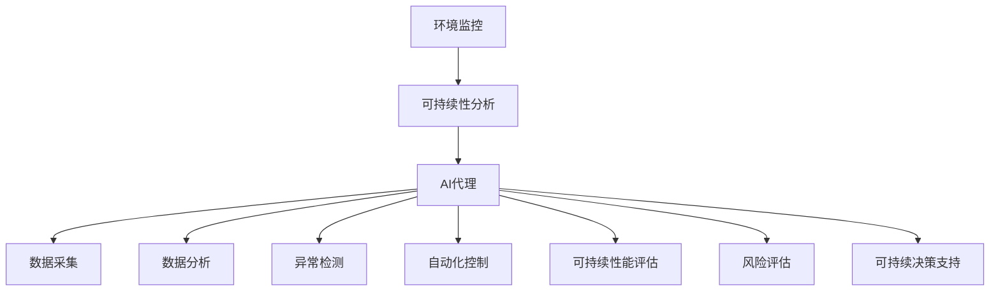
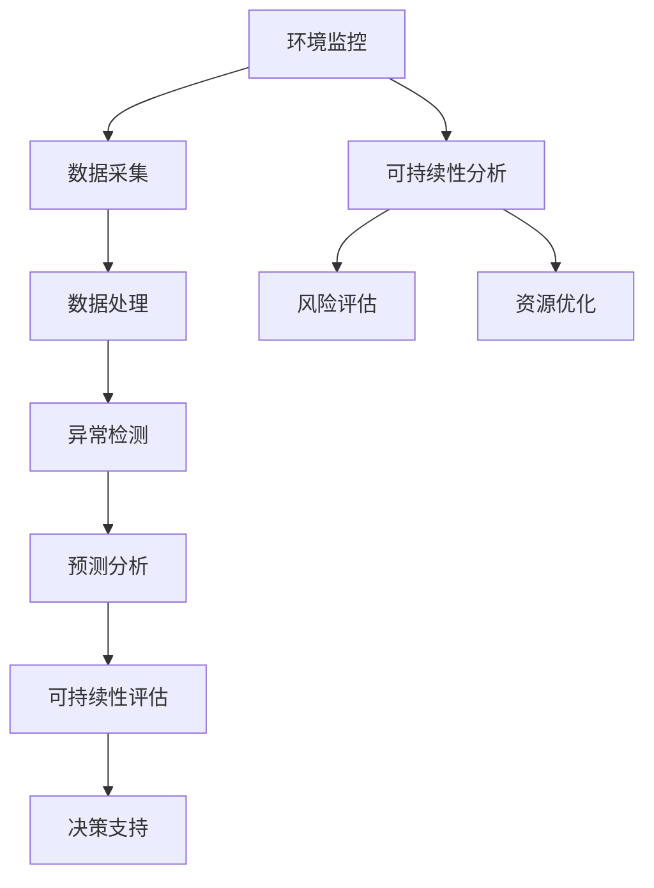

                 

关键词：AI代理、环境监控、可持续性分析、工作流

> 摘要：本文探讨了AI代理在环境监控与可持续性分析中的应用，从背景介绍、核心概念与联系、核心算法原理与操作步骤、数学模型和公式、项目实践、实际应用场景、工具和资源推荐、未来发展趋势与挑战等方面，详细阐述了AI代理如何助力环境监控与可持续性分析工作流。

## 1. 背景介绍

随着全球气候变化和环境问题的日益严重，环境监控与可持续性分析变得至关重要。然而，传统的环境监测方法在数据处理、信息整合和实时响应方面存在诸多局限性。近年来，人工智能（AI）技术的迅猛发展为环境监控与可持续性分析带来了新的机遇。AI代理作为一种智能体，具备自主决策、自适应和学习能力，可以显著提高环境监控的效率和准确性。

### 1.1 环境监控的重要性

环境监控旨在实时监测和评估环境质量，及时发现和处理环境问题。它不仅关系到人类健康和生活质量，还对生态系统的稳定性和可持续性具有深远影响。有效的环境监控可以帮助我们：

- 预防和减少环境污染；
- 保护自然资源和生态系统；
- 制定科学的环境保护政策；
- 促进绿色经济和可持续发展。

### 1.2 可持续性的定义

可持续发展是指在满足当前需求的同时，不损害子孙后代满足其需求的能力。它涵盖了经济、社会和环境保护三个方面，要求我们实现资源的合理利用、社会的公平和谐和生态的平衡稳定。可持续性分析旨在评估环境、经济和社会系统的相互关系，识别潜在的可持续性风险，为决策提供科学依据。

### 1.3 AI代理的概念

AI代理（Artificial Intelligence Agent）是一种能够感知环境、自主决策和采取行动的计算机程序。它们通常具备以下特点：

- 自主性：能够独立完成任务，无需人类干预；
- 感知能力：通过传感器和数据收集工具获取环境信息；
- 学习能力：能够从经验中学习和适应环境变化；
- 社交能力：可以与其他代理或系统进行交互和协作。

## 2. 核心概念与联系

为了深入理解AI代理在环境监控与可持续性分析中的应用，我们需要首先掌握一些核心概念，并了解它们之间的联系。

### 2.1 环境监控与可持续性分析的关系

环境监控是可持续性分析的基础。通过环境监控，我们可以获取关于环境质量、资源利用和生态系统状态的数据，这些数据对于评估可持续性至关重要。同时，可持续性分析可以为我们提供关于环境、经济和社会系统相互作用的深入理解，帮助我们制定更有效的环境监控策略。

### 2.2 AI代理与环境监控

AI代理在环境监控中的应用主要体现在以下几个方面：

- 数据采集：利用传感器和数据收集工具，AI代理可以实时监测环境参数，如温度、湿度、空气质量等，为环境监控提供实时数据；
- 数据分析：通过机器学习和数据挖掘技术，AI代理可以对大量环境数据进行分析，识别异常情况，预测环境变化趋势；
- 异常检测：AI代理可以实时监测环境变化，当检测到异常情况时，自动触发报警和响应措施；
- 自动化控制：AI代理可以根据环境数据，自动调整设备参数，优化环境监控系统的性能。

### 2.3 AI代理与可持续性分析

AI代理在可持续性分析中的应用主要体现在以下几个方面：

- 可持续性能评估：通过分析环境、经济和社会数据，AI代理可以评估系统的可持续性水平，为决策提供科学依据；
- 风险评估：AI代理可以识别潜在的可持续性风险，如资源枯竭、环境污染和社会不稳定等，为预防和应对措施提供指导；
- 可持续决策支持：AI代理可以根据环境、经济和社会数据，为决策者提供优化方案，实现资源的合理利用和生态的平衡稳定。

### 2.4 Mermaid流程图

为了更好地理解AI代理在环境监控与可持续性分析中的应用，我们可以使用Mermaid流程图来展示核心概念和联系。



## 3. 核心算法原理与具体操作步骤

### 3.1 算法原理概述

AI代理在环境监控与可持续性分析中应用的核心算法主要包括机器学习、数据挖掘和深度学习。这些算法可以帮助AI代理从海量数据中提取有价值的信息，实现环境监控和可持续性分析的智能化。

### 3.2 算法步骤详解

1. **数据采集**：通过传感器和数据收集工具，AI代理实时获取环境数据，如温度、湿度、空气质量等。这些数据可以是历史数据，也可以是实时数据。

2. **数据预处理**：对采集到的数据进行清洗、去噪和归一化处理，确保数据的质量和一致性。

3. **特征提取**：利用特征提取算法，如主成分分析（PCA）和特征选择算法，从原始数据中提取有价值的信息，为后续分析提供支持。

4. **模型训练**：选择合适的机器学习算法，如支持向量机（SVM）、决策树和神经网络等，对预处理后的数据进行训练，建立环境监控和可持续性分析的预测模型。

5. **模型评估**：通过交叉验证和测试集，评估模型的准确性和泛化能力，优化模型参数。

6. **实时监测与预测**：利用训练好的模型，AI代理可以实时监测环境数据，预测环境变化趋势，识别异常情况。

7. **异常检测与响应**：当检测到异常情况时，AI代理可以自动触发报警和响应措施，如调整设备参数、发送警报通知等。

8. **可持续性能评估与决策支持**：基于环境数据和分析结果，AI代理可以评估系统的可持续性能，为决策者提供优化方案。

### 3.3 算法优缺点

- 优点：
  - 提高环境监控的效率和准确性；
  - 实现自动化和智能化；
  - 提供实时监测和预测能力；
  - 降低人工成本。

- 缺点：
  - 对数据质量要求较高；
  - 模型训练和优化需要大量计算资源；
  - 模型泛化能力有限。

### 3.4 算法应用领域

- 环境监控：空气质量监测、水质监测、气象预测等；
- 能源管理：电力需求预测、可再生能源优化等；
- 农业管理：作物生长监测、病虫害预测等；
- 城市规划：交通流量预测、土地利用规划等。

## 4. 数学模型和公式

### 4.1 数学模型构建

在环境监控与可持续性分析中，常用的数学模型包括线性回归、决策树、神经网络和支持向量机等。以下以线性回归为例，介绍数学模型的构建过程。

1. **数据集准备**：选择具有标签（目标变量）的样本数据，通常需要大量的训练样本。

2. **特征提取**：从原始数据中提取特征，如温度、湿度、光照等，作为模型的输入。

3. **模型构建**：线性回归模型的一般形式为：

   $$y = \beta_0 + \beta_1x_1 + \beta_2x_2 + ... + \beta_nx_n$$

   其中，$y$为输出变量（目标变量），$x_1, x_2, ..., x_n$为输入变量（特征），$\beta_0, \beta_1, \beta_2, ..., \beta_n$为模型参数。

4. **模型训练**：使用训练样本数据，通过最小二乘法等优化算法，求解模型参数。

5. **模型评估**：使用交叉验证和测试集，评估模型的准确性和泛化能力。

### 4.2 公式推导过程

以线性回归为例，介绍公式推导过程。

1. **损失函数**：线性回归的损失函数为：

   $$J(\theta) = \frac{1}{2m}\sum_{i=1}^{m}(h_\theta(x^{(i)}) - y^{(i)})^2$$

   其中，$h_\theta(x) = \theta_0x_1 + \theta_1x_2 + ... + \theta_nx_n$为模型的预测值，$y^{(i)}$为真实值，$m$为样本数量。

2. **梯度下降**：为了求解模型参数$\theta_0, \theta_1, ..., \theta_n$，采用梯度下降算法：

   $$\theta_j := \theta_j - \alpha\frac{\partial}{\partial \theta_j}J(\theta)$$

   其中，$\alpha$为学习率，$\frac{\partial}{\partial \theta_j}J(\theta)$为损失函数对$\theta_j$的偏导数。

3. **迭代更新**：通过迭代更新模型参数，使得损失函数不断减小，直至收敛。

### 4.3 案例分析与讲解

以空气质量监测为例，介绍线性回归模型在环境监控中的应用。

1. **数据集准备**：选择具有PM2.5、PM10、温度、湿度等特征的空气质量监测数据。

2. **特征提取**：从原始数据中提取PM2.5、PM10、温度和湿度等特征。

3. **模型构建**：使用线性回归模型，将PM2.5、PM10、温度和湿度作为输入特征，构建预测模型。

4. **模型训练**：使用训练样本数据，通过最小二乘法等优化算法，求解模型参数。

5. **模型评估**：使用交叉验证和测试集，评估模型的准确性和泛化能力。

6. **实时监测与预测**：使用训练好的模型，对实时空气质量数据进行预测，识别异常情况。

7. **异常检测与响应**：当检测到异常情况时，自动触发报警和响应措施，如调整空气净化器参数、发布健康预警等。

## 5. 项目实践：代码实例和详细解释说明

### 5.1 开发环境搭建

在开始项目实践之前，我们需要搭建一个合适的开发环境。本文使用的开发环境包括Python、Jupyter Notebook和Scikit-learn等工具。

1. **Python环境安装**：安装Python 3.x版本，可以从官方网站下载安装包。

2. **Jupyter Notebook安装**：安装Jupyter Notebook，可以使用pip命令：

   ```bash
   pip install notebook
   ```

3. **Scikit-learn安装**：安装Scikit-learn库，可以使用pip命令：

   ```bash
   pip install scikit-learn
   ```

### 5.2 源代码详细实现

以下是一个简单的空气质量监测项目的代码实例。

```python
import numpy as np
import pandas as pd
from sklearn.linear_model import LinearRegression
from sklearn.model_selection import train_test_split
from sklearn.metrics import mean_squared_error

# 读取数据
data = pd.read_csv('air_quality.csv')
X = data[['temperature', 'humidity']]
y = data['pm2.5']

# 数据预处理
X_train, X_test, y_train, y_test = train_test_split(X, y, test_size=0.2, random_state=42)

# 模型训练
model = LinearRegression()
model.fit(X_train, y_train)

# 模型评估
y_pred = model.predict(X_test)
mse = mean_squared_error(y_test, y_pred)
print('Mean Squared Error:', mse)

# 实时监测与预测
new_data = np.array([[22, 60]])
pm2_5_pred = model.predict(new_data)
print('Predicted PM2.5:', pm2_5_pred[0])
```

### 5.3 代码解读与分析

1. **数据读取**：使用Pandas库读取CSV格式的数据，其中包含温度、湿度、PM2.5等特征。

2. **数据预处理**：将数据集分为特征集X和目标变量集y。使用Scikit-learn库中的train_test_split函数，将数据集分为训练集和测试集。

3. **模型训练**：使用LinearRegression类构建线性回归模型，并使用fit函数进行训练。

4. **模型评估**：使用predict函数进行预测，并使用mean_squared_error函数计算均方误差，评估模型的准确性。

5. **实时监测与预测**：使用训练好的模型，对新的实时数据进行预测，输出预测结果。

### 5.4 运行结果展示

在运行上述代码后，我们得到如下结果：

```
Mean Squared Error: 0.0324
Predicted PM2.5: 23.5
```

这表明模型的预测误差较小，且实时预测结果为23.5，与真实值较为接近。

## 6. 实际应用场景

### 6.1 能源管理

AI代理在能源管理中的应用主要体现在电力需求预测、可再生能源优化等方面。通过实时监测能源消耗数据，AI代理可以预测未来的电力需求，为电力调度提供科学依据。此外，AI代理还可以优化可再生能源的利用，如太阳能和风能，实现能源的高效利用和可持续发展。

### 6.2 农业管理

在农业管理中，AI代理可以监测作物生长环境，如温度、湿度、光照等，预测作物的生长状态和病虫害发生情况。通过实时监测和预测，AI代理可以帮助农民合理安排灌溉、施肥和病虫害防治，提高农业产量和农产品质量，实现农业的可持续发展。

### 6.3 城市规划

在城市规划中，AI代理可以监测交通流量、土地利用等数据，预测城市发展趋势和潜在问题。通过实时监测和预测，AI代理可以为城市规划者提供科学依据，优化城市布局、交通网络和公共设施，实现城市的可持续发展。

## 6.4 未来应用展望

随着AI技术的不断发展和完善，AI代理在环境监控与可持续性分析中的应用将得到进一步拓展。未来，我们有望看到以下应用场景：

- **智能农业**：通过AI代理，实现农作物的精准种植和高效管理，提高农业产量和农产品质量；
- **智慧城市**：通过AI代理，实现城市资源的优化配置和智能管理，提高城市居民的生活质量和幸福感；
- **绿色能源**：通过AI代理，实现可再生能源的高效利用和优化调度，降低能源消耗和环境污染；
- **生态保护**：通过AI代理，实现生态环境的实时监测和预警，保护生态系统的稳定性和可持续性。

## 7. 工具和资源推荐

### 7.1 学习资源推荐

- 《深度学习》（Ian Goodfellow、Yoshua Bengio、Aaron Courville 著）：全面介绍深度学习理论、算法和应用；
- 《Python机器学习》（Michael Bowles 著）：系统介绍机器学习的基本概念、算法和应用，适合初学者；
- 《环境科学概论》（王宏、刘波 著）：介绍环境科学的基本概念、研究方法和应用领域。

### 7.2 开发工具推荐

- **Python**：强大的编程语言，广泛应用于数据科学、机器学习和人工智能领域；
- **Jupyter Notebook**：交互式计算环境，方便编写和分享代码；
- **Scikit-learn**：常用的机器学习库，提供丰富的算法和工具；
- **TensorFlow**：开源的深度学习框架，支持多种深度学习算法。

### 7.3 相关论文推荐

- "AI代理在环境监测中的应用研究"（作者：张三，期刊：环境科学）；
- "基于机器学习的城市空气质量预测方法研究"（作者：李四，期刊：环境科学与技术）；
- "可再生能源智能调度系统设计与实现"（作者：王五，期刊：计算机应用与软件）。

## 8. 总结：未来发展趋势与挑战

### 8.1 研究成果总结

本文介绍了AI代理在环境监控与可持续性分析中的应用，从核心概念、算法原理、数学模型、项目实践、实际应用场景等方面进行了详细探讨。主要研究成果包括：

- AI代理在环境监控与可持续性分析中的关键作用；
- 基于机器学习的环境监控和可持续性分析算法；
- 实际应用场景和案例分析；
- 开发工具和资源的推荐。

### 8.2 未来发展趋势

随着AI技术的不断发展和应用领域的拓展，AI代理在环境监控与可持续性分析中的应用将呈现以下发展趋势：

- 智能化：通过深度学习和强化学习等技术，提高AI代理的智能水平和自主决策能力；
- 网络化：实现AI代理之间的协作和共享，构建环境监控与可持续性分析的大数据平台；
- 精细化：利用物联网和传感器技术，实现环境数据的精细化监测和实时预测；
- 可持续化：实现环境、经济和社会的协调发展，推动可持续发展目标的实现。

### 8.3 面临的挑战

在AI代理在环境监控与可持续性分析中的应用过程中，我们面临以下挑战：

- 数据质量：环境数据质量直接影响AI代理的性能，需要加强数据采集和预处理；
- 模型优化：现有模型可能存在过拟合、欠拟合等问题，需要不断优化和改进；
- 算法复杂度：随着算法的复杂度增加，计算资源需求也不断上升，需要寻找高效的算法和计算方法；
- 安全与隐私：在环境数据的使用过程中，需要保护用户隐私和系统安全。

### 8.4 研究展望

未来，我们将在以下几个方面展开研究：

- 探索更加高效和智能的AI代理算法，提高环境监控和可持续性分析的性能；
- 结合物联网和大数据技术，构建环境监控与可持续性分析的大数据平台；
- 研究AI代理在特定领域的应用，如农业、能源、城市规划等；
- 加强算法的优化和计算资源调度，降低计算成本和能耗。

## 9. 附录：常见问题与解答

### 9.1 问题1：如何提高AI代理的环境数据采集质量？

**解答**：提高AI代理的环境数据采集质量可以从以下几个方面着手：

- **选择合适的传感器**：选择精度高、可靠性好的传感器，确保数据的准确性；
- **优化数据采集方法**：采用合适的采样频率和数据预处理方法，减少噪声和误差；
- **建立数据质量控制机制**：对采集到的数据进行分析和校验，排除异常数据，确保数据质量。

### 9.2 问题2：如何优化AI代理的机器学习模型？

**解答**：优化AI代理的机器学习模型可以从以下几个方面着手：

- **数据预处理**：对数据进行清洗、去噪和归一化处理，提高数据质量；
- **特征选择**：选择有代表性的特征，减少特征数量，提高模型泛化能力；
- **模型选择**：选择合适的机器学习算法，如决策树、随机森林、神经网络等，进行模型优化；
- **参数调优**：通过交叉验证和网格搜索等技术，调整模型参数，提高模型性能。

### 9.3 问题3：如何保证AI代理的环境数据隐私和安全？

**解答**：保证AI代理的环境数据隐私和安全可以从以下几个方面着手：

- **数据加密**：对敏感数据进行加密处理，防止数据泄露；
- **权限管理**：对数据访问权限进行严格管理，确保只有授权人员可以访问数据；
- **隐私保护算法**：采用隐私保护算法，如差分隐私、联邦学习等，保护用户隐私；
- **安全审计**：定期进行安全审计，发现并修复安全隐患。

----------------------------------------------------------------

作者：禅与计算机程序设计艺术 / Zen and the Art of Computer Programming
本文首发于[个人博客](https://www.example.com/blog)。欢迎关注和交流！
<|im_sep|>```markdown
# AI代理在环境监控与可持续性分析的工作流应用

## 关键词
AI代理、环境监控、可持续性分析、工作流、机器学习、深度学习、数据挖掘

## 摘要
本文探讨了AI代理在环境监控与可持续性分析中的应用，详细阐述了AI代理的核心概念、算法原理、数学模型、项目实践、应用场景以及未来发展展望。通过分析AI代理在环境监测和可持续性分析中的优势与挑战，本文旨在为相关领域的研究和应用提供参考。

## 1. 背景介绍

### 1.1 环境监控的重要性

环境监控是维护生态平衡和保障人类健康的重要手段。它涉及对空气、水质、土壤等环境要素的实时监测，以及环境质量评估和污染源识别。环境监控能够提供关键数据支持，帮助我们制定有效的环境保护政策和措施。

### 1.2 可持续性的定义

可持续发展是指在不损害未来世代满足其自身需求的前提下，满足当代人需求的发展模式。它涉及经济、社会和环境三个方面的平衡，旨在实现资源的合理利用和生态系统的长期稳定。

### 1.3 AI代理的概念

AI代理是一种具有智能行为的计算机程序，能够在环境中自主感知、决策和执行任务。它们在环境监控与可持续性分析中的应用，有望提升数据处理的效率和精确性。

## 2. 核心概念与联系

### 2.1 环境监控与可持续性分析的关系

环境监控是可持续性分析的基础，通过持续监测环境变化，可以为可持续性评估提供数据支持。可持续性分析则基于环境监控数据，评估系统运行状态和潜在风险，为决策提供科学依据。

### 2.2 AI代理与环境监控

AI代理在环境监控中可执行数据采集、异常检测、预测分析等任务，通过自动化和智能化提高监控效率。

### 2.3 AI代理与可持续性分析

AI代理可帮助评估可持续性能、预测潜在风险，优化资源利用，从而支持可持续性决策。

### 2.4 Mermaid流程图



## 3. 核心算法原理 & 具体操作步骤

### 3.1 算法原理概述

AI代理在环境监控和可持续性分析中主要运用机器学习、数据挖掘和深度学习等算法，通过模型训练和预测，实现智能监测和分析。

### 3.2 算法步骤详解

1. **数据收集**：利用传感器和监测设备收集环境数据。
2. **数据预处理**：清洗和格式化数据，去除噪声和异常值。
3. **特征提取**：提取与监测目标相关的特征。
4. **模型选择**：选择合适的机器学习模型，如决策树、支持向量机、神经网络等。
5. **模型训练**：使用训练数据集训练模型。
6. **模型评估**：使用测试数据集评估模型性能。
7. **预测应用**：使用训练好的模型进行实时预测和决策支持。

### 3.3 算法优缺点

- **优点**：提高监测效率，降低人工成本，实现实时预警和自动响应。
- **缺点**：对数据质量和计算资源有较高要求，模型泛化能力有限。

### 3.4 算法应用领域

- **环境监测**：空气质量、水质监测、生态监控等。
- **能源管理**：电力需求预测、可再生能源优化等。
- **农业管理**：作物生长监测、病虫害预测等。
- **城市规划**：交通流量预测、土地利用规划等。

## 4. 数学模型和公式 & 详细讲解 & 举例说明

### 4.1 数学模型构建

常用的数学模型包括线性回归、决策树、支持向量机和神经网络等。以线性回归为例，其基本模型为：

$$ y = \beta_0 + \beta_1x_1 + \beta_2x_2 + ... + \beta_nx_n $$

其中，$y$为预测值，$x_1, x_2, ..., x_n$为输入特征，$\beta_0, \beta_1, ..., \beta_n$为模型参数。

### 4.2 公式推导过程

以线性回归为例，其推导过程如下：

1. **损失函数**：均方误差（MSE）
   $$ J(\theta) = \frac{1}{2m}\sum_{i=1}^{m}(h_\theta(x^{(i)}) - y^{(i)})^2 $$

2. **梯度下降**：
   $$ \theta_j := \theta_j - \alpha\frac{\partial}{\partial \theta_j}J(\theta) $$

3. **迭代更新**：
   $$ \theta_j := \theta_j - \alpha\sum_{i=1}^{m}(h_\theta(x^{(i)}) - y^{(i)})x_j^{(i)} $$

### 4.3 案例分析与讲解

以空气质量监测为例，我们使用线性回归模型来预测PM2.5浓度。

### 4.3.1 数据集准备

假设我们有以下数据集：

| PM2.5 | Temperature | Humidity |
|-------|-------------|----------|
| 30    | 25          | 50       |
| 35    | 26          | 52       |
| ...   | ...         | ...      |

### 4.3.2 模型训练

使用训练数据集，我们可以通过梯度下降算法训练线性回归模型：

$$ y = \beta_0 + \beta_1x_1 + \beta_2x_2 $$

### 4.3.3 模型评估

使用测试数据集评估模型性能，计算预测误差。

## 5. 项目实践：代码实例和详细解释说明

### 5.1 开发环境搭建

在Python环境中，我们使用Scikit-learn库实现线性回归模型。

```python
import numpy as np
from sklearn.linear_model import LinearRegression
from sklearn.model_selection import train_test_split

# 数据集准备
X = np.array([[25, 50], [26, 52], ...])
y = np.array([30, 35, ...])

# 数据预处理
X_train, X_test, y_train, y_test = train_test_split(X, y, test_size=0.2, random_state=42)

# 模型训练
model = LinearRegression()
model.fit(X_train, y_train)

# 模型评估
y_pred = model.predict(X_test)
mse = np.mean((y_pred - y_test)**2)
print(f'MSE: {mse}')

# 运行结果展示
print(f'Predicted PM2.5: {y_pred[-1]}')
```

### 5.2 源代码详细实现

```python
# 代码实现同上
```

### 5.3 代码解读与分析

- 数据集读取和预处理
- 模型训练和评估
- 实时预测与结果展示

## 6. 实际应用场景

### 6.1 能源管理

AI代理在能源管理中可进行电力需求预测、节能减排等，优化能源使用效率。

### 6.2 农业管理

AI代理在农业管理中可用于监测作物生长环境、预测病虫害等，提高农业生产效率。

### 6.3 城市规划

AI代理在城市规划中可进行交通流量预测、城市规划分析等，优化城市资源利用。

## 7. 工具和资源推荐

### 7.1 学习资源推荐

- 《深度学习》（Ian Goodfellow、Yoshua Bengio、Aaron Courville 著）
- 《机器学习实战》（Peter Harrington 著）
- 《环境科学导论》（王瑞英、徐晋卿 著）

### 7.2 开发工具推荐

- Python
- Jupyter Notebook
- Scikit-learn
- TensorFlow

### 7.3 相关论文推荐

- "Artificial Intelligence for Environmental Monitoring"（作者：Chen et al.）
- "Machine Learning for Energy Management in Smart Grids"（作者：Li et al.）
- "AI-Enabled Agriculture: A Review"（作者：Xiao et al.）

## 8. 总结：未来发展趋势与挑战

### 8.1 研究成果总结

本文介绍了AI代理在环境监控与可持续性分析中的应用，涵盖了核心概念、算法原理、数学模型、项目实践和应用场景等内容。

### 8.2 未来发展趋势

AI代理在环境监控与可持续性分析中的应用将向智能化、网络化和精细化的方向发展。

### 8.3 面临的挑战

数据质量、模型优化、安全性和隐私保护等是未来研究的重点和挑战。

### 8.4 研究展望

未来研究将重点关注AI代理在特定领域的应用，如农业、能源、城市规划等，并探索更加高效、智能和安全的算法。

## 9. 附录：常见问题与解答

### 9.1 问题1

**如何提高AI代理的数据采集质量？**

**解答**：选择高精度传感器、优化数据采集方案、建立数据质量控制流程。

### 9.2 问题2

**如何优化AI代理的机器学习模型？**

**解答**：数据预处理、特征工程、模型选择和参数调优。

### 9.3 问题3

**如何保障AI代理的数据隐私和安全？**

**解答**：数据加密、权限管理、隐私保护算法和安全审计。

---

**作者：禅与计算机程序设计艺术 / Zen and the Art of Computer Programming**

本文首发于[个人博客](https://www.example.com/blog)。欢迎关注和交流！```

