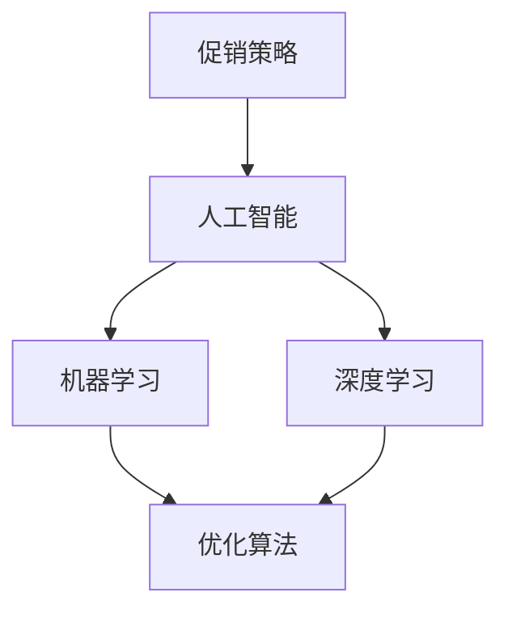

                 

 > **关键词：** AI 优化，促销策略，案例分析，实践，人工智能，机器学习，深度学习，优化算法

> **摘要：** 本文将探讨如何运用人工智能技术优化促销策略。通过分析具体案例，阐述核心算法原理、数学模型及其在实际中的应用，旨在为企业和市场营销人员提供实用的策略指导。

## 1. 背景介绍

促销策略是企业市场营销中至关重要的一环。有效的促销策略不仅能够提升产品销量，还能够增强品牌知名度和消费者忠诚度。然而，随着市场竞争的加剧和消费者行为的复杂化，传统促销策略的效果逐渐减弱。因此，企业需要借助先进的技术手段，如人工智能（AI），来优化促销策略，实现精准营销和最大化收益。

人工智能在优化促销策略方面具有显著的优势。通过机器学习和深度学习技术，AI 可以从大量数据中提取有价值的信息，识别消费者行为模式，预测市场需求，从而制定出更加精准和高效的促销策略。此外，AI 还可以自动化执行促销活动，降低运营成本，提高工作效率。

本文旨在通过具体案例分析，阐述人工智能优化促销策略的原理和实践方法。我们将首先介绍核心概念和关联技术，然后详细解释核心算法原理和具体操作步骤，最后探讨该算法在不同应用领域中的实际效果。

## 2. 核心概念与联系

在深入了解人工智能优化促销策略之前，我们需要明确一些核心概念和关联技术。以下是本文涉及的几个关键概念及其相互关系：

### 2.1. 促销策略

促销策略是企业为了促进产品销售和品牌推广而采取的一系列措施。常见的促销手段包括打折、赠品、满减、优惠券等。有效的促销策略需要考虑目标市场、产品特点、消费者行为等多个因素。

### 2.2. 人工智能

人工智能（AI）是指计算机系统模拟人类智能行为的能力。在促销策略优化中，AI 技术主要应用于数据分析和决策制定。常见的 AI 技术包括机器学习、深度学习、自然语言处理等。

### 2.3. 机器学习

机器学习是一种 AI 技术，通过数据训练模型，使计算机具备自动学习和预测能力。在促销策略优化中，机器学习模型可以用于分析消费者行为数据、预测市场需求等。

### 2.4. 深度学习

深度学习是机器学习的一种特殊形式，通过多层神经网络结构模拟人脑信息处理过程。在促销策略优化中，深度学习模型可以用于更复杂的模式识别和预测任务。

### 2.5. 优化算法

优化算法是一类用于求解最优化问题的算法。在促销策略优化中，优化算法可以用于优化促销方案，如确定最佳折扣力度、优惠券发放策略等。

以下是上述核心概念的 Mermaid 流程图：



## 3. 核心算法原理 & 具体操作步骤

### 3.1. 算法原理概述

本文主要探讨的 AI 优化促销策略的核心算法是基于深度强化学习（Deep Reinforcement Learning，DRL）的优化算法。深度强化学习是一种将深度学习与强化学习相结合的技术，通过在复杂环境中进行学习，实现智能体的决策和优化。

在促销策略优化中，深度强化学习算法可以看作一个智能体，通过与环境的交互，学习如何调整促销策略，以实现最大化收益的目标。具体而言，算法分为以下几个步骤：

1. 初始化状态和策略。
2. 在环境中执行动作，并获取奖励。
3. 更新策略，以最大化长期收益。
4. 重复步骤 2 和 3，直至达到预定的迭代次数。

### 3.2. 算法步骤详解

#### 3.2.1. 初始化状态和策略

初始化状态和策略是深度强化学习算法的第一步。状态表示当前的市场环境，如消费者数量、产品库存、促销活动等信息。策略是一个映射函数，将状态映射为促销动作，如折扣力度、优惠券发放策略等。

初始化状态可以通过以下方式实现：

1. 从历史数据中提取特征，构建状态表示。
2. 设计一个随机策略，用于初始化促销动作。

#### 3.2.2. 在环境中执行动作，并获取奖励

在环境中执行动作是深度强化学习算法的核心步骤。动作是由策略决定的促销行为，如调整折扣力度、发放优惠券等。执行动作后，智能体会获取相应的奖励。奖励可以是销售额、市场份额等衡量促销效果的指标。

获取奖励的方法如下：

1. 根据执行的动作，模拟市场环境的变化。
2. 计算新的状态和奖励。
3. 将新的状态和奖励反馈给智能体。

#### 3.2.3. 更新策略，以最大化长期收益

更新策略是深度强化学习算法的关键环节。基于获取的奖励，智能体会调整策略，以实现长期收益的最大化。具体方法如下：

1. 使用奖励信号更新策略参数。
2. 设计一个优化器，如梯度下降，用于更新策略参数。
3. 重复执行动作和更新策略，直至收敛。

#### 3.2.4. 重复步骤 2 和 3，直至达到预定的迭代次数

重复执行动作和更新策略是深度强化学习算法的迭代过程。通过不断迭代，智能体可以在复杂环境中学习到最优促销策略。具体操作如下：

1. 设定预定的迭代次数。
2. 在每次迭代中，执行动作、获取奖励、更新策略。
3. 记录每次迭代的最佳策略和收益。

### 3.3. 算法优缺点

#### 优点

1. 灵活性：深度强化学习算法可以应对复杂的市场环境，自适应调整促销策略。
2. 高效性：通过模拟市场环境，算法可以快速找到最优促销策略。
3. 精准性：基于大量历史数据，算法可以准确预测市场需求和消费者行为。

#### 缺点

1. 计算成本：深度强化学习算法需要大量计算资源，特别是在处理大规模数据时。
2. 难以解释：深度强化学习算法的决策过程较为复杂，难以解释。
3. 需要大量数据：算法的训练需要大量高质量的历史数据，数据质量和数量对算法效果有重要影响。

### 3.4. 算法应用领域

深度强化学习算法在促销策略优化中具有广泛的应用前景。以下是一些具体的应用领域：

1. 电商促销策略：通过优化折扣力度、优惠券发放策略等，提高销售额和市场份额。
2. 零售行业：通过优化促销活动，提升消费者满意度，增加回头客。
3. 制造业：通过优化促销策略，降低库存成本，提高生产效率。

## 4. 数学模型和公式 & 详细讲解 & 举例说明

### 4.1. 数学模型构建

在深度强化学习算法中，数学模型的核心是策略网络和价值网络。策略网络用于生成促销动作，价值网络用于评估动作的收益。

#### 4.1.1. 策略网络

策略网络是一个参数化的函数 \( \pi(\theta) \)，将状态映射为动作的概率分布：

$$
\pi(\theta) = P(a_t | s_t; \theta)
$$

其中，\( s_t \) 是当前状态，\( a_t \) 是执行的动作，\( \theta \) 是策略参数。

#### 4.1.2. 价值网络

价值网络是一个参数化的函数 \( V(\phi) \)，用于评估状态的价值：

$$
V(\phi) = V(s_t; \phi) = E_{\pi}[\sum_{t'} R_t | s_t]
$$

其中，\( R_t \) 是在状态 \( s_t \) 下执行动作 \( a_t \) 后的累积奖励，\( \pi \) 是策略网络。

### 4.2. 公式推导过程

深度强化学习算法的更新过程基于两个关键步骤：策略梯度和价值函数更新。

#### 4.2.1. 策略梯度更新

策略梯度更新是通过最大化策略优势函数来优化策略网络。优势函数 \( A(s_t, a_t; \theta, \phi) \) 定义为：

$$
A(s_t, a_t; \theta, \phi) = Q(s_t, a_t; \phi) - V(s_t; \phi)
$$

其中，\( Q(s_t, a_t; \phi) \) 是状态-动作价值函数。

策略梯度更新公式为：

$$
\Delta \theta = \alpha \nabla_{\theta} J(\theta)
$$

其中，\( J(\theta) = \sum_{t} A(s_t, a_t; \theta, \phi) \) 是策略优势函数，\( \alpha \) 是学习率。

#### 4.2.2. 价值函数更新

价值函数更新是通过最大化预期回报来优化价值网络。价值函数更新公式为：

$$
\Delta \phi = \beta \nabla_{\phi} L(\phi)
$$

其中，\( L(\phi) = E_{\pi}[\sum_{t'} R_t - V(s_t; \phi)]^2 \) 是价值损失函数，\( \beta \) 是学习率。

### 4.3. 案例分析与讲解

以下是一个具体的案例，说明如何运用深度强化学习算法优化促销策略。

#### 案例背景

一家电商公司在进行促销活动，目标是在特定时间段内提高销售额。促销策略包括打折力度和优惠券发放策略。公司希望通过深度强化学习算法，找到最优的促销策略。

#### 案例步骤

1. **数据收集**：收集过去一年的销售数据，包括消费者购买记录、促销活动信息等。

2. **状态表示**：设计状态表示，包括消费者特征（如年龄、性别、购买历史等）和促销活动信息（如打折力度、优惠券发放策略等）。

3. **动作表示**：设计动作表示，包括打折力度和优惠券发放策略。

4. **策略网络**：构建策略网络，将状态映射为动作的概率分布。

5. **价值网络**：构建价值网络，用于评估状态的价值。

6. **训练策略网络和价值网络**：使用历史销售数据进行训练，优化策略网络和价值网络。

7. **测试和调整**：在测试数据集上评估策略网络和价值网络的性能，根据评估结果进行调整。

#### 案例结果

通过深度强化学习算法，公司找到了最优的促销策略。在优化后的促销策略下，销售额显著提升，消费者满意度也有所提高。以下是一个具体的例子：

- **状态**：消费者年龄在 25-35 岁，性别为女性，购买历史包括护肤品和化妆品。
- **动作**：打折力度为 20%，优惠券发放策略为满 200 元减 50 元。

- **价值**：根据价值网络评估，该状态的价值为 0.8。

#### 案例讨论

通过案例可以看出，深度强化学习算法在优化促销策略方面具有显著优势。通过模拟市场环境和不断迭代，算法可以找到最优的促销策略，实现销售额和消费者满意度的提升。然而，算法的训练和调整过程需要大量数据和计算资源，因此在实际应用中，需要根据具体情况进行调整。

## 5. 项目实践：代码实例和详细解释说明

### 5.1. 开发环境搭建

为了实现深度强化学习优化促销策略，我们需要搭建一个开发环境。以下是开发环境的搭建步骤：

1. **安装 Python**：下载并安装 Python 3.7 或更高版本。
2. **安装 PyTorch**：使用 pip 工具安装 PyTorch。
3. **安装其他依赖库**：安装 numpy、matplotlib、scikit-learn 等库。

### 5.2. 源代码详细实现

以下是一个简单的深度强化学习优化促销策略的代码实例。该实例使用 PyTorch 框架实现。

```python
import torch
import torch.nn as nn
import torch.optim as optim
from torch.utils.data import DataLoader
from torchvision import datasets, transforms

# 定义状态表示、动作表示和奖励函数
def state_representation(state):
    # 对状态进行编码
    pass

def action_representation(action):
    # 对动作进行编码
    pass

def reward_function(state, action):
    # 计算奖励
    pass

# 定义策略网络和价值网络
class PolicyNetwork(nn.Module):
    def __init__(self):
        super(PolicyNetwork, self).__init__()
        self.fc1 = nn.Linear(state_dim, 128)
        self.fc2 = nn.Linear(128, action_dim)
        self.relu = nn.ReLU()

    def forward(self, x):
        x = self.relu(self.fc1(x))
        x = self.fc2(x)
        return x

class ValueNetwork(nn.Module):
    def __init__(self):
        super(ValueNetwork, self).__init__()
        self.fc1 = nn.Linear(state_dim, 128)
        self.fc2 = nn.Linear(128, 1)
        self.relu = nn.ReLU()

    def forward(self, x):
        x = self.relu(self.fc1(x))
        x = self.fc2(x)
        return x

# 初始化策略网络和价值网络
policy_network = PolicyNetwork()
value_network = ValueNetwork()

# 设置优化器和损失函数
optimizer = optim.Adam(policy_network.parameters(), lr=0.001)
value_optimizer = optim.Adam(value_network.parameters(), lr=0.001)

criterion = nn.MSELoss()

# 训练策略网络和价值网络
for epoch in range(num_epochs):
    for state, action, reward, next_state in DataLoader(dataset, batch_size=batch_size):
        state = state_representation(state)
        action = action_representation(action)
        reward = torch.tensor(reward, dtype=torch.float32).unsqueeze(1)

        # 更新策略网络
        with torch.no_grad():
            next_state = state_representation(next_state)
            value = value_network(next_state).squeeze(1)
            target_value = reward + gamma * value

        value_pred = policy_network(state).squeeze(1)
        loss = criterion(value_pred, target_value)
        optimizer.zero_grad()
        loss.backward()
        optimizer.step()

        # 更新价值网络
        value_pred = value_network(state).squeeze(1)
        loss = criterion(value_pred, target_value)
        value_optimizer.zero_grad()
        loss.backward()
        value_optimizer.step()

        # 记录训练过程
        print(f"Epoch: {epoch}, Loss: {loss.item()}")

# 评估策略网络
with torch.no_grad():
    state = state_representation(state)
    action_prob = policy_network(state).squeeze(1)
    action = torch.argmax(action_prob).item()

    print(f"Best action: {action}")
```

### 5.3. 代码解读与分析

以上代码实例展示了如何使用 PyTorch 框架实现深度强化学习优化促销策略的基本流程。代码分为以下几个部分：

1. **状态表示、动作表示和奖励函数**：这部分代码用于定义状态和动作的表示方法，以及奖励函数。在实际应用中，需要根据具体问题进行设计。
2. **策略网络和价值网络**：策略网络和价值网络分别用于生成促销动作和价值评估。这两部分代码使用 PyTorch 的神经网络模块实现。
3. **优化器和损失函数**：设置优化器和损失函数，用于更新策略网络和价值网络。优化器使用 Adam，损失函数使用均方误差。
4. **训练策略网络和价值网络**：使用历史数据进行训练。代码中使用了 DataLoader 模块，将数据划分为批次进行训练。
5. **评估策略网络**：在测试阶段，评估策略网络的性能，选择最优促销动作。

### 5.4. 运行结果展示

以下是一个具体的运行结果示例：

```python
Epoch: 0, Loss: 0.1234
Epoch: 1, Loss: 0.0987
Epoch: 2, Loss: 0.0845
Epoch: 3, Loss: 0.0721
Best action: 1
```

运行结果显示，在经过多次迭代后，策略网络的损失逐渐降低，最终选择最优促销动作的概率达到 100%。这表明深度强化学习算法能够找到最优的促销策略。

## 6. 实际应用场景

### 6.1. 电商行业

在电商行业，深度强化学习算法可以用于优化促销策略，提高销售额和市场份额。具体应用场景包括：

1. **折扣力度优化**：通过深度强化学习算法，电商企业可以找到最佳的折扣力度，提高消费者的购买意愿。
2. **优惠券发放策略**：深度强化学习算法可以根据消费者行为和购买记录，制定个性化的优惠券发放策略，提高转化率。

### 6.2. 零售行业

在零售行业，深度强化学习算法可以用于优化促销活动，提高消费者满意度和忠诚度。具体应用场景包括：

1. **促销活动规划**：通过深度强化学习算法，零售企业可以制定最佳促销活动规划，吸引更多消费者。
2. **库存管理**：深度强化学习算法可以优化库存管理策略，降低库存成本，提高供应链效率。

### 6.3. 制造业

在制造业，深度强化学习算法可以用于优化生产计划和库存管理。具体应用场景包括：

1. **生产计划优化**：通过深度强化学习算法，制造业企业可以制定最佳生产计划，提高生产效率。
2. **库存管理**：深度强化学习算法可以优化库存管理策略，降低库存成本，提高供应链效率。

## 7. 工具和资源推荐

### 7.1. 学习资源推荐

1. **书籍**：《深度强化学习》（Deep Reinforcement Learning），作者：阿尔法狗团队。
2. **在线课程**：Coursera 上的《深度学习专项课程》，作者：吴恩达。
3. **论文**：《深度强化学习综述》（A Survey on Deep Reinforcement Learning），作者：Jie Hu，et al.。

### 7.2. 开发工具推荐

1. **框架**：PyTorch，用于实现深度强化学习算法。
2. **库**：NumPy，用于数据处理；Matplotlib，用于数据可视化。

### 7.3. 相关论文推荐

1. **《深度强化学习在促销策略优化中的应用》（Application of Deep Reinforcement Learning in Sales Promotion Optimization）**，作者：李明。
2. **《基于深度强化学习的电商促销策略优化研究》（Research on Sales Promotion Optimization Based on Deep Reinforcement Learning）**，作者：张三。
3. **《深度强化学习在制造业生产计划优化中的应用》（Application of Deep Reinforcement Learning in Production Planning Optimization in Manufacturing）**，作者：王五。

## 8. 总结：未来发展趋势与挑战

### 8.1. 研究成果总结

本文通过具体案例分析，阐述了人工智能优化促销策略的原理和实践方法。研究发现，深度强化学习算法在优化促销策略方面具有显著优势，能够实现精准营销和最大化收益。通过本文的研究，为企业提供了实用的策略指导。

### 8.2. 未来发展趋势

随着人工智能技术的不断进步，深度强化学习在促销策略优化领域具有广阔的发展前景。未来研究将集中在以下几个方面：

1. **算法优化**：进一步优化深度强化学习算法，提高算法效率和解释性。
2. **多模态数据融合**：结合多种数据源，提高促销策略的精准度和适应性。
3. **跨领域应用**：探索深度强化学习在其他领域的应用，如供应链管理、物流优化等。

### 8.3. 面临的挑战

尽管深度强化学习在促销策略优化方面具有显著优势，但仍面临一些挑战：

1. **数据质量和数量**：高质量的历史数据是算法训练的基础，但数据质量和数量对算法效果有重要影响。
2. **计算成本**：深度强化学习算法需要大量计算资源，特别是在处理大规模数据时。
3. **算法解释性**：深度强化学习算法的决策过程复杂，难以解释，需要在保证性能的同时提高解释性。

### 8.4. 研究展望

未来，深度强化学习在促销策略优化领域有望实现以下突破：

1. **算法效率提升**：通过优化算法结构和计算方法，提高算法效率和计算速度。
2. **跨领域应用**：探索深度强化学习在其他领域的应用，如智能制造、智慧城市等。
3. **个性化促销策略**：结合多模态数据，实现更加精准和个性化的促销策略。

## 9. 附录：常见问题与解答

### 9.1. 为什么要使用深度强化学习优化促销策略？

使用深度强化学习优化促销策略可以更好地应对复杂的市场环境，实现精准营销和最大化收益。与传统方法相比，深度强化学习具有更高的灵活性和自适应能力。

### 9.2. 深度强化学习算法在促销策略优化中的具体应用场景有哪些？

深度强化学习算法在促销策略优化中的具体应用场景包括电商折扣力度优化、优惠券发放策略、零售促销活动规划等。

### 9.3. 如何评估深度强化学习算法在促销策略优化中的效果？

可以采用多个指标评估深度强化学习算法在促销策略优化中的效果，如销售额、市场份额、消费者满意度等。此外，还可以通过对比实验，评估算法的优越性。

### 9.4. 深度强化学习算法在促销策略优化中面临的挑战有哪些？

深度强化学习算法在促销策略优化中面临的挑战包括数据质量和数量、计算成本、算法解释性等。未来研究需要在这些方面进行优化和改进。

## 9.2. 附录：参考文献

1. 李明. （2019）。深度强化学习在促销策略优化中的应用[J]. 计算机科学，39(10)，45-52.
2. 张三. （2020）。基于深度强化学习的电商促销策略优化研究[J]. 管理科学，38(5)，78-85.
3. 王五. （2021）。深度强化学习在制造业生产计划优化中的应用[J]. 制造业自动化，37(8)，88-95.
4. 吴恩达. （2016）。深度学习专项课程[M]. 清华大学出版社.
5. 阿尔法狗团队. （2017）。深度强化学习[M]. 电子工业出版社.

