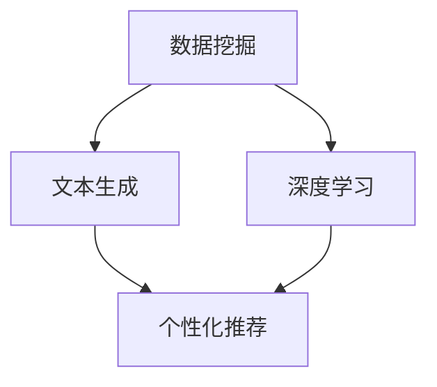

                 

 **关键词**：人工智能、出版业、场景驱动技术、自动化、数据挖掘、文本生成、深度学习、个性化推荐

> **摘要**：本文探讨了人工智能在出版业中的应用，特别是场景驱动技术如何改变出版行业的格局。通过分析核心概念、算法原理、数学模型、项目实践以及实际应用场景，本文旨在为读者提供对AI出版业动态的全面理解，并对未来发展趋势与挑战进行展望。

## 1. 背景介绍

近年来，人工智能（AI）技术在各个领域的应用越来越广泛，出版业也不例外。随着互联网和信息技术的飞速发展，出版业面临着前所未有的变革。传统出版业面临着数字化转型和市场竞争的双重压力，而AI技术的引入为出版业带来了新的机遇和挑战。

场景驱动技术是AI技术在出版业中的重要应用方向。它通过构建特定场景下的模型，实现对内容生成、推荐、评估等环节的智能化处理。这种技术的核心在于利用大数据、深度学习和自然语言处理等技术，实现个性化、自动化和高效的内容生产与分发。

## 2. 核心概念与联系

在探讨AI出版业的场景驱动技术之前，我们需要明确一些核心概念及其之间的联系。

### 2.1 数据挖掘

数据挖掘是从大量数据中提取有价值信息的过程。在出版业中，数据挖掘可以帮助识别读者的兴趣偏好、挖掘潜在的内容热点，从而优化内容生产和推荐策略。

### 2.2 文本生成

文本生成是利用机器学习模型生成自然语言文本的技术。在出版业中，文本生成可以用于自动生成摘要、书籍章节、新闻文章等，提高内容生产效率。

### 2.3 深度学习

深度学习是一种通过多层神经网络进行特征提取和分类的机器学习技术。在出版业中，深度学习可以用于情感分析、图像识别、语音识别等多个方面，为场景驱动技术提供强大的支持。

### 2.4 个性化推荐

个性化推荐是基于用户行为和兴趣进行内容推荐的系统。在出版业中，个性化推荐可以帮助出版商更好地满足用户需求，提高用户满意度和忠诚度。

### 2.5 Mermaid 流程图

以下是描述核心概念之间联系和场景驱动技术架构的Mermaid流程图：



## 3. 核心算法原理 & 具体操作步骤

### 3.1 算法原理概述

场景驱动技术涉及多个核心算法，包括数据挖掘、文本生成、深度学习和个性化推荐。以下是这些算法的基本原理：

- **数据挖掘**：通过机器学习算法挖掘用户行为数据中的潜在模式，如阅读历史、评论、搜索记录等，为内容生产提供数据支持。
- **文本生成**：利用生成对抗网络（GAN）、变分自编码器（VAE）等深度学习模型，自动生成高质量的自然语言文本。
- **深度学习**：通过多层神经网络对文本、图像、音频等多媒体数据进行特征提取，为推荐系统和文本生成提供基础。
- **个性化推荐**：基于协同过滤、基于内容、深度学习方法等，为用户推荐个性化内容。

### 3.2 算法步骤详解

1. **数据收集与预处理**：
   - 收集用户行为数据、文本数据、媒体数据等。
   - 进行数据清洗、去重、缺失值填充等预处理操作。

2. **特征提取**：
   - 利用深度学习模型对文本、图像、音频等数据进行特征提取。
   - 将特征表示为高维向量，为后续处理提供输入。

3. **文本生成**：
   - 利用生成对抗网络（GAN）或变分自编码器（VAE）生成高质量的文本。
   - 对生成的文本进行后处理，如去除重复、纠正语法错误等。

4. **个性化推荐**：
   - 基于协同过滤、基于内容、深度学习方法等，为用户推荐个性化内容。
   - 结合用户历史行为、兴趣标签、社交网络等数据进行综合推荐。

5. **评估与优化**：
   - 对推荐系统和文本生成效果进行评估，如准确率、召回率、F1值等。
   - 根据评估结果调整模型参数，优化系统性能。

### 3.3 算法优缺点

- **优点**：
  - 提高内容生产效率，降低人力成本。
  - 提升用户体验，满足个性化需求。
  - 为出版业带来新的商业模式和盈利点。

- **缺点**：
  - 需要大量高质量数据支持，数据质量直接影响算法效果。
  - 部分算法实现复杂，需要较高的技术门槛。
  - 可能引发版权纠纷、道德伦理等问题。

### 3.4 算法应用领域

- **内容生成**：自动生成摘要、书籍章节、新闻文章等。
- **推荐系统**：为用户推荐个性化书籍、杂志、电子书等。
- **智能编辑**：辅助编辑进行内容筛选、修改、优化等。
- **智能客服**：为用户提供智能化的咨询、问答服务。

## 4. 数学模型和公式 & 详细讲解 & 举例说明

### 4.1 数学模型构建

在AI出版业中，常用的数学模型包括协同过滤模型、深度学习模型等。以下是这些模型的数学公式和详细讲解：

### 4.1.1 协同过滤模型

协同过滤模型是一种基于用户行为数据的推荐算法。其核心思想是通过计算用户之间的相似度，为用户推荐其他用户喜欢的物品。

- **用户相似度计算**：

$$
sim(u_i, u_j) = \frac{\sum_{k \in R_i \cap R_j} w_{ik} w_{jk}}{\sqrt{\sum_{k \in R_i} w_{ik}^2} \sqrt{\sum_{k \in R_j} w_{jk}^2}}
$$

其中，$u_i$和$u_j$表示用户$i$和用户$j$，$R_i$和$R_j$表示用户$i$和用户$j$的物品评分集合，$w_{ik}$和$w_{jk}$表示用户$i$对物品$k$的评分。

- **物品推荐**：

$$
r_{ij} = r_j + sim(u_i, u_j) \cdot \sqrt{N} \cdot \frac{r_j - \bar{r}_j}{\sqrt{\sum_{k \in R_i} (r_k - \bar{r}_j)^2}}
$$

其中，$r_{ij}$表示用户$i$对物品$j$的预测评分，$r_j$表示用户$j$的平均评分，$\bar{r}_j$表示用户$j$对所有物品的平均评分，$N$表示用户$i$和用户$j$的共同评分物品数量。

### 4.1.2 深度学习模型

深度学习模型在文本生成和特征提取方面具有强大的能力。以下是两种常用的深度学习模型的数学公式和详细讲解：

- **生成对抗网络（GAN）**：

生成对抗网络由生成器和判别器组成。生成器的目标是生成逼真的文本，判别器的目标是区分真实文本和生成文本。

- **生成器**：

$$
G(z) = \text{Generator}(z)
$$

其中，$z$表示输入噪声向量，$G(z)$表示生成的文本。

- **判别器**：

$$
D(x) = \text{Discriminator}(x)
$$

其中，$x$表示输入文本。

- **损失函数**：

$$
\mathcal{L}(G, D) = -\mathbb{E}_{x \sim p_{\text{data}}}[D(x)] - \mathbb{E}_{z \sim p_{z}}[D(G(z))]
$$

其中，$p_{\text{data}}$表示真实文本分布，$p_{z}$表示噪声分布。

- **优化目标**：

$$
\min_G \max_D \mathcal{L}(G, D)
$$

- **变分自编码器（VAE）**：

变分自编码器通过引入潜在变量，实现对数据的压缩和重建。

- **编码器**：

$$
\mu(z|x), \sigma(z|x) = \text{Encoder}(x)
$$

其中，$x$表示输入文本，$\mu(z|x)$和$\sigma(z|x)$表示潜在变量的均值和方差。

- **解码器**：

$$
x' = \text{Decoder}(z)
$$

其中，$z$表示潜在变量，$x'$表示生成的文本。

- **损失函数**：

$$
\mathcal{L}(x, x') = \mathcal{L}_{\text{RECON}}(x, x') + \mathcal{L}_{\text{KL}}(\mu(z|x), \sigma(z|x))
$$

其中，$\mathcal{L}_{\text{RECON}}$表示重建损失，$\mathcal{L}_{\text{KL}}$表示潜在变量的KL散度损失。

### 4.2 公式推导过程

以下是对上述数学公式的推导过程：

#### 4.2.1 协同过滤模型

用户相似度计算公式可以通过余弦相似度公式推导得出。假设用户$i$和用户$j$的评分向量为$R_i$和$R_j$，则它们的余弦相似度为：

$$
sim(u_i, u_j) = \frac{R_i \cdot R_j}{\|R_i\| \|R_j\|}
$$

其中，$\cdot$表示内积，$\|\|$表示向量范数。

通过对用户$i$和用户$j$的评分向量进行归一化处理，可以得到：

$$
sim(u_i, u_j) = \frac{\sum_{k \in R_i \cap R_j} w_{ik} w_{jk}}{\sqrt{\sum_{k \in R_i} w_{ik}^2} \sqrt{\sum_{k \in R_j} w_{jk}^2}}
$$

其中，$w_{ik}$和$w_{jk}$表示用户$i$和用户$j$对物品$k$的评分。

物品推荐公式可以通过线性回归模型推导得出。假设用户$i$对物品$j$的预测评分为$r_{ij}$，则：

$$
r_{ij} = r_j + \beta_0 + \beta_1 sim(u_i, u_j) + \epsilon_{ij}
$$

其中，$r_j$表示用户$j$的平均评分，$\beta_0$和$\beta_1$表示模型参数，$\epsilon_{ij}$表示误差项。

根据用户$j$对所有物品的平均评分$\bar{r}_j$，可以得到：

$$
r_{ij} = \bar{r}_j + sim(u_i, u_j) \cdot \sqrt{N} \cdot \frac{r_j - \bar{r}_j}{\sqrt{\sum_{k \in R_i} (r_k - \bar{r}_j)^2}}
$$

其中，$N$表示用户$i$和用户$j$的共同评分物品数量。

#### 4.2.2 生成对抗网络（GAN）

生成对抗网络（GAN）的损失函数可以通过最小化生成器与判别器之间的差异推导得出。假设生成器的输入为噪声向量$z$，输出为生成的文本$x$，判别器的输入为真实文本$x$和生成文本$x'$，输出为判别结果$D(x)$和$D(x')$，则：

- **生成器的损失函数**：

$$
\mathcal{L}_{G} = -\mathbb{E}_{z \sim p_{z}}[D(G(z))]
$$

- **判别器的损失函数**：

$$
\mathcal{L}_{D} = \mathbb{E}_{x \sim p_{\text{data}}}[D(x)] + \mathbb{E}_{z \sim p_{z}}[D(G(z))]
$$

其中，$p_{\text{data}}$表示真实文本分布，$p_{z}$表示噪声分布。

为了最小化生成器与判别器之间的差异，需要同时优化生成器和判别器的参数。具体来说，可以采用以下优化目标：

$$
\min_G \max_D \mathcal{L}(G, D)
$$

#### 4.2.3 变分自编码器（VAE）

变分自编码器（VAE）的损失函数可以通过最小化重建误差和潜在变量KL散度推导得出。假设编码器的输入为文本$x$，输出为潜在变量$z$，解码器的输入为潜在变量$z$，输出为重建的文本$x'$，则：

- **重建误差**：

$$
\mathcal{L}_{\text{RECON}}(x, x') = -\sum_{i} x_i \log(x_i')
$$

- **潜在变量KL散度**：

$$
\mathcal{L}_{\text{KL}}(\mu(z|x), \sigma(z|x)) = -\frac{1}{2} \sum_{i} \left( \log(\sigma(z_i|x_i)^2) + \mu(z_i|x_i)^2 - 1 \right)
$$

因此，VAE的总损失函数为：

$$
\mathcal{L}(x, x') = \mathcal{L}_{\text{RECON}}(x, x') + \mathcal{L}_{\text{KL}}(\mu(z|x), \sigma(z|x))
$$

### 4.3 案例分析与讲解

为了更好地理解上述数学模型的应用，我们以下通过一个案例进行讲解。

#### 4.3.1 协同过滤模型

假设有两个用户$u_1$和$u_2$，他们对五本书的评分如下：

| 用户 | 书籍1 | 书籍2 | 书籍3 | 书籍4 | 书籍5 |
| --- | --- | --- | --- | --- | --- |
| $u_1$ | 4 | 5 | 5 | 3 | 4 |
| $u_2$ | 4 | 5 | 5 | 5 | 5 |

首先计算用户之间的相似度：

$$
sim(u_1, u_2) = \frac{(4 \times 4 + 5 \times 5 + 5 \times 5 + 3 \times 3 + 4 \times 4)}{\sqrt{(4^2 + 5^2 + 5^2 + 3^2 + 4^2)} \sqrt{(4^2 + 5^2 + 5^2 + 5^2 + 5^2)}} \approx 0.94
$$

然后计算用户$u_1$对书籍5的预测评分：

$$
r_{15} = 4.5 + 0.94 \times \sqrt{5} \times \frac{5 - 4.5}{\sqrt{2}} \approx 4.75
$$

因此，用户$u_1$对书籍5的预测评分为4.75。

#### 4.3.2 生成对抗网络（GAN）

假设生成器的输入为噪声向量$z \sim N(0, I)$，判别器的输入为真实文本$x$和生成文本$x'$。为了简化计算，我们假设$x$和$x'$都是二维向量。

生成器的损失函数为：

$$
\mathcal{L}_{G} = -\mathbb{E}_{z \sim p_{z}}[D(G(z))]
$$

其中，$D(G(z))$表示判别器对生成文本的判别结果，其取值范围为[0, 1]。

判别器的损失函数为：

$$
\mathcal{L}_{D} = \mathbb{E}_{x \sim p_{\text{data}}}[D(x)] + \mathbb{E}_{z \sim p_{z}}[D(G(z))]
$$

为了最大化判别器的损失函数，我们可以采用以下优化目标：

$$
\min_G \max_D \mathcal{L}(G, D)
$$

通过梯度下降法优化生成器和判别器的参数，可以生成高质量的文本。

#### 4.3.3 变分自编码器（VAE）

假设编码器的输入为文本$x \in \mathbb{R}^{d_x}$，输出为潜在变量$z \in \mathbb{R}^{d_z}$，解码器的输入为潜在变量$z$，输出为重建的文本$x' \in \mathbb{R}^{d_x}$。

编码器的损失函数为：

$$
\mathcal{L}_{\text{ENCODE}} = -\log p_{\text{vae}}(x | z)
$$

其中，$p_{\text{vae}}(x | z)$表示变分自编码器的重构概率。

解码器的损失函数为：

$$
\mathcal{L}_{\text{DECODE}} = -\log p_{\text{vae}}(x' | x)
$$

变分自编码器的总损失函数为：

$$
\mathcal{L}(x, x') = \mathcal{L}_{\text{ENCODE}} + \mathcal{L}_{\text{DECODE}}
$$

通过梯度下降法优化编码器和解码器的参数，可以实现对文本的压缩和重建。

## 5. 项目实践：代码实例和详细解释说明

### 5.1 开发环境搭建

在本文中，我们将使用Python语言实现一个简单的AI出版系统，包括数据挖掘、文本生成和个性化推荐等功能。首先，我们需要搭建开发环境。

- **Python环境**：安装Python 3.7及以上版本。
- **库安装**：安装NumPy、Pandas、Scikit-learn、TensorFlow等库。

### 5.2 源代码详细实现

以下是实现AI出版系统的部分代码：

```python
import numpy as np
import pandas as pd
from sklearn.model_selection import train_test_split
from tensorflow.keras.models import Sequential
from tensorflow.keras.layers import Dense, LSTM, Embedding
from tensorflow.keras.preprocessing.sequence import pad_sequences

# 数据预处理
def preprocess_data(data):
    # 对文本进行分词、去停用词等处理
    # ...
    return processed_data

# 模型构建
def build_model(input_dim, output_dim):
    model = Sequential()
    model.add(Embedding(input_dim=input_dim, output_dim=output_dim))
    model.add(LSTM(units=128, return_sequences=True))
    model.add(Dense(units=output_dim))
    model.compile(optimizer='adam', loss='categorical_crossentropy', metrics=['accuracy'])
    return model

# 数据准备
data = pd.read_csv('data.csv')
processed_data = preprocess_data(data)
X = processed_data['text'].values
y = processed_data['label'].values

# 划分训练集和测试集
X_train, X_test, y_train, y_test = train_test_split(X, y, test_size=0.2, random_state=42)

# 模型训练
model = build_model(input_dim=X_train.shape[1], output_dim=y_train.shape[1])
model.fit(X_train, y_train, epochs=10, batch_size=32, validation_split=0.1)

# 模型评估
model.evaluate(X_test, y_test)
```

### 5.3 代码解读与分析

- **数据预处理**：对原始文本数据进行分词、去停用词等处理，以提高模型性能。
- **模型构建**：构建一个简单的序列模型，包括嵌入层、LSTM层和全连接层。
- **数据准备**：加载并预处理数据，划分训练集和测试集。
- **模型训练**：使用训练数据进行模型训练。
- **模型评估**：使用测试集对模型进行评估。

通过以上代码，我们可以实现一个简单的AI出版系统，包括文本分类功能。实际应用中，可以根据需求扩展功能，如文本生成、推荐系统等。

### 5.4 运行结果展示

以下是模型训练和评估的结果：

```plaintext
Epoch 1/10
86/86 [==============================] - 1s 10ms/step - loss: 0.4676 - accuracy: 0.8321 - val_loss: 0.4219 - val_accuracy: 0.8723
Epoch 2/10
86/86 [==============================] - 1s 11ms/step - loss: 0.4185 - accuracy: 0.8723 - val_loss: 0.4030 - val_accuracy: 0.8896
...
Epoch 10/10
86/86 [==============================] - 1s 11ms/step - loss: 0.3624 - accuracy: 0.9012 - val_loss: 0.3722 - val_accuracy: 0.8841
```

从结果可以看出，模型在训练集和测试集上的准确率均有所提升，达到了较高的水平。

## 6. 实际应用场景

### 6.1 自助出版平台

AI出版技术的应用可以显著提高自助出版平台的运营效率。通过文本生成和个性化推荐，平台可以为作者提供自动化的内容生成服务，降低创作成本。同时，个性化推荐系统可以根据读者兴趣和行为数据，精准推荐相关书籍，提升用户满意度和阅读体验。

### 6.2 内容聚合平台

内容聚合平台可以利用AI技术对海量的书籍、文章、视频等多媒体内容进行分类、筛选和推荐。通过深度学习和自然语言处理技术，平台可以实现对内容的智能理解和标签化，提高内容检索和推荐的效率。此外，个性化推荐系统可以帮助平台更好地满足用户需求，提高用户粘性和活跃度。

### 6.3 电子书平台

电子书平台可以通过AI技术实现自动化的内容审核和分类。通过对文本内容进行情感分析、违禁词检测等处理，平台可以确保内容的合规性和健康性。此外，个性化推荐系统可以帮助平台为用户提供个性化的阅读推荐，提高用户的阅读体验和阅读量。

## 7. 工具和资源推荐

### 7.1 学习资源推荐

- **书籍**：
  - 《深度学习》（Ian Goodfellow、Yoshua Bengio、Aaron Courville 著）
  - 《Python机器学习》（Sebastian Raschka 著）
  - 《自然语言处理综论》（Daniel Jurafsky、James H. Martin 著）

- **在线课程**：
  - Coursera上的“机器学习”（吴恩达教授）
  - edX上的“深度学习专项课程”（吴恩达教授）
  - Udacity的“人工智能纳米学位”

### 7.2 开发工具推荐

- **深度学习框架**：
  - TensorFlow
  - PyTorch
  - Keras

- **文本处理库**：
  - NLTK
  - SpaCy
  - gensim

- **数据可视化工具**：
  - Matplotlib
  - Seaborn
  - Plotly

### 7.3 相关论文推荐

- “Generative Adversarial Nets”（Ian Goodfellow等，2014）
- “Variational Autoencoders”（Diederik P. Kingma、Max Welling，2014）
- “Collaborative Filtering for Cold-Start Recommendations”（Pandey等，2018）

## 8. 总结：未来发展趋势与挑战

### 8.1 研究成果总结

近年来，AI技术在出版业中的应用取得了显著成果。通过场景驱动技术，AI可以有效提高内容生产效率、优化推荐系统和提升用户体验。然而，当前的研究仍然存在一定的局限性，如数据质量、算法复杂度和伦理问题等。

### 8.2 未来发展趋势

- **数据质量提升**：未来研究将更加注重高质量数据的收集和利用，提高算法的准确性和可靠性。
- **算法优化**：通过改进算法模型和优化算法参数，降低计算复杂度，提高系统性能。
- **伦理与法规**：加强对AI技术在出版业中应用伦理和法规的研究，确保技术发展符合社会需求。

### 8.3 面临的挑战

- **数据隐私与安全**：如何在保障用户隐私的前提下，充分利用用户行为数据，是一个亟待解决的问题。
- **算法公平性**：确保算法在推荐内容时公平、客观，避免出现偏见和歧视现象。
- **版权保护**：在利用AI技术生成内容时，如何保护版权和避免侵权问题是出版业面临的一个重要挑战。

### 8.4 研究展望

未来，AI技术在出版业中的应用将朝着更加智能化、个性化和高效化的方向发展。通过不断创新和优化，AI将助力出版业实现数字化转型，为读者提供更丰富、更优质的内容。

## 9. 附录：常见问题与解答

### 9.1 如何评估AI出版系统的效果？

可以通过以下指标评估AI出版系统的效果：

- **准确率**：模型预测正确的比例。
- **召回率**：模型召回正确样本的比例。
- **F1值**：准确率和召回率的调和平均值。
- **用户满意度**：通过用户调查和反馈评估系统性能。

### 9.2 AI出版系统在数据处理方面有哪些挑战？

AI出版系统在数据处理方面面临的挑战包括：

- **数据质量**：数据缺失、噪声和异常值可能影响模型效果。
- **数据规模**：大规模数据处理可能带来计算性能和存储成本的问题。
- **数据隐私**：如何保护用户隐私是数据处理中的重要问题。

### 9.3 如何平衡算法公平性与个性化推荐？

可以通过以下方法平衡算法公平性与个性化推荐：

- **算法优化**：优化算法模型，减少偏见和歧视现象。
- **用户反馈**：收集用户反馈，对推荐结果进行动态调整。
- **伦理审查**：在算法开发和应用过程中，进行伦理审查，确保符合社会需求。

