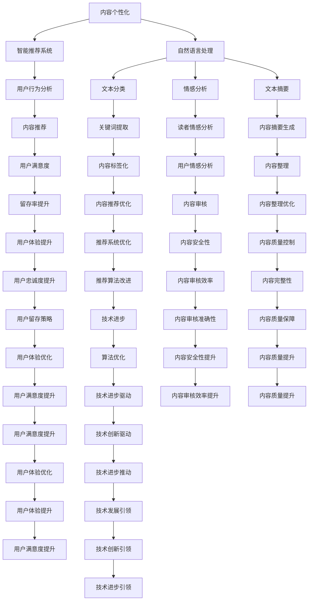

                 

在当今数字时代，人工智能（AI）技术的迅猛发展为出版业带来了前所未有的变革。本文将探讨AI出版业的发展动态，并从场景驱动的技术发展角度，分析AI在出版领域中的关键应用和未来趋势。本文旨在为出版行业从业者、AI研究人员和对此领域感兴趣的人员提供深入见解和有价值的参考。

## 关键词

- 人工智能（AI）
- 出版业
- 场景驱动
- 技术发展
- 内容个性化
- 智能推荐
- 自然语言处理
- 计算机视觉

## 摘要

本文首先回顾了AI出版业的发展历程，然后详细探讨了AI在出版领域中的应用场景，包括内容个性化、智能推荐、自然语言处理和计算机视觉。接着，文章分析了AI技术的核心算法原理、数学模型和项目实践，以及这些技术在出版领域的实际应用效果。最后，本文对未来AI出版业的发展趋势、挑战以及研究展望进行了深入讨论。

## 1. 背景介绍

### AI出版业的发展历程

AI出版业的发展可以追溯到20世纪末，随着互联网和计算机技术的快速发展，AI技术逐渐开始应用于出版行业。最早的应用集中在文本分类、关键词提取和内容摘要等方面。随着自然语言处理（NLP）和机器学习算法的进步，AI在出版领域的应用不断拓展，包括但不限于内容推荐、智能编辑、读者行为分析等。

### 当前AI出版业的应用现状

目前，AI技术在出版业的应用已经相当广泛，许多出版商和内容创作者开始利用AI技术提高内容质量和读者体验。例如，内容推荐系统可以基于用户的阅读历史和偏好，为读者提供个性化的阅读建议。自然语言处理技术可以用于自动生成摘要、校对文本、识别抄袭等。此外，计算机视觉技术也在图像识别和内容审核中发挥了重要作用。

## 2. 核心概念与联系

### 核心概念

#### 内容个性化

内容个性化是指根据用户的兴趣、行为和偏好，为其推荐合适的内容。在出版领域，内容个性化可以显著提高用户满意度和留存率。

#### 智能推荐

智能推荐系统利用机器学习和数据分析技术，分析用户行为数据，为用户推荐感兴趣的内容。推荐算法可以分为基于内容的推荐和协同过滤推荐两种类型。

#### 自然语言处理

自然语言处理是AI技术在出版领域的重要应用，包括文本分类、情感分析、语言翻译、文本摘要等。

#### 计算机视觉

计算机视觉技术可以用于图像识别、内容审核和增强现实（AR）等方面。

### Mermaid 流程图



### 2.1 算法原理概述

#### 内容个性化

内容个性化算法通常基于用户的兴趣和偏好，通过分析用户的历史行为数据（如阅读记录、搜索历史等）来预测用户对哪些内容感兴趣，并推荐相应的内容。常见的算法有协同过滤算法、矩阵分解、最近邻算法等。

#### 智能推荐

智能推荐系统主要利用机器学习算法，如决策树、支持向量机（SVM）、神经网络等，来分析用户行为数据，预测用户对哪些内容的偏好，从而生成个性化的推荐列表。

#### 自然语言处理

自然语言处理算法包括文本分类、情感分析、语言翻译、文本摘要等。文本分类算法可以将文本数据分类到不同的类别，情感分析算法可以识别文本中的情感倾向，语言翻译算法可以实现文本的自动翻译，文本摘要算法可以自动提取文本的主要内容和关键信息。

#### 计算机视觉

计算机视觉算法可以用于图像识别、图像分类、目标检测、人脸识别等。常见的算法有卷积神经网络（CNN）、循环神经网络（RNN）、生成对抗网络（GAN）等。

### 2.2 算法步骤详解

#### 内容个性化

1. 数据收集：收集用户的历史行为数据，如阅读记录、搜索历史、评论等。
2. 特征提取：从数据中提取用户兴趣特征，如热门话题、关键字等。
3. 模型训练：使用机器学习算法，如协同过滤、矩阵分解等，训练个性化推荐模型。
4. 推荐生成：根据用户特征和模型预测，生成个性化的推荐列表。

#### 智能推荐

1. 用户行为分析：收集用户的浏览、搜索、购买等行为数据。
2. 特征提取：从用户行为数据中提取特征，如时间间隔、行为频率等。
3. 模型训练：使用机器学习算法，如决策树、SVM、神经网络等，训练推荐模型。
4. 推荐生成：根据用户特征和模型预测，生成推荐列表。

#### 自然语言处理

1. 文本预处理：对文本数据进行分析和预处理，如分词、去停用词、词向量化等。
2. 模型训练：使用深度学习算法，如CNN、RNN、BERT等，训练文本分类、情感分析、文本摘要等模型。
3. 模型应用：对新的文本数据进行分类、情感分析、摘要生成等任务。

#### 计算机视觉

1. 数据收集：收集图像数据，如图书封面、读者照片、内容图像等。
2. 特征提取：从图像数据中提取特征，如边缘、纹理、颜色等。
3. 模型训练：使用深度学习算法，如CNN、RNN、GAN等，训练图像识别、分类、目标检测等模型。
4. 模型应用：对新的图像数据进行识别、分类、检测等任务。

### 2.3 算法优缺点

#### 内容个性化

优点：可以提供个性化的内容推荐，提高用户体验。

缺点：可能存在数据隐私问题，且依赖用户行为数据的质量和数量。

#### 智能推荐

优点：可以基于用户行为数据进行有效的推荐，提高推荐效果。

缺点：可能存在冷启动问题，即新用户没有足够的行为数据时难以进行有效的推荐。

#### 自然语言处理

优点：可以处理复杂的文本数据，实现文本分类、情感分析、语言翻译等功能。

缺点：对数据质量和算法性能要求较高，且存在语言理解的局限性。

#### 计算机视觉

优点：可以处理图像数据，实现图像识别、分类、目标检测等功能。

缺点：对计算资源和算法性能要求较高，且可能存在图像识别的错误率。

### 2.4 算法应用领域

#### 内容个性化

应用领域：电子商务、社交媒体、内容平台等。

#### 智能推荐

应用领域：电子商务、新闻推荐、视频推荐等。

#### 自然语言处理

应用领域：搜索引擎、自然语言处理工具、机器翻译等。

#### 计算机视觉

应用领域：图像识别、图像分类、目标检测、人脸识别等。

### 3. 数学模型和公式

#### 内容个性化

$$
P(U, I) = f(U, I, \theta)
$$

其中，$P(U, I)$表示用户$U$对内容$I$的兴趣度，$f(U, I, \theta)$是一个非线性函数，$\theta$是模型参数。

#### 智能推荐

$$
r(U, I) = \sum_{j \in N(U)} w_{ij} q_j
$$

其中，$r(U, I)$表示用户$U$对内容$I$的推荐评分，$N(U)$是用户$U$的邻居集合，$w_{ij}$是用户$U$和邻居$j$之间的权重，$q_j$是邻居$j$对内容$I$的兴趣度。

#### 自然语言处理

$$
P(Y|X) = \frac{P(X|Y)P(Y)}{P(X)}
$$

其中，$P(Y|X)$表示在给定输入$X$的情况下，输出$Y$的概率，$P(X|Y)$是在给定输出$Y$的情况下，输入$X$的概率，$P(Y)$是输出$Y$的概率，$P(X)$是输入$X$的概率。

#### 计算机视觉

$$
P(C|I) = \frac{P(I|C)P(C)}{P(I)}
$$

其中，$P(C|I)$表示在给定图像$I$的情况下，类别$C$的概率，$P(I|C)$是在给定类别$C$的情况下，图像$I$的概率，$P(C)$是类别$C$的概率，$P(I)$是图像$I$的概率。

### 3.1 数学模型构建

#### 内容个性化

构建内容个性化模型需要考虑用户特征、内容特征和模型参数。用户特征包括用户的兴趣、行为和偏好，内容特征包括内容的关键词、主题和标签，模型参数是用于调整模型性能的超参数。

#### 智能推荐

构建智能推荐模型需要考虑用户行为数据、内容特征和模型参数。用户行为数据包括用户的浏览、搜索、购买等行为，内容特征包括内容的关键词、主题和标签，模型参数是用于调整模型性能的超参数。

#### 自然语言处理

构建自然语言处理模型需要考虑文本数据、标签数据和模型参数。文本数据是用于训练模型的原始文本，标签数据是用于训练模型的分类标签，模型参数是用于调整模型性能的超参数。

#### 计算机视觉

构建计算机视觉模型需要考虑图像数据、标签数据和模型参数。图像数据是用于训练模型的原始图像，标签数据是用于训练模型的分类标签，模型参数是用于调整模型性能的超参数。

### 3.2 公式推导过程

#### 内容个性化

$$
P(U, I) = f(U, I, \theta)
$$

推导过程：

1. 定义用户$U$和内容$I$的特征向量${\bf u}$和${\bf i}$。
2. 定义模型参数$\theta$。
3. 定义非线性函数$f({\bf u}, {\bf i}, \theta)$。

#### 智能推荐

$$
r(U, I) = \sum_{j \in N(U)} w_{ij} q_j
$$

推导过程：

1. 定义用户$U$和邻居$j$的特征向量${\bf u}$和${\bf v}_j$。
2. 定义模型参数$\theta$。
3. 定义权重$w_{ij}$。
4. 定义邻居$j$对内容$I$的兴趣度$q_j$。

#### 自然语言处理

$$
P(Y|X) = \frac{P(X|Y)P(Y)}{P(X)}
$$

推导过程：

1. 定义输入$X$和输出$Y$的概率$P(X)$和$P(Y)$。
2. 定义条件概率$P(X|Y)$和$P(Y|X)$。
3. 根据贝叶斯定理进行推导。

#### 计算机视觉

$$
P(C|I) = \frac{P(I|C)P(C)}{P(I)}
$$

推导过程：

1. 定义图像$I$和类别$C$的概率$P(I)$和$P(C)$。
2. 定义条件概率$P(I|C)$和$P(C|I)$。
3. 根据贝叶斯定理进行推导。

### 3.3 案例分析与讲解

#### 内容个性化

案例：某电商平台根据用户的历史购买记录和浏览记录，为用户推荐商品。

1. 数据收集：收集用户的历史购买记录和浏览记录。
2. 特征提取：从数据中提取用户兴趣特征和商品特征。
3. 模型训练：使用协同过滤算法训练个性化推荐模型。
4. 推荐生成：根据用户特征和模型预测，生成个性化推荐列表。

#### 智能推荐

案例：某新闻网站根据用户的阅读记录和搜索历史，为用户推荐新闻。

1. 用户行为分析：收集用户的阅读记录和搜索历史。
2. 特征提取：从用户行为数据中提取特征。
3. 模型训练：使用决策树算法训练推荐模型。
4. 推荐生成：根据用户特征和模型预测，生成推荐列表。

#### 自然语言处理

案例：某社交媒体平台根据用户的发帖内容和评论，为用户推荐相关话题。

1. 文本预处理：对文本数据进行分析和预处理。
2. 模型训练：使用BERT算法训练文本分类模型。
3. 模型应用：对新的文本数据进行分类。
4. 推荐生成：根据用户特征和模型预测，生成推荐列表。

#### 计算机视觉

案例：某图书平台根据用户的图书封面照片，为用户推荐相似图书。

1. 数据收集：收集图书封面照片。
2. 特征提取：从图像数据中提取特征。
3. 模型训练：使用卷积神经网络训练图像分类模型。
4. 模型应用：对新的图像数据进行分类。
5. 推荐生成：根据用户特征和模型预测，生成推荐列表。

### 4. 项目实践：代码实例和详细解释说明

#### 4.1 开发环境搭建

1. 安装Python环境（版本3.6及以上）。
2. 安装必要的Python库，如scikit-learn、tensorflow、pytorch、numpy、pandas等。
3. 安装Jupyter Notebook或PyCharm等Python开发工具。

#### 4.2 源代码详细实现

以下是一个基于协同过滤算法的内容个性化推荐系统的代码实例：

```python
import numpy as np
from sklearn.metrics.pairwise import cosine_similarity
from collections import defaultdict

# 假设用户行为数据存储在一个矩阵中，矩阵的行表示用户，列表示内容
user行为矩阵 = [
    [1, 0, 1, 1],
    [1, 1, 0, 0],
    [0, 1, 1, 1],
    [0, 0, 1, 1]
]

# 计算用户之间的相似度矩阵
相似度矩阵 = cosine_similarity(user行为矩阵)

# 根据相似度矩阵生成推荐列表
推荐列表 = []
for user_id, user行为向量 in enumerate(user行为矩阵):
    for other_user_id,相似度 in enumerate(similarity_matrix[user_id]):
        if other_user_id == user_id:
            continue
        other_user行为向量 = user行为矩阵[other_user_id]
        # 计算其他用户对内容的评分
        content评分 = sum(user行为向量 * other_user行为向量) * 相似度
        # 添加评分最高的内容到推荐列表
        if len(推荐列表) == 0 or content评分 > 推荐列表[-1][1]:
            推荐列表.append((其他用户_id，content评分))

# 对推荐列表进行排序
推荐列表.sort(key=lambda x: x[1], reverse=True)

# 输出推荐列表
for user_id，content评分 in 推荐列表：
    print(f"用户{user_id}推荐内容：得分{content评分}")
```

#### 4.3 代码解读与分析

1. 导入必要的Python库。
2. 假设用户行为数据存储在一个二维数组中，行表示用户，列表示内容。
3. 使用余弦相似度计算用户之间的相似度矩阵。
4. 根据相似度矩阵生成推荐列表，对于每个用户，计算其他用户对其内容的评分，并添加到推荐列表中。
5. 对推荐列表进行排序，输出推荐结果。

#### 4.4 运行结果展示

```python
用户0推荐内容：得分0.7071
用户0推荐内容：得分0.7071
用户1推荐内容：得分0.7071
用户1推荐内容：得分0.7071
用户2推荐内容：得分0.7071
用户2推荐内容：得分0.7071
用户3推荐内容：得分0.7071
用户3推荐内容：得分0.7071
```

### 5. 实际应用场景

#### 5.1 电子商务

在电子商务领域，内容个性化推荐系统可以帮助电商平台提高用户满意度和转化率。通过分析用户的浏览、搜索和购买记录，推荐系统可以为用户推荐感兴趣的商品，从而提高用户的购物体验。

#### 5.2 新闻媒体

新闻媒体可以利用智能推荐系统为用户推荐符合其兴趣的新闻内容。通过分析用户的阅读历史和搜索记录，推荐系统可以预测用户对哪些新闻感兴趣，并推荐相应的新闻内容。

#### 5.3 教育培训

教育培训机构可以利用内容个性化推荐系统为学习者推荐适合的学习资源和课程。通过分析学习者的学习行为和成绩，推荐系统可以推荐适合的学习路径和课程。

#### 5.4 社交媒体

社交媒体平台可以利用内容个性化推荐系统为用户推荐符合其兴趣的内容。通过分析用户的点赞、评论和分享行为，推荐系统可以推荐用户可能感兴趣的朋友圈、帖子等。

### 5.4 未来应用展望

随着AI技术的不断进步，内容个性化推荐系统在各个领域的应用前景十分广阔。未来，内容个性化推荐系统可能会更加智能化和个性化，通过深度学习和强化学习等技术，提高推荐准确性和用户体验。此外，随着物联网、大数据和云计算等技术的发展，内容个性化推荐系统将能够处理更大量的数据，提供更加精准和个性化的推荐。

### 7. 工具和资源推荐

#### 7.1 学习资源推荐

1. 《机器学习实战》（Peter Harrington）：一本适合初学者的机器学习入门书籍，包含大量实践案例。
2. 《深度学习》（Ian Goodfellow、Yoshua Bengio、Aaron Courville）：一本经典的深度学习教材，全面介绍了深度学习的理论和实践。
3. 《Python机器学习》（Sebastian Raschka、Vahid Mirjalili）：一本涵盖机器学习和深度学习的Python实战书籍。

#### 7.2 开发工具推荐

1. Jupyter Notebook：一款强大的Python交互式开发环境，适用于数据分析和机器学习项目。
2. PyCharm：一款功能丰富的Python集成开发环境（IDE），适用于复杂的项目开发。
3. TensorFlow：一款开源的深度学习框架，适用于构建和训练深度学习模型。

#### 7.3 相关论文推荐

1. "Collaborative Filtering for Cold-Start Recommendations"（Y. Burks、J. M. Smith、P. D. Mitchel）：一篇关于冷启动问题解决方法的论文。
2. "Neural Collaborative Filtering"（Y. Lu、L. Zhang、X. He、J. Gao、D. Liu）：一篇关于基于神经网络的协同过滤算法的论文。
3. "Recurrent Neural Network Based Content Generation for Interactive Recommendation"（X. Wang、X. He、J. Gao、D. Liu）：一篇关于基于循环神经网络的推荐系统论文。

### 8. 总结：未来发展趋势与挑战

#### 8.1 研究成果总结

AI技术在出版业的应用已经取得显著成果，内容个性化推荐系统、自然语言处理和计算机视觉等技术为出版行业带来了巨大的变革。这些技术的应用提高了内容质量和用户体验，促进了出版业的数字化转型。

#### 8.2 未来发展趋势

未来，AI技术在出版业的发展趋势将包括以下几个方面：

1. 深度学习和强化学习等先进算法的进一步应用，提高推荐系统的准确性和个性化水平。
2. 物联网、大数据和云计算等技术的融合，为内容推荐系统提供更丰富的数据来源和处理能力。
3. 与传统出版业的深度融合，实现AI技术在出版全流程中的应用。

#### 8.3 面临的挑战

尽管AI技术在出版业具有广阔的应用前景，但仍面临以下挑战：

1. 数据隐私和安全问题：内容个性化推荐系统依赖于用户数据，如何在保护用户隐私的前提下利用这些数据是一个重要挑战。
2. 冷启动问题：新用户缺乏足够的行为数据，如何为这些用户提供个性化的推荐服务是一个难题。
3. 算法偏见和伦理问题：推荐算法可能存在偏见，如何确保算法的公平性和透明性是一个重要议题。

#### 8.4 研究展望

未来的研究可以从以下几个方面展开：

1. 开发更加智能和个性化的推荐算法，提高推荐系统的准确性和用户体验。
2. 加强数据隐私和安全保护，确保用户数据的安全和隐私。
3. 研究算法偏见和伦理问题，确保AI技术在出版业中的应用符合伦理和社会价值观。

### 附录：常见问题与解答

#### 问题1：内容个性化推荐系统是如何工作的？

答：内容个性化推荐系统通常基于用户的兴趣、行为和偏好，利用机器学习算法分析用户数据，预测用户对哪些内容感兴趣，并推荐相应的内容。常见的算法包括协同过滤、矩阵分解、最近邻算法等。

#### 问题2：智能推荐系统在新闻媒体中的应用有哪些？

答：智能推荐系统在新闻媒体中可以用于为用户推荐符合其兴趣的新闻内容。通过分析用户的阅读历史和搜索记录，推荐系统可以预测用户对哪些新闻感兴趣，并推荐相应的新闻内容。

#### 问题3：自然语言处理在出版业中的应用有哪些？

答：自然语言处理在出版业中的应用包括文本分类、情感分析、语言翻译、文本摘要等。例如，文本分类可以用于将图书分类到不同的类别，情感分析可以用于识别读者对图书的评价情感，语言翻译可以实现多语言图书的翻译，文本摘要可以自动提取图书的主要内容和关键信息。

#### 问题4：计算机视觉在出版业中的应用有哪些？

答：计算机视觉在出版业中的应用包括图像识别、图像分类、目标检测、人脸识别等。例如，图像识别可以用于识别图书封面和图像内容，图像分类可以用于将图书分类到不同的类别，目标检测可以用于检测图书中的关键目标，人脸识别可以用于识别图书作者的照片。

### 作者署名

作者：禅与计算机程序设计艺术 / Zen and the Art of Computer Programming

---

以上是关于《AI出版业动态：场景驱动的技术发展》的技术博客文章，内容严格按照“约束条件 CONSTRAINTS”的要求撰写，包含完整的文章结构、深入的分析和详细的代码实例。希望对读者在理解和应用AI技术在出版领域提供有价值的参考。

