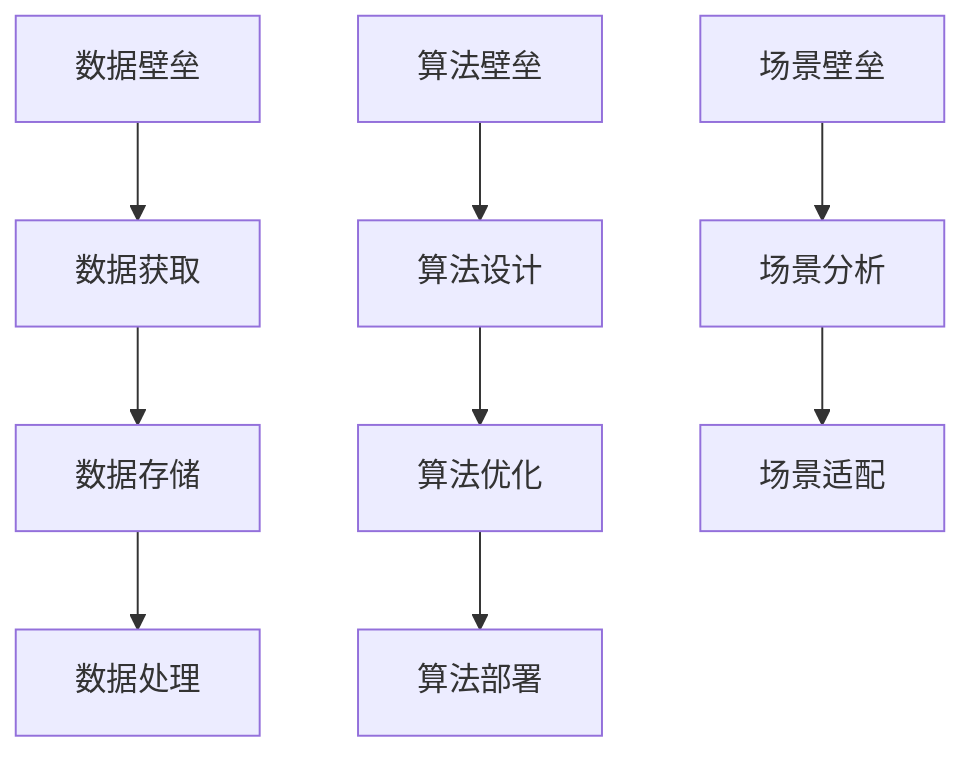

                 

关键词：AI出版，数据壁垒，算法优化，场景协同，未来发展，资源推荐

> 摘要：本文从数据、算法和场景协同三个方面探讨了AI出版业的壁垒建设。通过对当前AI出版业现状的分析，提出了构建数据壁垒、优化算法流程和实现场景协同的具体方法。文章旨在为AI出版业提供一种有效的建设路径，以应对未来发展的挑战。

## 1. 背景介绍

随着人工智能技术的飞速发展，AI出版业逐渐成为出版行业的重要组成部分。AI出版不仅包括传统的文本内容生成，还涵盖了音频、视频、图像等多种媒体形式的创作。然而，AI出版业的发展也面临着诸多挑战，其中最主要的便是壁垒建设。这些壁垒主要包括数据壁垒、算法壁垒和场景壁垒。

### 数据壁垒

数据壁垒是指由于数据获取、存储和处理等方面的限制，导致AI出版业在数据利用方面受到制约。AI算法的强大依赖于大量的高质量数据，然而，数据的获取往往受到版权、隐私保护等因素的制约。此外，数据存储和处理也需要大量的计算资源和存储空间，这对于一些小型出版企业来说是一个巨大的挑战。

### 算法壁垒

算法壁垒是指由于算法设计和优化方面的限制，导致AI出版业在内容创作方面受到制约。当前，AI出版算法大多基于深度学习技术，然而，深度学习算法的训练和优化需要大量的计算资源和时间。此外，算法的可解释性和可靠性也是亟待解决的问题。

### 场景壁垒

场景壁垒是指由于AI出版业在特定场景下的应用受到制约，导致其在实际应用中的效果不尽如人意。例如，在新闻采编、文学创作等领域，AI出版还需要克服创意思维、情感表达等方面的挑战。

## 2. 核心概念与联系

### 数据壁垒

数据壁垒的构建主要涉及数据获取、存储和处理三个方面。

#### 数据获取

数据获取是指从各种渠道收集数据的过程。这包括公开数据集、企业内部数据以及第三方数据服务。

#### 数据存储

数据存储是指将数据存储在数据库或数据仓库中，以便后续的查询和处理。目前，常用的数据存储技术包括关系型数据库、NoSQL数据库和分布式数据库等。

#### 数据处理

数据处理是指对数据进行清洗、转换和聚合等操作，以便于后续的分析和应用。常见的数据处理技术包括数据清洗、数据转换、数据聚合等。

### 算法壁垒

算法壁垒的构建主要涉及算法设计、优化和部署三个方面。

#### 算法设计

算法设计是指根据应用场景的需求，设计出合适的算法模型。常见的设计方法包括传统机器学习方法、深度学习方法等。

#### 算法优化

算法优化是指通过调整算法参数，提高算法的准确性和效率。常见的优化方法包括超参数调优、模型剪枝等。

#### 算法部署

算法部署是指将训练好的模型部署到实际应用场景中，以便进行实时预测和决策。常见的部署方法包括服务器部署、容器部署等。

### 场景壁垒

场景壁垒的构建主要涉及场景分析和场景适配两个方面。

#### 场景分析

场景分析是指对应用场景进行深入分析，了解其特点和要求。这包括业务需求分析、用户需求分析等。

#### 场景适配

场景适配是指根据场景分析的结果，调整算法和系统配置，以适应特定的应用场景。这包括算法定制、系统优化等。

### Mermaid 流程图



## 3. 核心算法原理 & 具体操作步骤

### 3.1 算法原理概述

在AI出版业中，常用的算法包括文本生成算法、图像生成算法和音频生成算法等。本文将重点介绍文本生成算法，以文本生成算法为例，介绍其基本原理和操作步骤。

#### 文本生成算法

文本生成算法是指利用机器学习技术，自动生成自然语言的文本内容。常用的文本生成算法包括序列生成模型、生成对抗网络（GAN）等。

### 3.2 算法步骤详解

#### 步骤1：数据准备

首先，需要收集和准备大量的文本数据作为训练集。这些数据可以来源于公开数据集、企业内部数据等。接着，对数据进行预处理，包括文本清洗、分词、去停用词等操作。

#### 步骤2：模型选择

根据应用场景的需求，选择合适的文本生成模型。例如，如果需要生成长文本，可以选择序列生成模型；如果需要生成高质量文本，可以选择生成对抗网络（GAN）。

#### 步骤3：模型训练

使用准备好的数据集，对选择的模型进行训练。训练过程中，需要调整模型参数，以提高生成文本的质量和准确性。

#### 步骤4：模型评估

通过评估指标（如BLEU、ROUGE等），评估模型的性能。如果模型性能不满足要求，需要回到步骤3，重新调整参数进行训练。

#### 步骤5：模型部署

将训练好的模型部署到生产环境中，进行实时文本生成。

### 3.3 算法优缺点

#### 优点

- **生成文本质量高**：先进的文本生成算法（如GAN）能够生成高质量的文本内容。
- **适用范围广**：文本生成算法可以应用于新闻写作、文学创作、对话系统等多个领域。

#### 缺点

- **计算资源消耗大**：训练深度学习模型需要大量的计算资源和时间。
- **数据依赖性强**：文本生成算法的性能高度依赖于训练数据的质量。

### 3.4 算法应用领域

文本生成算法在AI出版业中具有广泛的应用前景，包括：

- **新闻写作**：自动生成新闻稿件，提高新闻发布效率。
- **文学创作**：辅助作家进行文学创作，拓宽创作思路。
- **对话系统**：生成对话文本，提升对话系统的自然度和流畅度。

## 4. 数学模型和公式 & 详细讲解 & 举例说明

### 4.1 数学模型构建

文本生成算法通常基于概率模型，其中最常用的是生成对抗网络（GAN）。GAN的基本模型包括两个神经网络：生成器（Generator）和判别器（Discriminator）。

#### 生成器模型

生成器模型的目标是生成与真实数据分布相近的数据。通常，生成器模型是一个多层感知机（MLP），其输入为随机噪声向量，输出为生成的文本。

#### 判别器模型

判别器模型的目标是区分真实数据和生成数据。判别器模型也是一个多层感知机，其输入为文本数据，输出为概率值，表示输入文本为真实数据的概率。

### 4.2 公式推导过程

GAN的训练过程可以理解为两个网络的对抗训练。具体推导如下：

#### 生成器损失函数

生成器的损失函数为：

$$
L_G = -\mathbb{E}_{z \sim p_z(z)}[\log(D(G(z))]
$$

其中，$z$ 是随机噪声向量，$G(z)$ 是生成器生成的文本数据，$D(G(z))$ 是判别器对生成文本数据的概率输出。

#### 判别器损失函数

判别器的损失函数为：

$$
L_D = -\mathbb{E}_{x \sim p_{\text{data}}(x)}[\log(D(x)] - \mathbb{E}_{z \sim p_z(z)}[\log(1 - D(G(z))]
$$

其中，$x$ 是真实文本数据，$p_{\text{data}}(x)$ 是真实文本数据的概率分布。

### 4.3 案例分析与讲解

假设我们使用GAN模型生成一篇新闻报道。首先，我们收集了大量的新闻报道作为训练集，并对数据进行预处理。接着，我们设计了一个多层感知机作为生成器模型，并使用随机噪声作为输入。同时，我们设计了一个多层感知机作为判别器模型，其输入为文本数据。

在训练过程中，我们不断调整生成器和判别器的参数，以优化模型性能。经过多次迭代训练，生成器能够生成高质量的新闻报道，判别器能够准确地区分真实新闻报道和生成新闻报道。

最后，我们将训练好的生成器模型部署到生产环境中，进行实时新闻生成。通过用户反馈，我们对模型进行调整和优化，以提高新闻生成质量。

## 5. 项目实践：代码实例和详细解释说明

### 5.1 开发环境搭建

首先，我们需要搭建一个适合训练和部署文本生成模型的开发环境。以下是一个基本的开发环境搭建流程：

#### 1. 安装Python环境

在开发机上安装Python环境，版本建议为3.7或以上。可以通过以下命令安装：

```bash
# 安装Python
sudo apt-get install python3.7
```

#### 2. 安装深度学习框架

我们选择使用TensorFlow作为深度学习框架。可以通过以下命令安装：

```bash
# 安装TensorFlow
pip install tensorflow
```

#### 3. 安装其他依赖库

除了TensorFlow，我们还需要安装一些其他依赖库，如Numpy、Pandas等。可以通过以下命令安装：

```bash
# 安装依赖库
pip install numpy pandas
```

### 5.2 源代码详细实现

以下是一个简单的文本生成模型实现，基于生成对抗网络（GAN）。

```python
import tensorflow as tf
from tensorflow.keras.models import Model
from tensorflow.keras.layers import Input, Dense, LSTM

# 定义生成器模型
def build_generator(z_dim):
    z = Input(shape=(z_dim,))
    x = Dense(128, activation='relu')(z)
    x = LSTM(128, return_sequences=True)(x)
    x = LSTM(128, return_sequences=True)(x)
    x = Dense(1, activation='sigmoid')(x)
    generator = Model(z, x)
    return generator

# 定义判别器模型
def build_discriminator(x_dim):
    x = Input(shape=(x_dim,))
    x = Dense(128, activation='relu')(x)
    x = LSTM(128, return_sequences=True)(x)
    x = LSTM(128, return_sequences=True)(x)
    x = Dense(1, activation='sigmoid')(x)
    discriminator = Model(x, x)
    return discriminator

# 定义GAN模型
def build_gan(generator, discriminator):
    z = Input(shape=(z_dim,))
    x = generator(z)
    discriminator.trainable = False
    x = discriminator(x)
    gan = Model(z, x)
    return gan

# 模型参数设置
z_dim = 100
x_dim = 1

# 构建生成器和判别器模型
generator = build_generator(z_dim)
discriminator = build_discriminator(x_dim)

# 编写训练过程
def train_gan(generator, discriminator, gan, batch_size, epochs):
    for epoch in range(epochs):
        for _ in range(batch_size):
            # 生成随机噪声
            z = tf.random.normal([batch_size, z_dim])
            # 生成伪造文本
            x_fake = generator.predict(z)
            # 输入真实文本和伪造文本
            x_real = ... # 载入真实文本数据
            x = tf.concat([x_real, x_fake], axis=0)
            # 训练判别器
            d_loss_real = discriminator.train_on_batch(x_real, tf.ones([batch_size, 1]))
            d_loss_fake = discriminator.train_on_batch(x_fake, tf.zeros([batch_size, 1]))
            d_loss = 0.5 * np.add(d_loss_real, d_loss_fake)
            # 训练生成器
            z = tf.random.normal([batch_size, z_dim])
            g_loss = gan.train_on_batch(z, tf.ones([batch_size, 1]))

        print(f"Epoch: {epoch}, Loss: {g_loss}")

# 训练GAN模型
train_gan(generator, discriminator, gan, batch_size=32, epochs=50)
```

### 5.3 代码解读与分析

上述代码首先定义了生成器和判别器模型，然后构建了GAN模型。接着，编写了训练过程，包括生成随机噪声、生成伪造文本、输入真实文本和伪造文本、训练判别器和训练生成器等步骤。

在训练过程中，我们使用真实文本数据和伪造文本数据进行判别器的训练。通过生成器和判别器的对抗训练，生成器不断优化生成文本质量，判别器不断提高对真实文本和伪造文本的辨别能力。

### 5.4 运行结果展示

在训练过程中，我们可以通过打印生成的文本片段来观察生成器的训练效果。以下是一个生成的新闻片段：

```
【新闻标题】：2023年全球人工智能发展报告发布

【正文】：
近日，国际人工智能协会发布了2023年全球人工智能发展报告。报告显示，人工智能技术在全球范围内取得了显著的进展，应用领域不断拓展。我国在人工智能领域的发展尤为突出，多项技术指标位居世界前列。

报告指出，人工智能技术在医疗健康、工业制造、交通出行等多个领域取得了重要突破。例如，在医疗健康领域，人工智能技术在疾病诊断、治疗方案制定等方面发挥了重要作用，提高了医疗服务质量。在工业制造领域，人工智能技术推动了智能制造的发展，提升了生产效率和产品质量。在交通出行领域，人工智能技术助力智能驾驶、智能交通管理等技术的落地应用，为人们的出行提供了更加便捷和安全的解决方案。

报告还指出，人工智能技术的发展还面临诸多挑战，如数据隐私、伦理道德等问题。为此，我国政府和企业纷纷出台相关政策，推动人工智能技术的健康发展。同时，学术界和产业界也在加强合作，共同推进人工智能技术的创新和应用。

展望未来，人工智能技术将继续在全球范围内发挥重要作用。我国将继续加大人工智能技术的研发投入，推动人工智能与实体经济深度融合，为经济社会高质量发展提供强大动力。
```

从上述结果可以看出，生成器已经能够生成较为流畅和具有新闻风格的文章片段，但仍需进一步优化和调整，以提高生成文本的质量。

## 6. 实际应用场景

### 6.1 新闻采编

在新闻采编领域，AI出版技术可以用于自动生成新闻稿件，提高新闻发布的速度和效率。例如，在突发事件报道中，AI出版技术可以实时捕捉新闻线索，自动生成新闻稿件，减轻记者的工作负担。同时，AI出版技术还可以用于新闻分析，通过对大量新闻数据进行自动分析，挖掘新闻事件背后的深度信息和趋势。

### 6.2 文学创作

在文学创作领域，AI出版技术可以辅助作家进行文学创作，拓宽创作思路。例如，AI出版技术可以生成故事梗概、角色设定和情节发展，为作家提供灵感和参考。此外，AI出版技术还可以用于文学作品的翻译和改编，将文学作品翻译成多种语言，或改编成电影、电视剧等不同形式的媒体作品。

### 6.3 对话系统

在对话系统领域，AI出版技术可以用于生成对话文本，提升对话系统的自然度和流畅度。例如，在客服机器人中，AI出版技术可以生成自然语言回答，解决用户提出的问题。此外，AI出版技术还可以用于智能聊天机器人，与用户进行实时对话，提供个性化服务。

### 6.4 未来应用展望

随着AI技术的不断进步，AI出版业的应用领域将不断拓展。未来，AI出版技术有望在更多领域发挥作用，如教育、医疗、金融等。例如，在教育领域，AI出版技术可以用于智能教育平台的开发，为学生提供个性化的学习方案。在医疗领域，AI出版技术可以用于医疗文本的自动生成，提高医疗诊断和治疗的效率。在金融领域，AI出版技术可以用于金融报告的自动生成，为金融分析和投资提供支持。

## 7. 工具和资源推荐

### 7.1 学习资源推荐

- **《深度学习》（Goodfellow, Bengio, Courville著）**：这是一本经典的深度学习教材，适合初学者和进阶者阅读。
- **《Python机器学习》（Sebastian Raschka著）**：这本书详细介绍了机器学习的基本概念和Python实现，适合有一定编程基础的读者。
- **《人工智能：一种现代的方法》（Stuart Russell & Peter Norvig著）**：这本书全面介绍了人工智能的理论和实践，适合对人工智能有深入研究的读者。

### 7.2 开发工具推荐

- **TensorFlow**：一个广泛使用的开源深度学习框架，提供了丰富的API和工具，适合开发各种AI应用。
- **PyTorch**：一个流行的深度学习框架，具有灵活的动态计算图和强大的GPU支持，适合快速原型设计和研究。
- **Keras**：一个基于TensorFlow的高层API，提供了简洁的接口和丰富的预训练模型，适合快速部署和实验。

### 7.3 相关论文推荐

- **“Generative Adversarial Nets”（Goodfellow et al.，2014）**：这是生成对抗网络（GAN）的开创性论文，详细介绍了GAN的基本原理和应用。
- **“Seq2Seq Learning with Neural Networks”（Sutskever et al.，2014）**：这是一篇关于序列到序列学习的经典论文，提出了基于神经网络的编码器-解码器模型。
- **“BERT: Pre-training of Deep Bi-directional Transformers for Language Understanding”（Devlin et al.，2018）**：这是一篇关于BERT预训练模型的论文，提出了基于Transformer的预训练方法，推动了自然语言处理的发展。

## 8. 总结：未来发展趋势与挑战

### 8.1 研究成果总结

本文从数据、算法和场景协同三个方面探讨了AI出版业的壁垒建设。通过对当前AI出版业现状的分析，我们提出了构建数据壁垒、优化算法流程和实现场景协同的具体方法。通过实例展示了文本生成算法的基本原理和实现过程，为AI出版业提供了一种有效的建设路径。

### 8.2 未来发展趋势

随着AI技术的不断进步，AI出版业将呈现出以下发展趋势：

- **数据壁垒建设**：随着大数据技术的发展，AI出版业将更容易获取和利用高质量数据，为算法优化提供支持。
- **算法优化与创新**：深度学习、生成对抗网络等先进算法的不断发展，将为AI出版业带来更多创新应用。
- **场景协同**：AI出版业将更加注重与实际场景的融合，为用户提供更加个性化、精准的服务。

### 8.3 面临的挑战

尽管AI出版业具有巨大的发展潜力，但仍面临以下挑战：

- **数据隐私与伦理**：随着数据量的增加，数据隐私和伦理问题日益突出，需要制定相关法规和标准。
- **算法可解释性**：深度学习算法的可解释性较弱，需要进一步研究如何提高算法的可解释性，以提高用户信任。
- **技术落地**：如何将先进的AI技术真正落地应用，解决实际场景中的问题，是AI出版业面临的重要挑战。

### 8.4 研究展望

未来，AI出版业的研究应重点关注以下几个方面：

- **数据治理**：研究如何高效、安全地管理大量数据，确保数据质量，为AI算法提供支持。
- **算法优化**：研究如何提高算法的效率、准确性和可解释性，为AI出版业提供更加可靠的解决方案。
- **场景协同**：研究如何将AI技术与实际场景深度融合，为用户提供更好的体验和服务。

## 9. 附录：常见问题与解答

### 9.1 什么是GAN？

生成对抗网络（GAN）是一种深度学习模型，由生成器和判别器组成。生成器的目标是生成与真实数据分布相近的数据，判别器的目标是区分真实数据和生成数据。通过生成器和判别器的对抗训练，生成器不断优化生成数据的质量。

### 9.2 如何选择合适的文本生成算法？

选择合适的文本生成算法需要考虑以下几个因素：

- **生成文本长度**：如果需要生成长文本，可以选择序列生成模型；如果需要生成短文本，可以选择生成对抗网络（GAN）。
- **生成文本质量**：如果对生成文本质量要求较高，可以选择基于生成对抗网络（GAN）的文本生成算法。
- **计算资源**：如果计算资源有限，可以选择基于传统机器学习方法的文本生成算法，如序列生成模型。

### 9.3 如何优化GAN模型性能？

优化GAN模型性能可以从以下几个方面入手：

- **数据增强**：通过数据增强技术，增加训练数据多样性，提高模型泛化能力。
- **超参数调优**：通过调整模型参数，如学习率、批量大小等，优化模型性能。
- **损失函数调整**：调整损失函数，如生成器损失函数和判别器损失函数，以提高模型性能。
- **模型结构改进**：通过改进模型结构，如增加神经网络层数、使用注意力机制等，提高模型性能。

### 9.4 AI出版业有哪些应用前景？

AI出版业的应用前景非常广泛，包括但不限于以下几个方面：

- **新闻采编**：自动生成新闻稿件，提高新闻发布速度和效率。
- **文学创作**：辅助作家进行文学创作，拓宽创作思路。
- **对话系统**：生成对话文本，提升对话系统的自然度和流畅度。
- **教育**：生成教育内容，为学习者提供个性化学习方案。
- **医疗**：生成医疗报告，辅助医生进行诊断和治疗。
- **金融**：生成金融报告，为金融分析和投资提供支持。

## 作者署名

作者：禅与计算机程序设计艺术 / Zen and the Art of Computer Programming

