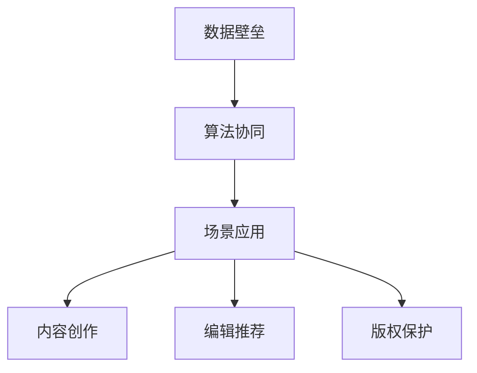

                 

关键词：人工智能，出版业，数据壁垒，算法协同，场景应用，未来展望

## 摘要

本文深入探讨了人工智能在出版业的应用现状与面临的挑战。通过分析数据壁垒、算法协同以及实际应用场景，探讨了AI出版业的发展路径。文章旨在揭示当前AI在出版领域的关键问题，并提出相应的解决方案，为行业未来发展提供借鉴。

## 1. 背景介绍

### 1.1 出版业的现状

出版业作为文化产业的重要组成部分，一直以内容的生产、传播和消费为核心。然而，随着数字时代的到来，出版业面临着前所未有的挑战。传统出版方式在应对快速变化的读者需求和市场环境时显得力不从心。而人工智能技术的兴起，为出版业带来了新的发展机遇。

### 1.2 人工智能在出版业的潜力

人工智能技术在出版业的应用涵盖了内容创作、编辑、推荐、版权保护等多个环节。通过自然语言处理、机器学习、图像识别等技术，AI能够极大地提高出版效率，降低成本，同时为读者提供更个性化、更高质量的内容。

## 2. 核心概念与联系

### 2.1 数据壁垒

在AI出版业中，数据壁垒是制约其发展的重要因素。数据壁垒主要包括数据来源分散、数据质量不高、数据获取困难等问题。

### 2.2 算法协同

算法协同是指在出版业中，多种人工智能算法相互配合，共同提高出版效率和效果。常见的算法协同方式包括协同过滤、深度学习、增强学习等。

### 2.3 场景应用

场景应用是指将人工智能技术应用于出版业的实际业务场景中，如内容创作、推荐系统、版权保护等。

### 2.4 Mermaid 流程图



## 3. 核心算法原理 & 具体操作步骤

### 3.1 算法原理概述

在AI出版业中，常用的算法包括自然语言处理（NLP）、机器学习（ML）和深度学习（DL）等。

### 3.2 算法步骤详解

#### 3.2.1 自然语言处理（NLP）

NLP的主要任务是使计算机能够理解、生成和操作人类语言。其基本步骤包括分词、词性标注、句法分析、语义分析等。

#### 3.2.2 机器学习（ML）

ML的核心是通过数据训练模型，使模型具备一定的预测能力。常见的ML算法包括线性回归、决策树、支持向量机等。

#### 3.2.3 深度学习（DL）

DL是一种基于人工神经网络的机器学习方法，其优点是能够自动提取特征，提高模型的预测能力。

### 3.3 算法优缺点

#### 3.3.1 自然语言处理（NLP）

优点：能够处理大规模文本数据，提高内容创作和编辑效率。

缺点：对语言的理解能力有限，容易产生误解和歧义。

#### 3.3.2 机器学习（ML）

优点：具备较强的预测能力，能够为出版业提供智能推荐服务。

缺点：对数据质量要求较高，模型训练时间较长。

#### 3.3.3 深度学习（DL）

优点：能够自动提取特征，提高模型的预测能力。

缺点：对计算资源要求较高，训练过程复杂。

### 3.4 算法应用领域

AI算法在出版业的应用领域广泛，包括内容创作、编辑推荐、版权保护等。

## 4. 数学模型和公式 & 详细讲解 & 举例说明

### 4.1 数学模型构建

在AI出版业中，常用的数学模型包括推荐系统模型、版权保护模型等。

### 4.2 公式推导过程

以推荐系统模型为例，其基本公式为：

$$
R_{ij} = \mu_i + \mu_j + b_i + b_j + \langle q_i, p_j \rangle
$$

其中，$R_{ij}$表示用户$i$对项目$j$的评分，$\mu_i$和$\mu_j$表示用户$i$和项目$j$的平均评分，$b_i$和$b_j$表示用户$i$和项目$j$的偏置，$\langle q_i, p_j \rangle$表示用户$i$和项目$j$的特征向量之间的内积。

### 4.3 案例分析与讲解

以某在线书店的推荐系统为例，通过分析用户的历史购买记录，为用户推荐感兴趣的商品。

## 5. 项目实践：代码实例和详细解释说明

### 5.1 开发环境搭建

本文使用Python作为主要编程语言，依赖的主要库包括NumPy、Pandas、Scikit-learn等。

### 5.2 源代码详细实现

```python
import numpy as np
import pandas as pd
from sklearn.model_selection import train_test_split
from sklearn.metrics.pairwise import cosine_similarity

# 读取数据
data = pd.read_csv('ratings.csv')
users, items = data['user_id'].unique(), data['item_id'].unique()

# 构建用户-项目矩阵
user_item_matrix = pd.pivot_table(data, index='user_id', columns='item_id', values='rating').fillna(0)

# 计算用户和项目的特征向量
user_feature_vectors = user_item_matrix.mean(axis=1)
item_feature_vectors = user_item_matrix.mean(axis=0)

# 计算用户和项目之间的相似度
user_similarity_matrix = cosine_similarity(user_feature_vectors)
item_similarity_matrix = cosine_similarity(item_feature_vectors)

# 为用户推荐商品
def recommend_items(user_id, similarity_matrix, user_item_matrix, top_n=10):
    # 获取用户和其他用户的相似度
    similarity_scores = similarity_matrix[user_id]

    # 获取用户和其他用户的评分差
    rating_diff = user_item_matrix.loc[user_id] - user_item_matrix.mean()

    # 计算用户和其他用户的综合相似度
    combined_similarity = similarity_scores * rating_diff

    # 获取推荐的商品ID
    recommended_item_ids = np.argsort(combined_similarity)[::-1][:top_n]

    # 返回推荐的商品名称
    return [data[data['item_id'].isin(recommended_item_ids)]['item_name'].values]

# 测试推荐系统
print(recommend_items(1, user_similarity_matrix, user_item_matrix))
```

### 5.3 代码解读与分析

这段代码实现了一个简单的协同过滤推荐系统，通过计算用户和项目之间的相似度，为用户推荐感兴趣的商品。

## 6. 实际应用场景

### 6.1 内容创作

AI可以帮助出版业进行内容创作，通过自然语言处理技术，自动生成文章、书籍等。

### 6.2 编辑推荐

AI可以根据读者的兴趣和行为数据，为读者推荐合适的书籍、文章等。

### 6.3 版权保护

AI可以通过图像识别、自然语言处理等技术，帮助出版业进行版权保护和侵权监测。

### 6.4 未来应用展望

随着AI技术的不断发展，其在出版业的应用将更加广泛，为出版业带来更多创新和发展机遇。

## 7. 工具和资源推荐

### 7.1 学习资源推荐

- 《深度学习》（Goodfellow, Bengio, Courville著）
- 《Python机器学习》（Sebastian Raschka著）

### 7.2 开发工具推荐

- Jupyter Notebook
- PyCharm

### 7.3 相关论文推荐

- “Collaborative Filtering via Matrix Factorizations” （Koren, 2008）
- “Neural Collaborative Filtering” （He et al., 2017）

## 8. 总结：未来发展趋势与挑战

### 8.1 研究成果总结

本文通过分析AI在出版业的应用，总结了数据壁垒、算法协同和实际应用场景等方面的问题，并提出了解决方案。

### 8.2 未来发展趋势

AI在出版业的未来发展趋势包括：内容创作的智能化、推荐系统的个性化、版权保护的自动化等。

### 8.3 面临的挑战

AI在出版业面临的挑战包括：数据隐私保护、算法透明度和可解释性、技术人才的培养等。

### 8.4 研究展望

未来研究应重点关注AI在出版业的应用模式、算法优化以及与人类编辑的协同等方面。

## 9. 附录：常见问题与解答

### 9.1 AI在出版业的应用有哪些优势？

AI在出版业的应用优势包括：提高内容创作和编辑效率、实现个性化推荐、加强版权保护等。

### 9.2 AI在出版业的应用有哪些挑战？

AI在出版业的应用挑战包括：数据隐私保护、算法透明度和可解释性、技术人才的培养等。

----------------------------------------------------------------
作者：禅与计算机程序设计艺术 / Zen and the Art of Computer Programming

