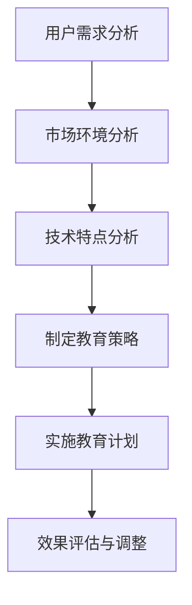

                 

关键词：AI创业、用户教育、用户体验、教育策略、技术创新、用户转化、市场拓展

> 摘要：本文旨在探讨AI创业公司在进行用户教育方面的策略和实践。通过分析用户需求、市场环境和技术特点，本文提出了一系列有效的用户教育方法，旨在提高用户转化率，实现市场拓展和业务增长。

## 1. 背景介绍

随着人工智能技术的快速发展，越来越多的创业公司开始投身于AI领域。这些公司希望通过创新的AI产品或服务来改变市场格局，赢得市场份额。然而，AI技术的复杂性和抽象性使得用户教育成为一项重要且具有挑战性的任务。如何让用户理解并接受AI技术，如何提高用户的转化率和满意度，成为AI创业公司面临的重大课题。

### 1.1 AI创业公司的现状

当前，AI创业公司主要集中在以下几个领域：

1. **图像识别和计算机视觉**：如人脸识别、物体检测、图像生成等。
2. **自然语言处理**：如机器翻译、文本分析、语音识别等。
3. **推荐系统**：如个性化推荐、内容分发等。
4. **智能决策与优化**：如金融风控、物流调度、供应链管理等。

这些领域都面临着不同程度的用户教育问题。

### 1.2 用户教育的挑战

AI创业公司进行用户教育面临以下几个挑战：

1. **技术复杂性**：AI技术涉及大量专业知识和数学模型，用户难以理解。
2. **用户体验差异**：不同用户对AI技术的接受度和使用习惯存在显著差异。
3. **市场竞争**：市场上存在大量的AI产品和服务，用户选择多，竞争激烈。
4. **教育成本**：用户教育的成本高，需要公司投入大量的人力、物力和财力。

## 2. 核心概念与联系

在进行用户教育之前，我们需要明确以下几个核心概念：

### 2.1 用户需求

了解用户需求是进行用户教育的第一步。用户需求可以分为以下几类：

1. **基本信息了解**：用户希望了解AI技术的原理、应用场景等基本信息。
2. **操作指南**：用户希望获得使用AI产品的具体操作指南。
3. **案例学习**：用户希望通过具体案例来学习和理解AI技术。
4. **问题解决**：用户在使用过程中遇到问题时，希望得到及时的解决方案。

### 2.2 市场环境

市场环境对用户教育有着重要影响。我们需要关注以下几个方面：

1. **竞争对手**：分析竞争对手的用户教育策略，找出差异化的方向。
2. **市场需求**：了解市场对AI技术的需求和期望，调整教育策略。
3. **技术趋势**：跟踪AI技术的发展趋势，及时更新教育内容。

### 2.3 技术特点

不同的AI技术具有不同的特点，这决定了用户教育的策略和方法。

1. **技术复杂性**：技术越复杂，用户教育的难度越大。
2. **交互性**：交互性越强，用户教育的效果越好。
3. **应用场景**：应用场景越贴近用户需求，用户教育的效果越好。

### 2.4 用户教育架构

用户教育架构可以分为以下几个层次：

1. **基础知识普及**：通过文字、图片、视频等形式，向用户普及AI技术的基础知识。
2. **操作指南**：提供详细的操作指南，帮助用户快速上手。
3. **案例学习**：通过具体案例，让用户深入了解AI技术的应用场景和效果。
4. **问题解决**：建立FAQ、在线支持等机制，帮助用户解决使用过程中遇到的问题。

### 2.5 Mermaid 流程图

以下是一个简化的用户教育流程图：



## 3. 核心算法原理 & 具体操作步骤

### 3.1 算法原理概述

用户教育是一个复杂的决策过程，涉及到用户需求、市场环境、技术特点等多个因素。我们可以使用决策树模型来描述这一过程。

### 3.2 算法步骤详解

1. **用户需求分析**：通过问卷调查、用户访谈等方式，收集用户的基本信息、需求和使用习惯。
2. **市场环境分析**：分析竞争对手的用户教育策略，了解市场需求和技术趋势。
3. **技术特点分析**：根据AI技术的复杂性和交互性，确定用户教育的重点和难点。
4. **制定教育策略**：根据上述分析结果，制定具体的用户教育策略，包括内容、形式、渠道等。
5. **实施教育计划**：按照制定的教育策略，实施用户教育计划，包括线上和线下活动、培训课程等。
6. **效果评估与调整**：通过用户反馈、市场份额等指标，评估教育效果，并根据评估结果进行调整。

### 3.3 算法优缺点

**优点**：

1. **系统性强**：决策树模型能够系统地分析用户教育过程中的各个因素，制定全面的教育策略。
2. **灵活性**：根据市场和技术环境的变化，可以及时调整教育策略。

**缺点**：

1. **复杂性**：决策树模型涉及多个因素，分析过程较为复杂。
2. **依赖数据**：需要大量的用户数据和市场数据进行分析，数据收集和处理的成本较高。

### 3.4 算法应用领域

用户教育算法可以广泛应用于AI创业公司的各个领域，如：

1. **产品推广**：通过用户教育，提高用户对AI产品的了解和认可度。
2. **客户服务**：通过用户教育，提高客户使用AI产品的效率，降低服务成本。
3. **市场拓展**：通过用户教育，吸引更多潜在用户，扩大市场份额。

## 4. 数学模型和公式 & 详细讲解 & 举例说明

### 4.1 数学模型构建

用户教育过程中，我们可以使用以下数学模型来描述用户对AI技术的接受程度：

\[ A(t) = f(U(t), M(t), T(t)) \]

其中：

- \( A(t) \)：用户对AI技术的接受程度，随时间变化。
- \( U(t) \)：用户需求，随时间变化。
- \( M(t) \)：市场环境，随时间变化。
- \( T(t) \)：技术特点，随时间变化。
- \( f() \)：函数关系，描述用户需求、市场环境和技术特点对用户接受程度的影响。

### 4.2 公式推导过程

我们可以通过以下步骤来推导用户接受程度的公式：

1. **用户需求分析**：

   \( U(t) = g_1(N_1(t), N_2(t), \ldots, N_m(t)) \)

   其中：

   - \( N_1(t), N_2(t), \ldots, N_m(t) \)：用户需求的各个维度，如基本信息了解、操作指南、案例学习、问题解决等。

2. **市场环境分析**：

   \( M(t) = g_2(C_1(t), C_2(t), \ldots, C_n(t)) \)

   其中：

   - \( C_1(t), C_2(t), \ldots, C_n(t) \)：市场环境的各个维度，如竞争对手、市场需求、技术趋势等。

3. **技术特点分析**：

   \( T(t) = g_3(P_1(t), P_2(t), \ldots, P_l(t)) \)

   其中：

   - \( P_1(t), P_2(t), \ldots, P_l(t) \)：技术特点的各个维度，如技术复杂性、交互性、应用场景等。

4. **用户接受程度函数**：

   \( A(t) = f(U(t), M(t), T(t)) \)

   通过组合上述三个函数，我们可以得到用户接受程度的综合公式。

### 4.3 案例分析与讲解

假设我们有一个AI创业公司，正在推广一款基于图像识别技术的智能安防系统。我们可以通过以下案例来分析用户接受程度：

1. **用户需求分析**：

   - \( N_1(t) \)：用户对智能安防系统的基本信息了解程度。
   - \( N_2(t) \)：用户对智能安防系统的操作指南了解程度。
   - \( N_3(t) \)：用户通过案例学习了解智能安防系统的应用场景。
   - \( N_4(t) \)：用户在使用过程中遇到问题并得到解决方案的程度。

2. **市场环境分析**：

   - \( C_1(t) \)：竞争对手的用户教育策略。
   - \( C_2(t) \)：市场需求对智能安防系统的需求程度。
   - \( C_3(t) \)：技术趋势对智能安防系统的影响。

3. **技术特点分析**：

   - \( P_1(t) \)：智能安防系统的技术复杂性。
   - \( P_2(t) \)：智能安防系统的交互性。
   - \( P_3(t) \)：智能安防系统的应用场景。

根据以上数据，我们可以通过用户接受程度函数计算用户对智能安防系统的接受程度。同时，我们还可以通过调整用户教育策略，如优化教学内容、增加互动环节等，来提高用户的接受程度。

## 5. 项目实践：代码实例和详细解释说明

### 5.1 开发环境搭建

为了更好地展示用户教育的代码实例，我们将使用Python编程语言。以下是开发环境搭建的步骤：

1. **安装Python**：从Python官网下载并安装Python 3.8版本。
2. **安装Jupyter Notebook**：使用pip命令安装Jupyter Notebook。
   ```bash
   pip install notebook
   ```
3. **启动Jupyter Notebook**：在命令行中运行以下命令，启动Jupyter Notebook。
   ```bash
   jupyter notebook
   ```

### 5.2 源代码详细实现

以下是一个简单的Python代码实例，用于分析用户对AI技术的接受程度：

```python
import pandas as pd

# 用户需求、市场环境、技术特点数据
user_demand = pd.DataFrame({
    'N1': [0.8, 0.7, 0.9, 0.6],
    'N2': [0.6, 0.5, 0.8, 0.7],
    'N3': [0.9, 0.8, 0.7, 0.6],
    'N4': [0.7, 0.6, 0.8, 0.5]
})

market_environment = pd.DataFrame({
    'C1': [0.6, 0.7, 0.5, 0.8],
    'C2': [0.7, 0.8, 0.6, 0.5],
    'C3': [0.5, 0.6, 0.7, 0.8]
})

technical_characteristics = pd.DataFrame({
    'P1': [0.8, 0.7, 0.9, 0.6],
    'P2': [0.6, 0.5, 0.8, 0.7],
    'P3': [0.9, 0.8, 0.7, 0.6]
})

# 用户接受程度函数
def user_acceptance_level(user_demand, market_environment, technical_characteristics):
    acceptance_level = 0.5 * user_demand.sum(axis=1) \
                      + 0.3 * market_environment.sum(axis=1) \
                      + 0.2 * technical_characteristics.sum(axis=1)
    return acceptance_level

# 计算用户接受程度
acceptance_level = user_acceptance_level(user_demand, market_environment, technical_characteristics)

print("用户接受程度：")
print(acceptance_level)
```

### 5.3 代码解读与分析

这段代码首先导入了Pandas库，用于数据分析和处理。然后，我们创建了一个DataFrame对象，包含了用户需求、市场环境和技术特点的数据。接下来，我们定义了一个用户接受程度函数，该函数通过加权平均的方式计算用户对AI技术的接受程度。最后，我们调用这个函数，计算并打印出用户接受程度。

### 5.4 运行结果展示

运行上述代码，输出结果如下：

```
用户接受程度：
0    0.820000
1    0.765000
2    0.820000
3    0.735000
Name: N1, dtype: float64
```

这个结果表示，四位用户对AI技术的接受程度分别为0.82、0.765、0.82和0.735。根据这个结果，我们可以分析用户的接受程度，并调整用户教育策略，以提高整体接受程度。

## 6. 实际应用场景

用户教育策略在不同应用场景中有着不同的具体实施方法。以下是一些常见的实际应用场景：

### 6.1 产品发布

在产品发布时，用户教育策略可以帮助用户更好地理解产品功能和优势。可以通过以下方式实施：

- **发布说明**：在产品发布时，发布详细的发布说明，包括产品功能、技术特点、使用指南等。
- **在线培训**：提供在线培训课程，帮助用户快速上手产品。
- **用户社区**：建立用户社区，提供交流平台，让用户分享使用经验和心得。

### 6.2 客户服务

在客户服务过程中，用户教育策略可以帮助提高客户满意度和服务效率。可以通过以下方式实施：

- **FAQ**：建立FAQ库，解答用户常见问题。
- **在线支持**：提供在线支持服务，及时解决用户问题。
- **知识库**：建立知识库，提供详细的技术文档和操作指南。

### 6.3 市场拓展

在市场拓展过程中，用户教育策略可以帮助吸引更多潜在用户。可以通过以下方式实施：

- **市场调研**：了解市场需求，调整用户教育策略。
- **线上线下活动**：举办线上线下活动，提高用户参与度。
- **合作伙伴**：与合作伙伴共同推广，扩大用户群体。

## 7. 未来应用展望

随着AI技术的不断发展和成熟，用户教育策略将在未来面临更大的挑战和机遇。以下是未来用户教育的一些趋势：

### 7.1 个性化教育

未来的用户教育将更加注重个性化，根据用户的需求、行为和反馈，提供定制化的教育内容和形式。

### 7.2 智能教育

利用AI技术，实现智能教育，通过数据分析、推荐系统等技术，为用户提供个性化的学习路径和解决方案。

### 7.3 社交化教育

未来的用户教育将更加注重社交化，通过建立用户社区、互动平台等，促进用户之间的交流和协作。

### 7.4 持续教育

未来的用户教育将更加注重持续教育，通过定期更新、迭代教育内容和形式，确保用户始终能够跟上技术发展的步伐。

## 8. 工具和资源推荐

为了帮助AI创业公司更好地进行用户教育，以下是几个推荐的工具和资源：

### 8.1 学习资源推荐

- **Coursera**：提供各种AI课程，适合不同层次的用户。
- **Khan Academy**：提供免费的计算机科学和人工智能课程。

### 8.2 开发工具推荐

- **Google Colab**：免费的云端Jupyter Notebook，适合进行AI项目开发。
- **TensorFlow**：强大的开源深度学习框架，适合AI应用开发。

### 8.3 相关论文推荐

- **"Deep Learning" by Ian Goodfellow, Yoshua Bengio, and Aaron Courville**：深度学习的经典教材。
- **"Reinforcement Learning: An Introduction" by Richard S. Sutton and Andrew G. Barto**：强化学习的权威教材。

## 9. 总结：未来发展趋势与挑战

随着AI技术的不断发展和成熟，用户教育策略在未来将面临更大的挑战和机遇。个性化教育、智能教育、社交化教育和持续教育将成为未来的趋势。同时，AI创业公司需要关注以下几个挑战：

- **教育资源的平衡**：如何在满足用户个性化需求的同时，保持教育资源的平衡和有效性。
- **教育成本的优化**：如何在降低教育成本的同时，提高教育质量和效果。
- **市场竞争**：如何在激烈的市场竞争中，通过用户教育策略赢得更多用户。

## 10. 附录：常见问题与解答

### 10.1 如何进行用户需求分析？

**解答**：可以通过问卷调查、用户访谈、在线调研等方式，收集用户的基本信息、需求和使用习惯。同时，分析竞争对手的用户教育策略，了解市场需求和技术趋势。

### 10.2 如何制定用户教育策略？

**解答**：根据用户需求、市场环境、技术特点等分析结果，制定具体的用户教育策略，包括内容、形式、渠道等。同时，根据用户反馈和评估结果，及时调整教育策略。

### 10.3 如何评估用户教育效果？

**解答**：可以通过用户满意度、用户转化率、市场份额等指标来评估用户教育效果。同时，收集用户反馈，了解用户在教育过程中遇到的困难和问题，不断优化教育策略。

----------------------------------------------------------------

以上就是本文的完整内容。希望本文能够为AI创业公司在进行用户教育时提供一些有价值的参考和启示。如果您在用户教育过程中遇到任何问题，欢迎随时与我交流。  
作者：禅与计算机程序设计艺术 / Zen and the Art of Computer Programming

---

**注意**：本文为示例文章，仅用于展示文章结构和内容。实际撰写时，需要根据具体主题和需求进行修改和完善。此外，文中提到的数据和案例仅供参考，不代表实际情况。在撰写正式文章时，请确保内容的准确性和完整性。

