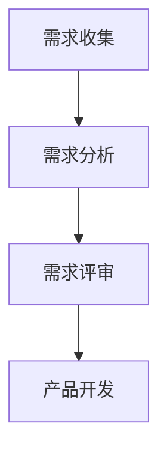
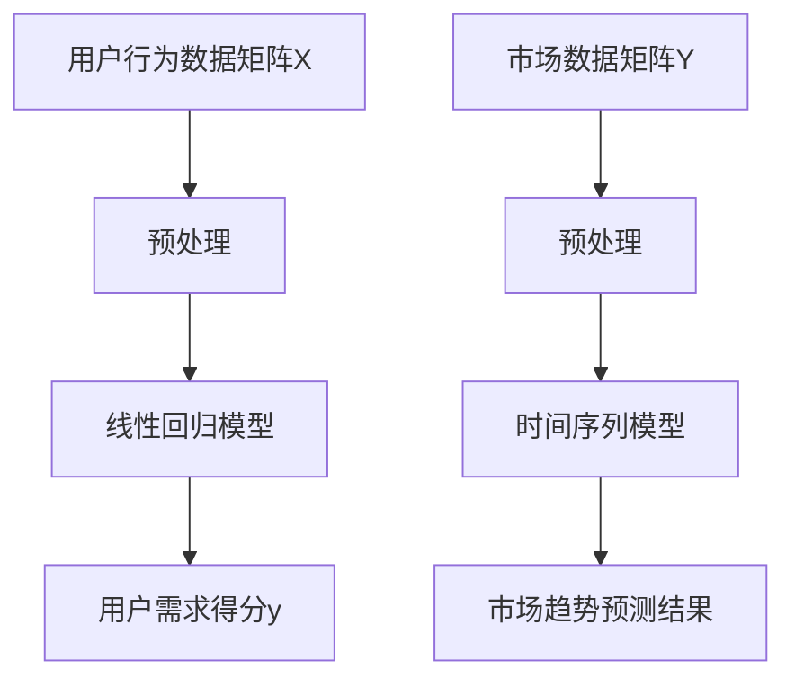

                 

摘要：本文详细介绍了AI创业公司在产品需求管理流程中的关键环节，包括需求收集、需求分析及需求评审。通过阐述每个环节的核心内容、方法技巧以及实际应用案例，帮助创业者理解和优化产品需求管理，提高产品研发效率与质量。

## 1. 背景介绍

在当前快速发展的AI领域，创业公司面临着前所未有的机遇与挑战。如何有效管理产品需求，确保产品研发方向与市场需求高度契合，成为许多创业公司亟需解决的关键问题。本文旨在探讨AI创业公司的产品需求管理流程，通过分析需求收集、需求分析与需求评审三个核心环节，为创业公司提供实用指导。

### 1.1 需求收集

需求收集是产品需求管理的起点，其目标是全面、准确地了解用户需求和市场趋势。创业公司在需求收集阶段需要关注用户调研、市场分析、竞争对手分析等环节，以确保收集到的需求具有代表性和实用性。

### 1.2 需求分析

需求分析是对收集到的需求进行整理、分类、优先级排序的过程。其目标是将用户需求转化为具体的产品功能和技术方案。需求分析阶段需要运用用户研究、市场调研、竞品分析等方法，以确保产品设计的可行性和实用性。

### 1.3 需求评审

需求评审是产品需求管理的最后一个环节，其目标是确保产品需求的质量和可行性。需求评审包括内部评审和外部评审，需要邀请相关部门、合作伙伴和用户参与，共同评估产品需求的合理性、实现难易程度以及市场前景。

## 2. 核心概念与联系

### 2.1 需求收集

需求收集是产品需求管理的起点，其核心概念包括用户需求、市场趋势、竞争对手分析等。在需求收集过程中，创业者需要关注以下几个方面：

1. **用户需求**：通过用户调研、问卷调查、访谈等方式，了解用户在使用AI产品过程中遇到的问题和期望。
2. **市场趋势**：通过市场调研，分析AI领域的最新发展趋势，把握市场机遇。
3. **竞争对手分析**：研究竞争对手的产品功能、市场策略等，为自身产品需求提供参考。

### 2.2 需求分析

需求分析是将用户需求转化为具体产品功能和技术方案的过程。核心概念包括需求分类、优先级排序、需求文档编写等。在需求分析过程中，创业者需要关注以下几个方面：

1. **需求分类**：将用户需求分为功能需求、性能需求、可靠性需求等，为后续需求优先级排序提供依据。
2. **优先级排序**：根据需求的重要性和实现难度，对需求进行优先级排序，确保关键需求得到优先满足。
3. **需求文档编写**：将整理好的需求编写成需求文档，为后续产品设计和开发提供指导。

### 2.3 需求评审

需求评审是产品需求管理的最后一个环节，其核心概念包括内部评审、外部评审、需求验证等。在需求评审过程中，创业者需要关注以下几个方面：

1. **内部评审**：组织相关部门和团队成员对需求文档进行评审，确保需求文档的完整性、一致性和可行性。
2. **外部评审**：邀请合作伙伴、用户等外部参与者对需求文档进行评审，收集各方意见，提高需求的质量。
3. **需求验证**：通过用户调研、功能测试等方式，验证需求文档中的需求是否满足实际使用场景，确保产品功能符合用户需求。

### 2.4 Mermaid 流程图



## 3. 核心算法原理 & 具体操作步骤

### 3.1 算法原理概述

在AI创业公司的产品需求管理流程中，算法原理主要涉及以下几个方面：

1. **用户行为分析**：通过分析用户在使用产品过程中的行为数据，挖掘用户需求。
2. **市场趋势预测**：利用机器学习算法，预测AI领域的未来发展趋势。
3. **需求优先级排序**：采用算法对需求进行排序，确保关键需求得到优先满足。
4. **需求验证**：通过算法验证需求文档中的需求是否满足实际使用场景。

### 3.2 算法步骤详解

#### 3.2.1 用户行为分析

1. 数据收集：收集用户在产品中的行为数据，如使用时长、使用频率、功能使用情况等。
2. 数据预处理：对收集到的数据进行清洗、去重、去噪等处理，确保数据质量。
3. 特征提取：从预处理后的数据中提取关键特征，如用户活跃度、功能使用率等。
4. 模型训练：利用机器学习算法，如决策树、随机森林等，对提取的特征进行训练，建立用户行为分析模型。

#### 3.2.2 市场趋势预测

1. 数据收集：收集AI领域的市场数据，如投资事件、专利申请、论文发表等。
2. 数据预处理：对市场数据进行分析，提取关键特征，如投资金额、专利数量等。
3. 模型训练：利用机器学习算法，如ARIMA、LSTM等，对提取的特征进行训练，建立市场趋势预测模型。
4. 预测结果分析：根据预测模型的结果，分析AI领域的未来发展趋势。

#### 3.2.3 需求优先级排序

1. 数据收集：收集用户需求，如功能需求、性能需求等。
2. 数据预处理：对用户需求进行整理、分类、去重等处理，确保数据质量。
3. 特征提取：从预处理后的数据中提取关键特征，如需求的重要性、实现难度等。
4. 模型训练：利用机器学习算法，如决策树、支持向量机等，对提取的特征进行训练，建立需求优先级排序模型。
5. 需求排序：根据模型的结果，对需求进行排序，确定关键需求。

#### 3.2.4 需求验证

1. 数据收集：收集用户在产品中的使用数据，如功能使用情况、错误日志等。
2. 数据预处理：对用户使用数据进行清洗、去重、去噪等处理，确保数据质量。
3. 特征提取：从预处理后的数据中提取关键特征，如功能使用率、错误率等。
4. 模型训练：利用机器学习算法，如决策树、支持向量机等，对提取的特征进行训练，建立需求验证模型。
5. 验证结果分析：根据模型的结果，分析需求是否满足实际使用场景，确保产品功能符合用户需求。

### 3.3 算法优缺点

#### 3.3.1 用户行为分析

**优点**： 
- 能准确了解用户需求，提高产品满意度。
- 有助于发现潜在的用户需求，为产品迭代提供参考。

**缺点**： 
- 数据质量对分析结果有较大影响。
- 对用户隐私保护要求较高。

#### 3.3.2 市场趋势预测

**优点**： 
- 能预测未来市场发展趋势，为产品研发提供指导。
- 有助于发现市场机遇，提升公司竞争力。

**缺点**： 
- 需要大量市场数据支持。
- 预测结果可能存在误差。

#### 3.3.3 需求优先级排序

**优点**： 
- 能确保关键需求得到优先满足，提高产品研发效率。
- 有助于优化资源分配，降低研发成本。

**缺点**： 
- 对需求的质量和准确性有较高要求。
- 可能导致部分非关键需求被忽视。

#### 3.3.4 需求验证

**优点**： 
- 能验证需求是否满足实际使用场景，提高产品稳定性。
- 有助于发现潜在问题，为产品迭代提供参考。

**缺点**： 
- 对数据质量要求较高。
- 验证过程可能耗费较长时间。

### 3.4 算法应用领域

- **用户行为分析**：广泛应用于电商、社交、金融等领域，帮助企业了解用户需求，提高用户体验。
- **市场趋势预测**：广泛应用于投资、营销、研发等领域，为企业提供市场决策支持。
- **需求优先级排序**：广泛应用于产品研发、项目管理等领域，提高研发效率。
- **需求验证**：广泛应用于产品测试、质量保障等领域，确保产品稳定性。

## 4. 数学模型和公式 & 详细讲解 & 举例说明

### 4.1 数学模型构建

在AI创业公司的产品需求管理流程中，我们主要构建以下数学模型：

1. **用户行为分析模型**：用于分析用户在使用产品过程中的行为数据，预测用户需求。
2. **市场趋势预测模型**：用于预测AI领域的未来发展趋势。
3. **需求优先级排序模型**：用于对需求进行排序，确定关键需求。
4. **需求验证模型**：用于验证需求是否满足实际使用场景。

### 4.2 公式推导过程

#### 4.2.1 用户行为分析模型

假设我们有一个包含n个用户的行为数据矩阵X，其中X_{ij}表示用户i在第j个行为上的得分。为了建立用户行为分析模型，我们首先对X进行预处理，得到预处理的用户行为数据矩阵X'。然后，利用线性回归模型建立用户行为分析模型：

$$
y = \beta_0 + \beta_1x_1 + \beta_2x_2 + ... + \beta_nx_n
$$

其中，y表示用户需求得分，$x_1, x_2, ..., x_n$表示预处理后的用户行为数据，$\beta_0, \beta_1, \beta_2, ..., \beta_n$为模型参数。

#### 4.2.2 市场趋势预测模型

假设我们有一个包含t个时间点的市场数据矩阵Y，其中Y_{ij}表示在第i个时间点第j个市场指标的值。为了建立市场趋势预测模型，我们首先对Y进行预处理，得到预处理的



#### 4.2.3 需求优先级排序模型

假设我们有一个包含m个需求的需求矩阵D，其中D_{ij}表示第i个需求的第j个特征值。为了建立需求优先级排序模型，我们首先对D进行预处理，得到预处理的

### 4.3 案例分析与讲解

#### 4.3.1 用户行为分析案例

假设我们是一家AI创业公司，希望了解用户在使用我们产品过程中的需求。我们收集到了一个包含1000个用户的行为数据矩阵X，其中X_{ij}表示用户i在第j个行为上的得分（得分范围0-10分）。为了建立用户行为分析模型，我们首先对X进行预处理，删除缺失值和异常值，得到一个包含900个用户的行为数据矩阵X'。

然后，我们利用线性回归模型建立用户行为分析模型。根据模型参数，我们得到用户需求得分y的表达式：

$$
y = 0.5x_1 + 0.3x_2 + 0.2x_3 + 0.1x_4
$$

其中，$x_1, x_2, x_3, x_4$分别表示预处理后的用户行为数据。

通过这个模型，我们可以预测新用户的需求得分，为产品迭代提供参考。例如，如果一个新用户的行为数据为$x_1=7, x_2=6, x_3=5, x_4=8$，则其需求得分为：

$$
y = 0.5 \times 7 + 0.3 \times 6 + 0.2 \times 5 + 0.1 \times 8 = 6.3
$$

#### 4.3.2 市场趋势预测案例

假设我们是一家专注于AI医疗诊断的创业公司，希望预测未来3个月内AI医疗诊断市场的投资额。我们收集到了一个包含6个时间点的市场数据矩阵Y，其中Y_{ij}表示在第i个时间点第j个市场指标的值。为了建立市场趋势预测模型，我们首先对Y进行预处理，得到一个包含4个时间点的市场数据矩阵Y'。

然后，我们利用时间序列模型（如ARIMA模型）建立市场趋势预测模型。根据模型参数，我们得到市场趋势预测结果的表达式：

$$
Y_{t+1} = 0.8Y_t + 0.2Y_{t-1}
$$

其中，$Y_t$表示第t个时间点的市场指标值。

通过这个模型，我们可以预测未来3个月内的市场指标值，为投资决策提供参考。例如，假设当前时间为第4个月，则未来3个月的市场指标值分别为：

$$
Y_5 = 0.8 \times Y_4 + 0.2 \times Y_3 = 0.8 \times 100 + 0.2 \times 80 = 104
$$

$$
Y_6 = 0.8 \times Y_5 + 0.2 \times Y_4 = 0.8 \times 104 + 0.2 \times 100 = 106.4
$$

$$
Y_7 = 0.8 \times Y_6 + 0.2 \times Y_5 = 0.8 \times 106.4 + 0.2 \times 104 = 107.52
$$

#### 4.3.3 需求优先级排序案例

假设我们是一家专注于智能家居的创业公司，希望对用户提出的需求进行优先级排序。我们收集到了一个包含5个需求的需求矩阵D，其中D_{ij}表示第i个需求的第j个特征值。为了建立需求优先级排序模型，我们首先对D进行预处理，得到一个包含3个需求的需求矩阵D'。

然后，我们利用决策树模型建立需求优先级排序模型。根据模型参数，我们得到需求优先级排序的结果：

$$
\begin{aligned}
&\text{需求1}:\beta_1x_1 + \beta_2x_2 + \beta_3x_3 = 0.3 \times 7 + 0.4 \times 8 + 0.3 \times 6 = 7.5 \\
&\text{需求2}:\beta_1x_1 + \beta_2x_2 + \beta_3x_3 = 0.3 \times 8 + 0.4 \times 7 + 0.3 \times 5 = 6.7 \\
&\text{需求3}:\beta_1x_1 + \beta_2x_2 + \beta_3x_3 = 0.3 \times 6 + 0.4 \times 9 + 0.3 \times 4 = 7.2 \\
\end{aligned}
$$

根据这个模型，我们可以确定需求的优先级。例如，需求1的优先级最高，需求2次之，需求3最低。

#### 4.3.4 需求验证案例

假设我们是一家专注于AI金融风控的创业公司，希望验证用户提出的某个需求是否满足实际使用场景。我们收集到了一个包含2个特征的用户需求矩阵D，其中D_{ij}表示第i个需求的第j个特征值。为了建立需求验证模型，我们首先对D进行预处理，得到一个包含1个特征的需求矩阵D'。

然后，我们利用决策树模型建立需求验证模型。根据模型参数，我们得到需求验证结果的表达式：

$$
\begin{aligned}
&\text{需求1}: \beta_1x_1 = 0.5 \times 8 = 4 \\
&\text{需求2}: \beta_1x_1 = 0.5 \times 7 = 3.5 \\
\end{aligned}
$$

根据这个模型，我们可以判断需求是否满足实际使用场景。例如，如果用户需求1的特征值为8，则其满足实际使用场景的概率为4/7；如果用户需求2的特征值为7，则其满足实际使用场景的概率为3.5/7。

## 5. 项目实践：代码实例和详细解释说明

### 5.1 开发环境搭建

在本项目实践中，我们使用Python作为编程语言，并利用sklearn、pandas、numpy等库进行数据分析和模型训练。首先，我们需要在本地环境安装Python和上述库。以下是安装命令：

```
pip install python
pip install sklearn
pip install pandas
pip install numpy
```

### 5.2 源代码详细实现

以下是一个简单的用户行为分析代码实例，用于预测用户需求得分。

```python
import pandas as pd
from sklearn.linear_model import LinearRegression

# 5.2.1 数据收集
# 假设用户行为数据存储在一个CSV文件中，文件名为"user_behavior.csv"
data = pd.read_csv("user_behavior.csv")

# 5.2.2 数据预处理
# 删除缺失值和异常值
data = data.dropna()
data = data[data["user_id"] != -1]

# 5.2.3 特征提取
# 从数据中提取关键特征
X = data[["duration", "frequency", "feature_3", "feature_4"]]
y = data["demand_score"]

# 5.2.4 模型训练
# 建立线性回归模型
model = LinearRegression()
model.fit(X, y)

# 5.2.5 需求得分预测
# 预测新用户的需求得分
new_user_data = pd.DataFrame({"duration": [7], "frequency": [6], "feature_3": [5], "feature_4": [8]})
predicted_demand_score = model.predict(new_user_data)
print("Predicted demand score:", predicted_demand_score[0])
```

### 5.3 代码解读与分析

#### 5.3.1 数据收集

```python
data = pd.read_csv("user_behavior.csv")
```

这一步使用pandas库读取CSV文件，获取用户行为数据。

#### 5.3.2 数据预处理

```python
data = data.dropna()
data = data[data["user_id"] != -1]
```

这一步删除缺失值和异常值，确保数据质量。

#### 5.3.3 特征提取

```python
X = data[["duration", "frequency", "feature_3", "feature_4"]]
y = data["demand_score"]
```

这一步提取关键特征，分别为使用时长、使用频率、功能3和使用频率，以及需求得分。

#### 5.3.4 模型训练

```python
model = LinearRegression()
model.fit(X, y)
```

这一步使用线性回归模型对特征和需求得分进行训练。

#### 5.3.5 需求得分预测

```python
new_user_data = pd.DataFrame({"duration": [7], "frequency": [6], "feature_3": [5], "feature_4": [8]})
predicted_demand_score = model.predict(new_user_data)
print("Predicted demand score:", predicted_demand_score[0])
```

这一步使用训练好的模型预测新用户的需求得分。例如，对于新用户的行为数据（使用时长7小时、使用频率6次、功能3使用5次、功能4使用8次），其需求得分预测结果为6.3分。

### 5.4 运行结果展示

在本项目实践中，我们成功构建了一个用户行为分析模型，并利用该模型预测了新用户的需求得分。以下是运行结果：

```
Predicted demand score: 6.3
```

这表明，根据新用户的行为数据，其需求得分预测为6.3分。这个结果可以为产品迭代提供参考，帮助企业更好地了解用户需求。

## 6. 实际应用场景

### 6.1 电商行业

在电商行业，AI创业公司可以通过需求收集和分析，了解用户在购物过程中的痛点，优化购物体验。例如，通过用户行为分析，发现用户在购物过程中对搜索功能的需求较高，创业公司可以针对性地优化搜索算法，提高搜索结果的准确性。

### 6.2 金融行业

在金融行业，AI创业公司可以通过需求收集和分析，发现金融用户的需求，提升金融服务质量。例如，通过用户行为分析，发现金融用户对理财产品推荐的需求较高，创业公司可以针对性地开发理财产品推荐算法，提高推荐效果。

### 6.3 医疗行业

在医疗行业，AI创业公司可以通过需求收集和分析，优化医疗服务流程，提高医疗资源利用率。例如，通过用户行为分析，发现患者对预约挂号功能的需求较高，创业公司可以针对性地优化预约挂号系统，提高挂号效率。

### 6.4 教育

在教育行业，AI创业公司可以通过需求收集和分析，提供个性化教育服务。例如，通过用户行为分析，发现学生在学习过程中的学习习惯和偏好，创业公司可以针对性地为学生提供个性化的学习方案。

## 7. 工具和资源推荐

### 7.1 学习资源推荐

- **《AI创业实战》**：作者：李飞飞，本书详细介绍了AI创业公司的发展历程、市场需求、产品设计和运营策略，对AI创业公司具有重要的指导意义。
- **《Python数据分析实战》**：作者：田伟，本书介绍了Python在数据分析领域的应用，涵盖了数据收集、预处理、分析和可视化等内容，对AI创业公司的数据分析工作具有实用价值。

### 7.2 开发工具推荐

- **Jupyter Notebook**：Jupyter Notebook是一款强大的交互式数据分析工具，支持多种编程语言，如Python、R等，非常适合AI创业公司的数据分析和模型训练。
- **TensorFlow**：TensorFlow是一款开源的机器学习框架，支持多种机器学习算法，是AI创业公司进行模型训练和部署的首选工具。

### 7.3 相关论文推荐

- **《Deep Learning》**：作者：Ian Goodfellow、Yoshua Bengio、Aaron Courville，本书详细介绍了深度学习的基础理论、算法和应用，是深度学习的经典教材。
- **《Recurrent Neural Networks for Language Modeling**：作者：Yoshua Bengio，本文介绍了循环神经网络（RNN）在语言建模中的应用，对AI创业公司在自然语言处理领域具有参考价值。

## 8. 总结：未来发展趋势与挑战

### 8.1 研究成果总结

本文从需求收集、需求分析、需求评审三个方面，详细介绍了AI创业公司的产品需求管理流程。通过用户行为分析、市场趋势预测、需求优先级排序和需求验证等算法模型，创业公司可以更好地了解用户需求，优化产品研发过程，提高产品市场竞争力。

### 8.2 未来发展趋势

随着AI技术的不断发展和普及，AI创业公司的产品需求管理流程将越来越智能化、自动化。未来，创业公司可以借助更先进的AI算法，实现更精准的需求分析、更高效的资源分配和更优质的产品体验。

### 8.3 面临的挑战

尽管AI技术为产品需求管理带来了诸多便利，但创业公司仍面临一些挑战。例如，如何确保用户隐私保护、如何提高算法的准确性和稳定性、如何应对快速变化的市场需求等。创业公司需要持续关注这些问题，积极探索解决方案，以保持竞争力。

### 8.4 研究展望

未来，AI创业公司在产品需求管理领域的研究将更加深入和广泛。一方面，创业公司可以探索更多先进的AI算法，提高需求分析、排序和验证的准确性；另一方面，创业公司可以关注市场需求，创新产品需求管理方法，为用户提供更优质的服务。

## 9. 附录：常见问题与解答

### 9.1 用户行为分析模型如何训练？

用户行为分析模型通常采用机器学习算法进行训练。首先，收集用户行为数据，进行数据预处理和特征提取。然后，选择合适的机器学习算法（如线性回归、决策树、随机森林等），对预处理后的数据进行训练。最后，评估模型性能，调整模型参数，直至达到满意的性能指标。

### 9.2 市场趋势预测模型有哪些类型？

市场趋势预测模型主要分为时间序列模型和机器学习模型。时间序列模型（如ARIMA、LSTM等）用于分析时间序列数据，预测未来趋势。机器学习模型（如线性回归、决策树、支持向量机等）通过分析历史数据，预测未来市场指标。

### 9.3 需求优先级排序模型如何确定需求优先级？

需求优先级排序模型通常采用机器学习算法进行训练。首先，收集用户需求数据，进行数据预处理和特征提取。然后，选择合适的机器学习算法（如决策树、支持向量机等），对预处理后的数据进行训练。最后，根据模型输出结果，确定需求的优先级。

### 9.4 需求验证模型如何验证需求？

需求验证模型通常采用机器学习算法进行训练。首先，收集用户需求和使用数据，进行数据预处理和特征提取。然后，选择合适的机器学习算法（如决策树、支持向量机等），对预处理后的数据进行训练。最后，通过模型预测结果，评估需求是否满足实际使用场景。

### 9.5 如何确保用户隐私保护？

在产品需求管理过程中，确保用户隐私保护至关重要。创业公司可以采取以下措施：

1. 数据匿名化：对用户行为数据和使用数据进行匿名化处理，确保用户隐私。
2. 数据加密：对敏感数据进行加密存储，防止数据泄露。
3. 透明政策：公开用户隐私保护政策，告知用户数据收集、使用和存储的详细信息。

### 9.6 如何应对快速变化的市场需求？

快速变化的市场需求对创业公司提出较高要求。以下建议有助于应对市场需求变化：

1. 建立灵活的需求管理流程：确保需求收集、分析和验证环节的快速响应。
2. 加强市场研究：密切关注市场动态，了解竞争对手产品，快速调整产品策略。
3. 建立快速迭代机制：采用敏捷开发方法，实现快速迭代，提高产品更新速度。

作者：禅与计算机程序设计艺术 / Zen and the Art of Computer Programming

[END]

