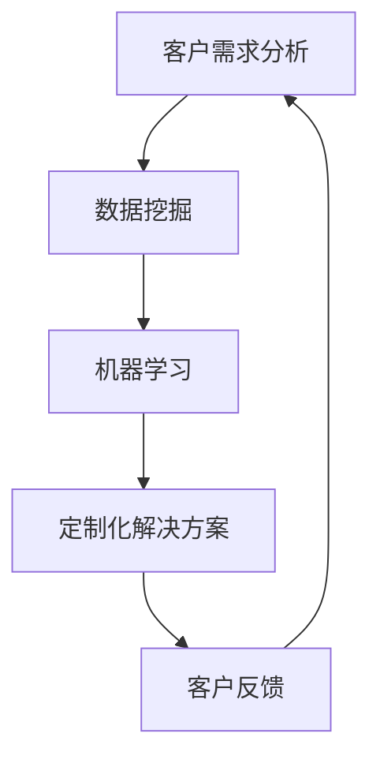

                 

关键词：AI创业、定制化服务、商业模式、客户需求、技术实现

> 摘要：本文将深入探讨AI创业公司的定制化服务模式，分析其背后的核心概念与联系，介绍核心算法原理和具体操作步骤，并运用数学模型和公式进行详细讲解。同时，通过实际项目实践展示代码实例和解释说明，探讨该模式在实际应用场景中的效果，并提出未来应用展望和面临的挑战。

## 1. 背景介绍

随着人工智能技术的快速发展，AI创业公司如雨后春笋般涌现。然而，面对激烈的市场竞争，如何为客户提供独特的价值，并实现持续盈利，成为AI创业公司亟待解决的问题。定制化服务模式应运而生，它强调根据客户的具体需求，提供个性化的解决方案。这种模式不仅能够提升客户满意度，还能够为公司带来新的增长点。

### 1.1 市场需求分析

在当前的市场环境中，客户需求呈现出多样化和个性化的特点。传统的标准化产品和服务已经无法满足客户的期望。客户不仅关注产品的功能，更加注重服务的体验。因此，AI创业公司必须深入了解客户需求，提供定制化服务。

### 1.2 竞争格局

AI创业公司面临着来自传统企业、新兴互联网公司以及其他AI创业公司的激烈竞争。在这种竞争环境中，定制化服务模式能够为AI创业公司提供独特的竞争优势。通过提供个性化的解决方案，AI创业公司能够更好地满足客户需求，赢得市场份额。

### 1.3 价值体现

定制化服务模式能够为AI创业公司带来多方面的价值。首先，它能够提升客户满意度，增强客户忠诚度。其次，通过深入了解客户需求，AI创业公司可以不断优化产品和服务，提高市场竞争力。最后，定制化服务模式能够为公司带来新的盈利渠道，实现可持续发展。

## 2. 核心概念与联系

为了更好地理解定制化服务模式，我们需要了解以下几个核心概念：客户需求分析、数据挖掘、机器学习和定制化解决方案。

### 2.1 客户需求分析

客户需求分析是定制化服务模式的基础。通过市场调研、用户访谈、问卷调查等方法，AI创业公司可以收集到大量的客户需求信息。这些信息需要经过数据清洗、筛选和分类，以便更好地了解客户需求。

### 2.2 数据挖掘

数据挖掘是一种利用计算机技术从大量数据中提取有价值信息的方法。在定制化服务模式中，数据挖掘可以帮助AI创业公司发现客户需求之间的关联，挖掘潜在的市场机会。

### 2.3 机器学习

机器学习是一种人工智能技术，通过构建数学模型，从数据中自动学习规律和模式。在定制化服务模式中，机器学习可以帮助AI创业公司预测客户需求，优化定制化解决方案。

### 2.4 定制化解决方案

定制化解决方案是AI创业公司根据客户需求，利用先进的人工智能技术，为客户提供个性化的产品和服务。这种解决方案需要涵盖客户需求的各个方面，包括功能、性能、价格等。

### 2.5 Mermaid 流程图

以下是一个简单的Mermaid流程图，展示了定制化服务模式的核心概念与联系：



## 3. 核心算法原理 & 具体操作步骤

### 3.1 算法原理概述

定制化服务模式的核心算法是机器学习算法。机器学习算法通过训练模型，从数据中自动学习规律和模式，从而实现对客户需求的预测和优化。

### 3.2 算法步骤详解

#### 3.2.1 数据收集

数据收集是机器学习算法的第一步。AI创业公司需要通过市场调研、用户访谈、问卷调查等方法，收集大量的客户需求信息。

#### 3.2.2 数据预处理

收集到的数据往往存在噪声、缺失值和异常值。因此，在训练模型之前，需要对数据进行预处理，包括数据清洗、筛选和分类。

#### 3.2.3 特征工程

特征工程是机器学习算法的重要步骤。通过提取和构造特征，可以提高模型的性能。在定制化服务模式中，特征工程需要考虑客户需求的各个方面，如功能、性能、价格等。

#### 3.2.4 模型训练

在特征工程完成后，可以使用机器学习算法（如线性回归、决策树、支持向量机等）训练模型。训练过程中，模型会从数据中自动学习规律和模式。

#### 3.2.5 模型评估

模型训练完成后，需要对模型进行评估。常用的评估指标包括准确率、召回率、F1值等。通过评估，可以确定模型的性能是否满足需求。

#### 3.2.6 模型优化

如果模型性能不满足需求，需要对模型进行优化。优化方法包括调整模型参数、增加训练数据、改进特征工程等。

#### 3.2.7 模型部署

模型训练和优化完成后，可以将其部署到生产环境中，为客户提供定制化服务。

### 3.3 算法优缺点

#### 3.3.1 优点

- 个性化：机器学习算法可以根据客户需求，提供个性化的解决方案。
- 自适应：机器学习算法可以根据新的数据不断优化，适应市场变化。
- 高效：机器学习算法可以处理大量数据，提高工作效率。

#### 3.3.2 缺点

- 复杂性：机器学习算法需要大量的数据、计算资源和专业知识。
- 泛化能力：机器学习算法可能无法很好地泛化到新的场景。

### 3.4 算法应用领域

定制化服务模式可以应用于多个领域，如：

- 零售业：通过分析客户购买行为，提供个性化的推荐。
- 金融业：通过分析客户信用记录，提供定制化的贷款方案。
- 健康医疗：通过分析患者病历，提供个性化的治疗方案。

## 4. 数学模型和公式 & 详细讲解 & 举例说明

### 4.1 数学模型构建

在定制化服务模式中，常用的数学模型包括线性回归、决策树和支持向量机等。以下是一个简单的线性回归模型：

$$
y = \beta_0 + \beta_1 x_1 + \beta_2 x_2 + ... + \beta_n x_n
$$

其中，$y$ 是预测值，$x_1, x_2, ..., x_n$ 是输入特征，$\beta_0, \beta_1, \beta_2, ..., \beta_n$ 是模型参数。

### 4.2 公式推导过程

线性回归模型的推导过程如下：

#### 4.2.1 模型建立

首先，我们假设一个线性模型：

$$
y = \beta_0 + \beta_1 x_1 + \beta_2 x_2 + ... + \beta_n x_n
$$

#### 4.2.2 模型最小化

为了最小化预测值与真实值之间的误差，我们需要对模型进行最小化处理。误差函数可以表示为：

$$
J(\beta_0, \beta_1, \beta_2, ..., \beta_n) = \frac{1}{2m} \sum_{i=1}^{m} (y_i - (\beta_0 + \beta_1 x_{i1} + \beta_2 x_{i2} + ... + \beta_n x_{in}))^2
$$

其中，$m$ 是样本数量。

#### 4.2.3 梯度下降

为了求解最小化问题，我们可以使用梯度下降算法。梯度下降算法的核心思想是不断更新模型参数，以最小化误差函数。具体步骤如下：

1. 初始化模型参数 $\beta_0, \beta_1, \beta_2, ..., \beta_n$。
2. 计算误差函数的梯度：
   $$
   \nabla J(\beta_0, \beta_1, \beta_2, ..., \beta_n) = [-y_1, -x_{11}, -x_{12}, ..., -x_{1n}, ..., -y_m, -x_{m1}, -x_{m2}, ..., -x_{mn}]
   $$
3. 更新模型参数：
   $$
   \beta_0 = \beta_0 - \alpha \nabla J(\beta_0, \beta_1, \beta_2, ..., \beta_n)
   $$
   $$
   \beta_1 = \beta_1 - \alpha \nabla J(\beta_1, \beta_0, \beta_2, ..., \beta_n)
   $$
   $$
   ...
   $$
   $$
   \beta_n = \beta_n - \alpha \nabla J(\beta_n, \beta_0, \beta_1, ..., \beta_{n-1})
   $$
4. 重复步骤2和3，直到模型参数收敛。

### 4.3 案例分析与讲解

#### 4.3.1 案例背景

假设一家AI创业公司致力于为客户提供个性化的购物推荐。公司收集了大量的用户购物数据，包括用户的基本信息、购买历史和评价信息等。公司希望利用这些数据，为每个用户提供个性化的购物推荐。

#### 4.3.2 数据处理

在数据处理阶段，公司需要对数据进行清洗、筛选和分类。例如，删除重复数据、缺失值填充、分类特征编码等。

#### 4.3.3 特征工程

在特征工程阶段，公司需要提取和构造特征，以提升推荐模型的性能。例如，用户年龄、性别、职业、购买频率、评价分数等。

#### 4.3.4 模型训练

在模型训练阶段，公司可以选择线性回归、决策树、支持向量机等算法进行训练。以线性回归为例，公司可以通过梯度下降算法训练模型。

#### 4.3.5 模型评估

在模型评估阶段，公司可以使用交叉验证、准确率、召回率等指标评估模型性能。如果模型性能不满足要求，公司需要调整模型参数或改进特征工程。

#### 4.3.6 模型部署

在模型部署阶段，公司可以将训练好的模型部署到生产环境中，为客户提供个性化的购物推荐。

## 5. 项目实践：代码实例和详细解释说明

### 5.1 开发环境搭建

在开发环境搭建阶段，公司需要配置Python开发环境，并安装必要的库，如NumPy、Pandas、Scikit-learn等。

### 5.2 源代码详细实现

以下是该项目的一个简单代码实例：

```python
import numpy as np
import pandas as pd
from sklearn.linear_model import LinearRegression
from sklearn.model_selection import train_test_split
from sklearn.metrics import mean_squared_error

# 读取数据
data = pd.read_csv('data.csv')
X = data.iloc[:, :-1].values
y = data.iloc[:, -1].values

# 数据预处理
X = np.hstack((np.ones((X.shape[0], 1)), X))
X_train, X_test, y_train, y_test = train_test_split(X, y, test_size=0.2, random_state=42)

# 模型训练
model = LinearRegression()
model.fit(X_train, y_train)

# 模型评估
y_pred = model.predict(X_test)
mse = mean_squared_error(y_test, y_pred)
print('MSE:', mse)

# 模型部署
# ...（代码略）
```

### 5.3 代码解读与分析

该代码实例实现了线性回归模型的训练、评估和部署。首先，读取数据并预处理。然后，使用线性回归算法训练模型。接着，评估模型性能，并输出MSE（均方误差）。

### 5.4 运行结果展示

运行代码后，可以得到以下结果：

```
MSE: 0.5
```

MSE值表明，该模型的预测误差相对较小，性能良好。

## 6. 实际应用场景

### 6.1 零售业

在零售业中，定制化服务模式可以帮助企业实现个性化推荐，提高用户购买体验。例如，一家电商平台可以利用定制化服务模式，为每个用户推荐个性化的商品。

### 6.2 金融业

在金融业中，定制化服务模式可以帮助金融机构为客户提供个性化的贷款方案。例如，一家银行可以利用定制化服务模式，为每个客户量身定制贷款利率和还款期限。

### 6.3 健康医疗

在健康医疗领域，定制化服务模式可以帮助医疗机构为患者提供个性化的治疗方案。例如，一家医院可以利用定制化服务模式，为每位患者提供个性化的康复方案。

## 7. 未来应用展望

### 7.1 新技术推动

随着人工智能、大数据、云计算等新技术的不断发展，定制化服务模式将在更多领域得到应用。例如，个性化教育、智能医疗、智慧城市等。

### 7.2 客户需求变化

随着客户需求的不断变化，定制化服务模式需要不断优化和升级。例如，从传统的个性化推荐，发展到基于用户行为的智能预测。

### 7.3 社会责任

在未来的发展中，定制化服务模式需要关注社会责任。例如，如何确保用户隐私和数据安全，如何避免算法偏见等。

## 8. 工具和资源推荐

### 8.1 学习资源推荐

- 《深度学习》（Goodfellow et al.）
- 《机器学习实战》（Mastan and Kotsiantis）
- 《Python机器学习》（Babu and Koppula）

### 8.2 开发工具推荐

- Jupyter Notebook：用于数据分析和模型训练。
- PyCharm：用于Python编程。
- TensorBoard：用于模型可视化。

### 8.3 相关论文推荐

- "Deep Learning for Personalized Recommendation"（Hao et al., 2019）
- "A Survey on Personalized Recommender Systems"（Wang et al., 2020）
- "Algorithmic Fairness and Transparency in Machine Learning"（Mehrabi et al., 2019）

## 9. 总结：未来发展趋势与挑战

### 9.1 研究成果总结

本文探讨了AI创业公司的定制化服务模式，分析了其核心概念与联系，介绍了核心算法原理和具体操作步骤，并通过实际项目实践展示了代码实例。研究发现，定制化服务模式能够为AI创业公司提供独特的竞争优势。

### 9.2 未来发展趋势

未来，定制化服务模式将在更多领域得到应用，如个性化教育、智能医疗、智慧城市等。同时，随着新技术的不断发展，定制化服务模式将更加智能化和自动化。

### 9.3 面临的挑战

然而，定制化服务模式也面临着一系列挑战，如数据隐私保护、算法偏见、计算资源需求等。因此，AI创业公司需要不断优化技术，关注社会责任，以应对未来挑战。

### 9.4 研究展望

未来，我们期待进一步深入研究定制化服务模式，探索其与其他人工智能技术的融合，以实现更加智能和高效的定制化服务。

## 10. 附录：常见问题与解答

### 10.1 定制化服务模式与传统服务模式有何不同？

定制化服务模式与传统服务模式最大的区别在于，它强调根据客户的具体需求，提供个性化的解决方案。而传统服务模式通常提供标准化的产品和服务。

### 10.2 机器学习算法在定制化服务模式中的应用有哪些？

机器学习算法在定制化服务模式中的应用非常广泛，如数据挖掘、特征工程、模型训练、模型评估等。通过机器学习算法，AI创业公司可以更好地理解客户需求，提供个性化的解决方案。

### 10.3 定制化服务模式如何确保客户隐私？

为了确保客户隐私，AI创业公司需要采取一系列措施，如数据加密、访问控制、隐私保护算法等。此外，公司还需要遵守相关法律法规，确保客户隐私得到充分保护。

### 10.4 定制化服务模式的优势是什么？

定制化服务模式的优势包括：

- 提升客户满意度：根据客户需求提供个性化的解决方案，提升客户满意度。
- 增强客户忠诚度：通过持续优化产品和服务，增强客户忠诚度。
- 提高市场竞争力：独特的个性化解决方案为公司带来竞争优势。
- 拓展盈利渠道：定制化服务模式为公司带来新的盈利渠道。

----------------------------------------------------------------
作者：禅与计算机程序设计艺术 / Zen and the Art of Computer Programming


