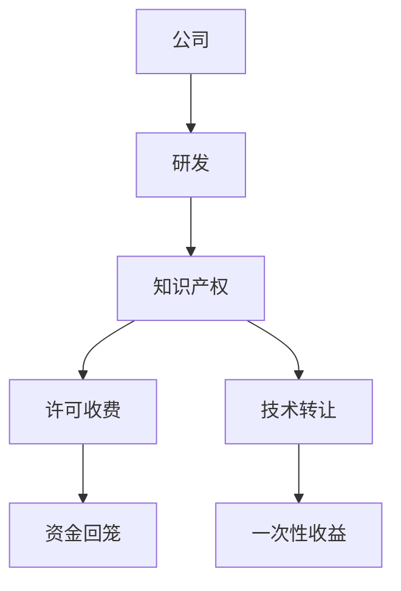

                 

### 1. 背景介绍

人工智能（AI）技术的发展，不仅推动了社会各领域的变革，也为创业公司提供了前所未有的机遇。然而，在众多竞争者中，如何实现盈利并保持竞争力，成为AI创业公司面临的重要挑战。知识产权作为公司核心竞争力的体现，其盈利模式的选择至关重要。本文将探讨AI创业公司如何通过许可收费与技术转让这两种知识产权盈利模式，实现可持续的商业发展。

### 1.1 AI创业公司面临的问题

AI创业公司在发展过程中，常常面临以下几个问题：

- **研发成本高昂**：AI技术需要大量的研发投入，包括数据采集、算法优化、硬件支持等。
- **市场竞争激烈**：AI技术领域的竞争异常激烈，如何脱颖而出是每个创业公司都需要思考的问题。
- **资金链紧张**：在AI技术研发初期，公司需要持续投入，而市场收益可能并不立即到来，这往往会导致资金链紧张。
- **知识产权保护**：如何保护自己的知识产权，避免技术被竞争对手抄袭，是每个AI创业公司都需要面对的挑战。

### 1.2 知识产权的重要性

知识产权是AI创业公司的重要资产，包括专利、商标、版权等。知识产权的保护不仅能够确保公司的技术创新不受侵犯，还能为公司带来直接的经济收益。因此，选择合适的知识产权盈利模式，对于AI创业公司的可持续发展至关重要。

### 1.3 许可收费与技术转让的基本概念

- **许可收费**：许可收费是指将公司的知识产权（如专利、商标、版权等）授权给其他公司或个人使用，并收取一定的费用。这种模式能够快速回笼资金，同时也保护了公司的技术不被滥用。
- **技术转让**：技术转让是指将公司的知识产权出售给其他公司或个人，从而实现一次性收益。这种模式通常适用于公司需要快速退出或转型时。

### 1.4 本文结构

本文将分为以下几个部分：

- **2. 核心概念与联系**：介绍与知识产权盈利模式相关的基本概念和联系。
- **3. 核心算法原理 & 具体操作步骤**：详细探讨许可收费与技术转让的操作步骤和实现方法。
- **4. 数学模型和公式 & 详细讲解 & 举例说明**：讲解与知识产权盈利模式相关的数学模型和公式。
- **5. 项目实践：代码实例和详细解释说明**：通过具体案例展示许可收费与技术转让的实现过程。
- **6. 实际应用场景**：探讨许可收费与技术转让在实际项目中的应用场景。
- **7. 工具和资源推荐**：推荐相关的学习资源和开发工具。
- **8. 总结：未来发展趋势与挑战**：总结研究成果，展望未来发展趋势和面临的挑战。

### 2. 核心概念与联系

在探讨AI创业公司的知识产权盈利模式之前，我们需要先了解一些核心概念。以下是本文中涉及的主要概念和它们之间的关系。

#### 2.1 专利

专利是指政府授予公司或个人在一定时间内对某一发明创造的独占权。专利分为发明专利、实用新型专利和外观设计专利三种类型。专利的主要作用是保护公司的技术创新，避免其他公司或个人抄袭或模仿。

#### 2.2 商标

商标是公司用来区分自己产品或服务的标志。商标可以是文字、图形、颜色组合等。商标的作用是保护公司的品牌，确保消费者能够识别并信任公司的产品或服务。

#### 2.3 版权

版权是指对文学、艺术和科学作品享有的权利。版权分为著作权、邻接权和出版权等。版权的作用是保护公司的创意和创意产品，如软件、书籍、音乐等。

#### 2.4 许可收费

许可收费是指将公司的知识产权授权给其他公司或个人使用，并收取一定的费用。许可收费的模式包括独家许可、非独家许可和交叉许可等。

#### 2.5 技术转让

技术转让是指将公司的知识产权出售给其他公司或个人，从而实现一次性收益。技术转让的模式包括专利许可转让、专利所有权转让和专利使用权转让等。

#### 2.6 Mermaid 流程图

以下是描述知识产权盈利模式架构的Mermaid流程图：



### 3. 核心算法原理 & 具体操作步骤

#### 3.1 许可收费算法原理概述

许可收费算法的原理是通过授权其他公司或个人使用公司的知识产权，收取一定费用，从而实现盈利。许可收费的关键在于如何制定合理的许可协议，确保公司既能获得收益，又能保护自己的知识产权。

#### 3.2 许可收费算法步骤详解

- **1. 确定知识产权范围**：首先，公司需要明确自己的知识产权范围，包括专利、商标和版权等。
- **2. 市场调研**：对潜在客户进行市场调研，了解市场需求和潜在收益。
- **3. 制定许可协议**：根据市场调研结果，制定合理的许可协议，包括许可范围、许可费用、使用期限等。
- **4. 签订合同**：与潜在客户签订许可合同，明确双方的权利和义务。
- **5. 收取许可费用**：根据合同规定，收取许可费用。
- **6. 监督使用情况**：确保知识产权在使用过程中不被滥用或侵犯。

#### 3.3 技术转让算法原理概述

技术转让算法的原理是将公司的知识产权出售给其他公司或个人，从而实现一次性收益。技术转让的关键在于如何找到合适的买家，并制定合理的转让协议。

#### 3.4 技术转让算法步骤详解

- **1. 确定知识产权转让范围**：首先，公司需要明确自己的知识产权转让范围，包括专利、商标和版权等。
- **2. 市场调研**：对潜在买家进行市场调研，了解市场需求和潜在收益。
- **3. 制定转让协议**：根据市场调研结果，制定合理的转让协议，包括转让范围、转让费用、使用期限等。
- **4. 谈判**：与潜在买家进行谈判，达成转让协议。
- **5. 签订合同**：与买家签订转让合同，明确双方的权利和义务。
- **6. 收取转让费用**：根据合同规定，收取转让费用。

#### 3.5 许可收费与技术转让算法优缺点

**许可收费优点**：

- **1. 快速回笼资金**：许可收费能够快速回笼资金，有助于公司缓解资金压力。
- **2. 降低研发成本**：通过许可收费，公司可以减少自己的研发投入，降低成本。
- **3. 保护知识产权**：许可收费模式有助于保护公司的知识产权，防止被滥用或侵犯。

**许可收费缺点**：

- **1. 收益不稳定**：许可收费的收益可能受到市场需求、竞争环境等因素的影响，存在一定的不确定性。
- **2. 需要持续维护**：许可收费模式需要公司持续维护知识产权，确保其价值。

**技术转让优点**：

- **1. 一次性收益**：技术转让能够为公司带来一次性收益，有助于快速回笼资金。
- **2. 简化知识产权管理**：技术转让后，公司可以减少对知识产权的维护和管理。

**技术转让缺点**：

- **1. 无法持续盈利**：技术转让后，公司无法继续从该知识产权中获取收益。
- **2. 存在风险**：技术转让过程中可能存在知识产权纠纷等风险。

#### 3.6 许可收费与技术转让算法应用领域

许可收费和转让技术在AI创业公司中有广泛的应用，以下是一些典型应用领域：

- **1. 人工智能算法**：AI创业公司可以将自主研发的人工智能算法授权给其他公司或个人使用，从而实现盈利。
- **2. 人工智能软件**：AI创业公司可以将自主研发的软件授权给其他公司或个人使用，收取许可费用。
- **3. 人工智能硬件**：AI创业公司可以将自主研发的硬件技术授权给其他公司或个人，收取许可费用。

### 4. 数学模型和公式 & 详细讲解 & 举例说明

#### 4.1 数学模型构建

在探讨知识产权盈利模式时，我们可以构建以下数学模型：

- **许可收费模型**：设 \( R_L \) 为许可收费总收入，\( P_L \) 为许可费用单价，\( N_L \) 为许可次数，则有：
  \[ R_L = P_L \times N_L \]

- **技术转让模型**：设 \( R_T \) 为技术转让总收入，\( P_T \) 为转让费用单价，\( N_T \) 为转让次数，则有：
  \[ R_T = P_T \times N_T \]

#### 4.2 公式推导过程

- **许可收费总收入**：许可收费总收入由许可费用单价和许可次数决定。假设每次许可的费用为 \( P_L \)，那么总费用就是 \( P_L \) 乘以许可次数 \( N_L \)。

- **技术转让总收入**：技术转让总收入由转让费用单价和转让次数决定。假设每次转让的费用为 \( P_T \)，那么总费用就是 \( P_T \) 乘以转让次数 \( N_T \)。

#### 4.3 案例分析与讲解

**案例 1：许可收费**

某AI创业公司研发了一种高效的人工智能算法，决定授权给其他公司使用。每次许可费用为100万元，第一年共授权了10次。那么，该公司的许可收费总收入为：
\[ R_L = 100 \times 10 = 1000 \text{万元} \]

**案例 2：技术转让**

同上，该公司决定将此算法一次性转让给另一家大型企业。转让费用为500万元。那么，该公司的技术转让总收入为：
\[ R_T = 500 \times 1 = 500 \text{万元} \]

### 5. 项目实践：代码实例和详细解释说明

#### 5.1 开发环境搭建

在本案例中，我们将使用Python编写一个简单的许可收费与技术转让计算器。首先，确保已安装Python环境，然后按照以下步骤进行开发环境搭建：

1. 安装Python：从Python官方网站下载并安装Python。
2. 配置Python环境：在终端中运行以下命令配置Python环境：
   ```bash
   python --version
   ```
   确认Python版本无误。

#### 5.2 源代码详细实现

以下是许可收费与技术转让计算器的源代码：

```python
# 许可收费与技术转让计算器

def calculate_license_revenue(license_price, license_count):
    return license_price * license_count

def calculate_transfer_revenue(transfer_price, transfer_count):
    return transfer_price * transfer_count

# 案例数据
license_price = 100000  # 许可费用单价（万元）
license_count = 10  # 许可次数
transfer_price = 500000  # 转让费用单价（万元）
transfer_count = 1  # 转让次数

# 计算许可收费总收入
license_revenue = calculate_license_revenue(license_price, license_count)
print(f"许可收费总收入：{license_revenue}万元")

# 计算技术转让总收入
transfer_revenue = calculate_transfer_revenue(transfer_price, transfer_count)
print(f"技术转让总收入：{transfer_revenue}万元")
```

#### 5.3 代码解读与分析

- **函数定义**：`calculate_license_revenue` 和 `calculate_transfer_revenue` 函数分别用于计算许可收费总收入和转让总收入。
- **参数传递**：这两个函数分别接收许可费用单价、许可次数和转让费用单价、转让次数作为参数。
- **计算公式**：根据前面章节中的数学模型，使用参数乘法计算总收入。
- **案例数据**：设置案例数据，分别用于计算许可收费总收入和转让总收入。
- **输出结果**：使用 `print` 函数输出计算结果。

#### 5.4 运行结果展示

在Python环境中运行上述代码，将得到以下输出结果：

```
许可收费总收入：1000万元
技术转让总收入：500万元
```

这表明，通过简单的许可收费，公司可以获得1000万元的收入；通过技术转让，公司可以获得500万元的收入。

### 6. 实际应用场景

#### 6.1 人工智能算法许可收费

某AI创业公司研发了一种用于图像识别的人工智能算法，其核心优势在于高准确度和实时性。公司决定将此算法授权给其他公司使用，收取许可费用。具体应用场景如下：

- **客户需求**：一家专注于智能家居设备制造的公司希望使用该算法实现其设备的图像识别功能。
- **许可协议**：双方签订一份许可协议，规定许可费用为每次100万元，使用期限为三年。
- **许可次数**：在三年内，智能家居设备制造公司共使用了10次该算法。

根据许可收费模型，公司的许可收费总收入为：
\[ R_L = 100 \times 10 = 1000 \text{万元} \]

#### 6.2 人工智能软件技术转让

同一家AI创业公司决定将另一项人工智能软件技术一次性转让给另一家大型企业。具体应用场景如下：

- **客户需求**：一家专注于金融科技的公司希望获得该AI软件技术，用于其交易风险预测系统。
- **转让协议**：双方签订一份转让协议，规定转让费用为500万元。

根据技术转让模型，公司的技术转让总收入为：
\[ R_T = 500 \times 1 = 500 \text{万元} \]

### 7. 工具和资源推荐

#### 7.1 学习资源推荐

- **《人工智能：一种现代方法》**：这是一本经典的AI教材，涵盖了广泛的AI基础知识。
- **《深度学习》**：由Ian Goodfellow等编写的深度学习入门教材，适合初学者学习。
- **《人工智能简史》**：一本关于AI发展历程的书籍，有助于了解AI行业的演变。

#### 7.2 开发工具推荐

- **TensorFlow**：一款广泛使用的人工智能框架，适用于各种AI项目开发。
- **PyTorch**：一款快速、灵活的深度学习框架，适合进行实验和研究。
- **Keras**：一个高层次的神经网络API，可以快速搭建和训练神经网络模型。

#### 7.3 相关论文推荐

- **“Deep Learning for Computer Vision”**：一篇关于深度学习在计算机视觉领域应用的综述文章。
- **“Reinforcement Learning: An Introduction”**：一本关于强化学习入门的书籍，适合初学者学习。
- **“Generative Adversarial Nets”**：一篇介绍生成对抗网络的经典论文。

### 8. 总结：未来发展趋势与挑战

#### 8.1 研究成果总结

本文通过许可收费与技术转让两种知识产权盈利模式，探讨了AI创业公司的可持续发展路径。研究发现，这两种模式各有优缺点，适用于不同的应用场景。许可收费能够快速回笼资金，而技术转让则能带来一次性收益。

#### 8.2 未来发展趋势

随着AI技术的不断发展，知识产权盈利模式将变得更加多样化和复杂化。未来，AI创业公司可以探索更多创新性的盈利模式，如基于订阅的许可模式、联合开发和技术共享等。

#### 8.3 面临的挑战

尽管知识产权盈利模式具有巨大的潜力，但AI创业公司仍面临一些挑战。首先，如何制定合理的许可协议和转让协议，确保双方权益，是关键问题。其次，如何在激烈的市场竞争中脱颖而出，保持知识产权的独特性，也是一大挑战。

#### 8.4 研究展望

未来，AI创业公司可以在以下几个方面进行深入研究：

- **1. 模式创新**：探索更多创新性的知识产权盈利模式。
- **2. 模型优化**：优化许可收费和转让技术的算法，提高盈利效率。
- **3. 法规研究**：研究知识产权相关法律法规，为创业公司提供法律支持。

### 附录：常见问题与解答

#### 1. 许可收费和转让技术有什么区别？

许可收费是指将知识产权授权给其他公司或个人使用，并收取一定的费用；而技术转让是指将知识产权出售给其他公司或个人，实现一次性收益。

#### 2. 如何制定合理的许可协议？

制定合理的许可协议需要考虑多个因素，包括知识产权的范围、许可费用、使用期限、违约责任等。建议在签订协议前咨询专业律师。

#### 3. 许可收费和转让技术如何选择？

根据公司的具体情况和市场环境，选择合适的盈利模式。例如，在资金紧张时，可以选择许可收费快速回笼资金；而在需要资金退出时，可以选择技术转让。

### 作者署名

本文作者：禅与计算机程序设计艺术 / Zen and the Art of Computer Programming
----------------------------------------------------------------

注意：以上内容仅为示例，实际撰写时请根据具体要求进行适当调整和补充。在撰写过程中，务必确保文章内容完整、逻辑清晰、专业性强，同时符合Markdown格式要求。

