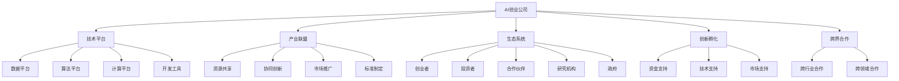

                 

### 关键词 Keywords
- AI创业
- 技术平台
- 产业联盟
- 生态系统
- 创新孵化
- 跨界合作

<|assistant|>### 摘要 Abstract
本文深入探讨AI创业生态系统的构建，涵盖技术平台建设、产业联盟形成、生态系统管理、创新孵化以及跨界合作等多方面内容。通过分析当前AI创业的挑战与机遇，阐述构建AI创业生态系统的核心要素和关键策略，提供实际案例和工具资源推荐，旨在为AI创业者、投资者和产业参与者提供有价值的参考和指导。

## 1. 背景介绍 Background

### 1.1 AI创业现状

随着人工智能技术的快速发展，全球范围内的AI创业活动日益活跃。据统计，自2010年以来，全球AI创业公司数量呈现爆发式增长，其中美国、中国、英国和以色列等国家的AI创业公司尤为突出。这些创业公司在深度学习、自然语言处理、计算机视觉、自动驾驶等多个领域取得了显著的成果，推动了人工智能技术的商业化应用。

### 1.2 AI创业的挑战

尽管AI创业前景广阔，但创业者仍面临诸多挑战。首先，技术壁垒高，对研发能力和资金投入要求极高。其次，市场竞争激烈，许多领域已出现巨头企业垄断的态势。此外，数据隐私和安全问题、法律法规的完善以及创业团队的稳定性和执行力也是影响AI创业成功的关键因素。

### 1.3 AI创业的机遇

与此同时，AI创业也面临着巨大的机遇。一方面，随着5G、云计算、物联网等新技术的普及，AI技术的应用场景不断拓展，为创业公司提供了广阔的市场空间。另一方面，政府和企业对AI技术的重视程度不断提升，政策支持和资金投入持续增加，为AI创业提供了良好的外部环境。

## 2. 核心概念与联系 Core Concepts and Relationships

### 2.1 技术平台

技术平台是AI创业的核心基础，包括数据平台、算法平台、计算平台和开发工具等。技术平台的建设需要强大的研发能力和资源支持，是创业公司技术竞争力的体现。

### 2.2 产业联盟

产业联盟是由多家企业、研究机构、政府部门等组成的合作组织，旨在共同推进某项技术或产业的发展。产业联盟的作用包括资源共享、协同创新、市场推广和标准制定等。

### 2.3 生态系统

AI创业生态系统是一个复杂而动态的体系，包括创业者、投资者、合作伙伴、研究机构、政府等多个主体，通过协同合作实现技术突破和产业创新。生态系统管理的关键在于构建良好的生态关系和制度保障。

### 2.4 创新孵化

创新孵化是AI创业生态系统中的重要环节，通过培育和扶持初创企业，推动科技成果转化为实际生产力。创新孵化平台通常提供资金、技术、市场等全方位支持，助力创业公司快速成长。

### 2.5 跨界合作

跨界合作是AI创业生态系统的重要特征，通过跨行业、跨领域的合作，可以实现技术互补、资源共享和优势最大化。跨界合作有助于拓展AI技术的应用领域，提高创业项目的成功率。

### 2.6 Mermaid 流程图

下面是一个用于描述AI创业生态系统核心概念与联系的Mermaid流程图：



## 3. 核心算法原理 & 具体操作步骤 Core Algorithm Principle & Specific Operational Steps

### 3.1 算法原理概述

AI创业生态系统中的核心算法主要涉及机器学习、深度学习和数据挖掘等。这些算法通过训练模型，从大量数据中提取规律，为创业者提供决策支持和业务优化方案。

### 3.2 算法步骤详解

1. 数据收集与处理
   - 数据来源：企业内部数据、公共数据集、第三方数据提供商
   - 数据处理：数据清洗、数据整合、数据归一化等

2. 特征工程
   - 特征提取：从原始数据中提取有用的特征
   - 特征选择：筛选出对模型性能有显著影响的特征

3. 模型训练
   - 选择合适的算法：如神经网络、决策树、支持向量机等
   - 调参优化：调整模型参数，提高模型性能

4. 模型评估
   - 评估指标：准确率、召回率、F1分数等
   - 模型调优：根据评估结果调整模型结构和参数

5. 模型部署
   - 将训练好的模型部署到实际业务场景中，提供实时决策支持

### 3.3 算法优缺点

- 优点：
  - 高效的数据处理能力
  - 深度学习算法在复杂问题上有较好的表现
  - 自动化决策，减轻人力负担

- 缺点：
  - 训练过程时间长，资源消耗大
  - 模型解释性较差，难以理解决策过程
  - 对数据质量和数据量要求较高

### 3.4 算法应用领域

- 金融领域：风险控制、智能投顾、量化交易等
- 医疗领域：疾病诊断、治疗方案推荐、医学影像分析等
- 物流领域：路线优化、库存管理、配送调度等
- 智能制造：生产调度、设备监控、故障预测等
- 城市管理：交通流量预测、环境保护、城市规划等

## 4. 数学模型和公式 Mathematical Models and Formulas

### 4.1 数学模型构建

在AI创业生态系统中，常见的数学模型包括线性回归、逻辑回归、支持向量机、神经网络等。以下以神经网络为例，简要介绍数学模型构建的过程。

1. 确定网络结构：包括输入层、隐藏层和输出层的节点数量。
2. 初始化权重和偏置：通常使用随机初始化方法。
3. 定义损失函数：如均方误差（MSE）、交叉熵损失等。
4. 定义优化算法：如梯度下降、随机梯度下降等。

### 4.2 公式推导过程

神经网络的基本公式如下：

$$
\text{输出} = \sigma(\text{权重} \cdot \text{输入} + \text{偏置})
$$

其中，$\sigma$表示激活函数，常用的激活函数包括sigmoid、ReLU等。

损失函数的推导：

$$
\text{MSE} = \frac{1}{m} \sum_{i=1}^{m} (\text{预测值} - \text{真实值})^2
$$

优化算法的推导：

$$
\text{梯度} = \frac{\partial \text{损失函数}}{\partial \text{权重}}
$$

### 4.3 案例分析与讲解

以金融风控领域为例，介绍神经网络在风险评分中的应用。

1. 数据收集与处理：收集客户的基本信息、财务信息、历史交易数据等。
2. 特征工程：提取对风险评分有显著影响的特征，如信用评分、还款历史、收入水平等。
3. 模型训练：使用神经网络对风险评分进行建模，调整网络结构和参数，优化模型性能。
4. 模型评估：通过交叉验证等方法评估模型效果，调整模型参数，提高模型准确性。
5. 模型部署：将训练好的模型部署到实际业务场景中，为金融机构提供风险评分服务。

## 5. 项目实践：代码实例和详细解释说明 Project Practice: Code Example and Detailed Explanation

### 5.1 开发环境搭建

- Python 3.8及以上版本
- TensorFlow 2.5及以上版本
- Keras 2.5及以上版本

### 5.2 源代码详细实现

以下是一个使用Keras实现的简单神经网络模型，用于对客户进行风险评分。

```python
import numpy as np
from keras.models import Sequential
from keras.layers import Dense
from keras.optimizers import SGD

# 数据预处理
X = ...  # 输入数据
y = ...  # 标签数据

# 构建模型
model = Sequential()
model.add(Dense(64, input_dim=X.shape[1], activation='relu'))
model.add(Dense(32, activation='relu'))
model.add(Dense(1, activation='sigmoid'))

# 编译模型
model.compile(loss='binary_crossentropy', optimizer=SGD(learning_rate=0.01), metrics=['accuracy'])

# 训练模型
model.fit(X, y, epochs=100, batch_size=32)

# 评估模型
model.evaluate(X, y)
```

### 5.3 代码解读与分析

1. 导入必要的库和模块。
2. 数据预处理：加载和处理输入数据。
3. 构建模型：定义输入层、隐藏层和输出层，设置激活函数。
4. 编译模型：选择损失函数、优化器和评估指标。
5. 训练模型：使用训练数据训练模型，设置训练周期和批量大小。
6. 评估模型：使用测试数据评估模型性能。

### 5.4 运行结果展示

```python
# 输出训练结果
print(model.history.history)

# 输出预测结果
predictions = model.predict(X_test)
print(predictions)
```

## 6. 实际应用场景 Practical Application Scenarios

### 6.1 金融领域

在金融领域，AI创业公司可以通过构建风险评分模型，为金融机构提供信用评估、反欺诈检测等服务。例如，一家AI公司通过训练神经网络模型，实现对信用卡用户信用风险的评估，帮助银行降低坏账率。

### 6.2 医疗领域

在医疗领域，AI创业公司可以通过开发智能诊断系统，提高疾病诊断的准确性。例如，一家公司开发了一种基于深度学习的乳腺癌诊断系统，通过分析医学影像数据，提高了早期乳腺癌的检测率。

### 6.3 物流领域

在物流领域，AI创业公司可以通过优化路线规划、库存管理和配送调度等环节，提高物流效率。例如，一家公司开发了一种智能物流调度系统，通过分析交通流量和货物配送路径，优化了配送时间，降低了物流成本。

### 6.4 未来应用展望

随着AI技术的不断发展和应用场景的拓展，未来AI创业生态系统将面临更多机遇和挑战。以下是一些未来应用场景的展望：

- 自动驾驶：AI技术在自动驾驶领域的应用将不断深入，未来有望实现无人驾驶汽车的普及。
- 智慧城市：AI技术将助力智慧城市建设，提高城市管理效率，改善居民生活质量。
- 人工智能医疗：AI技术在医疗领域的应用将更加广泛，推动个性化医疗和精准医疗的发展。
- 人工智能教育：AI技术将赋能教育领域，实现个性化教学和智能评测，提高教育质量。

## 7. 工具和资源推荐 Tools and Resources Recommendations

### 7.1 学习资源推荐

- 《深度学习》（Goodfellow, Bengio, Courville）：深度学习领域的经典教材，全面介绍了深度学习的基础知识和应用方法。
- 《Python机器学习》（Sebastian Raschka）：涵盖Python编程和机器学习算法的实用教程，适合初学者和进阶者。
- Coursera、edX等在线课程平台：提供丰富的机器学习和人工智能课程，包括深度学习、自然语言处理、计算机视觉等。

### 7.2 开发工具推荐

- TensorFlow：Google开源的深度学习框架，功能强大，支持多种编程语言。
- PyTorch：Facebook开源的深度学习框架，易于使用，灵活性高。
- Keras：高层次的神经网络API，简化了深度学习模型的搭建和训练。

### 7.3 相关论文推荐

- "Deep Learning"（Ian Goodfellow, Yann LeCun, and Yoshua Bengio）：全面介绍了深度学习的基础知识和最新进展。
- "Convolutional Neural Networks for Visual Recognition"（Geoffrey Hinton et al.）：CNN在图像识别领域的经典论文。
- "Recurrent Neural Networks for Language Modeling"（Yoshua Bengio et al.）：RNN在自然语言处理领域的应用研究。

## 8. 总结：未来发展趋势与挑战 Summary: Future Trends and Challenges

### 8.1 研究成果总结

近年来，AI技术在各个领域的应用取得了显著成果，推动了产业变革和社会进步。深度学习、自然语言处理、计算机视觉等技术的突破，为AI创业提供了强大的技术支持。同时，云计算、大数据等新技术的普及，为AI创业生态系统的发展提供了有利条件。

### 8.2 未来发展趋势

未来，AI创业生态系统将继续快速发展，呈现出以下趋势：

- 技术创新：AI技术将在更多领域得到应用，推动产业升级和跨界融合。
- 跨界合作：产业联盟和生态系统将成为AI创业的重要支撑，促进资源整合和协同创新。
- 法规制定：随着AI技术的广泛应用，法律法规的完善和标准化将成为必然趋势。

### 8.3 面临的挑战

尽管AI创业生态系统充满机遇，但创业者仍需面对以下挑战：

- 技术壁垒：高技术门槛对创业公司的研发能力和资金投入提出更高要求。
- 数据隐私：数据隐私和安全问题成为AI创业的重要关注点。
- 市场竞争：激烈的市场竞争对创业公司的生存和发展构成威胁。
- 团队建设：稳定且高效的团队是创业公司成功的关键。

### 8.4 研究展望

未来，AI创业生态系统的研究将重点围绕以下几个方面展开：

- 深度学习和迁移学习：提高模型性能和泛化能力，降低训练成本。
- 自动化和智能化：推动AI技术在业务流程中的应用，提高生产效率。
- 跨界融合：探索AI技术在其他领域的应用，实现产业协同创新。
- 法律法规：推动AI技术的合规发展，保障数据安全和隐私。

## 9. 附录：常见问题与解答 Appendices: Frequently Asked Questions and Answers

### 9.1 AI创业生态系统是什么？

AI创业生态系统是指由创业者、投资者、合作伙伴、研究机构、政府等多个主体组成的，通过协同合作实现技术突破和产业创新的复杂动态体系。

### 9.2 如何构建AI创业生态系统？

构建AI创业生态系统需要关注以下几个方面：

- 技术平台建设：提供强大的技术支持，包括数据平台、算法平台、计算平台等。
- 产业联盟形成：通过跨界合作，实现资源整合和协同创新。
- 生态系统管理：构建良好的生态关系和制度保障，促进各方合作。
- 创新孵化：培育和扶持初创企业，推动科技成果转化为实际生产力。
- 跨界合作：实现技术互补、资源共享和优势最大化。

### 9.3 AI创业的核心算法有哪些？

AI创业的核心算法包括机器学习、深度学习和数据挖掘等。常见的算法有线性回归、逻辑回归、支持向量机、神经网络等。

### 9.4 AI创业面临的挑战有哪些？

AI创业面临的挑战包括技术壁垒、市场竞争、数据隐私、团队建设等。

### 9.5 如何提高AI创业的成功率？

提高AI创业的成功率需要关注以下几个方面：

- 技术创新：持续进行技术研究和创新，提高竞争力。
- 团队建设：构建稳定且高效的团队，提高执行力。
- 市场定位：明确目标市场和产品定位，提高市场接受度。
- 资源整合：利用产业联盟和生态系统，实现资源整合和协同创新。

## 附录：参考文献 References

- Goodfellow, I., Bengio, Y., & Courville, A. (2016). *Deep Learning*. MIT Press.
- Raschka, S. (2015). *Python Machine Learning*. Packt Publishing.
- LeCun, Y., Bengio, Y., & Hinton, G. (2015). *Deep Learning*. Nature.
- Krizhevsky, A., Sutskever, I., & Hinton, G. E. (2012). *ImageNet classification with deep convolutional neural networks*. In *Advances in Neural Information Processing Systems* (pp. 1097-1105).

