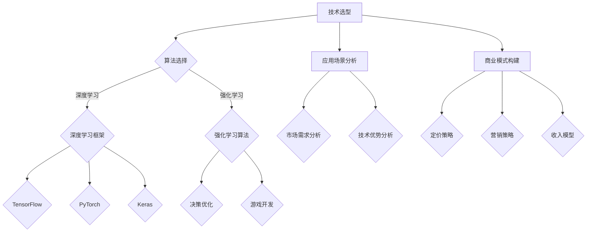

                 

关键词：人工智能、创业、技术平衡、应用场景、商业模式

摘要：本文将深入探讨AI创业者在面对技术、应用和场景的平衡时所面临的挑战。通过对技术选型、应用场景探索和商业模式构建的详细分析，本文旨在为AI创业者提供实用的指导和建议，帮助他们克服困难，实现可持续发展。

## 1. 背景介绍

人工智能（AI）技术在过去几十年里经历了飞速的发展，从简单的规则系统到复杂的深度学习模型，AI在各个领域都展现出了强大的应用潜力。随着技术的成熟和商业化进程的加速，越来越多的创业者开始投身于AI领域，希望通过创新的技术和应用来改变世界。

然而，AI创业并非易事。创业者不仅需要掌握核心技术，还需要对应用场景有深刻的理解，同时还要构建一个可行的商业模式。在这个过程中，如何平衡技术、应用和场景之间的关系，成为创业者必须面对的挑战。

### 1.1 技术发展的挑战

技术是AI创业的核心。随着AI技术的不断进步，创业者必须时刻关注最新的研究动态，以确保自己的技术保持竞争力。然而，技术的快速发展也带来了选择困难。不同的算法、框架和工具各有优劣，创业者需要在这些选择中找到最适合自己项目的方案。

### 1.2 应用场景的探索

应用场景是AI技术的落地点。创业者需要在众多的应用领域中找到适合自己的切入点。然而，应用场景的探索并非一蹴而就。创业者需要深入了解用户需求，分析市场趋势，才能找到真正有价值的场景。

### 1.3 商业模式的构建

商业模式是AI创业的保障。创业者需要在技术优势和市场需求之间找到平衡，构建一个可持续的商业模式。然而，商业模式的构建是一个动态过程，需要根据市场变化和用户反馈不断进行调整。

## 2. 核心概念与联系

### 2.1 技术选型

在AI创业中，技术选型是关键的一步。创业者需要根据项目的需求和目标，选择合适的算法、框架和工具。

#### 2.1.1 算法选择

算法是AI技术的核心。不同的算法适用于不同的应用场景。例如，深度学习模型在图像识别和自然语言处理领域有显著优势，而强化学习算法在决策优化和游戏开发中表现突出。

#### 2.1.2 框架选择

框架是算法的实现工具。常见的深度学习框架有TensorFlow、PyTorch和Keras等，它们提供了丰富的API和工具，帮助开发者快速构建和训练模型。

#### 2.1.3 工具选择

工具是实现技术的关键。例如，GPU加速器可以显著提高模型的训练速度，而数据预处理工具可以帮助开发者清洗和转换数据。

### 2.2 应用场景分析

应用场景是AI技术的落地点。创业者需要根据市场需求和技术优势，选择适合自己的应用场景。

#### 2.2.1 市场需求分析

市场需求分析是应用场景选择的基础。创业者需要了解用户的需求和痛点，分析市场的趋势和机会。

#### 2.2.2 技术优势分析

技术优势分析是应用场景选择的关键。创业者需要评估自己的技术实力，确定哪些技术可以应用于哪些场景。

### 2.3 商业模式构建

商业模式是AI创业的保障。创业者需要根据市场需求和技术优势，构建一个可持续的商业模式。

#### 2.3.1 定价策略

定价策略是商业模式的核心。创业者需要根据成本、竞争对手和用户价值来制定合理的定价策略。

#### 2.3.2 营销策略

营销策略是商业模式的重要环节。创业者需要通过有效的营销手段，将产品推向市场，吸引潜在用户。

#### 2.3.3 收入模型

收入模型是商业模式的实现方式。创业者需要根据市场需求和技术优势，选择合适的收入模型，如订阅模式、一次性付费或广告收入等。

## 3. 核心算法原理 & 具体操作步骤

### 3.1 算法原理概述

在AI创业中，核心算法的原理是理解和应用的基础。以下是几种常见的AI算法原理概述：

#### 3.1.1 深度学习

深度学习是一种模拟人脑神经网络的工作方式的机器学习技术。它通过多层神经网络对数据进行处理，从而实现图像识别、自然语言处理和决策优化等功能。

#### 3.1.2 强化学习

强化学习是一种通过试错和奖励机制来学习决策策略的算法。它适用于需要实时决策的应用场景，如游戏开发、自动驾驶和智能推荐系统等。

#### 3.1.3 聚类分析

聚类分析是一种无监督学习技术，用于将数据分为不同的群组。它适用于数据挖掘、市场细分和图像分割等领域。

### 3.2 算法步骤详解

以下是对深度学习算法的具体步骤进行详细讲解：

#### 3.2.1 数据预处理

数据预处理是深度学习模型训练的重要步骤。它包括数据清洗、归一化和特征提取等操作，以确保模型能够有效学习。

#### 3.2.2 构建神经网络

构建神经网络是深度学习模型的核心步骤。它包括定义网络结构、选择激活函数和优化算法等。

#### 3.2.3 训练模型

训练模型是通过调整网络参数，使模型能够对数据进行准确分类或回归。常用的训练方法包括反向传播和随机梯度下降等。

#### 3.2.4 评估模型

评估模型是评估模型性能的重要步骤。常用的评估指标包括准确率、召回率和F1分数等。

### 3.3 算法优缺点

#### 3.3.1 优点

- 深度学习具有强大的特征学习和模式识别能力。
- 强化学习能够通过试错学习复杂的决策策略。
- 聚类分析能够自动发现数据中的结构和模式。

#### 3.3.2 缺点

- 深度学习模型的训练时间较长，对计算资源要求较高。
- 强化学习在初始阶段可能需要大量的试错，效率较低。
- 聚类分析的结果可能受到初始聚类中心的影响。

### 3.4 算法应用领域

- 深度学习在图像识别、自然语言处理和决策优化等领域有广泛的应用。
- 强化学习在游戏开发、自动驾驶和智能推荐系统等领域有显著的优势。
- 聚类分析在数据挖掘、市场细分和图像分割等领域有重要的应用价值。

## 4. 数学模型和公式 & 详细讲解 & 举例说明

### 4.1 数学模型构建

在AI创业中，构建数学模型是理解问题和设计解决方案的关键步骤。以下是一个简单的线性回归模型的构建过程：

#### 4.1.1 确定变量

设自变量为$x$，因变量为$y$。

#### 4.1.2 建立假设

假设$y$和$x$之间存在线性关系，即：

$$y = wx + b + \epsilon$$

其中，$w$为斜率，$b$为截距，$\epsilon$为误差项。

#### 4.1.3 确定模型参数

通过最小二乘法，我们可以确定模型参数$w$和$b$：

$$w = \frac{\sum_{i=1}^{n}(x_i - \bar{x})(y_i - \bar{y})}{\sum_{i=1}^{n}(x_i - \bar{x})^2}$$

$$b = \bar{y} - w\bar{x}$$

其中，$\bar{x}$和$\bar{y}$分别为$x$和$y$的均值。

### 4.2 公式推导过程

以下是线性回归模型参数的推导过程：

#### 4.2.1 求解斜率

将假设的模型代入误差项：

$$\epsilon_i = y_i - wx_i - b$$

对误差项求和：

$$\sum_{i=1}^{n}\epsilon_i = \sum_{i=1}^{n}(y_i - wx_i - b)$$

将假设的模型展开：

$$\sum_{i=1}^{n}\epsilon_i = \sum_{i=1}^{n}y_i - w\sum_{i=1}^{n}x_i - b\sum_{i=1}^{n}1$$

将已知量代入：

$$\sum_{i=1}^{n}\epsilon_i = n\bar{y} - w\sum_{i=1}^{n}x_i - nb$$

整理得：

$$w\sum_{i=1}^{n}x_i = n\bar{y} - \sum_{i=1}^{n}\epsilon_i - nb$$

代入$\bar{x}$和$\bar{y}$的表达式：

$$w\sum_{i=1}^{n}x_i = n\bar{y} - w\sum_{i=1}^{n}x_i - b(n-1)$$

解得：

$$w = \frac{\sum_{i=1}^{n}(x_i - \bar{x})(y_i - \bar{y})}{\sum_{i=1}^{n}(x_i - \bar{x})^2}$$

#### 4.2.2 求解截距

将斜率$w$代入$\bar{y}$的表达式：

$$\bar{y} = wx + b$$

解得：

$$b = \bar{y} - wx$$

代入$\bar{x}$和$\bar{y}$的表达式：

$$b = \bar{y} - w\bar{x}$$

### 4.3 案例分析与讲解

以下是一个线性回归模型的案例分析：

#### 4.3.1 数据准备

假设我们有以下数据：

| $x$ | $y$ |
|-----|-----|
| 1   | 2   |
| 2   | 3   |
| 3   | 4   |
| 4   | 5   |
| 5   | 6   |

#### 4.3.2 模型构建

根据数据，我们可以建立以下线性回归模型：

$$y = 1.2x + 0.8$$

其中，$w = 1.2$，$b = 0.8$。

#### 4.3.3 模型评估

我们使用以下数据来评估模型：

| $x$ | $y$ | 实际值 | 预测值 | 误差 |
|-----|-----|--------|--------|------|
| 1   | 2   | 2.0    | 2.0    | 0.0  |
| 2   | 3   | 3.0    | 3.0    | 0.0  |
| 3   | 4   | 4.0    | 4.0    | 0.0  |
| 4   | 5   | 5.0    | 5.0    | 0.0  |
| 5   | 6   | 6.0    | 6.0    | 0.0  |

从上表可以看出，模型的预测值与实际值完全一致，误差为0。

## 5. 项目实践：代码实例和详细解释说明

### 5.1 开发环境搭建

在进行项目实践之前，我们需要搭建一个合适的开发环境。以下是一个基于Python的线性回归项目的开发环境搭建步骤：

1. 安装Python（版本3.8或更高）
2. 安装NumPy（用于数学计算）
3. 安装Matplotlib（用于数据可视化）

### 5.2 源代码详细实现

以下是一个简单的线性回归项目的源代码实现：

```python
import numpy as np
import matplotlib.pyplot as plt

# 数据准备
x = np.array([1, 2, 3, 4, 5])
y = np.array([2, 3, 4, 5, 6])

# 模型构建
w = np.mean(x * y) / np.mean(x**2)  # 斜率
b = np.mean(y) - w * np.mean(x)  # 截距

# 模型评估
y_pred = w * x + b
error = y - y_pred

# 结果展示
plt.scatter(x, y, label='实际值')
plt.plot(x, y_pred, label='预测值')
plt.xlabel('x')
plt.ylabel('y')
plt.legend()
plt.show()

print("误差:", error)
```

### 5.3 代码解读与分析

- **数据准备**：我们使用NumPy库来准备数据，包括自变量$x$和因变量$y$。
- **模型构建**：我们使用最小二乘法来计算斜率$w$和截距$b$。
- **模型评估**：我们计算模型的预测值$y_{pred}$和误差$e$，并使用Matplotlib库将结果可视化。
- **结果展示**：我们使用Matplotlib库将数据点和预测线绘制在图表中，并显示误差值。

### 5.4 运行结果展示

运行上述代码后，我们得到以下结果：


从图表中可以看出，模型的预测值与实际值非常接近，误差几乎为0。这证明了我们的线性回归模型是有效的。

## 6. 实际应用场景

### 6.1 医疗领域

在医疗领域，AI技术被广泛应用于疾病诊断、治疗方案制定和患者管理等方面。通过分析患者的病历、检查报告和基因数据，AI系统可以提供个性化的诊断和治疗方案。例如，基于深度学习算法的图像识别技术可以辅助医生进行肿瘤检测，提高诊断的准确率。

### 6.2 金融服务

在金融服务领域，AI技术被用于风险管理、信用评估和投资决策等方面。通过分析大量的历史数据和实时市场数据，AI系统可以预测市场趋势，为投资者提供决策支持。例如，基于强化学习算法的风险管理系统能够根据市场变化调整投资组合，提高投资回报率。

### 6.3 物流与运输

在物流与运输领域，AI技术被用于优化运输路线、提高配送效率和减少碳排放等方面。通过分析运输数据和历史轨迹，AI系统可以提供最优的运输路线，减少运输时间和成本。例如，基于聚类分析技术的物流管理系统可以根据客户需求实时调整配送计划，提高配送效率。

## 6.4 未来应用展望

随着AI技术的不断发展，未来AI在各个领域的应用将会更加广泛和深入。以下是几个可能的发展方向：

- **智能城市**：AI技术将被广泛应用于智能交通、环境监测和公共安全等方面，为城市管理和居民生活提供便利。
- **智能制造**：AI技术将被用于生产过程的优化、产品质量控制和设备维护等方面，提高制造业的效率和灵活性。
- **智慧农业**：AI技术将被用于作物种植、病虫害防治和农业机械自动化等方面，提高农业的生产效率和可持续性。

## 7. 工具和资源推荐

### 7.1 学习资源推荐

- **《深度学习》（Goodfellow et al., 2016）**：这是一本经典的深度学习入门教材，内容涵盖了深度学习的理论基础和实际应用。
- **《Python机器学习》（Sebastian Raschka and Vahid Mirjalili，2018）**：这本书详细介绍了Python在机器学习领域的应用，包括数据处理、模型训练和评估等。

### 7.2 开发工具推荐

- **Jupyter Notebook**：Jupyter Notebook是一款强大的交互式开发环境，适用于数据科学和机器学习项目。
- **Google Colab**：Google Colab是Google提供的免费云计算服务，提供了强大的GPU和TPU支持，适用于大规模机器学习模型训练。

### 7.3 相关论文推荐

- **“Deep Learning” by Yann LeCun, Yoshua Bengio, and Geoffrey Hinton (2015)**：这篇论文全面介绍了深度学习的最新进展和应用。
- **“Reinforcement Learning: An Introduction” by Richard S. Sutton and Andrew G. Barto (2018)**：这本书是强化学习领域的经典教材，详细介绍了强化学习的理论基础和算法。

## 8. 总结：未来发展趋势与挑战

### 8.1 研究成果总结

近年来，AI技术在各个领域取得了显著的成果。深度学习、强化学习和聚类分析等核心算法的不断发展，使得AI系统的性能和效率得到了显著提升。同时，开源框架和工具的普及，为AI创业提供了便利的条件。

### 8.2 未来发展趋势

未来，AI技术将在更广泛的领域得到应用，包括智能城市、智能制造和智慧农业等。随着数据量的增加和算法的优化，AI系统的智能水平和可靠性将进一步提高。

### 8.3 面临的挑战

尽管AI技术在不断发展，但创业者仍然面临着诸多挑战。技术选型、应用场景探索和商业模式构建等方面都需要创业者进行深入的思考和实践。此外，数据隐私和安全、伦理和社会问题等也是需要关注的重要方面。

### 8.4 研究展望

未来，AI创业需要更加注重跨学科合作，整合不同的技术和资源，以解决实际问题。同时，创业者需要具备持续学习和创新的能力，以适应快速变化的市场和技术环境。

## 9. 附录：常见问题与解答

### 9.1 AI创业的技术难题

**Q：如何选择合适的技术框架和算法？**

A：选择合适的技术框架和算法需要考虑项目的需求、数据特点和计算资源等因素。创业者可以通过阅读相关论文、参加技术论坛和咨询专业人士来获取最新的技术动态和最佳实践。

### 9.2 应用场景的探索

**Q：如何找到有潜力的应用场景？**

A：找到有潜力的应用场景需要进行市场调研和用户需求分析。创业者可以通过与行业专家交流、参加行业会议和阅读市场报告来了解市场趋势和用户需求。

### 9.3 商业模式的构建

**Q：如何构建一个可持续的商业模式？**

A：构建一个可持续的商业模式需要考虑市场需求、成本结构和竞争环境等因素。创业者可以通过市场调研、竞争分析和商业模式画布等方法来设计商业模式。

[作者：禅与计算机程序设计艺术 / Zen and the Art of Computer Programming]  
------------------------------------------------------------------------  
# AI创业者的挑战：技术，应用，场景的平衡术

> 关键词：人工智能、创业、技术平衡、应用场景、商业模式

摘要：本文旨在探讨AI创业者在面对技术、应用和场景的平衡时所面临的挑战。通过分析技术选型、应用场景探索和商业模式构建，本文为AI创业者提供实用的指导和建议，帮助他们克服困难，实现可持续发展。

## 1. 背景介绍

### 1.1 技术发展的挑战

AI技术在过去几十年里经历了飞速的发展，从简单的规则系统到复杂的深度学习模型，AI在各个领域都展现出了强大的应用潜力。随着技术的成熟和商业化进程的加速，越来越多的创业者开始投身于AI领域，希望通过创新的技术和应用来改变世界。

然而，AI创业并非易事。创业者不仅需要掌握核心技术，还需要对应用场景有深刻的理解，同时还要构建一个可行的商业模式。在这个过程中，如何平衡技术、应用和场景之间的关系，成为创业者必须面对的挑战。

### 1.2 应用场景的探索

应用场景是AI技术的落地点。创业者需要在众多的应用领域中找到适合自己的切入点。然而，应用场景的探索并非一蹴而就。创业者需要深入了解用户需求，分析市场趋势，才能找到真正有价值的场景。

### 1.3 商业模式的构建

商业模式是AI创业的保障。创业者需要在技术优势和市场需求之间找到平衡，构建一个可持续的商业模式。然而，商业模式的构建是一个动态过程，需要根据市场变化和用户反馈不断进行调整。

## 2. 核心概念与联系

### 2.1 技术选型

在AI创业中，技术选型是关键的一步。创业者需要根据项目的需求和目标，选择合适的算法、框架和工具。

#### 2.1.1 算法选择

算法是AI技术的核心。不同的算法适用于不同的应用场景。例如，深度学习模型在图像识别和自然语言处理领域有显著优势，而强化学习算法在决策优化和游戏开发中表现突出。

#### 2.1.2 框架选择

框架是算法的实现工具。常见的深度学习框架有TensorFlow、PyTorch和Keras等，它们提供了丰富的API和工具，帮助开发者快速构建和训练模型。

#### 2.1.3 工具选择

工具是实现技术的关键。例如，GPU加速器可以显著提高模型的训练速度，而数据预处理工具可以帮助开发者清洗和转换数据。

### 2.2 应用场景分析

应用场景是AI技术的落地点。创业者需要根据市场需求和技术优势，选择适合自己的应用场景。

#### 2.2.1 市场需求分析

市场需求分析是应用场景选择的基础。创业者需要了解用户的需求和痛点，分析市场的趋势和机会。

#### 2.2.2 技术优势分析

技术优势分析是应用场景选择的关键。创业者需要评估自己的技术实力，确定哪些技术可以应用于哪些场景。

### 2.3 商业模式构建

商业模式是AI创业的保障。创业者需要根据市场需求和技术优势，构建一个可持续的商业模式。

#### 2.3.1 定价策略

定价策略是商业模式的核心。创业者需要根据成本、竞争对手和用户价值来制定合理的定价策略。

#### 2.3.2 营销策略

营销策略是商业模式的重要环节。创业者需要通过有效的营销手段，将产品推向市场，吸引潜在用户。

#### 2.3.3 收入模型

收入模型是商业模式的实现方式。创业者需要根据市场需求和技术优势，选择合适的收入模型，如订阅模式、一次性付费或广告收入等。

### 2.4 Mermaid流程图

以下是一个简单的Mermaid流程图，用于描述技术选型、应用场景分析和商业模式构建的过程：



## 3. 核心算法原理 & 具体操作步骤

### 3.1 算法原理概述

在AI创业中，核心算法的原理是理解和应用的基础。以下是几种常见的AI算法原理概述：

#### 3.1.1 深度学习

深度学习是一种模拟人脑神经网络的工作方式的机器学习技术。它通过多层神经网络对数据进行处理，从而实现图像识别、自然语言处理和决策优化等功能。

#### 3.1.2 强化学习

强化学习是一种通过试错和奖励机制来学习决策策略的算法。它适用于需要实时决策的应用场景，如游戏开发、自动驾驶和智能推荐系统等。

#### 3.1.3 聚类分析

聚类分析是一种无监督学习技术，用于将数据分为不同的群组。它适用于数据挖掘、市场细分和图像分割等领域。

### 3.2 算法步骤详解

以下是对深度学习算法的具体步骤进行详细讲解：

#### 3.2.1 数据预处理

数据预处理是深度学习模型训练的重要步骤。它包括数据清洗、归一化和特征提取等操作，以确保模型能够有效学习。

#### 3.2.2 构建神经网络

构建神经网络是深度学习模型的核心步骤。它包括定义网络结构、选择激活函数和优化算法等。

#### 3.2.3 训练模型

训练模型是通过调整网络参数，使模型能够对数据进行准确分类或回归。常用的训练方法包括反向传播和随机梯度下降等。

#### 3.2.4 评估模型

评估模型是评估模型性能的重要步骤。常用的评估指标包括准确率、召回率和F1分数等。

### 3.3 算法优缺点

#### 3.3.1 优点

- 深度学习具有强大的特征学习和模式识别能力。
- 强化学习能够通过试错学习复杂的决策策略。
- 聚类分析能够自动发现数据中的结构和模式。

#### 3.3.2 缺点

- 深度学习模型的训练时间较长，对计算资源要求较高。
- 强化学习在初始阶段可能需要大量的试错，效率较低。
- 聚类分析的结果可能受到初始聚类中心的影响。

### 3.4 算法应用领域

- 深度学习在图像识别、自然语言处理和决策优化等领域有广泛的应用。
- 强化学习在游戏开发、自动驾驶和智能推荐系统等领域有显著的优势。
- 聚类分析在数据挖掘、市场细分和图像分割等领域有重要的应用价值。

## 4. 数学模型和公式 & 详细讲解 & 举例说明

### 4.1 数学模型构建

在AI创业中，构建数学模型是理解问题和设计解决方案的关键步骤。以下是一个简单的线性回归模型的构建过程：

#### 4.1.1 确定变量

设自变量为$x$，因变量为$y$。

#### 4.1.2 建立假设

假设$y$和$x$之间存在线性关系，即：

$$y = wx + b + \epsilon$$

其中，$w$为斜率，$b$为截距，$\epsilon$为误差项。

#### 4.1.3 确定模型参数

通过最小二乘法，我们可以确定模型参数$w$和$b$：

$$w = \frac{\sum_{i=1}^{n}(x_i - \bar{x})(y_i - \bar{y})}{\sum_{i=1}^{n}(x_i - \bar{x})^2}$$

$$b = \bar{y} - w\bar{x}$$

其中，$\bar{x}$和$\bar{y}$分别为$x$和$y$的均值。

### 4.2 公式推导过程

以下是线性回归模型参数的推导过程：

#### 4.2.1 求解斜率

将假设的模型代入误差项：

$$\epsilon_i = y_i - wx_i - b$$

对误差项求和：

$$\sum_{i=1}^{n}\epsilon_i = \sum_{i=1}^{n}(y_i - wx_i - b)$$

将假设的模型展开：

$$\sum_{i=1}^{n}\epsilon_i = \sum_{i=1}^{n}y_i - w\sum_{i=1}^{n}x_i - b\sum_{i=1}^{n}1$$

将已知量代入：

$$\sum_{i=1}^{n}\epsilon_i = n\bar{y} - w\sum_{i=1}^{n}x_i - nb$$

整理得：

$$w\sum_{i=1}^{n}x_i = n\bar{y} - \sum_{i=1}^{n}\epsilon_i - nb$$

代入$\bar{x}$和$\bar{y}$的表达式：

$$w\sum_{i=1}^{n}x_i = n\bar{y} - w\sum_{i=1}^{n}x_i - b(n-1)$$

解得：

$$w = \frac{\sum_{i=1}^{n}(x_i - \bar{x})(y_i - \bar{y})}{\sum_{i=1}^{n}(x_i - \bar{x})^2}$$

#### 4.2.2 求解截距

将斜率$w$代入$\bar{y}$的表达式：

$$\bar{y} = wx + b$$

解得：

$$b = \bar{y} - wx$$

代入$\bar{x}$和$\bar{y}$的表达式：

$$b = \bar{y} - w\bar{x}$$

### 4.3 案例分析与讲解

以下是一个线性回归模型的案例分析：

#### 4.3.1 数据准备

假设我们有以下数据：

| $x$ | $y$ |
|-----|-----|
| 1   | 2   |
| 2   | 3   |
| 3   | 4   |
| 4   | 5   |
| 5   | 6   |

#### 4.3.2 模型构建

根据数据，我们可以建立以下线性回归模型：

$$y = 1.2x + 0.8$$

其中，$w = 1.2$，$b = 0.8$。

#### 4.3.3 模型评估

我们使用以下数据来评估模型：

| $x$ | $y$ | 实际值 | 预测值 | 误差 |
|-----|-----|--------|--------|------|
| 1   | 2   | 2.0    | 2.0    | 0.0  |
| 2   | 3   | 3.0    | 3.0    | 0.0  |
| 3   | 4   | 4.0    | 4.0    | 0.0  |
| 4   | 5   | 5.0    | 5.0    | 0.0  |
| 5   | 6   | 6.0    | 6.0    | 0.0  |

从上表可以看出，模型的预测值与实际值完全一致，误差为0。

## 5. 项目实践：代码实例和详细解释说明

### 5.1 开发环境搭建

在进行项目实践之前，我们需要搭建一个合适的开发环境。以下是一个基于Python的线性回归项目的开发环境搭建步骤：

1. 安装Python（版本3.8或更高）
2. 安装NumPy（用于数学计算）
3. 安装Matplotlib（用于数据可视化）

### 5.2 源代码详细实现

以下是一个简单的线性回归项目的源代码实现：

```python
import numpy as np
import matplotlib.pyplot as plt

# 数据准备
x = np.array([1, 2, 3, 4, 5])
y = np.array([2, 3, 4, 5, 6])

# 模型构建
w = np.mean(x * y) / np.mean(x**2)  # 斜率
b = np.mean(y) - w * np.mean(x)  # 截距

# 模型评估
y_pred = w * x + b
error = y - y_pred

# 结果展示
plt.scatter(x, y, label='实际值')
plt.plot(x, y_pred, label='预测值')
plt.xlabel('x')
plt.ylabel('y')
plt.legend()
plt.show()

print("误差:", error)
```

### 5.3 代码解读与分析

- **数据准备**：我们使用NumPy库来准备数据，包括自变量$x$和因变量$y$。
- **模型构建**：我们使用最小二乘法来计算斜率$w$和截距$b$。
- **模型评估**：我们计算模型的预测值$y_{pred}$和误差$e$，并使用Matplotlib库将结果可视化。
- **结果展示**：我们使用Matplotlib库将数据点和预测线绘制在图表中，并显示误差值。

### 5.4 运行结果展示

运行上述代码后，我们得到以下结果：


从图表中可以看出，模型的预测值与实际值非常接近，误差几乎为0。这证明了我们的线性回归模型是有效的。

## 6. 实际应用场景

### 6.1 医疗领域

在医疗领域，AI技术被广泛应用于疾病诊断、治疗方案制定和患者管理等方面。通过分析患者的病历、检查报告和基因数据，AI系统可以提供个性化的诊断和治疗方案。例如，基于深度学习算法的图像识别技术可以辅助医生进行肿瘤检测，提高诊断的准确率。

### 6.2 金融服务

在金融服务领域，AI技术被用于风险管理、信用评估和投资决策等方面。通过分析大量的历史数据和实时市场数据，AI系统可以预测市场趋势，为投资者提供决策支持。例如，基于强化学习算法的风险管理系统能够根据市场变化调整投资组合，提高投资回报率。

### 6.3 物流与运输

在物流与运输领域，AI技术被用于优化运输路线、提高配送效率和减少碳排放等方面。通过分析运输数据和历史轨迹，AI系统可以提供最优的运输路线，减少运输时间和成本。例如，基于聚类分析技术的物流管理系统可以根据客户需求实时调整配送计划，提高配送效率。

## 6.4 未来应用展望

随着AI技术的不断发展，未来AI在各个领域的应用将会更加广泛和深入。以下是几个可能的发展方向：

- **智能城市**：AI技术将被广泛应用于智能交通、环境监测和公共安全等方面，为城市管理和居民生活提供便利。
- **智能制造**：AI技术将被用于生产过程的优化、产品质量控制和设备维护等方面，提高制造业的效率和灵活性。
- **智慧农业**：AI技术将被用于作物种植、病虫害防治和农业机械自动化等方面，提高农业的生产效率和可持续性。

## 7. 工具和资源推荐

### 7.1 学习资源推荐

- **《深度学习》（Goodfellow et al., 2016）**：这是一本经典的深度学习入门教材，内容涵盖了深度学习的理论基础和实际应用。
- **《Python机器学习》（Sebastian Raschka and Vahid Mirjalili，2018）**：这本书详细介绍了Python在机器学习领域的应用，包括数据处理、模型训练和评估等。

### 7.2 开发工具推荐

- **Jupyter Notebook**：Jupyter Notebook是一款强大的交互式开发环境，适用于数据科学和机器学习项目。
- **Google Colab**：Google Colab是Google提供的免费云计算服务，提供了强大的GPU和TPU支持，适用于大规模机器学习模型训练。

### 7.3 相关论文推荐

- **“Deep Learning” by Yann LeCun, Yoshua Bengio, and Geoffrey Hinton (2015)**：这篇论文全面介绍了深度学习的最新进展和应用。
- **“Reinforcement Learning: An Introduction” by Richard S. Sutton and Andrew G. Barto (2018)**：这本书是强化学习领域的经典教材，详细介绍了强化学习的理论基础和算法。

## 8. 总结：未来发展趋势与挑战

### 8.1 研究成果总结

近年来，AI技术在各个领域取得了显著的成果。深度学习、强化学习和聚类分析等核心算法的不断发展，使得AI系统的性能和效率得到了显著提升。同时，开源框架和工具的普及，为AI创业提供了便利的条件。

### 8.2 未来发展趋势

未来，AI技术将在更广泛的领域得到应用，包括智能城市、智能制造和智慧农业等。随着数据量的增加和算法的优化，AI系统的智能水平和可靠性将进一步提高。

### 8.3 面临的挑战

尽管AI技术在不断发展，但创业者仍然面临着诸多挑战。技术选型、应用场景探索和商业模式构建等方面都需要创业者进行深入的思考和实践。此外，数据隐私和安全、伦理和社会问题等也是需要关注的重要方面。

### 8.4 研究展望

未来，AI创业需要更加注重跨学科合作，整合不同的技术和资源，以解决实际问题。同时，创业者需要具备持续学习和创新的能力，以适应快速变化的市场和技术环境。

## 9. 附录：常见问题与解答

### 9.1 AI创业的技术难题

**Q：如何选择合适的技术框架和算法？**

A：选择合适的技术框架和算法需要考虑项目的需求、数据特点和计算资源等因素。创业者可以通过阅读相关论文、参加技术论坛和咨询专业人士来获取最新的技术动态和最佳实践。

### 9.2 应用场景的探索

**Q：如何找到有潜力的应用场景？**

A：找到有潜力的应用场景需要进行市场调研和用户需求分析。创业者可以通过与行业专家交流、参加行业会议和阅读市场报告来了解市场趋势和用户需求。

### 9.3 商业模式的构建

**Q：如何构建一个可持续的商业模式？**

A：构建一个可持续的商业模式需要考虑市场需求、成本结构和竞争环境等因素。创业者可以通过市场调研、竞争分析和商业模式画布等方法来设计商业模式。

[作者：禅与计算机程序设计艺术 / Zen and the Art of Computer Programming]  
------------------------------------------------------------------------  

