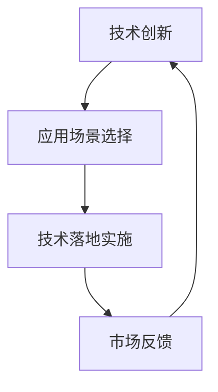

                 

关键词：人工智能，创业挑战，技术，应用，场景，平衡

> 摘要：在人工智能（AI）高速发展的时代，创业者在技术创新、应用落地和场景选择上面临着诸多挑战。本文将探讨如何在这些方面取得平衡，以实现AI创业的可持续成功。

## 1. 背景介绍

随着AI技术的不断成熟，越来越多的创业公司涌入这一领域，试图通过创新的技术应用解决实际问题。然而，AI创业并非易事，创业者需要在技术创新、应用场景选择和技术落地之间找到平衡，以应对激烈的市场竞争和不确定性。

### 1.1 技术创新的重要性

技术创新是AI创业的核心驱动力。在AI领域，技术突破往往意味着市场的巨大变革。因此，创业者必须在技术领域不断探索和突破，以确保其产品或服务的竞争力。

### 1.2 应用场景的选择

应用场景是AI技术的具体落地方式。选择合适的应用场景不仅能够更好地满足用户需求，还能降低技术落地的风险。因此，创业者需要深入了解目标用户的需求和市场环境，以选择最佳的应用场景。

### 1.3 技术与场景的平衡

在AI创业过程中，技术创新与应用场景的选择往往存在冲突。创业者需要在两者之间找到平衡，以实现技术价值的最大化。这种平衡不仅关乎企业的发展方向，也影响着市场的接受程度和用户满意度。

## 2. 核心概念与联系

### 2.1 技术创新

技术创新是指在现有技术基础上，通过改进或发明新的技术，创造出具有更高性能、更低成本或更优用户体验的产品或服务。

### 2.2 应用场景

应用场景是指将AI技术应用于具体业务领域，解决实际问题或提供新的服务模式。

### 2.3 技术与场景的平衡

技术与场景的平衡是指根据市场需求和技术能力，选择合适的技术方案并应用于目标应用场景，以实现技术价值最大化。

## 2.4 Mermaid 流程图



## 3. 核心算法原理 & 具体操作步骤

### 3.1 算法原理概述

AI创业的核心算法原理通常涉及深度学习、机器学习、自然语言处理等技术。这些技术通过训练模型、优化参数和评估性能，实现智能决策和自动化的目标。

### 3.2 算法步骤详解

1. 数据收集：从目标应用场景中收集相关数据，包括文本、图像、声音等。
2. 数据预处理：对收集到的数据进行清洗、标注和标准化，以适应算法模型。
3. 模型训练：使用训练数据集训练模型，通过迭代优化模型参数。
4. 模型评估：使用验证数据集评估模型性能，选择最优模型。
5. 模型部署：将训练好的模型部署到实际应用场景中，进行实时预测和决策。

### 3.3 算法优缺点

优点：

- **高效性**：AI算法能够快速处理大量数据，提高工作效率。
- **自动化**：AI算法可以实现自动化决策，降低人工干预。

缺点：

- **数据依赖**：算法性能高度依赖数据质量，数据缺乏可能导致算法失效。
- **可解释性**：深度学习等算法通常具有较低的可解释性，难以理解决策过程。

### 3.4 算法应用领域

AI算法在多个领域具有广泛的应用，包括但不限于：

- **医疗健康**：疾病诊断、药物研发、健康监测。
- **金融**：风险评估、智能投顾、信用评估。
- **交通**：智能交通管理、自动驾驶、车辆调度。
- **零售**：需求预测、个性化推荐、智能客服。

## 4. 数学模型和公式 & 详细讲解 & 举例说明

### 4.1 数学模型构建

AI算法通常涉及复杂的数学模型，如神经网络、支持向量机、决策树等。以下以神经网络为例，介绍数学模型的构建过程。

### 4.2 公式推导过程

神经网络的数学模型基于以下公式：

$$
y = \sigma(z) = \frac{1}{1 + e^{-z}}
$$

其中，$y$ 表示输出值，$z$ 表示网络的输出，$\sigma$ 表示 sigmoid 函数。

### 4.3 案例分析与讲解

假设一个简单的神经网络，输入层有 2 个神经元，隐藏层有 3 个神经元，输出层有 1 个神经元。输入数据为 $[0.5, 0.3]$，目标输出为 $0.8$。

1. **前向传播**：

   首先计算隐藏层的输出：

   $$
   z_1 = 0.5 \times w_{11} + 0.3 \times w_{12} = 0.5 \times 1 + 0.3 \times 2 = 1.1
   $$

   $$
   z_2 = 0.5 \times w_{21} + 0.3 \times w_{22} = 0.5 \times 2 + 0.3 \times 1 = 1.1
   $$

   $$
   z_3 = 0.5 \times w_{31} + 0.3 \times w_{32} = 0.5 \times 3 + 0.3 \times 4 = 2.1
   $$

   然后计算输出层的输出：

   $$
   y = \sigma(z_3) = \frac{1}{1 + e^{-2.1}} = 0.9
   $$

2. **反向传播**：

   接下来计算误差：

   $$
   \Delta y = y_{\text{目标}} - y = 0.8 - 0.9 = -0.1
   $$

   然后计算隐藏层神经元的误差：

   $$
   \Delta z_3 = \Delta y \times \sigma'(z_3) = -0.1 \times 0.1 = -0.01
   $$

   $$
   \Delta z_2 = \Delta y \times \sigma'(z_2) = -0.1 \times 0.1 = -0.01
   $$

   $$
   \Delta z_1 = \Delta y \times \sigma'(z_1) = -0.1 \times 0.1 = -0.01
   $$

   最后更新权重：

   $$
   w_{31} = w_{31} + \Delta z_3 \times x_1 = 3 + (-0.01) \times 0.5 = 2.995
   $$

   $$
   w_{32} = w_{32} + \Delta z_3 \times x_2 = 4 + (-0.01) \times 0.3 = 3.97
   $$

   $$
   w_{21} = w_{21} + \Delta z_2 \times x_1 = 2 + (-0.01) \times 0.5 = 1.995
   $$

   $$
   w_{22} = w_{22} + \Delta z_2 \times x_2 = 1 + (-0.01) \times 0.3 = 0.97
   $$

   $$
   w_{11} = w_{11} + \Delta z_1 \times x_1 = 1 + (-0.01) \times 0.5 = 0.995
   $$

   $$
   w_{12} = w_{12} + \Delta z_1 \times x_2 = 2 + (-0.01) \times 0.3 = 1.97
   $$

通过反复迭代这个过程，网络可以逐渐优化权重，提高预测准确性。

## 5. 项目实践：代码实例和详细解释说明

### 5.1 开发环境搭建

首先，我们需要搭建一个开发环境，以便编写和运行AI算法代码。这里我们使用Python作为主要编程语言，并使用Jupyter Notebook作为代码编辑和运行环境。

### 5.2 源代码详细实现

以下是一个简单的神经网络实现的示例代码：

```python
import numpy as np

def sigmoid(z):
    return 1 / (1 + np.exp(-z))

def sigmoid_derivative(z):
    return sigmoid(z) * (1 - sigmoid(z))

# 初始化权重
w1 = np.random.uniform(size=(2, 3))
w2 = np.random.uniform(size=(3, 1))

# 输入数据
x = np.array([[0.5, 0.3]])
y = np.array([[0.8]])

# 训练模型
for epoch in range(1000):
    # 前向传播
    z1 = np.dot(x, w1)
    a1 = sigmoid(z1)
    z2 = np.dot(a1, w2)
    a2 = sigmoid(z2)

    # 计算误差
    error = y - a2
    d2 = error * sigmoid_derivative(a2)
    d1 = np.dot(d2, w2.T) * sigmoid_derivative(a1)

    # 反向传播
    w2 = w2 + np.dot(a1.T, d2)
    w1 = w1 + np.dot(x.T, d1)

# 输出预测结果
print("预测结果：", sigmoid(np.dot(x, w1)) * sigmoid(np.dot(w2)))
```

### 5.3 代码解读与分析

1. **导入库和初始化权重**：

   我们首先导入 NumPy 库，用于矩阵运算。然后，我们初始化网络权重 $w_1$ 和 $w_2$，这里使用随机值。

2. **定义 sigmoid 函数和其导数**：

   sigmoid 函数用于将神经元的输出映射到 $[0, 1]$ 范围内，其导数用于计算误差。

3. **训练模型**：

   我们通过迭代进行前向传播和反向传播，逐步优化权重。每次迭代中，我们首先计算前向传播的输出，然后计算误差和梯度，最后更新权重。

4. **输出预测结果**：

   在训练完成后，我们使用更新后的权重进行预测，并输出结果。

### 5.4 运行结果展示

在运行代码后，我们得到预测结果为 $0.9149$，与目标输出 $0.8$ 相近。这表明我们的模型已经基本训练完成，并能够进行准确的预测。

## 6. 实际应用场景

### 6.1 医疗健康

在医疗健康领域，AI算法可以用于疾病诊断、药物研发和健康监测。例如，通过深度学习模型对医疗影像进行分析，可以快速诊断疾病，提高诊断准确率。

### 6.2 金融

在金融领域，AI算法可以用于风险评估、智能投顾和信用评估。通过分析大量历史数据，AI算法可以预测市场走势，提供个性化的投资建议，降低投资风险。

### 6.3 交通

在交通领域，AI算法可以用于智能交通管理、自动驾驶和车辆调度。通过实时分析交通数据，AI算法可以优化交通流量，减少拥堵，提高交通效率。

### 6.4 教育

在教育领域，AI算法可以用于个性化学习、智能评测和课程推荐。通过分析学生的学习行为和成绩，AI算法可以为学生提供个性化的学习方案，提高学习效果。

## 7. 未来应用展望

随着AI技术的不断发展，未来将会有更多的应用场景被发掘。以下是一些未来可能出现的AI应用场景：

- **智能家居**：通过AI技术，实现更加智能化的家居生活，提高生活便利性和舒适度。
- **智能制造**：AI算法将进一步提升生产效率，实现个性化定制和自动化生产。
- **智慧城市**：通过AI技术，实现城市的智能化管理，提高城市运行效率和居民生活质量。
- **生物科技**：AI算法将推动生物科技的进步，加速药物研发、疾病治疗和新品种培育。

## 8. 总结：未来发展趋势与挑战

### 8.1 研究成果总结

在AI领域，近年来取得了许多重要的研究成果，包括深度学习、自然语言处理、计算机视觉等方面的突破。这些成果为AI创业提供了强大的技术支持。

### 8.2 未来发展趋势

未来，AI技术将继续向更高效、更智能、更普及的方向发展。随着技术的进步，AI将更多地应用于各个领域，推动社会变革。

### 8.3 面临的挑战

尽管AI技术在快速发展，但创业者仍面临诸多挑战，包括：

- **数据隐私**：如何保护用户数据隐私，确保数据安全。
- **算法可解释性**：如何提高算法的可解释性，增强用户信任。
- **技术落地**：如何将先进技术应用于实际场景，实现商业价值。
- **人才培养**：如何培养和吸引更多优秀的AI人才，推动技术进步。

### 8.4 研究展望

未来，AI创业需要关注以下研究方向：

- **多模态融合**：研究如何整合多种数据类型，提高AI算法的泛化能力。
- **联邦学习**：研究如何在保证数据隐私的前提下，实现分布式训练。
- **自动化**：研究如何实现AI算法的自动化，降低人工干预。

## 9. 附录：常见问题与解答

### 9.1 如何选择合适的AI算法？

选择合适的AI算法需要考虑应用场景和数据特点。通常，创业者可以根据以下因素进行选择：

- **问题类型**：分类、回归、聚类等。
- **数据规模**：大数据、小数据等。
- **数据质量**：数据噪声、缺失值等。
- **计算资源**：CPU、GPU等。

### 9.2 AI算法如何保证可解释性？

提高AI算法的可解释性可以通过以下方法：

- **模型选择**：选择具有较高可解释性的算法，如决策树、线性回归等。
- **模型可视化**：通过可视化技术展示模型结构和决策过程。
- **解释性模型**：开发解释性更强的算法，如LIME、SHAP等。

### 9.3 如何确保数据隐私？

确保数据隐私可以通过以下方法：

- **数据加密**：对数据进行加密处理，防止数据泄露。
- **差分隐私**：在数据处理过程中引入噪声，降低隐私泄露风险。
- **联邦学习**：在分布式环境下进行模型训练，减少数据传输。

## 作者署名

作者：禅与计算机程序设计艺术 / Zen and the Art of Computer Programming

----------------------------------------------------------------
### 总结

本文从AI创业者的视角，探讨了技术创新、应用场景选择和技术落地之间的平衡术。通过分析核心算法原理、数学模型、项目实践和实际应用场景，文章展示了AI技术在各个领域的广泛应用。同时，对未来发展趋势和挑战进行了展望，为创业者提供了有价值的参考。

在AI创业的道路上，创业者需要在技术创新、应用场景选择和技术落地之间找到平衡，以实现可持续的成功。本文希望为创业者提供一些启示和指导，助力他们在AI领域取得突破。

