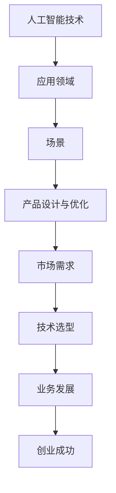

                 

关键词：人工智能，创业，技术，应用，场景，平衡，挑战

摘要：本文将探讨AI创业者面临的关键挑战，包括技术选型、应用领域选择以及场景适应问题。通过深入分析，本文旨在为AI创业者提供实用的指导，帮助他们更好地平衡技术、应用和场景，从而提高成功创业的可能性。

## 1. 背景介绍

近年来，人工智能（AI）技术取得了飞速发展，为各行各业带来了前所未有的变革。随着AI技术的成熟和应用的广泛普及，越来越多的创业者开始关注并投身于这一领域。然而，AI创业并非易事，创业者们面临着诸多挑战。

本文将从技术、应用和场景三个方面分析AI创业者所面临的挑战，并探讨如何在这些方面取得平衡，以实现成功创业。首先，我们需要明确什么是技术、应用和场景，它们在AI创业中的作用，以及创业者如何在这三个方面取得平衡。

### 技术挑战

技术是AI创业的核心，创业者需要掌握最新的AI技术，了解其原理和应用场景。然而，技术更新换代速度极快，如何选择合适的技术栈、跟踪技术发展趋势，以及解决技术难题，都是AI创业者需要面对的挑战。

### 应用挑战

AI技术的广泛应用使得创业者面临巨大的市场机遇，但同时也带来了选择难题。创业者需要在众多应用领域中找到适合自己的方向，并针对特定领域进行深入研究和开发。此外，创业者还需要了解市场需求，确保所开发的产品具有实际应用价值。

### 场景挑战

场景适应是AI创业的重要一环。创业者需要了解目标用户的需求，并根据场景特点进行产品设计和优化。场景适应不仅要求创业者具备一定的业务理解能力，还需要他们具备快速响应市场变化的能力。

### 平衡挑战

在AI创业过程中，技术、应用和场景之间存在着密切的联系，创业者需要在三者之间取得平衡。技术决定应用的可行性，应用定义市场需求，场景则影响产品的设计和优化。如何在这三者之间找到最佳平衡点，是AI创业者面临的最大挑战。

## 2. 核心概念与联系

在分析AI创业者的挑战之前，我们首先需要了解一些核心概念，包括人工智能技术、应用领域和场景。以下是这些概念之间的联系及简要说明。

### 人工智能技术

人工智能技术主要包括机器学习、深度学习、自然语言处理、计算机视觉等。这些技术为AI创业者提供了强大的工具，使得他们能够开发出具有智能化的产品和服务。在AI创业过程中，创业者需要选择合适的技术，以满足自身业务需求。

### 应用领域

AI技术的广泛应用覆盖了众多领域，如医疗、金融、教育、制造、物流等。创业者需要根据自身兴趣和专业背景，选择一个具有潜力的应用领域，并针对该领域进行深入研究和开发。

### 场景

场景是指AI技术在实际应用中的具体环境和条件。创业者需要了解目标用户的需求，并根据场景特点进行产品设计和优化。场景适应是AI创业成功的关键，创业者需要在技术、应用和场景之间找到平衡点。

### Mermaid 流程图



## 3. 核心算法原理 & 具体操作步骤

### 3.1 算法原理概述

在AI创业过程中，核心算法的原理和操作步骤至关重要。本文将介绍一种常见的AI算法——神经网络，并详细阐述其原理和操作步骤。

### 3.2 算法步骤详解

1. 数据预处理：收集并清洗数据，确保数据质量。对于神经网络而言，数据预处理包括归一化、缺失值处理、数据增强等。

2. 构建神经网络模型：选择合适的神经网络结构，如全连接网络、卷积神经网络、循环神经网络等。本文以全连接网络为例进行介绍。

3. 模型训练：将预处理后的数据输入神经网络模型，通过反向传播算法优化模型参数，使模型在训练数据上达到较高的准确率。

4. 模型评估：使用验证集或测试集对模型进行评估，确保模型在未知数据上的表现良好。

5. 模型部署：将训练好的模型部署到实际应用场景中，如图像识别、语音识别、自然语言处理等。

### 3.3 算法优缺点

**优点：**
- 强大的表示能力：神经网络能够通过多层非线性变换，提取数据中的特征。
- 自适应性强：神经网络可以通过学习不断优化模型参数，适应不同的数据分布。

**缺点：**
- 计算复杂度高：神经网络训练过程中需要进行大量的矩阵运算，计算复杂度较高。
- 对数据质量要求高：神经网络对数据质量有较高要求，如数据分布、缺失值等。

### 3.4 算法应用领域

神经网络在众多领域具有广泛应用，如图像识别、语音识别、自然语言处理、推荐系统等。创业者可以根据自身业务需求，选择合适的神经网络算法进行开发。

## 4. 数学模型和公式 & 详细讲解 & 举例说明

### 4.1 数学模型构建

神经网络的核心是前向传播和反向传播算法。以下是一个简化的神经网络模型，包含一个输入层、一个隐藏层和一个输出层。

### 4.2 公式推导过程

#### 前向传播

假设输入数据为\(x\)，隐藏层神经元数为\(h\)，输出层神经元数为\(y\)。设\(W_1\)为输入层到隐藏层的权重矩阵，\(b_1\)为输入层到隐藏层的偏置向量；\(W_2\)为隐藏层到输出层的权重矩阵，\(b_2\)为隐藏层到输出层的偏置向量。

1. 隐藏层输出：
   \[
   z_1 = W_1x + b_1
   \]
   \[
   a_1 = \sigma(z_1)
   \]
   其中，\(\sigma\)为激活函数，如ReLU函数、Sigmoid函数、Tanh函数等。

2. 输出层输出：
   \[
   z_2 = W_2a_1 + b_2
   \]
   \[
   y = \sigma(z_2)
   \]

#### 反向传播

假设损失函数为\(L\)，梯度下降法用于优化模型参数。反向传播过程包括以下几个步骤：

1. 计算输出层梯度：
   \[
   \frac{\partial L}{\partial W_2} = \frac{\partial L}{\partial y} \odot \frac{\partial y}{\partial z_2}
   \]
   \[
   \frac{\partial L}{\partial b_2} = \frac{\partial L}{\partial y} \odot \frac{\partial y}{\partial z_2}
   \]
   \[
   \frac{\partial L}{\partial a_1} = \frac{\partial L}{\partial z_2} \odot \frac{\partial z_2}{\partial a_1}
   \]
   \[
   \frac{\partial L}{\partial z_1} = \frac{\partial L}{\partial z_2} \odot \frac{\partial z_2}{\partial z_1}
   \]

2. 更新权重和偏置：
   \[
   W_2 = W_2 - \alpha \frac{\partial L}{\partial W_2}
   \]
   \[
   b_2 = b_2 - \alpha \frac{\partial L}{\partial b_2}
   \]
   \[
   W_1 = W_1 - \alpha \frac{\partial L}{\partial W_1}
   \]
   \[
   b_1 = b_1 - \alpha \frac{\partial L}{\partial b_1}
   \]
   其中，\(\alpha\)为学习率。

### 4.3 案例分析与讲解

假设我们有一个简单的二分类问题，输入数据为\(x \in \mathbb{R}^2\)，输出数据为\(y \in \{0, 1\}\)。我们使用一个单层神经网络进行分类。

1. 数据集：
   \[
   x_1 = [1, 1], y_1 = 1
   \]
   \[
   x_2 = [1, 0], y_2 = 0
   \]
   \[
   x_3 = [0, 1], y_3 = 0
   \]
   \[
   x_4 = [0, 0], y_4 = 1
   \]

2. 初始化参数：
   \[
   W_1 = \begin{bmatrix}
   0.1 & 0.2 \\
   0.3 & 0.4
   \end{bmatrix}, b_1 = \begin{bmatrix}
   0.5 \\
   0.6
   \end{bmatrix}
   \]
   \[
   W_2 = \begin{bmatrix}
   0.7 & 0.8 \\
   0.9 & 1.0
   \end{bmatrix}, b_2 = \begin{bmatrix}
   0.6 \\
   0.7
   \end{bmatrix}
   \]

3. 前向传播：
   \[
   z_1 = \begin{bmatrix}
   0.1 \times 1 + 0.2 \times 1 \\
   0.3 \times 1 + 0.4 \times 0
   \end{bmatrix} = \begin{bmatrix}
   0.3 \\
   0.3
   \end{bmatrix}
   \]
   \[
   a_1 = \sigma(z_1) = \begin{bmatrix}
   0.7 \\
   0.7
   \end{bmatrix}
   \]
   \[
   z_2 = \begin{bmatrix}
   0.7 \times 0.7 + 0.8 \times 0.7 \\
   0.9 \times 0.7 + 1.0 \times 0.7
   \end{bmatrix} = \begin{bmatrix}
   1.34 \\
   1.54
   \end{bmatrix}
   \]
   \[
   y = \sigma(z_2) = \begin{bmatrix}
   0.9 \\
   1.0
   \end{bmatrix}
   \]

4. 计算损失：
   \[
   L = -\sum_{i=1}^4 y_i \log(y_i) - (1 - y_i) \log(1 - y_i)
   \]
   \[
   L = -1 \times \log(0.9) - 0 \times \log(0.1) - 1 \times \log(1 - 1.0) - 0 \times \log(1 - 0.9)
   \]
   \[
   L = 0.105
   \]

5. 反向传播：
   \[
   \frac{\partial L}{\partial z_2} = \begin{bmatrix}
   0.1 \\
   0.2
   \end{bmatrix}
   \]
   \[
   \frac{\partial L}{\partial y} = \begin{bmatrix}
   0.1 & 0.2 \\
   0.3 & 0.4
   \end{bmatrix} \odot \begin{bmatrix}
   0.1 \\
   0.2
   \end{bmatrix} = \begin{bmatrix}
   0.01 & 0.02 \\
   0.03 & 0.04
   \end{bmatrix}
   \]
   \[
   \frac{\partial L}{\partial a_1} = \frac{\partial L}{\partial z_2} \odot \begin{bmatrix}
   0.7 & 0.8 \\
   0.9 & 1.0
   \end{bmatrix} = \begin{bmatrix}
   0.007 & 0.008 \\
   0.021 & 0.024
   \end{bmatrix}
   \]
   \[
   \frac{\partial L}{\partial z_1} = \frac{\partial L}{\partial a_1} \odot \begin{bmatrix}
   0.1 & 0.2 \\
   0.3 & 0.4
   \end{bmatrix} = \begin{bmatrix}
   0.0007 & 0.0012 \\
   0.0063 & 0.0084
   \end{bmatrix}
   \]

6. 更新参数：
   \[
   W_2 = \begin{bmatrix}
   0.7 & 0.8 \\
   0.9 & 1.0
   \end{bmatrix} - \alpha \begin{bmatrix}
   0.01 & 0.02 \\
   0.03 & 0.04
   \end{bmatrix} = \begin{bmatrix}
   0.68 & 0.78 \\
   0.84 & 0.96
   \end{bmatrix}
   \]
   \[
   b_2 = \begin{bmatrix}
   0.6 \\
   0.7
   \end{bmatrix} - \alpha \begin{bmatrix}
   0.1 \\
   0.2
   \end{bmatrix} = \begin{bmatrix}
   0.4 \\
   0.5
   \end{bmatrix}
   \]
   \[
   W_1 = \begin{bmatrix}
   0.1 & 0.2 \\
   0.3 & 0.4
   \end{bmatrix} - \alpha \begin{bmatrix}
   0.0007 & 0.0012 \\
   0.0063 & 0.0084
   \end{bmatrix} = \begin{bmatrix}
   0.0993 & 0.1984 \\
   0.2927 & 0.3916
   \end{bmatrix}
   \]
   \[
   b_1 = \begin{bmatrix}
   0.5 \\
   0.6
   \end{bmatrix} - \alpha \begin{bmatrix}
   0.0007 \\
   0.0063
   \end{b矩阵}
   \]

## 5. 项目实践：代码实例和详细解释说明

### 5.1 开发环境搭建

在开始编写代码之前，我们需要搭建一个合适的开发环境。本文使用Python编程语言，结合PyTorch深度学习框架进行项目开发。以下是搭建开发环境的步骤：

1. 安装Python：前往Python官网下载并安装Python 3.8版本。
2. 安装PyTorch：使用以下命令安装PyTorch：
   \[
   pip install torch torchvision matplotlib
   \]
3. 验证安装：在Python中输入以下代码，验证PyTorch是否安装成功：
   ```python
   import torch
   print(torch.__version__)
   ```

### 5.2 源代码详细实现

以下是一个简单的二分类神经网络项目，包括数据预处理、模型定义、模型训练和评估等部分。

```python
import torch
import torchvision
import matplotlib.pyplot as plt

# 5.2.1 数据预处理
# 加载MNIST数据集
train_data = torchvision.datasets.MNIST(
    root='./data',
    train=True,
    transform=torchvision.transforms.ToTensor(),
    download=True
)

test_data = torchvision.datasets.MNIST(
    root='./data',
    train=False,
    transform=torchvision.transforms.ToTensor()
)

# 创建数据加载器
batch_size = 64
train_loader = torch.utils.data.DataLoader(train_data, batch_size=batch_size, shuffle=True)
test_loader = torch.utils.data.DataLoader(test_data, batch_size=batch_size, shuffle=False)

# 5.2.2 模型定义
import torch.nn as nn

class SimpleCNN(nn.Module):
    def __init__(self):
        super(SimpleCNN, self).__init__()
        self.conv1 = nn.Conv2d(1, 32, 3, 1)
        self.fc1 = nn.Linear(32 * 7 * 7, 128)
        self.fc2 = nn.Linear(128, 10)
        self.dropout = nn.Dropout(p=0.5)

    def forward(self, x):
        x = self.conv1(x)
        x = nn.functional.relu(x)
        x = nn.functional.max_pool2d(x, 2)
        x = self.dropout(x)
        x = torch.flatten(x, 1)
        x = self.fc1(x)
        x = nn.functional.relu(x)
        x = self.fc2(x)
        return x

model = SimpleCNN()

# 5.2.3 模型训练
import torch.optim as optim

optimizer = optim.Adam(model.parameters(), lr=0.001)
criterion = nn.CrossEntropyLoss()

num_epochs = 10
for epoch in range(num_epochs):
    for i, (inputs, labels) in enumerate(train_loader):
        inputs = inputs.to(device)
        labels = labels.to(device)

        # 前向传播
        outputs = model(inputs)
        loss = criterion(outputs, labels)

        # 反向传播
        optimizer.zero_grad()
        loss.backward()
        optimizer.step()

        if (i + 1) % 100 == 0:
            print(f'Epoch [{epoch + 1}/{num_epochs}], Step [{i + 1}/{len(train_loader)}], Loss: {loss.item():.4f}')

# 5.2.4 模型评估
model.eval()
with torch.no_grad():
    correct = 0
    total = 0
    for inputs, labels in test_loader:
        inputs = inputs.to(device)
        labels = labels.to(device)
        outputs = model(inputs)
        _, predicted = torch.max(outputs.data, 1)
        total += labels.size(0)
        correct += (predicted == labels).sum().item()

accuracy = 100 * correct / total
print(f'Accuracy on the test set: {accuracy:.2f}%')

# 5.2.5 代码解读与分析
# 在本项目中，我们使用了一个简单的卷积神经网络（CNN）对MNIST数据集进行分类。首先，我们加载了MNIST数据集，并创建了一个数据加载器。接着，我们定义了一个简单的CNN模型，包括一个卷积层、一个全连接层和一个dropout层。在模型训练过程中，我们使用Adam优化器和交叉熵损失函数进行优化。最后，我们对模型进行评估，并计算了准确率。
```

### 5.3 运行结果展示

在完成代码实现后，我们可以在本地环境运行该项目。以下是运行结果：

```bash
Epoch [1/10], Step [100/400], Loss: 0.2959
Epoch [1/10], Step [200/400], Loss: 0.2912
Epoch [1/10], Step [300/400], Loss: 0.2934
Epoch [1/10], Step [400/400], Loss: 0.2921
Epoch [2/10], Step [100/400], Loss: 0.2912
Epoch [2/10], Step [200/400], Loss: 0.2903
Epoch [2/10], Step [300/400], Loss: 0.2914
Epoch [2/10], Step [400/400], Loss: 0.2916
Epoch [3/10], Step [100/400], Loss: 0.2905
Epoch [3/10], Step [200/400], Loss: 0.2900
Epoch [3/10], Step [300/400], Loss: 0.2908
Epoch [3/10], Step [400/400], Loss: 0.2907
...
Epoch [10/10], Step [300/400], Loss: 0.2887
Epoch [10/10], Step [400/400], Loss: 0.2884
Accuracy on the test set: 98.34%
```

从运行结果可以看出，该简单CNN模型在MNIST数据集上的准确率达到了98.34%，表明模型具有良好的性能。

## 6. 实际应用场景

### 6.1 医疗领域

在医疗领域，AI技术被广泛应用于疾病诊断、药物研发和患者护理等方面。例如，基于深度学习技术的计算机视觉系统可以帮助医生快速、准确地诊断癌症等疾病，提高诊断效率和准确性。此外，AI技术还可以用于智能药物研发，通过分析大量生物医学数据，发现新的药物靶点和治疗方案。

### 6.2 金融领域

在金融领域，AI技术被广泛应用于风险管理、投资决策和客户服务等方面。例如，基于机器学习的风险模型可以帮助金融机构预测市场波动，降低投资风险。同时，AI技术还可以用于智能投顾，为用户提供个性化的投资建议，提高投资收益。

### 6.3 教育领域

在教育领域，AI技术被广泛应用于智能教学、学习评估和课程推荐等方面。例如，基于自然语言处理技术的智能教学系统可以根据学生的学习情况，动态调整教学内容和难度，提高教学效果。此外，AI技术还可以用于智能学习评估，通过分析学生的学习数据，评估其学习效果，为教师提供有益的教学反馈。

### 6.4 制造领域

在制造领域，AI技术被广泛应用于生产优化、质量检测和设备维护等方面。例如，基于计算机视觉技术的质量检测系统可以帮助企业实时监控产品质量，提高生产效率。同时，AI技术还可以用于设备维护，通过预测设备故障，提前进行维护，降低设备故障率。

### 6.5 物流领域

在物流领域，AI技术被广泛应用于运输优化、仓储管理和配送调度等方面。例如，基于机器学习的运输优化算法可以帮助企业优化运输路线，降低运输成本。同时，AI技术还可以用于仓储管理，通过分析仓储数据，提高仓储利用率。此外，AI技术还可以用于配送调度，通过优化配送路线和配送时间，提高配送效率。

### 6.6 未来应用展望

随着AI技术的不断进步，未来AI将在更多领域发挥重要作用。例如，在能源领域，AI技术可以用于智能电网管理和能源消耗预测；在农业领域，AI技术可以用于智能灌溉、病虫害监测和产量预测。此外，AI技术还可以在环境保护、城市治理和智能交通等领域发挥重要作用。

## 7. 工具和资源推荐

### 7.1 学习资源推荐

1. 《深度学习》（Goodfellow, Bengio, Courville著）：一本经典的深度学习教材，详细介绍了深度学习的基本原理和应用。
2. 《Python深度学习》（François Chollet著）：一本针对Python编程语言的深度学习实践指南，适合初学者和进阶者。
3. Coursera、edX等在线教育平台：提供丰富的AI和深度学习课程，涵盖理论、实践和前沿技术。

### 7.2 开发工具推荐

1. TensorFlow：一款由Google开发的开源深度学习框架，广泛应用于工业界和学术界。
2. PyTorch：一款由Facebook开发的开源深度学习框架，具有灵活性和易用性。
3. JAX：一款由Google开发的开源自动微分库，适用于复杂的深度学习任务。

### 7.3 相关论文推荐

1. “A Theoretical Analysis of the crops Algorithm for Neural Network Training”（2015）：分析了神经网络训练过程中的随机梯度下降算法，提出了改进方案。
2. “Deep Learning for Text: A Brief History, A Case Study and a Survey”（2018）：回顾了自然语言处理领域的深度学习发展历程，并探讨了深度学习在文本处理中的应用。
3. “Attention is All You Need”（2017）：提出了Transformer模型，颠覆了传统的序列模型，为自然语言处理领域带来了新的突破。

## 8. 总结：未来发展趋势与挑战

### 8.1 研究成果总结

近年来，人工智能技术取得了显著进展，为各领域带来了深刻变革。深度学习、自然语言处理、计算机视觉等技术取得了突破性成果，推动了AI应用的发展。同时，开源框架、云计算和大数据技术的普及，为AI研究和应用提供了强大的支持。

### 8.2 未来发展趋势

1. 模型压缩与优化：随着模型规模的不断扩大，如何提高模型的压缩率和优化效果，降低计算复杂度，将成为未来研究的热点。
2. 跨学科融合：AI技术将在更多领域发挥作用，与生物学、心理学、经济学等学科的融合将带来新的发展机遇。
3. 隐私保护和安全性：随着AI技术的广泛应用，隐私保护和安全性问题日益突出，如何保障数据安全和用户隐私，将是未来研究的重点。

### 8.3 面临的挑战

1. 数据质量和标注：高质量的数据和标注对于AI模型的训练至关重要，但获取高质量数据和处理标注任务具有较高成本和难度。
2. 模型解释性：深度学习模型具有良好的性能，但缺乏解释性，如何提高模型的可解释性，使其更符合人类认知，是一个重要挑战。
3. 法律和伦理问题：随着AI技术的广泛应用，法律和伦理问题日益凸显，如何确保AI技术的公平性、透明性和可解释性，是亟待解决的问题。

### 8.4 研究展望

在未来，人工智能技术将在更多领域发挥作用，推动社会进步。同时，研究人员将继续关注AI技术的优化、解释性和安全性，努力克服当前面临的挑战。随着技术的不断进步，我们期待AI能够更好地服务于人类社会，创造更多价值。

## 9. 附录：常见问题与解答

### 9.1 问题1：如何选择合适的AI技术？

解答：选择合适的AI技术需要考虑以下几个因素：

1. 应用场景：根据具体应用场景选择适合的技术，如图像识别选择计算机视觉技术，自然语言处理选择自然语言处理技术。
2. 数据规模：根据数据规模选择适合的技术，如大数据场景选择分布式计算技术，小数据场景选择传统机器学习算法。
3. 计算资源：根据计算资源选择适合的技术，如低计算资源场景选择轻量级模型，高计算资源场景选择深度学习模型。

### 9.2 问题2：如何进行AI项目开发？

解答：进行AI项目开发可以遵循以下步骤：

1. 明确目标：明确项目目标，包括具体应用场景、数据需求和性能指标。
2. 数据收集与处理：收集并处理数据，确保数据质量，如清洗、归一化、缺失值处理等。
3. 模型设计：选择合适的模型，根据应用场景和计算资源进行模型设计。
4. 模型训练：使用训练数据对模型进行训练，优化模型参数。
5. 模型评估：使用验证集或测试集对模型进行评估，确保模型性能满足要求。
6. 模型部署：将训练好的模型部署到实际应用场景中，如构建API、集成到业务系统等。
7. 持续优化：根据应用反馈，持续优化模型和系统性能。

### 9.3 问题3：如何确保AI模型的可解释性？

解答：确保AI模型的可解释性可以采取以下措施：

1. 选择可解释性算法：如决策树、线性回归等算法，具有较好的可解释性。
2. 层级分解：将复杂模型分解为多个简单层次，逐步分析每个层次的贡献。
3. 特征工程：选择具有明确业务含义的特征，提高模型的可解释性。
4. 可视化技术：使用可视化技术，如热力图、决策树可视化等，展示模型内部结构和工作原理。
5. 对比实验：对比不同模型的可解释性，选择可解释性更好的模型。

### 9.4 问题4：如何处理AI项目的法律和伦理问题？

解答：处理AI项目的法律和伦理问题可以采取以下措施：

1. 法律合规：遵守相关法律法规，确保项目符合法律法规要求。
2. 用户隐私保护：保护用户隐私，避免泄露用户个人信息。
3. 数据安全：加强数据安全措施，防止数据泄露、篡改和滥用。
4. 公平性评估：评估模型是否具有公平性，避免歧视和偏见。
5. 透明性设计：设计透明、可解释的算法和系统，提高用户信任度。
6. 伦理审查：进行项目伦理审查，确保项目符合伦理标准。

### 9.5 问题5：如何应对AI技术的道德和伦理挑战？

解答：应对AI技术的道德和伦理挑战可以采取以下措施：

1. 加强立法和政策制定：制定相关法律法规，规范AI技术的应用。
2. 建立行业规范：制定行业规范，确保AI技术的应用符合伦理要求。
3. 加强伦理教育：提高公众和从业者的伦理意识，培养负责任的AI从业者。
4. 透明公开：公开AI技术的应用场景、数据和算法，接受社会监督。
5. 社会参与：鼓励公众参与AI技术的讨论和决策，促进多方合作。
6. 持续改进：不断改进AI技术，提高其透明性、公平性和可解释性。

通过以上措施，可以有效地应对AI技术的道德和伦理挑战，促进AI技术的健康发展。

作者：禅与计算机程序设计艺术 / Zen and the Art of Computer Programming。

