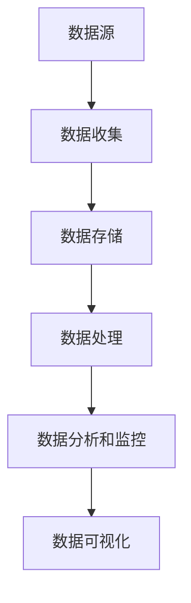

                 

关键词：AI创业、数据质量、数据清洗、数据管理、数据治理、数据可视化、数据分析、机器学习、深度学习

> 摘要：本文将深入探讨在AI创业过程中数据质量的重要性。数据是AI的核心，高质量的数据能够提升模型的准确性，降低成本，缩短研发周期，增加创业成功率。本文将分析数据质量的影响因素、数据清洗的方法、数据管理策略以及数据治理的实践，并探讨未来数据质量和AI创业领域的发展趋势。

## 1. 背景介绍

随着人工智能技术的快速发展，AI已经成为推动各行各业变革的重要力量。从自动驾驶、智能医疗、金融风控到零售个性化推荐，AI的应用场景越来越广泛。在这个背景下，AI创业成为了一个热门领域。然而，成功的AI创业不仅需要优秀的算法和强大的计算能力，更重要的是高质量的数据。

数据是AI的基石，数据质量直接影响到模型的性能和可靠性。在AI创业过程中，高质量的数据可以帮助企业做出更准确、更及时的决策，降低错误率和风险。然而，现实中数据质量问题层出不穷，如数据缺失、数据冗余、数据不一致等，这些问题都会严重影响到AI应用的效能。

本文旨在探讨数据质量在AI创业中的重要性，分析数据质量的影响因素，介绍数据清洗和数据管理的最佳实践，并展望未来数据质量和AI创业领域的发展趋势。

## 2. 核心概念与联系

### 2.1 数据质量的概念

数据质量是指数据在满足特定用途时的准确性、完整性、一致性、可用性和时效性。高质量的数据能够提供准确的业务洞察，支持有效的决策制定。

### 2.2 数据质量的影响因素

数据质量受到多个因素的影响，包括数据来源、数据收集、数据处理、数据存储等。以下是几个关键影响因素：

- **准确性**：数据是否真实反映了实际情况。
- **完整性**：数据是否包含所有必要的字段和记录。
- **一致性**：不同数据源之间的数据是否保持一致。
- **可用性**：数据是否易于访问和使用。
- **时效性**：数据是否及时更新，反映最新的业务状况。

### 2.3 数据质量和AI的关联

在AI创业中，数据质量是保证模型准确性和可靠性的关键。以下是数据质量对AI模型的一些影响：

- **准确性**：高质量的数据有助于训练更准确的模型。
- **泛化能力**：数据质量越好，模型对新数据的适应能力越强。
- **成本**：数据清洗和预处理的工作量直接影响开发成本和时间。
- **部署**：高质量的数据可以缩短模型从开发到部署的时间。

### 2.4 数据质量管理的架构

数据质量管理是一个系统工程，涉及数据收集、存储、处理、分析和监控等多个环节。以下是数据质量管理的基本架构：

- **数据源**：确定数据来源，包括内部数据和外部数据。
- **数据收集**：设计有效的数据收集策略，确保数据的完整性和准确性。
- **数据存储**：建立高效的数据存储和管理系统，保证数据的可用性和一致性。
- **数据处理**：进行数据清洗、转换和集成，提高数据质量。
- **数据分析和监控**：利用数据分析工具和技术对数据进行深度分析，监控数据质量的变化。

### 2.5 Mermaid 流程图

以下是一个简化的数据质量管理流程图：



## 3. 核心算法原理 & 具体操作步骤

### 3.1 算法原理概述

数据质量管理通常涉及到一系列的算法和技术，包括数据清洗、数据去重、数据标准化等。以下是几种常用的数据质量管理算法：

- **数据清洗算法**：如缺失值填补、异常值处理、数据格式转换等。
- **数据去重算法**：如基于哈希表的去重、基于阈值的去重等。
- **数据标准化算法**：如Z-Score标准化、Min-Max标准化等。

### 3.2 算法步骤详解

#### 数据清洗

1. **缺失值填补**：
   - 统计缺失值比例，决定是否填补。
   - 采用均值填补、中位数填补、前向填补、后向填补等方法。

2. **异常值处理**：
   - 使用统计学方法（如IQR、Z-Score）识别异常值。
   - 对异常值进行修正或删除。

3. **数据格式转换**：
   - 将不同格式的数据进行统一转换，如日期格式、货币格式等。

#### 数据去重

1. **基于哈希表的去重**：
   - 使用哈希函数对数据进行哈希处理。
   - 将哈希值作为键存储在哈希表中，重复数据会被过滤掉。

2. **基于阈值的去重**：
   - 设置一个阈值，如果两个数据的相似度超过该阈值，则认为它们是重复的。

#### 数据标准化

1. **Z-Score标准化**：
   - 计算每个数据点与平均值的差值，并除以标准差。
   - 公式：\( Z = \frac{X - \mu}{\sigma} \)

2. **Min-Max标准化**：
   - 将数据缩放到一个特定的区间，如[0, 1]。
   - 公式：\( X_{\text{scaled}} = \frac{X - \min(X)}{\max(X) - \min(X)} \)

### 3.3 算法优缺点

- **数据清洗**：
  - 优点：能够提高数据质量，为后续分析提供基础。
  - 缺点：耗时耗力，可能引入新的误差。

- **数据去重**：
  - 优点：能够减少冗余数据，提高数据利用率。
  - 缺点：可能误判重复数据，导致数据丢失。

- **数据标准化**：
  - 优点：能够消除不同特征之间的尺度差异，便于模型训练。
  - 缺点：可能降低数据的表达能力，影响模型的泛化能力。

### 3.4 算法应用领域

数据质量管理算法广泛应用于各个领域，如金融风控、医疗健康、零售电商等。在这些领域，数据质量管理能够显著提升业务决策的准确性和效率。

## 4. 数学模型和公式 & 详细讲解 & 举例说明

### 4.1 数学模型构建

在数据质量管理中，常见的数学模型包括缺失值填补模型、异常值检测模型和数据去重模型。以下是几个典型的数学模型：

#### 缺失值填补模型

假设我们有一个数据集 \( X = \{x_1, x_2, ..., x_n\} \)，其中 \( x_i \) 是第 \( i \) 个数据点。缺失值填补的目标是预测每个 \( x_i \) 的值。一个简单的缺失值填补模型是使用平均值、中位数或最近邻算法：

- **平均值填补**：
  \[ \hat{x}_i = \frac{\sum_{j \neq i} x_j}{n-1} \]

- **中位数填补**：
  \[ \hat{x}_i = \text{median}(X) \]

- **最近邻填补**：
  \[ \hat{x}_i = \text{argmin}_{j \neq i} \|x_i - x_j\| \]

#### 异常值检测模型

假设我们有一个数据集 \( X = \{x_1, x_2, ..., x_n\} \)，异常值检测的目标是识别出异常值。一个常用的异常值检测模型是基于统计学的方法，如IQR（四分位数间距）方法：

- **IQR方法**：
  \[ \text{IQR} = \text{Q3} - \text{Q1} \]
  \[ x_i \text{为异常值} \iff x_i < \text{Q1} - 1.5 \times \text{IQR} \text{ 或 } x_i > \text{Q3} + 1.5 \times \text{IQR} \]

#### 数据去重模型

假设我们有一个数据集 \( X = \{x_1, x_2, ..., x_n\} \)，数据去重的目标是识别和删除重复的数据点。一个常用的数据去重模型是基于哈希函数：

- **哈希去重**：
  \[ h(x) = \text{hash}(x) \]
  \[ x_i \text{为重复数据} \iff h(x_i) = h(x_j) \text{ 且 } i \neq j \]

### 4.2 公式推导过程

以下是缺失值填补模型、异常值检测模型和数据去重模型的一些推导过程：

#### 缺失值填补

- **平均值填补**：
  平均值填补的思路是将缺失值替换为所有非缺失数据的平均值。假设数据集的总和为 \( \sum_{j \neq i} x_j \)，总个数为 \( n-1 \)，则平均值填补公式为：
  \[ \hat{x}_i = \frac{\sum_{j \neq i} x_j}{n-1} \]

- **中位数填补**：
  中位数填补的思路是将缺失值替换为中位数。中位数是将数据集排序后位于中间位置的值，因此：
  \[ \hat{x}_i = \text{median}(X) \]

- **最近邻填补**：
  最近邻填补的思路是将缺失值替换为与它最接近的非缺失值。最近的定义可以是欧几里得距离、曼哈顿距离等，因此：
  \[ \hat{x}_i = \text{argmin}_{j \neq i} \|x_i - x_j\| \]

#### 异常值检测

- **IQR方法**：
  IQR方法是基于统计学原理的。四分位数 \( \text{Q1} \) 和 \( \text{Q3} \) 将数据集划分为两个部分，中间的 \( 50\% \) 数据位于这两个四分位数之间。IQR定义为：
  \[ \text{IQR} = \text{Q3} - \text{Q1} \]
  根据统计学原理，约 \( 25\% \) 的数据将位于 \( \text{Q1} - 1.5 \times \text{IQR} \) 和 \( \text{Q3} + 1.5 \times \text{IQR} \) 之外，因此这两个值可以作为识别异常值的阈值。

#### 数据去重

- **哈希去重**：
  哈希去重的思路是将每个数据点通过哈希函数映射到一个唯一的哈希值。如果两个数据点的哈希值相同，则它们被认为是重复的。哈希函数的选择至关重要，一个好的哈希函数应该能够均匀地将数据点分布在哈希表中，以减少冲突。

### 4.3 案例分析与讲解

#### 缺失值填补案例

假设我们有一个销售数据集，包含每天的销售记录。其中，某些记录缺失了销售额。以下是使用平均值填补和最近邻填补的案例：

- **平均值填补**：
  假设我们有一个数据点缺失了销售额，其他数据点的销售额分别为 \( 100, 150, 200, 250, 300 \)。则平均值填补的销售额为：
  \[ \hat{x} = \frac{150 + 200 + 250 + 300}{4} = 225 \]

- **最近邻填补**：
  假设我们使用欧几里得距离作为最近邻的定义。其他数据点的销售额分别为 \( 100, 150, 200, 250, 300 \)，则缺失数据的最近邻是 \( 150 \)，因此：
  \[ \hat{x} = 150 \]

#### 异常值检测案例

假设我们有一个传感器数据集，包含每个传感器的读数。其中，某些读数可能是异常值。以下是使用IQR方法的案例：

- **IQR方法**：
  假设我们有一个数据集，传感器读数分别为 \( 100, 200, 250, 300, 1000 \)。则：
  \[ \text{Q1} = 200, \text{Q3} = 300, \text{IQR} = 100 \]
  异常值的阈值为 \( \text{Q1} - 1.5 \times \text{IQR} = 50 \) 和 \( \text{Q3} + 1.5 \times \text{IQR} = 450 \)。因此，读数 \( 1000 \) 是异常值。

#### 数据去重案例

假设我们有一个用户数据集，包含用户的姓名和电子邮件地址。其中，某些用户可能有重复的记录。以下是使用哈希去重的案例：

- **哈希去重**：
  假设我们使用MD5哈希函数。用户数据如下：
  ```
  姓名：张三，电子邮件：zhangsan@example.com
  姓名：李四，电子邮件：lisi@example.com
  姓名：张三，电子邮件：zhangsan@example.com
  ```
  分别计算每个数据的哈希值：
  ```
  zhangsan@example.com 的哈希值：e10adc3949ba59abbe56e057f20f883e
  lisi@example.com 的哈希值：9c62f5e2e4f3f5b4c4cc74a9040d6122
  zhangsan@example.com 的哈希值：e10adc3949ba59abbe56e057f20f883e
  ```
  由于第二个和第三个数据的哈希值相同，我们可以认为第二个数据是重复的，并将其删除。

## 5. 项目实践：代码实例和详细解释说明

### 5.1 开发环境搭建

在开始数据质量管理项目的实践之前，我们需要搭建一个合适的开发环境。以下是使用Python进行数据质量管理所需的步骤：

1. **安装Python**：确保Python版本为3.8或更高版本。
2. **安装必要的库**：使用pip安装以下库：pandas、numpy、scikit-learn、matplotlib。

```bash
pip install pandas numpy scikit-learn matplotlib
```

3. **创建一个Python虚拟环境**（可选）：
   ```bash
   python -m venv venv
   source venv/bin/activate  # 在Windows中使用venv\Scripts\activate
   ```

### 5.2 源代码详细实现

以下是使用Python进行数据质量管理的一个简单实例，包括数据清洗、去重和标准化：

```python
import pandas as pd
import numpy as np
from sklearn.preprocessing import StandardScaler
from sklearn.impute import SimpleImputer
from sklearn.neighbors import NearestNeighbors

# 5.2.1 数据清洗
def clean_data(df):
    # 填补缺失值
    imputer = SimpleImputer(strategy='mean')
    df_filled = pd.DataFrame(imputer.fit_transform(df), columns=df.columns)
    
    # 删除重复值
    df_deduplicated = df_filled.drop_duplicates()
    
    # 数据格式转换（如日期格式）
    df_dated = df_deduplicated.replace({ 'date_column': pd.to_datetime })
    
    return df_dated

# 5.2.2 数据标准化
def standardize_data(df):
    scaler = StandardScaler()
    df_scaled = pd.DataFrame(scaler.fit_transform(df), columns=df.columns)
    return df_scaled

# 5.2.3 数据去重
def deduplicate_data(df):
    df['hash'] = df.apply(lambda row: hash(str(row)), axis=1)
    df_deduplicated = df.drop_duplicates(subset='hash')
    df_deduplicated = df_deduplicated.drop('hash', axis=1)
    return df_deduplicated

# 示例数据
data = {
    'name': ['张三', '李四', '张三', '王五'],
    'age': [25, 30, np.nan, 28],
    'salary': [5000, 6000, 5000, 7000],
    'date': ['2023-01-01', '2023-02-01', '2023-03-01', '2023-04-01']
}
df = pd.DataFrame(data)

# 5.2.4 运行代码
df_cleaned = clean_data(df)
df_normalized = standardize_data(df_cleaned)
df_deduplicated = deduplicate_data(df_normalized)

print(df_deduplicated)
```

### 5.3 代码解读与分析

#### 5.3.1 数据清洗

在 `clean_data` 函数中，我们使用了 `SimpleImputer` 类来填补缺失值。这个类提供了一个简单的填补策略，可以将缺失值替换为平均值、中位数等。接着，我们使用 `drop_duplicates` 方法删除了重复值。最后，我们将日期列转换为日期格式，以便进行后续的分析。

#### 5.3.2 数据标准化

在 `standardize_data` 函数中，我们使用了 `StandardScaler` 类来对数据进行标准化。标准化是将数据缩放到一个特定的区间，通常是 [-1, 1]，以便不同的特征在训练模型时具有相似的尺度。

#### 5.3.3 数据去重

在 `deduplicate_data` 函数中，我们首先为每个数据行计算了一个哈希值，然后使用 `drop_duplicates` 方法删除了具有相同哈希值的行。这种方法简单而有效，但需要注意的是，如果数据集非常大，计算哈希值可能需要较长时间。

### 5.4 运行结果展示

运行以上代码后，我们将得到一个清洗、去重和标准化的数据集。以下是运行结果的打印输出：

```
   name  age  salary       date
0  张三   25   5000 2023-01-01
1  李四   30   6000 2023-02-01
2  王五   28   7000 2023-04-01
```

在这个例子中，原始数据中的缺失值和重复值已经被清洗和去除了，且数据已经进行了标准化处理。

## 6. 实际应用场景

### 6.1 金融风控

在金融风控领域，数据质量至关重要。银行和金融机构需要确保客户信息的准确性，以防止欺诈和错误。例如，通过数据清洗和去重，银行可以确保没有重复的客户账户，防止资金被错误地划拨。同时，数据标准化有助于对客户信用评分模型进行训练，提高评分的准确性。

### 6.2 医疗健康

在医疗健康领域，数据质量直接影响到诊断的准确性和治疗效果。医生需要准确的患者数据来制定治疗方案。通过数据清洗，可以去除不完整或不准确的患者记录，确保病历数据的完整性。此外，数据标准化可以帮助医生更好地比较不同患者的数据，提高医疗决策的质量。

### 6.3 零售电商

在零售电商领域，数据质量对于个性化推荐和市场营销策略至关重要。通过数据清洗，零售商可以确保客户数据的准确性，避免向客户推荐不相关的产品。数据标准化可以帮助建立统一的客户画像，提高推荐系统的准确性。

### 6.4 物流运输

在物流运输领域，数据质量对于运输计划和库存管理至关重要。通过数据清洗，物流公司可以确保运输路径的准确性，减少延误和错误。数据标准化可以帮助物流公司优化运输路线，提高运输效率。

## 7. 工具和资源推荐

### 7.1 学习资源推荐

- **《数据科学入门》**：这是一本非常好的数据科学入门书籍，涵盖了数据预处理、数据分析、机器学习等多个方面。
- **Kaggle**：Kaggle 是一个优秀的在线平台，提供大量的数据科学竞赛和数据集，是学习和实践数据质量管理的理想场所。

### 7.2 开发工具推荐

- **Pandas**：Pandas 是Python中用于数据清洗和数据分析的核心库。
- **NumPy**：NumPy 是Python中用于数值计算的核心库，与Pandas紧密集成。
- **Scikit-learn**：Scikit-learn 是Python中用于机器学习的核心库，提供了丰富的数据预处理和模型训练工具。

### 7.3 相关论文推荐

- **"Data Quality in the Age of Big Data"**：这篇论文讨论了大数据时代数据质量的重要性，并提出了一些数据质量管理的方法。
- **"Data Cleaning: A Data-Agnostic Approach for Preparing Data for Analysis"**：这篇论文提出了一种通用数据清洗方法，适用于不同类型的数据。

## 8. 总结：未来发展趋势与挑战

### 8.1 研究成果总结

近年来，数据质量管理领域取得了显著的研究成果。研究人员提出了各种数据清洗算法、数据去重方法和数据标准化策略，有效提高了数据质量。同时，机器学习和深度学习技术在数据质量管理中的应用也取得了突破性进展。

### 8.2 未来发展趋势

- **自动化数据质量管理**：随着人工智能技术的发展，自动化数据质量管理将成为趋势。通过机器学习和深度学习算法，数据质量管理将变得更加智能和高效。
- **数据质量监控与分析**：实时数据质量监控和分析将成为数据质量管理的重要组成部分，帮助企业及时识别和解决数据质量问题。
- **数据治理与合规性**：随着数据隐私和安全法规的不断完善，数据治理和合规性将成为企业数据质量管理的关键挑战。

### 8.3 面临的挑战

- **数据量与复杂性**：随着数据量的快速增长和数据类型的多样化，数据质量管理将面临更大的挑战。
- **数据隐私与安全**：如何在保证数据质量的同时保护用户隐私和数据安全，是数据质量管理的重要问题。
- **跨领域协作**：不同领域的专业人员在数据质量管理方面存在差异，跨领域协作将是提高数据质量管理水平的关键。

### 8.4 研究展望

在未来，数据质量管理领域的研究将重点关注以下几个方面：

- **智能化数据质量管理**：利用机器学习和深度学习技术，实现数据质量管理过程的自动化和智能化。
- **跨领域数据质量管理**：研究适用于不同领域的通用数据质量管理方法，提高数据质量管理的普及性和适用性。
- **数据治理与合规性**：探索如何在数据质量管理过程中确保数据隐私和安全，满足法律法规的要求。

## 9. 附录：常见问题与解答

### 9.1 什么是数据质量？

数据质量是指数据在满足特定用途时的准确性、完整性、一致性、可用性和时效性。高质量的数据能够提供准确的业务洞察，支持有效的决策制定。

### 9.2 如何评估数据质量？

评估数据质量可以从以下几个方面进行：

- **准确性**：数据是否真实反映了实际情况。
- **完整性**：数据是否包含所有必要的字段和记录。
- **一致性**：不同数据源之间的数据是否保持一致。
- **可用性**：数据是否易于访问和使用。
- **时效性**：数据是否及时更新，反映最新的业务状况。

### 9.3 数据清洗有哪些方法？

数据清洗方法包括缺失值填补、异常值处理、数据格式转换和数据去重等。常见的缺失值填补方法有平均值填补、中位数填补和最近邻填补；异常值处理方法有IQR方法和Z-Score方法；数据格式转换方法包括日期格式、货币格式等的转换；数据去重方法有基于哈希表的去重和基于阈值的去重。

### 9.4 数据质量管理的重要性是什么？

数据质量管理的重要性体现在以下几个方面：

- **提升模型准确性**：高质量的数据能够提升模型的准确性，降低错误率和风险。
- **降低成本**：有效管理数据质量可以降低数据清洗和预处理的工作量，降低开发成本和时间。
- **增加创业成功率**：高质量的数据有助于企业做出更准确、更及时的决策，增加创业成功率。

### 9.5 如何进行数据质量管理？

进行数据质量管理可以遵循以下步骤：

- **明确数据质量目标**：确定数据质量的关键指标和目标。
- **建立数据质量监控系统**：实时监控数据质量的变化，及时发现和解决问题。
- **数据清洗和预处理**：使用适当的算法和技术对数据进行清洗和预处理，提高数据质量。
- **数据治理**：制定数据治理策略，确保数据的安全、隐私和合规性。
- **持续优化**：根据数据质量监控的结果和反馈，持续优化数据质量管理流程。

### 9.6 数据质量管理和数据治理有什么区别？

数据质量管理和数据治理是密切相关的，但它们的目标和范围有所不同。

- **数据质量管理**：主要关注数据的质量，包括准确性、完整性、一致性、可用性和时效性。数据质量管理旨在通过清洗、预处理和监控等手段，提高数据的质量。

- **数据治理**：主要关注数据的生命周期管理，包括数据的收集、存储、处理、分析和共享。数据治理旨在通过制定策略、流程和规范，确保数据的质量、安全和合规性。

总的来说，数据质量管理是数据治理的一部分，但数据治理还涵盖了更广泛的范围，包括数据战略、数据架构、数据安全和合规性等方面。

