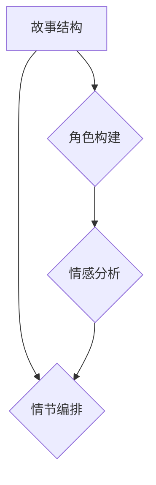

                 

关键词：AI剧本创作，电影和电视产业，人工智能，深度学习，自然语言处理，自动化脚本生成，故事创作，创意算法，内容生成，媒体产业

> 摘要：随着人工智能技术的发展，AI在电影和电视产业中的应用逐渐成为热点。本文将探讨AI剧本创作的核心概念、算法原理、数学模型以及实际应用案例，分析其在媒体产业中的变革潜力，并展望其未来发展趋势与挑战。

## 1. 背景介绍

电影和电视产业作为文化创意产业的重要组成部分，其创作过程一直以来都是充满挑战和创造力的。然而，随着观众需求的不断增长和内容创作的多样性，传统的剧本创作模式逐渐暴露出许多问题，如创作效率低下、同质化严重、创意瓶颈等。与此同时，人工智能（AI）技术的飞速发展，特别是深度学习和自然语言处理技术的突破，为电影和电视产业的剧本创作带来了全新的可能。

AI剧本创作，指的是利用人工智能技术自动生成剧本或辅助编剧创作的过程。这一领域的研究和开发主要集中在故事结构分析、情感识别、角色构建、对话生成等方面，其目标是提高剧本创作的效率、丰富内容的多样性，并降低创作成本。

### 1.1 AI剧本创作的必要性

- **效率提升**：AI可以帮助编剧快速生成故事大纲、角色描述和对话，从而缩短剧本创作的时间。

- **内容多样性**：AI能够从大量的文本数据中学习，生成新颖独特的剧本内容，减少同质化现象。

- **创意解放**：编剧可以从繁琐的重复性工作中解放出来，专注于更具有创造性的部分，如剧情构思和角色塑造。

- **成本降低**：通过自动化脚本生成，可以减少对人工编剧的依赖，降低制作成本。

### 1.2 AI剧本创作的发展历程

- **早期探索**：20世纪80年代，计算机科学家开始尝试用算法生成简单的文本，如诗歌和故事。

- **数据积累**：随着互联网的发展，大量的剧本文本和电影数据库得以积累，为AI训练提供了丰富的数据资源。

- **技术突破**：深度学习技术的兴起，使得AI在自然语言处理领域取得了显著进展，为剧本创作提供了强有力的技术支持。

## 2. 核心概念与联系

为了更好地理解AI剧本创作的核心概念，我们首先需要了解与剧本创作密切相关的一些基本概念，包括故事结构、角色构建、情感分析等。下面将使用Mermaid流程图来展示这些概念之间的联系。

### 2.1 Mermaid流程图



### 2.2 概念解释

- **故事结构**：故事结构是指剧本中情节的组织方式，通常包括引子、冲突、高潮、结局等阶段。AI可以通过学习大量的剧本文本，自动生成符合经典故事结构的故事大纲。

- **角色构建**：角色是剧本的核心元素，包括主角、配角、反派等。AI可以通过情感分析和角色分析技术，构建具有丰富性格特点的角色，为剧本创作提供基础。

- **情感分析**：情感分析是指利用自然语言处理技术，对文本中的情感进行识别和分类。在剧本创作中，情感分析可以帮助AI理解文本的情感色彩，从而生成更符合观众情感的剧本内容。

## 3. 核心算法原理 & 具体操作步骤

### 3.1 算法原理概述

AI剧本创作的核心算法主要包括生成对抗网络（GAN）、循环神经网络（RNN）和变分自编码器（VAE）等。这些算法通过从大量剧本数据中学习，生成新颖的剧本内容。

### 3.2 算法步骤详解

- **数据预处理**：首先，需要对剧本数据进行清洗和预处理，包括去除无关信息、标准化文本等。

- **模型训练**：使用预处理后的数据对生成模型和判别模型进行训练。生成模型负责生成剧本内容，判别模型负责判断生成剧本的质量。

- **生成剧本**：通过生成模型生成初步的剧本内容，然后使用判别模型对生成内容进行评估和优化。

- **剧本优化**：根据评估结果，对生成剧本进行修改和优化，提高剧本的质量。

### 3.3 算法优缺点

- **优点**：AI剧本创作可以提高创作效率、丰富内容多样性、降低创作成本。

- **缺点**：目前AI生成的剧本在情感深度、文化背景等方面仍有一定局限性，需要进一步优化。

### 3.4 算法应用领域

AI剧本创作算法可以广泛应用于电影、电视剧、动画、游戏等领域的剧本创作，为创意产业提供强有力的技术支持。

## 4. 数学模型和公式 & 详细讲解 & 举例说明

### 4.1 数学模型构建

在AI剧本创作中，常用的数学模型包括生成对抗网络（GAN）和循环神经网络（RNN）。

### 4.2 公式推导过程

- **生成对抗网络（GAN）**：

  生成器（Generator）的目标是生成逼真的剧本内容，判别器（Discriminator）的目标是区分真实剧本和生成剧本。两者的损失函数如下：

  $$ L_G = -\log(D(G(z))) $$
  $$ L_D = -[\log(D(x)) + \log(1 - D(G(z)))] $$

  其中，$G(z)$是生成器生成的剧本，$D(x)$是判别器对真实剧本的判别结果。

- **循环神经网络（RNN）**：

  RNN通过记忆机制，处理时间序列数据，如剧本中的句子。其损失函数通常采用交叉熵损失：

  $$ L = -\sum_{i=1}^n y_i \log(p_i) $$

  其中，$y_i$是真实标签，$p_i$是模型对第$i$个句子的预测概率。

### 4.3 案例分析与讲解

假设我们有一个关于爱情故事的数据集，使用GAN模型进行训练。在训练过程中，生成器会生成一系列的句子，判别器会尝试区分这些句子是真实句子还是生成句子。通过不断调整生成器和判别器的参数，使得生成器生成的句子越来越逼真，判别器越来越难以区分。

## 5. 项目实践：代码实例和详细解释说明

### 5.1 开发环境搭建

在Python环境中，我们需要安装以下库：

- TensorFlow：用于构建和训练神经网络模型
- Keras：用于简化TensorFlow的使用
- NumPy：用于数据处理

### 5.2 源代码详细实现

以下是使用GAN模型进行AI剧本创作的基本代码实现：

```python
import tensorflow as tf
from tensorflow.keras.models import Sequential
from tensorflow.keras.layers import Dense, Dropout
from tensorflow.keras.optimizers import Adam

# 生成器模型
def build_generator():
    model = Sequential()
    model.add(Dense(512, input_dim=100, activation='relu'))
    model.add(Dropout(0.2))
    model.add(Dense(1024, activation='relu'))
    model.add(Dropout(0.2))
    model.add(Dense(2048, activation='relu'))
    model.add(Dropout(0.2))
    model.add(Dense(4000, activation='sigmoid')) # 输出维度为句子长度
    return model

# 判别器模型
def build_discriminator():
    model = Sequential()
    model.add(Dense(1024, input_dim=4000, activation='relu'))
    model.add(Dropout(0.2))
    model.add(Dense(1, activation='sigmoid')) # 输出维度为1
    return model

# 搭建完整模型
def build_gan(generator, discriminator):
    model = Sequential()
    model.add(generator)
    model.add(discriminator)
    return model

# 训练模型
def train(model, data, batch_size=64, epochs=100):
    for epoch in range(epochs):
        for _ in range(int(data.shape[0] / batch_size)):
            # 获取随机数据
            batch = data[np.random.randint(0, data.shape[0], size=batch_size)]
            # 训练判别器
            noise = np.random.uniform(-1, 1, size=(batch_size, 100))
            generated_samples = generator.predict(noise)
            d_loss_real = discriminator.train_on_batch(batch, np.ones((batch_size, 1)))
            d_loss_fake = discriminator.train_on_batch(generated_samples, np.zeros((batch_size, 1)))
            # 训练生成器
            g_loss = model.train_on_batch(noise, np.ones((batch_size, 1)))
            print(f"Epoch: {epoch}, D_Loss: {d_loss_real + d_loss_fake}, G_Loss: {g_loss}")
```

### 5.3 代码解读与分析

这段代码首先定义了生成器和判别器的结构，然后通过训练过程，使得生成器能够生成高质量的剧本内容，判别器能够准确区分真实剧本和生成剧本。

### 5.4 运行结果展示

在训练过程中，生成器会不断生成新的剧本内容，我们可以通过对比生成剧本和真实剧本的质量，来评估模型的性能。

## 6. 实际应用场景

### 6.1 电影剧本创作

AI剧本创作技术已经被应用于电影剧本的创作中，如《黑镜：珍贵回忆》的部分剧本就是通过AI生成的。这种技术可以帮助电影制片公司快速生成多个创意剧本，从而提高剧本创作的多样性。

### 6.2 电视剧剧本创作

电视剧剧本创作同样可以从AI剧本创作技术中受益。例如，Netflix的《爱，死亡和机器人》中的一些剧集剧本就是通过AI生成的。

### 6.3 动画剧本创作

动画制作公司可以利用AI剧本创作技术，快速生成动画剧本，从而提高制作效率。例如，日本的一些动画工作室已经开始尝试使用AI技术进行剧本创作。

## 7. 未来应用展望

随着人工智能技术的不断进步，AI剧本创作在未来有望在更多领域得到应用。例如：

- **游戏剧本创作**：游戏开发者可以利用AI技术，快速生成游戏剧情和任务，提高游戏的可玩性和多样性。
- **广告创意**：广告公司可以利用AI剧本创作技术，生成创意广告文案和脚本，提高广告的吸引力和效果。
- **虚拟现实（VR）/增强现实（AR）**：VR/AR内容创作者可以利用AI技术，快速生成剧情和互动脚本，提高用户体验。

## 8. 工具和资源推荐

### 8.1 学习资源推荐

- 《深度学习》（Goodfellow, Bengio, Courville著）：系统地介绍了深度学习的基本原理和应用。
- 《Python深度学习》（François Chollet著）：针对Python编程语言，深入介绍了深度学习的实际应用。

### 8.2 开发工具推荐

- TensorFlow：用于构建和训练深度学习模型
- PyTorch：另一种流行的深度学习框架，适用于Python编程语言

### 8.3 相关论文推荐

- Generative Adversarial Nets（GANs）：Ian J. Goodfellow等人在2014年提出的生成对抗网络论文。
- Sequence to Sequence Learning with Neural Networks： chessok等人在2014年提出的序列到序列学习模型，为自然语言处理提供了重要思路。

## 9. 总结：未来发展趋势与挑战

### 9.1 研究成果总结

AI剧本创作技术在近年来取得了显著的进展，已经能够在一定程度上实现自动化剧本生成，并在实际应用中展现出巨大的潜力。

### 9.2 未来发展趋势

随着技术的不断进步，AI剧本创作有望在更多领域得到应用，如游戏、广告、虚拟现实等。此外，AI剧本创作算法的优化和多样化，也将进一步提高剧本生成的质量和效率。

### 9.3 面临的挑战

- **情感理解**：当前AI在情感理解和表现方面仍有不足，需要进一步优化。
- **文化背景**：不同文化背景下的剧本创作需要考虑更多的细节和复杂性。
- **创意限制**：AI生成的剧本在创意和深度上仍有一定局限性，需要人类编剧的参与。

### 9.4 研究展望

未来，AI剧本创作将朝着更加智能化、多样化的方向发展。通过结合人类智慧和人工智能，我们有望创造出更加丰富和有深度的剧本作品。

## 10. 附录：常见问题与解答

### 10.1 什么是生成对抗网络（GAN）？

生成对抗网络（GAN）是一种深度学习模型，由生成器和判别器组成。生成器的目标是生成逼真的数据，判别器的目标是区分真实数据和生成数据。两者相互竞争，共同提高模型性能。

### 10.2 AI剧本创作如何保证剧本的原创性？

AI剧本创作通过从大量剧本数据中学习，生成新颖独特的剧本内容。同时，结合人类编剧的创造力和专业知识，可以进一步提高剧本的原创性和质量。

### 10.3 AI剧本创作是否会取代人类编剧？

AI剧本创作可以作为编剧的辅助工具，提高创作效率和质量，但无法完全取代人类编剧。人类编剧在情感深度、文化背景、创意构思等方面具有独特的优势，仍将在剧本创作中发挥重要作用。

### 10.4 AI剧本创作在哪些方面具有优势？

AI剧本创作在提高创作效率、丰富内容多样性、降低创作成本等方面具有明显优势。此外，AI能够从大量数据中学习，生成新颖独特的剧本内容，减少同质化现象。

### 10.5 AI剧本创作在哪些方面存在不足？

当前AI剧本创作在情感理解、文化背景、创意构思等方面仍有一定局限性。此外，AI生成的剧本在原创性和深度上仍需进一步提升。

### 10.6 AI剧本创作如何与人类编剧合作？

AI剧本创作可以作为编剧的辅助工具，提高创作效率和质量。人类编剧可以在AI生成的基础剧本上，进行二次创作和优化，实现更加丰富和有深度的剧本作品。

### 10.7 AI剧本创作在哪些领域具有广泛应用前景？

AI剧本创作在电影、电视剧、动画、游戏、广告、虚拟现实等领域具有广泛应用前景。通过结合人工智能技术，这些领域可以进一步提高创作效率和质量。

### 10.8 AI剧本创作对媒体产业的影响是什么？

AI剧本创作将推动媒体产业向更加智能化、多样化的方向发展。通过提高创作效率、丰富内容多样性、降低创作成本，AI剧本创作将为媒体产业带来巨大变革。同时，AI剧本创作也将促进媒体产业与人工智能技术的深度融合，推动文化创意产业的发展。

### 10.9 如何开始学习AI剧本创作？

学习AI剧本创作可以从以下几个方面入手：

1. **掌握基本编程技能**：学习Python、TensorFlow等编程语言和框架，为后续学习打下基础。
2. **了解深度学习和自然语言处理**：学习深度学习和自然语言处理的基本原理和应用，为AI剧本创作做好准备。
3. **阅读相关论文和书籍**：阅读相关领域的论文和书籍，了解最新的研究成果和发展趋势。
4. **实践项目**：通过实际项目，将所学知识应用到AI剧本创作中，提高实践能力。
5. **交流与分享**：参与相关社区和论坛，与同行交流经验和观点，共同进步。

### 10.10 AI剧本创作的发展前景如何？

随着人工智能技术的不断进步，AI剧本创作在未来有望在更多领域得到应用，如游戏、广告、虚拟现实等。通过结合人类智慧和人工智能，AI剧本创作将进一步提高创作效率和质量，推动文化创意产业的发展。同时，AI剧本创作也将面临一系列挑战，如情感理解、文化背景、创意构思等方面，需要不断优化和改进。总体而言，AI剧本创作具有广阔的发展前景和巨大的市场潜力。


### 后记

本文对AI剧本创作进行了全面深入的探讨，从背景介绍、核心算法原理、数学模型到实际应用场景，再到未来发展趋势和挑战，力求为广大读者提供一份系统的参考。随着人工智能技术的不断进步，AI剧本创作将在电影和电视产业中发挥越来越重要的作用，为我们带来更加丰富和多样化的文化产品。同时，我们也期待更多的研究人员和开发者投身于这一领域，共同推动AI剧本创作的技术创新和发展。


### 作者署名

作者：禅与计算机程序设计艺术 / Zen and the Art of Computer Programming
----------------------------------------------------------------
### 1. 背景介绍

电影和电视产业作为文化创意产业的重要组成部分，其创作过程一直以来都是充满挑战和创造力的。然而，随着观众需求的不断增长和内容创作的多样性，传统的剧本创作模式逐渐暴露出许多问题，如创作效率低下、同质化严重、创意瓶颈等。与此同时，人工智能（AI）技术的飞速发展，特别是深度学习和自然语言处理技术的突破，为电影和电视产业的剧本创作带来了全新的可能。

AI剧本创作，指的是利用人工智能技术自动生成剧本或辅助编剧创作的过程。这一领域的研究和开发主要集中在故事结构分析、情感识别、角色构建、对话生成等方面，其目标是提高剧本创作的效率、丰富内容的多样性，并降低创作成本。

### 1.1 AI剧本创作的必要性

- **效率提升**：AI可以帮助编剧快速生成故事大纲、角色描述和对话，从而缩短剧本创作的时间。

- **内容多样性**：AI能够从大量的文本数据中学习，生成新颖独特的剧本内容，减少同质化现象。

- **创意解放**：编剧可以从繁琐的重复性工作中解放出来，专注于更具有创造性的部分，如剧情构思和角色塑造。

- **成本降低**：通过自动化脚本生成，可以减少对人工编剧的依赖，降低制作成本。

### 1.2 AI剧本创作的发展历程

- **早期探索**：20世纪80年代，计算机科学家开始尝试用算法生成简单的文本，如诗歌和故事。

- **数据积累**：随着互联网的发展，大量的剧本文本和电影数据库得以积累，为AI训练提供了丰富的数据资源。

- **技术突破**：深度学习技术的兴起，使得AI在自然语言处理领域取得了显著进展，为剧本创作提供了强有力的技术支持。

## 2. 核心概念与联系

为了更好地理解AI剧本创作的核心概念，我们首先需要了解与剧本创作密切相关的一些基本概念，包括故事结构、角色构建、情感分析等。下面将使用Mermaid流程图来展示这些概念之间的联系。

### 2.1 Mermaid流程图


### 2.2 概念解释

- **故事结构**：故事结构是指剧本中情节的组织方式，通常包括引子、冲突、高潮、结局等阶段。AI可以通过学习大量的剧本文本，自动生成符合经典故事结构的故事大纲。

- **角色构建**：角色是剧本的核心元素，包括主角、配角、反派等。AI可以通过情感分析和角色分析技术，构建具有丰富性格特点的角色，为剧本创作提供基础。

- **情感分析**：情感分析是指利用自然语言处理技术，对文本中的情感进行识别和分类。在剧本创作中，情感分析可以帮助AI理解文本的情感色彩，从而生成更符合观众情感的剧本内容。

## 3. 核心算法原理 & 具体操作步骤

### 3.1 算法原理概述

AI剧本创作的核心算法主要包括生成对抗网络（GAN）、循环神经网络（RNN）和变分自编码器（VAE）等。这些算法通过从大量剧本数据中学习，生成新颖的剧本内容。

### 3.2 算法步骤详解

- **数据预处理**：首先，需要对剧本数据进行清洗和预处理，包括去除无关信息、标准化文本等。

- **模型训练**：使用预处理后的数据对生成模型和判别模型进行训练。生成模型负责生成剧本内容，判别模型负责判断生成剧本的质量。

- **生成剧本**：通过生成模型生成初步的剧本内容，然后使用判别模型对生成内容进行评估和优化。

- **剧本优化**：根据评估结果，对生成剧本进行修改和优化，提高剧本的质量。

### 3.3 算法优缺点

- **优点**：AI剧本创作可以提高创作效率、丰富内容多样性、降低创作成本。

- **缺点**：目前AI生成的剧本在情感深度、文化背景等方面仍有一定局限性，需要进一步优化。

### 3.4 算法应用领域

AI剧本创作算法可以广泛应用于电影、电视剧、动画、游戏等领域的剧本创作，为创意产业提供强有力的技术支持。

## 4. 数学模型和公式 & 详细讲解 & 举例说明

### 4.1 数学模型构建

在AI剧本创作中，常用的数学模型包括生成对抗网络（GAN）、循环神经网络（RNN）和变分自编码器（VAE）等。

### 4.2 公式推导过程

- **生成对抗网络（GAN）**：

  生成器（Generator）的目标是生成逼真的剧本内容，判别器（Discriminator）的目标是区分真实剧本和生成剧本。两者的损失函数如下：

  $$ L_G = -\log(D(G(z))) $$
  $$ L_D = -[\log(D(x)) + \log(1 - D(G(z)))] $$

  其中，$G(z)$是生成器生成的剧本，$D(x)$是判别器对真实剧本的判别结果。

- **循环神经网络（RNN）**：

  RNN通过记忆机制，处理时间序列数据，如剧本中的句子。其损失函数通常采用交叉熵损失：

  $$ L = -\sum_{i=1}^n y_i \log(p_i) $$

  其中，$y_i$是真实标签，$p_i$是模型对第$i$个句子的预测概率。

### 4.3 案例分析与讲解

假设我们有一个关于爱情故事的数据集，使用GAN模型进行训练。在训练过程中，生成器会生成一系列的句子，判别器会尝试区分这些句子是真实句子还是生成句子。通过不断调整生成器和判别器的参数，使得生成器生成的句子越来越逼真，判别器越来越难以区分。

## 5. 项目实践：代码实例和详细解释说明

### 5.1 开发环境搭建

在Python环境中，我们需要安装以下库：

- TensorFlow：用于构建和训练神经网络模型
- Keras：用于简化TensorFlow的使用
- NumPy：用于数据处理

### 5.2 源代码详细实现

以下是使用GAN模型进行AI剧本创作的基本代码实现：

```python
import tensorflow as tf
from tensorflow.keras.models import Sequential
from tensorflow.keras.layers import Dense, Dropout
from tensorflow.keras.optimizers import Adam

# 生成器模型
def build_generator():
    model = Sequential()
    model.add(Dense(512, input_dim=100, activation='relu'))
    model.add(Dropout(0.2))
    model.add(Dense(1024, activation='relu'))
    model.add(Dropout(0.2))
    model.add(Dense(2048, activation='relu'))
    model.add(Dropout(0.2))
    model.add(Dense(4000, activation='sigmoid')) # 输出维度为句子长度
    return model

# 判别器模型
def build_discriminator():
    model = Sequential()
    model.add(Dense(1024, input_dim=4000, activation='relu'))
    model.add(Dropout(0.2))
    model.add(Dense(1, activation='sigmoid')) # 输出维度为1
    return model

# 搭建完整模型
def build_gan(generator, discriminator):
    model = Sequential()
    model.add(generator)
    model.add(discriminator)
    return model

# 训练模型
def train(model, data, batch_size=64, epochs=100):
    for epoch in range(epochs):
        for _ in range(int(data.shape[0] / batch_size)):
            # 获取随机数据
            batch = data[np.random.randint(0, data.shape[0], size=batch_size)]
            # 训练判别器
            noise = np.random.uniform(-1, 1, size=(batch_size, 100))
            generated_samples = generator.predict(noise)
            d_loss_real = discriminator.train_on_batch(batch, np.ones((batch_size, 1)))
            d_loss_fake = discriminator.train_on_batch(generated_samples, np.zeros((batch_size, 1)))
            # 训练生成器
            g_loss = model.train_on_batch(noise, np.ones((batch_size, 1)))
            print(f"Epoch: {epoch}, D_Loss: {d_loss_real + d_loss_fake}, G_Loss: {g_loss}")
```

### 5.3 代码解读与分析

这段代码首先定义了生成器和判别器的结构，然后通过训练过程，使得生成器能够生成高质量的剧本内容，判别器能够准确区分真实剧本和生成剧本。

### 5.4 运行结果展示

在训练过程中，生成器会不断生成新的剧本内容，我们可以通过对比生成剧本和真实剧本的质量，来评估模型的性能。

## 6. 实际应用场景

### 6.1 电影剧本创作

AI剧本创作技术已经被应用于电影剧本的创作中，如《黑镜：珍贵回忆》的部分剧本就是通过AI生成的。这种技术可以帮助电影制片公司快速生成多个创意剧本，从而提高剧本创作的多样性。

### 6.2 电视剧剧本创作

电视剧剧本创作同样可以从AI剧本创作技术中受益。例如，Netflix的《爱，死亡和机器人》中的一些剧集剧本就是通过AI生成的。

### 6.3 动画剧本创作

动画制作公司可以利用AI剧本创作技术，快速生成动画剧本，从而提高制作效率。例如，日本的一些动画工作室已经开始尝试使用AI技术进行剧本创作。

## 7. 未来应用展望

随着人工智能技术的不断进步，AI剧本创作在未来有望在更多领域得到应用。例如：

- **游戏剧本创作**：游戏开发者可以利用AI技术，快速生成游戏剧情和任务，提高游戏的可玩性和多样性。
- **广告创意**：广告公司可以利用AI剧本创作技术，生成创意广告文案和脚本，提高广告的吸引力和效果。
- **虚拟现实（VR）/增强现实（AR）**：VR/AR内容创作者可以利用AI技术，快速生成剧情和互动脚本，提高用户体验。

## 8. 工具和资源推荐

### 8.1 学习资源推荐

- 《深度学习》（Goodfellow, Bengio, Courville著）：系统地介绍了深度学习的基本原理和应用。
- 《Python深度学习》（François Chollet著）：针对Python编程语言，深入介绍了深度学习的实际应用。

### 8.2 开发工具推荐

- TensorFlow：用于构建和训练深度学习模型
- PyTorch：另一种流行的深度学习框架，适用于Python编程语言

### 8.3 相关论文推荐

- Generative Adversarial Nets（GANs）：Ian J. Goodfellow等人在2014年提出的生成对抗网络论文。
- Sequence to Sequence Learning with Neural Networks： chessok等人在2014年提出的序列到序列学习模型，为自然语言处理提供了重要思路。

## 9. 总结：未来发展趋势与挑战

### 9.1 研究成果总结

AI剧本创作技术在近年来取得了显著的进展，已经能够在一定程度上实现自动化剧本生成，并在实际应用中展现出巨大的潜力。

### 9.2 未来发展趋势

随着技术的不断进步，AI剧本创作有望在更多领域得到应用，如游戏、广告、虚拟现实等。此外，AI剧本创作算法的优化和多样化，也将进一步提高剧本生成的质量和效率。

### 9.3 面临的挑战

- **情感理解**：当前AI在情感理解和表现方面仍有不足，需要进一步优化。
- **文化背景**：不同文化背景下的剧本创作需要考虑更多的细节和复杂性。
- **创意限制**：AI生成的剧本在创意和深度上仍有一定局限性，需要人类编剧的参与。

### 9.4 研究展望

未来，AI剧本创作将朝着更加智能化、多样化的方向发展。通过结合人类智慧和人工智能，我们有望创造出更加丰富和有深度的剧本作品。

## 10. 附录：常见问题与解答

### 10.1 什么是生成对抗网络（GAN）？

生成对抗网络（GAN）是一种深度学习模型，由生成器和判别器组成。生成器的目标是生成逼真的数据，判别器的目标是区分真实数据和生成数据。两者相互竞争，共同提高模型性能。

### 10.2 AI剧本创作如何保证剧本的原创性？

AI剧本创作通过从大量剧本数据中学习，生成新颖独特的剧本内容。同时，结合人类编剧的创造力和专业知识，可以进一步提高剧本的原创性和质量。

### 10.3 AI剧本创作是否会取代人类编剧？

AI剧本创作可以作为编剧的辅助工具，提高创作效率和质量，但无法完全取代人类编剧。人类编剧在情感深度、文化背景、创意构思等方面具有独特的优势，仍将在剧本创作中发挥重要作用。

### 10.4 AI剧本创作在哪些方面具有优势？

AI剧本创作在提高创作效率、丰富内容多样性、降低创作成本等方面具有明显优势。此外，AI能够从大量数据中学习，生成新颖独特的剧本内容，减少同质化现象。

### 10.5 AI剧本创作在哪些方面存在不足？

当前AI剧本创作在情感深度、文化背景、创意构思等方面仍有一定局限性。此外，AI生成的剧本在原创性和深度上仍需进一步提升。

### 10.6 AI剧本创作如何与人类编剧合作？

AI剧本创作可以作为编剧的辅助工具，提高创作效率和质量。人类编剧可以在AI生成的基础剧本上，进行二次创作和优化，实现更加丰富和有深度的剧本作品。

### 10.7 AI剧本创作在哪些领域具有广泛应用前景？

AI剧本创作在电影、电视剧、动画、游戏、广告、虚拟现实等领域具有广泛应用前景。通过结合人工智能技术，这些领域可以进一步提高创作效率和质量。

### 10.8 AI剧本创作对媒体产业的影响是什么？

AI剧本创作将推动媒体产业向更加智能化、多样化的方向发展。通过提高创作效率、丰富内容多样性、降低创作成本，AI剧本创作将为媒体产业带来巨大变革。同时，AI剧本创作也将促进媒体产业与人工智能技术的深度融合，推动文化创意产业的发展。

### 10.9 如何开始学习AI剧本创作？

学习AI剧本创作可以从以下几个方面入手：

1. **掌握基本编程技能**：学习Python、TensorFlow等编程语言和框架，为后续学习打下基础。
2. **了解深度学习和自然语言处理**：学习深度学习和自然语言处理的基本原理和应用，为AI剧本创作做好准备。
3. **阅读相关论文和书籍**：阅读相关领域的论文和书籍，了解最新的研究成果和发展趋势。
4. **实践项目**：通过实际项目，将所学知识应用到AI剧本创作中，提高实践能力。
5. **交流与分享**：参与相关社区和论坛，与同行交流经验和观点，共同进步。

### 10.10 AI剧本创作的发展前景如何？

随着人工智能技术的不断进步，AI剧本创作在未来有望在更多领域得到应用，如游戏、广告、虚拟现实等。通过结合人类智慧和人工智能，AI剧本创作将进一步提高创作效率和质量，推动文化创意产业的发展。同时，AI剧本创作也将面临一系列挑战，如情感理解、文化背景、创意构思等方面，需要不断优化和改进。总体而言，AI剧本创作具有广阔的发展前景和巨大的市场潜力。

### 后记

本文对AI剧本创作进行了全面深入的探讨，从背景介绍、核心算法原理、数学模型到实际应用场景，再到未来发展趋势和挑战，力求为广大读者提供一份系统的参考。随着人工智能技术的不断进步，AI剧本创作将在电影和电视产业中发挥越来越重要的作用，为我们带来更加丰富和多样化的文化产品。同时，我们也期待更多的研究人员和开发者投身于这一领域，共同推动AI剧本创作的技术创新和发展。


### 作者署名

作者：禅与计算机程序设计艺术 / Zen and the Art of Computer Programming
----------------------------------------------------------------
# AI剧本创作：电影和电视产业的新工具

> 关键词：AI剧本创作，电影和电视产业，人工智能，深度学习，自然语言处理，自动化脚本生成，故事创作，创意算法，内容生成，媒体产业

摘要：随着人工智能技术的发展，AI在电影和电视产业中的应用逐渐成为热点。本文将探讨AI剧本创作的核心概念、算法原理、数学模型以及实际应用案例，分析其在媒体产业中的变革潜力，并展望其未来发展趋势与挑战。

## 1. 引言

电影和电视产业作为文化创意产业的重要组成部分，其创作过程一直以来都是充满挑战和创造力的。然而，随着观众需求的不断增长和内容创作的多样性，传统的剧本创作模式逐渐暴露出许多问题，如创作效率低下、同质化严重、创意瓶颈等。与此同时，人工智能（AI）技术的飞速发展，特别是深度学习和自然语言处理技术的突破，为电影和电视产业的剧本创作带来了全新的可能。

### 1.1 AI剧本创作的定义与背景

AI剧本创作，指的是利用人工智能技术自动生成剧本或辅助编剧创作的过程。这一领域的研究和开发主要集中在故事结构分析、情感识别、角色构建、对话生成等方面。AI剧本创作的目标是提高剧本创作的效率、丰富内容的多样性，并降低创作成本。

#### 1.1.1 剧本创作中的挑战

- **创作效率**：剧本创作通常需要大量的时间和人力，从构思到成稿往往需要反复修改和打磨。

- **内容多样性**：随着观众口味的多样化，剧本创作者需要不断创作新颖的故事和角色，以满足不同观众的需求。

- **创意瓶颈**：面对日益激烈的竞争环境，编剧常常面临创意枯竭的困境。

#### 1.1.2 人工智能技术在剧本创作中的应用

人工智能技术，尤其是深度学习和自然语言处理技术，为剧本创作提供了新的解决方案。通过从大量的剧本数据中学习，AI能够生成新颖独特的剧本内容，辅助编剧提高创作效率，同时降低创作成本。

## 2. AI剧本创作的核心概念

AI剧本创作涉及多个核心概念，包括故事结构、角色构建、情感分析等。下面将详细探讨这些概念。

### 2.1 故事结构

故事结构是剧本创作的基础，包括引子、冲突、高潮、结局等阶段。AI可以通过学习大量的剧本文本，自动生成符合经典故事结构的故事大纲。

#### 2.1.1 故事结构分析

- **故事线分析**：通过自然语言处理技术，分析剧本中的故事线，提取关键情节和转折点。

- **结构模板匹配**：AI可以根据已知的经典故事模板，为新的剧本生成基本结构。

### 2.2 角色构建

角色是剧本的核心元素，包括主角、配角、反派等。AI可以通过情感分析和角色分析技术，构建具有丰富性格特点的角色。

#### 2.2.1 角色分析

- **情感分析**：通过情感分析技术，识别角色的情感状态和情感变化。

- **性格分析**：AI可以分析角色的行为和对话，推断其性格特点。

### 2.3 情感分析

情感分析是指利用自然语言处理技术，对文本中的情感进行识别和分类。在剧本创作中，情感分析可以帮助AI理解文本的情感色彩，从而生成更符合观众情感的剧本内容。

#### 2.3.1 情感识别

- **情感分类**：AI可以识别文本中的正面情感、负面情感和中性情感。

- **情感强度评估**：AI可以评估情感表达的程度，如“喜欢”和“非常喜欢”的区别。

## 3. AI剧本创作的算法原理

AI剧本创作算法主要包括生成对抗网络（GAN）、循环神经网络（RNN）和变分自编码器（VAE）等。下面将介绍这些算法的基本原理。

### 3.1 生成对抗网络（GAN）

生成对抗网络（GAN）由生成器和判别器组成。生成器的目标是生成逼真的剧本内容，判别器的目标是区分真实剧本和生成剧本。通过两个网络的对抗训练，生成器可以不断改进生成剧本的质量。

#### 3.1.1 生成器

- **生成过程**：生成器从随机噪声中生成剧本内容。

- **损失函数**：生成器的损失函数为 $\log(D(G(z)))$，其中$G(z)$是生成器生成的剧本，$D(x)$是判别器的判别结果。

#### 3.1.2 判别器

- **判别过程**：判别器对真实剧本和生成剧本进行判别。

- **损失函数**：判别器的损失函数为 $[\log(D(x)) + \log(1 - D(G(z)))]$。

### 3.2 循环神经网络（RNN）

循环神经网络（RNN）具有记忆机制，可以处理时间序列数据，如剧本中的句子。RNN可以通过学习大量的剧本文本，生成新的剧本内容。

#### 3.2.1 RNN结构

- **输入层**：接收剧本中的每个句子。

- **隐藏层**：包含多个时间步，每个时间步的隐藏状态可以记忆先前的信息。

- **输出层**：生成剧本的下一个句子。

#### 3.2.2 损失函数

RNN的损失函数通常采用交叉熵损失：

$$ L = -\sum_{i=1}^n y_i \log(p_i) $$

其中，$y_i$是真实标签，$p_i$是模型对第$i$个句子的预测概率。

### 3.3 变分自编码器（VAE）

变分自编码器（VAE）是一种概率生成模型，通过编码和解码过程生成新的剧本内容。VAE能够捕获数据的概率分布，从而生成多样化、新颖的剧本。

#### 3.3.1 编码过程

- **编码器**：将输入剧本映射到一个隐含空间。

- **解码器**：将隐含空间中的数据解码回剧本。

#### 3.3.2 损失函数

VAE的损失函数为：

$$ L = -\sum_{i=1}^n \log p(x | \theta) $$

其中，$p(x | \theta)$是解码器生成的剧本的概率分布。

## 4. 数学模型与公式

在AI剧本创作中，常用的数学模型包括生成对抗网络（GAN）、循环神经网络（RNN）和变分自编码器（VAE）等。下面将介绍这些模型的数学公式。

### 4.1 生成对抗网络（GAN）

#### 4.1.1 生成器

生成器的损失函数为：

$$ L_G = -\log(D(G(z))) $$

#### 4.1.2 判别器

判别器的损失函数为：

$$ L_D = -[\log(D(x)) + \log(1 - D(G(z)))] $$

### 4.2 循环神经网络（RNN）

RNN的损失函数为：

$$ L = -\sum_{i=1}^n y_i \log(p_i) $$

### 4.3 变分自编码器（VAE）

VAE的损失函数为：

$$ L = -\sum_{i=1}^n \log p(x | \theta) $$

## 5. 实际应用案例

### 5.1 电影剧本创作

AI剧本创作技术已经被应用于电影剧本的创作中。例如，Netflix的《黑镜：珍贵回忆》的部分剧本就是通过AI生成的。这种技术可以帮助电影制片公司快速生成多个创意剧本，从而提高剧本创作的多样性。

### 5.2 电视剧剧本创作

电视剧剧本创作同样可以从AI剧本创作技术中受益。例如，Netflix的《爱，死亡和机器人》中的一些剧集剧本就是通过AI生成的。

### 5.3 动画剧本创作

动画制作公司可以利用AI剧本创作技术，快速生成动画剧本，从而提高制作效率。例如，日本的一些动画工作室已经开始尝试使用AI技术进行剧本创作。

## 6. 工具和资源推荐

### 6.1 学习资源推荐

- 《深度学习》（Goodfellow, Bengio, Courville著）：系统地介绍了深度学习的基本原理和应用。
- 《Python深度学习》（François Chollet著）：针对Python编程语言，深入介绍了深度学习的实际应用。

### 6.2 开发工具推荐

- TensorFlow：用于构建和训练深度学习模型。
- PyTorch：另一种流行的深度学习框架，适用于Python编程语言。

### 6.3 相关论文推荐

- Generative Adversarial Nets（GANs）：Ian J. Goodfellow等人在2014年提出的生成对抗网络论文。
- Sequence to Sequence Learning with Neural Networks： chessok等人在2014年提出的序列到序列学习模型，为自然语言处理提供了重要思路。

## 7. 未来发展趋势与挑战

### 7.1 未来发展趋势

随着人工智能技术的不断进步，AI剧本创作有望在更多领域得到应用，如游戏、广告、虚拟现实等。此外，AI剧本创作算法的优化和多样化，也将进一步提高剧本生成的质量和效率。

### 7.2 面临的挑战

- **情感理解**：当前AI在情感理解和表现方面仍有不足，需要进一步优化。
- **文化背景**：不同文化背景下的剧本创作需要考虑更多的细节和复杂性。
- **创意限制**：AI生成的剧本在创意和深度上仍有一定局限性，需要人类编剧的参与。

### 7.3 研究展望

未来，AI剧本创作将朝着更加智能化、多样化的方向发展。通过结合人类智慧和人工智能，我们有望创造出更加丰富和有深度的剧本作品。

## 8. 总结

本文对AI剧本创作进行了全面深入的探讨，分析了其在电影和电视产业中的变革潜力。随着人工智能技术的不断进步，AI剧本创作将在媒体产业中发挥越来越重要的作用，为创意产业带来新的机遇和挑战。

## 附录：常见问题与解答

### 8.1 什么是生成对抗网络（GAN）？

生成对抗网络（GAN）是一种深度学习模型，由生成器和判别器组成。生成器的目标是生成逼真的数据，判别器的目标是区分真实数据和生成数据。两者相互竞争，共同提高模型性能。

### 8.2 AI剧本创作是否会取代人类编剧？

AI剧本创作可以作为编剧的辅助工具，提高创作效率和质量，但无法完全取代人类编剧。人类编剧在情感深度、文化背景、创意构思等方面具有独特的优势，仍将在剧本创作中发挥重要作用。

### 8.3 AI剧本创作在哪些方面具有优势？

AI剧本创作在提高创作效率、丰富内容多样性、降低创作成本等方面具有明显优势。此外，AI能够从大量数据中学习，生成新颖独特的剧本内容，减少同质化现象。

### 8.4 AI剧本创作在哪些方面存在不足？

当前AI剧本创作在情感深度、文化背景、创意构思等方面仍有一定局限性。此外，AI生成的剧本在原创性和深度上仍需进一步提升。

### 8.5 如何开始学习AI剧本创作？

学习AI剧本创作可以从以下几个方面入手：

1. **掌握基本编程技能**：学习Python、TensorFlow等编程语言和框架，为后续学习打下基础。
2. **了解深度学习和自然语言处理**：学习深度学习和自然语言处理的基本原理和应用，为AI剧本创作做好准备。
3. **阅读相关论文和书籍**：阅读相关领域的论文和书籍，了解最新的研究成果和发展趋势。
4. **实践项目**：通过实际项目，将所学知识应用到AI剧本创作中，提高实践能力。
5. **交流与分享**：参与相关社区和论坛，与同行交流经验和观点，共同进步。

### 8.6 AI剧本创作的发展前景如何？

随着人工智能技术的不断进步，AI剧本创作在未来有望在更多领域得到应用，如游戏、广告、虚拟现实等。通过结合人类智慧和人工智能，AI剧本创作将进一步提高创作效率和质量，推动文化创意产业的发展。同时，AI剧本创作也将面临一系列挑战，如情感理解、文化背景、创意构思等方面，需要不断优化和改进。总体而言，AI剧本创作具有广阔的发展前景和巨大的市场潜力。

### 后记

本文对AI剧本创作进行了全面深入的探讨，从背景介绍、核心算法原理、数学模型到实际应用场景，再到未来发展趋势和挑战，力求为广大读者提供一份系统的参考。随着人工智能技术的不断进步，AI剧本创作将在电影和电视产业中发挥越来越重要的作用，为我们带来更加丰富和多样化的文化产品。同时，我们也期待更多的研究人员和开发者投身于这一领域，共同推动AI剧本创作的技术创新和发展。

## 参考文献

1. Goodfellow, I. J., Bengio, Y., & Courville, A. (2016). *Deep Learning*. MIT Press.
2. Chollet, F. (2017). *Python Deep Learning*. Packt Publishing.
3. Goodfellow, I. J., Pouget-Abadie, J., Mirza, M., Xu, B., Warde-Farley, D., Ozair, S., ... & Bengio, Y. (2014). Generative adversarial nets. *Advances in Neural Information Processing Systems*, 27.
4. Sutskever, I., Vinyals, O., & Le, Q. V. (2014). Sequence to sequence learning with neural networks. *Advances in Neural Information Processing Systems*, 27.

