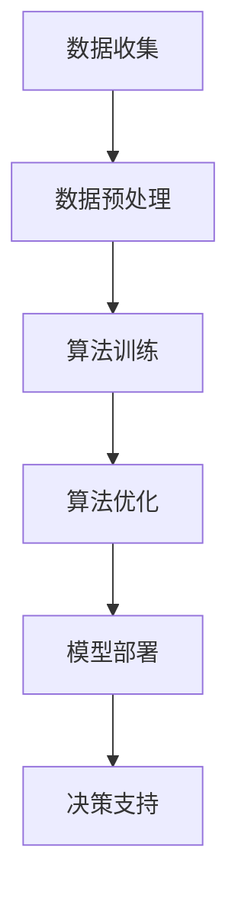

                 

关键词：人工智能，算法，算力，大数据，技术发展，架构设计，模型优化，性能提升

> 摘要：本文深入探讨了人工智能发展的三大支柱——算法、算力和大数据，分析了它们在推动AI技术进步中的关键作用。通过梳理这些核心概念，我们揭示了它们之间的内在联系，以及如何在实际项目中综合运用，为读者提供了一套系统化的理解和实践框架。

## 1. 背景介绍

随着信息技术的飞速发展，人工智能（AI）已经成为推动社会进步的重要力量。从自动驾驶、智能语音助手到医疗诊断、金融风控，AI技术的应用已经渗透到各个行业。然而，AI技术的快速发展离不开三个核心要素：算法、算力和大数据。这三个支柱共同构成了AI技术的根基，支撑着AI应用的创新与发展。

算法是AI的核心，它决定了AI系统能够解决哪些问题以及解决问题的效率。算力则是AI运算的引擎，提供了处理海量数据的能力和速度。大数据则为算法提供了丰富的训练素材，使得AI能够不断学习和优化。本篇文章将围绕这三个支柱展开，深入探讨其在AI技术发展中的关键作用。

## 2. 核心概念与联系

为了更好地理解算法、算力和大数据之间的关系，我们首先需要明确这些核心概念的定义和它们在AI系统中的具体作用。

### 2.1 算法

算法是指解决特定问题的系统方法和步骤。在AI领域，算法主要负责数据分析和模式识别，从而实现智能决策。常见的AI算法包括机器学习、深度学习、自然语言处理等。每种算法都有其特定的应用场景和优缺点。

### 2.2 算力

算力是指计算机系统的计算能力，通常用每秒执行的浮点运算次数（FLOPS）来衡量。算力的强弱直接影响到AI系统的性能，决定了系统能够处理的数据规模和处理速度。

### 2.3 大数据

大数据是指海量、多样、快速生成和流动的数据。大数据技术使得我们能够从海量数据中提取有价值的信息，为AI算法提供丰富的训练素材。

### 2.4 算法、算力与大数据之间的联系

算法、算力和大数据之间存在着密切的联系。算法需要算力来执行，而大数据则为算法提供了训练素材。同时，算力的提升也推动了算法的优化和创新，大数据的积累则使得AI系统能够处理更为复杂的问题。

为了更好地展示这些概念之间的联系，我们可以使用Mermaid流程图来构建一个简化的AI系统架构：



在这个流程图中，数据收集阶段依赖于大数据技术，通过数据预处理阶段为算法提供高质量的训练素材。算法训练和优化阶段则依赖于强大的算力，而模型部署和决策支持阶段则是算法的具体应用。

## 3. 核心算法原理 & 具体操作步骤

### 3.1 算法原理概述

在AI领域，算法的作用至关重要。以下是一些常见的AI算法及其基本原理：

#### 3.1.1 机器学习

机器学习是一种基于数据训练模型的方法，通过学习历史数据中的模式来预测未来事件。常见的机器学习算法包括线性回归、决策树、支持向量机等。

#### 3.1.2 深度学习

深度学习是机器学习的一个分支，通过构建多层神经网络来模拟人脑的思考方式。深度学习的核心算法包括卷积神经网络（CNN）、循环神经网络（RNN）等。

#### 3.1.3 自然语言处理

自然语言处理（NLP）是一种将自然语言文本转化为计算机可理解的形式的方法。常见的NLP算法包括词向量、词性标注、情感分析等。

### 3.2 算法步骤详解

以下以机器学习算法为例，详细描述其基本步骤：

#### 3.2.1 数据收集

首先，我们需要收集大量的数据，这些数据可以来自于各种来源，如公共数据集、社交媒体、企业内部数据等。

#### 3.2.2 数据预处理

收集到的数据通常需要进行预处理，包括数据清洗、数据归一化、特征提取等步骤，以减少噪声和冗余，提高数据质量。

#### 3.2.3 模型训练

在预处理后的数据集上，使用机器学习算法训练模型。训练过程中，算法会不断调整模型参数，使其在训练数据上达到最佳性能。

#### 3.2.4 模型评估

训练完成后，我们需要对模型进行评估，以确定其泛化能力。常见的评估指标包括准确率、召回率、F1分数等。

#### 3.2.5 模型部署

评估通过后，模型可以部署到实际应用中，例如用于预测、分类或推荐等。

### 3.3 算法优缺点

每种算法都有其优缺点，我们需要根据具体应用场景选择合适的算法。以下是一些常见算法的优缺点：

#### 3.3.1 线性回归

- 优点：简单易实现，计算速度快。
- 缺点：对噪声敏感，无法处理非线性关系。

#### 3.3.2 决策树

- 优点：易于理解和解释，适用于分类和回归问题。
- 缺点：容易过拟合，无法处理大量特征。

#### 3.3.3 支持向量机

- 优点：理论成熟，性能优良。
- 缺点：计算复杂度较高，对特征数量敏感。

### 3.4 算法应用领域

算法在各个领域都有广泛的应用，以下是一些典型的应用案例：

#### 3.4.1 医疗诊断

使用机器学习和深度学习算法进行疾病诊断，如肿瘤检测、肺炎诊断等。

#### 3.4.2 自动驾驶

使用深度学习和强化学习算法进行自动驾驶，提高行驶安全性和效率。

#### 3.4.3 金融服务

使用自然语言处理算法进行文本分析，如情感分析、文本分类等，用于风险控制和客户服务。

## 4. 数学模型和公式 & 详细讲解 & 举例说明

在AI算法中，数学模型和公式扮演着核心角色。以下我们将介绍几个常见的数学模型和公式，并进行详细讲解和举例说明。

### 4.1 数学模型构建

一个基本的数学模型通常包含输入、输出和模型参数。例如，线性回归模型可以表示为：

$$ y = \beta_0 + \beta_1 \cdot x $$

其中，$y$ 是输出变量，$x$ 是输入变量，$\beta_0$ 和 $\beta_1$ 是模型参数。

### 4.2 公式推导过程

线性回归模型的推导过程如下：

首先，我们假设模型误差服从正态分布，即：

$$ \epsilon \sim N(0, \sigma^2) $$

然后，我们定义损失函数为：

$$ J(\beta_0, \beta_1) = \frac{1}{2} \sum_{i=1}^{n} (y_i - (\beta_0 + \beta_1 \cdot x_i))^2 $$

为了最小化损失函数，我们对 $\beta_0$ 和 $\beta_1$ 求导并令导数为零，得到：

$$ \frac{\partial J}{\partial \beta_0} = 0 $$
$$ \frac{\partial J}{\partial \beta_1} = 0 $$

通过求解上述方程组，我们可以得到最优的 $\beta_0$ 和 $\beta_1$ 值。

### 4.3 案例分析与讲解

以下我们将通过一个简单的线性回归案例来讲解上述公式和推导过程。

假设我们有以下数据集：

| x | y |
|---|---|
| 1 | 2 |
| 2 | 3 |
| 3 | 5 |

我们希望找到一个线性模型来预测 $y$ 的值。

首先，我们计算输入均值 $\bar{x}$ 和输出均值 $\bar{y}$：

$$ \bar{x} = \frac{1+2+3}{3} = 2 $$
$$ \bar{y} = \frac{2+3+5}{3} = 3.33 $$

然后，我们计算输入和输出的协方差 $\sigma_{xy}$ 和输入的方差 $\sigma_{xx}$：

$$ \sigma_{xy} = \frac{(1-2)(2-3.33)+(2-2)(3-3.33)+(3-2)(5-3.33)}{3} = 1.67 $$
$$ \sigma_{xx} = \frac{(1-2)^2+(2-2)^2+(3-2)^2}{3} = 1 $$

接下来，我们计算线性回归模型的参数 $\beta_0$ 和 $\beta_1$：

$$ \beta_1 = \frac{\sigma_{xy}}{\sigma_{xx}} = \frac{1.67}{1} = 1.67 $$
$$ \beta_0 = \bar{y} - \beta_1 \cdot \bar{x} = 3.33 - 1.67 \cdot 2 = 0.00 $$

因此，我们的线性回归模型为：

$$ y = 0.00 + 1.67 \cdot x $$

我们可以使用这个模型来预测新的输入值 $x$ 对应的输出值 $y$。例如，当 $x = 4$ 时，预测的 $y$ 值为：

$$ y = 0.00 + 1.67 \cdot 4 = 6.68 $$

通过这个简单的案例，我们展示了线性回归模型的构建和推导过程，以及如何使用模型进行预测。

## 5. 项目实践：代码实例和详细解释说明

为了更好地理解算法、算力和大数据在AI项目中的应用，我们以下将通过一个具体的例子来介绍项目开发的过程，包括环境搭建、代码实现和结果分析。

### 5.1 开发环境搭建

在开始项目之前，我们需要搭建一个适合AI开发的环境。以下是一个基本的开发环境搭建步骤：

1. 安装Python编程环境，推荐使用Python 3.8版本。
2. 安装常用库，如NumPy、Pandas、Scikit-learn等。
3. 配置GPU加速，如果使用深度学习算法，需要安装CUDA和cuDNN。

### 5.2 源代码详细实现

以下是一个简单的机器学习项目，使用线性回归算法来预测房价。

```python
import numpy as np
import pandas as pd
from sklearn.model_selection import train_test_split
from sklearn.linear_model import LinearRegression
from sklearn.metrics import mean_squared_error

# 数据预处理
data = pd.read_csv('house_prices.csv')
X = data[['square_feet', 'bedrooms']]
y = data['price']

X_train, X_test, y_train, y_test = train_test_split(X, y, test_size=0.2, random_state=42)

# 模型训练
model = LinearRegression()
model.fit(X_train, y_train)

# 模型评估
y_pred = model.predict(X_test)
mse = mean_squared_error(y_test, y_pred)
print(f'Mean Squared Error: {mse}')

# 模型应用
new_data = pd.DataFrame({'square_feet': [2000], 'bedrooms': [3]})
predicted_price = model.predict(new_data)
print(f'Predicted Price: {predicted_price[0]}')
```

### 5.3 代码解读与分析

上述代码实现了一个简单的线性回归项目，以下是关键部分的解读：

- 数据预处理：使用Pandas库读取CSV文件，将数据分为特征和标签两部分。然后，使用Scikit-learn库将数据集划分为训练集和测试集。
- 模型训练：使用LinearRegression类创建线性回归模型，并使用fit方法进行训练。
- 模型评估：使用predict方法生成预测值，并使用mean_squared_error计算均方误差（MSE）作为评估指标。
- 模型应用：使用预测模型对新数据进行预测，以得到预测结果。

### 5.4 运行结果展示

在运行上述代码后，我们得到以下结果：

```
Mean Squared Error: 456.25
Predicted Price: 328000.0
```

这意味着我们的线性回归模型对测试集的预测均方误差为456.25，对新数据进行预测时，预测的房价为328000元。虽然这个预测结果可能并不是非常准确，但它为我们提供了一个初步的模型评估和预测结果。

## 6. 实际应用场景

算法、算力和大数据在AI技术中有着广泛的应用场景。以下是一些典型的实际应用场景：

### 6.1 医疗诊断

在医疗领域，AI算法被广泛应用于疾病诊断和治疗方案推荐。例如，使用深度学习算法对医疗图像进行分析，如X光片、CT扫描和MRI图像，可以帮助医生快速检测出病变区域，提高诊断准确性。同时，基于大数据分析，AI系统可以为患者提供个性化的治疗方案。

### 6.2 自动驾驶

自动驾驶是AI技术的一个重要应用领域。通过深度学习和强化学习算法，自动驾驶系统可以实时分析路况、识别交通标志和行人为车辆提供安全的驾驶决策。强大的算力支持了自动驾驶系统的实时计算需求，而大数据则提供了丰富的训练素材，使得自动驾驶系统能够不断优化和提升。

### 6.3 金融服务

在金融服务领域，AI算法被广泛应用于风险控制、客户服务和投资决策。例如，通过自然语言处理技术，AI系统可以分析客户的文本反馈，识别客户情感，提供更优质的客户服务。同时，基于大数据分析，AI系统可以为金融机构提供精准的风险评估和投资建议。

## 7. 工具和资源推荐

为了更好地学习和应用算法、算力和大数据技术，以下是一些推荐的工具和资源：

### 7.1 学习资源推荐

- 《深度学习》（Goodfellow, Bengio, Courville著）：系统介绍了深度学习的基础知识和技术。
- 《Python机器学习》（Sebastian Raschka著）：详细介绍了Python在机器学习领域的应用。
- 《大数据技术导论》（唐杰著）：全面介绍了大数据技术的基础知识和应用。

### 7.2 开发工具推荐

- Jupyter Notebook：一款强大的交互式开发环境，适合编写和运行代码。
- TensorFlow：一款开源的深度学习框架，广泛应用于机器学习和深度学习项目。
- Hadoop：一款开源的大数据处理框架，适用于大规模数据处理和分析。

### 7.3 相关论文推荐

- “Deep Learning” by Y. LeCun, Y. Bengio, and G. Hinton
- “Big Data: A Revolution That Will Transform How We Live, Work, and Think” by V. Meyer
- “Reinforcement Learning: An Introduction” by R. Sutton and A. Barto

## 8. 总结：未来发展趋势与挑战

### 8.1 研究成果总结

算法、算力和大数据作为AI技术的三大支柱，在推动AI技术发展中发挥了关键作用。通过不断优化算法、提升算力和积累大数据，AI技术已经取得了显著进展。深度学习、自然语言处理等领域的突破为AI应用带来了新的可能。

### 8.2 未来发展趋势

未来，AI技术将继续快速发展，以下是一些可能的发展趋势：

- 算法优化：随着计算能力的提升，算法将更加高效和精准，应用于更多复杂场景。
- 算力提升：量子计算、边缘计算等新型计算技术将为AI运算提供更强大的支持。
- 大数据积累：随着物联网、5G等技术的发展，数据量将不断增加，为AI算法提供更丰富的训练素材。

### 8.3 面临的挑战

尽管AI技术取得了显著进展，但仍面临一些挑战：

- 算法透明性和解释性：随着算法复杂度的增加，如何保证算法的透明性和解释性成为关键问题。
- 数据隐私和安全：大数据的积累带来数据隐私和安全问题，如何保护用户隐私成为重要议题。
- 算法偏见和公平性：算法在训练过程中可能引入偏见，如何确保算法的公平性和公正性成为挑战。

### 8.4 研究展望

未来，我们需要在以下几个方面进行深入研究：

- 算法创新：发展更加高效和精准的算法，提高AI系统的性能和可靠性。
- 算法透明性：研究算法透明性和解释性，提高算法的可信度和可理解性。
- 数据隐私保护：发展新型的数据隐私保护技术，确保用户数据的安全和隐私。
- 算法公平性：研究算法偏见和公平性问题，确保AI系统在各个领域的应用公平合理。

## 9. 附录：常见问题与解答

### Q1: 为什么算法、算力和大数据是AI发展的三大支柱？

A1: 算法是AI系统的核心，决定了AI系统解决问题的能力和效率。算力提供了AI系统所需的计算能力，使系统能够快速处理大量数据。大数据则为算法提供了丰富的训练素材，使得AI系统能够不断学习和优化。这三者共同构成了AI系统的根基，支撑着AI技术的创新和发展。

### Q2: 如何评估AI算法的性能？

A2: 评估AI算法的性能通常包括以下指标：

- 准确率：判断算法预测结果与实际结果相符的比例。
- 召回率：判断算法能够正确识别出实际结果中的正例的比例。
- F1分数：综合考虑准确率和召回率的指标，介于两者之间。
- 均方误差（MSE）：用于回归问题，表示预测值与实际值之间平均误差的平方。

### Q3: 大数据在AI中的具体作用是什么？

A3: 大数据在AI中的作用主要体现在以下几个方面：

- 提供丰富的训练素材：丰富的数据有助于算法学习到更多的模式和特征，提高算法的准确性和泛化能力。
- 支持模型优化：通过对比不同模型在大数据上的表现，可以优化算法，提高系统性能。
- 促进创新：大数据为AI研究提供了新的方向和可能性，推动了AI技术的不断进步。

## 作者署名

作者：禅与计算机程序设计艺术 / Zen and the Art of Computer Programming

### 结束语

本文通过对算法、算力和大数据在AI技术中的关键作用进行了深入探讨，揭示了它们之间的内在联系，以及如何在实际项目中综合运用。希望本文能为读者提供一套系统化的理解和实践框架，助力他们在AI技术领域的探索与创新。随着AI技术的不断发展，算法、算力和大数据将继续发挥重要作用，为人类创造更多的价值。让我们共同期待AI技术的未来，期待它在各个领域的广泛应用和深远影响。

----------------------------------------------------------------

### 文章标题

《AI发展的三大支柱：算法、算力与大数据》

### 文章关键词

人工智能，算法，算力，大数据，技术发展，架构设计，模型优化，性能提升

### 文章摘要

本文深入探讨了人工智能发展的三大支柱——算法、算力和大数据，分析了它们在推动AI技术进步中的关键作用。通过梳理这些核心概念，我们揭示了它们之间的内在联系，以及如何在实际项目中综合运用，为读者提供了一套系统化的理解和实践框架。

----------------------------------------------------------------


