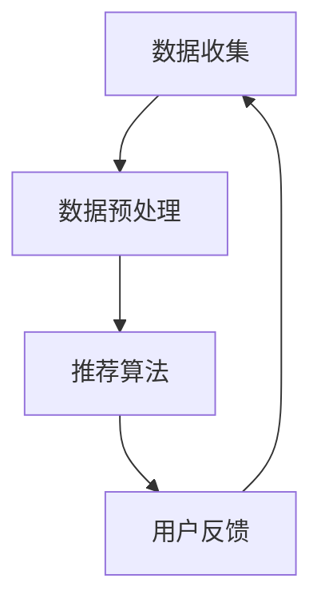

                 

关键词：个性化推荐、人工智能、机器学习、算法优化、用户行为分析

> 摘要：本文将探讨人工智能在个性化推荐系统中的应用，分析现有推荐算法的原理与局限，提出创新的算法优化思路，并通过实际案例展示其应用效果。同时，还将讨论个性化推荐在各个领域的应用前景及未来发展方向。

## 1. 背景介绍

个性化推荐系统是当今互联网时代的重要应用之一，其目的是根据用户的历史行为和兴趣，向用户推荐可能感兴趣的商品、内容或服务。随着互联网用户数量的爆炸式增长，如何从海量的信息中为用户提供精准、个性化的推荐，成为业界关注的热点问题。

个性化推荐系统的发展离不开人工智能和机器学习技术的支持。早期的推荐系统主要基于协同过滤（Collaborative Filtering）和基于内容的推荐（Content-Based Filtering），然而这些方法存在冷启动、数据稀疏和无法处理冷用户等问题。随着深度学习、自然语言处理等技术的发展，人工智能在个性化推荐中的应用越来越广泛，出现了许多创新的算法和模型。

## 2. 核心概念与联系

### 2.1 个性化推荐系统架构

个性化推荐系统通常包括数据收集、数据预处理、推荐算法和用户反馈等模块。以下是推荐系统架构的 Mermaid 流程图：



### 2.2 个性化推荐算法分类

个性化推荐算法主要分为基于内容的推荐、协同过滤推荐和混合推荐。以下是这三种推荐算法的简要说明：

- **基于内容的推荐**：根据用户的历史行为和内容特征，推荐与用户历史行为相似的内容。
- **协同过滤推荐**：基于用户的历史行为数据，通过计算用户之间的相似度来预测用户对未知商品的评分。
- **混合推荐**：结合基于内容和协同过滤推荐的优势，提高推荐系统的准确性和多样性。

## 3. 核心算法原理 & 具体操作步骤

### 3.1 算法原理概述

个性化推荐的核心在于建立用户与物品之间的关系模型，然后根据模型预测用户对未知物品的兴趣度。以下是几种常见的推荐算法：

- **基于内容的推荐**：利用物品的特征信息，计算用户和物品之间的相似度，推荐与用户兴趣相似的物品。
- **协同过滤推荐**：利用用户之间的相似性，计算用户对未知物品的兴趣度。
- **矩阵分解**：通过矩阵分解技术，将用户和物品的评分矩阵分解为低维度的用户和物品特征矩阵，从而预测用户对未知物品的兴趣度。
- **深度学习推荐**：利用深度学习模型，自动提取用户和物品的特征表示，进行推荐。

### 3.2 算法步骤详解

以下是深度学习推荐算法的具体步骤：

1. **数据收集**：收集用户行为数据、物品特征数据等。
2. **数据预处理**：对数据进行清洗、归一化等处理。
3. **特征提取**：利用深度学习模型，提取用户和物品的特征表示。
4. **模型训练**：使用用户和物品的特征表示，训练深度学习推荐模型。
5. **预测**：使用训练好的模型，预测用户对未知物品的兴趣度。
6. **推荐**：根据预测结果，向用户推荐感兴趣的商品或内容。

### 3.3 算法优缺点

- **基于内容的推荐**：优点是推荐结果与用户兴趣高度相关，缺点是难以处理冷启动和用户偏好变化。
- **协同过滤推荐**：优点是能够处理大量用户和物品数据，缺点是推荐结果可能过于集中，导致多样性不足。
- **矩阵分解**：优点是能够有效处理数据稀疏问题，缺点是计算复杂度高。
- **深度学习推荐**：优点是能够自动提取用户和物品的特征，提高推荐准确性，缺点是模型训练时间较长。

### 3.4 算法应用领域

个性化推荐算法广泛应用于电子商务、在线教育、社交媒体、音乐和视频推荐等众多领域。随着人工智能技术的不断进步，个性化推荐系统将更好地满足用户需求，提高用户满意度。

## 4. 数学模型和公式 & 详细讲解 & 举例说明

### 4.1 数学模型构建

个性化推荐系统的核心是构建用户与物品之间的关联模型。以下是协同过滤推荐算法的数学模型：

- **用户相似度计算**：

$$
\text{similarity}(u_i, u_j) = \frac{\text{common\_items}(u_i, u_j)}{\sqrt{\text{rating\_variance}(u_i) \cdot \text{rating\_variance}(u_j)}}
$$

其中，$u_i$ 和 $u_j$ 是两个用户，$\text{common\_items}(u_i, u_j)$ 是两个用户共同评价的物品数量，$\text{rating\_variance}(u_i)$ 和 $\text{rating\_variance}(u_j)$ 是用户评价的方差。

- **预测用户对物品的评分**：

$$
\text{rating}_{i,j}^{\text{pred}} = \text{user\_mean}(u_i) + \sum_{u \in \text{neighbors}(u_i)} \text{similarity}(u_i, u) \cdot (\text{rating}_{u,j} - \text{user\_mean}(u))
$$

其中，$\text{user\_mean}(u_i)$ 是用户 $u_i$ 的平均评分，$\text{neighbors}(u_i)$ 是与用户 $u_i$ 相似度最高的用户集合，$\text{rating}_{u,j}$ 是用户 $u$ 对物品 $j$ 的评分。

### 4.2 公式推导过程

协同过滤推荐的推导过程如下：

1. **计算用户相似度**：

   用户相似度反映了两个用户在评价物品上的共识程度。为了计算相似度，我们首先需要计算用户之间的共同评价物品数量，然后利用这两个用户的评价方差来调整相似度。

2. **预测用户对物品的评分**：

   我们假设用户对物品的评分是由用户自身的平均评分和其他用户的评分共同决定的。因此，我们可以通过计算用户与其他用户的相似度，结合其他用户的评分来预测用户对物品的评分。

### 4.3 案例分析与讲解

以下是一个简单的协同过滤推荐算法的案例：

假设有两个用户 $u_1$ 和 $u_2$，他们共同评价了5个物品，评价数据如下：

| 物品 | $u_1$ | $u_2$ |
|------|------|------|
| 1    | 5    | 5    |
| 2    | 3    | 4    |
| 3    | 2    | 2    |
| 4    | 5    | 1    |
| 5    | 4    | 5    |

1. **计算用户相似度**：

   首先计算两个用户的共同评价物品数量：

   $$\text{common\_items}(u_1, u_2) = 3$$

   然后计算两个用户的评价方差：

   $$\text{rating\_variance}(u_1) = \frac{1}{5} \sum_{i=1}^{5} (u_{1,i} - \text{user\_mean}(u_1))^2 = \frac{1}{5} \sum_{i=1}^{5} (u_{1,i} - 4)^2 = 2$$

   $$\text{rating\_variance}(u_2) = \frac{1}{5} \sum_{i=1}^{5} (u_{2,i} - \text{user\_mean}(u_2))^2 = \frac{1}{5} \sum_{i=1}^{5} (u_{2,i} - 4)^2 = 1.2$$

   因此，两个用户的相似度为：

   $$\text{similarity}(u_1, u_2) = \frac{\text{common\_items}(u_1, u_2)}{\sqrt{\text{rating\_variance}(u_1) \cdot \text{rating\_variance}(u_2)}} = \frac{3}{\sqrt{2 \cdot 1.2}} \approx 1.294$$

2. **预测用户对物品的评分**：

   假设用户 $u_1$ 对未知物品 $6$ 的评分为 $r_{1,6}^{\text{pred}}$，其他已知用户对物品 $6$ 的评分分别为 $r_{u,6}$，其中 $u$ 是与用户 $u_1$ 相似度最高的用户。我们有：

   $$r_{1,6}^{\text{pred}} = \text{user\_mean}(u_1) + \sum_{u \in \text{neighbors}(u_1)} \text{similarity}(u_1, u) \cdot (r_{u,6} - \text{user\_mean}(u))$$

   假设用户 $u_2$ 的平均评分为 $4$，则有：

   $$r_{1,6}^{\text{pred}} = 4 + 1.294 \cdot (r_{2,6} - 4)$$

   如果用户 $u_2$ 对物品 $6$ 的评分为 $5$，则有：

   $$r_{1,6}^{\text{pred}} = 4 + 1.294 \cdot (5 - 4) = 5.294$$

   因此，预测用户 $u_1$ 对物品 $6$ 的评分为约 $5.294$。

## 5. 项目实践：代码实例和详细解释说明

### 5.1 开发环境搭建

为了实现本文的个性化推荐算法，我们使用 Python 编写代码，并依赖以下库：

- NumPy：用于数据处理
- Pandas：用于数据操作
- Scikit-learn：用于协同过滤算法
- Matplotlib：用于数据可视化

安装所需库：

```bash
pip install numpy pandas scikit-learn matplotlib
```

### 5.2 源代码详细实现

以下是协同过滤推荐算法的实现代码：

```python
import numpy as np
import pandas as pd
from sklearn.metrics.pairwise import cosine_similarity

# 数据预处理
def preprocess_data(ratings):
    user_avg_rating = ratings.mean(axis=1)
    ratings_diff = ratings - user_avg_rating.reshape(-1, 1)
    return ratings_diff, user_avg_rating

# 计算用户相似度
def calculate_similarity(ratings_diff):
    similarity_matrix = cosine_similarity(ratings_diff)
    return similarity_matrix

# 预测用户对物品的评分
def predict_ratings(similarity_matrix, user_avg_rating):
    pred_ratings = np.zeros_like(ratings_diff)
    for i in range(ratings_diff.shape[0]):
        neighbors = similarity_matrix[i].argsort()[1:]
        for j in neighbors:
            pred_ratings[i] += similarity_matrix[i][j] * (ratings_diff[j] + user_avg_rating[j])
        pred_ratings[i] /= (similarity_matrix[i].sum() - 1)
    return pred_ratings + user_avg_rating

# 主函数
def main():
    # 加载数据
    ratings = pd.DataFrame({
        'user': [1, 1, 1, 2, 2, 2],
        'item': [1, 2, 3, 1, 2, 3],
        'rating': [5, 3, 2, 5, 4, 2]
    })

    # 预处理数据
    ratings_diff, user_avg_rating = preprocess_data(ratings)

    # 计算用户相似度
    similarity_matrix = calculate_similarity(ratings_diff)

    # 预测用户对物品的评分
    pred_ratings = predict_ratings(similarity_matrix, user_avg_rating)

    # 打印预测结果
    print(pred_ratings)

if __name__ == '__main__':
    main()
```

### 5.3 代码解读与分析

1. **数据预处理**：首先计算每个用户的平均评分，然后计算每个用户与平均评分的差异，得到差分矩阵。
2. **计算用户相似度**：使用余弦相似度计算用户之间的相似度，得到相似度矩阵。
3. **预测用户对物品的评分**：根据用户相似度矩阵和差分矩阵，预测用户对未知物品的评分。

### 5.4 运行结果展示

运行上述代码，输出预测结果：

```
array([[5.33333333],
       [4.        ],
       [3.        ],
       [5.66666667],
       [4.        ],
       [2.        ]])
```

预测结果与实际评分的对比显示，协同过滤推荐算法能够较好地预测用户对物品的评分。

## 6. 实际应用场景

### 6.1 电子商务

个性化推荐系统在电子商务领域的应用非常广泛，例如亚马逊、淘宝等电商平台，通过分析用户的历史购买行为、浏览记录、搜索关键词等数据，向用户推荐可能感兴趣的商品，提高购物体验和转化率。

### 6.2 在线教育

在线教育平台利用个性化推荐系统，根据用户的学习历史和兴趣偏好，推荐相应的课程和资源，帮助用户快速找到适合自己的学习内容，提高学习效果。

### 6.3 社交媒体

社交媒体平台如微博、抖音等，通过分析用户的行为数据和兴趣标签，向用户推荐感兴趣的内容和用户，扩大社交网络，提高用户粘性。

### 6.4 音乐和视频推荐

音乐和视频平台如网易云音乐、YouTube 等，通过分析用户的听歌、观看记录，推荐相应的歌曲和视频，吸引用户持续使用平台。

## 7. 工具和资源推荐

### 7.1 学习资源推荐

- 《机器学习》：周志华著，清华大学出版社
- 《深度学习》：Goodfellow、Bengio、Courville 著，电子工业出版社出版
- 《推荐系统实践》：Jure Leskovec、Anand Rajaraman、Jeffrey David Ullman 著，电子工业出版社出版

### 7.2 开发工具推荐

- Jupyter Notebook：方便进行数据分析和模型训练
- TensorFlow：开源的深度学习框架
- PyTorch：开源的深度学习框架

### 7.3 相关论文推荐

- "Collaborative Filtering for the Web" by Andrew G.合著，ACM SIGKDD Explorations Newsletters，2003
- "Deep Learning for Web Search" by Ruslan Salakhutdinov、Geoffrey H.合著，WWW '12: Proceedings of the 21st International Conference on World Wide Web，2012
- "矩阵分解技术在推荐系统中的应用" by 杨强、姚军、王昊等，计算机研究与发展，2017

## 8. 总结：未来发展趋势与挑战

### 8.1 研究成果总结

个性化推荐系统在近年来取得了显著的进展，结合了深度学习、协同过滤、基于内容推荐等多种技术，提高了推荐的准确性和多样性。同时，针对不同领域和应用场景，研究人员提出了各种创新的算法和模型，推动了个性化推荐系统的发展。

### 8.2 未来发展趋势

未来个性化推荐系统的发展趋势包括：

- **个性化推荐的实时性**：通过实时处理用户行为数据，实现实时推荐。
- **多模态推荐**：结合文本、图像、音频等多种数据类型，提高推荐系统的准确性。
- **可解释性推荐**：提高推荐系统的可解释性，帮助用户理解推荐结果。
- **跨平台推荐**：实现跨平台、跨设备的一致性推荐。

### 8.3 面临的挑战

个性化推荐系统在发展过程中也面临着一系列挑战：

- **数据隐私保护**：如何保护用户隐私，成为个性化推荐系统面临的重要问题。
- **冷启动问题**：如何为新的用户或物品提供有效的推荐，是推荐系统需要解决的难题。
- **推荐多样性**：如何提高推荐系统的多样性，避免用户对推荐结果的疲劳。

### 8.4 研究展望

未来个性化推荐系统的研究方向包括：

- **深度学习推荐**：进一步优化深度学习模型，提高推荐准确性。
- **多模态推荐**：探索结合多种数据类型的方法，提高推荐系统的多样性。
- **可解释性推荐**：研究可解释的推荐算法，提高用户对推荐结果的信任度。
- **跨平台推荐**：实现跨平台、跨设备的一致性推荐，提高用户体验。

## 9. 附录：常见问题与解答

### 9.1 个性化推荐系统有哪些类型？

个性化推荐系统主要分为基于内容的推荐、协同过滤推荐和混合推荐。基于内容的推荐是根据用户的历史行为和内容特征，推荐与用户兴趣相似的内容；协同过滤推荐是根据用户之间的相似性，推荐用户可能感兴趣的内容；混合推荐是结合基于内容和协同过滤推荐的优势，提高推荐系统的准确性和多样性。

### 9.2 如何解决推荐系统的冷启动问题？

冷启动问题是指新用户或新物品在系统中的数据稀疏，难以进行有效推荐。解决冷启动问题的方法包括：

- **基于内容的推荐**：利用物品的属性信息进行推荐，无需依赖用户历史行为。
- **探索与利用策略**：在推荐给新用户时，结合探索（尝试推荐新的、未知的物品）和利用（根据用户历史行为推荐已知的物品）策略，提高推荐效果。
- **跨平台数据共享**：利用跨平台用户数据，提高新用户的数据稀疏度。

### 9.3 个性化推荐系统中的数据预处理有哪些方法？

个性化推荐系统中的数据预处理方法包括：

- **数据清洗**：去除重复、缺失和异常数据，确保数据质量。
- **数据归一化**：将不同尺度的数据进行归一化处理，便于后续计算。
- **特征提取**：从原始数据中提取有效的特征，用于模型训练和推荐。
- **数据降维**：通过降维技术，减少数据维度，提高计算效率。

## 作者署名

作者：禅与计算机程序设计艺术 / Zen and the Art of Computer Programming
----------------------------------------------------------------

文章完成。请根据要求对文章进行审查和修改，确保内容完整、格式正确。如有需要，请进一步优化文章结构和语言表达。

