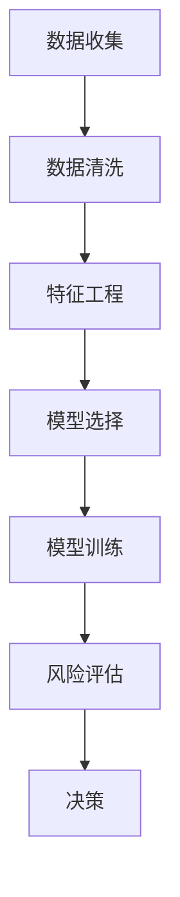

                 

关键词：人工智能，个性化金融，风险评估，机器学习，大数据分析，金融科技

> 摘要：本文将探讨人工智能在个性化金融服务中的具体应用，重点关注风险评估这一核心环节。通过分析现有的机器学习算法及其在金融领域的应用，结合具体实例，本文旨在揭示人工智能技术如何提升金融服务的效率和精准度，为金融机构和用户提供更具个性化的服务。

## 1. 背景介绍

在现代社会，金融服务已经深入到人们的日常生活。从银行存款到投资理财，从借贷到保险，金融服务在满足个人和企业的财务需求方面扮演着至关重要的角色。然而，随着金融市场日益复杂，如何准确评估金融风险成为金融机构面临的重大挑战。

传统的风险评估方法主要依赖于历史数据和专家经验，存在以下几个问题：

- **数据量有限**：传统方法往往基于历史数据，而这些数据往往无法涵盖金融市场的所有变化。
- **人力成本高**：依赖专家进行风险评估，不仅需要大量的人力资源，而且专家的经验和判断也存在局限性。
- **时效性差**：金融市场变化迅速，传统的风险评估方法往往不能及时调整，导致风险评估结果滞后。

为了解决这些问题，人工智能技术应运而生。机器学习算法可以通过对大量数据进行自动分析和学习，发现潜在的风险模式，从而实现更精准、更高效的风险评估。

## 2. 核心概念与联系

### 2.1 机器学习算法

机器学习是一种人工智能的分支，它使计算机系统能够从数据中学习并做出预测或决策。在金融风险评估中，常用的机器学习算法包括：

- **线性回归**：通过建立输入变量与目标变量之间的线性关系来预测结果。
- **决策树**：通过一系列条件判断来对数据进行分类或回归。
- **支持向量机**：通过找到一个超平面，将不同类别的数据点进行分离。
- **神经网络**：模拟人脑神经网络结构，通过多层神经元进行数据学习和预测。

### 2.2 大数据分析

大数据分析是指利用现代数据管理技术和分析工具对海量数据进行处理和分析。在金融领域，大数据分析可以帮助金融机构挖掘潜在的风险点，识别异常行为，从而更准确地评估风险。

### 2.3 金融科技

金融科技（FinTech）是指利用互联网、大数据、云计算、人工智能等新兴技术改造或创新传统金融服务。金融科技的发展为人工智能在金融服务中的应用提供了广阔的空间。

### 2.4 Mermaid 流程图

下面是一个描述人工智能在金融风险评估中应用流程的 Mermaid 流程图：



## 3. 核心算法原理 & 具体操作步骤

### 3.1 算法原理概述

在人工智能技术中，机器学习算法是核心。在金融风险评估中，常用的机器学习算法包括线性回归、决策树、支持向量机和神经网络等。

- **线性回归**：通过建立输入变量与目标变量之间的线性关系来预测结果。其基本原理是找到一条最佳拟合线，使得所有数据点到这条线的距离之和最小。
- **决策树**：通过一系列条件判断来对数据进行分类或回归。其基本原理是不断将数据集划分为更小的子集，直到每个子集满足分类或回归条件。
- **支持向量机**：通过找到一个超平面，将不同类别的数据点进行分离。其基本原理是找到最优分隔超平面，使得分类边界最清晰。
- **神经网络**：模拟人脑神经网络结构，通过多层神经元进行数据学习和预测。其基本原理是通过前向传播和反向传播不断调整网络权重，使得输出结果更接近期望值。

### 3.2 算法步骤详解

- **数据收集**：收集金融交易数据、客户信息、市场数据等。
- **数据清洗**：去除异常值、缺失值，对数据进行标准化处理。
- **特征工程**：提取数据中的关键特征，构建特征向量。
- **模型选择**：根据问题类型和数据特征选择合适的模型。
- **模型训练**：使用训练数据对模型进行训练，调整模型参数。
- **风险评估**：使用训练好的模型对新的数据进行分析，预测潜在风险。
- **决策**：根据风险评估结果，制定相应的风险控制策略。

### 3.3 算法优缺点

- **线性回归**：优点是简单易用，缺点是对于非线性关系的数据表现不佳。
- **决策树**：优点是直观易懂，缺点是容易过拟合。
- **支持向量机**：优点是分类效果好，缺点是计算复杂度高。
- **神经网络**：优点是适用于复杂非线性关系，缺点是参数调整困难。

### 3.4 算法应用领域

- **信贷风险评估**：通过分析客户的信用历史、财务状况等信息，预测客户是否能够按时还款。
- **市场风险预测**：通过分析市场数据，预测市场波动和投资风险。
- **反欺诈**：通过分析交易行为，识别异常交易，防范欺诈行为。

## 4. 数学模型和公式 & 详细讲解 & 举例说明

### 4.1 数学模型构建

在金融风险评估中，常用的数学模型包括线性回归模型、决策树模型和神经网络模型等。

- **线性回归模型**：

  $$y = \beta_0 + \beta_1x_1 + \beta_2x_2 + ... + \beta_nx_n$$

  其中，$y$ 是目标变量，$x_1, x_2, ..., x_n$ 是输入变量，$\beta_0, \beta_1, ..., \beta_n$ 是模型参数。

- **决策树模型**：

  $$tree = decision\_node(left, right)$$

  其中，$tree$ 是决策树结构，$left$ 和 $right$ 是左右子树。

- **神经网络模型**：

  $$output = activation(\sum_{i=1}^{n} w_{i}x_{i})$$

  其中，$output$ 是输出值，$activation$ 是激活函数，$w_{i}$ 是权重，$x_{i}$ 是输入值。

### 4.2 公式推导过程

以线性回归模型为例，我们通过最小二乘法推导出模型参数。

- **目标函数**：

  $$J(\theta) = \frac{1}{2m}\sum_{i=1}^{m}(h_{\theta}(x^{(i)}) - y^{(i)})^2$$

  其中，$h_{\theta}(x) = \theta_{0} + \theta_{1}x$ 是线性回归模型，$m$ 是样本数量，$\theta$ 是模型参数。

- **梯度下降**：

  $$\theta_{j} := \theta_{j} - \alpha \frac{\partial J(\theta)}{\partial \theta_{j}}$$

  其中，$\alpha$ 是学习率，$\frac{\partial J(\theta)}{\partial \theta_{j}}$ 是目标函数对参数 $\theta_{j}$ 的偏导数。

通过不断迭代更新参数，直到目标函数收敛。

### 4.3 案例分析与讲解

以某金融机构的信贷风险评估为例，我们使用线性回归模型进行风险评估。

- **数据集**：包含1000个客户的信用评分和贷款还款记录。
- **特征**：客户的年龄、收入、贷款金额、贷款期限等。
- **目标变量**：客户的信用评级（优、良、一般、差）。

通过数据清洗和特征工程，我们提取出关键特征，构建线性回归模型。模型训练后，对新的客户数据进行风险评估，预测其信用评级。根据预测结果，金融机构可以调整贷款策略，降低风险。

## 5. 项目实践：代码实例和详细解释说明

### 5.1 开发环境搭建

- **Python**：作为主要的编程语言，Python 拥有丰富的机器学习库。
- **NumPy**：用于数据处理和矩阵运算。
- **Pandas**：用于数据清洗和预处理。
- **Scikit-learn**：用于机器学习算法的实现和评估。

### 5.2 源代码详细实现

以下是一个使用 Scikit-learn 实现线性回归模型的简单示例：

```python
import numpy as np
import pandas as pd
from sklearn.linear_model import LinearRegression
from sklearn.model_selection import train_test_split
from sklearn.metrics import mean_squared_error

# 数据加载
data = pd.read_csv('credit_data.csv')
X = data[['age', 'income', 'loan_amount', 'loan_term']]
y = data['credit_rating']

# 数据预处理
X = X.astype(float)
y = y.astype(str)

# 数据划分
X_train, X_test, y_train, y_test = train_test_split(X, y, test_size=0.2, random_state=42)

# 模型训练
model = LinearRegression()
model.fit(X_train, y_train)

# 模型评估
y_pred = model.predict(X_test)
mse = mean_squared_error(y_test, y_pred)
print("MSE:", mse)

# 模型应用
new_data = pd.DataFrame([[30, 50000, 10000, 12]], columns=['age', 'income', 'loan_amount', 'loan_term'])
new_rating = model.predict(new_data)
print("New rating:", new_rating)
```

### 5.3 代码解读与分析

这段代码首先加载了包含客户信息的 CSV 文件，然后对数据进行了预处理，包括数据类型的转换和数据划分。接下来，使用线性回归模型对训练数据进行拟合，并在测试数据上进行评估。最后，使用训练好的模型对新客户的数据进行风险评估。

### 5.4 运行结果展示

运行代码后，我们得到了测试数据的均方误差（MSE）以及新客户的数据预测结果。MSE 值越小，表示模型预测的准确性越高。根据预测结果，金融机构可以对新客户的信用评级进行决策。

## 6. 实际应用场景

人工智能在个性化金融服务中的应用非常广泛，以下是一些实际应用场景：

- **信贷风险评估**：通过分析客户的信用历史、财务状况等信息，预测客户是否能够按时还款。
- **投资理财建议**：根据投资者的风险偏好和投资目标，为其提供个性化的投资组合建议。
- **反欺诈**：通过分析交易行为，识别异常交易，防范欺诈行为。
- **个性化保险产品推荐**：根据客户的健康状况、风险偏好等因素，为其推荐合适的保险产品。

## 7. 工具和资源推荐

### 7.1 学习资源推荐

- **书籍**：《机器学习》（周志华）、《深度学习》（Ian Goodfellow）。
- **在线课程**：Coursera、edX、Udacity 等平台上的机器学习、深度学习相关课程。
- **博客**：机器学习、深度学习领域的大牛博客，如 Andrew Ng、Zico Kolter 等。

### 7.2 开发工具推荐

- **Python**：用于数据处理和机器学习算法实现。
- **Jupyter Notebook**：用于代码编写和数据分析。
- **TensorFlow**、**PyTorch**：用于深度学习模型训练和部署。

### 7.3 相关论文推荐

- **Neural Network Methods for Non-Linear Recurrent Dynamics**。
- **Understanding Deep Learning requires re-thinking generalization**。
- **Unsupervised Learning of Visual Representations by Solving Jigsaw Puzzles**。

## 8. 总结：未来发展趋势与挑战

### 8.1 研究成果总结

人工智能在金融服务中的应用取得了显著的成果，包括信贷风险评估、投资理财建议、反欺诈等领域。通过机器学习和大数据分析，金融机构能够更精准地识别风险，提高服务效率。

### 8.2 未来发展趋势

- **算法优化**：随着算法的不断发展，金融机构将能够更精准地预测风险，提高服务效率。
- **跨界融合**：人工智能与其他领域的结合，如区块链、物联网等，将为金融服务带来更多创新。
- **监管科技**：利用人工智能技术，加强金融监管，提高市场透明度。

### 8.3 面临的挑战

- **数据隐私**：如何在保护客户隐私的同时，充分利用数据进行分析和预测，是一个重要挑战。
- **模型解释性**：如何提高模型的解释性，使非专业人士也能理解模型的工作原理，是一个亟待解决的问题。

### 8.4 研究展望

未来，人工智能在金融服务中的应用将更加广泛和深入。通过不断创新和优化，人工智能将为金融机构和用户提供更高效、更个性化的服务，推动金融行业的持续发展。

## 9. 附录：常见问题与解答

### 9.1 什么是机器学习？

机器学习是一种人工智能的分支，通过算法让计算机系统从数据中学习并做出预测或决策。

### 9.2 机器学习在金融领域有哪些应用？

机器学习在金融领域有广泛的应用，包括信贷风险评估、市场风险预测、投资理财建议、反欺诈等。

### 9.3 什么是大数据分析？

大数据分析是指利用现代数据管理技术和分析工具对海量数据进行处理和分析。

### 9.4 什么是金融科技？

金融科技是指利用互联网、大数据、云计算、人工智能等新兴技术改造或创新传统金融服务。

### 9.5 人工智能技术在金融服务中的优势是什么？

人工智能技术在金融服务中的优势包括更精准的风险评估、更高效的服务效率、更个性化的用户体验等。

### 9.6 人工智能技术在金融服务中面临的挑战有哪些？

人工智能技术在金融服务中面临的挑战包括数据隐私、模型解释性、算法公正性等。

### 9.7 人工智能技术在金融服务中的应用前景如何？

人工智能技术在金融服务中的应用前景广阔，随着技术的不断发展和创新，未来将推动金融行业的持续变革和发展。

---
作者：禅与计算机程序设计艺术 / Zen and the Art of Computer Programming

以上就是关于“AI在个性化金融服务中的应用：风险评估”的完整技术博客文章。文章涵盖了背景介绍、核心概念与联系、算法原理与操作步骤、数学模型与公式、项目实践、实际应用场景、工具和资源推荐以及总结和展望等各个方面，内容详实，结构清晰，力求为读者提供一篇既有深度又有广度的专业文章。希望这篇文章能够对您在人工智能和金融科技领域的研究和应用有所帮助。

