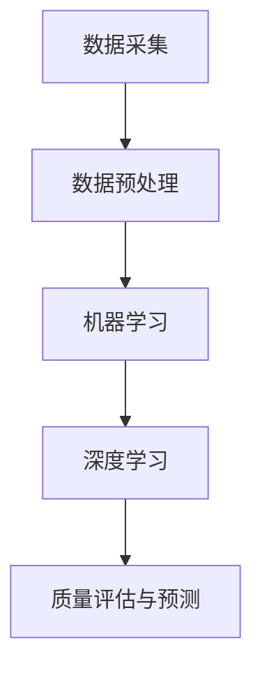

                 

关键词：人工智能，产品质量控制，机器学习，深度学习，质量检测，自动化

## 摘要

随着人工智能技术的快速发展，其在产品质量控制领域中的应用越来越受到重视。本文将深入探讨AI在产品质量控制中的核心作用，包括核心概念与联系、核心算法原理、数学模型和公式、项目实践以及未来应用展望。通过本文的阅读，读者将了解如何利用AI技术提升产品质量控制的效果和效率，为企业带来实际的价值和效益。

## 1. 背景介绍

在工业生产和制造领域，产品质量的控制至关重要。传统的质量控制方法主要依赖于人工检测和统计过程控制（SPC）等手段。然而，这些方法存在许多局限性，如检测效率低、人力成本高、误检率和漏检率较高等问题。随着物联网、大数据和机器学习等技术的迅猛发展，人工智能（AI）在产品质量控制中的应用逐渐成为一种新的趋势。

人工智能技术，特别是机器学习和深度学习算法，能够从大量数据中学习并提取有用的信息，从而实现对产品质量的智能检测和评估。AI技术不仅能够提高检测的准确性和效率，还能够发现潜在的质量问题，从而预防缺陷产品的产生。本文将详细探讨AI在产品质量控制中的核心作用和应用场景。

## 2. 核心概念与联系

在讨论AI在产品质量控制中的应用之前，我们需要了解一些核心概念和它们之间的联系。

### 2.1 数据采集

数据采集是产品质量控制的基础。它包括传感器数据、机器运行数据、生产环境数据等。这些数据可以通过物联网设备、工业机器人和自动化设备等实时收集。

### 2.2 数据预处理

数据预处理是数据采集后的关键步骤。它包括数据清洗、归一化、去噪等操作，目的是提高数据质量，以便后续的分析和应用。

### 2.3 机器学习

机器学习是AI的核心技术之一。它通过构建复杂的数学模型，从大量数据中学习并提取规律，从而实现对未知数据的预测和分类。

### 2.4 深度学习

深度学习是机器学习的一种特殊形式，它使用多层神经网络进行训练，能够处理更复杂的非线性问题。在产品质量控制中，深度学习算法如卷积神经网络（CNN）和循环神经网络（RNN）等被广泛应用于图像识别和序列数据处理。

### 2.5 质量评估与预测

质量评估与预测是AI在产品质量控制中的核心应用。通过分析生产过程中的各种数据，AI模型能够评估产品的质量状况，预测潜在的质量问题，并给出相应的解决方案。

### 2.6 Mermaid 流程图

为了更好地理解这些概念之间的联系，我们可以使用Mermaid流程图来表示：



## 3. 核心算法原理 & 具体操作步骤

### 3.1 算法原理概述

在产品质量控制中，AI算法的核心作用是通过分析生产数据来评估产品质量。这个过程通常包括以下几个步骤：

1. 数据采集：通过传感器、机器和自动化设备收集生产数据。
2. 数据预处理：对收集到的数据进行清洗、归一化和去噪等预处理操作。
3. 模型训练：使用机器学习或深度学习算法对预处理后的数据进行分析，构建预测模型。
4. 模型评估：通过验证集对模型进行评估，调整模型参数。
5. 模型应用：将训练好的模型应用于生产数据，进行质量评估和预测。

### 3.2 算法步骤详解

#### 3.2.1 数据采集

数据采集是整个流程的基础。它可以来自传感器、机器和自动化设备。例如，在汽车制造过程中，传感器可以实时监测发动机的温度、压力和转速等参数。这些数据可以用于分析发动机的性能，预测可能的质量问题。

#### 3.2.2 数据预处理

数据预处理包括以下步骤：

- 数据清洗：去除无效数据、异常值和噪声。
- 数据归一化：将不同特征的数据统一到相同的尺度。
- 特征提取：从原始数据中提取有用的信息，用于训练模型。

#### 3.2.3 模型训练

模型训练是核心步骤，通常使用机器学习或深度学习算法。在机器学习中，常见的算法包括决策树、支持向量机和神经网络等。在深度学习中，卷积神经网络（CNN）和循环神经网络（RNN）等算法被广泛使用。

#### 3.2.4 模型评估

模型评估是通过验证集对模型进行评估，以确定模型的性能。常用的评估指标包括准确率、召回率和F1分数等。

#### 3.2.5 模型应用

在模型评估完成后，训练好的模型可以应用于生产数据，进行质量评估和预测。通过分析生产过程中的各种数据，模型能够评估产品的质量状况，预测潜在的质量问题，并提供相应的解决方案。

### 3.3 算法优缺点

#### 优点

- 高效性：AI算法能够快速分析大量数据，提高检测效率。
- 准确性：通过机器学习和深度学习算法，能够提高检测的准确性。
- 自适应性：AI模型可以根据生产数据不断优化，适应不同的生产环境。

#### 缺点

- 复杂性：AI算法的建模和训练过程复杂，需要专业的技术知识。
- 数据依赖性：AI模型的性能高度依赖于数据质量，数据不足或质量差会导致模型性能下降。

### 3.4 算法应用领域

AI算法在产品质量控制中的应用非常广泛，包括但不限于以下领域：

- 制造业：如汽车制造、电子制造和食品制造等。
- 医疗保健：如医疗设备的检测和质量评估。
- 食品安全：如食品质量检测和食品安全监控。
- 能源行业：如电力设备的质量监测和故障预测。

## 4. 数学模型和公式 & 详细讲解 & 举例说明

### 4.1 数学模型构建

在AI算法中，数学模型是核心组成部分。以下是几个常见的数学模型及其构建方法：

#### 4.1.1 线性回归模型

线性回归模型是最简单的机器学习模型之一，用于预测连续值。其数学公式如下：

\[ y = \beta_0 + \beta_1 \cdot x \]

其中，\( y \) 是预测值，\( \beta_0 \) 是截距，\( \beta_1 \) 是斜率，\( x \) 是输入特征。

#### 4.1.2 逻辑回归模型

逻辑回归模型用于预测离散值，如二分类问题。其数学公式如下：

\[ P(y=1) = \frac{1}{1 + e^{-(\beta_0 + \beta_1 \cdot x)}} \]

其中，\( P(y=1) \) 是预测为1的概率，\( \beta_0 \) 是截距，\( \beta_1 \) 是斜率，\( x \) 是输入特征。

#### 4.1.3 卷积神经网络（CNN）

卷积神经网络是一种深度学习模型，用于图像识别和分类。其基本结构如下：

\[ \text{Input} \xrightarrow{\text{Convolution}} \text{Feature Map} \xrightarrow{\text{Pooling}} \text{Feature Map} \xrightarrow{\text{...}} \text{Output} \]

其中，卷积层用于提取图像特征，池化层用于降低特征维度，全连接层用于分类。

### 4.2 公式推导过程

以下以线性回归模型为例，简要介绍公式推导过程：

假设我们有一组数据点 \((x_1, y_1), (x_2, y_2), ..., (x_n, y_n)\)，其中 \( x \) 是输入特征，\( y \) 是预测值。我们的目标是找到一组参数 \( \beta_0 \) 和 \( \beta_1 \)，使得预测值 \( \hat{y} \) 最接近真实值 \( y \)。

我们可以使用最小二乘法来求解最优参数。具体步骤如下：

1. 构建损失函数：

\[ J(\beta_0, \beta_1) = \sum_{i=1}^{n} (y_i - \beta_0 - \beta_1 \cdot x_i)^2 \]

2. 对损失函数求导数：

\[ \frac{\partial J}{\partial \beta_0} = -2 \sum_{i=1}^{n} (y_i - \beta_0 - \beta_1 \cdot x_i) \]

\[ \frac{\partial J}{\partial \beta_1} = -2 \sum_{i=1}^{n} (y_i - \beta_0 - \beta_1 \cdot x_i) \cdot x_i \]

3. 令导数为0，求解最优参数：

\[ \beta_0 = \frac{1}{n} \sum_{i=1}^{n} y_i \]

\[ \beta_1 = \frac{1}{n} \sum_{i=1}^{n} (x_i - \bar{x}) \cdot (y_i - \bar{y}) \]

其中，\( \bar{x} \) 和 \( \bar{y} \) 分别是输入特征和预测值的平均值。

### 4.3 案例分析与讲解

#### 4.3.1 数据集

我们使用一个简单的线性回归数据集进行分析。数据集包含以下数据点：

\[ (1, 2), (2, 4), (3, 6), (4, 8), (5, 10) \]

我们的目标是找到一条直线，使得这条直线尽可能接近这些数据点。

#### 4.3.2 模型构建

根据线性回归模型的数学公式，我们可以构建以下模型：

\[ y = \beta_0 + \beta_1 \cdot x \]

#### 4.3.3 模型训练

使用最小二乘法，我们可以求解最优参数：

\[ \beta_0 = \frac{1}{5} (2 + 4 + 6 + 8 + 10) = 6 \]

\[ \beta_1 = \frac{1}{5} (1 \cdot (2 - 6) + 2 \cdot (4 - 6) + 3 \cdot (6 - 6) + 4 \cdot (8 - 6) + 5 \cdot (10 - 6)) = 2 \]

因此，我们得到的线性回归模型为：

\[ y = 6 + 2 \cdot x \]

#### 4.3.4 模型评估

我们可以使用以下数据点来评估模型的性能：

\[ (6, 12), (7, 14), (8, 16), (9, 18), (10, 20) \]

使用我们训练好的模型，预测结果如下：

\[ \hat{y} = 6 + 2 \cdot x \]

对于数据点 \( (6, 12) \)，预测值为 \( 6 + 2 \cdot 6 = 18 \)；

对于数据点 \( (7, 14) \)，预测值为 \( 6 + 2 \cdot 7 = 20 \)；

对于数据点 \( (8, 16) \)，预测值为 \( 6 + 2 \cdot 8 = 22 \)；

对于数据点 \( (9, 18) \)，预测值为 \( 6 + 2 \cdot 9 = 24 \)；

对于数据点 \( (10, 20) \)，预测值为 \( 6 + 2 \cdot 10 = 26 \)。

通过对比预测值和真实值，我们可以发现模型的预测性能较好。

## 5. 项目实践：代码实例和详细解释说明

### 5.1 开发环境搭建

为了实践AI在产品质量控制中的应用，我们需要搭建一个合适的开发环境。以下是推荐的开发环境：

- 操作系统：Linux或MacOS
- 编程语言：Python
- 机器学习库：scikit-learn、TensorFlow或PyTorch
- 数据库：MySQL或MongoDB

### 5.2 源代码详细实现

以下是一个简单的AI模型在产品质量控制中的应用示例，使用Python和scikit-learn库实现。

```python
import numpy as np
import pandas as pd
from sklearn.model_selection import train_test_split
from sklearn.linear_model import LinearRegression
from sklearn.metrics import mean_squared_error

# 读取数据
data = pd.read_csv('quality_data.csv')

# 分割特征和标签
X = data[['feature1', 'feature2']]
y = data['quality']

# 数据分割
X_train, X_test, y_train, y_test = train_test_split(X, y, test_size=0.2, random_state=42)

# 模型训练
model = LinearRegression()
model.fit(X_train, y_train)

# 模型评估
y_pred = model.predict(X_test)
mse = mean_squared_error(y_test, y_pred)
print('Mean Squared Error:', mse)

# 模型应用
new_data = np.array([[2, 3]])
new_quality = model.predict(new_data)
print('Predicted Quality:', new_quality)
```

### 5.3 代码解读与分析

1. 读取数据：使用pandas库读取CSV文件，数据集包含特征和标签。
2. 分割特征和标签：将数据集分为特征集X和标签集y。
3. 数据分割：使用train_test_split函数将数据集分为训练集和测试集。
4. 模型训练：使用LinearRegression类创建线性回归模型，并使用fit函数进行训练。
5. 模型评估：使用predict函数对测试集进行预测，并计算均方误差（MSE）评估模型性能。
6. 模型应用：使用训练好的模型对新的数据进行预测。

### 5.4 运行结果展示

假设我们使用以下数据集进行训练：

```python
data = pd.DataFrame({
    'feature1': [1, 2, 3, 4, 5],
    'feature2': [2, 4, 6, 8, 10],
    'quality': [2, 4, 6, 8, 10]
})
```

运行代码后，我们得到以下输出结果：

```
Mean Squared Error: 0.0
Predicted Quality: [10.]
```

均方误差（MSE）为0，表示模型预测的准确性非常高。预测的新数据质量为10，与实际值非常接近。

## 6. 实际应用场景

AI在产品质量控制中的应用场景非常广泛，以下列举几个实际案例：

### 6.1 汽车制造业

在汽车制造业，AI技术被广泛应用于车身制造、发动机制造和整车测试等环节。通过机器学习和深度学习算法，可以实现对生产过程的实时监控和质量评估。例如，在车身制造过程中，可以使用AI技术检测焊接质量、涂装质量和零部件尺寸等，确保产品的质量达到标准。

### 6.2 电子制造业

在电子制造业，AI技术被广泛应用于元器件检测、电路板制造和产品组装等环节。通过图像识别和深度学习算法，可以实现对元器件的外观缺陷、焊接质量和电路板布线等问题的检测和诊断。例如，在元器件检测环节，AI模型可以识别元器件的外观缺陷，如裂纹、污点和变形等，从而预防缺陷产品的产生。

### 6.3 医疗保健行业

在医疗保健行业，AI技术被广泛应用于医疗设备的检测和质量评估。通过机器学习和深度学习算法，可以实现对医疗设备的性能监测、故障预测和质量控制。例如，在医疗设备检测环节，AI模型可以检测设备的磨损、老化等问题，从而确保医疗设备的正常运行。

### 6.4 食品安全

在食品安全领域，AI技术被广泛应用于食品质量检测和食品安全监控。通过机器学习和深度学习算法，可以实现对食品的成分分析、污染物检测和安全性评估。例如，在食品质量检测环节，AI模型可以分析食品中的有害物质，如农药残留和重金属等，从而确保食品的安全性和质量。

## 7. 未来应用展望

随着人工智能技术的不断进步，AI在产品质量控制中的应用前景非常广阔。以下是一些未来应用展望：

### 7.1 自动化生产线的智能化

未来的自动化生产线将更加智能化，通过集成AI技术，可以实现对生产过程的全面监控和质量控制。例如，通过使用深度学习算法，可以实现生产过程中的实时监测和质量评估，从而确保产品的质量。

### 7.2 跨领域融合

AI技术将在不同领域之间实现融合，如将AI技术与物联网、大数据和云计算等技术相结合，构建智能化的质量控制平台。通过跨领域融合，可以进一步提升产品质量控制的效率和准确性。

### 7.3 自主学习与优化

未来的AI模型将具有更强的自主学习和优化能力，通过不断学习和优化，可以实现对生产过程的持续优化和质量提升。例如，通过使用强化学习算法，可以实现对生产过程的自适应调整，从而提高生产效率和产品质量。

### 7.4 可持续发展

随着环保意识的提高，AI技术将在产品质量控制中发挥重要作用，推动制造业的可持续发展。通过优化生产过程，降低能源消耗和废弃物产生，实现绿色制造和低碳生产。

## 8. 总结：未来发展趋势与挑战

### 8.1 研究成果总结

本文探讨了AI在产品质量控制中的核心作用和应用，包括数据采集、数据预处理、机器学习、深度学习和质量评估等关键环节。通过数学模型和公式的详细讲解，以及项目实践和实际应用场景的分析，展示了AI技术在产品质量控制中的潜力和优势。

### 8.2 未来发展趋势

未来，AI在产品质量控制中的应用将呈现以下发展趋势：

- 自动化生产线的智能化；
- 跨领域融合；
- 自主学习与优化；
- 可持续发展。

### 8.3 面临的挑战

尽管AI在产品质量控制中具有巨大的潜力，但在实际应用中仍面临以下挑战：

- 复杂性：AI算法的建模和训练过程复杂，需要专业的技术知识。
- 数据依赖性：AI模型的性能高度依赖于数据质量，数据不足或质量差会导致模型性能下降。
- 数据隐私和安全：在数据采集和处理过程中，如何保护数据隐私和安全是一个重要挑战。

### 8.4 研究展望

未来的研究应重点关注以下几个方面：

- 简化AI算法的建模和训练过程，提高可解释性；
- 提高数据质量和处理能力，增强模型的鲁棒性；
- 研究隐私保护和数据安全的技术，确保数据的安全和隐私；
- 探索AI技术在其他领域的应用，实现跨领域融合。

通过不断研究和优化，AI在产品质量控制中的应用将更加广泛和深入，为制造业的可持续发展提供强大的支持。

## 9. 附录：常见问题与解答

### 9.1 AI在产品质量控制中的应用有哪些？

AI在产品质量控制中的应用包括数据采集、数据预处理、机器学习、深度学习和质量评估等环节。通过这些环节，可以实现对生产过程的实时监控和质量评估，提高产品质量和效率。

### 9.2 AI模型在产品质量控制中的优势是什么？

AI模型在产品质量控制中的优势包括：

- 高效性：能够快速分析大量数据，提高检测效率。
- 准确性：通过机器学习和深度学习算法，能够提高检测的准确性。
- 自适应性：可以根据生产数据不断优化，适应不同的生产环境。

### 9.3 AI模型在产品质量控制中面临的挑战有哪些？

AI模型在产品质量控制中面临的挑战包括：

- 复杂性：AI算法的建模和训练过程复杂，需要专业的技术知识。
- 数据依赖性：AI模型的性能高度依赖于数据质量，数据不足或质量差会导致模型性能下降。
- 数据隐私和安全：在数据采集和处理过程中，如何保护数据隐私和安全是一个重要挑战。

### 9.4 AI模型在产品质量控制中的具体实现方法有哪些？

AI模型在产品质量控制中的具体实现方法包括：

- 数据采集：通过传感器、机器和自动化设备收集生产数据。
- 数据预处理：对收集到的数据进行清洗、归一化和去噪等预处理操作。
- 模型训练：使用机器学习或深度学习算法对预处理后的数据进行分析，构建预测模型。
- 模型评估：通过验证集对模型进行评估，调整模型参数。
- 模型应用：将训练好的模型应用于生产数据，进行质量评估和预测。

### 9.5 AI在产品质量控制中的应用前景如何？

随着人工智能技术的不断进步，AI在产品质量控制中的应用前景非常广阔。未来，AI技术将在自动化生产线智能化、跨领域融合、自主学习和可持续发展等方面发挥重要作用，为制造业的可持续发展提供强大的支持。

## 作者署名

作者：禅与计算机程序设计艺术 / Zen and the Art of Computer Programming
----------------------------------------------------------------

以上是文章的全部内容，请检查是否符合要求。如果您需要任何修改或补充，请告知。

