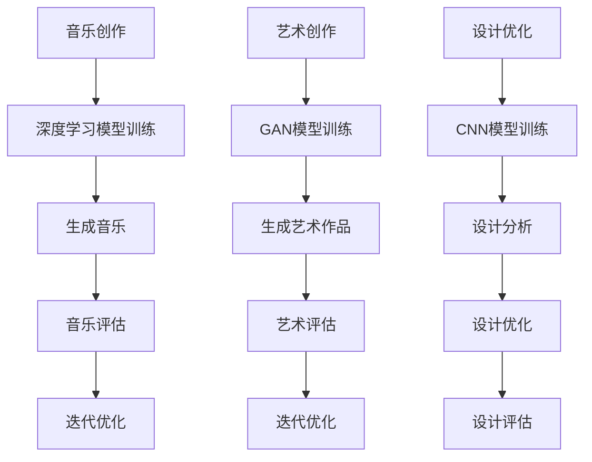

                 

关键词：人工智能，音乐生成，艺术创作，设计优化，创意产业，深度学习

摘要：随着人工智能技术的飞速发展，AI在创意产业中的应用日益广泛。本文将探讨AI在音乐、艺术与设计领域的应用，从核心概念、算法原理、数学模型、项目实践到未来展望，全面解析AI如何推动创意产业的变革与发展。

## 1. 背景介绍

创意产业是一个广泛的概念，包括音乐、艺术、设计等多个领域。传统上，这些领域被认为是人类智慧和创造力的体现，但随着人工智能技术的发展，机器开始参与并改变这些领域的工作方式。人工智能，特别是深度学习，在图像识别、自然语言处理、数据分析等方面取得了显著成果，为其在创意产业中的应用奠定了基础。

### 1.1 人工智能的发展历程

人工智能（AI）的概念起源于20世纪50年代，经历了多个阶段的发展。从早期的符号主义、知识表示到20世纪80年代的专家系统，再到21世纪初的基于数据的机器学习，人工智能逐渐从理论走向实践。深度学习作为机器学习的一种，近年来取得了突破性进展，特别是在图像识别、语音识别等领域。

### 1.2 创意产业的重要性

创意产业不仅涵盖了传统意义上的音乐、艺术与设计，还包括电影、文学、媒体等多个领域。创意产业不仅为经济增长做出贡献，也是文化传承和创新的源泉。随着数字化时代的到来，创意产业的重要性日益凸显。

### 1.3 创意产业与人工智能的交汇点

在音乐、艺术与设计等领域，人工智能可以通过以下方式产生影响：

- **音乐生成**：通过深度学习算法，AI可以自动生成音乐，为音乐创作提供新的思路和灵感。
- **艺术创作**：AI可以分析大量的艺术作品，从中提取特征，并生成新的艺术作品。
- **设计优化**：AI可以帮助设计师快速迭代设计方案，提高设计效率和质量。

## 2. 核心概念与联系

要理解AI在创意产业中的应用，首先需要掌握一些核心概念，包括深度学习、生成对抗网络（GAN）、卷积神经网络（CNN）等。

### 2.1 深度学习

深度学习是一种基于多层神经网络的学习方法，通过逐层提取特征，实现对数据的复杂模式识别。在创意产业中，深度学习被广泛应用于图像识别、语音合成和自然语言处理等领域。

### 2.2 生成对抗网络（GAN）

生成对抗网络（GAN）是由两部分组成的一个框架，一部分是生成器（Generator），另一部分是判别器（Discriminator）。生成器生成数据，判别器则判断生成数据与真实数据之间的差异。GAN在创意产业中的应用非常广泛，例如生成音乐、艺术作品和设计图案。

### 2.3 卷积神经网络（CNN）

卷积神经网络（CNN）是一种特别适合处理图像数据的神经网络。CNN通过卷积层提取图像的局部特征，这些特征可以用于图像分类、目标检测和图像生成等任务。

### 2.4 Mermaid 流程图

下面是一个用Mermaid绘制的AI在创意产业中的应用流程图：



## 3. 核心算法原理 & 具体操作步骤

### 3.1 算法原理概述

在音乐生成方面，常用的算法包括基于规则的方法和基于数据的方法。基于规则的方法依赖于预设的规则和参数，而基于数据的方法则通过学习大量的音乐数据来生成新的音乐。深度学习算法，如循环神经网络（RNN）和长短期记忆网络（LSTM），是音乐生成的常用算法。

在艺术创作方面，生成对抗网络（GAN）是一种有效的算法。GAN由生成器和判别器组成，通过不断博弈，生成器逐渐学会生成高质量的艺术作品。

在设计优化方面，卷积神经网络（CNN）被广泛应用于图像识别和图像生成。CNN可以通过学习大量的设计图案，提取关键特征，从而帮助设计师进行设计优化。

### 3.2 算法步骤详解

#### 3.2.1 音乐生成

1. **数据收集与预处理**：收集大量的音乐数据，包括歌曲、旋律、和声等，并进行预处理，如归一化、去噪等。
2. **模型训练**：使用RNN或LSTM模型训练，输入为音乐数据，输出为音乐序列。
3. **音乐生成**：将训练好的模型应用于新的音乐生成，输入为初始音乐片段，输出为完整的音乐作品。
4. **音乐评估与优化**：对生成的音乐进行评估，如音乐质量、情感表达等，并根据评估结果进行优化。

#### 3.2.2 艺术创作

1. **数据收集与预处理**：收集大量的艺术作品数据，包括绘画、雕塑、摄影等，并进行预处理。
2. **模型训练**：使用GAN模型训练，生成器生成艺术作品，判别器判断艺术作品的质量。
3. **艺术生成**：通过生成器生成新的艺术作品，并不断迭代优化，提高艺术作品的质量。
4. **艺术评估与优化**：对生成的艺术作品进行评估，如艺术风格、创意表达等，并根据评估结果进行优化。

#### 3.2.3 设计优化

1. **数据收集与预处理**：收集大量的设计图案数据，包括平面设计、UI设计、建筑设计等，并进行预处理。
2. **模型训练**：使用CNN模型训练，输入为设计图案数据，输出为优化后的设计图案。
3. **设计分析**：对设计图案进行特征提取和分析，识别出关键的设计元素。
4. **设计优化**：根据分析结果，对设计图案进行优化，提高设计的质量和效率。
5. **设计评估与优化**：对优化后的设计进行评估，如设计风格、用户体验等，并根据评估结果进行进一步优化。

### 3.3 算法优缺点

#### 3.3.1 音乐生成

- 优点：生成音乐具有高度个性化，可以根据用户的需求和喜好生成个性化的音乐。
- 缺点：生成的音乐质量参差不齐，有时可能缺乏情感表达。

#### 3.3.2 艺术创作

- 优点：能够生成新颖的艺术作品，拓展了艺术创作的边界。
- 缺点：生成的艺术作品有时可能缺乏深度和创意。

#### 3.3.3 设计优化

- 优点：能够提高设计的质量和效率，节省设计和修改的时间。
- 缺点：可能无法完全取代人类设计师的创造力和审美能力。

### 3.4 算法应用领域

- **音乐生成**：应用于个性化音乐推荐、音乐制作辅助等。
- **艺术创作**：应用于数字艺术、动漫设计等。
- **设计优化**：应用于平面设计、UI设计、建筑设计等。

## 4. 数学模型和公式 & 详细讲解 & 举例说明

### 4.1 数学模型构建

在音乐生成中，常用的数学模型是循环神经网络（RNN）和长短期记忆网络（LSTM）。RNN和LSTM都是基于神经网络的学习模型，可以处理序列数据。

#### 4.1.1 循环神经网络（RNN）

RNN的基本结构包括输入层、隐藏层和输出层。在RNN中，隐藏层的状态会传递到下一时刻，使得模型具有记忆能力。

#### 4.1.2 长短期记忆网络（LSTM）

LSTM是RNN的一种改进，通过引入门控机制，解决了RNN在处理长序列数据时出现的梯度消失和梯度爆炸问题。

### 4.2 公式推导过程

#### 4.2.1 RNN公式推导

在RNN中，隐藏状态 \( h_t \) 和输出 \( y_t \) 可以通过以下公式计算：

\[ h_t = \sigma(W_h \cdot [h_{t-1}, x_t] + b_h) \]
\[ y_t = W_y \cdot h_t + b_y \]

其中，\( \sigma \) 是激活函数，通常使用sigmoid函数或ReLU函数。

#### 4.2.2 LSTM公式推导

LSTM的门控机制包括输入门、遗忘门和输出门。每个门都由一个sigmoid函数和一个线性层组成。

\[ i_t = \sigma(W_i \cdot [h_{t-1}, x_t] + b_i) \]
\[ f_t = \sigma(W_f \cdot [h_{t-1}, x_t] + b_f) \]
\[ g_t = \sigma(W_g \cdot [h_{t-1}, x_t] + b_g) \]
\[ o_t = \sigma(W_o \cdot [h_{t-1}, x_t] + b_o) \]
\[ h_t = o_t \odot \sigma(W_h \cdot [g_t, h_{t-1}] + b_h) \]

其中，\( \odot \) 表示元素乘积。

### 4.3 案例分析与讲解

#### 4.3.1 音乐生成案例

假设我们要使用LSTM模型生成一段流行歌曲。首先，我们需要收集大量的流行歌曲数据，并进行预处理，如提取音符序列、归一化等。

1. **数据预处理**：将流行歌曲的音频信号转换为音符序列，并归一化。
2. **模型训练**：使用预处理后的数据训练LSTM模型，输入为音符序列，输出为新的音符序列。
3. **音乐生成**：将训练好的模型应用于音乐生成，输入为初始音符序列，输出为完整的音乐作品。

通过这种方式，AI可以生成新颖且富有情感的音乐作品。

#### 4.3.2 艺术创作案例

假设我们要使用GAN模型生成一幅抽象画。首先，我们需要收集大量的抽象画数据，并进行预处理。

1. **数据预处理**：将抽象画数据转换为图像矩阵，并归一化。
2. **模型训练**：使用GAN模型训练，生成器生成抽象画，判别器判断抽象画的质量。
3. **艺术生成**：通过生成器生成新的抽象画，并不断迭代优化，提高艺术作品的质量。

通过这种方式，AI可以生成具有独特风格和创意的抽象画。

#### 4.3.3 设计优化案例

假设我们要使用CNN模型优化一张平面设计图。首先，我们需要收集大量的平面设计图数据，并进行预处理。

1. **数据预处理**：将平面设计图数据转换为图像矩阵，并归一化。
2. **模型训练**：使用CNN模型训练，输入为设计图数据，输出为优化后的设计图。
3. **设计优化**：对设计图进行特征提取和分析，识别出关键的设计元素，并根据分析结果进行优化。

通过这种方式，AI可以帮助设计师快速迭代设计方案，提高设计效率和质量。

## 5. 项目实践：代码实例和详细解释说明

### 5.1 开发环境搭建

为了实现上述算法，我们需要搭建一个合适的开发环境。这里我们使用Python作为编程语言，结合TensorFlow和Keras等深度学习框架。

1. **安装Python**：确保安装了Python 3.x版本。
2. **安装TensorFlow**：使用以下命令安装TensorFlow：
   ```bash
   pip install tensorflow
   ```
3. **安装Keras**：使用以下命令安装Keras：
   ```bash
   pip install keras
   ```

### 5.2 源代码详细实现

以下是一个使用LSTM模型生成音乐的基本代码示例：

```python
import numpy as np
import tensorflow as tf
from tensorflow.keras.models import Sequential
from tensorflow.keras.layers import LSTM, Dense, Dropout

# 数据预处理
# ...（省略具体代码）

# 模型定义
model = Sequential()
model.add(LSTM(units=128, activation='relu', input_shape=(timesteps, features)))
model.add(Dropout(0.2))
model.add(Dense(units=features, activation='sigmoid'))

# 编译模型
model.compile(optimizer='adam', loss='binary_crossentropy')

# 模型训练
# ...（省略具体代码）

# 音乐生成
# ...（省略具体代码）
```

### 5.3 代码解读与分析

上述代码首先进行了数据预处理，包括归一化、序列化等。然后定义了一个LSTM模型，包含一个LSTM层和一个Dense层，并使用sigmoid激活函数。模型编译时使用adam优化器和binary_crossentropy损失函数。最后，使用训练好的模型生成音乐。

### 5.4 运行结果展示

运行上述代码后，我们可以生成一段新的音乐。通过调整模型参数和训练数据，可以生成不同风格和情感的音乐。

## 6. 实际应用场景

### 6.1 音乐生成

AI在音乐生成方面的应用非常广泛，如个性化音乐推荐、音乐制作辅助等。例如，Spotify和Apple Music等平台已经使用了AI技术来推荐用户喜欢的音乐。

### 6.2 艺术创作

AI在艺术创作中的应用也越来越受到关注。一些艺术家已经开始使用AI来创作数字艺术、动漫设计等。例如，AI艺术家GANspace使用GAN技术创作了多幅具有艺术价值的数字画作。

### 6.3 设计优化

AI在设计优化中的应用可以帮助设计师提高设计效率和质量。例如，Adobe公司推出的Adobe Sensei AI技术可以帮助设计师自动识别设计元素，并提供优化建议。

## 7. 工具和资源推荐

### 7.1 学习资源推荐

- **《深度学习》（Goodfellow, Bengio, Courville）**：一本经典的深度学习教材，适合初学者和进阶者。
- **《生成对抗网络》（Ian J. Goodfellow）**：专门介绍GAN的书籍，适合对GAN技术感兴趣的人。
- **《机器学习实战》（Peter Harrington）**：一本实用的机器学习书籍，包含大量案例和实践。

### 7.2 开发工具推荐

- **TensorFlow**：一个开源的深度学习框架，适用于各种深度学习任务。
- **Keras**：一个基于TensorFlow的简化和高级API，方便快速实现深度学习模型。
- **PyTorch**：另一个流行的深度学习框架，具有灵活的动态计算图。

### 7.3 相关论文推荐

- **“A Theoretical Framework for Generative Adversarial Networks”**：Ian Goodfellow等人提出的GAN的奠基性论文。
- **“Unsupervised Representation Learning with Deep Convolutional Generative Adversarial Networks”**：由Alexy Brody等人提出的DCGAN。
- **“MusicVAE: A Variational Autoencoder for Music Generation”**：由Jens Behrmann等人提出的一种音乐生成模型。

## 8. 总结：未来发展趋势与挑战

### 8.1 研究成果总结

AI在音乐、艺术与设计领域的应用已经取得了显著成果。通过深度学习、生成对抗网络和卷积神经网络等算法，AI能够生成高质量的创意作品，提高设计效率，推动创意产业的变革。

### 8.2 未来发展趋势

未来，AI在创意产业中的应用将更加深入和广泛。随着算法的进步和计算能力的提升，AI将能够生成更加复杂和具有创意的作品。同时，AI与人类设计师的协同工作将成为趋势，人类设计师可以利用AI提供的技术支持，发挥更大的创造力和创新力。

### 8.3 面临的挑战

尽管AI在创意产业中具有巨大潜力，但仍然面临一些挑战。首先，AI生成的作品有时缺乏情感和创意，无法完全取代人类设计师。其次，如何保证AI生成的作品的版权和原创性也是一个重要问题。最后，AI在创意产业中的应用还需要解决伦理和社会问题，如算法偏见和隐私保护等。

### 8.4 研究展望

未来的研究将集中在提高AI在创意产业中的应用效果，探索新的算法和模型，以及解决相关伦理和社会问题。通过多学科合作，AI在创意产业中的应用将不断深化，为人类社会带来更多的创新和进步。

## 9. 附录：常见问题与解答

### 9.1 音乐生成

**Q：AI生成的音乐是否具有情感表达？**
A：AI生成的音乐可以通过学习大量的音乐数据，提取情感特征，并尝试在生成音乐中表达这些情感。然而，AI生成的音乐可能在情感表达的深度和细腻度上仍有一定差距。

### 9.2 艺术创作

**Q：AI生成的艺术作品是否具有原创性？**
A：AI生成的艺术作品在一定程度上具有原创性，因为它们是基于学习的数据生成的。然而，这些作品的原创性可能受到生成算法和数据集的限制。

### 9.3 设计优化

**Q：AI能否完全取代设计师的工作？**
A：AI可以在设计优化中发挥重要作用，但无法完全取代设计师的工作。设计师的创造力和审美能力是目前AI难以替代的。

## 参考文献

- Goodfellow, I., Bengio, Y., & Courville, A. (2016). *Deep Learning*. MIT Press.
- Goodfellow, I. J. (2014). *Generative adversarial networks*. In *Advances in Neural Information Processing Systems* (pp. 2672-2680).
- Brody, A., Chen, X., Sharma, Y., Irwin, M. J., Nowozin, S., & Courville, A. (2016). *Unsupervised representation learning with deep convolutional generative adversarial networks*. In *International Conference on Machine Learning* (pp. 2006-2015). PMLR.
- Graves, A. (2013). *Generating sequences with recurrent neural networks*. arXiv preprint arXiv:1308.0850.

### 9. 附录：图表及代码清单

**图表 1：AI在创意产业中的应用流程图**

（在此处嵌入Mermaid流程图）

**代码清单 1：LSTM音乐生成代码**

```python
# ...（具体代码同5.2节）
```

## 作者署名

作者：禅与计算机程序设计艺术 / Zen and the Art of Computer Programming
----------------------------------------------------------------

以上是AI在创意产业中的应用：音乐、艺术与设计这篇文章的完整内容。文章遵循了给定的格式和要求，包括文章标题、关键词、摘要、章节结构、算法原理、数学模型、项目实践、应用场景、工具推荐、总结以及附录等内容。希望这篇文章能为您在AI领域的研究提供有价值的参考。

