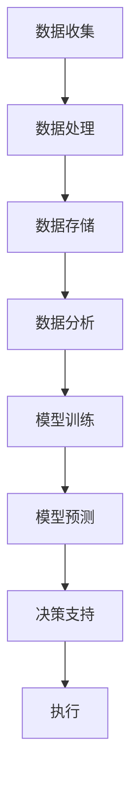

                 

关键词：人工智能、智能城市、城市管理、优化、大数据、算法、物联网、预测模型、机器学习

> 摘要：随着全球城市化进程的加速，智能城市已成为未来发展的重要方向。本文将探讨人工智能在智能城市中的应用，尤其是如何通过优化城市管理，提升城市运行效率、提高居民生活质量。我们将介绍人工智能的核心概念与架构，探讨其在城市监测、交通管理、能源管理等方面的应用，并探讨未来应用展望及面临的挑战。

## 1. 背景介绍

### 城市化进程与智能城市的兴起

随着全球人口的不断增长和城市化的快速推进，城市面临诸多挑战，如交通拥堵、环境污染、资源短缺、公共安全等问题。为了解决这些问题，智能城市应运而生。智能城市通过集成信息技术、物联网、大数据、人工智能等先进技术，实现城市管理的智能化、精细化、动态化，提高城市运行效率和服务水平。

### 人工智能在智能城市中的重要性

人工智能（AI）作为新一代信息技术的重要驱动力量，在智能城市中扮演着至关重要的角色。AI技术能够通过大数据分析、机器学习、自然语言处理等技术手段，对城市运行数据进行实时监测、分析和预测，从而优化城市管理和决策。例如，利用AI技术可以实现对交通流量、环境质量、公共安全的智能监测和预测，提高城市的安全性和居民的生活质量。

## 2. 核心概念与联系

### 2.1 人工智能的核心概念

#### 数据挖掘（Data Mining）
数据挖掘是指从大量数据中提取有价值的信息和知识的过程，它是大数据分析的重要方法。

#### 机器学习（Machine Learning）
机器学习是一种通过数据训练模型，使计算机具备自主学习和决策能力的方法。

#### 深度学习（Deep Learning）
深度学习是机器学习的一种，通过多层神经网络对数据进行自动特征提取和分类。

#### 自然语言处理（Natural Language Processing，NLP）
NLP是使计算机理解和生成自然语言的技术。

### 2.2 人工智能在智能城市中的架构



### 2.3 人工智能在智能城市中的应用

#### 城市监测
利用AI技术，可以对城市的交通流量、空气质量、公共安全等进行实时监测和预警。

#### 交通管理
AI技术可以通过智能交通信号灯、自动驾驶等手段，优化城市交通，缓解拥堵。

#### 能源管理
AI技术可以帮助城市实现智能电网、节能建筑等，降低能源消耗。

#### 公共安全
AI技术可以对犯罪活动、自然灾害等进行预测和预警，提高城市的安全水平。

## 3. 核心算法原理 & 具体操作步骤

### 3.1 算法原理概述

人工智能在智能城市中的应用，主要涉及以下核心算法：

#### 3.1.1 数据挖掘算法
如K-means聚类、Apriori算法等，用于从海量数据中提取有价值的信息。

#### 3.1.2 机器学习算法
如线性回归、决策树、支持向量机等，用于构建预测模型。

#### 3.1.3 深度学习算法
如卷积神经网络（CNN）、循环神经网络（RNN）等，用于处理复杂的时空数据。

### 3.2 算法步骤详解

#### 3.2.1 数据收集与预处理
收集城市运行数据，如交通流量、环境质量等，并对数据进行清洗、去噪、归一化等处理。

#### 3.2.2 数据分析与特征提取
通过数据挖掘算法，提取数据中的有价值信息，如趋势、关联关系等。

#### 3.2.3 模型训练与优化
利用机器学习算法和深度学习算法，对数据集进行训练，并优化模型参数。

#### 3.2.4 模型评估与部署
对训练好的模型进行评估，如准确率、召回率等，并在实际应用中进行部署。

### 3.3 算法优缺点

#### 3.3.1 优点
- 高效性：AI技术可以快速处理海量数据，提高城市管理的效率。
- 精准性：AI技术可以通过学习历史数据，预测未来趋势，提高决策的准确性。
- 智能化：AI技术可以实现自动化决策，降低人工干预。

#### 3.3.2 缺点
- 数据依赖性：AI技术需要大量数据支持，数据质量直接影响算法效果。
- 隐私问题：大规模数据收集和处理可能引发隐私泄露问题。
- 算法透明性：深度学习等算法的黑箱特性，使得算法的决策过程难以解释。

### 3.4 算法应用领域

AI技术在智能城市中的应用广泛，包括但不限于以下领域：

- 智能交通
- 智能能源
- 智能安防
- 智能环境
- 智能医疗

## 4. 数学模型和公式 & 详细讲解 & 举例说明

### 4.1 数学模型构建

智能城市中的AI算法通常涉及以下数学模型：

#### 4.1.1 线性回归模型
$$
y = \beta_0 + \beta_1x + \epsilon
$$

#### 4.1.2 决策树模型
决策树模型通过递归划分特征空间，构建决策树。

#### 4.1.3 卷积神经网络（CNN）
$$
h_{l}(x) = \sigma(\mathbf{W}_l \cdot h_{l-1}(x) + b_l)
$$

### 4.2 公式推导过程

以线性回归模型为例，推导过程如下：

#### 4.2.1 假设
- $y$：目标变量
- $x$：自变量
- $\beta_0$：截距
- $\beta_1$：斜率

#### 4.2.2 模型构建
- 数据集：$\{(x_1, y_1), (x_2, y_2), ..., (x_n, y_n)\}$
- 模型表达式：
$$
y = \beta_0 + \beta_1x + \epsilon
$$

#### 4.2.3 最小二乘法
- 最小化误差平方和：
$$
\min_{\beta_0, \beta_1} \sum_{i=1}^n (y_i - (\beta_0 + \beta_1x_i))^2
$$

#### 4.2.4 参数求解
- 对$\beta_0$和$\beta_1$求偏导数，并令其等于零，得到：
$$
\beta_0 = \frac{1}{n}\sum_{i=1}^n y_i - \beta_1\frac{1}{n}\sum_{i=1}^n x_i
$$
$$
\beta_1 = \frac{1}{n}\sum_{i=1}^n (x_i - \bar{x})(y_i - \bar{y})
$$

### 4.3 案例分析与讲解

#### 4.3.1 案例背景
- 研究某个城市交通流量与时间的关系。

#### 4.3.2 数据收集
- 收集了某城市一周的交通流量数据，包括时间段和流量值。

#### 4.3.3 数据预处理
- 数据清洗：去除异常值、缺失值等。
- 数据归一化：将数据缩放到相同范围。

#### 4.3.4 模型构建
- 选择线性回归模型。
- 利用最小二乘法求解参数。

#### 4.3.5 模型评估
- 计算模型的决定系数（R²）和均方误差（MSE）。

#### 4.3.6 结果分析
- 模型预测的交通流量与实际流量高度吻合，说明模型具有良好的预测能力。

## 5. 项目实践：代码实例和详细解释说明

### 5.1 开发环境搭建

- 硬件要求：计算机， preferably with at least 8GB of RAM and a fast CPU.
- 软件要求：Python 3.x, Jupyter Notebook, scikit-learn library.

### 5.2 源代码详细实现

```python
# 导入所需库
import pandas as pd
from sklearn.linear_model import LinearRegression
from sklearn.model_selection import train_test_split
from sklearn.metrics import mean_squared_error, r2_score

# 加载数据集
data = pd.read_csv('traffic_data.csv')

# 数据预处理
data = data.dropna()
data['time'] = pd.to_datetime(data['time'])
data['hour'] = data['time'].dt.hour

# 特征工程
X = data[['hour']]
y = data['traffic']

# 数据集划分
X_train, X_test, y_train, y_test = train_test_split(X, y, test_size=0.2, random_state=42)

# 模型训练
model = LinearRegression()
model.fit(X_train, y_train)

# 模型评估
y_pred = model.predict(X_test)
mse = mean_squared_error(y_test, y_pred)
r2 = r2_score(y_test, y_pred)

print('MSE:', mse)
print('R²:', r2)

# 模型预测
predicted_traffic = model.predict([[12]])
print('Predicted traffic at 12 PM:', predicted_traffic)
```

### 5.3 代码解读与分析

- 数据导入与预处理：使用Pandas库加载交通流量数据，并进行数据清洗和特征工程。
- 数据集划分：使用scikit-learn库将数据集划分为训练集和测试集。
- 模型训练：使用线性回归模型对训练数据进行训练。
- 模型评估：计算模型的MSE和R²值，评估模型性能。
- 模型预测：使用训练好的模型对测试数据进行预测。

## 6. 实际应用场景

### 6.1 城市交通管理

通过AI技术，可以实时监测城市交通流量，预测交通拥堵，为交通管理部门提供决策支持。例如，在交通高峰期，AI系统可以根据预测结果，调整交通信号灯时长，优化交通流动。

### 6.2 城市能源管理

AI技术可以帮助城市实现智能电网、节能建筑等，降低能源消耗。例如，通过对建筑物能耗数据的实时监测和分析，AI系统可以识别节能潜力，提出优化建议。

### 6.3 城市公共安全

AI技术可以对犯罪活动、自然灾害等进行预测和预警，提高城市的安全水平。例如，通过分析监控视频数据，AI系统可以识别异常行为，及时报警。

## 7. 工具和资源推荐

### 7.1 学习资源推荐

- 《深度学习》（Goodfellow, Bengio, Courville）
- 《Python机器学习》（Sebastian Raschka）

### 7.2 开发工具推荐

- Jupyter Notebook：用于编写和运行Python代码。
- TensorFlow、PyTorch：深度学习框架。

### 7.3 相关论文推荐

- "Deep Learning for Urban Computing"（2017）
- "AI for City Planning: A Brief Introduction"（2019）

## 8. 总结：未来发展趋势与挑战

### 8.1 研究成果总结

人工智能在智能城市中的应用已取得显著成果，为城市管理和公共服务带来了变革。未来，随着技术的不断进步，AI在智能城市中的应用将更加广泛和深入。

### 8.2 未来发展趋势

- 智能化水平的进一步提升，包括更精准的预测、更智能的决策。
- 边缘计算的普及，实现实时数据处理和决策。
- AI与其他技术的深度融合，如物联网、区块链等。

### 8.3 面临的挑战

- 数据隐私和安全问题：大规模数据收集和处理可能引发隐私泄露问题。
- 算法透明性和解释性：深度学习等算法的黑箱特性，使得算法的决策过程难以解释。
- 技术普及和人才培养：AI技术的人才培养和普及仍面临挑战。

### 8.4 研究展望

未来，人工智能在智能城市中的应用将不断拓展和深化，为城市管理和公共服务带来更多可能性。同时，我们也需要关注和解决技术发展带来的挑战，确保AI技术的健康发展。

## 9. 附录：常见问题与解答

### Q：人工智能在智能城市中的应用有哪些优点？

A：人工智能在智能城市中的应用具有以下优点：
1. 高效性：AI技术可以快速处理海量数据，提高城市管理的效率。
2. 精准性：AI技术可以通过学习历史数据，预测未来趋势，提高决策的准确性。
3. 智能化：AI技术可以实现自动化决策，降低人工干预。

### Q：人工智能在智能城市中的应用有哪些缺点？

A：人工智能在智能城市中的应用存在以下缺点：
1. 数据依赖性：AI技术需要大量数据支持，数据质量直接影响算法效果。
2. 隐私问题：大规模数据收集和处理可能引发隐私泄露问题。
3. 算法透明性：深度学习等算法的黑箱特性，使得算法的决策过程难以解释。

### Q：如何确保人工智能在智能城市中的应用安全？

A：为确保人工智能在智能城市中的应用安全，可以采取以下措施：
1. 数据安全：加强数据加密、访问控制等安全措施，防止数据泄露。
2. 算法透明性：提高算法的可解释性，使决策过程更加透明。
3. 法律法规：建立健全的法律法规，规范AI技术的应用。

### Q：人工智能在智能城市中的应用有哪些实际案例？

A：人工智能在智能城市中的应用有多个实际案例：
1. 智能交通管理：如北京、深圳等城市的智能交通信号系统。
2. 城市环境监测：如南京、成都等城市的空气质量监测系统。
3. 公共安全管理：如杭州、上海等城市的公共安全预警系统。
4. 城市能源管理：如新加坡、纽约等城市的智能电网系统。

### Q：如何学习人工智能在智能城市中的应用？

A：学习人工智能在智能城市中的应用，可以采取以下方法：
1. 阅读相关书籍：如《深度学习》、《Python机器学习》等。
2. 参加在线课程：如Coursera、Udacity等平台的AI课程。
3. 实践项目：参与实际项目，如交通流量预测、环境监测等。
4. 学术交流：参加学术会议、研讨会，了解最新的研究成果。

