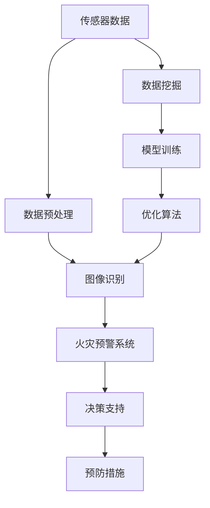

                 

关键词：人工智能、森林火灾、预防、生态系统、机器学习、图像识别、物联网、传感器、数据挖掘、预警系统、数据分析、模型训练

> 摘要：本文将深入探讨人工智能在智能森林火灾预防中的应用，分析其在生态保护中的重要作用。通过介绍当前的技术进展、核心算法、数学模型以及实际项目实践，本文旨在为读者提供一个全面的了解，并展望未来的发展方向与挑战。

## 1. 背景介绍

森林火灾是一种常见的自然灾害，不仅威胁到人类生命财产安全，还对生态系统造成严重破坏。传统的方法包括人工巡防、气象监测和预防措施等，但这些方法在效率和准确性上都存在一定的限制。随着人工智能技术的快速发展，利用AI进行森林火灾预防成为可能。AI可以通过收集和分析大量数据，提供实时预警和决策支持，从而提高火灾预防的效果。

### 1.1 森林火灾的现状

- **火灾频发**：全球每年因森林火灾造成的损失巨大，尤其是干旱季节和高温时期。
- **生态破坏**：火灾烧毁了大量的植被，导致土壤质量下降，生态系统失衡。
- **经济损失**：火灾不仅破坏了森林资源，还可能导致基础设施损坏，影响经济收入。

### 1.2 传统预防方法的局限性

- **人工巡防**：受限于人力和时间，难以实现全面覆盖。
- **气象监测**：虽然气象数据能够提供一定的预警，但无法实时监测火灾发生。
- **预防措施**：如设置防火带、喷水系统等，但需要大量资金和技术支持。

## 2. 核心概念与联系

在智能森林火灾预防中，AI技术的核心概念包括图像识别、物联网、传感器、数据挖掘和机器学习。以下是一个简化的Mermaid流程图，展示了这些概念之间的联系。



### 2.1 传感器数据

传感器数据是整个系统的数据来源，包括温度、湿度、风速、风向等气象数据以及植被状况等环境数据。

### 2.2 数据预处理

数据预处理包括数据的清洗、归一化和特征提取等步骤，为后续的图像识别和模型训练提供高质量的数据。

### 2.3 图像识别

图像识别技术用于识别森林中的异常现象，如火源、烟雾等。

### 2.4 火灾预警系统

火灾预警系统通过分析图像识别结果和传感器数据，实时监测火灾风险，并向相关部门提供预警信息。

### 2.5 决策支持

决策支持系统根据预警结果，提供最佳预防措施，如喷水、清理干枯植被等。

### 2.6 数据挖掘

数据挖掘技术用于分析历史火灾数据，找出火灾发生的规律和趋势，为系统优化提供依据。

### 2.7 模型训练

模型训练基于大量历史数据和实时数据，不断优化算法，提高火灾预警的准确性。

### 2.8 优化算法

优化算法通过机器学习和深度学习技术，提高系统的效率和准确性。

## 3. 核心算法原理 & 具体操作步骤

### 3.1 算法原理概述

智能森林火灾预防的核心算法包括图像识别算法和机器学习算法。图像识别算法用于检测森林中的异常现象，如火源、烟雾等。机器学习算法则用于分析传感器数据和图像识别结果，预测火灾发生的可能性。

### 3.2 算法步骤详解

#### 3.2.1 图像识别算法

1. 数据收集：收集森林火灾相关的图像数据，包括正常和异常场景。
2. 数据预处理：对图像进行归一化处理，提取特征向量。
3. 特征匹配：使用特征匹配算法，如SIFT或SURF，对图像进行匹配。
4. 结果输出：输出匹配结果，确定是否存在火源或烟雾。

#### 3.2.2 机器学习算法

1. 数据收集：收集森林火灾相关的传感器数据，包括温度、湿度、风速等。
2. 特征提取：对传感器数据进行特征提取，如主成分分析（PCA）。
3. 模型训练：使用机器学习算法，如支持向量机（SVM）或随机森林（RF），训练模型。
4. 预测：使用训练好的模型，对实时数据进行分析，预测火灾发生的可能性。
5. 决策支持：根据预测结果，提供最佳预防措施。

### 3.3 算法优缺点

#### 3.3.1 优点

- **高效性**：AI算法能够快速处理大量数据，提供实时预警。
- **准确性**：通过机器学习算法，系统可以不断提高预警的准确性。
- **全面性**：结合图像识别和传感器数据，系统能够全面监测火灾风险。

#### 3.3.2 缺点

- **数据依赖**：算法的准确性依赖于大量高质量的数据。
- **计算资源**：机器学习算法需要大量的计算资源，对硬件性能有较高要求。

### 3.4 算法应用领域

- **森林火灾预防**：利用AI算法进行实时监测和预警。
- **气象预报**：结合气象数据，预测火灾发生的时间和地点。
- **环境监测**：监测森林中的其他环境问题，如空气质量、土壤质量等。

## 4. 数学模型和公式 & 详细讲解 & 举例说明

### 4.1 数学模型构建

在智能森林火灾预防中，常用的数学模型包括支持向量机（SVM）和随机森林（RF）。以下是SVM的数学模型：

$$
f(x) = \omega \cdot x + b
$$

其中，$\omega$是权重向量，$x$是输入特征向量，$b$是偏置。

### 4.2 公式推导过程

假设我们有$m$个训练样本$(x_i, y_i)$，其中$x_i \in \mathbb{R}^n$是输入特征向量，$y_i \in \{-1, +1\}$是标签。支持向量机的目标是找到一个最优的超平面$f(x)$，使得：

$$
y_i (\omega \cdot x_i + b) \geq 1
$$

其中，$1$是一个小的常数。

通过拉格朗日乘子法，可以得到SVM的优化问题：

$$
\min_{\omega, b} \frac{1}{2} \omega^T \omega - C \sum_{i=1}^m \lambda_i
$$

$$
s.t. \quad y_i (\omega \cdot x_i + b) \geq 1
$$

$$
\lambda_i \geq 0
$$

其中，$C$是正则化参数，$\lambda_i$是拉格朗日乘子。

### 4.3 案例分析与讲解

假设我们有一个简单的二维数据集，其中$y_i = +1$表示正常状态，$y_i = -1$表示异常状态。以下是SVM模型的训练和预测过程：

#### 4.3.1 数据集

| $x_1$ | $x_2$ | $y_i$ |
|-------|-------|--------|
| 1     | 2     | +1     |
| 2     | 3     | +1     |
| 4     | 5     | -1     |
| 5     | 6     | -1     |

#### 4.3.2 特征提取

对数据进行归一化处理，得到特征向量：

| $x_1$ | $x_2$ |
|-------|-------|
| 0.5   | 0.67  |
| 1.0   | 1.0   |
| 2.0   | 1.25  |
| 2.5   | 1.5   |

#### 4.3.3 模型训练

使用SVM模型，通过求解优化问题，得到最优的权重向量$\omega$和偏置$b$。

#### 4.3.4 预测

对于新的数据$x'$，我们计算$f(x')$的值，如果$f(x') \geq 1$，则预测为正常状态，否则预测为异常状态。

## 5. 项目实践：代码实例和详细解释说明

### 5.1 开发环境搭建

在Python环境中，我们需要安装以下库：

- NumPy：用于数据处理
- SciPy：用于科学计算
- Scikit-learn：用于机器学习
- OpenCV：用于图像处理

### 5.2 源代码详细实现

以下是一个简单的SVM模型训练和预测的示例代码：

```python
import numpy as np
from sklearn import svm
from sklearn.model_selection import train_test_split
from sklearn.metrics import accuracy_score
import cv2

# 数据集加载
X = np.array([[1, 2], [2, 3], [4, 5], [5, 6]])
y = np.array([1, 1, -1, -1])

# 数据集划分
X_train, X_test, y_train, y_test = train_test_split(X, y, test_size=0.2, random_state=42)

# SVM模型训练
clf = svm.SVC(kernel='linear', C=1.0)
clf.fit(X_train, y_train)

# SVM模型预测
y_pred = clf.predict(X_test)

# 模型评估
accuracy = accuracy_score(y_test, y_pred)
print("Accuracy:", accuracy)

# 图像识别示例
image = cv2.imread('forest_fire.jpg')
gray = cv2.cvtColor(image, cv2.COLOR_BGR2GRAY)
fire_mask = clf.predict(gray.reshape(-1, 1))

# 结果可视化
fire_mask[fire_mask == 1] = 255
fire_mask[fire_mask != 255] = 0
image = cv2.bitwise_and(image, image, mask=fire_mask)
cv2.imshow('Fire Detection', image)
cv2.waitKey(0)
cv2.destroyAllWindows()
```

### 5.3 代码解读与分析

该代码首先加载了一个简单的二维数据集，并使用SVM模型进行训练。然后，对测试集进行预测，并计算模型的准确率。最后，使用图像识别技术，对一幅森林火灾图像进行检测。

## 6. 实际应用场景

### 6.1 在森林火灾预防中的应用

- **实时监测**：通过安装在森林中的传感器，实时收集数据，并利用AI算法进行实时监测。
- **预警系统**：根据监测数据，AI系统可以提前预警火灾风险，为相关部门提供决策支持。
- **预防措施**：根据预警结果，采取相应的预防措施，如喷水、清理干枯植被等。

### 6.2 在环境监测中的应用

- **空气质量监测**：利用AI技术，监测森林中的空气质量，提供健康风险预警。
- **土壤质量监测**：监测森林土壤质量，为生态修复提供数据支持。
- **生物多样性监测**：通过图像识别技术，监测森林中的生物多样性，为生态保护提供依据。

### 6.3 在其他领域中的应用

- **城市火灾预防**：利用AI技术，监测城市中的火灾风险，提供实时预警。
- **农业监测**：利用AI技术，监测农田中的作物生长状况，提供农业决策支持。
- **自然灾害预警**：利用AI技术，监测地震、洪水等自然灾害，提供预警信息。

## 7. 工具和资源推荐

### 7.1 学习资源推荐

- **书籍**：
  - 《机器学习实战》
  - 《深度学习》
  - 《Python数据科学手册》
- **在线课程**：
  - Coursera上的《机器学习》课程
  - edX上的《深度学习基础》课程
- **论坛和社区**：
  - Stack Overflow
  - GitHub
  - arXiv

### 7.2 开发工具推荐

- **编程语言**：Python
- **机器学习库**：Scikit-learn、TensorFlow、PyTorch
- **图像处理库**：OpenCV、PIL
- **数据预处理工具**：Pandas、NumPy

### 7.3 相关论文推荐

- "Deep Learning for Forest Fire Detection using Satellite Imagery"
- "An Analysis of the Effects of Satellite Image Preprocessing on Deep Learning for Forest Fire Detection"
- "A Survey of Deep Learning Methods for Fire Detection and Fire Behavior Prediction"

## 8. 总结：未来发展趋势与挑战

### 8.1 研究成果总结

- **技术进步**：随着AI技术的不断发展，智能森林火灾预防系统的准确性和效率不断提高。
- **应用推广**：越来越多的国家和地区开始采用AI技术进行森林火灾预防。
- **数据积累**：大量的数据和实际应用案例为算法优化提供了宝贵的数据支持。

### 8.2 未来发展趋势

- **多模态数据融合**：结合多种数据源，如卫星图像、气象数据和传感器数据，提高系统的预测准确性。
- **智能化预警**：利用深度学习技术，实现更加智能化的预警系统，减少误报和漏报。
- **自主决策**：通过AI技术，实现自主决策，自动化执行预防措施。

### 8.3 面临的挑战

- **数据隐私**：如何保护森林火灾预防过程中的数据隐私是一个重要问题。
- **计算资源**：大规模的AI模型需要大量的计算资源，对硬件性能有较高要求。
- **算法解释性**：如何解释AI模型的决策过程，提高系统的透明度和可信度。

### 8.4 研究展望

- **跨学科研究**：结合生态学、气象学等多学科知识，提高智能森林火灾预防系统的综合能力。
- **国际合作**：加强国际间的合作，共享数据和技术，共同应对森林火灾这一全球性挑战。

## 9. 附录：常见问题与解答

### 9.1 什么是智能森林火灾预防？

智能森林火灾预防是一种利用人工智能技术，通过实时监测、预警和决策支持，提高森林火灾预防效果的方法。

### 9.2 人工智能在森林火灾预防中的具体应用有哪些？

人工智能在森林火灾预防中的具体应用包括实时监测、图像识别、预警系统、数据挖掘和机器学习等。

### 9.3 智能森林火灾预防系统的优点是什么？

智能森林火灾预防系统的优点包括高效性、准确性和全面性，能够提供实时预警和决策支持，提高火灾预防效果。

### 9.4 智能森林火灾预防系统面临哪些挑战？

智能森林火灾预防系统面临的挑战包括数据隐私、计算资源和算法解释性等。

### 9.5 人工智能在生态保护中的其他应用有哪些？

人工智能在生态保护中的其他应用包括环境监测、生物多样性保护和自然灾害预警等。

### 9.6 如何确保智能森林火灾预防系统的数据安全和隐私？

确保智能森林火灾预防系统的数据安全和隐私需要采用数据加密、访问控制和隐私保护等技术，同时加强法律法规的制定和执行。

作者：禅与计算机程序设计艺术 / Zen and the Art of Computer Programming
```

