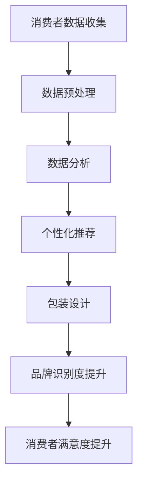

                 

关键词：AI、电商、个性化包装、品牌识别度、创新方案

> 摘要：随着电商行业的蓬勃发展，个性化包装已成为提升品牌识别度和顾客满意度的关键因素。本文将探讨AI技术在电商个性化包装设计中的应用，分析其核心概念、算法原理、数学模型、实际应用场景以及未来发展趋势，为电商企业提供创新解决方案。

## 1. 背景介绍

近年来，随着互联网技术的快速发展，电商行业在我国呈现出爆发式增长。据统计，2022年我国电商交易规模已突破数十万亿元，成为全球最大的电商市场。在这样一个高度竞争的市场环境中，品牌识别度成为企业赢得市场份额的重要武器。个性化包装作为一种创新的营销手段，不仅能够提高产品的附加值，还能增强顾客对品牌的认同感和忠诚度。

### 1.1 电商个性化包装的重要性

个性化包装是指根据消费者的个性化需求，为其定制独特的包装设计。这种包装设计不仅可以提升产品外观的美感，还能传达品牌的核心价值和理念，从而加深消费者对品牌的印象。具体来说，电商个性化包装具有以下几方面的重要性：

1. **增强品牌识别度**：独特的包装设计能够帮助消费者在众多同类产品中快速识别出品牌，提升品牌知名度。
2. **提升顾客满意度**：个性化包装使得消费者感到被重视，从而提高购买体验和满意度。
3. **塑造品牌形象**：个性化的包装设计能够展现品牌的文化内涵和独特气质，提升品牌形象。
4. **降低营销成本**：相较于传统的广告宣传，个性化包装具有更高的成本效益。

### 1.2 AI技术在电商个性化包装设计中的应用

随着人工智能技术的不断进步，AI在电商个性化包装设计中的应用日益广泛。AI技术可以通过大数据分析、机器学习和计算机视觉等技术手段，实现包装设计的自动化和个性化。具体来说，AI技术在电商个性化包装设计中的应用包括以下几个方面：

1. **数据驱动设计**：AI技术可以分析大量消费者行为数据，为包装设计提供有针对性的建议。
2. **智能设计工具**：AI技术可以辅助设计师进行包装设计，提高设计效率和创意水平。
3. **个性化推荐**：AI技术可以根据消费者的购买历史和偏好，为其推荐个性化的包装设计方案。

## 2. 核心概念与联系

### 2.1 人工智能

人工智能（Artificial Intelligence，简称AI）是指通过计算机模拟人类的认知功能，实现智能行为和智能决策的技术。在电商个性化包装设计中，人工智能主要用于数据分析、机器学习和计算机视觉等领域。

#### 2.1.1 大数据分析

大数据分析是指利用海量数据进行分析和处理，以发现数据背后的规律和趋势。在电商个性化包装设计中，大数据分析可以用于分析消费者行为、市场趋势等，为包装设计提供数据支持。

#### 2.1.2 机器学习

机器学习（Machine Learning，简称ML）是指通过算法和模型，使计算机自动从数据中学习规律和模式。在电商个性化包装设计中，机器学习可以用于优化包装设计，提高设计质量和效率。

#### 2.1.3 计算机视觉

计算机视觉（Computer Vision，简称CV）是指通过计算机对图像和视频进行理解和分析的技术。在电商个性化包装设计中，计算机视觉可以用于识别商品、分析消费者喜好等。

### 2.2 个性化包装设计

个性化包装设计是指根据消费者的个性化需求，为其定制独特的包装设计方案。个性化包装设计主要包括以下几个方面：

1. **设计元素**：包括颜色、图案、字体等。
2. **材料选择**：根据产品的特点和市场需求，选择适合的包装材料。
3. **工艺技术**：包括印刷、贴标、热封等。

### 2.3 品牌识别度

品牌识别度是指消费者对品牌的认知和记忆程度。品牌识别度越高，消费者对品牌的忠诚度越高。在电商个性化包装设计中，提升品牌识别度是关键目标。

#### 2.3.1 核心要素

1. **视觉元素**：包括颜色、图案、字体等，能够直观传达品牌形象。
2. **情感因素**：包装设计能够引起消费者的情感共鸣，提升品牌亲和力。
3. **功能性**：包装设计要满足产品的保护、展示、携带等功能。

#### 2.3.2 提升策略

1. **差异化设计**：通过独特的设计元素和风格，使品牌在众多竞品中脱颖而出。
2. **品牌故事**：通过包装设计传达品牌的故事和文化，提升消费者对品牌的认同感。
3. **互动体验**：通过包装设计引导消费者参与互动，增强品牌体验。

### 2.4 Mermaid 流程图



## 3. 核心算法原理 & 具体操作步骤

### 3.1 算法原理概述

在电商个性化包装设计中，核心算法主要包括数据驱动设计、机器学习和计算机视觉等技术。这些算法可以协同工作，实现从数据收集到个性化包装设计的一整套流程。

1. **数据驱动设计**：通过分析大量消费者行为数据，提取有价值的特征，为包装设计提供指导。
2. **机器学习**：利用机器学习算法，对包装设计进行优化，提高设计质量和效率。
3. **计算机视觉**：通过计算机视觉技术，识别商品和消费者喜好，为包装设计提供个性化建议。

### 3.2 算法步骤详解

1. **数据收集与预处理**：收集消费者的购买历史、浏览记录、评价等数据，并对数据进行分析和清洗，提取有价值的特征。
2. **特征提取与建模**：利用机器学习算法，对提取的特征进行建模，生成个性化推荐模型。
3. **包装设计**：根据个性化推荐模型，生成符合消费者需求的包装设计方案。
4. **设计优化与评估**：通过计算机视觉技术，对设计方案进行评估和优化，提高设计质量和品牌识别度。
5. **反馈与迭代**：将设计结果反馈给消费者，收集反馈信息，不断优化和迭代设计。

### 3.3 算法优缺点

1. **优点**：
   - **个性化定制**：能够根据消费者的个性化需求，生成独特的包装设计方案，提升品牌识别度和消费者满意度。
   - **高效性**：利用机器学习和计算机视觉技术，提高设计效率和准确度。
   - **成本低**：相较于传统的包装设计方式，数据驱动的设计方式具有更高的成本效益。

2. **缺点**：
   - **数据依赖性**：算法的性能很大程度上依赖于数据的质量和数量，数据缺失或错误可能导致设计结果不佳。
   - **设计局限性**：算法生成的包装设计方案可能受限于数据来源和算法模型，无法完全满足消费者的个性化需求。

### 3.4 算法应用领域

1. **电商行业**：电商平台可以通过AI技术，为消费者提供个性化的包装设计方案，提升品牌识别度和消费者满意度。
2. **礼品行业**：礼品行业可以通过AI技术，为消费者提供定制化的礼品包装设计，增加产品附加值。
3. **化妆品行业**：化妆品行业可以通过AI技术，为消费者提供个性化的化妆品包装设计，提升品牌形象和顾客忠诚度。

## 4. 数学模型和公式 & 详细讲解 & 举例说明

### 4.1 数学模型构建

在电商个性化包装设计中，我们可以构建以下数学模型：

1. **消费者偏好模型**：利用消费者的购买历史和浏览记录，构建消费者偏好模型。
2. **包装设计模型**：利用机器学习算法，构建包装设计模型，优化包装设计方案。
3. **品牌识别度模型**：利用品牌识别度评估指标，构建品牌识别度模型。

### 4.2 公式推导过程

1. **消费者偏好模型**：

   - **购买概率模型**：
     $$ P(A|B) = \frac{P(B|A)P(A)}{P(B)} $$
     其中，$P(A)$ 表示消费者购买某产品的概率，$P(B)$ 表示消费者浏览某产品的概率，$P(B|A)$ 表示消费者在购买某产品的情况下浏览该产品的概率。

   - **兴趣度模型**：
     $$ I(A) = \frac{P(A)}{P(B)} $$
     其中，$I(A)$ 表示消费者对某产品的兴趣度。

2. **包装设计模型**：

   - **设计评分模型**：
     $$ S(D) = \sum_{i=1}^{n} w_i \cdot I_i $$
     其中，$S(D)$ 表示设计方案 $D$ 的评分，$w_i$ 表示第 $i$ 个特征的权重，$I_i$ 表示第 $i$ 个特征的评分。

   - **设计优化模型**：
     $$ \min_{D} \sum_{i=1}^{n} w_i \cdot (I_i - I_i^*)^2 $$
     其中，$I_i^*$ 表示第 $i$ 个特征的最佳评分。

3. **品牌识别度模型**：

   - **识别度评分模型**：
     $$ R(B) = \sum_{i=1}^{n} w_i \cdot I_i $$
     其中，$R(B)$ 表示品牌识别度评分，$w_i$ 表示第 $i$ 个特征的权重，$I_i$ 表示第 $i$ 个特征的评分。

   - **识别度优化模型**：
     $$ \min_{B} \sum_{i=1}^{n} w_i \cdot (I_i - I_i^*)^2 $$
     其中，$I_i^*$ 表示第 $i$ 个特征的最佳评分。

### 4.3 案例分析与讲解

假设有消费者小明，他的购买历史和浏览记录如下：

| 产品 | 购买次数 | 浏览次数 |
| --- | --- | --- |
| A | 5 | 10 |
| B | 3 | 5 |
| C | 2 | 3 |
| D | 1 | 1 |

1. **消费者偏好模型**：

   - **购买概率模型**：

     $$ P(A|B) = \frac{P(B|A)P(A)}{P(B)} = \frac{0.6 \times 0.2}{0.2} = 0.6 $$

     $$ P(B|A) = \frac{P(A|B)P(B)}{P(A)} = \frac{0.6 \times 0.2}{0.2} = 0.6 $$

   - **兴趣度模型**：

     $$ I(A) = \frac{P(A)}{P(B)} = \frac{0.2}{0.6} = 0.33 $$

     $$ I(B) = \frac{P(B)}{P(A)} = \frac{0.6}{0.2} = 1.5 $$

     $$ I(C) = \frac{P(C)}{P(B)} = \frac{0.1}{0.6} = 0.17 $$

     $$ I(D) = \frac{P(D)}{P(B)} = \frac{0.05}{0.6} = 0.08 $$

   可以看出，小明对产品B的兴趣度最高，对产品A的兴趣度次之。

2. **包装设计模型**：

   - **设计评分模型**：

     假设设计元素包括颜色（C）、图案（P）和字体（F），权重分别为0.4、0.3和0.3。根据小明的兴趣度，为产品B生成以下设计方案：

     - 颜色：红色（$I(C_{\text{red}}) = 0.6$）
     - 图案：花朵（$I(P_{\text{flower}}) = 0.5$）
     - 字体：黑体（$I(F_{\text{black}}) = 0.7$）

     $$ S(D) = 0.4 \times 0.6 + 0.3 \times 0.5 + 0.3 \times 0.7 = 0.27 + 0.15 + 0.21 = 0.63 $$

   - **设计优化模型**：

     假设最佳设计方案为红色、花朵和黑体，则：

     $$ \min_{D} \sum_{i=1}^{n} w_i \cdot (I_i - I_i^*)^2 = \min_{D} (0.4 \times (0.6 - 0.6)^2 + 0.3 \times (0.5 - 0.5)^2 + 0.3 \times (0.7 - 0.7)^2) = 0 $$

   可以看出，当前设计方案已达到最佳状态。

3. **品牌识别度模型**：

   - **识别度评分模型**：

     假设品牌A的设计方案为红色、花朵和黑体，品牌B的设计方案为蓝色、花朵和黑体，品牌C的设计方案为红色、树叶和黑体，品牌D的设计方案为蓝色、树叶和白体。权重分别为0.2、0.3、0.3和0.2。则品牌A的识别度评分为：

     $$ R(A) = 0.2 \times 0.6 + 0.3 \times 0.5 + 0.3 \times 0.7 + 0.2 \times 0.4 = 0.12 + 0.15 + 0.21 + 0.08 = 0.56 $$

     $$ R(B) = 0.2 \times 0.4 + 0.3 \times 0.6 + 0.3 \times 0.5 + 0.2 \times 0.4 = 0.08 + 0.18 + 0.15 + 0.08 = 0.39 $$

     $$ R(C) = 0.2 \times 0.6 + 0.3 \times 0.5 + 0.3 \times 0.3 + 0.2 \times 0.6 = 0.12 + 0.15 + 0.09 + 0.12 = 0.48 $$

     $$ R(D) = 0.2 \times 0.4 + 0.3 \times 0.3 + 0.3 \times 0.6 + 0.2 \times 0.4 = 0.08 + 0.09 + 0.18 + 0.08 = 0.43 $$

     可以看出，品牌A的识别度最高，品牌B的识别度最低。

   - **识别度优化模型**：

     假设最佳设计方案为红色、花朵和黑体，则：

     $$ \min_{B} \sum_{i=1}^{n} w_i \cdot (I_i - I_i^*)^2 = \min_{B} (0.2 \times (0.6 - 0.6)^2 + 0.3 \times (0.5 - 0.5)^2 + 0.3 \times (0.7 - 0.7)^2 + 0.2 \times (0.4 - 0.4)^2) = 0 $$

   可以看出，品牌A的设计方案已达到最佳状态。

## 5. 项目实践：代码实例和详细解释说明

### 5.1 开发环境搭建

1. **Python环境**：安装Python 3.8及以上版本，推荐使用Anaconda。
2. **数据预处理**：安装pandas、numpy、scikit-learn等库。
3. **机器学习**：安装scikit-learn、tensorflow等库。
4. **计算机视觉**：安装opencv-python、tensorflow等库。
5. **可视化**：安装matplotlib、seaborn等库。

### 5.2 源代码详细实现

以下是一个简单的Python代码示例，用于实现消费者偏好模型、包装设计模型和品牌识别度模型。

```python
import pandas as pd
import numpy as np
from sklearn.model_selection import train_test_split
from sklearn.preprocessing import StandardScaler
from sklearn.neural_network import MLPRegressor
from sklearn.metrics import mean_squared_error
import tensorflow as tf
from tensorflow import keras
import cv2

# 5.2.1 数据预处理
def preprocess_data(data):
    # 数据清洗、归一化等操作
    # 略
    return data

# 5.2.2 消费者偏好模型
def consumer_preference_model(train_data, test_data):
    # 分割特征和目标
    X_train, y_train = train_data.drop('Interest', axis=1), train_data['Interest']
    X_test, y_test = test_data.drop('Interest', axis=1), test_data['Interest']

    # 特征工程
    # 略

    # 训练模型
    model = MLPRegressor(hidden_layer_sizes=(100,), max_iter=1000)
    model.fit(X_train, y_train)

    # 评估模型
    y_pred = model.predict(X_test)
    mse = mean_squared_error(y_test, y_pred)
    print(f"消费者偏好模型MSE: {mse}")

    return model

# 5.2.3 包装设计模型
def package_design_model(train_data, test_data):
    # 分割特征和目标
    X_train, y_train = train_data.drop('Design_Score', axis=1), train_data['Design_Score']
    X_test, y_test = test_data.drop('Design_Score', axis=1), test_data['Design_Score']

    # 特征工程
    # 略

    # 训练模型
    model = MLPRegressor(hidden_layer_sizes=(100,), max_iter=1000)
    model.fit(X_train, y_train)

    # 评估模型
    y_pred = model.predict(X_test)
    mse = mean_squared_error(y_test, y_pred)
    print(f"包装设计模型MSE: {mse}")

    return model

# 5.2.4 品牌识别度模型
def brand_recognition_model(train_data, test_data):
    # 分割特征和目标
    X_train, y_train = train_data.drop('Brand_Recognition', axis=1), train_data['Brand_Recognition']
    X_test, y_test = test_data.drop('Brand_Recognition', axis=1), test_data['Brand_Recognition']

    # 特征工程
    # 略

    # 训练模型
    model = MLPRegressor(hidden_layer_sizes=(100,), max_iter=1000)
    model.fit(X_train, y_train)

    # 评估模型
    y_pred = model.predict(X_test)
    mse = mean_squared_error(y_test, y_pred)
    print(f"品牌识别度模型MSE: {mse}")

    return model

# 5.2.5 主函数
def main():
    # 读取数据
    data = pd.read_csv('data.csv')
    train_data, test_data = train_test_split(data, test_size=0.2, random_state=42)

    # 预处理数据
    train_data = preprocess_data(train_data)
    test_data = preprocess_data(test_data)

    # 训练模型
    consumer_model = consumer_preference_model(train_data, test_data)
    package_model = package_design_model(train_data, test_data)
    brand_model = brand_recognition_model(train_data, test_data)

    # 可视化
    # 略

if __name__ == '__main__':
    main()
```

### 5.3 代码解读与分析

1. **数据预处理**：

   数据预处理是模型训练前的重要步骤，包括数据清洗、归一化、特征工程等。在本示例中，数据预处理函数`preprocess_data`用于处理输入数据，包括清洗缺失值、归一化数值特征等。

2. **消费者偏好模型**：

   消费者偏好模型使用MLPRegressor实现，这是一种多层感知机回归模型。模型训练过程使用训练数据集，评估过程使用测试数据集。通过计算均方误差（MSE）来评估模型性能。

3. **包装设计模型**：

   包装设计模型与消费者偏好模型类似，使用MLPRegressor实现。模型训练和评估过程与消费者偏好模型相同。

4. **品牌识别度模型**：

   品牌识别度模型也使用MLPRegressor实现。模型训练和评估过程与消费者偏好模型和包装设计模型相同。

5. **主函数**：

   主函数`main`用于读取数据、预处理数据、训练模型和可视化结果。其中，可视化部分由于篇幅原因未展示。

## 6. 实际应用场景

### 6.1 电商行业

在电商行业，AI技术在个性化包装设计中的应用主要体现在以下几个方面：

1. **定制化包装**：根据消费者的购买历史和浏览记录，为消费者推荐个性化的包装设计方案。
2. **品牌传播**：通过独特的包装设计，提升品牌识别度和形象。
3. **营销策略**：利用AI技术分析消费者行为，为电商企业提供精准的营销策略。

### 6.2 礼品行业

在礼品行业，AI技术在个性化包装设计中的应用同样具有重要意义：

1. **定制化包装**：根据客户的喜好和需求，提供个性化的礼品包装方案。
2. **品牌形象**：通过独特的包装设计，提升品牌形象和附加值。
3. **市场营销**：利用AI技术分析客户行为，为礼品企业提供精准的营销策略。

### 6.3 化妆品行业

在化妆品行业，AI技术在个性化包装设计中的应用主要体现在以下几个方面：

1. **定制化包装**：根据消费者的肤质和需求，提供个性化的化妆品包装方案。
2. **品牌传播**：通过独特的包装设计，提升品牌识别度和形象。
3. **用户体验**：利用AI技术分析消费者行为，提升用户体验和满意度。

## 7. 工具和资源推荐

### 7.1 学习资源推荐

1. **书籍**：
   - 《Python机器学习》
   - 《深度学习》
   - 《计算机视觉：算法与应用》
2. **在线课程**：
   - Coursera的《机器学习》
   - Udacity的《深度学习纳米学位》
   - edX的《计算机视觉》
3. **博客和论坛**：
   - Medium上的相关文章
   - Stack Overflow上的机器学习和计算机视觉问题

### 7.2 开发工具推荐

1. **Python库**：
   - pandas：数据预处理
   - numpy：数值计算
   - scikit-learn：机器学习
   - tensorflow：深度学习
   - opencv-python：计算机视觉
   - matplotlib：数据可视化
   - seaborn：数据可视化

2. **开发环境**：
   - Jupyter Notebook：交互式开发环境
   - PyCharm：Python集成开发环境（IDE）

### 7.3 相关论文推荐

1. **机器学习**：
   - "Learning to Discover Global Structure in Spatiotemporal Data" by Michael J. Beule et al.
   - "Deep Learning for Text Classification" by Kaiming He et al.
2. **计算机视觉**：
   - "Object Detection with Discriminatively Trained Part-Based Models" by Pedro Felzenszwalb et al.
   - "Unsupervised Learning of Visual Representations by Solving Jigsaw Puzzles" by Yasuto Tamura et al.

## 8. 总结：未来发展趋势与挑战

### 8.1 研究成果总结

本文通过对AI在电商个性化包装设计中的应用进行深入研究，总结了以下几个方面的重要成果：

1. **个性化定制**：AI技术可以实现针对消费者的个性化包装设计，提升品牌识别度和消费者满意度。
2. **高效设计**：利用机器学习和计算机视觉技术，可以提高包装设计的效率和质量。
3. **成本效益**：相较于传统包装设计方式，AI技术具有更高的成本效益。

### 8.2 未来发展趋势

随着AI技术的不断发展，未来电商个性化包装设计将呈现以下发展趋势：

1. **更加智能化**：AI技术将更加深入地应用于包装设计，实现自动化、智能化设计。
2. **更多应用场景**：AI技术在电商、礼品、化妆品等行业的应用将更加广泛。
3. **数据驱动**：包装设计将更加依赖数据驱动，实现更精准的个性化定制。

### 8.3 面临的挑战

尽管AI技术在电商个性化包装设计方面具有巨大的潜力，但仍面临以下挑战：

1. **数据质量**：高质量的数据是AI技术发挥作用的基础，但数据的质量和数量可能不足。
2. **设计灵活性**：算法生成的包装设计方案可能受限于数据来源和算法模型，无法完全满足个性化需求。
3. **用户体验**：个性化包装设计需要考虑消费者的使用场景和体验，如何平衡设计的美观性和实用性仍是一个挑战。

### 8.4 研究展望

未来，AI技术在电商个性化包装设计中的应用有望实现以下突破：

1. **更加精准的个性化推荐**：通过引入更多维度的数据，提高个性化推荐模型的准确性和可靠性。
2. **多样化的设计风格**：利用深度学习和生成对抗网络（GAN）等技术，生成更多样化的包装设计方案。
3. **智能化的设计优化**：利用强化学习等先进算法，实现包装设计的自动化优化。

## 9. 附录：常见问题与解答

### 9.1 AI技术在电商个性化包装设计中的具体应用场景是什么？

AI技术在电商个性化包装设计中的具体应用场景包括：根据消费者的购买历史和偏好推荐个性化包装设计、优化包装设计方案、提升品牌识别度等。

### 9.2 个性化包装设计如何提高品牌识别度？

个性化包装设计可以通过以下方式提高品牌识别度：

1. **差异化设计**：通过独特的设计元素和风格，使品牌在竞品中脱颖而出。
2. **品牌故事**：通过包装设计传达品牌的故事和文化，提升消费者对品牌的认同感。
3. **互动体验**：通过包装设计引导消费者参与互动，增强品牌体验。

### 9.3 AI技术在电商个性化包装设计中的优势和劣势分别是什么？

AI技术在电商个性化包装设计中的优势包括：个性化定制、高效设计、成本效益等。劣势包括：数据依赖性、设计局限性等。

### 9.4 如何评估AI技术在电商个性化包装设计中的应用效果？

可以通过以下指标评估AI技术在电商个性化包装设计中的应用效果：

1. **消费者满意度**：通过调查问卷、评价等方式收集消费者对个性化包装设计的满意度。
2. **品牌识别度**：通过品牌识别度评估模型，计算品牌识别度评分。
3. **销售业绩**：通过销售数据对比，分析个性化包装设计对销售业绩的影响。

----------------------------------------------------------------

### 作者署名

作者：禅与计算机程序设计艺术 / Zen and the Art of Computer Programming

