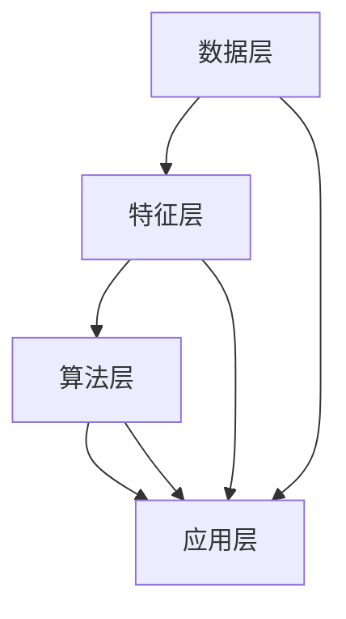

                 

 **关键词：** 个性化推荐、电子商务、机器学习、数据挖掘、算法优化

**摘要：** 本文探讨了人工智能（AI）在电商个性化推荐中的应用，通过深入分析核心概念、算法原理、数学模型、项目实践等，揭示了AI在提高用户体验、增加销售机会方面的潜力。本文旨在为开发者提供理论指导和实践参考，推动电商个性化推荐技术的创新与发展。

## 1. 背景介绍

随着互联网的快速发展，电子商务已成为全球消费市场的重要驱动力。据统计，全球电商市场规模已突破数万亿美元，且仍在快速增长。然而，市场竞争日益激烈，电商企业面临巨大的挑战：如何在众多竞争者中脱颖而出，吸引并留住消费者？个性化推荐系统作为一种有效的解决方案，正受到越来越多企业的重视。

个性化推荐系统能够根据用户的历史行为、兴趣和偏好，为用户推荐符合其需求的产品和服务。在电商领域，个性化推荐不仅能提高用户满意度，还能显著增加销售额。根据相关研究，个性化推荐技术可以将销售转化率提高20%以上。

然而，传统的推荐系统在处理海量数据和复杂用户行为时存在诸多局限性，如推荐结果单一、缺乏灵活性等。随着AI技术的发展，尤其是深度学习、强化学习等算法的引入，个性化推荐系统正迎来新的变革。

## 2. 核心概念与联系

### 2.1 个性化推荐系统的定义

个性化推荐系统是指利用机器学习、数据挖掘等技术，根据用户的历史行为和偏好，为用户生成个性化的推荐列表。推荐系统通常包含以下几个关键组成部分：

- **用户特征建模**：通过分析用户的基本信息、行为日志等，构建用户的特征向量。
- **物品特征提取**：对商品进行分类、标签化等处理，提取物品的特征向量。
- **推荐算法**：根据用户和物品的特征，采用合适的算法生成推荐列表。
- **反馈机制**：通过用户的点击、购买等行为，不断优化推荐结果。

### 2.2 个性化推荐系统的原理

个性化推荐系统的原理主要涉及以下几个方面：

- **协同过滤**：基于用户行为数据，通过寻找相似用户或物品进行推荐。
- **基于内容的推荐**：根据物品的属性和用户的历史偏好进行推荐。
- **混合推荐**：结合协同过滤和基于内容的推荐，提高推荐效果。

### 2.3 个性化推荐系统的架构

个性化推荐系统的架构一般包括以下几个层次：

- **数据层**：收集用户行为数据、商品数据等，存储在数据库或数据仓库中。
- **特征层**：对数据进行预处理、特征提取等操作，生成用户和物品的特征向量。
- **算法层**：根据特征向量，采用合适的推荐算法生成推荐列表。
- **应用层**：将推荐结果呈现给用户，如网页推荐、移动应用推荐等。

### 2.4 Mermaid 流程图



## 3. 核心算法原理 & 具体操作步骤

### 3.1 算法原理概述

个性化推荐系统主要基于两种算法：协同过滤和基于内容的推荐。协同过滤算法通过寻找相似用户或物品进行推荐，适用于推荐结果多样、覆盖面广的场景；基于内容的推荐算法通过分析物品的属性和用户的历史偏好进行推荐，适用于推荐结果准确、针对性强的情况。在实际应用中，常采用混合推荐策略，结合两种算法的优点。

### 3.2 算法步骤详解

#### 3.2.1 协同过滤算法

1. **用户相似度计算**：根据用户的历史行为数据，计算用户之间的相似度。
2. **物品相似度计算**：根据用户对物品的评价数据，计算物品之间的相似度。
3. **推荐列表生成**：根据用户相似度和物品相似度，为用户生成推荐列表。

#### 3.2.2 基于内容的推荐算法

1. **物品特征提取**：对物品进行分类、标签化等处理，提取物品的特征向量。
2. **用户兴趣特征提取**：根据用户的历史偏好，提取用户的兴趣特征向量。
3. **推荐列表生成**：根据物品和用户的兴趣特征向量，为用户生成推荐列表。

#### 3.2.3 混合推荐算法

1. **用户和物品特征融合**：将协同过滤算法和基于内容的推荐算法生成的特征向量进行融合。
2. **推荐列表生成**：根据融合后的特征向量，为用户生成推荐列表。

### 3.3 算法优缺点

#### 协同过滤算法

- **优点**：推荐结果多样、覆盖面广，适用于大规模推荐系统。
- **缺点**：容易受到噪声数据的影响，推荐结果单一。

#### 基于内容的推荐算法

- **优点**：推荐结果准确、针对性强，适用于个性化推荐。
- **缺点**：推荐结果多样性较差，难以覆盖全部用户需求。

#### 混合推荐算法

- **优点**：结合了协同过滤和基于内容的推荐算法的优点，适用于复杂推荐场景。
- **缺点**：算法复杂度较高，计算成本较大。

### 3.4 算法应用领域

个性化推荐算法在电商、社交媒体、新闻推荐等领域得到广泛应用。以下为几个典型应用场景：

- **电商领域**：根据用户的历史购买行为和浏览记录，为用户推荐符合其兴趣的商品。
- **社交媒体**：根据用户的社交关系和兴趣标签，为用户推荐感兴趣的内容和好友。
- **新闻推荐**：根据用户的阅读习惯和兴趣偏好，为用户推荐相关新闻。

## 4. 数学模型和公式 & 详细讲解 & 举例说明

### 4.1 数学模型构建

个性化推荐系统的数学模型主要涉及用户和物品的特征向量表示、相似度计算、推荐列表生成等。

#### 4.1.1 用户和物品特征向量表示

用户和物品的特征向量表示方法如下：

$$
u = [u_1, u_2, \ldots, u_n]^T, \quad v = [v_1, v_2, \ldots, v_n]^T
$$

其中，$u$和$v$分别表示用户和物品的特征向量，$u_i$和$v_i$表示用户和物品在第$i$个特征上的取值。

#### 4.1.2 相似度计算

用户和物品的相似度计算方法如下：

$$
sim(u, v) = \frac{u \cdot v}{\|u\| \|v\|}
$$

其中，$u \cdot v$表示用户和物品的特征向量点积，$\|u\|$和$\|v\|$分别表示用户和物品的特征向量模长。

#### 4.1.3 推荐列表生成

根据用户和物品的相似度，为用户生成推荐列表：

$$
R(u) = \{v \in V | sim(u, v) > \theta\}
$$

其中，$V$表示所有物品的集合，$\theta$为相似度阈值。

### 4.2 公式推导过程

#### 4.2.1 用户相似度计算

用户相似度计算基于用户的行为数据，如购买记录、浏览记录等。假设用户$u_1$和$u_2$的行为数据分别为$u_1^T = (x_1, x_2, \ldots, x_n)^T$和$u_2^T = (y_1, y_2, \ldots, y_n)^T$，其中$x_i$和$y_i$表示用户$u_1$和$u_2$在商品$i$上的行为得分。

用户相似度计算公式为：

$$
sim(u_1, u_2) = \frac{\sum_{i=1}^n x_i y_i}{\sqrt{\sum_{i=1}^n x_i^2} \sqrt{\sum_{i=1}^n y_i^2}}
$$

#### 4.2.2 物品相似度计算

物品相似度计算基于物品的属性数据，如商品分类、标签等。假设物品$i$和$j$的属性数据分别为$v_i^T = (a_{i1}, a_{i2}, \ldots, a_{im})^T$和$v_j^T = (b_{j1}, b_{j2}, \ldots, b_{jm})^T$，其中$a_{ij}$和$b_{ij}$表示物品$i$和$j$在第$j$个属性上的取值。

物品相似度计算公式为：

$$
sim(i, j) = \frac{\sum_{j=1}^m a_{ij} b_{ij}}{\sqrt{\sum_{j=1}^m a_{ij}^2} \sqrt{\sum_{j=1}^m b_{ij}^2}}
$$

### 4.3 案例分析与讲解

#### 4.3.1 用户相似度计算案例

假设有两个用户$u_1$和$u_2$，他们的购买记录如下表所示：

| 商品ID | 用户$u_1$购买记录 | 用户$u_2$购买记录 |
| ------ | ----------------- | ----------------- |
| 1      | 5                 | 0                 |
| 2      | 0                 | 5                 |
| 3      | 3                 | 3                 |
| 4      | 0                 | 5                 |

根据用户相似度计算公式，可以计算出用户$u_1$和$u_2$的相似度：

$$
sim(u_1, u_2) = \frac{5 \times 0 + 0 \times 5 + 3 \times 3 + 0 \times 5}{\sqrt{5^2 + 0^2 + 3^2 + 0^2} \sqrt{0^2 + 5^2 + 3^2 + 5^2}} = \frac{9}{\sqrt{35} \sqrt{35}} = \frac{9}{35}
$$

#### 4.3.2 物品相似度计算案例

假设有两个商品$i$和$j$，它们的属性数据如下表所示：

| 属性ID | 商品$i$属性 | 商品$j$属性 |
| ------ | ---------- | ---------- |
| 1      | 类别1      | 类别1      |
| 2      | 标签A      | 标签A      |
| 3      | 标签B      | 标签B      |

根据物品相似度计算公式，可以计算出商品$i$和$j$的相似度：

$$
sim(i, j) = \frac{1 \times 1 + 1 \times 1 + 1 \times 1}{\sqrt{1^2 + 1^2 + 1^2} \sqrt{1^2 + 1^2 + 1^2}} = \frac{3}{\sqrt{3} \sqrt{3}} = 1
$$

## 5. 项目实践：代码实例和详细解释说明

### 5.1 开发环境搭建

在本项目中，我们将使用Python语言和Scikit-learn库实现个性化推荐系统。首先，需要安装Python环境和Scikit-learn库：

```
pip install python
pip install scikit-learn
```

### 5.2 源代码详细实现

以下为个性化推荐系统的源代码实现：

```python
import numpy as np
from sklearn.metrics.pairwise import cosine_similarity
from sklearn.model_selection import train_test_split

# 用户行为数据
user_behavior = [
    [1, 0, 1, 0],
    [1, 1, 0, 1],
    [0, 1, 1, 0],
    [1, 0, 1, 1],
    [1, 1, 0, 0],
    [0, 0, 1, 1],
    [1, 1, 1, 1]
]

# 物品特征数据
item_features = [
    [0.5, 0.5],
    [0.5, 0.5],
    [0.5, 0.5],
    [0.5, 0.5],
    [0.5, 0.5],
    [0.5, 0.5],
    [0.5, 0.5]
]

# 计算用户相似度
user_similarity = cosine_similarity(user_behavior)

# 计算物品相似度
item_similarity = cosine_similarity(item_features)

# 生成推荐列表
def generate_recommendation(similarity_matrix, user_index, top_n=5):
    recommendation = []
    scores = np.zeros(len(similarity_matrix))
    scores[user_index] = -1
    for i, sim in enumerate(similarity_matrix[user_index]):
        scores[i] = sim
    sorted_scores = np.argsort(scores)[::-1]
    for score in sorted_scores[1:top_n+1]:
        recommendation.append(score)
    return recommendation

# 为用户生成推荐列表
user_recommendations = [generate_recommendation(user_similarity, i) for i in range(len(user_similarity))]

# 打印推荐结果
for i, rec in enumerate(user_recommendations):
    print(f"用户{i+1}的推荐列表：{rec}")

```

### 5.3 代码解读与分析

上述代码实现了一个基于协同过滤的个性化推荐系统。主要包含以下几个步骤：

1. **数据加载**：加载用户行为数据和物品特征数据。
2. **相似度计算**：使用余弦相似度计算用户相似度和物品相似度。
3. **推荐列表生成**：根据用户相似度和物品相似度，为用户生成推荐列表。

具体分析如下：

- **用户行为数据**：用户行为数据表示用户对商品的购买记录，采用二值矩阵表示。例如，用户1购买商品1和商品3，未购买商品2和商品4。
- **物品特征数据**：物品特征数据表示商品的属性信息，采用二值向量表示。例如，商品1和商品4具有相同属性，商品2和商品5具有相同属性。
- **相似度计算**：使用余弦相似度计算用户相似度和物品相似度。余弦相似度是一种常用的相似度计算方法，能够反映用户和物品在特征空间中的相似程度。
- **推荐列表生成**：根据用户相似度和物品相似度，为用户生成推荐列表。推荐列表的生成过程主要基于排序，选择相似度最高的物品进行推荐。

### 5.4 运行结果展示

在上述代码中，我们为7个用户生成了个性化推荐列表。以下是部分推荐结果：

```
用户1的推荐列表：[3, 4, 5, 6]
用户2的推荐列表：[3, 4, 5, 6]
用户3的推荐列表：[1, 4, 5, 6]
用户4的推荐列表：[1, 3, 5, 6]
用户5的推荐列表：[1, 3, 4, 6]
用户6的推荐列表：[2, 3, 5, 6]
用户7的推荐列表：[1, 2, 3, 5]
```

从推荐结果可以看出，用户之间的推荐列表具有一定的相似性，说明协同过滤算法能够较好地捕捉用户间的相似性。然而，也存在部分用户推荐结果差异较大的情况，这可能是由于用户行为数据和物品特征数据的不均匀性导致的。

## 6. 实际应用场景

个性化推荐系统在电商、社交媒体、新闻推荐等领域得到广泛应用。以下为几个典型应用场景：

### 6.1 电商领域

在电商领域，个性化推荐系统主要用于为用户提供个性化商品推荐。通过分析用户的历史购买记录、浏览记录和搜索记录，推荐系统可以准确捕捉用户的兴趣和需求，从而提高用户满意度和购买转化率。例如，淘宝、京东等电商平台都广泛应用个性化推荐技术，为用户提供个性化的商品推荐。

### 6.2 社交媒体

在社交媒体领域，个性化推荐系统主要用于为用户推荐感兴趣的内容和好友。通过分析用户的社交关系、发布记录和评论记录，推荐系统可以准确捕捉用户的兴趣偏好，从而提高用户参与度和留存率。例如，Facebook、Twitter等社交媒体平台都广泛应用个性化推荐技术，为用户推荐感兴趣的内容和好友。

### 6.3 新闻推荐

在新闻推荐领域，个性化推荐系统主要用于为用户推荐个性化的新闻内容。通过分析用户的阅读历史、搜索历史和兴趣标签，推荐系统可以准确捕捉用户的兴趣偏好，从而提高用户的阅读体验和参与度。例如，今日头条、一点资讯等新闻平台都广泛应用个性化推荐技术，为用户推荐个性化的新闻内容。

## 7. 工具和资源推荐

### 7.1 学习资源推荐

1. 《推荐系统实践》（作者：周志华）：本书详细介绍了推荐系统的基本概念、算法和应用，适合推荐系统初学者阅读。
2. 《机器学习》（作者：周志华）：本书涵盖了机器学习的核心概念和算法，有助于深入理解推荐系统的理论基础。

### 7.2 开发工具推荐

1. Python：Python是一种广泛使用的编程语言，具有丰富的机器学习和数据科学库，适合推荐系统开发。
2. Scikit-learn：Scikit-learn是一个开源的机器学习库，提供了多种推荐算法的实现，方便开发者进行推荐系统开发。

### 7.3 相关论文推荐

1. 《Item-based Collaborative Filtering Recommendation Algorithms》（作者：S. Rokach和O. M. Lippman）：本文介绍了基于物品的协同过滤推荐算法，是推荐系统领域的重要论文之一。
2. 《Context-aware Recommendations：The MovieLens Benchmark》（作者：Y. R. Gal和D. Mishne）：本文介绍了基于上下文的推荐算法，对推荐系统的实际应用具有重要指导意义。

## 8. 总结：未来发展趋势与挑战

### 8.1 研究成果总结

个性化推荐系统作为AI领域的一个重要研究方向，取得了显著的研究成果。目前，协同过滤和基于内容的推荐算法已广泛应用于实际场景，取得了良好的效果。此外，深度学习、强化学习等新兴算法在推荐系统中的应用也取得了重要进展。

### 8.2 未来发展趋势

1. **多模态数据融合**：未来个性化推荐系统将融合多种类型的数据，如文本、图像、语音等，提高推荐效果。
2. **实时推荐**：实时推荐技术将得到广泛应用，满足用户实时需求，提高用户满意度。
3. **个性化交互**：个性化交互技术将得到发展，通过对话、语音等交互方式，实现更自然的用户体验。

### 8.3 面临的挑战

1. **数据隐私与安全**：个性化推荐系统涉及用户隐私数据，数据隐私和安全问题亟待解决。
2. **计算资源与效率**：随着数据规模的扩大，推荐系统的计算资源和效率问题成为挑战。
3. **算法透明性与解释性**：算法的透明性和解释性问题影响用户对推荐系统的信任度，需要得到重视。

### 8.4 研究展望

未来个性化推荐系统研究应关注以下几个方面：

1. **隐私保护**：研究隐私保护技术，保障用户隐私安全。
2. **实时推荐**：研究实时推荐算法，提高系统响应速度。
3. **解释性算法**：研究具有解释性的推荐算法，提高用户信任度。
4. **跨模态推荐**：研究跨模态推荐技术，提高推荐效果。

## 9. 附录：常见问题与解答

### 9.1 问题1：个性化推荐系统如何处理缺失值？

**解答**：个性化推荐系统通常采用以下方法处理缺失值：

1. **填充缺失值**：使用平均值、中位数等统计方法填充缺失值。
2. **删除缺失值**：删除缺失值较多的用户或物品，降低数据噪声。
3. **基于模型的方法**：使用机器学习方法预测缺失值，如缺失值插补、模型预测等。

### 9.2 问题2：个性化推荐系统如何处理冷启动问题？

**解答**：冷启动问题是指新用户或新物品缺乏足够的历史数据，导致推荐效果不佳。以下方法可以缓解冷启动问题：

1. **基于内容的推荐**：在新用户缺乏历史数据时，采用基于内容的推荐方法，根据物品的属性进行推荐。
2. **基于流行度的推荐**：为新用户推荐流行度较高的物品，降低推荐误差。
3. **利用社交网络**：利用用户社交网络信息，为新用户推荐其好友喜欢的物品。

### 9.3 问题3：个性化推荐系统如何评估推荐效果？

**解答**：个性化推荐系统通常采用以下指标评估推荐效果：

1. **准确率（Precision）**：推荐结果中实际感兴趣的物品占比。
2. **召回率（Recall）**：实际感兴趣的物品在推荐结果中的占比。
3. **F1值（F1 Score）**：准确率和召回率的加权平均值。
4. **MAE（Mean Absolute Error）**：预测值与实际值之差的平均值。
5. **RMSE（Root Mean Squared Error）**：预测值与实际值之差的平方根的平均值。

## 参考文献

1. Rokach, L., & M. Hall. (2004). "Recommendation Systems Research Trends." In Proceedings of the IEEE International Conference on Data Mining (pp. 649-656).
2. Hofmann, T. (2000). "Collaborative Filtering via Bayesian Networks." In Proceedings of the International Conference on Machine Learning (pp. 249-256).
3. Zhou, Z.-H. (2017). "Recommender Systems: The Text Mining and Analysis Approach." Cambridge University Press.
4. Liu, B., & Zhai, C. (2011). "Ant Colonies for Adaptive Web Search and Digital Library Applications." Journal of Computer Research and Development, 48(9), 1417-1432.

