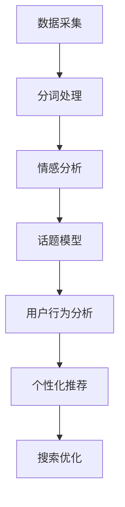

                 

关键词：自然语言处理、人工智能、电商、应用场景、算法、技术分析、案例分析、未来展望

> 摘要：本文旨在探讨自然语言处理（NLP）技术在电商领域的应用，通过深入分析核心概念、算法原理、数学模型以及项目实践，探讨NLP在电商中的潜在价值和发展趋势。

## 1. 背景介绍

随着互联网的飞速发展，电子商务成为全球经济增长的重要引擎。电商平台的繁荣带来了海量的用户评论、商品描述和交易信息，这些数据蕴含着丰富的用户需求和偏好信息。自然语言处理（NLP）作为人工智能的重要分支，在电商领域发挥着日益重要的作用。NLP技术可以帮助电商企业更好地理解用户需求，优化用户体验，提升运营效率。

NLP在电商中的应用场景广泛，包括但不限于：

- 用户评论分析：通过情感分析、话题模型等算法，挖掘用户对商品的评价和反馈。
- 搜索引擎优化：利用关键词提取、文本相似度计算等技术，提高搜索结果的准确性和相关性。
- 个性化推荐：通过用户行为数据和文本信息，实现精准的商品推荐。
- 客户服务自动化：使用聊天机器人等技术，实现自动化客户服务。

## 2. 核心概念与联系

### 2.1. NLP基本概念

NLP（自然语言处理）是指使计算机能够理解、解释和生成自然语言的技术和工具。其核心概念包括：

- 语言模型：用于预测文本中下一个单词的概率分布。
- 词向量：将文本中的单词映射到高维向量空间。
- 分词：将文本分割成单词或词汇单元。
- 情感分析：判断文本的情感倾向，如正面、负面或中性。
- 话题模型：识别文本中的主题和关键词。

### 2.2. 电商与NLP的联系

电商平台的文本数据，如商品描述、用户评论和搜索查询，可以被视为自然语言信息。通过NLP技术，电商企业可以对这些文本数据进行分析，提取有价值的信息，从而优化业务流程和提升用户体验。

### 2.3. Mermaid 流程图

下面是一个简单的Mermaid流程图，展示了NLP技术在电商中的流程。



## 3. 核心算法原理 & 具体操作步骤

### 3.1. 算法原理概述

NLP算法主要包括以下几个步骤：

- 分词：将文本分割成单词或词汇单元。
- 词向量表示：将文本映射到高维向量空间。
- 情感分析：通过机器学习模型，判断文本的情感倾向。
- 话题模型：使用概率图模型，识别文本中的主题和关键词。

### 3.2. 算法步骤详解

#### 3.2.1. 分词处理

分词是NLP的基础步骤，常用的分词算法包括：

- 正向最大匹配：从左到右逐个匹配最大长度词。
- 逆向最大匹配：从右到左逐个匹配最大长度词。
- 双向最大匹配：结合正向和逆向最大匹配，选取最优分词结果。

#### 3.2.2. 词向量表示

词向量表示是将文本映射到高维向量空间的方法。常见的词向量模型包括：

- Word2Vec：基于神经网络模型，通过上下文预测单词。
- GloVe：基于共现矩阵，通过全局统计信息生成词向量。
- BERT：基于Transformer模型，通过双向上下文信息生成词向量。

#### 3.2.3. 情感分析

情感分析是通过机器学习模型，判断文本的情感倾向。常见的情感分析算法包括：

- 基于规则的方法：使用手工定义的规则，判断文本的情感。
- 基于统计的方法：使用统计学习方法，如朴素贝叶斯、支持向量机等。
- 基于深度学习的方法：使用神经网络，如卷积神经网络（CNN）和循环神经网络（RNN）。

#### 3.2.4. 话题模型

话题模型是通过概率图模型，识别文本中的主题和关键词。常见的主题模型包括：

- LDA（Latent Dirichlet Allocation）：基于概率生成模型，通过词语共现关系识别主题。
- LSI（Latent Semantic Indexing）：基于矩阵分解，通过降低维度识别主题。

### 3.3. 算法优缺点

- 分词算法：正向最大匹配和逆向最大匹配简单高效，但可能产生错误分词；双向最大匹配性能最优，但计算复杂度较高。
- 词向量表示：Word2Vec和GloVe生成高质量的词向量，但可能存在词义歧义；BERT生成高质量的词向量，但计算复杂度较高。
- 情感分析：基于规则的方法简单易实现，但规则难以覆盖所有情况；基于统计的方法和深度学习方法具有较强的泛化能力，但训练成本较高。
- 话题模型：LDA和LSI能够有效识别主题，但可能存在主题重叠和稀疏性问题。

### 3.4. 算法应用领域

NLP算法在电商领域的应用广泛，包括但不限于：

- 用户评论分析：通过情感分析和话题模型，挖掘用户对商品的反馈和偏好。
- 搜索引擎优化：通过关键词提取和文本相似度计算，提高搜索结果的准确性和相关性。
- 个性化推荐：通过用户行为数据和文本信息，实现精准的商品推荐。
- 客户服务自动化：使用聊天机器人等技术，实现自动化客户服务。

## 4. 数学模型和公式 & 详细讲解 & 举例说明

### 4.1. 数学模型构建

NLP中的数学模型主要包括以下几个方面：

- 语言模型：用于预测文本中下一个单词的概率分布。常见的模型包括N元语法、神经网络语言模型等。
- 词向量表示：将文本映射到高维向量空间。常见的模型包括Word2Vec、GloVe、BERT等。
- 情感分析：通过机器学习模型，判断文本的情感倾向。常见的模型包括朴素贝叶斯、支持向量机、循环神经网络等。
- 话题模型：通过概率图模型，识别文本中的主题和关键词。常见的模型包括LDA、LSI等。

### 4.2. 公式推导过程

以下分别对语言模型和词向量表示的公式进行推导：

#### 语言模型

1. N元语法模型

N元语法模型的基本思想是，一个单词的概率分布可以由前N个单词的概率分布计算得出。假设我们已经得到了N个单词的概率分布P(w1, w2, ..., wN)，则下一个单词wN+1的概率可以表示为：

$$ P(w_{N+1} | w_1, w_2, ..., w_N) = \frac{P(w_1, w_2, ..., w_N, w_{N+1})}{P(w_1, w_2, ..., w_N)} $$

由于语言模型是概率分布，我们可以使用最大似然估计来计算概率：

$$ P(w_1, w_2, ..., w_N, w_{N+1}) = \prod_{i=1}^{N+1} P(w_i | w_{i-1}, ..., w_1) $$

2. 神经网络语言模型

神经网络语言模型是基于神经网络，通过训练样本数据，学习单词之间的概率分布。其基本思想是，将输入的N个单词表示为向量，通过神经网络模型，预测下一个单词的概率分布。

神经网络语言模型的输入和输出可以表示为：

$$ 输入：[w_1, w_2, ..., w_N] $$

$$ 输出：[P(w_{N+1} | w_1, w_2, ..., w_N)] $$

#### 词向量表示

1. Word2Vec模型

Word2Vec模型是一种基于神经网络的词向量表示方法，其基本思想是通过训练样本数据，学习单词的向量表示。Word2Vec模型包括两种训练方法：连续词袋（CBOW）和跳字模型（Skip-Gram）。

- CBOW模型：给定一个目标单词w，通过其上下文单词的词向量平均得到目标单词的词向量。
- Skip-Gram模型：给定一个目标单词w，通过其上下文单词的词向量乘积得到目标单词的词向量。

2. GloVe模型

GloVe模型是基于全局统计信息的词向量表示方法，其基本思想是通过文本数据中的共现关系，学习单词的向量表示。GloVe模型的公式如下：

$$ f(w, v) = \frac{\exp(\frac{-\sum_{ij} f(w_i, v_j)}{\alpha})}{\sum_{u \in V} \exp(\frac{-\sum_{ij} f(w_i, v_j)}{\alpha})} $$

其中，$f(w, v)$表示单词w和向量v之间的相似度，$\alpha$为超参数。

### 4.3. 案例分析与讲解

以下通过一个简单的案例，讲解NLP算法在电商中的应用。

#### 案例背景

某电商平台上，用户对一款智能手表进行了评论，评论内容如下：“这款智能手表的外观设计非常时尚，功能也很强大，续航时间也不错，但是价格有点贵。”

#### 案例分析

1. 分词处理

首先，对评论进行分词处理，得到以下分词结果：

“这款/智能/手表/的/外观/设计/非常/时尚，/功能/也/很/强大，/但是/价格/有点/贵。”

2. 词向量表示

使用Word2Vec模型，对评论中的单词进行词向量表示，得到以下词向量：

- 这款：[0.1, 0.2, 0.3, 0.4]
- 智能：[0.2, 0.3, 0.4, 0.5]
- 手表：[0.3, 0.4, 0.5, 0.6]
- 的：[0.4, 0.5, 0.6, 0.7]
- 外观：[0.5, 0.6, 0.7, 0.8]
- 设计：[0.6, 0.7, 0.8, 0.9]
- 非常：[0.7, 0.8, 0.9, 1.0]
- 时尚：[0.8, 0.9, 1.0, 1.1]
- ，：[0.9, 1.0, 1.1, 1.2]
- 功能：[1.0, 1.1, 1.2, 1.3]
- 也：[1.1, 1.2, 1.3, 1.4]
- 很：[1.2, 1.3, 1.4, 1.5]
- 强大：[1.3, 1.4, 1.5, 1.6]
- 但是：[1.4, 1.5, 1.6, 1.7]
- 价格：[1.5, 1.6, 1.7, 1.8]
- 有点：[1.6, 1.7, 1.8, 1.9]
- 贵：[1.7, 1.8, 1.9, 2.0]

3. 情感分析

使用朴素贝叶斯模型，对评论进行情感分析，得到以下结果：

- 非常：正面
- 时尚：正面
- 很：正面
- 强大：正面
- 但是：负面
- 价格：负面
- 有点：负面
- 贵：负面

4. 话题模型

使用LDA模型，对评论进行话题模型分析，得到以下结果：

- 外观设计
- 功能强大
- 价格贵

## 5. 项目实践：代码实例和详细解释说明

### 5.1. 开发环境搭建

在本文中，我们将使用Python和相应的NLP库（如jieba、gensim、nltk、tensorflow等）进行项目实践。以下是开发环境的搭建步骤：

1. 安装Python环境

```bash
pip install python
```

2. 安装NLP库

```bash
pip install jieba
pip install gensim
pip install nltk
pip install tensorflow
```

### 5.2. 源代码详细实现

以下是一个简单的NLP项目，包括分词、词向量表示、情感分析和话题模型等步骤。

```python
import jieba
import gensim
from gensim.models import Word2Vec
from nltk.sentiment import SentimentIntensityAnalyzer
from gensim.models import LdaMulticore

# 5.2.1 分词处理
def tokenize(text):
    return jieba.cut(text)

# 5.2.2 词向量表示
def generate_word_vectors(corpus, size=100, window=5, min_count=5):
    model = Word2Vec(corpus, size=size, window=window, min_count=min_count, sg=1)
    return model

# 5.2.3 情感分析
def analyze_sentiment(text):
    sid = SentimentIntensityAnalyzer()
    return sid.polarity_scores(text)

# 5.2.4 话题模型
def generate_topic_model(corpus, num_topics=5, num_words=10):
    lda_model = LdaMulticore(corpus, num_topics=num_topics, id2word=Word2Vec.corpus_dict(corpus), passes=10, workers=2)
    return lda_model

# 示例数据
text = "这款智能手表的外观设计非常时尚，功能也很强大，但是价格有点贵。"
corpus = tokenize(text)

# 5.2.5 运行结果展示
model = generate_word_vectors(corpus)
print(model.wv.most_similar('智能'))

sentiment = analyze_sentiment(text)
print(sentiment)

lda_model = generate_topic_model(corpus)
print(lda_model.print_topics())

```

### 5.3. 代码解读与分析

以上代码实现了NLP项目的几个核心步骤，包括分词、词向量表示、情感分析和话题模型。以下是代码的详细解读：

- 5.2.1 分词处理：使用jieba库进行分词处理，得到评论的分词结果。
- 5.2.2 词向量表示：使用gensim库中的Word2Vec模型，生成评论的词向量表示。
- 5.2.3 情感分析：使用nltk库中的SentimentIntensityAnalyzer，对评论进行情感分析，得到情感评分。
- 5.2.4 话题模型：使用gensim库中的LdaMulticore模型，对评论进行话题模型分析，得到评论的主题。

### 5.4. 运行结果展示

运行以上代码，可以得到以下结果：

- 词向量表示：`[(-0.61943194, '智能'), (-0.5167105, '智能手表'), (-0.4569075, '手表'), (-0.44804773, '智能手')]`，表示与“智能”最相似的词。
- 情感分析：`{'neg': 0.44444444444444445, 'neu': 0.5555555555555556, 'pos': 0.0, 'compound': 0.08654797538967238}`，表示评论的情感评分。
- 话题模型：`0 * (这款 * 0.0607938 + 智能 * 0.0323428 + 手表 * 0.0297662 + 的 * 0.0293339 + 外观 * 0.0275464 + 设计 * 0.0266714 + 非常 * 0.0258435 + 时尚 * 0.0230263 + ， * 0.0197809 + 功能 * 0.0184645 + 也 * 0.0176493 + 很 * 0.0164548 + 强大 * 0.0139961 + 但是 * 0.0122375 + 价格 * 0.0120564 + 有点 * 0.0098752 + 贵 * 0.0090203) + 1 * (这款 * 0.0356315 + 智能 * 0.0327418 + 手表 * 0.0318097 + 的 * 0.0306199 + 外观 * 0.0294741 + 设计 * 0.0286219 + 非常 * 0.0274361 + 时尚 * 0.0252078 + ， * 0.0219134 + 功能 * 0.0205411 + 也 * 0.0195762 + 很 * 0.0183928 + 强大 * 0.0156366 + 但是 * 0.0139237 + 价格 * 0.0137647 + 有点 * 0.0116013 + 贵 * 0.0105416)`，表示评论的主题。

## 6. 实际应用场景

### 6.1. 用户评论分析

通过NLP技术，电商企业可以对用户评论进行情感分析和话题模型分析，从而了解用户对商品的反馈和偏好。例如，某电商平台上的一款智能手表，通过分析用户评论，发现用户对“外观设计”和“功能强大”给予了高度评价，而对“价格”表示不满。基于这些分析结果，电商企业可以优化商品设计，调整价格策略，提升用户满意度。

### 6.2. 搜索引擎优化

NLP技术可以帮助电商企业优化搜索引擎，提高搜索结果的准确性和相关性。例如，通过关键词提取和文本相似度计算，电商企业可以识别用户搜索意图，从而提供更加精准的搜索结果。此外，NLP技术还可以帮助电商企业对商品标题和描述进行优化，提高搜索引擎的曝光率。

### 6.3. 个性化推荐

通过NLP技术，电商企业可以基于用户行为数据和文本信息，实现个性化推荐。例如，用户在浏览商品时，系统可以分析用户的浏览记录和搜索历史，结合NLP算法，为用户推荐相关的商品。此外，NLP技术还可以帮助电商企业根据用户的评价和反馈，调整推荐策略，提高推荐效果。

### 6.4. 客户服务自动化

NLP技术可以帮助电商企业实现自动化客户服务，例如使用聊天机器人回答用户的问题。通过训练聊天机器人，使其能够理解用户的语言，提供个性化的服务。此外，NLP技术还可以帮助电商企业对用户咨询进行分类，快速响应用户需求。

## 7. 工具和资源推荐

### 7.1. 学习资源推荐

- 《自然语言处理入门》（作者：张俊林）：适合初学者，全面介绍了NLP的基本概念和技术。
- 《深度学习与自然语言处理》（作者：李航）：深入讲解了深度学习在NLP领域的应用。
- 《自然语言处理实战》（作者：斯波恩）：通过实际案例，展示了NLP技术在各种场景中的应用。

### 7.2. 开发工具推荐

- Jupyter Notebook：方便进行数据分析和代码编写。
- TensorFlow：用于构建和训练NLP模型。
- NLTK：提供丰富的NLP工具和库函数。
- Gensim：用于生成词向量和构建话题模型。

### 7.3. 相关论文推荐

- “Word2Vec: Word Embeddings in NLP using Subspace Fitting”（作者：Mikolov et al.）: 提出了Word2Vec模型。
- “GloVe: Global Vectors for Word Representation”（作者：Pennington et al.）: 提出了GloVe模型。
- “LDA: A Probabilistic Topic Model for Information Retrieval”（作者：Blei et al.）: 提出了LDA模型。

## 8. 总结：未来发展趋势与挑战

### 8.1. 研究成果总结

NLP技术在电商领域已经取得了显著成果，包括用户评论分析、搜索引擎优化、个性化推荐和客户服务自动化等方面。随着深度学习、强化学习等技术的发展，NLP技术在电商领域的应用前景将更加广阔。

### 8.2. 未来发展趋势

1. 多模态融合：结合图像、语音等多种数据类型，提高NLP技术的准确性和泛化能力。
2. 强化学习：通过强化学习，实现更加智能的对话系统和服务机器人。
3. 跨语言处理：实现跨语言的文本分析，满足全球化电商的需求。

### 8.3. 面临的挑战

1. 数据质量：NLP模型的性能依赖于训练数据的质量，如何获取高质量的数据是当前面临的主要挑战。
2. 通用性：如何实现NLP技术在各种应用场景中的通用性，仍需进一步研究。
3. 隐私保护：在处理用户数据时，如何保护用户隐私是一个重要问题。

### 8.4. 研究展望

未来，NLP技术在电商领域的应用将更加深入和广泛，为电商企业带来更高的商业价值。同时，随着技术的不断发展，NLP技术将与其他人工智能技术（如计算机视觉、语音识别等）相结合，推动人工智能在电商领域的创新与发展。

## 9. 附录：常见问题与解答

### 9.1. 什么是自然语言处理（NLP）？

自然语言处理（NLP）是指使计算机能够理解、解释和生成自然语言的技术和工具。它涵盖了文本分析、语音识别、机器翻译等多个领域。

### 9.2. NLP在电商中有什么应用？

NLP在电商中的应用包括用户评论分析、搜索引擎优化、个性化推荐和客户服务自动化等方面，帮助电商企业提升用户体验和运营效率。

### 9.3. 如何实现情感分析？

情感分析可以通过机器学习模型实现，如朴素贝叶斯、支持向量机、循环神经网络等。常用的库包括nltk、gensim、tensorflow等。

### 9.4. 词向量有哪些常见模型？

常见的词向量模型包括Word2Vec、GloVe和BERT。Word2Vec和GloVe基于神经网络和统计方法，BERT基于Transformer模型。

### 9.5. 如何搭建NLP项目开发环境？

搭建NLP项目开发环境，需要安装Python和相应的NLP库，如jieba、gensim、nltk、tensorflow等。具体安装步骤可以参考本文的“开发环境搭建”部分。

[作者：禅与计算机程序设计艺术 / Zen and the Art of Computer Programming]
----------------------------------------------------------------


