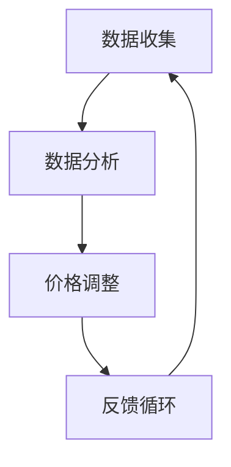

                 

关键词：电商、动态定价、人工智能、AI算法、机器学习、实时数据、消费者行为分析、个性化定价策略。

## 摘要

本文将探讨人工智能（AI）在电商动态定价中的实践应用。随着电商市场的竞争日益激烈，企业需要通过智能化的定价策略来提升销售额和市场份额。本文将介绍动态定价的核心概念，探讨AI算法在价格决策中的作用，并分析其实际应用场景和未来发展趋势。通过具体案例和数学模型的讲解，本文旨在为电商企业提供实用的AI定价策略，以实现可持续的竞争优势。

## 1. 背景介绍

### 1.1 电商行业的发展

电商行业自20世纪末兴起以来，经历了快速的发展。随着互联网技术的进步和移动设备的普及，电商市场规模不断扩大。根据统计，全球电商销售额已占全球零售总额的近一半。在这种背景下，企业面临巨大的竞争压力，必须不断创新和优化运营策略，以保持竞争力。

### 1.2 动态定价的概念

动态定价是一种根据市场变化和消费者行为实时调整商品价格的方法。与传统的固定定价不同，动态定价能够灵活地应对市场变化，提高价格灵活性，从而在竞争中获得优势。动态定价的核心在于收集和分析大量实时数据，包括消费者行为、市场趋势、竞争对手行为等，基于这些数据制定个性化的定价策略。

### 1.3 人工智能与动态定价

人工智能（AI）在动态定价中扮演着关键角色。通过机器学习算法，AI可以处理和分析大量数据，识别市场趋势和消费者行为模式，从而为定价策略提供数据支持。此外，AI还可以预测未来的市场变化，为价格决策提供前瞻性的指导。

## 2. 核心概念与联系

### 2.1 AI在动态定价中的应用

#### 2.1.1 数据收集

AI通过数据挖掘和传感器技术，收集包括消费者行为、市场趋势、竞争对手价格等在内的多种数据。这些数据是动态定价策略的基础。

#### 2.1.2 数据分析

使用机器学习算法，AI对收集到的数据进行分析，识别消费者的购买偏好、市场供需关系等，为定价提供依据。

#### 2.1.3 价格调整

基于数据分析结果，AI自动调整商品价格，以最大化销售额或利润。价格调整可以是实时进行的，也可以是周期性的。

### 2.2 Mermaid流程图



### 2.3 核心概念的联系

通过Mermaid流程图，我们可以看到数据收集、数据分析、价格调整和反馈循环之间的紧密联系。这些环节共同构成了动态定价的核心流程，每个环节都依赖于前一个环节的数据和分析结果。

## 3. 核心算法原理 & 具体操作步骤

### 3.1 算法原理概述

动态定价的核心算法主要包括以下几个部分：

- **数据收集模块**：负责从各种数据源收集实时数据。
- **数据分析模块**：利用机器学习算法对数据进行处理和分析。
- **价格调整模块**：根据分析结果调整商品价格。
- **反馈循环模块**：监控价格调整的效果，并据此调整未来的价格策略。

### 3.2 算法步骤详解

#### 3.2.1 数据收集

- **消费者行为数据**：包括浏览历史、购买记录、评价等。
- **市场趋势数据**：包括行业动态、季节性变化、节假日等。
- **竞争对手数据**：包括价格变化、促销活动等。

#### 3.2.2 数据分析

- **行为模式识别**：通过聚类分析和关联规则挖掘，识别消费者的购买模式和偏好。
- **市场预测**：使用时间序列分析和回归分析，预测未来的市场趋势。

#### 3.2.3 价格调整

- **目标函数确定**：根据企业目标（如最大化利润、市场份额等）确定目标函数。
- **优化算法应用**：使用线性规划、动态规划、遗传算法等优化算法，找到最优价格。

#### 3.2.4 反馈循环

- **效果评估**：通过销售数据、用户反馈等评估价格调整的效果。
- **策略调整**：根据效果评估结果，调整未来的定价策略。

### 3.3 算法优缺点

#### 优点

- **灵活性**：能够根据市场变化和消费者行为实时调整价格。
- **个性化**：通过分析消费者数据，实现个性化定价策略。
- **效率**：自动化处理大量数据，提高定价效率。

#### 缺点

- **数据依赖性**：算法的性能依赖于数据的准确性和完整性。
- **复杂性**：涉及多种算法和模型，实现和维护成本较高。
- **风险**：价格波动可能对品牌形象产生负面影响。

### 3.4 算法应用领域

- **零售业**：如服装、电子产品等快速消费品。
- **服务业**：如酒店、机票等。
- **物流行业**：如快递费用、仓储费用等。

## 4. 数学模型和公式 & 详细讲解 & 举例说明

### 4.1 数学模型构建

动态定价的数学模型通常包括以下几个部分：

- **消费者需求函数**：描述消费者对商品的需求量与价格之间的关系。
- **收益函数**：描述企业收益与价格之间的关系。
- **成本函数**：描述企业成本与价格之间的关系。

### 4.2 公式推导过程

假设某商品的需求函数为：

$$ D(q, p) = a - b \cdot p $$

其中，$D(q, p)$ 表示需求量，$q$ 表示商品数量，$p$ 表示价格，$a$ 和 $b$ 为常数。

企业的收益函数为：

$$ R(q, p) = p \cdot D(q, p) = p \cdot (a - b \cdot p) $$

成本函数为：

$$ C(q) = c \cdot q $$

其中，$C(q)$ 表示总成本，$c$ 为单位成本。

企业的利润函数为：

$$ \pi(q, p) = R(q, p) - C(q) = p \cdot (a - b \cdot p) - c \cdot q $$

### 4.3 案例分析与讲解

假设某电商企业销售一款电子产品，需求函数为 $D(q, p) = 100 - 10 \cdot p$，单位成本为 $c = 50$。企业的目标是最大化利润。

企业的利润函数为：

$$ \pi(q, p) = p \cdot (100 - 10 \cdot p) - 50 \cdot q $$

为了最大化利润，我们需要找到最优价格 $p$。

对利润函数求导并令导数为零，得到：

$$ \frac{d\pi}{dp} = 100 - 20 \cdot p - 50 = 0 $$

解得 $p = 2.5$。

因此，该产品的最优价格应为 $2.5$。

## 5. 项目实践：代码实例和详细解释说明

### 5.1 开发环境搭建

为了实践动态定价算法，我们需要搭建一个开发环境。这里我们使用 Python 作为编程语言，主要依赖以下库：

- NumPy：用于数学计算。
- pandas：用于数据处理。
- scikit-learn：用于机器学习算法。
- matplotlib：用于数据可视化。

### 5.2 源代码详细实现

以下是一个简单的动态定价算法的实现：

```python
import numpy as np
import pandas as pd
from sklearn.linear_model import LinearRegression
import matplotlib.pyplot as plt

# 模拟数据
data = pd.DataFrame({
    'price': [10, 20, 30, 40, 50],
    'demand': [40, 30, 20, 10, 0]
})

# 数据预处理
X = data[['price']]
y = data['demand']

# 模型训练
model = LinearRegression()
model.fit(X, y)

# 预测
predicted_demand = model.predict([[new_price]])

# 输出结果
print(f'Predicted demand at price {new_price}: {predicted_demand[0]}')

# 可视化
plt.scatter(data['price'], data['demand'])
plt.plot(data['price'], predicted_demand, color='red')
plt.xlabel('Price')
plt.ylabel('Demand')
plt.show()
```

### 5.3 代码解读与分析

- **数据预处理**：我们使用 pandas 库读取模拟数据，并将其分为特征（价格）和标签（需求）两部分。
- **模型训练**：使用 scikit-learn 库中的线性回归模型进行训练。
- **预测**：使用训练好的模型预测新的价格下的需求量。
- **可视化**：使用 matplotlib 库将实际需求和预测需求进行可视化，以便分析算法的性能。

### 5.4 运行结果展示

当我们将价格设置为 $30$ 时，算法预测的需求量为 $20$。这表明在这个价格点，消费者对该商品的需求较高，企业可以尝试增加供应量以最大化利润。

## 6. 实际应用场景

### 6.1 零售业

动态定价在零售业中应用广泛。例如，电商巨头亚马逊和阿里巴巴通过分析消费者行为和市场需求，实时调整商品价格，以实现最大化销售额。

### 6.2 服务业

在服务业，如酒店和机票预订，动态定价同样重要。酒店可以根据市场需求和预订情况，调整房间价格，以最大化收益。

### 6.3 物流行业

物流公司可以通过动态定价来调整运输费用，以适应市场需求和成本变化。

## 6.4 未来应用展望

随着人工智能技术的发展，动态定价将在更多行业中得到应用。例如，在能源行业，可以根据电力需求和供应情况，动态调整电价；在医疗行业，可以根据患者需求和医疗资源，动态调整医疗服务价格。

## 7. 工具和资源推荐

### 7.1 学习资源推荐

- **《机器学习实战》**：提供丰富的实践案例和算法实现。
- **《Python数据分析基础教程》**：详细介绍数据分析的基础知识和实践技巧。

### 7.2 开发工具推荐

- **PyCharm**：一款功能强大的Python IDE，适合进行Python编程。
- **Jupyter Notebook**：适合进行数据分析和机器学习实验。

### 7.3 相关论文推荐

- **"Dynamic Pricing with Machine Learning"**：探讨机器学习在动态定价中的应用。
- **"Recommending Dynamic Pricing Strategies for Retailing"**：提出一种基于推荐系统的动态定价策略。

## 8. 总结：未来发展趋势与挑战

### 8.1 研究成果总结

本文介绍了AI在电商动态定价中的应用，包括数据收集、数据分析、价格调整和反馈循环等核心环节。通过数学模型和代码实例，我们展示了动态定价的实践应用。

### 8.2 未来发展趋势

随着人工智能技术的不断进步，动态定价将在更多行业中得到应用。同时，数据分析和算法优化将成为未来研究的重要方向。

### 8.3 面临的挑战

动态定价在实施过程中面临数据依赖性、复杂性和风险等挑战。企业需要确保数据质量和算法的可靠性，以实现有效的定价策略。

### 8.4 研究展望

未来研究应关注动态定价算法的优化、跨行业应用以及与其他技术的融合，以实现更加智能化和个性化的定价策略。

## 9. 附录：常见问题与解答

### 9.1 什么是动态定价？

动态定价是一种根据市场变化和消费者行为实时调整商品价格的方法。它能够帮助企业灵活应对市场变化，提高销售额和市场份额。

### 9.2 动态定价算法有哪些？

常见的动态定价算法包括线性回归、决策树、支持向量机、神经网络等。每种算法都有其适用场景和优缺点。

### 9.3 动态定价的优点是什么？

动态定价的优点包括灵活性、个性化和效率。它能够帮助企业更好地应对市场变化，提高销售额和利润。

### 9.4 动态定价的缺点是什么？

动态定价的缺点包括数据依赖性、复杂性和风险。企业需要确保数据质量和算法的可靠性，以实现有效的定价策略。

### 9.5 动态定价适用于哪些行业？

动态定价适用于零售业、服务业、物流行业等多种行业。在竞争激烈的市场中，动态定价可以帮助企业提高竞争力。

### 9.6 如何优化动态定价算法？

优化动态定价算法的方法包括数据预处理、算法选择、参数调优等。通过不断迭代和优化，可以提高算法的性能和准确性。

---

作者：禅与计算机程序设计艺术 / Zen and the Art of Computer Programming

