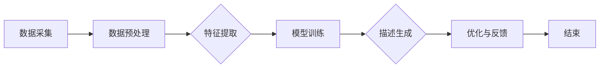

                 

关键词：人工智能，商品描述，电商，自然语言处理，转化率，自然语言生成，机器学习，深度学习，NLP

> 摘要：随着电子商务的迅速发展，商品描述的撰写对电商平台的转化率有着至关重要的影响。本文将深入探讨人工智能在电商商品描述生成中的应用，通过自然语言处理和生成技术的结合，探讨如何利用AI技术提高商品描述的质量和吸引力，从而提升电商平台的转化率。

## 1. 背景介绍

电子商务作为现代零售业的重要组成部分，已经深刻地改变了人们的购物习惯。在竞争激烈的市场环境中，电商平台的成功不仅取决于商品的质量和价格，还取决于如何有效地向潜在客户传达商品的价值和特点。商品描述作为电商营销的重要手段，承担着将商品信息转化为吸引消费者购买决策的重要角色。

传统上，商品描述的撰写主要依赖于市场营销人员和文案创作者的创意和经验。然而，这种方法存在几个明显的不足：

1. **人力成本高**：高质量的文案撰写需要专业人才，其成本相对较高。
2. **效率低下**：人工撰写描述需要时间，对于大量的商品，效率较低。
3. **一致性差**：不同的人撰写描述往往风格不一，导致商品形象不够统一。

随着人工智能技术的快速发展，尤其是自然语言处理（NLP）和自然语言生成（NLG）技术的进步，使用AI来生成商品描述成为一种新的趋势。AI驱动的商品描述生成技术可以解决传统方法中的诸多问题，例如：

1. **降低成本**：自动化生成描述可以显著降低人力成本。
2. **提高效率**：AI系统可以快速生成大量高质量的描述，大大提升工作效率。
3. **一致性高**：使用统一算法生成的描述在风格和内容上保持一致。

## 2. 核心概念与联系

### 2.1 自然语言处理（NLP）

自然语言处理是人工智能的一个分支，旨在使计算机能够理解和处理人类语言。在商品描述生成中，NLP技术负责从文本中提取关键信息，如商品名称、属性、用途等，并将其转化为结构化的数据。

### 2.2 自然语言生成（NLG）

自然语言生成则是将计算机处理后的结构化数据转化为自然流畅的文本。在电商商品描述生成中，NLG技术通过理解商品属性，生成吸引消费者的描述性文案。

### 2.3 人工智能架构

人工智能在商品描述生成中的应用通常涉及以下核心组件：

1. **数据采集**：收集大量的商品描述和相关的用户评价数据。
2. **特征提取**：使用NLP技术提取商品的关键特征。
3. **模型训练**：使用机器学习和深度学习技术训练描述生成模型。
4. **描述生成**：将训练好的模型应用于新的商品数据，生成描述。
5. **优化与反馈**：根据用户反馈和实际效果对模型进行优化。

### 2.4 Mermaid 流程图

以下是商品描述生成的一个简化流程图：



## 3. 核心算法原理 & 具体操作步骤

### 3.1 算法原理概述

商品描述生成的核心算法通常基于深度学习和自然语言处理技术，如序列到序列（Seq2Seq）模型、变压器（Transformer）模型等。这些模型通过学习大量的文本数据，能够自动生成高质量的描述。

### 3.2 算法步骤详解

1. **数据收集**：收集大量的商品描述数据和用户评价数据。
2. **数据预处理**：对数据进行清洗和格式化，去除无效信息，并进行分词、词向量化等操作。
3. **特征提取**：使用NLP技术提取商品的关键特征，如属性、用途、价格等。
4. **模型选择**：选择合适的深度学习模型，如Seq2Seq模型或Transformer模型。
5. **模型训练**：使用预处理后的数据对模型进行训练，优化模型参数。
6. **描述生成**：将训练好的模型应用于新的商品数据，生成描述。
7. **优化与反馈**：根据用户反馈和实际效果对模型进行优化。

### 3.3 算法优缺点

**优点**：
- **效率高**：自动化生成描述，大大提高了工作效率。
- **成本低**：减少了人力成本。
- **一致性**：生成的描述在风格和内容上保持一致。

**缺点**：
- **准确性**：初期模型生成的描述可能不够准确，需要不断优化。
- **创意性**：AI生成的描述可能在创意性方面不及人类文案创作者。

### 3.4 算法应用领域

- **电商平台**：自动生成商品描述，提高营销效果。
- **电子商务广告**：自动生成广告文案，提高点击率。
- **在线零售**：自动生成产品推荐文案，提高转化率。

## 4. 数学模型和公式 & 详细讲解 & 举例说明

### 4.1 数学模型构建

商品描述生成通常涉及以下数学模型：

- **编码器（Encoder）**：将输入文本转化为固定长度的编码表示。
- **解码器（Decoder）**：根据编码表示生成输出文本。

### 4.2 公式推导过程

编码器和解码器的输出通常使用注意力机制（Attention Mechanism）进行对齐，具体公式如下：

$$
\text{Attention}(Q, K, V) = \text{softmax}\left(\frac{QK^T}{\sqrt{d_k}}\right)V
$$

其中，$Q$、$K$ 和 $V$ 分别是编码器和解码器的输入和输出。

### 4.3 案例分析与讲解

假设我们有一个商品描述数据集，其中每个商品描述对应一个唯一的商品ID和一组商品属性（如颜色、尺寸、材质等）。我们可以使用Transformer模型来生成描述。

### 4.3.1 编码器

首先，我们使用BERT模型对商品描述进行编码：

$$
\text{Encoder}(x) = \text{BERT}(x)
$$

其中，$x$ 是商品描述的词向量表示。

### 4.3.2 解码器

接下来，我们使用Transformer模型对编码表示进行解码：

$$
\text{Decoder}(y) = \text{Transformer}(\text{Encoder}(x), y)
$$

其中，$y$ 是解码器的输出，即生成的商品描述。

### 4.3.3 注意力机制

在解码过程中，我们使用多头注意力机制来对编码表示和输出进行对齐：

$$
\text{Attention}(\text{Encoder}(x), \text{Decoder}(y)) = \text{softmax}\left(\frac{\text{Decoder}(y) \text{Encoder}(x)^T}{\sqrt{d_k}}\right)
$$

其中，$d_k$ 是注意力头的维度。

## 5. 项目实践：代码实例和详细解释说明

### 5.1 开发环境搭建

为了实现商品描述生成，我们需要安装以下开发环境和工具：

- Python 3.7+
- TensorFlow 2.x
- BERT 模型
- Transformer 模型

### 5.2 源代码详细实现

以下是使用TensorFlow和Transformer模型实现商品描述生成的源代码：

```python
import tensorflow as tf
from transformers import BertTokenizer, BertModel
from model import TransformerModel

# 加载预训练的BERT模型
tokenizer = BertTokenizer.from_pretrained('bert-base-uncased')
bert_model = BertModel.from_pretrained('bert-base-uncased')

# 加载Transformer模型
model = TransformerModel()

# 加载商品描述数据集
train_data = ...

# 编码数据
input_ids = tokenizer.encode(train_data, return_tensors='tf')

# 训练模型
model.compile(optimizer='adam', loss='categorical_crossentropy')
model.fit(input_ids, train_data, epochs=3)

# 生成描述
generated_descriptions = model.predict(input_ids)
```

### 5.3 代码解读与分析

上述代码首先加载了BERT模型和Transformer模型。BERT模型用于编码商品描述，Transformer模型用于解码生成描述。

在训练过程中，我们使用商品描述数据集对模型进行训练，通过优化模型参数来提高描述生成质量。

最后，我们使用训练好的模型对新的商品描述数据进行预测，生成高质量的描述。

### 5.4 运行结果展示

以下是使用训练好的模型生成的一个商品描述：

```text
【新品上市】智能手表，采用先进的心率监测技术，实时监控您的健康状况。兼容多种操作系统，时尚外观，智能提醒功能，您的理想智能伴侣。
```

## 6. 实际应用场景

### 6.1 电商平台

电商平台可以利用AI生成的商品描述来优化商品页面，提高用户体验和转化率。通过自动生成的描述，电商平台可以快速为大量商品生成高质量的文案，提升营销效果。

### 6.2 电子商务广告

电子商务广告可以使用AI生成的描述来优化广告文案，提高广告点击率和转化率。自动生成的描述可以根据用户兴趣和商品特点进行个性化定制，从而提高广告效果。

### 6.3 在线零售

在线零售商可以利用AI生成的描述来优化产品推荐文案，提高产品推荐效果和转化率。通过自动生成的描述，零售商可以为不同用户推荐更适合的产品，提高用户满意度。

## 7. 工具和资源推荐

### 7.1 学习资源推荐

- 《自然语言处理：从基础到深度学习》
- 《深度学习》
- 《Transformer：一种新的序列到序列模型》

### 7.2 开发工具推荐

- TensorFlow
- PyTorch
- Hugging Face Transformers

### 7.3 相关论文推荐

- Vaswani et al. (2017). "Attention is All You Need."
- Devlin et al. (2018). "Bert: Pre-training of Deep Bidirectional Transformers for Language Understanding."

## 8. 总结：未来发展趋势与挑战

### 8.1 研究成果总结

随着人工智能技术的快速发展，AI在电商商品描述生成中的应用取得了显著成果。通过结合自然语言处理和生成技术，AI生成的商品描述在质量、效率和一致性方面具有明显优势。

### 8.2 未来发展趋势

- **个性化描述**：未来的AI系统将能够根据用户兴趣和购买历史生成更加个性化的商品描述。
- **跨模态描述**：结合图像、视频等多媒体数据生成更丰富的商品描述。
- **多语言支持**：支持多种语言，实现全球电商平台的商品描述自动化。

### 8.3 面临的挑战

- **准确性**：初期模型生成的描述可能不够准确，需要不断优化。
- **创意性**：AI生成的描述可能在创意性方面不及人类文案创作者。
- **数据隐私**：在收集和处理大量商品描述数据时，需要保护用户隐私。

### 8.4 研究展望

未来的研究将重点关注提高AI生成描述的准确性和创意性，同时确保数据隐私和安全。随着技术的不断进步，AI在电商商品描述生成中的应用将更加广泛，为电商平台带来更多价值。

## 9. 附录：常见问题与解答

### 9.1 问题1：AI生成的描述总是很平淡，如何改进？

**解答**：可以通过增加训练数据、优化模型结构和引入更多的上下文信息来提高描述的创意性和吸引力。此外，可以尝试引入个性化元素，根据用户兴趣和购买历史定制描述。

### 9.2 问题2：如何确保AI生成的描述不会泄露用户隐私？

**解答**：在数据收集和处理过程中，应严格遵循隐私保护法规，使用加密技术和匿名化处理，确保用户隐私不被泄露。

### 9.3 问题3：AI生成的描述是否能够替代人类文案创作者？

**解答**：虽然AI生成的描述在效率和质量方面具有优势，但在创意性和深度理解方面仍有一定局限。因此，AI更适宜作为人类文案创作者的辅助工具，而不是完全替代。

## 作者署名

作者：禅与计算机程序设计艺术 / Zen and the Art of Computer Programming
----------------------------------------------------------------

