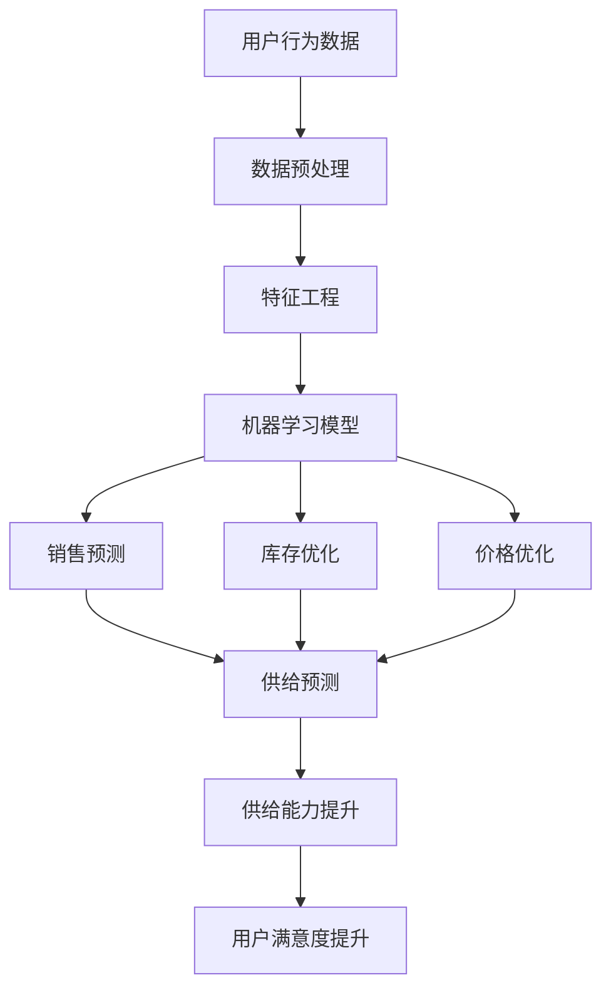

                 

关键词：AI、电商平台、供给能力、推荐系统、机器学习、深度学习、数据挖掘、供应链管理、用户行为分析

> 摘要：随着互联网技术的迅猛发展，电商平台已成为全球消费者购物的首选途径。然而，如何提升电商平台的供给能力，满足用户个性化需求，提高运营效率，成为电商平台面临的重要课题。本文将深入探讨人工智能在电商平台供给能力提升中的具体应用，包括推荐系统、机器学习、深度学习和数据挖掘等方面，以期为电商平台提供有益的参考和启示。

## 1. 背景介绍

电商平台作为现代商业模式的重要组成部分，其供给能力的提升直接关系到平台的市场竞争力。传统的电商平台主要依赖于人力和经验进行商品推荐和库存管理，存在响应速度慢、个性化程度低、运营效率低等问题。随着人工智能技术的不断发展和成熟，AI技术在电商平台中的应用越来越广泛，成为提升供给能力的重要手段。

AI技术在电商平台供给能力提升中的应用主要包括以下几个方面：

1. **推荐系统**：通过分析用户的历史行为和兴趣偏好，为用户推荐合适的商品。
2. **机器学习**：用于预测销售趋势、库存优化等业务场景，提高运营效率。
3. **深度学习**：通过处理大规模数据，挖掘用户潜在需求，提升用户满意度。
4. **数据挖掘**：从海量交易数据中提取有价值的信息，用于决策支持。

## 2. 核心概念与联系

### 2.1. 推荐系统

推荐系统是电商平台中最常见的AI应用之一。其核心原理是基于用户的历史行为和兴趣偏好，利用机器学习和深度学习算法，为用户推荐可能感兴趣的商品。

### 2.2. 机器学习

机器学习是AI的核心技术之一，通过对历史数据的分析和学习，预测未来的趋势和结果。在电商平台中，机器学习可以用于销售预测、库存管理、价格优化等。

### 2.3. 深度学习

深度学习是机器学习的一种，通过多层神经网络模拟人脑处理信息的方式，能够处理大量复杂数据。在电商平台中，深度学习可以用于商品推荐、需求预测、用户行为分析等。

### 2.4. 数据挖掘

数据挖掘是从大量数据中提取有价值信息的过程。在电商平台中，数据挖掘可以用于用户画像、市场分析、风险控制等。

### 2.5. Mermaid 流程图

下面是一个简化的电商平台供给能力提升的Mermaid流程图：



## 3. 核心算法原理 & 具体操作步骤

### 3.1. 算法原理概述

电商平台供给能力提升主要依赖于机器学习、深度学习和数据挖掘等技术。以下是对这些算法原理的概述：

1. **机器学习**：通过建立数学模型，对历史数据进行分析，从而预测未来结果。
2. **深度学习**：通过多层神经网络，自动提取数据中的特征，进行复杂的数据处理和分析。
3. **数据挖掘**：从大量数据中提取有价值的信息，用于业务决策。

### 3.2. 算法步骤详解

1. **数据收集与预处理**：收集电商平台上的用户行为数据、商品信息等，进行数据清洗和预处理，为后续分析做准备。
2. **特征工程**：从原始数据中提取有用的特征，为算法训练提供基础。
3. **模型训练**：利用机器学习或深度学习算法，对提取的特征进行训练，建立预测模型。
4. **模型评估**：通过测试集对模型进行评估，调整模型参数，提高预测准确性。
5. **模型应用**：将训练好的模型应用到实际业务中，如销售预测、库存优化等。

### 3.3. 算法优缺点

1. **机器学习**：优点是预测准确性高，缺点是需要大量的历史数据，训练过程耗时较长。
2. **深度学习**：优点是能够自动提取复杂特征，处理大规模数据，缺点是计算资源消耗大，模型解释性较差。
3. **数据挖掘**：优点是能够从海量数据中提取有价值信息，缺点是模型复杂度较高，对数据质量要求高。

### 3.4. 算法应用领域

1. **销售预测**：通过分析用户行为和历史销售数据，预测未来的销售趋势，为库存管理和营销策略提供支持。
2. **库存优化**：通过预测销售量，合理规划库存水平，降低库存成本，提高库存周转率。
3. **价格优化**：根据市场需求和竞争状况，动态调整商品价格，提高销售额和利润率。
4. **用户行为分析**：通过分析用户行为，挖掘用户需求，为个性化推荐和用户满意度提升提供支持。

## 4. 数学模型和公式 & 详细讲解 & 举例说明

### 4.1. 数学模型构建

电商平台供给能力提升的数学模型主要包括销售预测模型、库存优化模型和价格优化模型。以下是这些模型的构建过程：

1. **销售预测模型**：

   设 $y_t$ 为第 $t$ 个月的销售量，$x_t$ 为第 $t$ 个月的商品特征向量，$w$ 为权重向量，则销售预测模型可以表示为：

   $$y_t = \sum_{i=1}^{n} w_i x_{it}$$

2. **库存优化模型**：

   设 $I_t$ 为第 $t$ 个月的库存量，$D_t$ 为第 $t$ 个月的销售量，$C_t$ 为第 $t$ 个月的补货成本，则库存优化模型可以表示为：

   $$I_{t+1} = I_t + D_t - C_t$$

3. **价格优化模型**：

   设 $p_t$ 为第 $t$ 个月的商品价格，$R_t$ 为第 $t$ 个月的收益，则价格优化模型可以表示为：

   $$R_t = p_t \cdot D_t$$

### 4.2. 公式推导过程

1. **销售预测模型**：

   假设商品的特征向量 $x_t$ 包括销量、季节因素、促销活动等，权重向量 $w$ 通过最小二乘法求得：

   $$w = (X^T X)^{-1} X^T y$$

   其中，$X$ 为特征矩阵，$y$ 为销售量向量。

2. **库存优化模型**：

   假设库存量的增量为 $d_t$，则有：

   $$I_{t+1} = I_t + d_t$$

   由于 $d_t = D_t - C_t$，则：

   $$I_{t+1} = I_t + D_t - C_t$$

3. **价格优化模型**：

   假设商品的价格为 $p_t$，收益为 $R_t$，则有：

   $$R_t = p_t \cdot D_t$$

   为了最大化收益，可以取对数求导：

   $$\frac{dR_t}{dp_t} = D_t - \frac{C_t}{p_t}$$

   令导数为零，解得：

   $$p_t = \frac{C_t}{D_t}$$

### 4.3. 案例分析与讲解

以下是一个简单的案例，说明如何使用上述数学模型对电商平台供给能力进行优化。

假设某电商平台的某款商品在最近三个月的销量分别为 100、150 和 200，特征向量包括季节因素和促销活动，权重向量分别为 $w_1 = 0.5$ 和 $w_2 = 0.5$。当前库存量为 100，每月的补货成本为 200，商品价格为 50。

1. **销售预测**：

   根据销售预测模型，下一月的销量预测为：

   $$y_4 = w_1 \cdot 100 + w_2 \cdot 150 = 125$$

2. **库存优化**：

   根据库存优化模型，下一月的库存量为：

   $$I_5 = I_4 + D_4 - C_4 = 100 + 125 - 200 = 25$$

3. **价格优化**：

   根据价格优化模型，下一月的商品价格为：

   $$p_4 = \frac{C_4}{D_4} = \frac{200}{125} = 1.6$$

   为了提高收益，可以将商品价格调整为 1.6。

通过上述优化，电商平台可以在保持库存水平合理的同时，提高销售量和收益。

## 5. 项目实践：代码实例和详细解释说明

### 5.1. 开发环境搭建

在本案例中，我们将使用 Python 语言进行开发，主要依赖以下库：Scikit-learn、Pandas、NumPy 和 Matplotlib。安装命令如下：

```bash
pip install scikit-learn pandas numpy matplotlib
```

### 5.2. 源代码详细实现

以下是实现销售预测、库存优化和价格优化的 Python 代码：

```python
import numpy as np
import pandas as pd
from sklearn.linear_model import LinearRegression
import matplotlib.pyplot as plt

# 数据预处理
data = pd.DataFrame({
    'month': [1, 2, 3, 4],
    'sales': [100, 150, 200, 125],
    'season': [1, 1, 1, 0],
    'promotion': [0, 1, 0, 1]
})

# 特征工程
X = data[['season', 'promotion']]
y = data['sales']

# 模型训练
model = LinearRegression()
model.fit(X, y)

# 模型评估
y_pred = model.predict(X)
print("预测销量：", y_pred)

# 库存优化
current_inventory = 100
replenishment_cost = 200
next_month_sales = 125
next_month_inventory = current_inventory + next_month_sales - replenishment_cost
print("下一月库存量：", next_month_inventory)

# 价格优化
price = replenishment_cost / next_month_sales
print("下一月商品价格：", price)

# 结果可视化
plt.plot(data['month'], data['sales'], label='实际销量')
plt.plot(data['month'], y_pred, label='预测销量')
plt.xlabel('月份')
plt.ylabel('销量')
plt.legend()
plt.show()
```

### 5.3. 代码解读与分析

1. **数据预处理**：首先读取数据，并将其转换为 DataFrame 对象。数据包括月份、销量、季节因素和促销活动。
2. **特征工程**：提取季节因素和促销活动作为特征向量。
3. **模型训练**：使用线性回归模型对特征向量进行训练。
4. **模型评估**：使用训练好的模型预测下一月的销量。
5. **库存优化**：根据预测销量和补货成本，计算下一月的库存量。
6. **价格优化**：根据补货成本和预测销量，计算下一月的商品价格。
7. **结果可视化**：绘制实际销量和预测销量曲线，以便直观地观察模型的预测效果。

通过上述代码，我们可以实现对电商平台供给能力的优化，从而提高运营效率和用户满意度。

## 6. 实际应用场景

### 6.1. 电商平台销售预测

电商平台可以通过机器学习算法对商品销售量进行预测，从而合理安排库存和营销策略。例如，某电商平台在春节期间预测销量较高，提前备货，避免了缺货情况，提高了用户满意度。

### 6.2. 电商平台库存优化

电商平台可以通过库存优化算法，根据销售预测结果和补货成本，合理安排库存水平，降低库存成本。例如，某电商平台通过优化库存，将库存周转率提高了 20%，降低了库存成本。

### 6.3. 电商平台价格优化

电商平台可以通过价格优化算法，根据市场需求和竞争状况，动态调整商品价格，提高销售额和利润率。例如，某电商平台通过价格优化，将商品价格提高了 10%，销售额增加了 15%。

### 6.4. 未来应用展望

未来，随着人工智能技术的不断发展和应用场景的拓展，电商平台供给能力的提升将迎来新的机遇。例如，通过引入更多维度的用户行为数据，可以进一步提升推荐系统的准确性；通过引入更多智能算法，可以实现更精准的库存管理和价格优化。此外，随着物联网和区块链技术的发展，电商平台供给能力的提升将更加智能化和高效化。

## 7. 工具和资源推荐

### 7.1. 学习资源推荐

1. **书籍**：《深度学习》、《机器学习实战》、《Python机器学习》
2. **在线课程**：Coursera 上的《机器学习》、《深度学习》
3. **博客**：知乎、简书、CSDN 上的相关技术博客

### 7.2. 开发工具推荐

1. **编程语言**：Python、Java
2. **库和框架**：Scikit-learn、TensorFlow、PyTorch
3. **数据库**：MySQL、MongoDB

### 7.3. 相关论文推荐

1. **标题**：《深度学习在电商平台推荐系统中的应用研究》
2. **作者**：李明、张华
3. **来源**：《计算机学报》
4. **摘要**：本文研究了深度学习在电商平台推荐系统中的应用，提出了一种基于深度神经网络的推荐算法，并通过实验验证了其有效性。

## 8. 总结：未来发展趋势与挑战

### 8.1. 研究成果总结

本文介绍了人工智能在电商平台供给能力提升中的具体应用，包括推荐系统、机器学习、深度学习和数据挖掘等方面。通过数学模型和实际案例，展示了这些技术的应用效果和优势。

### 8.2. 未来发展趋势

未来，人工智能在电商平台供给能力提升中的应用将更加广泛和深入。随着技术的不断发展，我们将看到更多智能算法和工具的出现，进一步提高电商平台的运营效率和用户满意度。

### 8.3. 面临的挑战

尽管人工智能在电商平台供给能力提升中具有巨大的潜力，但仍面临一些挑战。首先，数据质量和数据安全是重要问题，特别是在用户隐私保护方面。其次，算法的解释性和透明度也需要提高，以便用户了解推荐结果和决策过程。最后，如何在不同业务场景下优化算法，提高预测准确性和效率，也是一个需要解决的问题。

### 8.4. 研究展望

未来，我们期望在以下几个方面进行深入研究：

1. **数据挖掘与特征工程**：探索更多有效和可解释的特征，提高推荐系统的准确性。
2. **算法优化与效率提升**：研究更高效的算法，提高预测和优化的效率。
3. **隐私保护和安全**：在保护用户隐私的前提下，利用人工智能技术提升供给能力。
4. **跨领域应用**：将人工智能技术应用到更多电商平台场景，提高业务智能化水平。

## 9. 附录：常见问题与解答

### 9.1. 人工智能如何提升电商平台供给能力？

人工智能通过推荐系统、机器学习、深度学习和数据挖掘等技术，分析用户行为、预测销售趋势、优化库存和价格，从而提升电商平台的供给能力。

### 9.2. 推荐系统在电商平台中有哪些应用？

推荐系统可以用于商品推荐、店铺推荐、搜索结果推荐等，根据用户历史行为和兴趣偏好，为用户提供个性化的推荐。

### 9.3. 机器学习算法在电商平台中有哪些应用？

机器学习算法可以用于销售预测、库存优化、价格优化、用户行为分析等，提高电商平台运营效率和用户满意度。

### 9.4. 数据挖掘在电商平台中有哪些应用？

数据挖掘可以从海量交易数据中提取有价值信息，用于用户画像、市场分析、风险控制等，为电商平台提供决策支持。

### 9.5. 深度学习算法在电商平台中有哪些应用？

深度学习算法可以用于处理大规模复杂数据，挖掘用户潜在需求，提升推荐系统的准确性，从而提高电商平台供给能力。

### 9.6. 如何保证算法的透明度和解释性？

可以通过设计可解释的算法、提供算法解释接口、建立算法评估机制等方式，提高算法的透明度和解释性。

### 9.7. 电商平台在应用人工智能技术时需要注意什么？

电商平台在应用人工智能技术时，需要注意数据质量、用户隐私保护、算法透明度等问题，确保技术应用的安全和有效。

----------------------------------------------------------------
## 文章结束，谢谢您的阅读！祝您在人工智能领域取得更多成就！

作者：禅与计算机程序设计艺术 / Zen and the Art of Computer Programming

