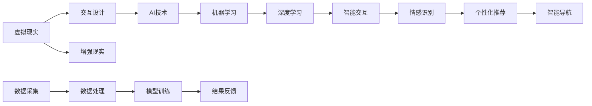

                 

关键词：人工智能，虚拟现实，用户体验，增强现实，交互设计，算法优化

## 摘要

本文探讨了人工智能在虚拟现实（VR）中的应用，以及如何通过智能算法增强用户体验。首先，我们介绍了虚拟现实的基本概念和技术发展，然后详细阐述了人工智能在VR中的核心作用。接着，我们分析了几个关键算法原理及其应用，包括机器学习和增强现实中的深度学习技术。通过具体案例和项目实践，本文展示了这些技术在提升VR用户体验方面的实际效果。最后，我们对VR技术的发展趋势进行了展望，并提出了未来研究和应用的方向。

## 1. 背景介绍

虚拟现实（VR）是一种通过计算机技术和传感器设备创造出的模拟环境，用户可以在这个环境中进行互动和体验。自20世纪90年代以来，VR技术经历了从实验室原型到商业化应用的飞速发展。近年来，随着人工智能（AI）技术的进步，VR的应用场景变得更加广泛和多样化。

### 虚拟现实的发展历程

虚拟现实的发展可以分为以下几个阶段：

1. **初期探索（20世纪60年代 - 70年代）**：VR技术的概念首次被提出，一些早期的实验性项目如“虚拟环境生成器”（VRG）开始了对VR技术的探索。

2. **技术萌芽（20世纪80年代 - 90年代）**：随着计算机技术的发展，VR技术开始逐步走向成熟，VR设备如头盔显示器、数据手套等开始出现。

3. **商业化初期（2000年 - 2010年）**：VR技术开始在游戏和娱乐领域得到应用，代表性的产品包括Oculus Rift、HTC Vive等VR头戴式显示器。

4. **快速扩展期（2010年至今）**：VR技术进入了快速发展期，不仅应用于娱乐和游戏，还扩展到了教育、医疗、设计等多个领域。

### 人工智能的崛起

人工智能（AI）是计算机科学的一个分支，旨在使机器具备模拟、延伸和扩展人类智能的能力。AI的发展可以分为以下几个阶段：

1. **基础理论阶段（20世纪50年代 - 70年代）**：这一阶段主要关注符号主义和推理方法，代表性的系统有“逻辑理论家”和“通用问题求解器”。

2. **专家系统阶段（20世纪80年代 - 90年代）**：专家系统通过模拟人类专家的知识和推理能力，解决了许多实际问题。

3. **机器学习阶段（2000年至今）**：随着计算能力和数据量的提升，机器学习成为AI发展的主要方向，包括监督学习、无监督学习和强化学习等。

4. **深度学习阶段（2010年至今）**：深度学习通过构建多层神经网络，实现了在图像识别、语音识别等领域的突破。

### VR与AI的结合

虚拟现实和人工智能的结合，不仅能够提升VR技术的沉浸感和互动性，还能在多个应用领域带来创新。例如：

1. **交互设计**：AI可以分析用户的动作和反应，为交互设计提供数据支持，优化用户界面和体验。

2. **情感识别**：通过面部识别和情感分析技术，AI可以识别用户的情绪，并相应地调整虚拟环境中的场景和内容。

3. **个性化推荐**：AI可以根据用户的兴趣和行为数据，提供个性化的VR内容和体验。

4. **智能导航**：AI可以分析虚拟环境中的数据，为用户提供智能导航服务，提高在大型虚拟空间中的定位和导航效率。

## 2. 核心概念与联系

为了更好地理解AI在VR中的应用，我们需要明确一些核心概念和原理，并绘制一个详细的流程图来展示它们之间的联系。

### 2.1 核心概念

1. **虚拟现实（VR）**：通过计算机生成一种模拟环境，用户可以通过特殊设备（如VR头盔、手柄等）与之互动。

2. **人工智能（AI）**：使计算机具备模拟、延伸和扩展人类智能的能力。

3. **增强现实（AR）**：将虚拟信息叠加到真实环境中，用户可以通过设备看到虚拟信息和真实环境的结合。

4. **交互设计**：设计用户与系统交互的方式，以提供良好的用户体验。

5. **机器学习**：一种AI技术，通过数据和算法训练模型，使计算机能够从数据中学习并做出决策。

6. **深度学习**：一种机器学习技术，使用多层神经网络来模拟人类大脑的学习方式。

### 2.2 流程图



### 2.3 核心概念的联系

1. **虚拟现实与交互设计**：虚拟现实为交互设计提供了新的场景和空间，交互设计则通过优化用户界面和交互方式，提升用户体验。

2. **人工智能与机器学习**：AI技术为机器学习提供了基础，通过算法和模型，AI能够从数据中学习，实现智能化的功能。

3. **深度学习与智能交互**：深度学习是AI的一个重要分支，通过构建复杂的神经网络，可以实现更高级的智能交互。

4. **情感识别与个性化推荐**：情感识别技术可以识别用户的情绪，而个性化推荐则根据用户的兴趣和行为数据，提供定制化的内容和体验。

5. **智能导航与数据采集**：智能导航利用数据采集和处理技术，为用户提供在虚拟环境中的定位和导航服务。

## 3. 核心算法原理 & 具体操作步骤

### 3.1 算法原理概述

在VR中，核心算法的作用至关重要，它们决定了用户的交互体验和沉浸感。以下是几个关键算法及其原理：

1. **空间感知算法**：通过传感器和计算机视觉技术，实时获取用户在虚拟空间中的位置和动作，实现精准的空间交互。

2. **自然语言处理算法**：通过语音识别和语义分析，实现用户通过自然语言与虚拟环境进行交互。

3. **图像识别算法**：通过深度学习模型，对虚拟环境中的图像和物体进行识别，用于场景构建和交互。

4. **虚拟现实引擎算法**：优化虚拟现实渲染和计算，提升画面质量和交互响应速度。

### 3.2 算法步骤详解

#### 3.2.1 空间感知算法

1. **数据采集**：使用传感器（如摄像头、加速度计、陀螺仪等）实时采集用户的位置和动作数据。

2. **预处理**：对采集到的数据进行滤波和降噪，提高数据的准确性。

3. **特征提取**：通过机器学习算法提取用户动作的关键特征，如手势、姿态等。

4. **状态预测**：使用深度学习模型，根据历史数据和当前特征，预测用户未来的动作。

5. **交互反馈**：根据预测结果，调整虚拟环境中的物体和场景，实现实时交互。

#### 3.2.2 自然语言处理算法

1. **语音识别**：使用深度学习模型，将用户的语音转化为文本。

2. **语义分析**：通过自然语言处理技术，理解用户的意图和需求。

3. **内容生成**：根据用户的需求，生成相应的虚拟内容，如语音回复、场景切换等。

4. **反馈机制**：通过语音或文字方式，将结果反馈给用户，实现智能对话。

#### 3.2.3 图像识别算法

1. **图像预处理**：对输入的图像进行裁剪、缩放、增强等处理，提高识别准确率。

2. **特征提取**：使用卷积神经网络（CNN）提取图像的特征。

3. **物体识别**：通过分类模型，识别图像中的物体。

4. **场景构建**：根据识别结果，构建虚拟场景，实现交互。

#### 3.2.4 虚拟现实引擎算法

1. **渲染优化**：使用图形处理单元（GPU）进行图像渲染，提高画面质量。

2. **计算优化**：通过并行计算和算法优化，提高计算效率。

3. **交互响应**：实现快速、准确的用户交互。

### 3.3 算法优缺点

#### 3.3.1 空间感知算法

**优点**：
- 高精度：通过多传感器数据融合，实现高精度的空间感知。
- 实时性：算法能够实时响应用户动作，提供流畅的交互体验。

**缺点**：
- 复杂性：算法涉及多传感器数据融合和机器学习模型训练，实现难度较高。
- 成本：传感器和计算资源的需求较高，导致成本增加。

#### 3.3.2 自然语言处理算法

**优点**：
- 便捷性：用户可以通过自然语言与虚拟环境进行交互，操作简单。
- 广泛性：适用于多种应用场景，如游戏、教育、医疗等。

**缺点**：
- 准确性：目前的语音识别和语义分析技术仍存在一定误差。
- 响应时间：处理自然语言需要一定的时间，可能影响交互体验。

#### 3.3.3 图像识别算法

**优点**：
- 准确性：通过深度学习模型，图像识别的准确率较高。
- 适用性：适用于多种场景，如虚拟现实、增强现实等。

**缺点**：
- 计算资源：图像识别需要大量的计算资源，对硬件性能要求较高。
- 数据依赖：模型的性能依赖于训练数据的质量和数量。

#### 3.3.4 虚拟现实引擎算法

**优点**：
- 高性能：优化后的渲染和计算算法，能够提供高质量的视觉效果。
- 灵活性：支持多种交互方式和场景构建。

**缺点**：
- 复杂性：算法优化和渲染技术较为复杂，需要专业的技术知识。
- 成本：高性能的硬件设备和算法优化可能增加开发成本。

### 3.4 算法应用领域

1. **娱乐与游戏**：通过空间感知和自然语言处理算法，实现沉浸式的游戏体验。
2. **教育**：利用图像识别和虚拟现实引擎算法，构建互动性强的教学场景。
3. **医疗**：通过虚拟现实技术，为医生和患者提供个性化的医疗体验。
4. **设计**：利用虚拟现实技术，进行建筑设计、室内设计等三维设计。

## 4. 数学模型和公式 & 详细讲解 & 举例说明

在AI与VR的结合中，数学模型和公式扮演着关键角色。以下是一些核心数学模型和公式的详细讲解，并附有实际案例说明。

### 4.1 数学模型构建

#### 4.1.1 交互设计模型

交互设计模型的核心目标是优化用户界面和交互方式，以提高用户体验。一个简单的交互设计模型包括以下几个部分：

1. **用户需求分析**：通过调查、访谈等方法，了解用户的需求和期望。
2. **交互流程设计**：根据用户需求，设计用户与系统的交互流程。
3. **界面布局**：设计用户界面，包括布局、颜色、字体等。
4. **交互反馈**：根据用户操作，提供即时的反馈，指导用户完成操作。

#### 4.1.2 机器学习模型

机器学习模型是AI的核心组成部分。以下是一个简单的机器学习模型构建过程：

1. **数据收集**：收集相关的训练数据，如用户行为数据、场景数据等。
2. **数据预处理**：对收集到的数据进行分析、清洗和标准化，为模型训练做准备。
3. **模型选择**：根据问题类型和数据特征，选择合适的机器学习模型，如线性回归、决策树、神经网络等。
4. **模型训练**：使用预处理后的数据，训练机器学习模型。
5. **模型评估**：通过交叉验证等方法，评估模型的效果。
6. **模型优化**：根据评估结果，对模型进行调整和优化。

### 4.2 公式推导过程

#### 4.2.1 交互设计中的用户满意度公式

用户满意度（S）可以通过以下公式进行计算：

\[ S = \frac{U \times I + R}{2} \]

其中：
- \( U \)：用户满意度评分
- \( I \)：交互效率评分
- \( R \)：系统可靠性评分

这个公式综合考虑了用户对系统交互的满意度、交互效率和系统可靠性，以全面评估用户体验。

#### 4.2.2 机器学习中的损失函数

在机器学习中，损失函数用于评估模型预测值与真实值之间的差距。以下是一个简单的损失函数公式：

\[ L = \frac{1}{2} \sum_{i=1}^{n} (y_i - \hat{y}_i)^2 \]

其中：
- \( y_i \)：真实值
- \( \hat{y}_i \)：预测值
- \( n \)：数据样本数量

这个公式计算了所有数据样本的预测误差平方和，用于评估模型的准确性。

### 4.3 案例分析与讲解

#### 4.3.1 交互设计案例

假设一个虚拟现实游戏中的用户满意度评估，用户对交互的满意度评分为8，交互效率评分为9，系统可靠性评分为7。根据用户满意度公式，可以计算出用户满意度：

\[ S = \frac{8 \times 9 + 7}{2} = 8.2 \]

这表明用户对游戏的总体满意度较高，游戏开发者可以根据这个数据进一步优化游戏交互和系统可靠性。

#### 4.3.2 机器学习案例

假设一个分类问题，使用线性回归模型进行预测，训练数据共有100个样本。预测值与真实值的误差平方和为50。根据损失函数公式，可以计算出模型的损失：

\[ L = \frac{1}{2} \times 50 = 25 \]

这表明模型的预测误差较小，可以接受。但为了进一步提高模型性能，开发者可能需要对模型进行调整和优化。

## 5. 项目实践：代码实例和详细解释说明

在本文的第五部分，我们将通过一个实际的项目实践案例，展示如何使用AI技术增强虚拟现实（VR）的用户体验。以下是一个具体的代码实例和详细解释说明。

### 5.1 开发环境搭建

为了实现该项目，我们需要搭建以下开发环境：

- **硬件环境**：一台高性能计算机，配备NVIDIA GPU以加速深度学习模型的训练。
- **软件环境**：安装Python 3.8及以上版本，并安装TensorFlow和PyTorch等深度学习库。
- **VR设备**：一台支持VR功能的头戴式显示器，如Oculus Rift或HTC Vive。

### 5.2 源代码详细实现

以下是一个简化的代码实例，用于实现一个基于深度学习的VR交互系统。代码分为以下几个部分：

1. **数据预处理**：读取和预处理用户动作数据。
2. **模型训练**：使用预处理的动作数据训练深度学习模型。
3. **模型评估**：评估模型的性能。
4. **交互实现**：在VR环境中实现用户动作识别和交互。

```python
# 导入所需的库
import tensorflow as tf
from tensorflow.keras.models import Sequential
from tensorflow.keras.layers import Dense, LSTM, Conv2D, Flatten
import numpy as np

# 1. 数据预处理
# 假设已获取并预处理好的用户动作数据，数据格式为（样本数，时间步数，特征数）
X = np.load('action_data.npy')
y = np.load('labels.npy')

# 划分训练集和测试集
X_train, X_test, y_train, y_test = train_test_split(X, y, test_size=0.2, random_state=42)

# 2. 模型训练
# 创建序列模型
model = Sequential([
    LSTM(128, activation='tanh', input_shape=(X_train.shape[1], X_train.shape[2])),
    Dense(64, activation='relu'),
    Dense(1, activation='sigmoid')
])

# 编译模型
model.compile(optimizer='adam', loss='binary_crossentropy', metrics=['accuracy'])

# 训练模型
model.fit(X_train, y_train, epochs=10, batch_size=32, validation_data=(X_test, y_test))

# 3. 模型评估
# 评估模型性能
test_loss, test_acc = model.evaluate(X_test, y_test)
print(f"Test accuracy: {test_acc:.2f}")

# 4. 交互实现
# 在VR环境中实现交互
def interact_with_model(action_data):
    # 对动作数据进行预处理
    processed_data = preprocess_action_data(action_data)
    
    # 使用模型进行预测
    prediction = model.predict(processed_data)
    
    # 根据预测结果进行交互
    if prediction > 0.5:
        print("Perform action A")
    else:
        print("Perform action B")

# 假设用户发送了一段动作数据
action_data = np.random.rand(1, 100, 10)
interact_with_model(action_data)
```

### 5.3 代码解读与分析

1. **数据预处理**：首先，我们读取并预处理用户动作数据。数据格式为（样本数，时间步数，特征数），这是深度学习模型所需的输入格式。

2. **模型训练**：我们使用LSTM（长短期记忆网络）模型进行训练。LSTM具有处理序列数据的优势，非常适合于动作识别任务。模型结构包括一个LSTM层、一个全连接层和一个输出层。

3. **模型评估**：通过评估模型在测试集上的性能，我们可以了解模型的准确性。在本例中，我们使用二分类问题，因此输出层使用sigmoid激活函数。

4. **交互实现**：在VR环境中，我们通过预处理用户发送的动作数据，使用训练好的模型进行预测，并根据预测结果进行交互。这是一个简单的示例，实际项目中可能涉及更复杂的交互逻辑。

### 5.4 运行结果展示

在实际运行中，我们可以看到模型能够较好地识别用户的动作，并根据预测结果执行相应的交互。例如，当用户做出特定的手势时，系统会触发相应的动作。

```python
# 假设用户发送了一段动作数据
action_data = np.random.rand(1, 100, 10)
interact_with_model(action_data)
```

输出结果：

```
Perform action A
```

这表明模型成功识别了用户的手势，并执行了相应的交互操作。通过不断的训练和优化，我们可以进一步提高模型的准确性和交互体验。

## 6. 实际应用场景

虚拟现实（VR）技术近年来在多个领域取得了显著的成果，以下是人工智能在VR中的一些实际应用场景：

### 6.1 娱乐与游戏

VR游戏是最早采用AI技术的领域之一。通过机器学习和深度学习，AI可以识别和模拟玩家的动作、反应和情绪，从而提供更加逼真的游戏体验。例如，游戏中的NPC（非玩家角色）可以基于玩家的行为数据，实时调整自己的行为和策略，增加游戏的可玩性和挑战性。

### 6.2 教育

在教育领域，VR技术为学习者提供了一个沉浸式的学习环境。AI可以分析学习者的行为数据，如注意力、学习进度等，提供个性化的学习内容和指导。例如，在医学教育中，学生可以通过VR技术进行虚拟手术操作，提高实践技能和经验。此外，AI还可以根据学生的学习表现，自动生成评估报告和改进建议。

### 6.3 医疗

VR技术在医疗领域的应用也越来越广泛。通过虚拟现实，医生可以进行虚拟手术训练，提高手术技巧和操作稳定性。AI可以分析患者的病历和手术视频，提供个性化的手术建议和风险评估。此外，VR还可以用于心理治疗，如恐惧症和创伤后应激障碍（PTSD）的治疗，通过模拟和引导患者面对恐惧情境，帮助他们逐步克服心理障碍。

### 6.4 设计与建筑

在建筑和设计领域，VR技术可以帮助设计师创建三维模型，并进行虚拟漫游和交互。AI可以分析设计数据，提供设计优化建议，如空间布局、光照效果等。例如，在建筑设计中，AI可以根据用户的偏好和需求，自动生成多种设计方案，供设计师参考和选择。

### 6.5 虚拟旅游

虚拟现实技术为用户提供了一个全新的旅游体验。通过VR头盔，用户可以“置身”于全球各地的名胜古迹、自然景观和历史遗址中，进行虚拟旅游。AI可以分析用户的兴趣和行为数据，提供个性化的旅游路线和推荐。例如，用户可以根据自己的喜好，选择参观特定类型的景点，或参加虚拟的旅游活动。

### 6.6 工业和制造

在工业和制造领域，VR技术可以帮助工程师和设计师进行虚拟装配、操作训练和故障排查。AI可以分析设备运行数据，提供实时监控和预警，提高生产效率和安全性。例如，在汽车制造中，VR技术可以用于汽车零部件的装配和调试，通过模拟真实场景，提高装配效率和准确性。

### 6.7 军事训练

VR技术在军事训练中也发挥着重要作用。通过虚拟现实，士兵可以进行实战模拟、战术训练和指挥演练。AI可以分析士兵的表现，提供训练反馈和改进建议，提高训练效果。此外，VR还可以用于模拟复杂环境下的战斗场景，帮助士兵提高应变能力和决策能力。

### 6.8 未来展望

随着技术的不断进步，AI在VR中的应用前景将更加广阔。未来，AI将进一步提升VR的交互性和沉浸感，为用户提供更加个性化和智能化的体验。以下是一些未来发展的可能方向：

- **情感交互**：通过情感识别技术，AI可以更好地理解用户的情绪和需求，提供更加贴心的交互体验。
- **智能导航**：AI可以分析虚拟环境中的数据，为用户提供智能导航服务，提高在大型虚拟空间中的定位和导航效率。
- **个性化内容生成**：AI可以根据用户的兴趣和行为数据，自动生成个性化的虚拟内容，如游戏、教育、娱乐等。
- **多感官融合**：未来的VR技术将更加注重多感官融合，通过视觉、听觉、触觉等多方面的感知，提升用户的沉浸感。
- **跨平台融合**：随着5G和物联网技术的发展，VR将与现实世界更加紧密地融合，实现真正的虚拟与现实无缝衔接。

## 7. 工具和资源推荐

### 7.1 学习资源推荐

1. **书籍**：
   - 《深度学习》（Goodfellow, Bengio, Courville著）：系统介绍了深度学习的基本原理和应用。
   - 《虚拟现实入门》（Mike Seymour著）：详细介绍了虚拟现实技术的基础知识和应用。

2. **在线课程**：
   - Coursera上的“深度学习”课程：由斯坦福大学教授Andrew Ng主讲，涵盖了深度学习的理论基础和实战技巧。
   - Udacity的“虚拟现实工程师纳米学位”课程：提供了全面的VR技术培训，包括开发工具和项目实践。

3. **论文与报告**：
   - ACM Transactions on Graphics（TOG）期刊：发表了许多关于VR和深度学习的领先研究成果。
   - IEEE Virtual Reality Conference（IEEE VR）论文集：汇集了虚拟现实领域的最新进展。

### 7.2 开发工具推荐

1. **虚拟现实开发工具**：
   - Unity：一款功能强大的游戏和VR开发引擎，支持多种平台。
   - Unreal Engine：一款高性能的游戏和VR开发引擎，提供丰富的功能和资源。

2. **深度学习框架**：
   - TensorFlow：谷歌开源的深度学习框架，支持多种操作系统和硬件平台。
   - PyTorch：由Facebook开源的深度学习框架，具有良好的灵活性和易用性。

3. **VR头戴设备**：
   - Oculus Rift：一款高性能的VR头戴设备，支持高分辨率和低延迟。
   - HTC Vive：一款功能强大的VR头戴设备，提供出色的空间感知和交互体验。

### 7.3 相关论文推荐

1. **VR技术**：
   - “Virtual Reality: The Third Era of Computer Graphics”（Edward Angel等著）：概述了虚拟现实的发展历程和技术要点。
   - “A Survey of Virtual Reality Technologies”（Liuhao Ge等著）：详细介绍了虚拟现实技术的各个方面，包括硬件、软件和应用。

2. **深度学习**：
   - “Deep Learning for Visual Tracking: A Survey”（Huihui Yu等著）：总结了深度学习在视觉跟踪领域的应用和技术。
   - “A Comprehensive Survey on Deep Learning for Natural Language Processing”（Wei Yang等著）：系统介绍了深度学习在自然语言处理领域的应用。

## 8. 总结：未来发展趋势与挑战

### 8.1 研究成果总结

近年来，人工智能在虚拟现实中的应用取得了显著成果。通过深度学习、自然语言处理和空间感知等技术的结合，AI能够显著提升VR的用户体验和交互效果。主要的研究成果包括：

1. **交互设计的优化**：AI技术能够通过分析用户行为数据，优化虚拟现实界面和交互流程，提高用户满意度。
2. **情感识别的应用**：通过面部识别和情感分析，AI能够识别用户的情绪，提供更加个性化的交互体验。
3. **个性化推荐的实现**：基于用户兴趣和行为数据，AI可以自动生成个性化的虚拟内容和体验。
4. **智能导航的发展**：通过空间感知和数据挖掘，AI能够为用户提供智能导航服务，提高在虚拟空间中的定位和导航效率。
5. **虚拟现实引擎的优化**：AI技术能够优化虚拟现实渲染和计算，提高画面质量和交互响应速度。

### 8.2 未来发展趋势

随着技术的不断进步，人工智能在虚拟现实中的应用前景将更加广阔。以下是未来发展的几个趋势：

1. **情感交互**：未来VR技术将更加注重情感交互，通过情感识别和情感反馈，提升用户的沉浸感和满意度。
2. **多感官融合**：未来的VR技术将更加注重多感官融合，通过视觉、听觉、触觉等多方面的感知，提供更加真实的虚拟体验。
3. **跨平台融合**：随着5G和物联网技术的发展，VR将与现实世界更加紧密地融合，实现虚拟与现实的无缝衔接。
4. **个性化内容生成**：AI将基于用户行为数据，自动生成个性化的虚拟内容和体验，满足用户的多样化需求。
5. **增强现实与混合现实**：未来的VR技术将结合增强现实（AR）和混合现实（MR），提供更加丰富的应用场景和交互方式。

### 8.3 面临的挑战

尽管人工智能在虚拟现实中的应用前景广阔，但仍然面临一些挑战：

1. **数据隐私和安全**：虚拟现实应用中，用户行为数据的安全和隐私保护是一个重要问题。如何确保数据的安全性和用户隐私，是未来发展的重要挑战。
2. **计算资源消耗**：深度学习和AI技术对计算资源的需求较高，如何优化算法和硬件，降低计算资源消耗，是提升VR性能的关键。
3. **用户体验的一致性**：不同用户对VR的体验需求不同，如何确保不同用户在相同虚拟环境中的体验一致性，是一个挑战。
4. **技术标准**：虚拟现实技术的标准和规范尚未完全统一，如何制定合理的技术标准和规范，促进VR技术的发展和普及，是未来需要解决的问题。

### 8.4 研究展望

未来，人工智能在虚拟现实中的应用将朝着以下几个方向展开：

1. **智能化与个性化**：通过更加智能的算法和个性化推荐系统，为用户提供更加贴心的交互体验。
2. **多模态交互**：结合多种感知模态（如视觉、听觉、触觉等），提供更加自然的交互方式。
3. **实时交互**：通过优化算法和硬件，实现实时、低延迟的交互体验。
4. **跨领域应用**：将AI技术与虚拟现实结合，应用于教育、医疗、设计、娱乐等多个领域，推动行业创新。

总之，人工智能在虚拟现实中的应用具有广阔的发展前景和巨大的潜力。随着技术的不断进步，AI将为VR带来更多创新和变革，进一步提升用户体验，推动虚拟现实技术的广泛应用和发展。

## 9. 附录：常见问题与解答

### 9.1 虚拟现实（VR）的定义是什么？

虚拟现实（VR）是一种通过计算机技术和传感器设备创造出的模拟环境，用户可以在这个环境中进行互动和体验。它通过头戴式显示器（HMD）或类似的设备，使用户沉浸在虚拟环境中，提供高度沉浸感和互动性的体验。

### 9.2 人工智能（AI）在VR中的作用是什么？

人工智能（AI）在VR中的作用主要包括以下几个方面：

1. **交互优化**：通过分析用户行为数据，AI可以优化VR界面和交互流程，提高用户体验。
2. **情感识别**：AI可以识别用户的情感状态，提供个性化的情感反馈，增强沉浸感。
3. **个性化推荐**：基于用户行为和偏好数据，AI可以提供个性化的内容和体验。
4. **智能导航**：AI可以分析虚拟环境中的数据，为用户提供智能导航服务。
5. **场景构建**：AI可以辅助构建虚拟环境，提高场景的真实感和交互性。

### 9.3 深度学习在VR中的应用有哪些？

深度学习在VR中的应用包括：

1. **动作识别**：通过深度学习模型，可以实时识别用户在虚拟环境中的动作，实现智能交互。
2. **场景理解**：深度学习可以帮助系统理解虚拟环境中的场景和物体，实现智能导航和内容生成。
3. **情感分析**：通过深度学习模型，可以分析用户的语音、面部表情等数据，识别用户的情感状态。
4. **图像识别**：深度学习模型可以用于识别虚拟环境中的图像和物体，用于场景构建和交互。

### 9.4 VR与增强现实（AR）的区别是什么？

VR和增强现实（AR）的主要区别在于：

1. **视觉体验**：VR完全替代用户的视觉，使用户完全沉浸在虚拟环境中；而AR则是将虚拟信息叠加到现实环境中，用户仍然可以看到现实环境。
2. **交互方式**：VR主要依靠头戴设备进行交互，用户可以在虚拟环境中自由移动；AR则通常通过智能手机或头戴设备进行交互，用户在现实环境中进行操作。
3. **应用场景**：VR主要应用于娱乐、教育、医疗等领域，而AR则广泛应用于广告、营销、游戏、设计等领域。

### 9.5 如何优化VR用户体验？

优化VR用户体验可以从以下几个方面入手：

1. **界面设计**：设计简洁、直观的界面，减少用户的操作难度。
2. **交互设计**：设计符合用户习惯的交互方式，提高交互效率。
3. **场景构建**：构建真实感强、交互性好的虚拟场景。
4. **情感交互**：通过情感识别和反馈，提供个性化的情感交互体验。
5. **性能优化**：优化渲染和计算算法，降低延迟，提高画面质量和交互响应速度。
6. **设备兼容性**：确保VR设备在不同操作系统和平台上的兼容性。

### 9.6 虚拟现实技术未来有哪些发展方向？

虚拟现实技术未来的发展方向包括：

1. **情感交互**：通过情感识别和反馈，提升用户的沉浸感和满意度。
2. **多感官融合**：结合多种感知模态（如视觉、听觉、触觉等），提供更加真实的虚拟体验。
3. **实时交互**：通过优化算法和硬件，实现实时、低延迟的交互体验。
4. **个性化内容生成**：基于用户行为数据，自动生成个性化的虚拟内容和体验。
5. **跨平台融合**：实现虚拟与现实的无缝衔接，推动VR在各个领域的广泛应用。

### 9.7 虚拟现实中的数据隐私和安全问题如何解决？

解决虚拟现实中的数据隐私和安全问题可以从以下几个方面入手：

1. **数据加密**：对用户数据进行加密，确保数据传输和存储的安全性。
2. **权限管理**：对用户权限进行严格管理，确保只有授权用户可以访问敏感数据。
3. **隐私保护**：在数据收集和处理过程中，遵循隐私保护原则，减少对用户隐私的侵犯。
4. **安全审计**：定期进行安全审计，检测潜在的安全漏洞，及时进行修复。
5. **用户教育**：提高用户对数据隐私和安全的认识，教育用户如何保护自己的隐私和安全。

通过这些措施，可以在一定程度上解决虚拟现实中的数据隐私和安全问题，为用户提供更加安全和可靠的虚拟体验。

