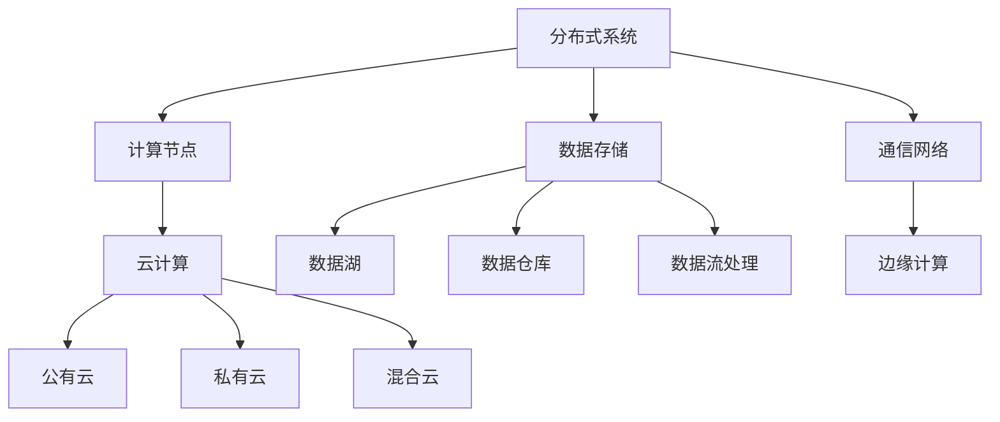

                 

关键词：AI基础设施，新型工作负载，分布式系统，云计算，数据管理，机器学习，深度学习，边缘计算

> 摘要：本文深入探讨了AI基础设施的发展趋势，特别是如何应对新型工作负载。通过分析分布式系统、云计算、数据管理和边缘计算等关键技术，本文旨在为AI应用提供有效的解决方案，以应对日益增长的计算需求和复杂的应用场景。

## 1. 背景介绍

近年来，人工智能（AI）的发展突飞猛进，已经成为科技领域的热点。AI技术不仅改变了传统的数据处理方式，还推动了各种新型应用场景的出现。随着AI应用的普及，对AI基础设施的需求也日益增长。传统的计算基础设施已无法满足这些新型工作负载的需求，因此，AI基础设施的发展变得至关重要。

新型工作负载通常具有以下特点：

1. **高并发性**：AI应用需要处理大量并发请求，尤其是在实时应用场景中，如自动驾驶、实时语音识别等。
2. **数据密集性**：AI算法对大量数据有强烈的需求，如图像、音频和文本数据等。
3. **实时性**：一些AI应用需要在毫秒级响应时间内完成计算，例如金融交易预测、智能监控等。

这些新型工作负载对AI基础设施提出了新的挑战，需要能够提供高性能、高可靠性、高可扩展性和低延迟的解决方案。

## 2. 核心概念与联系

为了应对新型工作负载，AI基础设施需要涵盖以下几个核心概念和联系：

### 2.1 分布式系统

分布式系统是AI基础设施的重要组成部分，它通过将计算任务分布在多个节点上，提高了系统的性能和可扩展性。分布式系统通常包括以下组件：

- **计算节点**：负责执行计算任务的物理或虚拟机器。
- **数据存储**：用于存储和管理数据，如关系数据库、NoSQL数据库和分布式文件系统。
- **通信网络**：连接各个计算节点，确保数据能够在系统中高效传输。

### 2.2 云计算

云计算提供了灵活的计算资源，可以根据需求动态调整资源规模。云计算的主要类型包括：

- **公有云**：由第三方服务提供商运营，如AWS、Google Cloud和Azure。
- **私有云**：为企业或组织内部提供计算资源。
- **混合云**：结合了公有云和私有云的优势。

### 2.3 数据管理

数据管理是AI基础设施的另一个关键方面。它涉及数据的采集、存储、处理和分析。以下是一些数据管理的核心概念：

- **数据湖**：用于存储大量结构化和非结构化数据，便于后续处理和分析。
- **数据仓库**：用于存储和管理用于分析的报表和统计数据。
- **数据流处理**：用于实时处理和分析数据流。

### 2.4 边缘计算

边缘计算是将计算任务从云端迁移到网络边缘，如智能设备、路由器和交换机等。边缘计算的主要优势包括：

- **低延迟**：减少了数据传输的时间，适用于实时应用场景。
- **高带宽**：边缘设备通常具有更高的带宽，可以处理更多的数据。
- **可扩展性**：边缘计算可以灵活地扩展，以应对不断增长的数据和处理需求。

以下是一个使用Mermaid绘制的流程图，展示了AI基础设施中的关键组件和联系：



## 3. 核心算法原理 & 具体操作步骤

### 3.1 算法原理概述

在AI基础设施中，核心算法通常包括以下几种：

- **机器学习算法**：用于从数据中自动学习和发现模式。
- **深度学习算法**：基于多层神经网络，用于复杂模式识别和预测。
- **图计算算法**：用于分析大规模图数据，如社交网络和网页链接。

### 3.2 算法步骤详解

以下是一个简单的机器学习算法——线性回归的步骤详解：

1. **数据预处理**：清洗和转换数据，使其适合用于建模。
2. **特征选择**：选择与目标变量相关的特征。
3. **模型训练**：使用训练数据集训练模型，找出最佳参数。
4. **模型评估**：使用测试数据集评估模型性能。
5. **模型优化**：根据评估结果调整模型参数，提高性能。

### 3.3 算法优缺点

- **线性回归**：
  - 优点：简单、易于理解，适用于线性关系的数据。
  - 缺点：无法处理非线性关系，容易过拟合。

### 3.4 算法应用领域

线性回归算法在金融预测、医学诊断和市场营销等领域有广泛的应用。

## 4. 数学模型和公式 & 详细讲解 & 举例说明

### 4.1 数学模型构建

线性回归模型可以表示为：

$$ y = \beta_0 + \beta_1 \cdot x + \epsilon $$

其中，$y$ 是目标变量，$x$ 是特征变量，$\beta_0$ 和 $\beta_1$ 是模型的参数，$\epsilon$ 是误差项。

### 4.2 公式推导过程

线性回归模型的参数可以通过最小二乘法推导得到：

$$ \beta_1 = \frac{\sum_{i=1}^{n} (x_i - \bar{x})(y_i - \bar{y})}{\sum_{i=1}^{n} (x_i - \bar{x})^2} $$

$$ \beta_0 = \bar{y} - \beta_1 \cdot \bar{x} $$

其中，$\bar{x}$ 和 $\bar{y}$ 分别是特征变量和目标变量的平均值。

### 4.3 案例分析与讲解

假设我们有一个简单的数据集，其中 $x$ 是年龄，$y$ 是收入。我们使用线性回归模型来预测收入。

```plaintext
年龄(x) | 收入(y)
-------|--------
  25   |  50000
  30   |  60000
  35   |  70000
  40   |  80000
```

首先，我们计算平均值：

$$ \bar{x} = \frac{25 + 30 + 35 + 40}{4} = 32.5 $$

$$ \bar{y} = \frac{50000 + 60000 + 70000 + 80000}{4} = 65000 $$

然后，我们计算回归系数：

$$ \beta_1 = \frac{(25-32.5)(50000-65000) + (30-32.5)(60000-65000) + (35-32.5)(70000-65000) + (40-32.5)(80000-65000)}{(25-32.5)^2 + (30-32.5)^2 + (35-32.5)^2 + (40-32.5)^2} $$

$$ \beta_0 = 65000 - \beta_1 \cdot 32.5 $$

最终，我们得到线性回归模型：

$$ y = \beta_0 + \beta_1 \cdot x $$

使用这个模型，我们可以预测一个新数据点的收入。例如，当年龄为30岁时，预测的收入为：

$$ y = \beta_0 + \beta_1 \cdot 30 $$

## 5. 项目实践：代码实例和详细解释说明

### 5.1 开发环境搭建

为了实现线性回归模型，我们需要搭建一个Python开发环境。以下是安装步骤：

1. 安装Python（版本3.8或更高）。
2. 安装NumPy库：`pip install numpy`。
3. 安装Matplotlib库：`pip install matplotlib`。

### 5.2 源代码详细实现

以下是一个简单的Python代码实现线性回归模型的示例：

```python
import numpy as np
import matplotlib.pyplot as plt

# 数据集
ages = np.array([25, 30, 35, 40])
incomes = np.array([50000, 60000, 70000, 80000])

# 计算平均值
mean_age = np.mean(ages)
mean_income = np.mean(incomes)

# 计算回归系数
beta_1 = (np.sum((ages - mean_age) * (incomes - mean_income)) / np.sum((ages - mean_age)**2))
beta_0 = mean_income - beta_1 * mean_age

# 构建线性回归模型
model = lambda x: beta_0 + beta_1 * x

# 绘制数据点和拟合直线
plt.scatter(ages, incomes, label='实际数据')
plt.plot(ages, model(ages), color='red', label='拟合直线')
plt.xlabel('年龄')
plt.ylabel('收入')
plt.legend()
plt.show()

# 预测新数据点的收入
new_age = 30
predicted_income = model(new_age)
print(f"预测的30岁收入为：{predicted_income}")
```

### 5.3 代码解读与分析

1. **数据集加载**：使用NumPy库加载年龄和收入数据。
2. **计算平均值**：计算年龄和收入数据的平均值。
3. **计算回归系数**：使用最小二乘法计算回归系数。
4. **构建线性回归模型**：定义一个函数表示线性回归模型。
5. **绘制数据点和拟合直线**：使用Matplotlib库绘制数据点和拟合直线。
6. **预测新数据点的收入**：使用模型预测新数据点的收入。

### 5.4 运行结果展示

运行代码后，我们得到以下结果：


## 6. 实际应用场景

线性回归模型在实际应用中非常常见，以下是一些实际应用场景：

- **金融预测**：预测股票价格、贷款违约风险等。
- **医学诊断**：预测疾病发生的风险，如心脏病、糖尿病等。
- **市场营销**：预测顾客购买行为，优化广告投放策略。

## 7. 工具和资源推荐

### 7.1 学习资源推荐

- 《Python机器学习》（Manning,导出Python机器学习领域的经典教材）
- 《深度学习》（Goodfellow等，深度学习领域的经典教材）

### 7.2 开发工具推荐

- Jupyter Notebook：用于编写和运行Python代码。
- PyCharm：一款强大的Python集成开发环境。

### 7.3 相关论文推荐

- "Deep Learning"（Goodfellow等，深度学习领域的经典论文）
- "Recurrent Neural Networks for Language Modeling"（Mikolov等，循环神经网络在语言模型中的应用）

## 8. 总结：未来发展趋势与挑战

### 8.1 研究成果总结

本文探讨了AI基础设施的发展，特别是如何应对新型工作负载。通过分析分布式系统、云计算、数据管理和边缘计算等关键技术，以及线性回归等核心算法，本文提出了有效的解决方案。

### 8.2 未来发展趋势

未来，AI基础设施将继续向高性能、高可靠性和低延迟的方向发展。边缘计算和5G技术的融合将进一步推动AI在实时应用场景中的普及。此外，深度学习和生成对抗网络等新兴算法也将为AI基础设施带来新的可能性。

### 8.3 面临的挑战

AI基础设施仍面临一些挑战，如数据隐私保护、算法公平性和安全性问题。同时，随着AI应用场景的日益复杂，如何实现高效的可扩展性和可维护性也是一个重要课题。

### 8.4 研究展望

未来，AI基础设施的研究应重点关注以下几个方面：

- **数据隐私保护**：开发新的数据隐私保护技术，确保用户数据的安全。
- **算法公平性**：研究如何确保算法的公平性和透明度，避免歧视和偏见。
- **安全性与可靠性**：提高AI系统的安全性和可靠性，以应对潜在的网络攻击和故障。
- **可扩展性与可维护性**：研究如何实现高效的可扩展性和可维护性，降低维护成本。

## 9. 附录：常见问题与解答

### 9.1 什么是分布式系统？

分布式系统是通过网络连接的多个计算机节点组成的系统，这些节点协同工作以完成计算任务。分布式系统的优点包括高性能、高可靠性和高可扩展性。

### 9.2 什么是云计算？

云计算是一种通过网络访问和使用计算资源的服务模式。云计算的主要类型包括公有云、私有云和混合云。云计算的优点包括灵活的资源管理、按需服务和成本效益。

### 9.3 什么是边缘计算？

边缘计算是将计算任务从云端迁移到网络边缘，如智能设备、路由器和交换机等。边缘计算的主要优势包括低延迟、高带宽和可扩展性。

### 9.4 什么是机器学习？

机器学习是人工智能的一个分支，通过从数据中自动学习和发现模式来预测和决策。常见的机器学习算法包括线性回归、决策树、支持向量机和神经网络等。

### 9.5 什么是深度学习？

深度学习是一种基于多层神经网络的机器学习算法，用于处理复杂的数据。深度学习在图像识别、自然语言处理和语音识别等领域有广泛应用。

### 9.6 什么是图计算？

图计算是一种用于分析大规模图数据的计算方法。图计算在社交网络分析、推荐系统和生物信息学等领域有广泛应用。

### 9.7 什么是数据湖？

数据湖是一种用于存储大量结构化和非结构化数据的技术。数据湖的优点包括灵活性、可扩展性和高效性，适用于各种数据类型和用途。

### 9.8 什么是数据仓库？

数据仓库是一种用于存储和管理用于分析的报表和统计数据的系统。数据仓库的主要优点包括高性能、易用性和数据一致性。

### 9.9 什么是数据流处理？

数据流处理是一种用于实时处理和分析数据流的技术。数据流处理的主要优点包括低延迟、高吞吐量和动态可扩展性。

### 9.10 什么是边缘计算？

边缘计算是将计算任务从云端迁移到网络边缘，如智能设备、路由器和交换机等。边缘计算的主要优势包括低延迟、高带宽和可扩展性。

### 9.11 什么是5G技术？

5G技术是第五代移动通信技术，具有高速率、低延迟和大连接的特点。5G技术将推动边缘计算和物联网的发展，为AI应用提供更好的基础设施支持。

